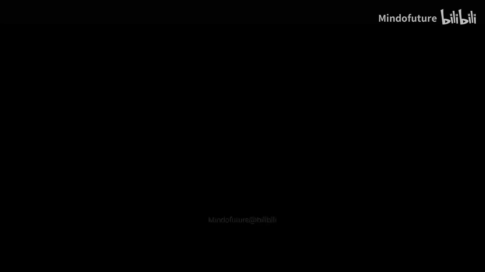
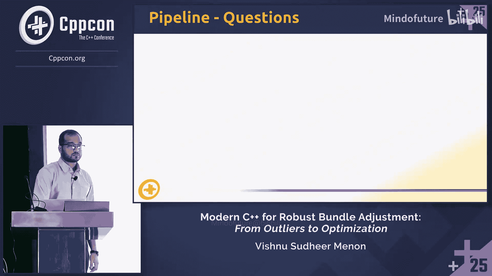
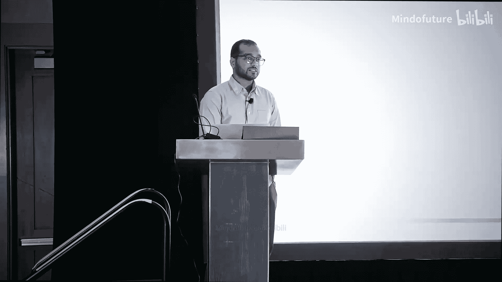

# 057：概述

在本教程中，我们将跟随Vishnu Sudheer Menon的演讲，学习如何利用现代C++构建一个**稳健、可扩展且适应性强**的视觉重建（Structure from Motion, SfM）管道。我们将重点关注如何处理多样化的数据集、有效剔除异常值，以及利用现代C++特性（如概念、并行算法和设计模式）来优化性能。整个管道将围绕光束法平差（Bundle Adjustment）这一核心优化技术展开。

---

## 现代C++能加速你的光束法平差管道吗？：2：视觉重建简介

上一节我们概述了本教程的目标。本节中，我们来看看视觉重建的基本概念。

视觉重建的目标是从一系列静态图像中推断出三维几何结构。本教程主要关注相机输入，但重建同样可以使用激光雷达、雷达或其他任何能提供距离和角度测量的传感器完成。

输入是**多张图像**，输出是一个**三维重建模型**。

面临的挑战包括处理缺失数据、遮挡、噪声和异常值，并确保管道能够处理多达百万级别的数据点。

下图展示了管道的三个主要组成部分：**相机**、**观测值**和最终的**三维模型**（即地标点）。三维模型是我们要映射的地标点。多个相机会观察三维模型的同一部分，以确保有足够的重叠区域，从而将测量值与观测值关联起来。观测值是图像平面上的信息，即像素坐标（u, v）。移动的相机（可以是一个或多个）会提供相机位姿，我们通过优化这些位姿来获得良好的重建结果。

一个关键点是，需要从多种不同角度观察物体，以获得良好的视角范围，从而能够正确地进行三角测量和位姿估计。

视觉重建的标准流程如下：
1.  **输入数据**：来自相机。
2.  **特征提取**：使用角点检测或方向梯度直方图等方法。
3.  **关联**：将每个观测值与一个地标点关联，从而建立多相机、多地标点的观测系统。
4.  **初始估计**：估计地标点和相机的初始位姿，为优化器提供起点。
5.  **修剪**：移除噪声数据或对其进行处理。
6.  **光束法平差**：最小化重投影误差。
7.  **重建**：生成最终的三维场景。

---

## 现代C++能加速你的光束法平差管道吗？：3：数据集介绍

上一节我们介绍了视觉重建的基本流程。本节中，我们将了解本教程所使用的数据集。

我们使用的数据集来自“Bundle Adjustment in the Large”项目，主要展示“Ladybug”和“Trafalgar Square”这两个数据集的结果。

这个数据集很有趣，因为它已经完成了**数据关联**，并提供了地标点和相机的**初始位姿**。它专为**中到大规模**问题设计，格式也很有特点：首先给出观测值（关联相机、地标点及其在图像平面上的位置），然后给出相机和地标点的位姿。

以下是两个数据集的统计信息：

**Ladybug 数据集**
*   **观测值数量**: > 500,000
*   **相机数量**: 1,700+
*   **平均重投影误差**: 3.8
*   **最大重投影误差**: 600 （表明存在长尾分布的异常值）
*   **每相机观测数**: 均值 363，最大 970
*   **每点观测数**: 最小 2，最大 145

**Trafalgar Square 数据集**
*   **观测值数量**: ~220,000
*   **相机数量**: 257
*   **最大重投影误差**: 456
*   **每相机观测数**: 均值 876，最大 4000
*   **每点观测数**: 范围 2 到 42

这两个数据集规模庞大，包含约50万个点。如果不处理其中的噪声和异常值，优化问题可能会变得非凸，难以求解。

---

## 现代C++能加速你的光束法平差管道吗？：4：投影管道

在深入代码之前，我们需要理解**投影管道**，因为它构成了整个优化器和异常值剔除模块的核心。

我们使用一个带有径向畸变的**针孔相机模型**。这意味着模型包含了相机镜头的曲率参数，可以在优化时加以考虑。

投影管道的工作流程非常简单直接：
1.  获取世界坐标系中的三维点。
2.  使用相机的旋转和平移（位姿），将该点转换到**相机坐标系**。
3.  将其投影到**归一化图像平面**（即假设深度Z=1，将X和Y除以Z）。
4.  应用**径向畸变**模型进行校正。
5.  使用焦距参数，得到最终的**像素坐标**。

这个管道之所以关键，是因为一旦你有了世界空间中一个三维点的估计值，就可以通过这个管道计算出它在图像平面上的**预测位置**。然后将这个预测值与图像平面上的**实际观测值**进行比较，其差值就是我们要优化的**重投影误差**。

---

## 现代C++能加速你的光束法平差管道吗？：5：整体管道设计

本节我们将介绍为实现**模块化**和**可扩展性**而设计的整体管道架构。

我们利用 **C++ 概念** 来建立策略的基础。通过概念，我们为每个模块设定了一组必须遵守的规则，这在管道与其交互的模块之间形成了一种“契约”。只要模块遵循这组规则，它就能轻松地与管道通信，用户甚至可以根据规则集切换不同的模块实现。

这使我们能够处理多种数据集（期望数据解析器遵循 `DataSetLike` 策略），在多种过滤方法（异常值剔除策略、空间过滤策略）和优化策略之间切换，并通过窗口策略来保证可扩展性。

管道本身采用**工厂设计模式**。使用运行时常量，我们可以在运行时切换不同类型的管道（例如平衡型与高性能型）。作为工厂，它期望用户编写继承自已定义基类的派生类，该基类明确了策略要求。这样做有两个好处：一是可以在运行时切换变体，二是可以在编译时检查用户的策略实现是否有效。

管道的主类是一个模板类，其中五个模板参数都有必须遵循的概念要求。值得注意的是，我们将数据集类型也传递给其他策略，以确保这些策略能够处理我们正在使用的数据类型。

管道的主要函数非常简单：生成窗口、执行异常值剔除、最后执行优化。我们期望各个模块来完成繁重的工作。

---

## 现代C++能加速你的光束法平差管道吗？：6：数据解析器

现在，让我们深入管道的第一个具体模块：**数据解析器**。

数据解析器的主要目标是读取数据集并产生管道可以处理的预期输出格式。由于这是一个开销较大的操作，我们使用了 `[[nodiscard]]` 关键字（如果用户意外调用而未使用返回值，编译器会给出警告或错误）和 `std::expected`（帮助进行异常处理）。

数据解析器类 `DataParser` 有三个主要目标：
1.  **基础过滤与预处理**：确保处理的数据是“干净”的。
2.  **数据标准化**：确保相机和地标点的数值范围大致相同。
3.  **转换为策略格式**：将数据转换为管道期望的策略格式。

以下是具体步骤：

**1. 过滤**
预处理步骤很直接：确保相机ID有效，并确保地标点转换到相机坐标系后与相机保持合理距离（例如0.1米到1米）。由于数据集很大，我们使用 `std::for_each` 并指定并行执行策略（这里使用了Intel TBB库）来加速处理。最后，移除观测次数不足（例如少于2或3次）的地标点。

**2. 标准化**
标准化的目的是避免数据集和相机的数值范围差异过大，否则优化器可能因变量变化幅度不同而导致非凸优化。我们使用**中位数绝对偏差**（MAD）进行标准化，使内点聚集在相近的范围内，而异常值则被“推离”。MAD比均值对异常值更稳健。同样，我们使用 `std::for_each` 和Intel TBB进行并行化。

**3. 策略格式**
我们定义了一个 `DataLike` 概念作为管道和数据解析器之间的API契约。它包含三个核心策略：
*   `CameraModelLike`: 要求模型有一个 `project` 函数（将点从相机坐标系投影到图像平面），并可能包含焦距、主点和畸变系数等参数。
*   `CameraLike`: 表示相机实体，包含其内外参数（位姿）和ID。
*   `ObservationLike`: 表示一个观测，关联一个相机、一个地标点，并提供该点在图像平面上的像素坐标。

`DataLike` 策略则要求数据集对象提供 `observations()`、`cameras()` 和 `points()` 函数，且返回类型需符合上述策略。我们还使用了 `std::unordered_map` 来存储从相机和地标点视角查询的观测数据，以加速优化过程。

---

## 现代C++能加速你的光束法平差管道吗？：7：日志与窗口策略

在进入核心的过滤和优化模块前，我们先看看两个支撑性的策略：日志和窗口。

**日志策略**
日志策略非常简单，只要求一个 `log` 函数。一个实现示例是 `CrossLoggingPolicy`，它使用类似 `CPP_DEBUG_INFO` 的宏。这里一个有趣的技巧是使用 `static_assert` 来在编译时检查日志实现是否仍然满足策略要求。需要注意的是，当前的实现期望日志消息本身携带源位置信息，未来可以改进为在策略中约束该字段。

**窗口策略**
窗口策略也很直接。我们目前使用**非重叠窗口**。为了简化，策略只要求一个 `generate_windows` 函数并返回窗口结果。窗口策略将大规模问题分解为可管理的小块，是保证管道可扩展性的关键。

---

## 现代C++能加速你的光束法平差管道吗？：8：异常值剔除策略

现在，我们进入处理数据噪声的关键环节：**异常值剔除**。我们采用了两阶段过滤策略。

异常值剔除策略要求实现一个 `reject_outliers` 函数，并返回一个包含统计信息（如内点、外点数量和内点比率）的结果。

**第一阶段：简单异常值过滤**
这个方法很直接：使用投影模型将地标点投影到图像平面，计算预测位置与实际观测位置之间的误差。如果误差超过某个阈值，则将该观测标记为异常值并忽略。

挑战在于处理超过50万个点。解决方案是**并行化**。观测在相机之间以及相机内部都是独立的。因此，我们可以在相机级别和观测级别进行并行处理：
*   使用 `std::execution::par` 在相机级别并行。
*   在每个相机内部，使用 `std::transform` 并行计算每个观测的重投影误差并标记异常值。

这种方法速度非常快。

**第二阶段：空间过滤**
为什么需要两阶段过滤？因为我们需要从两个不同的视角处理异常值：图像平面和世界坐标系。空间过滤在世界坐标系中进行，目标是使三维模型尽可能平滑。远离点群簇的点很可能是异常值。

空间过滤策略要求一个 `filter_spatially` 函数，接收数据集和相机窗口，并返回过滤结果。

实现思路是：对于每个地标点，找到其K个最近邻点，计算这些邻居点的均值和标准差，然后使用Z分数来判断该点是否为异常值（即是否远离邻居点的分布）。

直接计算所有点的最近邻非常耗时。我们使用 **Boost Geometry 的 R-tree** 来加速。R-tree 是一种空间索引，可以免费提供空间分组。我们将所有点加载到 R-tree 后，基于查询来高效地查找每个点的最近邻。

同样，我们可以并行化此过程，并且可以忽略已被第一阶段标记为异常值的点，只处理内点，以进一步提升速度。

一个值得注意的优化点是：当前实现是从相机-观测的角度遍历，但更高效的方式是直接从所有点的角度并行遍历。此外，可以假设局部区域内的点具有相近的均值并进行缓存，但这属于未来的改进工作。

**过滤结果**
*   **Ladybug 数据集**：过滤掉约3.3%的点，均值误差21，标准差36。
*   **Trafalgar Square 数据集**：过滤掉约8%的点，均值误差37，标准差19。

---

## 现代C++能加速你的光束法平差管道吗？：9：优化策略与基础实现

经过过滤，我们得到了更干净的数据。现在，进入管道的核心：**优化**，即光束法平差。

优化策略要求一个 `optimize` 函数，并返回一个包含成本、成本变化、成功状态和迭代摘要等信息的优化摘要。

优化的概念很直接：目标是减少整体的重投影误差。我们拥有观测值、相机位姿和地标点位姿。我们要求优化器通过微调相机位姿和地标点位姿（将观测值视为常数）来最小化重投影误差。

我们使用 **Ceres Solver** 库，它提供了自动微分功能。Ceres 使用泰勒展开将非线性问题线性化，形成正规方程：**H Δx = -J^T r**，其中 H 是海森矩阵，J 是雅可比矩阵，r 是残差。

光束法平差的一个优势是雅可比矩阵是**稀疏的**，因为每个残差只依赖于一个相机和一个地标点。我们可以利用**舒尔补**技巧，将问题压缩为只关于相机位姿的较小系统，求解后再反代回地标点，这能极大提升速度和内存效率。

Ceres 推荐使用 Levenberg-Marquardt 或 Dogleg 策略，这里主要使用 Levenberg-Marquardt，因为它采用了**信赖域策略**，可以防止在病态问题上步长过大。

**基础实现（简单光束法平差）**
在简单实现中，我们只优化当前非重叠窗口内的相机及其观测到的地标点。窗口外的观测被完全忽略。

以下是实现步骤：
1.  使用 `std::views` 遍历窗口内的相机，将其参数（位姿、内参）存储到 `std::vector` 中。
2.  将指向该向量数据的指针作为**参数块**传递给 Ceres。
3.  对地标点进行类似操作。
4.  使用四元数表示旋转（比旋转矩阵更稳定），并通过 Ceres 的**流形**（Manifold）约束（如 `QuaternionManifold`）来确保优化过程中四元数保持单位长度，从而代表有效的旋转。
5.  定义残差块，将观测值、相机参数和地标点参数关联起来。
6.  调用 Ceres 求解器进行优化。
7.  遍历参数向量，用优化后的新值更新数据集中的相机和地标点。

然而，这种简单实现有一个问题：重投影误差可能爆炸式增长。这是因为我们错误地假设了每个窗口的问题是独立的。实际上，地标点可能被多个窗口的相机观测到。

---

## 现代C++能加速你的光束法平差管道吗？：10：高级优化技巧

为了解决简单实现的问题，我们引入了几项高级优化技巧。

**1. 优化所有相机，但固定窗口外相机**
我们不再只添加窗口内的相机，而是添加数据集中的所有相机，但将窗口**外**的相机参数**设为常量**。这样，优化器只优化窗口内的相机位姿。当窗口滑动时，我们再更新常量和变量的设置。这更好地利用了相机间的约束。

**2. 引入参数边界**
为优化变量（如焦距）设置上下界，以限制求解器的搜索空间。为了使管道更通用，可以预处理数据集，根据数据范围动态设置边界，而不是硬编码。

**3. 利用窗口外的观测**
我们不仅考虑当前窗口内的观测，也考虑地标点在其他窗口（即被其他相机观测到）的观测，但将这些“外部”相机设为常量。这样，这些观测可以起到“锚定”地标点的作用，防止其在当前窗口的优化中漂移得太离谱。

**4. 窗口内观测支持度**
引入 `in_window_support` 参数：如果一个地标点在当前窗口内只有一个观测，则不优化它（或忽略该观测）。因为单个观测无法提供足够的约束，容易陷入局部最优，并影响后续窗口的优化。

**5. 参数排序**
为了有效利用舒尔补，Ceres 期望雅可比矩阵中相机参数在上部，地标点参数在下部。我们可以通过设置**参数排序**（`ParameterBlockOrdering`）来显式指导求解器，从而加速求解。

**6. 内迭代**
除了联合优化，可以尝试**内迭代**：先进行几次主迭代（优化所有变量），然后固定相机只优化地标点（或反之）进行一系列内迭代。每个子问题更简单，但重复使用可能不准确的雅可比矩阵有风险，需要谨慎使用。

**7. 损失函数**
尝试不同的损失函数来处理异常值：
*   **Huber损失**：在阈值内是二次损失，阈值外是线性损失。减少异常值的影响。
*   **Cauchy损失**：在阈值内是二次损失，阈值外是对数损失。对异常值的抑制更强。
需要调整阈值以平衡收敛速度和异常值鲁棒性。

**8. 自定义损失函数**
不推荐自定义损失函数，因为需要提供残差的一阶、二阶甚至三阶导数，实现复杂且容易出错，收益往往小于付出。

应用这些技巧后，平均重投影误差变得可以接受，管道能够有效处理异常值并生成合理的三维模型。虽然边缘仍有一些噪声，但这可以通过进一步调优来解决。

---

## 现代C++能加速你的光束法平差管道吗？：11：总结与问答

在本教程中，我们一起学习了如何利用现代C++构建一个稳健的视觉重建管道。我们涵盖了从视觉重建基础、数据处理、到利用C++概念和设计模式实现模块化管道，再到两阶段异常值剔除（图像平面和空间过滤），以及使用Ceres Solver进行高级光束法平差优化的完整流程。

关键要点包括：
*   **模块化**：使用C++概念定义策略契约，实现高度可配置的管道。
*   **性能**：利用并行算法（`std::execution::par`）和空间索引（Boost R-tree）处理大规模数据。
*   **鲁棒性**：通过两阶段过滤和合适的损失函数（Huber, Cauchy）有效处理异常值。
*   **优化**：利用Ceres Solver及其高级特性（舒尔补、参数排序、内迭代、流形约束）解决大规模BA问题。

**问答环节摘要**
*   **数据关联**：本教程使用的数据集已预先完成关联，过滤是为了处理关联中可能存在的错误。
*   **工厂模式与对象管理**：工厂模式用于灵活创建管道变体，对象管理可根据具体场景选择栈或堆分配。
*   **传感器偏差**：如果某个相机的观测远多于其他相机导致结果偏向它，可以在优化模块中为不同相机的残差引入**权重**（信息矩阵/协方差矩阵），以平衡其影响。
*   **尺度**：重建结果具有已知尺度，通过MAD标准化使其处于合理观察范围。
*   **固定内参**：如果所有图像来自同一相机，可以约束所有相机的内参相同，这是一个有价值的改进方向，但本教程未实现。
*   **并行化细节**：在空间过滤中，由于操作对象是点，且涉及R-tree查询，并行化需要仔细处理线程安全。对于已过滤掉的点或当前窗口外的点，可以避免不必要的处理来提升效率。

通过结合现代C++的强大特性和成熟的优化库，我们可以显著加速并增强光束法平差管道的性能和鲁棒性。