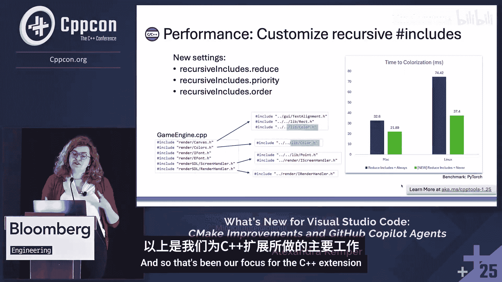
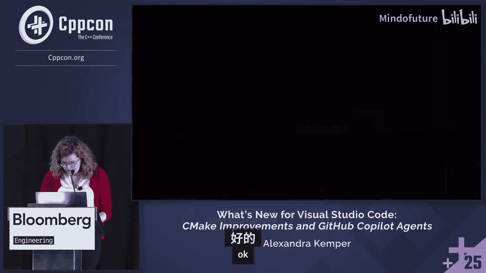

# 058：VS Code 中的新功能、CMake 改进与 GitHub Copilot 智能体

在本课程中，我们将学习 Visual Studio Code 中针对 C++ 开发的最新改进。我们将重点介绍 C++ 扩展的性能提升、CMake 工具扩展的新功能，以及如何利用 GitHub Copilot 及其智能体来显著提升你的开发工作流效率。

---

## C++ 扩展的性能提升

过去一年，我们的核心工作重点是提升 C++ 扩展的性能，特别是在处理大型项目时。我们收到了许多关于项目启动和代码着色速度的反馈，并对此进行了大量优化。

具体来说，我们主要提升了两个关键指标：
*   **项目启动时间**：C++ 扩展启动所需的时间。
*   **代码着色时间**：打开文件后，语法和语义高亮（例如变量着色、IntelliSense 可用）所需的时间。

通过一系列增量改进，我们取得了显著成果。在模拟大型开源代码库的 PyTorch 项目中，平均而言：
*   项目启动时间提升了 **3.5 倍**。
*   代码着色时间提升了 **4 倍**。

这些改进是如何实现的呢？我们进行了多项优化，例如：
*   缓存 IntelliSense 配置，避免每次启动时重新解析。
*   改进了对 `compile_commands.json` 文件的支持和处理。
*   支持多个编译命令数据库。
*   优化了配置处理逻辑。
*   在文件发现过程中并行化了许多任务。

如果你想了解所有增量改进的详细信息，可以查阅幻灯片中链接的博客文章。

除了这些通用优化，我们还增加了更多自定义选项。现在，你可以自定义递归包含路径的处理方式。这对于配置 IntelliSense（它为代码着色、悬停提示等编辑功能提供支持）至关重要。

每次打开文件时，扩展都会递归搜索该文件的所有子目录以查找包含文件，这可能非常耗费资源。现在，你可以根据项目的实际文件树结构，通过三个新设置来定制此行为。例如，在 PyTorch 项目中，通过优化这些设置，我们在 Linux 机器上将文件着色时间从 74 秒降低到了 37 秒。

请注意，这些自定义设置的效果因代码库而异，而上一节提到的性能提升则适用于所有类型的配置。

---

## CMake 工具扩展的改进

上一节我们介绍了 C++ 扩展的性能优化，本节中我们来看看 CMake 工具扩展有哪些新功能。我们将以一个名为 VCMI（一款开源游戏引擎）的项目为例，更新其构建脚本。

首先，我们来看一个常见的多根工作区场景。在 VS Code 中，你可能同时打开了多个包含 `CMakeLists.txt` 的文件夹。过去，所有这些文件夹的 CMake 项目都会出现在 CMake 项目大纲中，造成干扰。

现在，你可以从 CMake 大纲中排除特定的文件夹，而无需将它们从文件资源管理器中移除。操作步骤如下：
1.  打开设置。
2.  搜索 `cmake.exclude`。
3.  列出你希望排除的文件夹路径。

这样，被排除的文件夹就不会出现在 CMake 项目大纲中，让你能专注于与当前构建相关的文件。

接下来，我们看看 CMake 预设的更新。CMake 预设是一组可针对特定目标平台定制的配置。VCMI 项目包含许多针对不同平台和依赖管理器的预设。

CMake 工具扩展现在支持 **CMake 预设版本 3**。新版本引入了一些实用功能：
*   **添加注释**：现在你可以在预设的 JSON 文件中为特定配置添加描述性注释，例如说明其用途或使用场景。
*   **集成 Graphviz**：Graphviz 是一个开源的图形可视化工具，可以生成项目的依赖关系图。现在，你可以在预设中直接指定生成 `.dot` 文件，CMake 会自动为你创建包含项目目标和外部库依赖关系的图表。

要查看生成的依赖图，你可以使用 `dot` 命令将 `.dot` 文件转换为图像格式（如 PNG）。这有助于你直观地理解项目的结构，并检查链接是否正确。

此外，CMake 语言服务也得到了增强。现在，当你将鼠标悬停在 CMake 变量上时，看到的提示信息是由 CMake 工具扩展本身提供的，而不是第三方工具。这提供了更快、更准确的上下文信息。

---

## 利用 GitHub Copilot 辅助开发

在了解了基础工具的改进后，我们来看看如何利用 AI 来辅助开发。GitHub Copilot 及其聊天功能可以帮你处理许多样板代码和手动任务。

在编辑 CMake 文件时，你可以使用 Copilot Chat 的“询问”模式来获取建议。例如，你可以询问如何更新构建流程以增加基于目标的开发。Copilot 会根据你当前打开的文件和选中的代码自动获取上下文，并提供一系列建议。

在编写代码时，你会注意到灰色的内联补全文本。这些代码补全现在使用了 GPT-4.1 模型，该模型在更多 C++ 代码上进行了训练，因此提供的建议比以往更贴合 C++ 代码库的实际情况。

另一个新功能是“下一个编辑建议”。这不同于内联补全，它能识别你的编辑模式，并主动提供多行更改建议。例如，如果你开始将一处定义改为目标编译定义，它会预测你可能想对文件中所有类似的地方进行相同的更改，让你可以通过 Tab 键快速接受一系列修改。

VS Code 还有一个通用的新功能：你可以直接在编辑器中暂存单行更改，而无需保存整个文件后再在 Git 视图中挑选。通过点击行号旁的“+”箭头，你可以增量式地暂存更改，并可以自定义差异装饰的显示方式（例如，仅显示工作树中的更改或暂存区中的更改）。

---

## 使用 Copilot 智能体从零构建项目

前面的演示展示了工具和 Copilot 聊天如何辅助现有项目的修改。但如果你想从头开始构建一个新项目呢？手动操作或逐条询问 Copilot 可能效率不高。这时，Copilot 智能体就能大显身手了。

智能体与普通聊天模式的主要区别在于：
*   **更高层级的操作**：它们可以处理更复杂的工作流。
*   **调用工具**：例如，可以运行命令行工具、调用编译器或调试器。
*   **异步工作**：可以独立于你的操作运行。
*   **多文件编辑**：能够同时编辑多个文件。

让我们通过一个实际例子来体验：从头构建一个 C++ 项目，用于分析代码库中的头文件包含关系并生成 Graphviz `.dot` 文件。

首先，我们可以利用两个新功能：
1.  **Copilot 指令文件**：这是一个包含你编码偏好的文件（例如，使用现代 C++、C++20 标准、命名规范等）。这个文件的内容会自动附加到你与 Copilot 的每次交互中，确保生成的代码符合你的习惯。
2.  **提示文件**：这是一个包含具体任务描述的文件（例如，“创建一个 C++20 项目，分析代码包含关系并生成 `.dot` 文件”）。你可以重复使用这个文件来执行相同任务。

在智能体模式下，Copilot 会首先制定一个待办事项列表，然后逐步执行。它会创建项目结构、实现代码，并进行测试。当需要运行命令行命令（如配置和构建项目）时，智能体会请求你的批准。如果遇到错误（如预设名称不匹配），它会尝试自行排查和修复，而不是立即向你求助。

通过这种方式，智能体可以在短时间内（例如十分钟内）完成一个功能完整的项目，包括解析文件、生成依赖图和成功构建。

除了这种交互式的“智能体模式”，还有 **GitHub Copilot 编码智能体**。这个专门的智能体被训练来编写代码和创建拉取请求。它的工作方式是异步的：你给出一个高级指令（如“将图表中的所有节点颜色改为蓝色”），它会自动创建分支、修改代码、测试，并最终为你创建一个待审核的 PR。它不会在未经你批准的情况下直接推送代码。

更进一步，你还可以使用 **代码审查智能体**。在创建 PR 后，你可以请求 Copilot 对其进行审查。它会分析代码，指出潜在问题（如低效操作），并提供具体的修复建议代码。这可以作为代码审查的第一道防线，节省团队成员的时间。

---

## 总结与展望

本节课中我们一起学习了 VS Code 中 C++ 开发工具链的多项重要更新。

我们首先看到了 C++ 扩展在项目启动和代码着色方面的显著性能提升，以及如何通过自定义递归包含路径来进一步优化大型项目。

接着，我们探讨了 CMake 工具扩展的改进，包括从项目大纲中排除文件夹、支持 CMake 预设版本 3 的新功能（如注释和 Graphviz 集成），以及增强的 CMake 语言服务。

然后，我们深入了解了如何利用 GitHub Copilot 的聊天、代码补全和下一个编辑建议功能来辅助日常编码和 CMake 脚本修改。

最后，我们演示了 Copilot 智能体的强大能力，包括使用指令文件和提示文件、通过交互式智能体模式从零构建完整项目，以及利用异步的编码智能体和代码审查智能体来自动化代码修改与审查流程。

AI 在开发工具中的集成正在快速演进。GitHub Copilot Chat 现已开源，你可以对其进行定制。模型选择也更加灵活，除了 GPT 系列，还可以选择 Claude、Gemini 等，甚至可以通过 API 密钥接入自己或公司训练的专属模型。通过模型上下文协议，你还可以构建和连接自定义工具。

我们正在开发更专业的 C++ 智能体，以更好地理解 C++ 代码库和复杂的构建系统。我们鼓励你尝试这些新功能，让 Copilot 处理那些繁琐的样板工作和手动任务，从而使你能更专注于真正感兴趣和有价值的编码工作。