# 059：AI世界中的软件塑造 🛠️

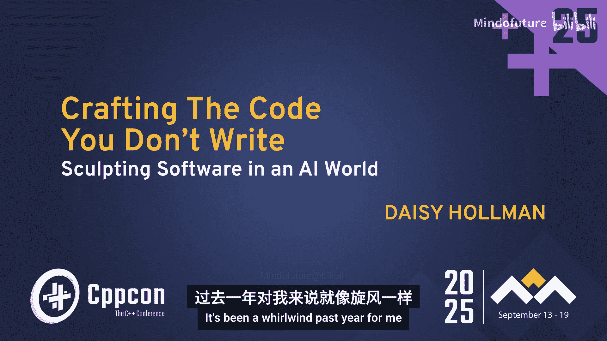

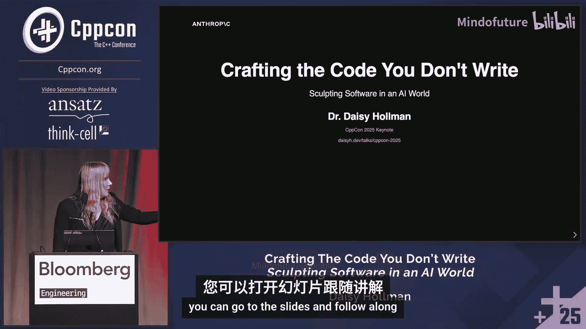

## 概述

在本节课中，我们将学习大型语言模型和AI编码助手的基本原理、工作机制，以及如何有效地将它们作为工具融入现代软件开发流程。我们将探讨从基础的Transformer架构到现代智能体（Agent）的演进，并重点分析如何为AI时代编写更健壮、更易理解的代码。

---

## 章节 1：引言与背景

过去一年对我来说是旋风般的一年。我最终进入了一个从未想过会涉足的行业。

对于那些认识我的人来说，我现在在Anthropic工作，负责Claude Code这个产品。你们中的一些人可能听说过它。如果没有，希望在这次演讲后你能有所了解。

Matt Godbolt向我展示了他是一个多么狂热的用户，他目前正在前排使用Claude Code。这很好。

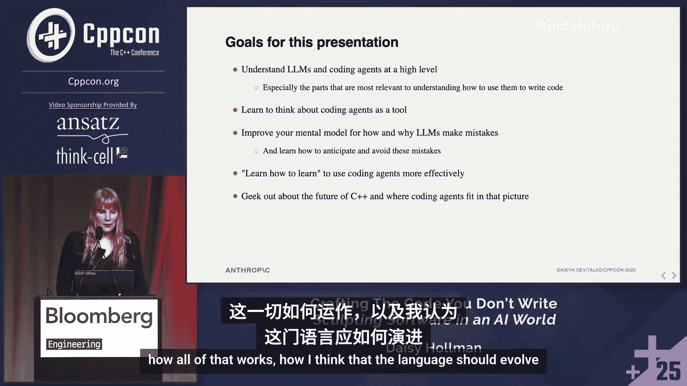

我的幻灯片在这里。如果你想跟着看，它们是实时更新的，并且与这里的内容匹配。所以，如果你在屏幕上阅读任何内容有困难，尤其是从房间后排，你可以打开幻灯片跟着看。

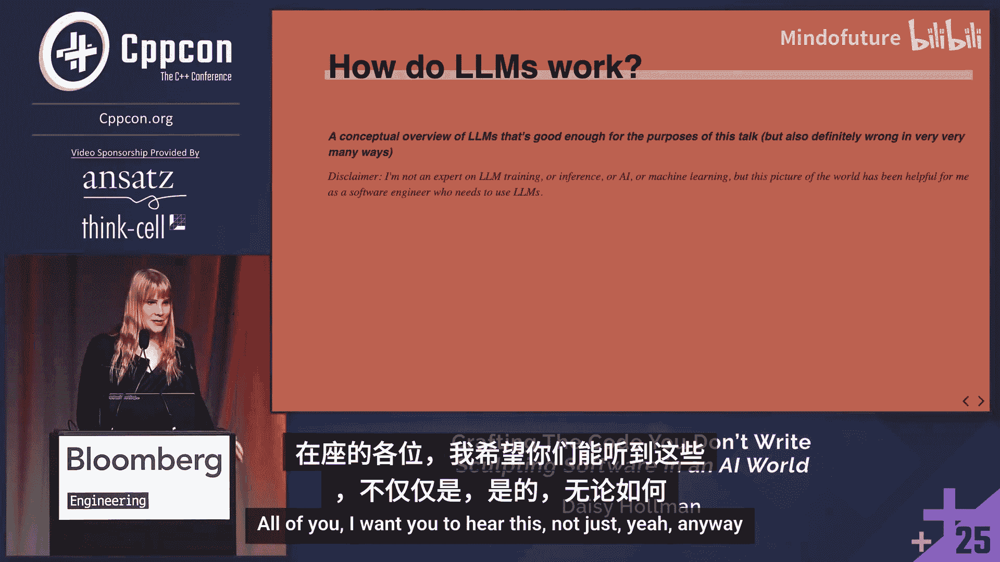

这是为会议准备的漂亮的缩略图幻灯片。

我是谁呢？John刚才简单介绍了我。我是一名长期的C++标准委员会成员。我参与撰写了C++17、20、23、26中的一些特性（26尚未正式批准），并且很可能我参与贡献的一些特性会进入C++29。

以下是我在委员会任职期间参与的一些工作。我曾担任SG9（Ranges）的主席。我不想自夸，但在C++特性中，Ranges算是“C++中的C++”了。我有幸担任过这次会议的主席，非常享受那段经历。

我曾做过名为“C++小技巧”的演讲，内容涉及C++的深奥角落。我说这些只是想表明，我和你们一样，是C++社区的一员。C++一直是我生活中很重要的一部分。

现在，我在AI领域工作。如果你们对我作为一个“局外人”来这里谈论AI、谈论我所看到的编程未来持怀疑态度，我希望通过这张幻灯片让你们相信，我并非局外人。这是我的世界。我非常感谢这次会议对我职业生涯所做的一切。

需要澄清的是，这并非终点。但我现在确实在从事AI工作，研究编码智能体。

让我们简单谈谈房间里的大象。目前，AI是一个有点两极分化的话题。我认识到这一点。我在这里不是为了讨论这个。有很多关于AI伦理和社会影响的优秀会议。这是一个技术会议。我很乐意在走廊或喝咖啡时讨论那些话题。

在这里，我真正想关注的是技术方面。我不是来说服你们AI编码智能体会改变软件工程的工作方式，或者说“氛围编码”是软件的未来，你们应该忘记代码质量。总的来说，我不是来谈论社会影响或环境影响的。

我想提前说明，我非常关注AI、编码智能体以及智能体整体对环境的影响。我认为，目前行业的一个借口是，我们认为AI将在未来两年加速清洁能源的发展。但这有一个时间限制。我认为，如果我们没有真正看到这种情况发生，很多人会离开这个行业。

所以，这个话题有很多人非常关心环境影响。我希望有更多时间讨论这个，但在这个演讲中，我想重点讨论的是：如何在一个你对AI在世界上有多少控制力有限的世界里帮助你茁壮成长。

没有人有能力阻止AI的进步。你可以对是否应该发生持有意见。但现实是，作为一名软件工程师，它将会影响你的生活。我想尽我所能帮助你在那个世界里茁壮成长。

本次演讲的目标：
*   帮助你从高层次理解LLM，特别是对编写代码非常重要的部分。
*   让你真正拥有一个概念框架，了解如何将编码智能体作为工具使用。
*   我将交替使用编码智能体、AI、LLM等术语。行业也在这些术语间摇摆，其中很多带有商业价值。我试图在技术意义上使用它们。
*   改进你对LLM工作原理、训练方式以及它们为何会犯错的心智模型，以便你能学会预测这些错误、避免它们，并更有效地使用编码智能体。
*   和我所有的演讲一样，我希望你学会如何学习。当事情出错或做对时，我希望你理解如何找出原因，以便改进、迭代并变得更好。我认为这对于编码智能体尤其困难。
*   我也想畅想一下C++的未来，以及编码智能体如何融入那个未来，语言应该如何演进。

我有很多材料要讲。我会尽量讲得不那么快，但我真的有很多话想说，因为我非常关心这个社区，我希望你们都能听到这些很酷的东西。

---

## 章节 2：LLM基础：从Transformer到智能体

我将用一个时间线来构建这部分内容，让你对现代AI的发展脉络有个概念。但这并非对AI具体历史的全面概述。

这一切都始于Transformer架构。这是当今无处不在的大型语言模型的基本架构。我将分三部分来解释它。

### 输入层

我想介绍的第一层是输入层。这可能是作为开发者需要理解的最重要的一层，因为你能够控制的大部分内容都将放在这里。

在这里，我们将**标记**（token）转换为**向量**（vector）。我们将语言转化为数字，以便LLM能够基于此进行预测。

它使用一个固定大小的**词汇表**，以及一个固定的**上下文长度**或**上下文窗口**。这是两个重要的变量。它基本上是将词汇和位置编码到上下文窗口中。现在的编码方式比最初开始时复杂得多，但这是2017年开创这一切的论文中的基本架构。

还有一个你可能听说过的第三件事，叫做**嵌入维度**。这基本上是模型进行所有转换的“工作维度”。要使用LLM，你并不真的需要理解它，但如果你听到这个词，就知道人们在谈论什么。

不过，这里最重要的收获是：**上下文窗口限制了模型在任何给定时间可以考虑的信息量**。它是你可以输入模型以预测下一个标记的标记数量。这基本上框定了我们在LLM之上构建的几乎所有东西，尤其是对于我们这些不直接参与AI的C++程序员来说。我们在AI之上构建的大部分内容都涉及对这个上下文窗口进行工程化并有效利用它。它是模型的输入层。

那么，我们如何仅用一个上下文窗口来制作一个聊天机器人呢？这令人震惊地原始。

我们基本上这样写：`Human:` 然后放上你说的话。然后我们放上 `Assistant:`，这就是我们开始让模型完成回答的地方。当模型觉得完成或回答了问题时，它会说 `Human:` 然后停止。

这就是我们输入的文字。简单得令人震惊。我认为贯穿本次演讲的一个主题是，AI涉及的很多技术都处于起步阶段，属于“低垂的果实”领域。

我们确实会做一些清理工作，因为当人们意识到这一点时，首先尝试做的事情就是在提示中键入 `Human:` 或 `Assistant:` 来试图迷惑它。但基本上，这就是目前正在发生的事情。自LLM时代开启以来，它并没有太大变化。

但这也意味着我们的对话会很快变得非常长。之前对话中的所有内容都会贡献给你正在使用的上下文窗口，这意味着它们都是你输入的一部分。因此，当你试图精心设计输入给模型的内容以获得最佳输出时，你必须考虑所有这些内容都在同一个上下文窗口中。

### Transformer与注意力机制

Transformer是现代LLM的关键。基本上，它们允许你在输入中相距较远的、相关的标记之间建立连接。

其数学结构非常有趣，但我认为数学结构无助于你理解编码所需的知识。你需要知道的是，注意力机制正在建立我们大脑自然也会建立的、事物之间的联系。

例如，我们有这个句子：“The student who had studied diligently for weeks, despite the numerous distractions and challenges, finally passed the exam.” 在座的几乎每个人都能解析这个句子，对吧？但在2017年，我们还没有能够做到这一点的语言模型，因为它们难以关联相距较远的事物。

注意力机制真正赋予了模型能力去说：“哦，`student` 和 `passed` 是相关的。我们谈论的是学生，`passed` 是与学生相关，而不是与 `challenges` 或 `distractions` 相关。” 如果你实际查看模型第一层的注意力矩阵，你实际上可以看到这些连接对之间的块具有更高的幅度。

这个模型有很多层。一旦过了第一层，我们就在连接“连接”，或者连接一个抽象概念和另一个抽象概念。有很多很多这样的层。但它始于连接词语，然后连接这些连接，等等。事实证明，这种方法效果出奇地好。

### 输出层与采样

第三层也很重要，实际上你也有一定的控制权（如果你直接查询API的话），但不多，而且差别不大。这就是我们如何选择下一个标记。

模型运行完整个预测机制后，会得出一个基本上转化为下一个标记概率分布的东西。然后模型基于这个分布选择下一个标记。这叫做**采样**。

通常模型有一个叫做**温度**的参数，控制采样的随机性。较低的温度更确定性，更常选择最可能的标记；较高的温度更有创造性和随机性，但一致性较差，会时不时选择不那么可能的标记。这对于完成某些工程任务实际上非常重要。找到合适的温度更多是靠感觉，我们没有很好的理论理解为什么是这样。在大多数模型中，我发现编码的理想温度大约在0.6到0.7之间。但如果你想写诗，可能要到0.95左右。这确实是我们需要摸索的东西。

然后，这个输出会重复。我们选择一个标记，然后把它放回上下文窗口，再试一次。这个机制会有一个叫做**停止序列**的东西。对于聊天机器人来说，就是换行后跟 `Human:`。当它看到模型生成这个时，就会停止这个反馈循环，并把结果发给你。因此，我们有预定义的停止序列，使我们能够将其构建到真实的基础设施中，在云端发生，然后把结果返回给你。

---

## 章节 3：训练与涌现能力

让我们简单谈谈训练是如何进行的。需要明确的是，有一种看法认为AI/LLM只是花哨的自动补全工具，只是在预测下一个标记。从机械角度看，确实如此。但我不认为这么说很有趣。我想通过谈论我们能够“仅仅预测下一个标记”已经有多久了，来说明这种理解已经过时。

对于这些东西，这可以追溯到2018年。我们当时就在进行预训练，规模不同，但技术与今天进行预训练的技术基本相同。

你基本上从一堆随机权重的整个模型开始。然后你查看训练数据中的一些标记。在整个演讲中，我将使用这三个思考表情符号来表示我正在谈论LLM在代码片段中的位置。

在训练早期，你可能会从随机权重中得到这样的输出。然后你要计算一个梯度，这个梯度会使 `back` 变得更可能，使 `front` 和 `pull` 变得更不可能。这背后的数学有点复杂，但并非难以理解。反向传播参与了这一过程。然后我们调整权重，并重复这个过程。对于非常大的数据语料库，我们一遍又一遍地这样做，然后移到下一个标记，再尝试。我们同时对一大堆不同的标记进行这个操作。训练这些东西需要大量的时间和计算。

那是2018年。那是2018年预训练的样子。从那以后变化不大。规模增长了很多。但就预训练（不是强化学习）的总体思路而言，自那个时代以来变化不大。对于一个C++会议来说，这就是你真正需要了解的关于预训练如何发生的内容。

随着我们开始扩大这些模型的规模，我们开始看到涌现出的、好得惊人的行为。“出乎意料的有效”是另一种说法。2019年，我们有GPT-2，15亿参数，训练了大约40GB的数据。GPT-3训练了大约570GB的数据，有1750亿参数。

粗略地看，如果你看这些数字，你会发现预训练在某种程度上构成了对数据的压缩。这是一种近似压缩，允许你以概率方式重现那些标记。我们将训练数据压缩到权重中。

令人惊讶的是，我们作为一个行业还没有完全理解这一点，但这种压缩似乎与我们大脑使用的、对数据的概念性概括压缩类似。这样，基于一个概念和另一个概念，你可以概括出一个可能与输入数据匹配的标记的预测。这是一个比喻，并非完全准确。如果我们确切知道发生了什么，我可能就在AI会议上做演讲了。但这就是我们大致认为它如此有效的原因。当我们要求它对训练数据中未见过的提示进行“解压缩”时，它会以与人类非常相似的方式使用概念性概括。

让我们考虑这个C++代码片段。我们有一个widget工厂。我们采用某种默认初始化的foo工厂。这是一个众所周知的C++工厂模式。实际上这是一个相当古老的模式，我在更现代的代码中见得不多。我们创建一个`unique_ptr`，调用`initialize`，然后返回。

想象一下模型正在这里进行补全。有几个补全候选。最明显的一个就是 `widget`。但如果没有特殊知识，它没有内在理由不能是 `foo` 或 `nullptr`。或者 `std::move(widget)`？这真的是正确的吗？也许我们现在不确定了。或者 `std::move(foo)`。我们相当确定不是那个。但我们可以创建一个指向widget的新`unique_ptr`。

我们有一些直觉。它可能是一个分号，可能是42，可能是一个表情符号。这个补全可以是任何标记。我们如何在这些东西之间选择呢？

我想思考一下你的大脑是如何做到这一点的，因为这实际上与我们认为LLM的做法惊人地相似。

我们可能首先要做的是，查看返回类型。所以我们在大脑中进行某种注意力关联，在这个标记和那个标记之间，或者这个标记序列和那个标记之间。我们说，这两个东西可能以某种方式相关。所以 `int` 和 `void` 可能不是候选，因为这些与那个关联不相关。

如果你是一个非常优秀的C++程序员，你可能立刻会说：“哦，`foo` 已经被移动了。” 所以我可以把这个标记（或标记序列）和那个标记关联起来，并说可能不是 `foo` 或任何与 `foo` 相关的东西。这是一个移动后使用。我们大脑中有一个代表“移动后使用是坏的”的概念图或概念压缩。

我们知道这个工厂模式可能会返回一个已经初始化的东西。所以 `nullptr` 似乎不太可能。我们可能不会初始化某个东西然后扔掉它。所以这个 `make_unique` 似乎不太可能。

很可能变量名会是 `widget`。所以即使这里是 `widget` 而我们用的是 `foo`，并且你不知道移动后使用，很可能有人把东西命名为与工厂函数相同，意味着你可能要返回那个东西。

现在我们只剩下两个候选了。我敢打赌，房间里对这个补全的概率分布是全谱的。因为肯定有人100%确定这是一个移动，也肯定有人100%确定这不是。坦白说，即使我在委员会待了这么多年，我的分布大约是93%对7%。在我查这个之前，我都不确定我能否告诉你为什么。

我们也可以这样补全。这实际上是一个隐式移动。所以正确答案是 `widget`。正确答案。做 `move` 不一定错，尽管大多数linter可能会告诉你你在进行不必要的移动到返回值。这是一个隐式移动，因为 `widget` 的类型与返回值的类型完全匹配。

我很好奇人们对这个补全的概率分布是怎样的。我认为我的分布大概是这样，作为一个C++委员会成员，这有点惭愧，尤其是我当时就在现场。正确答案不是C++17。是C++11。这始终是移动语义的一部分。在C++14中，我们放宽了限制，使其可以转换。我想我们在C++20中做了进一步的放宽。

在AI公司工作的一个有趣之处是，我实际上可以去探究模型对这个问题的“想法”。我可以实际进行这个补全，并找出它的概率分布。这不是我们通常向大众公开的东西，但我得到了许可与你们分享这个。所以我很兴奋。

我们把这个输入模型，得到它的标记分布。我用的是温度1.0，这几乎是它能达到的最随机状态。所以这不是你真正用于编码的设置。但我想看看在小例子中，是否有任何出错的概率。现代模型通常能正确完成这些。但我想房间里的大多数人都会同意，这是C++的一个相当晦涩的角落。这不是C++ 101。我不认为大多数C++ 101的入门级学生能答对。

我们看到了一些非常有趣的东西。在最右边，我们有一些非常小的模型。这是一个2024年的模型。这是2024年末的，这些都是我们模型的较小版本：Haiku。这是3.7 Sonnet，于今年2月发布，稍大一些。这是Sonnet 4，今年5月发布。这是Opus 4，今年8月发布，更大。是的，我们的命名很有趣：Opus, Sonnet, Haiku。

有趣的是，在新模型中，它似乎变得更不可能得到正确答案。我把变量从 `widget` 改成了 `var`，因为我不想偏向任何特定的东西。我在这里放了一个 `using namespace std;`，以便更可能直接得到 `move`，并真正采样这个关于“是否是隐式移动”的非常具体的问题。

较新的模型在合理的编码温度下，几乎总是能正确完成这个返回。但令我惊讶的是，较老的模型更常这样做。

我认为我们有一个解释。我有很多研究人员和可解释性专家对此进行了权衡并帮助了我。我非常感谢他们。

但我们认为正在发生的是，旧模型只是认为这是Python代码。一旦我们开始使用较新的模型，它实际上理解了移动语义，并且必须在瞬间做出决定，10%的情况下，它会忘记隐式移动的存在，为了安全起见，它会进行移动。所以它的大脑中某处有隐式移动的概念，但有时它会忘记，或者这个概念在残差层中形成得太晚，它无法真正将那个概念与返回值联系起来以正确选择标记。

在温度1下，这仍然是9%或11%（你必须把这两个加起来）。因为有时它生成了`std::move`调用，这实际上是我们希望它做的。但这里是对数刻度，只是为了让你有个概念，即使是完全错误的答案（分号），在温度1下也有10^-5的概率。这听起来不多，直到你意识到你每天生成大约20万个标记。在典型的编码工作流中，这每天大约会发生一次。它会做出完全错误的事情。所以这很难控制。你必须非常巧妙地设计模型纠正错误的方式。我们稍后会讨论这一点。

但有趣的是，如果我的理论是正确的，即模型理解隐式移动，只是忘记了它，那么我们应该能够在这里放一条注释，写着“这是一个隐式移动”，提醒它隐式移动的存在，然后这个概率分布应该会回到所有模型都说1的状态。同样，那些仍然认为这是Python代码的模型仍然不知道移动是什么，但那些真正理解移动概念、只是10%的时间会忘记的新模型，应该会回到100%。

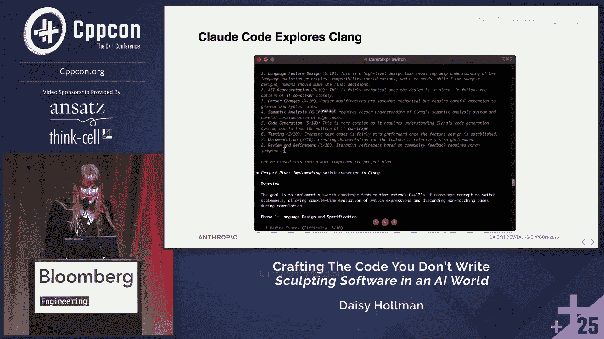

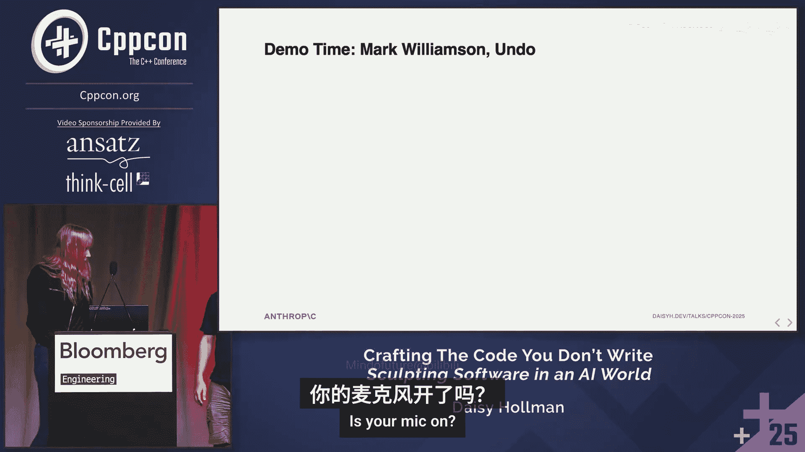

当事情真的奏效时，你不喜欢吗？我们基本上得到了100%。最新的模型中有一点异常，我们认为这可能与模型只是想保持安全有关，因为它知道这不会失败。但在真实的编码场景中，这基本上永远不会出错。我说“基本上”，显然，在温度1下，这是一个有限的百分比。其中一部分可能只是“不要在温度1下编码”。但我们可以进一步弄清楚。我们可以通过一个非常有趣的实验来进一步理解模型到底在想什么。

我们可以告诉它，在我们的编译器中隐式移动是坏的。那么它是否真的理解了隐式移动的概念？还是它只是捕捉到了“move”这个词，然后想：“哦，我应该移动。” 显然，如果它没有真正理解隐式移动的概念，那么它可能会尝试将这里的“move”与返回值关联起来，从而更可能进行移动，而不是信任隐式移动。但如果它真正理解了隐式移动是什么，它应该能够查看这条注释，建立起一个概念：“哦，我需要做一些在隐式移动中通常不需要做的事情”，并改变它在这里生成的内容。而这确实奏效了。这真的很酷。

你可以看到我们的旧模型，那些认为自己在写Python的，仍然只想单独返回变量。它们开始有点像是：“哦，也许我应该做点与移动相关的事情。” 所以并不是说旧模型对C++一无所知，但新模型知道的数量令人惊讶。

我们实际上认为在这里，是模型不相信你隐式移动是坏的，因为我从未在编译器中见过这个被破坏。但它仍然在这个显然不在其训练数据中的奇怪场景中得到了正确答案。这不是我作为C++程序员见过的场景。我见过很多其他坏掉的东西，但没见过这个特定的。然而，模型并不仅仅是在复述它的训练数据。这几乎完全来自它的预训练数据，而且它不是在复述训练数据，它是在概念上概括“坏的隐式移动”意味着什么。我认为这真的很有趣。

这是为了完整性而设置的对数刻度。只是为了好玩，把这个扔进去。我认为非常有趣的是，新模型变得更好。3.7 Sonnet似乎很困惑。我认为这里的旧模型只是模糊地知道移动在某种程度上与C++11有关，所以它想：“哦，这是一个移动，C++11的东西。” 事实上，在C++14中，通过核心工作组问题对隐式移动语义进行了修复，使这变得更加微妙。我想知道它是否捕捉到了这一点。我认为这非常有趣。

所以，从这一部分中，我希望你得到的收获是：**通过概念性概括进行压缩，是理解预训练模型如何存储和复述信息的一个有用比喻**。它仍然在复述信息，我稍后会解释为什么我用这个词，但它是在概念上复述。它是在思考概念上发生了什么，然后生成与该概念匹配的标记。

---

## 章节 4：强化学习、工具使用与智能体

现在让我们谈谈强化学习，这基本上是自2022年以来除规模变化外的大部分进展。但真正引领我们进入更现代时代（我指的是自ChatGPT发布以来，我甚至不会称那为现代时代，我们很快会讨论现代时代）的许多进步都来自强化学习。

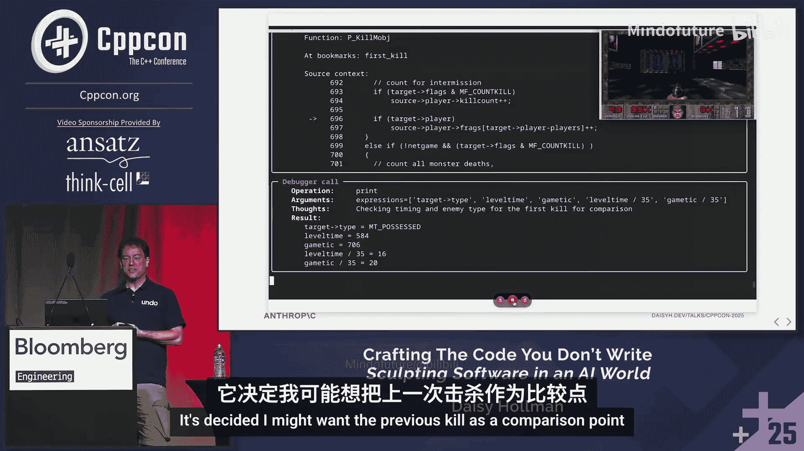

预训练模型的问题在于，它们确实只是“花哨的自动补全”。这是一个概念性概括，但它是在预测下一个标记，而不是在完成任务。这里的任务是回答问题。它是在基于问题的部分内容预测下一个标记，而不是基于其将之理解为任务。

这将是训练数据的一个完全合理的复述。例如：“vector size is defined in the standard library. Vectors are sequence containers that represent arrays that can change size. Et cetera, et cetera, et cetera.” 顺便说一句，Claude帮我写了所有的幻灯片，以防你好奇。我提示了它，所以给我一点功劳。我给了它一个与C++无关的其他演讲的例子，说“生成一个类似这样的C++例子”。我认为它做得很好，这真的很酷。

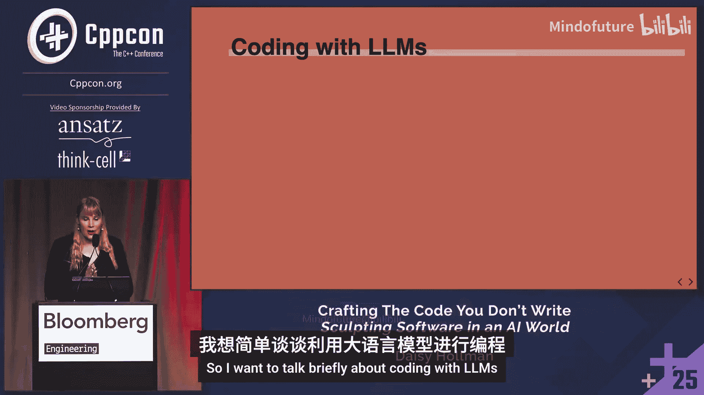

但让我们简单谈谈强化学习是如何工作的。这部分我必须最小心，因为目前大多数强化学习工作都是商业机密，受到非常谨慎的保护。这是一个非常活跃的研究领域。

但基本思想是：你给模型一个问题或任务，然后生成数百个该任务的补全。然后你需要某种方式来给这些补全打分。例如，你可以给它一个高中数学多选题测试。这是一个非常简单的版本，因为你知道正确答案，而且没有太多歧义。如果它答错了，你不给任何分；答对了，给很多分。

但如果它生成的是C++代码呢？嗯，这实际上相当复杂。以C++代码为例，如果你要求它生成一个接受随机访问范围的函数，在某些上下文中，使用`Span`可能是正确的，因为你可能还没有C++20。它没有上下文信息来知道你是否拥有C++20，如果你想至少给它一点分数的话。但弄清楚如何编写这些评分函数是一门艺术，这是我们作为一个行业还没有真正弄清楚的事情。甚至还有比这更微妙的地方，我不会在这次演讲中深入，因为你甚至不知道将评分函数应用到哪一组标记上。有时智能体可能走错了路，然后意识到错了，又走上了正确的路，你不想将评分指标应用到走错路的部分，只应用到走对路的部分。这绝对是一场噩梦，也是一个活跃的研究领域。

然后，你基本上基于那些标记补全计算权重的梯度，使模型更可能给出分数较高的补全，更不可能给出分数较低的补全。我在这里做了很多简化。但大致就是这样。你对许多任务重复这个过程很多很多次。再次强调，需要巨大的计算量。而且这些任务通常不是短时间范围的任务。你可能需要为一些任务训练很长时间。例如，在一些我可以谈论的公开训练数据版本中，任务通常是获取GitHub仓库的一个问题，并生成一个修复。评分函数就是人工生成的、修复该问题的拉取请求。这些都是我们经常训练这些模型的实际任务，行业经常在这些任务上训练它们。我并不是在评论Anthropic具体在做什么。我非常热爱我的工作。

这听起来真的很难。比听起来难得多。我真希望有更多时间深入探讨。我实际上有一些关于这方面的C++例子的精彩幻灯片，但因为时间关系不得不删掉了。

让我们稍微跳入更现代的时代：工具使用和智能体。

大约在2023-2024年，我们意识到XML或JSON等结构化标记语言也只是文本。所以我们可以给LLM一个关于如果它使用某个模式会发生什么的描述，并给它一个模式。然后当我们看到它生成那个时，我们就停止，做我们告诉它会发生的那个事情，然后把输出返回给它，让它继续完成。

例如，我们可以让它运行终端命令、运行编译器、运行调试器、运行性能分析器、搜索互联网、搜索代码仓库中的代码、编辑文件。我认为直到我进入这个领域工作，我才意识到“编辑文件”是我们发现的一个功能。这对我来说很疯狂。

实际上，我有一些Claude Code使用Anthropic API进行工具调用的例子。目前，大多数使用XML。由于各种技术原因，有向JSON转变的趋势。

以下是Claude Code中编辑工具调用的样子。Claude必须逐字生成这个，才能只改变文件中的几个字符。如果旧字符串是错的，工具调用失败。如果文件中有多个旧字符串，工具调用失败。我们正处于智能体工具的“ed时代”。在座谁用过ed？如果你没举手，想想看：这就是为什么vi被称为“visual”，因为你在ed里完全看不到自己在做什么。是的，它就是查找和替换。这是你曾经用过的、涉及大型语言模型编辑代码的每一个工具所做的唯一方式。这让我震惊。有太多事情你必须记住。

在某种程度上，我会称之为超人类智能。我自己做不到。每次我需要编辑东西并在合理的时间跨度内生成连贯的代码时，我都做不到。所以我想在这里表达的观点是，我们拥有的工具正在拖我们的后腿。我认为在某个时候，我们会想出如何创建智能体版的vi。剧透一下：不是vi。我们试过。也不是Emacs。而是某种能提供相同实时反馈的东西，让模型在编辑时能看到，这样它就不必进行逐字查找和替换。

为了让你了解这有多好，以及模型在这方面有多擅长，记住我说过Claude Code写了我所有的幻灯片。我的幻灯片是用一个我在2018年从reveal.js分叉出来的JavaScript框架做的，因为我是演讲者，经常做演讲，房间里的其他演讲者都知道我在说什么。总之，这是你至少不会期望出现在预训练数据中的东西。我让它编辑幻灯片。我告诉它我想说什么，然后让它编辑幻灯片。我让它生成了向我的文件添加这个代码块的编辑。

这就是那个编辑工具调用的样子。它第一次就成功了。第一次尝试。它找到了需要放在下面的列表项，并添加了代码片段。嵌套在其他工具使用内部的工具使用，它一点也没搞砸。这对我来说很了不起，但这也表明我们的工具设计目前拖累了模型多少。有很多工作正在积极进行中，但我预计这在未来几年会有很大发展。我认为我们确实处于智能体工具化的“低垂果实”时代。

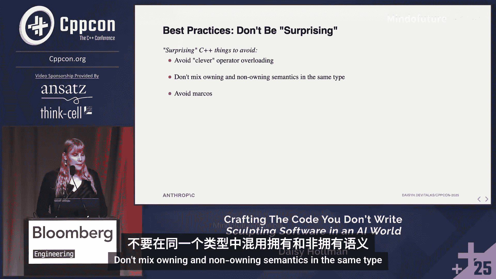

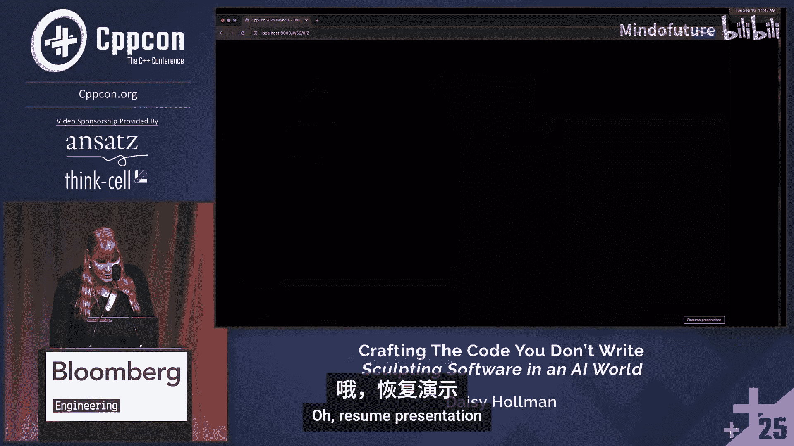

---

## 章节 5：推理、上下文窗口与智能体演进

让我们谈谈推理。实际上，我已经在这次会议上听到一些人把这个描述得比实际情况更复杂了。

基本上，发生的事情是上下文窗口增长得非常快，尤其是在2024年。实际上，我做过这个演讲的一个练习版本，当时我以为我这里的数字错了。我说，这肯定不是GPT-4，GPT-4初始发布时只有8000个标记，但事实上，它就是GPT-4。有一个GPT-4 Turbo模型有128k标记，稍微现代一点。GPT-3有200k标记。Gemini有100万标记。Claude 4有200k标记。基本上，在2025年期间，我们看到这个增长趋于平稳。这有各种原因，我很乐意离线详细讨论。但大致上，上下文窗口不再像2023-2024年那样快速增长。

但在2024年，我们问：我们用所有这些额外的标记做什么？这是那个增长的对数图。2025年初有一些1000万标记上下文窗口的实验。我认为普遍共识是它们不是很有用。当你把模型铺得那么薄时，它开始变得相当笨。所以我们大多停留在这个区间。看看这个在4月左右停止的地方。

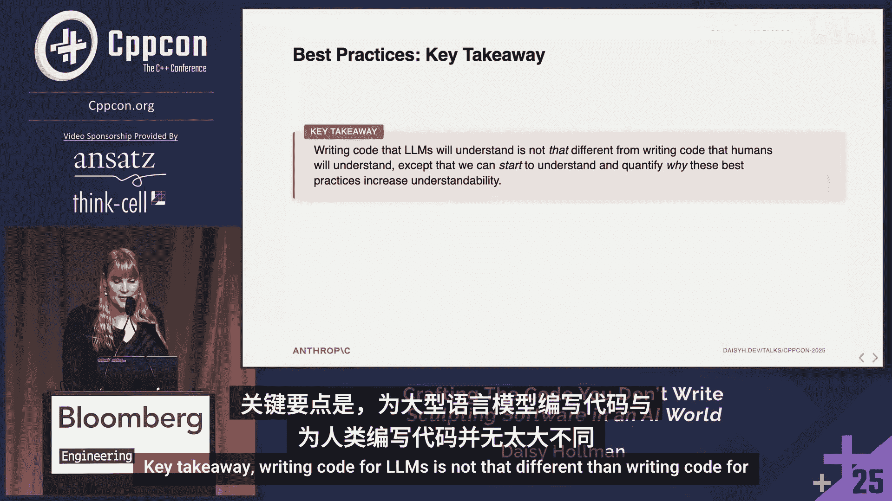

那么，我们用所有这些标记做什么呢？我们拥有所有这些额外的上下文窗口。2023年我们开始的一个选择是所谓的**检索增强生成**，你直接拉入文档、网页、一堆信息。在某种程度上，你可以眯着眼看，觉得：“哦，那是工具调用的早期形式。” 2024年，我们开始做确定性的工具调用，模型去运行编译器并获取编译器输出。这确实开始占用窗口，但接近2024年底，人们说：“等等，如果我们只是要求LLM为我们把更多相关的标记放入它的上下文中，会怎么样？”

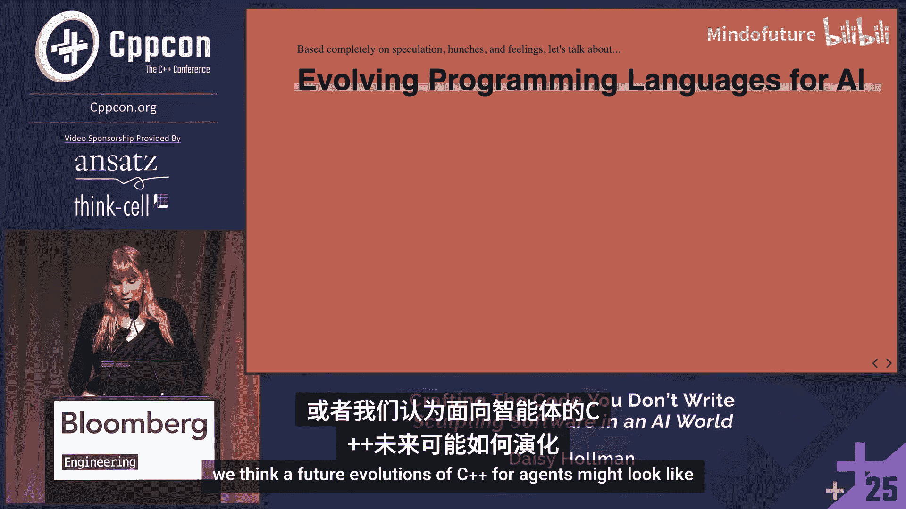

这就是整个创新。来自发现这个创新的论文。在我们这样做之前，我们是这样：在`Assistant:`之后开始模型补全。做了这个之后，我们在`Assistant:`之后开始模型补全：“让我一步步思考这个问题：”。就这样。这就是在2024年底震撼AI世界的整个创新。这太疯狂了。这让我难以置信。

我们实际上并不理解很多这些事情。这个我认为我们相当理解为什么它有效。

回到我们之前有的这个架构图。我们有这个转换器第1层，第2层，等等。这个“...”做了很多工作。有很多这样的层。记住我说过，第一层的注意力真正连接的是一个标记到另一个标记，连接标记彼此，等等。然后在下一层，你连接的是标记对，或者连接连接。在更后面的层中，你最终构建了或多或少代表一个抽象概念的东西。然后那个抽象概念可以连接到另一个抽象概念。但在某个时刻，如果你在太后面的层中形成抽象概念，那么注意力机制就没有足够的时间将该抽象概念连接到另一个抽象概念。所以它错过了连接，生成了错误的标记。

但是，如果我们告诉模型，它必须首先写出一些代表其“思考”的标记，它实际上必须将那些中间层或后层的抽象概念转化回标记。因为它将那个抽象概念转化回标记，并把它放回上下文窗口，我们现在有了那个抽象概念的更紧凑的表示，这允许它在模型的更早层形成。这说得通吗？我认为这实际上是对这些模型如何在事物之间建立连接的一个非常深刻的见解。当Anthropic内部有人告诉我这个时，我回到家下巴都惊掉了。我想：“现在这合理多了。” 是的，我们在将抽象概念移动到标记层。

那么，有了这个，让我们谈谈智能体。智能体是2025年的热门词汇。我不是在谈论那个流行语版本。我在这里真正谈论的是智能体的技术版本，以及它们如何真正影响你使用LLM进行编码的方式。

早期的LLM，上下文窗口非常小，只能做相对短时间范围的任务。聊天机器人在这方面工作得还不错，因为即使你在与人类对话，模型忘记了你三四个问题前说的话，或者人类忘记了你三四个问题前说的话，你会觉得：“哦，这似乎是人类可能忘记的合理事情。” 它们有点用。我们也用这些来做花哨的代码行内补全，那些多行补全。这是一个非常直接的应用。你只是预测下一个标记的可能性，然后扔掉一切。如果用户按Tab键，你就放进去；如果不按，你就不放，你不用担心这个长的对话历史。

所以这一切都工作得相当好。但如果你给它一个更长时间范围的任务，LLM很快就会偏离轨道。它纠正的能力相当有限。我们也缺少这个扩展思考的部分。

随着LLM变得更大，强化学习变得更好，更长时间运行的任务变得更具可行性。关键的见解是，如果我们让模型看到其行动的结果，然后基于该反馈进行迭代，那么我们可以让人类脱离循环更长时间，让它使用更多时间来给用户更好的响应。

例如，如果我们要求模型生成代码，然后给模型一个工具来运行编译器检查它生成的代码，然后将编译结果添加到上下文窗口，再要求它修复编译错误。现在我们有了一个循环，它可以重新编译代码，看到更多编译错误。它不会自信地声称生成的代码是正确的。它实际上可以检查自己。这个反馈循环真正将聊天机器人转变为智能体。当人们谈论智能体时，他们通常指的是某种具有工具使用自主性的形式，其反馈循环涉及行动的结果，然后可以利用这些结果来创建更好的行动版本。

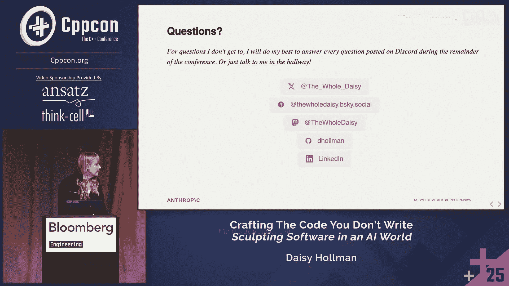

AI研究机构Metr最近的一项观察是，AI可以完成的任务长度大约每七个月翻一番。自2019年以来，这大致成立。粗略地看，我认为看看2026年这会是什么样子会非常有趣。如果这个趋势继续，实际上还在加速一点点。基本上，是的，我们开始谈论可以运行24小时的模型，可以运行一周的模型。那是什么样子？写一个足够详细的任务描述让模型去工作一周，然后你回来得到一个拉取请求，是什么样子？那一周的工作值得吗？相比于，比如说，五个小时的工作？这将非常有趣。我认为现在没有人能预测未来。总的来说，我是一个乐观主义者。但我认为这会非常有趣。

那么，智能体如何仅从几十万个标记的上下文中理解一个100万行的代码库呢？同样，我认为问“人类如何做到这一点”非常有帮助。我们也没有做到。这里没有人能记住整个Clang代码库。我们搜索关键入口点。我们阅读那些入口点的一些代码，大致浏览寻找与我们试图理解的内容相关的东西。我们查看关键类型和数据结构。如果有核心功能，我们可能搜索关键字符串或类似的东西，我们也可能搜索文档，然后用这些来确定我们需要开始阅读哪个文件。换句话说，我们只将部分代码加载到我们的上下文窗口中。也许我们加载其余代码的摘要，或者基于我们过去对代码的经验或类似情况的经验，加载一个可能略有错误但足够好的概念图。

智能体也这样做。这是我三个月前在ACCU做的一个演示。这是用一个旧模型做的。自那以后我们的模型变得更好了。但我基本上要求它浏览Clang代码库。这是Claude Code。我去初始化了它。我要去问它，给我解释一下`if constexpr`在Clang中是如何实现的。在座谁写过Clang代码？就是实际的编译器。这些是你需要去问这个问题有多难的人。这非常难。我做过一点点，这是一个非常大、非常复杂的代码库。

所以我问它：“我们如何实现`if constexpr`？剧透一下，我要请人上来做个演示。” 它会开始工作，它会去搜索一些东西。它实际上要求一个子智能体去为它总结。它搜索了很多关键字符串。它阅读了一些文件，然后得出了这个报告。由于时间关系，我不会详细讲这个。你可以去看我在ACCU演讲中的讲解。但它得出了大致正确的描述。

然后我进去说：“好的，现在我想实现`switch constexpr`。” 它将基于关于`if constexpr`的对话进行概念性概括。我把它当作一个工具。我用一个我要求它去阅读的类似例子来准备上下文。然后我给它一个相关的任务，而它仍然在上下文窗口中拥有那些信息。所以它会去写一个计划。我不会讲整个过程，但整个过程中我最喜欢的部分是，我要求它按1到10的等级评价这个任务的难度。这不是我想做的。它在这里说，按1到10的等级，最困难的部分是9/10：说服C++委员会接受这个提案。我认为这有点低了。但公平地说，它没参加过委员会会议，因为我们的会议记录不在它的训练数据中，它们不是公开的。

---

## 章节 6：演示：智能体与时间旅行调试器

我将请上来自Undo的Mark Williamson，他一直在做很多智能体工作。我们要在这里做一个快速演示。

Mark：嗨，我是Mark。我是Undo的CTO。当我们说时间旅行调试器时，我们指的是捕获程序整个执行过程的能力，实际上是机器指令精度，包括内存中的所有内容，每个变量、状态、代码行，然后确定性地重放它。我们实际上做了很多技巧来使其比听起来高效得多。我们只捕获可能影响行为的非确定性输入。但最终目标是，人类或AI可以检索他们想要的关于那次软件运行行为的任何信息。

Daisy：你一直在幕后与Claude Code团队合作，主要是你自己，因为我们沟通得不够好，抱歉。但你在为我们的智能体构建一个工具，基本上是一个工具，一个MCP服务器。这是一种创建工具的奇特方式。现在智能体可以控制调试器了，对吧？Claude Code可以控制你的调试器运行。你要向我们展示你能用它做什么。

Mark：是的。在开始之前先说一下背景。在这个案例中，我玩了一个小游戏《毁灭战士》。我使用的是Chocolate Doom，一个开源克隆版，它非常接近原始源代码结构。我用我们的实时记录器工具记录了我的游戏过程。所以我捕获了发生的一切，我们可以重新计算我游戏过程中的任何内容。在这里，我已经在Rdbugger中运行到了那个记录的末尾。在右上角，你可以看到我们当前检查的记录点帧缓冲区的实时更新。我现在要做的是，使用我们的AI集成来找出关于代码语义的一些高级信息。在这个游戏过程中，第二个僵尸是什么时候被杀死的？

它正在后台调用Claude Code，并将Rdbugger的控制权交给Claude。所以现在是Claude的工作，使用专门设计的工具来解决这个问题。它开始了，首先在记录末尾获取回溯以确定位置。然后它会去做一些探索。这有点像人类会做的探索。你可以看到它找到了这个变量`total_kills`。这听起来像是我们想要的线索，关于发生了多少次击杀。但结果证明这是一个误导。如果你看这里，我们正好运行回到了菜单屏幕。这是关卡初始化的一部分，是关卡生成所有怪物后你可能有的击杀数。所以这不正确。它又在源代码中查找，找到了`players`数组。每个玩家都有一个`killcount`，这听起来有希望。然后它开始研究这个，在时间上向后运行，找到它被改变的时间。这次它找到了第一次击杀。它做了书签。这样它可以在后续推理中回到这里，人类也可以如果你想检查的话。

它现在又从那里向后运行，试图找到击杀数为2的时候。这没成功。没关系。它可以恢复。它有一个确定性记录，并且知道如何使用工具。所以现在它回到了时间终点，再试一次。它尝试不同的表达式来评估，以精确找出这个击杀计数何时变为2。你可以看到我因为忘了所有键盘快捷键而在地图和菜单系统中卡了一会儿。

它现在向后走，打印出击杀计数，说是2。现在它向后回退，找出那个值首次被分配的确切时间。它很高兴。完美。这就是第二次击杀发生的地方。它现在为此添加了书签，因为这对用户和进一步探索很有趣。作为一个优秀的小智能体，它实际上在为我们收集一些额外的、我们可能想用来理解发生了什么的上下文。所以我们在这里查询游戏时间（以游戏滴答为单位），查询这在关卡中发生的位置。所有这些都将构成其最终报告的一部分。

哦，这是我最喜欢的部分，我忘了让你停下来：它发现它没有找到僵尸。它找到了一个“possessed”（附身者）。它发现僵尸的枚举是`possessed`。它推断出`possessed`有点像僵尸。这很可能就是Mark在这里的确切意思。所以它从我的概念概括到了代码中的真实概念，以回答我的问题。所以它确认了这是一个僵尸人。现在它检查书签在哪里，以便跳转