# 060：在AI世界中塑造你不写的代码

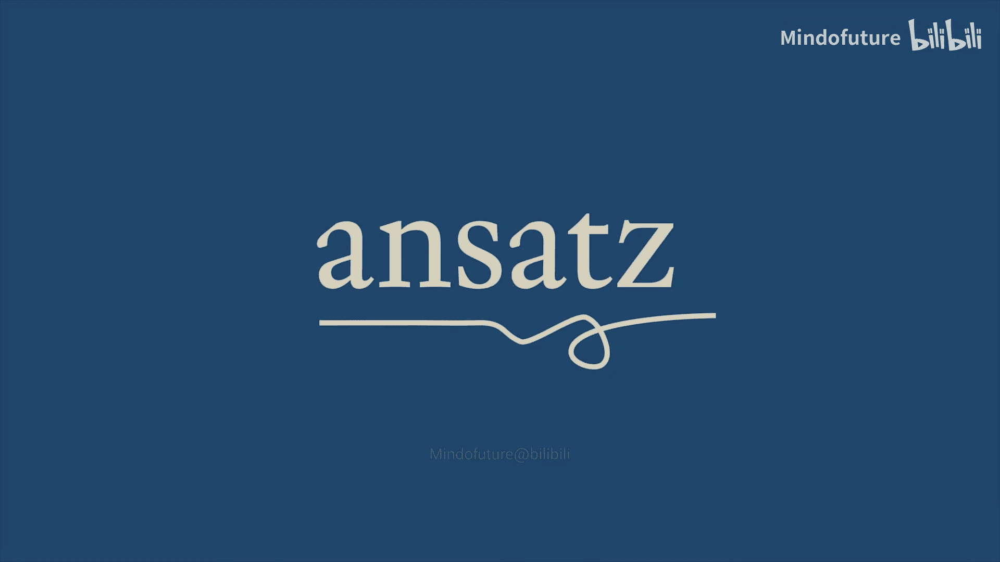

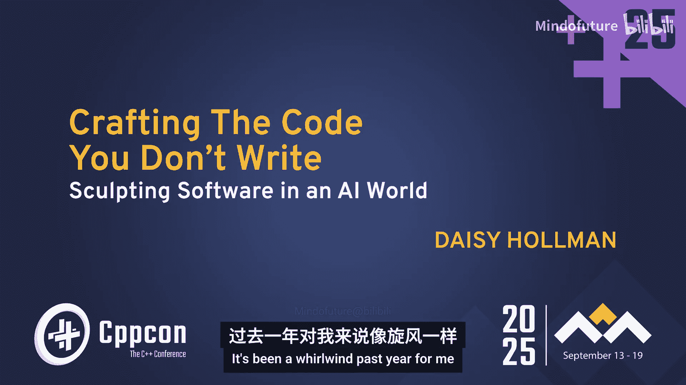

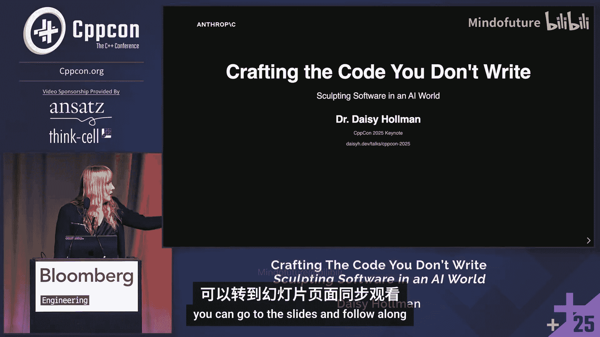

## 概述

在本节课中，我们将探讨大型语言模型和AI编码代理如何改变软件工程。我们将学习LLM的基本工作原理、如何有效地使用编码代理作为工具，以及如何编写更易于AI理解和维护的代码。课程内容旨在为初学者提供一个清晰的概念框架，帮助你在AI日益普及的世界中更好地工作。

## 1. 引言与背景

大家好。过去一年对我来说是旋风般的一年，我最终进入了一个从未想过会涉足的行业。

对于那些认识我的人来说，我现在在Anthropic工作，开发名为Claude Code的产品。你们中的一些人可能听说过它。如果没有，希望在这次演讲后你能有所了解。

Matt Godbolt向我展示了他是一个重度用户，目前正在前排使用Claude Code。这很好。我的幻灯片在这里。如果你想跟着看，它们是实时更新的，并且与这里的内容匹配。所以，如果你在屏幕上阅读任何内容有困难，尤其是从房间后面看，你可以去幻灯片上跟着看。

这是为会议准备的缩略图幻灯片。

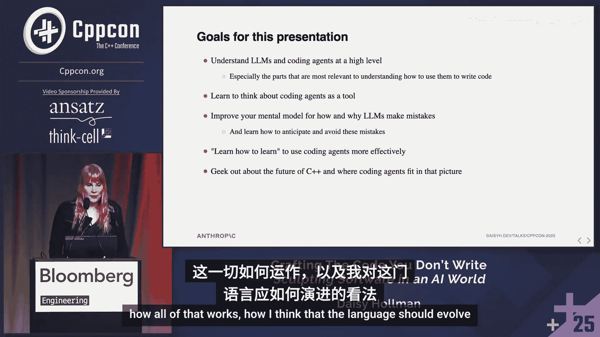

我是谁呢？John刚才介绍了我一些。我是一名长期的C++委员会成员，我参与撰写了C++17、20、23、26中的一些特性。几乎可以肯定，我参与贡献的一些特性也将进入C++29。

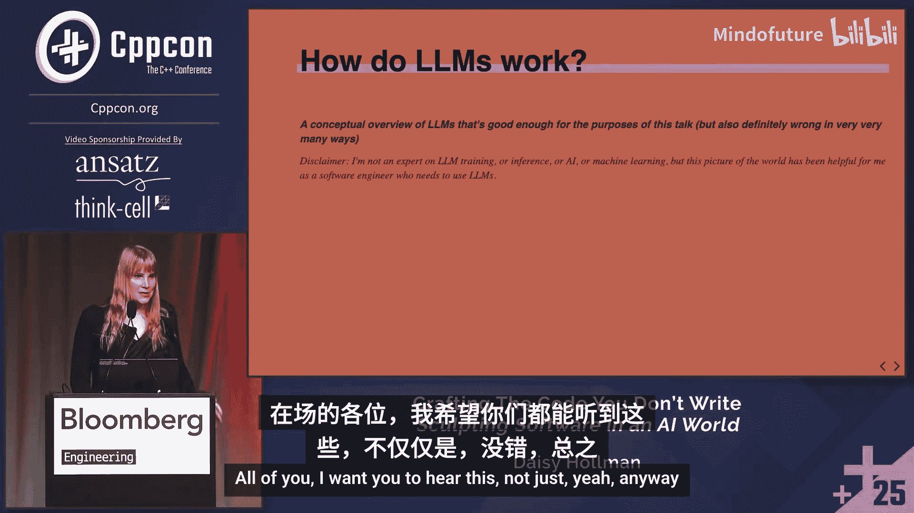

以下是我在委员会任职期间参与的一些工作。我曾担任SG9（Ranges）的主席。我不想自夸，但在C++特性中，Ranges可以说是C++中的C++特性。我有幸担任这次会议的主席，非常享受这个过程。

我做过一些名为“C++小技巧”的演讲，这些演讲深入探讨了C++的深奥角落。我说这些只是为了表明，我和你们一样，是C++社区的一员。C++一直是我生活中很重要的一部分。

现在我在AI领域工作。如果你对我作为一个“局外人”来这里谈论AI、谈论我所看到的编码未来持怀疑态度，我希望通过这张幻灯片让你相信，我并非局外人。这是我的世界。我非常感谢这次会议对我职业生涯所做的一切。

需要明确的是，这并非终点。但我现在确实在从事AI工作，研究编码代理。

让我们简要谈谈房间里的大象。AI目前有些两极分化。我认识到这一点。我在这里不是要讨论这个。有很多关于AI伦理和社会影响的精彩会议。这是一个技术会议。我很乐意在走廊或喝咖啡时讨论那些话题。但在这里，我真正想关注的是技术方面。

我不是来试图说服你AI编码代理将改变软件工程的工作方式，或者“氛围编码”是软件的未来，你应该忘记代码质量。总的来说，我不是来谈论社会影响或环境影响的。我要提前说明，我非常关注AI、编码代理以及代理技术整体的环境影响。我认为，目前行业的一个借口是我们认为AI将在未来两年加速清洁能源的发展。但这有一个时间限制。我认为，如果我们没有真正看到这种情况发生，很多人会离开这个行业。所以，行业中有很多人非常关心环境影响。我希望有更多时间讨论这个，但在这个演讲中，我想重点讨论的是，在一个你对AI普及程度控制有限的世界里，如何帮助你茁壮成长。

没有人有能力阻止AI的进步。你可以对是否应该发生有意见。但现实是，作为一名软件工程师，它会影响你的生活。我想尽我所能帮助你在那个世界里茁壮成长。

## 2. 演讲目标

本次演讲的目标如下：
*   帮助你从高层次理解LLM，特别是对编写代码至关重要的部分。
*   为你提供一个关于如何使用编码代理作为工具的概念框架。我会在编码代理、AI、LLM等几个不同术语之间切换。行业本身也在这些术语之间摇摆，而且其中很多术语带有商业价值。我只是试图在技术意义上使用它们。
*   改进你对LLM工作原理、训练方式以及为何会犯错的心智模型，以便你能学会预测这些错误、避免它们，并更有效地使用编码代理。
*   和我所有的演讲一样，我希望你学会如何学习。当某件事出错或做对时，我希望你理解如何找出原因，以便改进、迭代并变得更好。我认为这对于编码代理尤其困难。
*   我想探讨一下C++的未来，以及编码代理如何融入那个未来，语言应该如何演变。如果你昨晚参加了委员会小组讨论，你可能已经听到了一些相关内容。

总之，我要开始了。我有很多材料。我会尽量讲得不那么快，但我确实有很多想说的内容，因为我非常关心这个社区，我希望大家都能听到这些很酷的东西。

## 3. LLM基础：Transformer架构

我将用一个时间线来构建这个框架，让你了解其大致的时间顺序。但这并非旨在概述AI在现代世界的具体历史。

这一切都始于Transformer架构。这是当今无处不在的大型语言模型的基本架构。我将分三部分来解释它。

### 3.1 输入层

我想介绍的第一层是输入层。这可能是作为开发者需要理解的最重要的一层，因为你可以控制的大部分内容都将放在这里。

在这里，我们将标记转换为向量。我们将语言转换为数字，以便大型语言模型可以基于此进行预测。

它使用固定大小的词汇表，以及固定的上下文长度或上下文窗口。这是两个重要的变量。它基本上是将词汇和位置编码到上下文窗口中。现在的编码方式比最初开始时复杂得多，但即使在2017年启动这一切的论文中，这也是基本架构。

还有一个你可能听说过的第三件事，叫做嵌入维度。这基本上是模型进行所有转换的工作维度。要使用LLM，你并不真正需要理解这个。但如果你听到这个词，人们谈论的就是这个工作维度。

不过，这里最重要的收获是，上下文窗口限制了模型在任何给定时间可以考虑的信息量。它是你可以输入模型以预测下一个标记的标记数量。这基本上框定了我们在LLM之上构建的几乎所有东西，尤其是对于我们这些不直接参与AI的C++程序员来说。我们在AI之上构建的大部分内容都涉及设计这个上下文窗口并有效地使用它。它是模型的输入层。

### 3.2 从上下文窗口到聊天机器人

那么，我们如何仅用一个上下文窗口制作一个聊天机器人呢？我们如何将所有这些标记（基本上就是单词）变成一个聊天机器人？

答案出奇地原始。我们基本上写出“Human:”，然后放上你说的话。然后我们放上“Assistant:”，这就是我们开始让模型完成回答的地方。当模型觉得完成或回答了问题时，它会说“Human:”并停止。

这就是我们输入的实际文本。简单得令人震惊。我认为贯穿本次演讲的一个主题是，AI涉及的许多技术都处于起步阶段，属于唾手可得的领域。

我们确实会做一些清理工作，因为当人们意识到这一点时，他们首先尝试做的事情就是在提示中键入“Human:”或“Assistant:”来试图混淆它。但基本上，这就是目前正在发生的事情。自LLM时代开始以来，它并没有太大变化。

但这也意味着我们的对话会很快变得非常长。之前对话中的所有内容都会贡献给你正在使用的上下文窗口，这意味着它们都是你输入的一部分。因此，当你试图精心设计输入给模型的内容以获得最佳输出时，你必须考虑所有这些内容都在同一个上下文窗口中。

### 3.3 Transformer与注意力机制

我们来谈谈Transformer。这是我本次演讲中唯一一个计划好的笑话，我打赌房间里只有五个人能懂。

谁知道这里该填什么词？注意力。很好，有几个人知道。谁懂这个笑话？这个呢？好吧，反正我觉得好笑。我不在乎。

论文是Vaswani等人发表的，“Attention Is All You Need”。但在那之前两个月，Charlie Puth出了一首歌叫“Attention”。所以我喜欢把功劳归给他。技术上比作者早两个月。

不过，Charlie Puth的粉丝和LLM工程师的交集很小。基本上只有我夹在中间。但这每次都让我发笑。

Transformer确实是现代LLM的关键。基本上，它们允许你在输入中相距较远但相关的标记之间建立连接。

其数学结构非常有趣。我希望在这次演讲中有时间深入探讨，但我认为数学结构无助于你理解编码所需的知识。编码真正需要知道的是，注意力正在建立我们大脑自然也会建立的、事物之间的联系。

以这个句子为例：“The student who had studied diligently for weeks, despite the numerous distractions and challenges, finally passed the exam.” 这个房间里的几乎每个人都能解析这个句子。但在2017年，我们并没有真正能够做到这一点的语言模型，因为它们难以关联相距较远的事物。

注意力是真正赋予模型能力去说“哦，student 和 passed 相关，我们谈论的是学生，passed 是与学生相关，而不是与挑战或干扰相关”的机制。如果你实际查看模型第一层的注意力矩阵，你实际上可以看到这些标记对之间的块具有更高或更大的幅度。

现在，这个模型有很多层。所以，一旦我们过了第一层，我们就在连接连接，或者连接抽象概念和另一个抽象概念。有很多很多这样的层。但它始于连接单词，然后连接这些连接，等等。事实证明，这种方法效果出奇地好。

### 3.4 输出层与采样

还有第三层也很重要，实际上你也有一定的控制权（如果你直接查询API的话），但不多，而且差别不大。这就是我们如何选择下一个标记。

它运行完整个预测机制，最终产生一个基本上转化为下一个标记概率分布的东西。然后模型基于这个分布选择下一个标记。这叫做采样。通常模型有一个叫做“温度”的参数，用于控制采样的随机性。较低的温度更确定性，它会更经常地选择最可能的标记；较高的温度更有创造性和随机性，但一致性较差，它会时不时选择一些不那么可能的标记。这对于完成某些工程任务实际上非常重要。找出合适的温度更多是一种感觉。我们并没有很好的理论理解为什么会这样。在我见过的大多数模型中，编码的理想温度大约在0.6到0.7之间。但如果你想写诗，可能要到0.95左右。这确实是我们需要摸索和尝试的东西。

然后，这个输出会重复。我们选择一个标记，然后把它放回上下文窗口，再试一次。这个机制会有一个所谓的“停止序列”，对于聊天机器人来说，就是“换行然后Human:”。当它看到模型生成这个时，就会停止这个反馈循环，并把结果发给你。所以我们有预定义的停止序列，使我们能够将其构建到真实的基础设施中，在云端发生，然后把结果发回给你。

## 4. 训练与概念压缩

现在我们来谈谈训练是如何工作的。需要明确的是，有一种看法认为AI，或者说LLM，只是花哨的自动补全，只是在预测下一个标记。从机制上讲，这确实是正在发生的事情。但我不认为这么说很有趣。我想通过谈论我们能够预测下一个标记已经有多久了，来说明这种理解已经过时了。

对于这些东西，这可以追溯到2018年，我们就在进行预训练，虽然不是同样的规模，但基本上与今天进行预训练的技术大同小异。

你基本上是从整个模型开始，权重都是随机的。然后你查看训练数据中的一些标记。在训练数据中，这会是“back”。我们都很了解`std::plus`。在整个演讲中，我将使用这三个思考表情符号来表示LLM当前所在的位置。我想不出更好的表示方式，所以如果你反复看到这个感到困惑，那就是我在谈论这个代码片段中LLM所处的位置。

所以在这里，在训练早期，你可能会从随机权重中得到这样的东西：35% back，11% front，5% pull right。然后你要计算一个梯度，这个梯度会使权重调整，使得“back”变得更可能，而“front”和“pull”变得更不可能。这背后的数学有点复杂，但也不是太难，而且是可以理解的。反向传播也参与了这个过程。然后我们调整权重，并重复这个过程。我们一遍又一遍地这样做，针对大量的数据语料库，我们移到下一个标记，然后尝试再做一次。我们同时对一大堆不同的标记进行这个操作。训练这些东西需要大量的时间和计算。

那是2018年。那是2018年预训练的样子。从那以后变化不大。规模大了很多。但预训练（特指预训练，不谈强化学习）的基本思想自那个时代以来变化不大。我敢肯定YouTube评论区的预训练专家会纠正我，但对于C++会议的目的来说，这就是你真正需要了解的关于预训练如何发生的内容。

随着我们开始扩大这些模型的规模，我们开始看到一些涌现的行为，这些行为出奇地好。“Unreasonably effective”是另一种说法。2019年，我们有GPT-2，它有15亿参数，训练了大约40GB的训练数据。GPT-3训练了大约570GB的训练数据，有1750亿参数。

从非常模糊的意义上说，如果你看这些数字，你可以看到预训练构成了对数据的一种压缩。这是一种近似压缩，允许你以概率方式重现那些标记。我们将训练数据压缩到权重中。

令人惊讶的是，作为一个行业，我们还没有完全理解这一点。但令人惊讶的事情似乎是，这种压缩类似于我们大脑使用的、对数据的概念性概括压缩。这样，你就可以基于一个概念和另一个概念，概括出一个可能匹配输入数据的标记预测。这是一个比喻，并不完全是正在发生的事情。如果我们确切知道发生了什么，我想我应该在AI会议上做演讲。老实说，作为一个行业，我们并不知道。但这或多或少是我们认为它效果如此之好的原因。当我们要求它根据一个在训练数据中未见过的提示来解压缩数据时，它使用概念概括的方式与人类非常相似。

### 4.1 概念压缩示例

让我们考虑这个C++代码片段。我们有一个widget工厂。我们使用某种默认初始化的foo工厂。这是一个众所周知的C++工厂模式。实际上这是一个相当古老的模式，我在更现代的代码中见得不多。我们创建一个`unique_ptr`，调用`initialize`，然后返回。假设模型正在这里进行补全。

有几个补全候选。最明显的一个就是`widget`。但如果没有特殊知识，它没有内在理由不能是`foo`或`no_pointer`。或者`std::move(widget)`？这真的是正确的吗？也许我们现在不确定了。或者`std::move(foo)`。我想我们很确定不是那个。但我们可以创建一个指向widget的新`unique_ptr`。我们有一些直觉。它可能是一个分号，可能是42，也可能是一个表情符号。这个补全可以是任何标记。我们如何在这些东西之间做出选择呢？

我想思考一下你的大脑是如何做到这一点的，因为这实际上与我们认为LLM如何做到这一点惊人地相似。

我们可能首先要做的是，我认为返回值很可能是在询问。你排除了表情符号。我们查看返回类型。所以我们在大脑中进行了某种注意力关联，在这个标记和这个标记之间，或者这个标记序列和这个标记之间。我们说，这两件事可能以某种方式相关。所以`int`和`void`可能不是候选，因为这些事物与那个关联无关。你可以在脑海中描绘出注意力机制连接代码片段的过程。

如果你是一个非常优秀的C++程序员，你可能立刻会说：“哦，foo已经被移动了。”所以我可以关联这里的这个标记或标记序列与这里的这个标记，然后说，可能不是`foo`或任何与`foo`相关的东西。这是一个移动后使用。我们大脑中有一个概念性的图景，或者说我们大脑中信息的概念压缩，代表着移动后使用是不好的。我希望你有这个想法。如果你在CppCon，我希望你明白这一点。

我们知道这个工厂模式可能会返回一些已经初始化的东西。所以`no_pointer`似乎不太可能。我们可以把它划掉。我们可能不会初始化某个东西然后把它扔掉。所以这个`make_unique`似乎不太可能。很可能变量名会是`widget`。所以即使这里是`widget`，然后我们使用`foo`，并且你不知道移动后使用，很可能有人把东西命名为与工厂函数相同，意味着你很可能返回那个东西。

现在我们剩下两个候选。我敢打赌，房间里对这个补全的概率分布是全谱的。因为我相信有些人100%确定这是一个移动，也有些人100%确定这不是。我承认，即使我在委员会待了这么多年，我的分布大约是93%对7%。这是在我查资料之前。我不确定我能告诉你为什么。

我们也可以这样补全。这实际上是一个隐式移动。所以正确答案是`widget`。正确答案。做移动不一定错，尽管大多数linter可能会告诉你，你在进行不必要的移动到返回值。这是一个隐式移动，因为`widget`的类型与返回值的类型完全匹配。

我很好奇人们对这个补全的概率分布是什么。我想我的分布可能看起来像这样，作为一个C++委员会成员，我感到有点惭愧，尤其是我当时就在那里。有人想说出正确答案吗？不是17。是11。这一直是移动语义的一部分。在C++14中，我们放宽了限制，使其可以转换。我想我们在C++20中做了进一步的放宽。周围有委员会成员可以告诉你更多。去请Barry喝一杯。

在AI公司工作的一个有趣之处是，我实际上可以去探究模型对这个问题的想法。我可以去做这个补全，看看它的概率分布是什么。这通常不会大规模向公众公开，但我得到了许可与你们分享这个。所以我很兴奋。

我们把这个输入模型，得到它的标记分布。我用的是温度1.0，这几乎是它能达到的最随机状态。所以这不是你真正用于编码的东西。但我想看看在小例子中是否有任何出错的概率。现代模型通常能正确回答这些问题。但我想房间里的大多数人都会同意，这是C++的一个相当晦涩的角落。这不是C++ 101。我不认为大多数C++ 101入门级学生能答对。所以这真的很有趣。

我们在这里看到了一些非常有趣的东西。这是我在办公室熬夜时看到的，试图弄清楚并理解它。我们实际看到的是，在最右边，我们有一些非常小的模型。这是一个2024年的模型。这是2024年末的，这些都是我们模型的较小版本：Haiku。这是3.7 Sonnet，于今年2月发布，是一个稍大的模型。这是Sonnet 4，于今年5月发布。这是Opus 4，于8月发布，更大。是的，我们很有趣，Opus，Haiku。

有趣的是，较新的模型似乎更不可能得到正确答案。我把变量从`widget`改成了`var`，因为我不想偏向任何特定的东西。我在这里放了一个`using namespace std;`，这样我更有可能直接得到移动，并真正采样这个关于是否是隐式移动的非常具体的问题。

较新的模型在合理的编码温度下，基本上总是会正确返回。但令我惊讶的是，较旧的模型更经常这样做。

我认为我们有一个解释。我有很多研究人员和可解释性专家对此进行了权衡并帮助了我。我非常感谢他们。

但我们认为正在发生的是，旧模型只是认为这是Python。一旦我们开始使用较新的模型，它实际上理解了移动语义，并且必须在瞬间做出决定，10%的情况下，它会忘记隐式移动的存在，为了安全起见，它会进行移动。所以它大脑中某个地方有隐式移动的概念。但有时它会忘记，或者这个概念在残差层中形成得太晚，它无法将这个概念与返回值联系起来以正确选择标记。它仍然相当低，在温度为1时是9%或11%，你必须把这两个加起来，因为有时它生成了`std::move`调用，这实际上是我们希望它做的。这里是对数刻度，只是为了让你有个概念，即使是分号这个完全错误的答案，在温度为1时也有10的-5次方的概率。这听起来不多，直到你意识到你每天生成大约20万个标记。在典型的编码工作流中，这每天大约会发生一次，它会做出完全错误的事情。所以这很难控制。你必须非常聪明地设计模型纠正错误的方式。我们稍后会讨论这个。

但有趣的是，如果我的理论是正确的，即模型理解隐式移动，但只是忘记了它，那么我们应该能够在这里放一条注释，写着“这是一个隐式移动”，提醒它隐式移动的存在，然后这个概率分布应该会回到所有模型都说1的状态。同样，那些仍然认为这是Python代码的模型仍然不知道移动是什么，但那些真正理解移动概念、只是10%的时间会忘记的较新模型，会回到100%。

当事情真的奏效时，你不喜欢吗？我们基本上得到了100%。最新的模型在这里有一点人为痕迹，我们认为这可能与模型只是想确保安全有关，因为它知道这样不会失败。还有其他原因。但在真实的编码场景中，这基本上永远不会出错。我说基本上永远不会，显然，在温度为1时，这是一个有限的百分比。其中一部分可能只是不要在温度为1时编码，但我们可以进一步弄清楚。我们可以通过一个非常有趣的实验来进一步理解模型到底在想什么。

我们可以告诉它，在我们的编译器中隐式移动是坏的。那么它是否真的理解这里发生了什么？它只是捕捉到“move”然后说“哦，我应该移动”吗？显然，如果它没有真正理解隐式移动的概念，那么它可能会尝试将这里的“move”与返回值关联起来，从而更可能进行移动，而不是信任隐式移动。但如果它真正理解什么是隐式移动，它应该能够查看这条注释，建立起“哦，我需要做一些在隐式移动中通常不需要做的事情”的概念，并改变它在这里生成的内容。这实际上奏效了。这真的很酷。

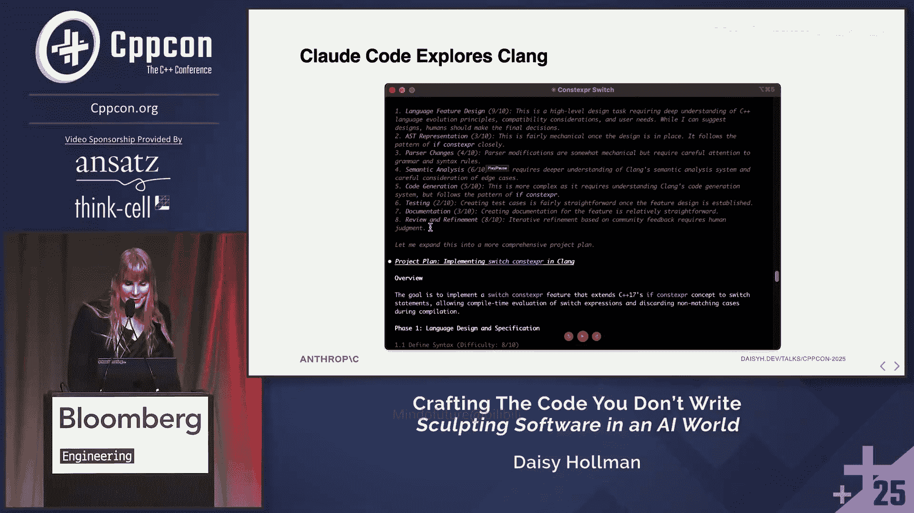

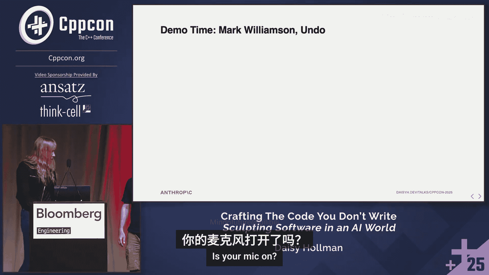

你可以看到我们的旧模型，那些认为自己在写Python的，仍然只想单独返回变量。它们开始有点像是“哦，也许我应该做一些与移动相关的事情”。所以并不是说旧模型对C++一无所知，但新模型知道的数量令人惊讶。

我们实际上认为在这里，这是模型不相信你隐式移动是坏的，因为我从未在编译器中见过这个被破坏。但它仍然在这个明显不在其训练数据中的奇怪场景中得到了正确答案。这不是我作为C++程序员见过的场景。我见过很多其他坏掉的东西，但没见过这个特定的。然而，编译器不仅仅是在复述它的训练数据。这几乎完全来自它的预训练数据，而且它不是在复述训练数据，它是在概念上概括“坏的隐式移动”意味着什么。我认为这真的很有趣。

这是对数刻度，只是为了完整起见。只是为了好玩，把这个也放进去。我认为这很有趣，较新的模型变得更好。3.7 Sonnet似乎很困惑。我想这里的旧模型只是模糊地知道移动在某种程度上与C++11相关。所以它说“哦，这是一个移动，C++11的东西”。事实上，在C++14中，通过核心工作组问题对隐式移动语义进行了修复，这使得问题更加微妙。我想知道它是否捕捉到了这一点。我认为这非常有趣。

### 4.2 本节要点

所以，从这一节中，我希望你得到的收获是：通过概念概括进行压缩，是理解预训练模型如何存储和复述信息的一个有用比喻。它仍然在复述信息，我稍后会解释为什么我用这个词，但它是在概念上复述。它是在思考概念上发生了什么，然后生成与该概念匹配的标记。

## 5. 强化学习与工具使用

现在我们来谈谈强化学习。这基本上是自2022年以来除了规模变化之外的所有进步。但真正引领我们进入更现代时代（我指的是自ChatGPT发布以来，我甚至不会称那个为现代时代，我们很快会讨论现代时代）的许多进步都来自强化学习。

预训练模型的问题在于，它们确实只是花哨的自动补全。这是一个概念概括，但它是在预测下一个标记，而不是在完成任务。这里的任务是回答问题。它是在基于问题的部分内容预测下一个标记，而不是基于它对这个作为任务的理解。

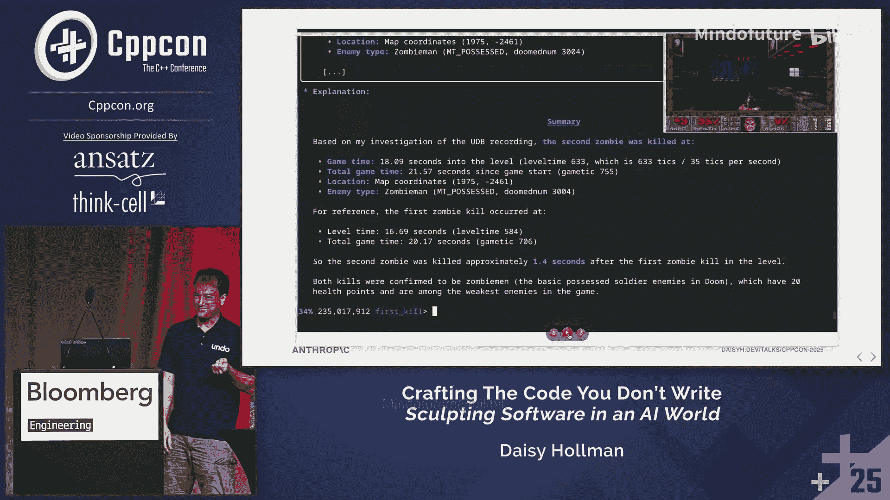

这可能是对训练数据的完全合理的复述。所以`vector`的大小在标准库中定义，`vector`是表示可以改变大小的数组的顺序容器，等等。这是一个例子。顺便说一下，Claude写了我所有的幻灯片，如果你好奇的话，或者说帮助我完成了大部分。我给了它提示，但请给我一点功劳。我给了它一个与C++无关的其他演讲的例子，说“生成一个类似这样的例子，但要针对C++”。我认为它做得很好，这真的很酷。

### 5.1 强化学习工作原理

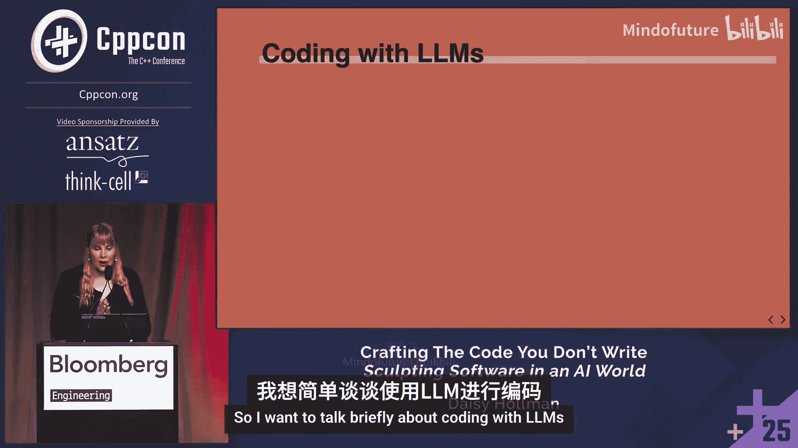

我们来谈谈强化学习是如何工作的。这是我必须最小心的一部分，因为目前正在进行的大多数强化学习工作都是商业机密，并且受到非常严格的保护。这是一个非常活跃的研究领域。

但基本思想是，你给模型一个问题或任务，然后为该任务生成数百个补全。然后你需要某种方式来给这些补全打分。例如，你可以给它一个高中数学多选题测试。这是一个非常简单的版本，因为你知道正确答案，而且没有太多歧义。如果它答错了，你不给它任何分数；如果答对了，你给它很多分数。但如果它生成的是C++代码呢？嗯，这实际上相当复杂。以C++代码为例，如果你要求它生成一个接受随机访问范围的函数，在某些上下文中，在那里使用`Span`可能是正确的，因为你可能还没有C++20。它没有上下文信息来知道你是否拥有C++20，如果你想至少给它一点分数的话。但弄清楚如何编写这些指标、这些评分函数，是一门艺术。这是我们作为一个行业还没有真正弄清楚的事情。甚至还有比这更微妙的地方，我不会在这次演讲中深入，因为你甚至不知道将评分函数应用到哪一组标记上。有时代理可能走错了路，发现是错的，然后走了正确的路，你不想将你的评分指标应用到走错路的部分，只应用到走对路的部分。这绝对是一场噩梦，也是一个活跃的研究领域。

然后你基本上基于那些标记补全计算权重的梯度，使模型更可能给出分数较高的补全，更不可能给出分数较低的补全。我在这里做了很多简化。但大致就是这样。你对许多许多任务重复这个过程很多很多次。同样，需要大量的计算。而且这些任务通常不是短时间范围的任务。在我们的一些训练中，任务通常是获取GitHub仓库中的一个问题，并生成一个修复。评分函数是人工生成的、修复该问题的拉取请求。这些都是我们经常训练这些东西的真实世界任务，行业经常训练这些东西。我对Anthropic具体在做什么不做评论。抱歉。我真的很喜欢我的工作。

这听起来真的很难。比听起来难得多。我希望有更多时间深入探讨。实际上，我准备了一些关于C++例子的精彩幻灯片，但由于时间关系不得不删减。

### 5.2 工具使用与代理

让我们更多地跳入更现代的时代，关于工具使用和代理。

大约在2023、2024年左右，我们意识到XML或JSON等其他结构化标记语言只是文本。所以我们可以给LLM一个关于如果它使用该模式会发生什么的描述，并给它一个模式。然后当我们看到它生成那个时，我们停止。我们做那件事，让那件我们告诉它会发生的事情发生，然后把输出给它，让它继续完成。例如，我们可以让它运行终端命令，或运行编译器、调试器、性能分析器，搜索互联网，搜索代码仓库中的代码，编辑文件。我不认为直到我进入这个领域工作，我才意识到“编辑文件”是我们发现的东西。这对我来说很疯狂。

所以实际上，我有一些Claude Code使用Anthropic API进行工具调用的例子。目前，大多数使用XML。由于各种技术原因，有向JSON转变的趋势，这里就不深入了。

但以下是Claude Code中编辑工具调用的样子。Claude必须逐字生成这个，才能只改变文件中的几个字符。如果旧字符串是错的，工具调用失败。如果文件中有多个旧字符串，工具调用失败。我们处于代理编程的ED时代。这里谁用过ED？如果你没举手，想想看。这就是为什么VI被称为“visual”，因为你在ED里完全看不到自己在做什么。是的，就是查找和替换。这是你曾经使用过的、涉及大型语言模型编辑代码的唯一工具。这让我震惊。有太多事情你必须记住。

在某种程度上，我会称之为超人智能，我自己做不到。我无法在每次需要编辑东西时，在合理的时间跨度内自己做到这一点，并产生连贯的代码。

所以，我想在这里表达的观点是，我们拥有的工具正在拖我们的后腿。我认为在某个时候，我们会想出如何创建代理的VI等价物。剧透一下，不是VI。我们试过。也不是Emacs。而是某种能在编辑时提供同样主动反馈的东西，这样它就不必逐字查找和替换。

为了让你了解这有多好，以及模型在这方面有多擅长，记住我说过Claude Code写了我所有的幻灯片。我用一个JavaScript框架做幻灯片，这个框架是我在2018年从reveal.js分叉出来的，因为我是演讲者，经常做演讲，房间里的其他演讲者完全明白我在说什么。总之，这是你至少不会期望出现在预训练数据中的东西。我让它编辑幻灯片。我告诉它我想说什么，然后让它编辑幻灯片。所以我让它生成了添加这个代码块到我的文件的编辑。

这就是那个编辑工具调用的样子。它第一次就成功了。第一次尝试。在这里，它找到了需要放在下面的列表项，并添加了代码片段。嵌套在其他工具使用中的工具使用，它一点也没搞砸。这对我来说很了不起，但这也像是，对我来说，表明我们的工具设计目前拖累了模型的程度。有很多工作正在积极进行，但我预计这在未来几年会有很大发展。我认为我们确实处于智能体工具化的唾手可得时代。

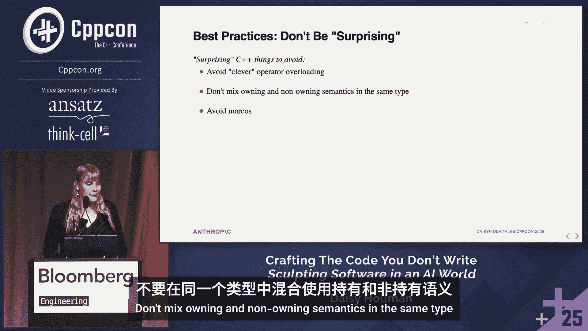

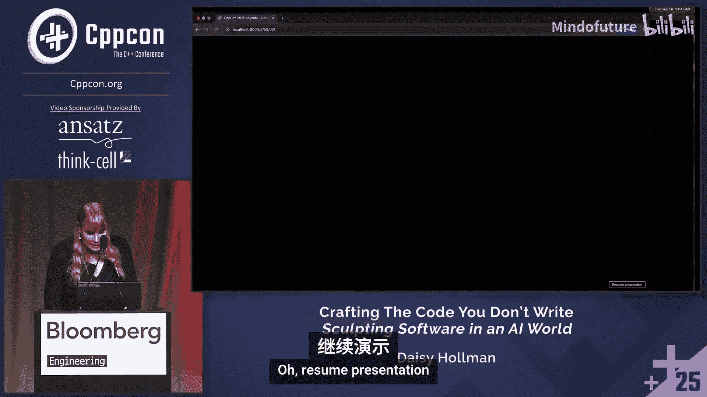

## 6. 推理与上下文窗口

我们来谈谈推理。实际上，我已经在这次会议上听到一些人把这个描述得比实际情况更复杂。

基本上，发生的事情是上下文窗口增长得非常快，尤其是在2024年，2023年到2024年。实际上，我做过这个演讲的一个练习版本，当时我以为我这里的数字错了。我说，这肯定不是GPT-4，GPT-3在最初发布时只有8000个标记，但这实际上就是GPT-4。有一个GPT-4 Turbo模型有128k标记，稍微现代一点。GPT-3有200k标记。Gemini有100万标记。Claude 4有200k标记。基本上，在2025年期间，我们看到这个数字趋于平稳。这有各种原因，我很乐意离线详细讨论。但大致上，上下文窗口不再像2023-2024年那样快速增长。但在2024年，我们问，我们用所有这些额外的标记做什么？这是那个增长的对数图。

2025年初有一些实验，有一些1000万标记的上下文窗口。我认为普遍共识是它们不是很有用。当你把模型摊得那么薄时，它开始变得相当笨。所以我们主要在这个范围内趋于平稳。看看这个在4月左右停止的位置。那么，我们用所有这些标记做什么呢？我们有了所有这些额外的上下文窗口。

我们在2023年开始的一个选项是所谓的检索增强生成，你直接拉入文档、网页、一堆信息，在某种程度上，你可以眯着眼看，然后说“哦，那是工具调用的早期形式”。2024年，我们开始做确定性的工具调用，模型去运行编译器并获取编译器的输出。这确实开始占用窗口，但接近2024年底时，人们说，等等，如果我们只是要求LLM为我们把更多相关的标记放入它的上下文中，会怎么样？

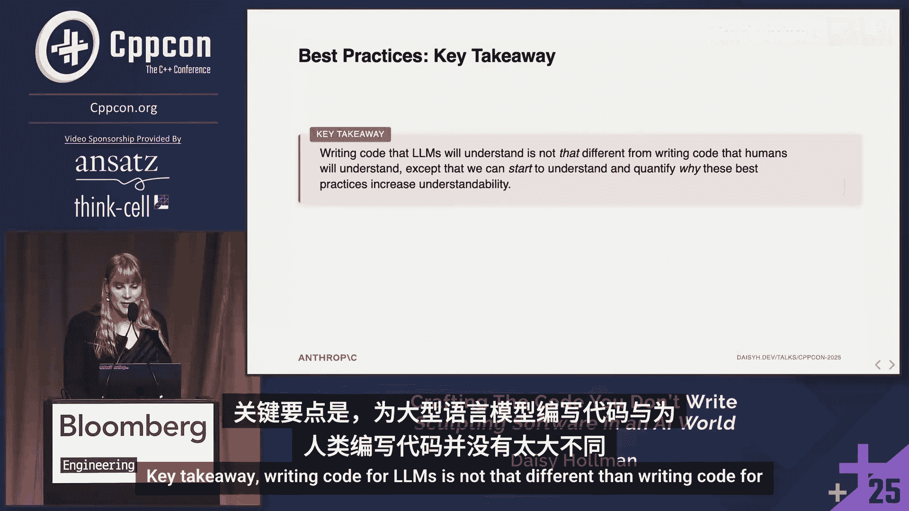

所以这 literally 就是整个创新。来自发现这个创新的论文。在我们这样做之前，我们是这样的：好的，我们将在“Assistant:”之后开始模型补全。在我们这样做之后，我们将在“Assistant: Let me think through this step by step:”之后开始模型补全。就这样。这就是在2024年底震撼AI世界的整个创新。这太疯狂了。这让我难以置信，这竟然是彻底改变LLM的东西。实际上，你知道，我们并不理解很多这些事情。这个是我们我认为我们相当理解为什么奏效的一个。

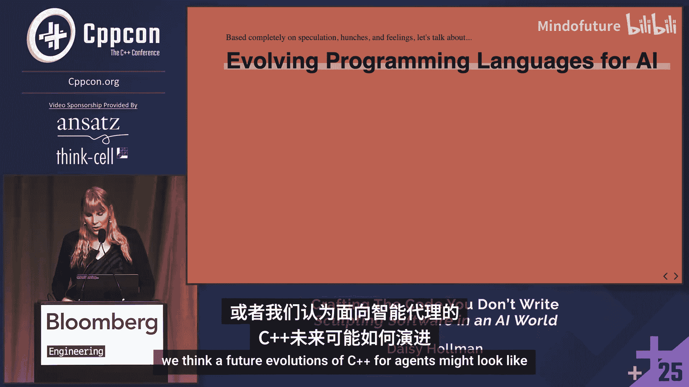

回到我们之前有的这个架构图。我们有这个转换器第1层，第2层，等等。这个“...”做了很多工作。有很多这样的层。记住我说过第一层的注意力是真正连接一个标记到另一个标记，连接标记彼此，等等。然后在下一层，你有点连接标记对，或者连接连接。在后面的层中，你最终构建了或多或少代表一个抽象概念的东西，一个抽象。然后那个抽象可以连接到另一个抽象。但在某个时刻，如果你在太后面的层中形成抽象，那么注意力机制就没有足够的时间将那个抽象连接到另一个抽象。所以它有点错过了连接，生成了错误的标记。

但如果我们告诉模型，它必须首先写出一些代表其“思考”的标记，它实际上必须将那些中间层或后层的抽象转化回标记。因为它将那个抽象转化回标记，并且我们把它放回上下文窗口，我们现在有了那个抽象的更紧凑的表示，这允许它在模型的更早层形成。这说得通吗？我认为这实际上是对这些模型如何在事物之间形成连接的非常深刻的见解。当Anthropic内部有人告诉我这个时，我回到家时下巴都惊掉了。我说，现在这合理多了，我们把抽象移到了标记层。

## 7. 代理与长时程任务

那么，我们来谈谈代理。代理是2025年的热门词汇。我不是在谈论那个流行语版本。我在这里真正谈论的是代理的技术版本，以及它们如何真正影响你使用LLM进行编码的方式。

早期的LLM，非常小的上下文窗口，只能做相对短时间范围的任务。聊天机器人在这方面工作得很好，因为即使你在与人类对话，模型忘记了你三四个问题前说的话，或者人类忘记了你三四个问题前说的话，你会觉得“哦，这似乎是人类可能忘记的合理事情”。它们有点用，对吧？我们也把这些用于花哨的代码行内补全，那些多行补全。这是一个非常直接的应用。你只是预测下一个标记的可能性，然后扔掉一切。如果用户按Tab键，你就把它放进去；如果他们不按，你就不放，你不用担心这个很长的对话历史。

所以这一切都工作得很好。但如果你给它一个更长时间范围的任务，LLM很快就会偏离轨道。它纠正的能力相当有限。我们也缺少这个扩展思考的部分。

随着LLM变得更大，强化学习变得更好，更长时间运行的任务变得更具可行性。关键的见解是，如果我们让模型看到其行动的结果，然后基于该反馈进行迭代，那么我们可以让人类脱离循环更长时间，让它使用更多时间来给用户更好的响应。

例如，如果我们要求标记（模型）生成代码，然后给模型一个工具来运行它生成的代码的编译器，然后将编译结果添加到上下文窗口，然后要求它修复编译错误。所以我们有了这个循环，它可以重新编译代码，看到更多编译错误。它不会自信地声明它生成的代码是正确的。它实际上可以检查自己。这个反馈循环是真正将聊天机器人转变为代理的原因。当人们谈论代理时，他们通常指的是某种具有工具使用的自主性，其反馈循环涉及某种其行动的后果、结果，然后它可以使用这些来创建更好的行动版本。

所以，这是AI研究机构Metr最近做的一个观察：AI可以完成的任务长度大约每七个月翻一番。自2019年以来，这在非常模糊的意义上一直成立。我认为看看2026年这会是什么样子会非常有趣。如果这个趋势继续，它实际上在加速一点点。如果你看的话，我不知道它是否会继续加速。但基本上，是的，我们开始谈论可以运行24小时的模型，可以运行一周的模型。那么，为一个模型编写足够详细的任务让它去工作一周，然后你回来得到一个拉取请求，这看起来是什么样子？那一周的工作值得相对于，比如说，五个小时的工作的改进吗？这将非常有趣。我认为现在没有人能预测未来。总的来说，我是一个乐观主义者，对于那些认识我的人来说。但我认为这会非常有趣。

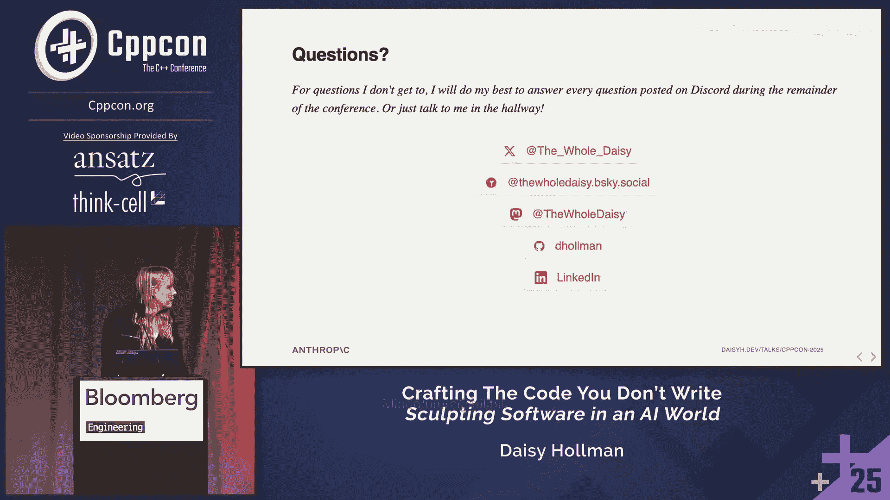

### 7.1 代理如何理解大型代码库

那么，代理如何仅从几十万个标记的上下文中理解一个100万行的代码库呢？同样，我认为问“人类如何做到这一点”非常有帮助。当一个代理无法将所有代码放入上下文时，它如何遍历并弄清楚代码库中发生了什么以执行任务？

我们也不这样做。这里没有人记住了整个Clang代码库。我们搜索关键入口点。我们阅读这些入口点的一些代码，大致浏览寻找与我们试图理解的内容相关的东西。我们查看关键类型和数据结构。如果有核心功能，我们可能搜索关键字符串或类似的东西，我们也可能搜索文档，然后用它来找出我们需要开始阅读哪个文件。换句话说，我们只将部分代码加载到我们的上下文窗口中。也许我们加载其余代码的摘要，或者基于我们过去对代码的经验或我们在类似情况下的经验，加载一个可能略有错误但足够好的概念图景到我们的记忆中。

代理也这样做。所以这是我在三个月前在ACCU做的一个演示。这是用一个较旧的模型。自那以后我们的模型变得更好了。但我基本上要求它遍历Clang代码库。这是Claude Code。我去初始化了它。

我要去问它，向我解释`if constexpr`在Clang中是如何实现的。这里谁写过Clang代码，比如实际的编译器？这些是你需要去问这有多难的人。这非常难。我做过一点点，这是一个非常大、非常复杂的代码库。

所以我问它，`if constexpr`是如何实现的？剧透一下，我要请人上来做演示。它会开始，它会去搜索一些东西。它实际上要求一个子代理去为它总结。它搜索了很多关键字符串。它阅读了一些文件，然后得出了这个报告。由于时间关系，我不会详细讲解。你可以去看我在ACCU演讲中的讲解。但它得出了大致正确的描述。

然后我进去说，好的，现在我想实现`switch constexpr`。它会基于关于`if constexpr`的对话进行概念概括。我把它当作一个工具。我用一个类似的例子来准备上下文，我要求它去阅读。然后我会在它仍然在上下文窗口中有那个信息时，给它一个相关的任务。

所以它会去写一个计划。我不会详细讲整个过程，但整个过程中我最喜欢的部分是，我要求它按1到10的等级评价这个任务的难度。这不是我想做的。它在这里说，按1到10的等级，最困难的部分是9/10，是说服C++委员会接受这个提案。我认为这有点低了。但公平地说，它没参加过委员会会议，因为我们的笔记不在它的训练数据中，它们不是公开的。

## 8. 演示：代理与时间旅行调试器

好的，我要请上来自Undo的Mark Williamson，他一直在做很多代理工作。我们要在这里做一个快速演示。我希望麦克风没问题。我们四月份在ACCU开始交谈。

你研究时间旅行调试器。我想简要解释一下那是什么。当然。嗨，我是Mark。我是Undo的CTO。当我们说时间旅行调试器时，我们指的是捕获程序整个执行过程的能力。所以实际上是机器指令精度，包括内存中的所有内容，每个变量状态、代码行，然后确定性地重放它。我们实际上做了很多技巧来使其比听起来高效得多。我们只捕获可能影响行为的非确定性输入。但最终目标是，人类或AI可以检索他们想要的关于那次软件运行行为的任何信息。

你一直在幕后与Claude Code团队合作，主要是你自己，因为我们的沟通本应更好，我很抱歉，但构建了一个工具给我们的代理，基本上是一个工具，一个MCP服务器。这是一种创建工具的奇特方式。现在代理可以控制调试器了，对吧？Claude Code可以控制你的调试器运行。你要向我们展示你能用它做什么。

当然。在开始之前，先做一点铺垫。在这个案例中，我玩了一个小游戏《毁灭战士》。我使用的是Chocolate Doom，一个开源克隆版，它非常接近原始源代码结构。我用我们的实时记录器工具记录了我的游戏过程。所以我捕获了发生的一切，我们可以重新计算我游戏过程中发生的任何事情。

我们这里有的是，我已经在那个记录中运行到了末尾，在Rdbugger中。在右上角，你可以看到我们当前检查的记录点帧缓冲区的实时更新。我现在要做的是使用我们的AI集成来找出关于代码语义的一些高级信息。在这个游戏过程中，第二个僵尸是什么时候被杀死的？

它正在