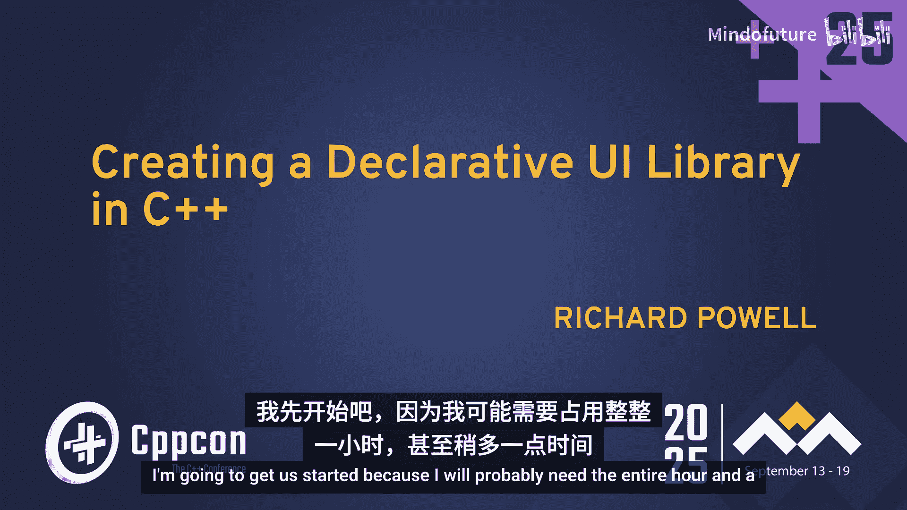
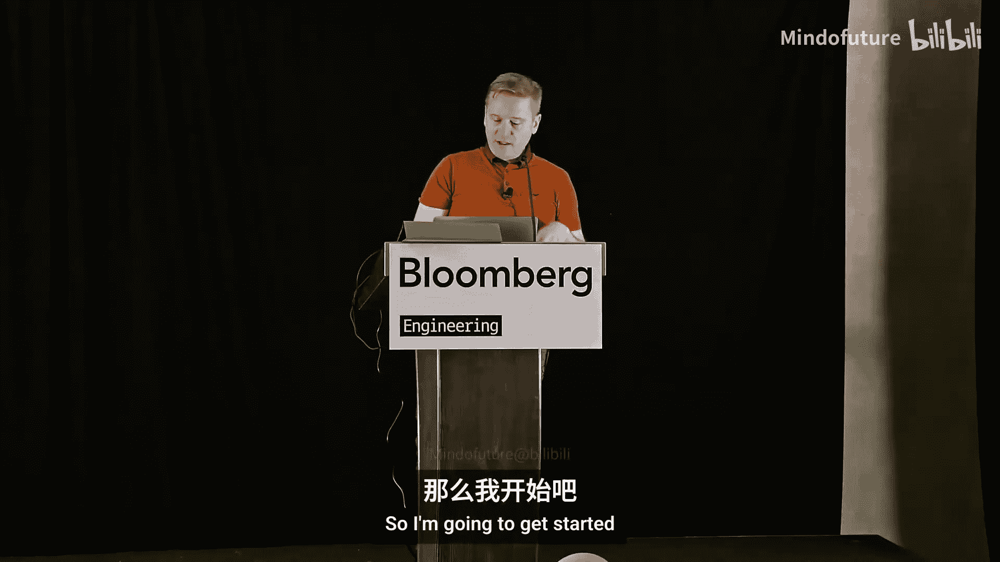
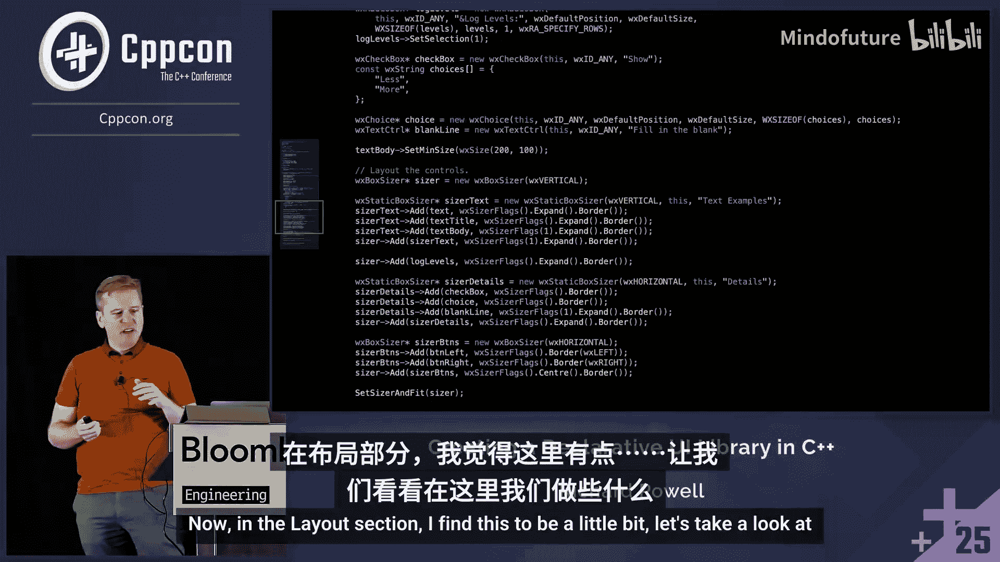
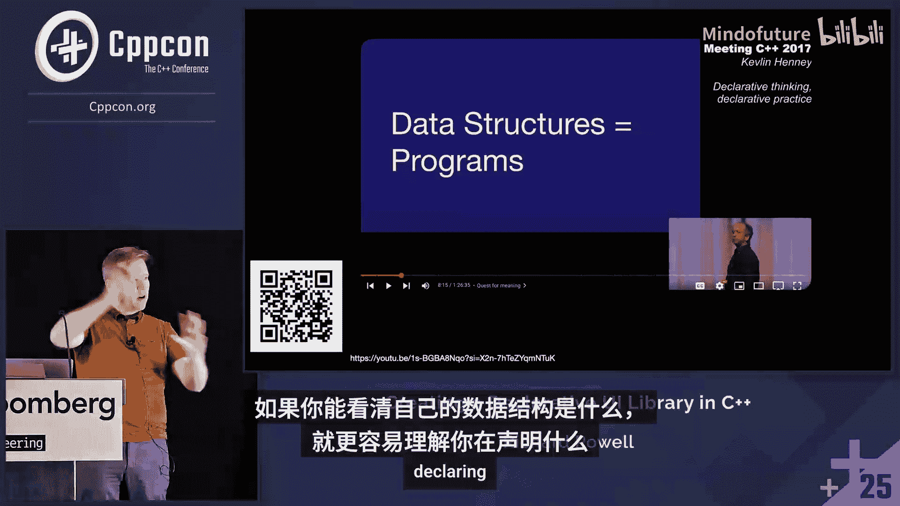
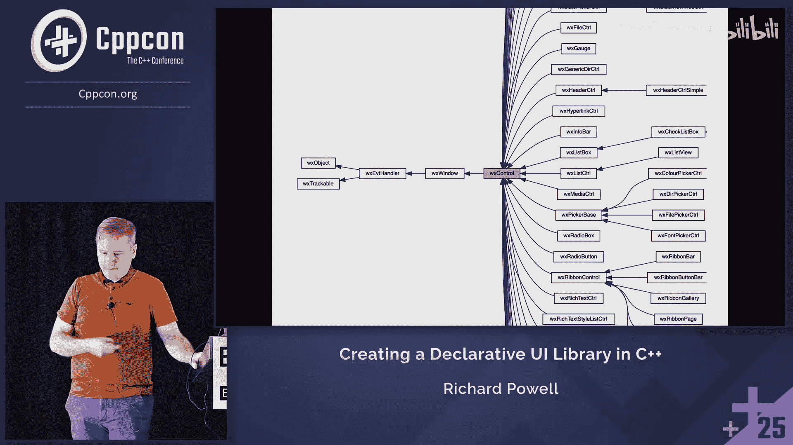
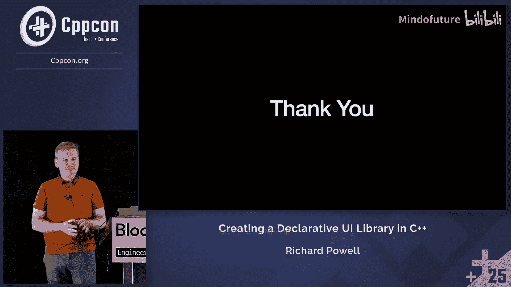
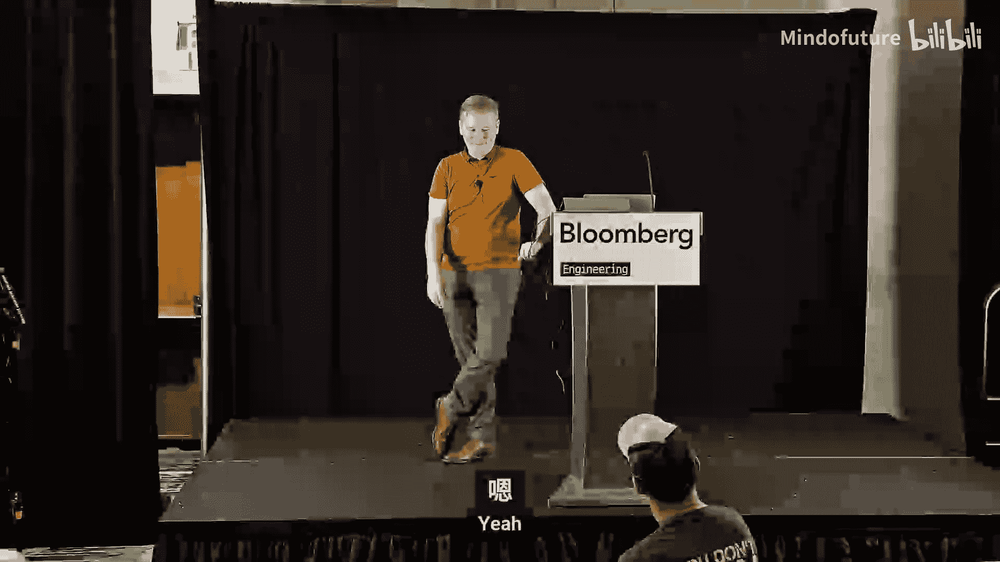
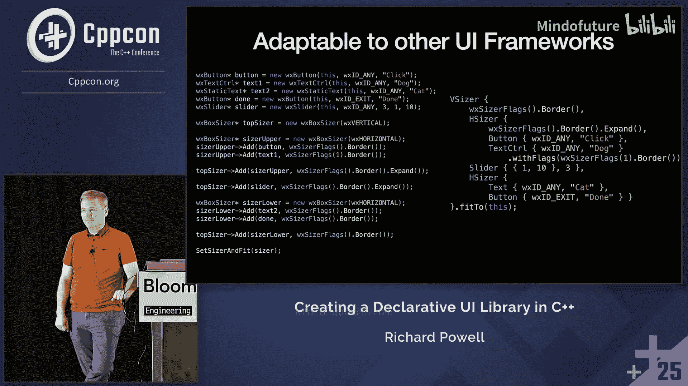

# 061：打造更可读的C++






在本教程中，我们将学习如何将传统的、命令式的C++ UI代码重构为更具声明性的风格。我们将以WX Widgets框架为例，展示如何通过识别隐藏的数据结构、减少语句、偏好表达式以及应用设计模式，使代码更易于阅读和维护。

## 概述

我们从一个基础的WX Widgets“Hello World”应用程序开始，逐步重构其布局代码。初始代码充满了显式的对象创建和布局步骤，显得冗长且脆弱。我们的目标是将其转化为一个清晰、声明式的数据结构，该结构描述了UI的最终形态，而非构建它的具体步骤。

## 从命令式到声明式

上一节我们介绍了教程的目标和起点。本节中，我们来看看初始的命令式代码存在哪些问题，以及声明式编程的核心思想。

初始的布局代码充满了“如何做”的指令：创建尺寸器、添加控件、设置标志。这种代码容易出错，例如遗漏添加某个控件或使用错误的尺寸器，都会导致UI显示异常。

声明式编程是一种非命令式的编程风格，程序描述其期望的结果，而不是明确列出必须执行的命令或步骤。在C++的上下文中，这通常意味着：
*   **偏好表达式而非语句**。
*   **让数据结构清晰可见**，从而更容易看出程序的意图。



我们的重构将围绕这两个原则展开。

## 第一步：识别并简化通用模式

上一节我们明确了声明式编程的原则。本节中，我们通过一个简化的UI例子，开始识别代码中的通用模式。

我们从一个包含四个控件（按钮、文本框等）的简单UI开始。初始的创建和布局代码是命令式的。



以下是第一个重构步骤：使用`auto`和就地构造来减少冗余。

```cpp
// 重构前：显式类型和分离的构造
wxButton* clickButton = new wxButton(this, wxID_ANY, “Click”);
wxTextCtrl* dogTextCtrl = new wxTextCtrl(this, wxID_ANY, “Dog”);
// ... 更多控件
sizer->Add(clickButton);
sizer->Add(dogTextCtrl);
// ... 更多添加操作

// 重构后：使用auto和就地构造
auto* clickButton = new wxButton(this, wxID_ANY, “Click”);
auto* dogTextCtrl = new wxTextCtrl(this, wxID_ANY, “Dog”);
// ... 更多控件
sizer->Add(clickButton);
sizer->Add(dogTextCtrl);
// ... 更多添加操作
```

观察代码，我们发现一个重复模式：`sizer->Add(new WidgetType(this, wxID_ANY, args...));`。我们可以将其抽取为一个函数。

## 第二步：抽取函数与引入数据结构

上一节我们识别出了通用模式。本节中，我们将其抽取为函数，并进一步演化为一个轻量的数据结构。

我们创建一个`create_and_add`函数，它封装了公共的创建和添加逻辑。类型通过模板参数传递，值通过函数参数传递。

```cpp
template <typename WidgetT>
void create_and_add(wxSizer* sizer, wxWindow* parent, const wxString& label) {
    sizer->Add(new WidgetT(parent, wxID_ANY, label));
}
```

然而，我们注意到这个“操作”本身（类型和参数）可以看作一个待应用的数据单元。我们可以定义一个`struct`来保存这些信息，并提供一个成员函数来执行操作。

```cpp
template <typename WidgetT>
struct Widget {
    wxString label;
    auto create_and_add(wxSizer* sizer, wxWindow* parent) const {
        sizer->Add(new WidgetT(parent, wxID_ANY, label));
    }
};
// 使用方式
Widget<wxButton>{“Click”}.create_and_add(sizer, this);
```

这看起来像是为了单次调用而创建了一个临时对象，但它为后续的组合奠定了基础。

## 第三步：组合与元组

上一节我们将单个控件的创建封装成了数据对象。本节中，我们看看如何组合多个这样的对象。

现在我们有多个`Widget`对象。我们希望将它们作为一个整体来处理。在C++中，异质集合（即包含不同类型元素的集合）可以用`std::tuple`表示。

我们可以创建一个`Widget`的元组，然后使用`std::apply`对元组中的每个元素调用`create_and_add`函数。

```cpp
auto widgets = std::make_tuple(
    Widget<wxStaticText>{“Cat”},
    Widget<wxButton>{“Click”},
    Widget<wxTextCtrl>{“Dog”},
    Widget<wxButton>{“Done”}
);

std::apply([&](auto&&... w) { (w.create_and_add(sizer, this), ...); }, widgets);
```

为了使接口更友好，我们可以创建一个辅助函数来隐藏元组的创建。

```cpp
template <typename... WidgetTs>
void create_and_add_all(wxSizer* sizer, wxWindow* parent, WidgetTs&&... widgets) {
    (widgets.create_and_add(sizer, parent), ...);
}
// 使用更简洁
create_and_add_all(sizer, this,
    Widget<wxStaticText>{“Cat”},
    Widget<wxButton>{“Click”},
    Widget<wxTextCtrl>{“Dog”},
    Widget<wxButton>{“Done”}
);
```

我们还可以使用C++20的概念（concept）来约束`WidgetTs`参数包，确保它们都支持`create_and_add`操作。

## 第四步：处理尺寸器与构建树形结构



上一节我们处理了控件的组合。本节中，我们将尺寸器也纳入这个声明式体系，从而构建出完整的UI树。

尺寸器（Sizer）本身也可以被看作是一种特殊的“控件”，它包含一组子控件或子尺寸器。我们可以用同样的思路为尺寸器创建数据对象。

```cpp
struct Sizer {
    wxOrientation orientation;
    std::vector</* 某种表示子项的类型 */> children;
    // ... 标志等
    auto create_and_add(wxSizer* parent_sizer, wxWindow* parent) const {
        auto* sizer = new wxBoxSizer(orientation);
        for (const auto& child : children) {
            child.create_and_add(sizer, parent); // 递归或迭代添加子项
        }
        parent_sizer->Add(sizer, flags);
    }
};
```

通过让`Sizer`也支持`create_and_add`操作，我们实现了控件的嵌套。一个水平尺寸器可以包含几个按钮，一个垂直尺寸器可以包含多个水平尺寸器或控件，从而形成一棵UI树。

最终，我们可以将整个UI布局表达为一个单一的、嵌套的数据结构，并通过一个顶层的`fit_to`函数一次性将其构建出来。

```cpp
fit_to(this, // 父窗口
    VSizer{ // 垂直尺寸器
        HSizer{ // 水平尺寸器
            Widget<wxStaticText>{“Cat”},
            Widget<wxButton>{“Click”}
        },
        HSizer{ // 另一个水平尺寸器
            Widget<wxTextCtrl>{“Dog”},
            Widget<wxButton>{“Done”}
        }
    }
);
```

## 第五步：扩展性与设计模式

上一节我们构建了声明式的UI树。本节中，我们探讨如何扩展这个体系以支持更多样化的控件，并引入设计模式。



当遇到API不一致的控件（例如滑块`wxSlider`，它的构造函数参数是整数值而非字符串）时，简单的`Widget`结构就不够用了。我们需要分离“创建什么”和“如何添加”。

这里可以应用**模板方法模式**。我们定义一个基类`WidgetBase`，它包含一个`create_and_add`方法（模板方法），该方法调用一个纯虚函数`create`（由子类实现）。

```cpp
template <typename Derived>
class WidgetBase {
protected:
    ~WidgetBase() = default;
public:
    auto create_and_add(wxSizer* sizer, wxWindow* parent) const {
        sizer->Add(create(parent)); // 模板方法
    }
private:
    virtual wxWindow* create(wxWindow* parent) const = 0;
};



class SliderWidget : public WidgetBase<SliderWidget> {
    int m_min, m_max, m_value;
public:
    SliderWidget(int min, int max, int value = min)
        : m_min(min), m_max(max), m_value(value) {}
private:
    wxWindow* create(wxWindow* parent) const override {
        return new wxSlider(parent, wxID_ANY, m_value, m_min, m_max);
    }
};
```

为了支持流畅的构建器模式（例如设置尺寸标志、位置等），我们需要让设置函数返回对象本身的引用（对于可变对象）或一个新对象（对于不可变对象）。这允许链式调用：`Widget<...>{...}.with_flags(...).with_pos(...)`。

## 总结



本节课中我们一起学习了如何将命令式的C++ UI代码重构为声明式风格。关键步骤包括：
1.  **识别模式**：在重复的命令式代码中寻找隐藏的数据结构。
2.  **抽取与抽象**：将通用操作抽取为函数或可调用的数据对象。
3.  **使用元组处理集合**：利用`std::tuple`和`std::apply`处理异质控件集合。
4.  **构建组合树**：让尺寸器也遵循相同的接口，形成可嵌套的UI树结构。
5.  **应用设计模式**：使用模板方法模式分离变与不变，使用构建器模式实现流畅接口。


最终成果是一段更简洁、更易读、更不易出错的代码，它清晰地描述了UI的最终形态，并且其核心数据结构与具体的UI框架（如WX Widgets）解耦，具备了良好的可移植性。声明式编程的核心在于让代码表达“是什么”，而不是“怎么做”，这能极大地提升代码的可维护性和开发者的意图传达效率。