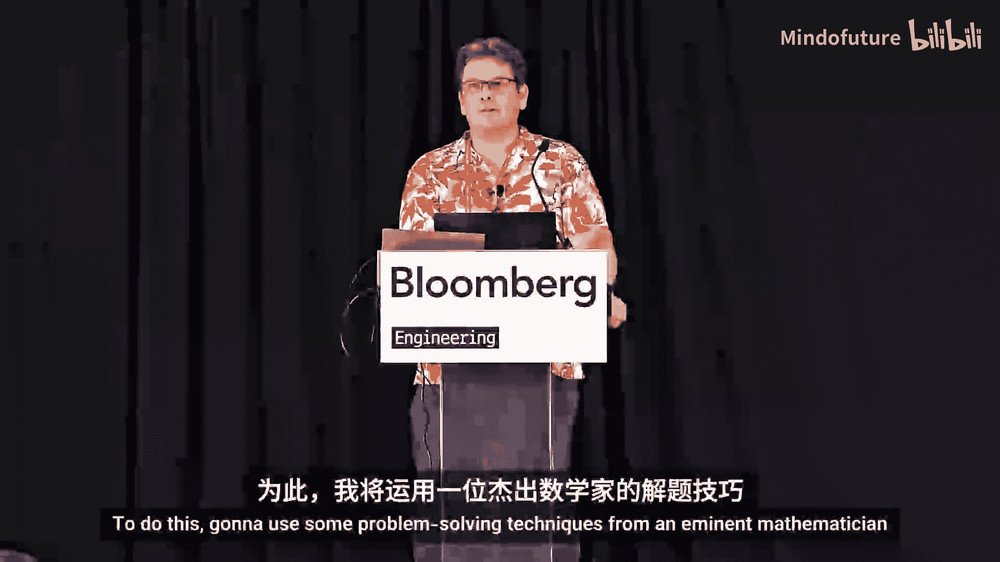
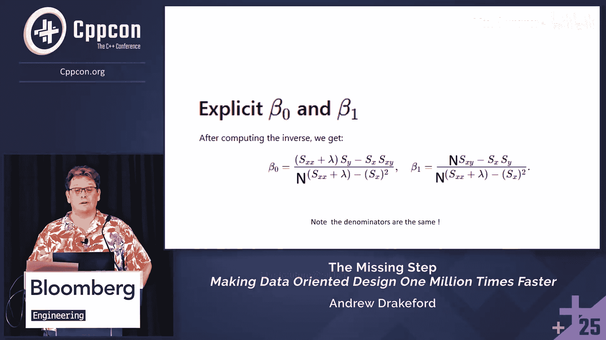
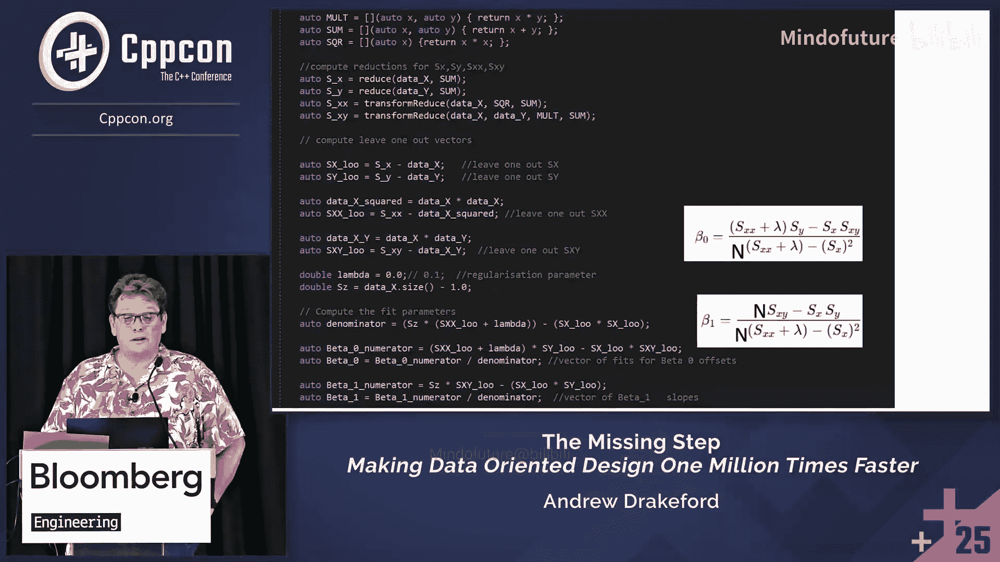
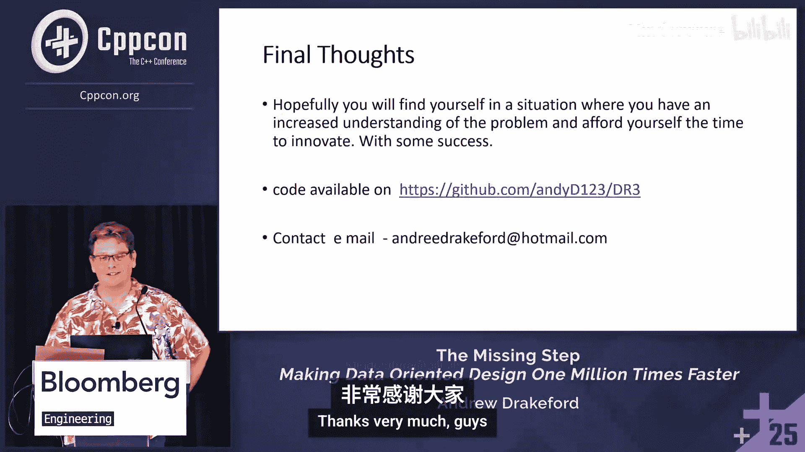
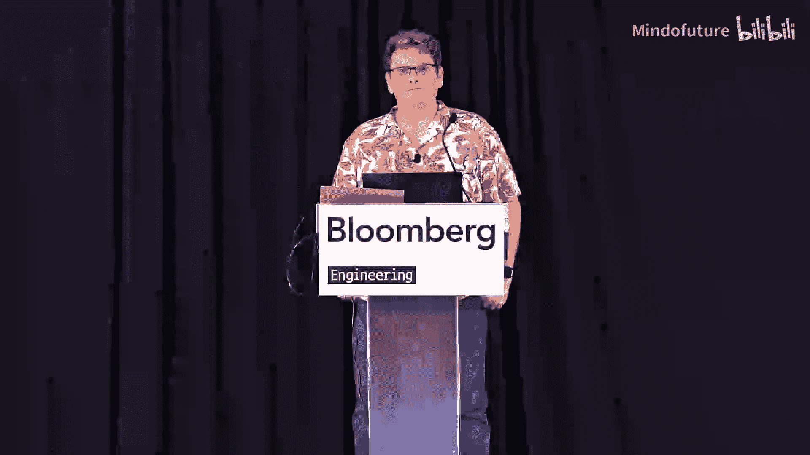

# 062：数据导向设计能快一百万倍吗？🚀




在本节课中，我们将要学习如何通过扩展问题解决的上下文，结合数学启发式方法，将数据导向设计的性能提升推向极致。我们将跟随Andrew Drakeford的思路，从一个耗时14000秒的机器学习回归问题出发，探索如何通过系统性的问题分析，最终将其优化到仅需18毫秒。

---

## 理解问题与制定计划 🧠

上一节我们概述了课程目标，本节中我们来看看解决问题的第一步：理解问题并制定计划。

数据导向设计的核心思想是：程序只是将数据从一种形式转换为另一种形式。要理解问题，必须先理解数据；要理解成本，必须先理解硬件。代码本身就是数据。掌握越多的上下文信息，就越能构建出优秀的解决方案。

然而，现实世界中的设计问题远比理论复杂。我们面临算法选择、数据空间布局、缓存一致性、并行化（如SIMD）、执行顺序优化以及高维数据查询等诸多挑战。开发者很容易埋头于优化数据局部性或向量化，却忽略了问题域本身可能存在的、更大的优化机会。

我主张，设计问题包含三个层面：
1.  **逻辑算法层面**：核心的计算逻辑。
2.  **时空排序与布局层面**：数据的组织与访问模式。
3.  **问题域特定层面**：只有深入理解具体领域知识才能发现的模式和约束。

“缺失的一步”正是一种系统性的工作方法，能够统筹所有这些层面。我提议使用数学家乔治·波利亚的问题解决方法论作为我们的工具。他的方法强调启发式思维，并提供了一个生命周期：理解问题、制定计划、执行计划、回顾反思。

波利亚指出，解决问题失败的主要原因首先是**对问题理解不完整**，其次是**计划失败**（要么毫无计划地蛮干，要么空等灵感降临）。因此，遵循一个结构化的过程至关重要。

---

## 波利亚的问题解决启发法 📚

上一节我们介绍了系统性方法的重要性，本节中我们来看看波利亚提供的具体问题解决启发法。

波利亚的经典著作《怎样解题》提供了详细的技巧。其核心流程如下：
1.  **理解问题**：未知数是什么？已知数据是什么？条件是什么？问题是否可解？
2.  **制定计划**：寻找已知与未知之间的联系。考虑你是否见过类似问题，能否重新表述它。
3.  **执行计划**：耐心、细致地执行每一步，并检查中间结果。
4.  **回顾反思**：检查结果，尝试用其他方法推导，总结方法以便将来使用。

当陷入困境时，一个关键启发法是：**尝试解决一个相关的、更简单的问题（辅助问题）**。通过解决它，你可以获得对解决方案空间的直觉。

以下是波利亚提到的一些具体启发法：
*   **类比**：联想已知的类似问题。
*   **分解与重组**：将问题分解成极小部分，再以不同方式重组。
*   **一般化与特殊化**：尝试解决更一般或更特殊版本的问题。
*   **逆向工作**：从假设的答案出发，反向推导。
*   **引入辅助元素**：构造图表、符号或设定中间目标。
*   **问题归约**：将问题映射到另一个有解法的领域。

此外，苏格拉底式的提问方式也很有帮助，例如：澄清性问题、探寻证据的问题、探讨不同观点的问题、探究影响的问题。

---

## 实战案例一：金融定价矩阵优化 💹

上一节我们学习了理论工具，本节中我们将这些工具应用于第一个实战案例。

我们曾遇到一个金融定价函数，它需要填充一个大矩阵（例如相关矩阵），矩阵的每个元素都需要调用一个极其昂贵的函数 `F_impulse`。矩阵维度 `n` 可能很大，导致计算复杂度为 `O(n²)`。

初始代码结构如下：
```cpp
double total = 0.0;
for (int i = 0; i < n; ++i) {
    for (int j = 0; j < n; ++j) {
        total += F_impulse(t, i, j); // 昂贵调用
    }
}
```
而 `F_impulse` 内部涉及对三个时间值取最小值的操作。

**应用波利亚方法：**
1.  **理解问题**：我们注意到矩阵可能沿对角线对称。但更核心的是 `F_impulse` 的内部操作 `min(t, T_i, T_j)`。
2.  **制定计划/创建辅助问题**：为了看清本质，我们大幅简化问题：
    *   忽略参数 `t`。
    *   将时间轴 `T_i` 简化为整数索引 `i`。
    *   将昂贵的 `F_impulse` 替换为直接返回 `min(i, j)`。
    这样，我们就创建了一个易于分析的辅助问题：计算矩阵 `M[i][j] = min(i, j)` 所有元素之和。
3.  **执行计划/画图**：我们画出了一个 7x7 的矩阵，并标注出 `min(i, j)` 的值。图案立刻显现出来——矩阵被分割成了多个清晰的带状区域，而非 `n²` 个独立单元。
    ```
    1 1 1 1 1 1 1
    1 2 2 2 2 2 2
    1 2 3 3 3 3 3
    1 2 3 4 4 4 4
    1 2 3 4 5 5 5
    1 2 3 4 5 6 6
    1 2 3 4 5 6 7
    ```
    我们发现，对于 `n x n` 矩阵，只有 `n` 个不同的区域值，每个区域的大小可以轻松算出。
4.  **回顾反思/推广回原问题**：将简化问题的洞察带回原问题：
    *   若 `t < 所有 T_i`，则 `min(t, T_i, T_j)` 总是 `t`，只需计算一次并乘以 `n²`。
    *   若 `t > 所有 T_i`，则退化为 `min(T_i, T_j)`，即我们分析的简化问题。
    *   若 `t` 在中间，则是上述两种情况的混合。
    新算法只需计算少数几次 `F_impulse`，然后乘以对应区域大小即可。

**结果**：性能提升了 **40 到 260 倍**。通过简化问题、绘制图表，我们获得了巨大收益。

---

## 实战案例二：留一法回归的百万倍加速 🤖

上一节我们通过简化与绘图解决了一个问题，本节我们来看一个更复杂的案例，展示扩展问题上下文的力量。

在量化基金的机器学习中，我们使用“留一法回归”来评估预测因子的稳健性。对于包含 `N` 个数据点的数据集，需要对每个点 `i` 都进行一次回归拟合（使用除 `i` 点外的所有数据），然后用该拟合来预测点 `i` 的值，并计算残差。这需要进行 `N` 次拟合，朴素实现复杂度为 `O(N²)`。



线性回归的目标是找到参数 `β₀`（截距）和 `β₁`（斜率），以最小化误差平方和。我们使用正则化（岭回归），其解由以下公式给出：
```
β = (XᵀX + λI)⁻¹ Xᵀy
```
其中，`X` 是设计矩阵（包含一列1和一列特征值），`y` 是目标值。计算 `XᵀX` 和 `Xᵀy` 需要对整个数据集进行求和，这是 `O(N)` 的操作。在留一法循环中，这导致了 `O(N²)` 的复杂度。



**初始（次优）思路**：
我们识别出求和的内部循环是瓶颈。自然的想法是：使用向量化、多线程、SIMD 来加速这个求和。这或许能带来 10 倍的加速，看起来不错。

**但这是最佳方案吗？应用波利亚方法：**
1.  **理解问题**：我们聚焦于单个求和项，例如 `SX = Σx_k`（所有数据点的 x 之和）。
2.  **制定计划/创建辅助问题**：我们不再只看单次拟合的内部循环，而是扩展上下文，审视所有 `N` 次留一拟合之间的关系。我们提出辅助问题：“第 `i` 次留一拟合的 `SX⁽ⁱ⁾`（排除点 `i` 的 x 之和）与完整的 `SX` 有什么关系？”
3.  **执行计划/画图**：我们画出一个表格，行表示留一拟合的索引，列表示数据点。很快发现其中存在大量冗余计算。
    *   对于只有两个数据点的简单情况：`SX⁽⁰⁾ = x₁`, `SX⁽¹⁾ = x₀`。
    *   观察发现：`SX⁽⁰⁾ = (x₀ + x₁) - x₀ = SX - x₀`。同理，`SX⁽¹⁾ = SX - x₁`。
4.  **洞察**：**每个留一法的求和，都等于全局总和减去被排除的那个数据点的值！** 这个发现让人豁然开朗。
    ```
    SX⁽ⁱ⁾ = Σ_{k≠i} x_k = (Σ_{all k} x_k) - x_i = SX - x_i
    ```
    这个规律同样适用于 `Σx²`、`Σy` 和 `Σxy`。
5.  **新算法**：
    *   **步骤1**：用 `O(N)` 时间计算一次全局总和：`SX`, `SX2`, `SY`, `SXY`。
    *   **步骤2**：对于每个 `i`，用 `O(1)` 时间计算留一法的统计量：`SX⁽ⁱ⁾ = SX - x_i`，等等。
    *   **步骤3**：用 `O(1)` 时间计算该留一拟合的回归参数 `β₀⁽ⁱ⁾` 和 `β₁⁽ⁱ⁾`。
    总复杂度从 `O(N²)` 降为 `O(N)`。

**实现与结果**：
我们使用一个支持向量化操作的库（如作者自研的 DR3）来实现新算法。对于百万级数据点的百万次留一拟合，运行时间从**14000秒**优化到了**18毫秒**，实现了近百万倍的加速。

**关于精度的启发法**：
在求和计算中，标准的顺序累加可能导致精度损失。波利亚的“逆向工作”启发法提示我们：要使最终求和最精确，最后一步相加的两个数应该量级相近。这引出了**成对求和**算法：递归地将数组对半拆分，分别求和后再相加。与普通累加相比，成对求和能提供更好、更稳定的精度。



---

## 总结与收获 🎯

本节课中我们一起学习了如何将乔治·波利亚的系统性问题解决方法论应用于高性能计算和数据导向设计。

**核心收获如下：**
1.  **设计问题是高维的**：不要局限于代码层面的优化（如缓存、向量化），要深入问题域寻找特定模式和约束。
2.  **波利亚方法论是强大工具**：遵循“理解-计划-执行-反思”的循环，并善用启发法（如创建辅助问题、画图、类比）。
3.  **警惕“英雄式”局部优化**：过早聚焦于内循环优化（例如，只想用SIMD加速求和）会限制视野，可能让你错过通过算法重构实现数量级提升的机会。
4.  **画图与简化极其有效**：绘制草图能快速暴露问题结构。解决一个简化的辅助问题往往是突破僵局的关键。
5.  **体验“顿悟”的感觉**：通过这种方法获得数十倍乃至百万倍的性能提升，会带来巨大的成就感。




最后，记住波利亚的忠告：“如果你不能解决所提出的问题，那就先去解决一个与之相关的问题……绕过无法直接克服的障碍，设计某个合适的辅助问题。”当你感到困惑时，不要停滞不前，去寻找一个你能解决的问题，它必将为你指明方向。