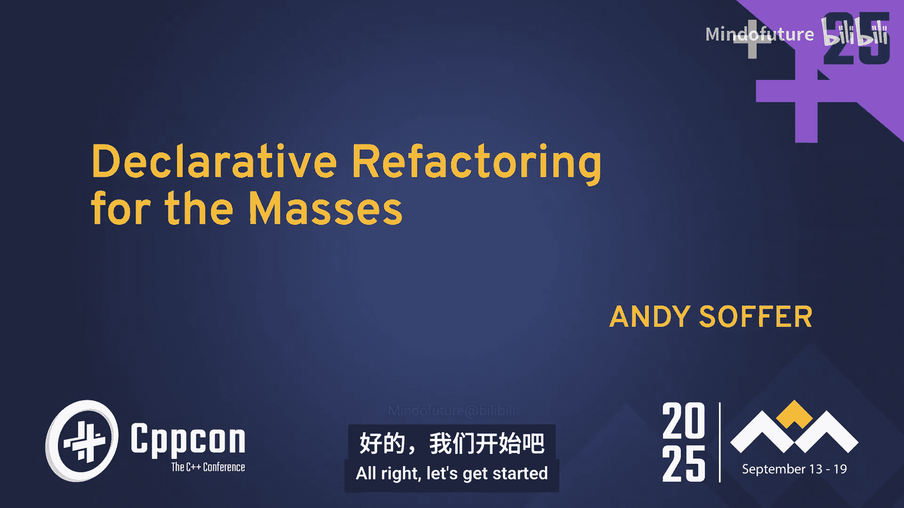
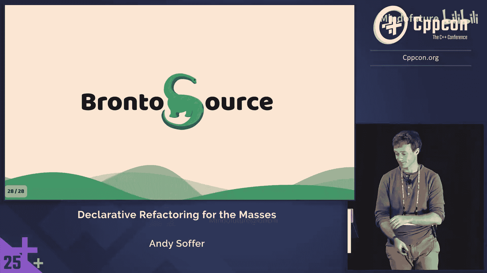
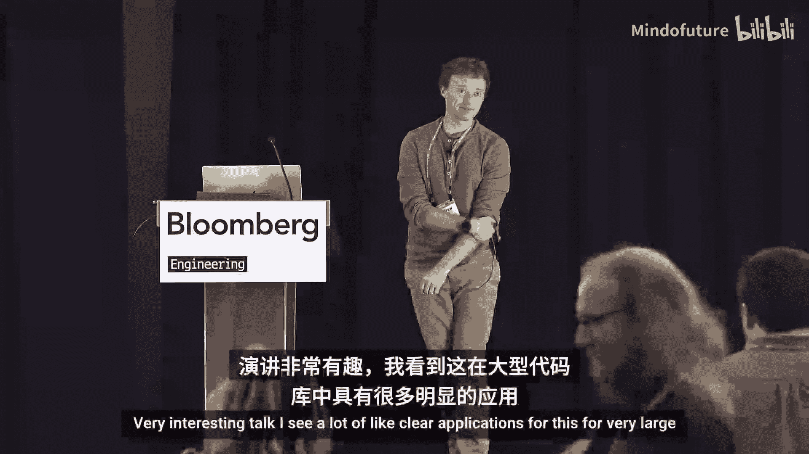
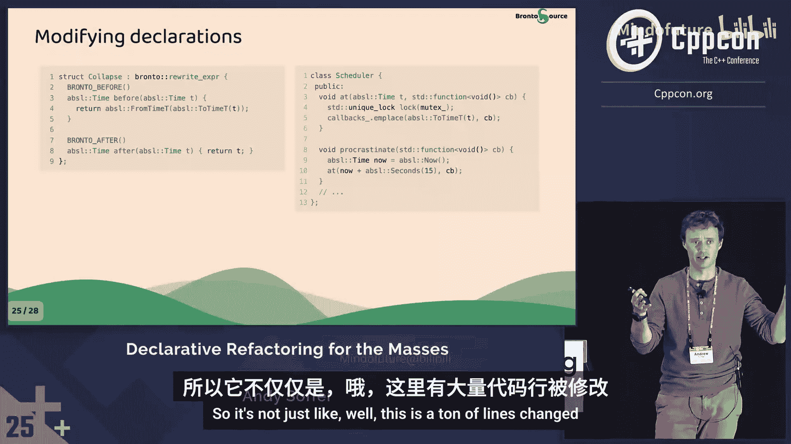
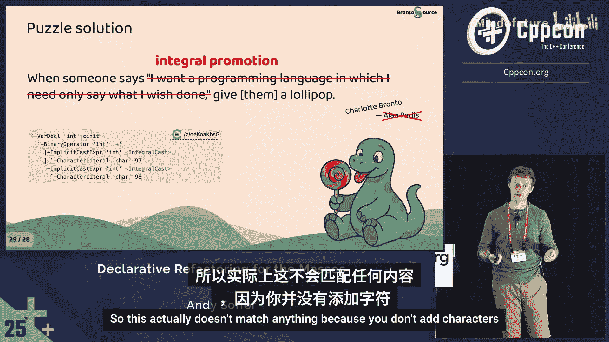

# 063：面向大众的声明式重构



在本节课中，我们将要学习一种名为“声明式重构”的代码重构方法。我们将探讨其核心概念、工作原理，并通过一系列代码示例来展示如何利用简单的声明式注解和规则，自动化地完成复杂的C++代码迁移和优化任务，而无需深入了解编译器内部原理。

## 什么是声明式重构？

首先，我们来分解“声明式重构”这个术语。

**声明式**是一种编程风格，其核心思想是**描述“应该做什么”**，而不是**描述“具体如何做”**。这种“做什么”而非“如何做”的理念是声明式风格的精髓。

**重构**通常被定义为在不改变程序可观察行为的前提下修改其实现。但更宽泛地说，我们讨论的是修改程序本身，不包括修复Bug或添加新功能，其他对代码的修改都可视为重构。

而**面向大众**这一部分对我个人而言至关重要。我希望构建的工具能被任何C++工程师使用，而不仅仅是专家。我希望它的学习曲线平缓，对初级开发者有用，并且不需要你了解编译器的工作原理就能上手使用。这符合“简单的事情应该简单，复杂的事情应该可能”的理念。

## 声明式风格的优点与挑战

声明式风格有许多优点。它通常更易于推理，更不容易出错。例如，你可以向一个从未做过软件工程的人展示一个正则表达式，他们也能大致猜出它的工作原理。

然而，任何事物都有权衡，声明式风格也有其缺点。

首先，**实现难度高**。计算机本质上是过程式的，而声明式语言则不是。因此，必须有一个编译器、解释器或运行时系统在幕后将你的声明翻译成计算机能理解的东西，这是一个非常困难的任务。

其次，声明式工具往往**限制性更强**。例如，正则表达式（理论上）只能匹配正则语言，无法匹配像C++这样的复杂语法。当遇到限制时，开发者可能会用声明式工具构建出复杂而丑陋的解决方案来绕过限制，这就是为什么我们会看到非常难看的SQL查询或正则表达式。

## 为何选择声明式进行重构？

那么，如果我们想在重构中使用声明式风格，它应该是什么样子？我们需要什么？

重构的核心是**查找**程序的某些部分并**替换**它们。如果要以声明式的方式进行：
*   **查找部分**：我们需要描述要找什么，而不是如何找到它。
*   **替换部分**：我们需要描述要替换成什么，而不是如何进行具体的文本操作。

因为我关心“面向大众”，所以这需要尽可能直观。此外，由于我们重构的是C++，仅仅查看程序文本是不够的，我们需要访问类型系统，并且必须处理宏和预处理器。

一个显而易见的选择是 **Clang Tidy**。它非常强大，自带数百个检查项，其中约一半能自动修复代码。它是免费且可定制的。

但是，编写自定义的Clang Tidy检查有其痛点。分发和维护自定义检查很麻烦，因为你需要处理Clang不稳定的内部API。更重要的是，编写Clang AST匹配器非常复杂，需要深入了解编译器的内部工作原理和语言细节，这对于初级开发者来说门槛太高。

## 一种新的声明式方法：代码注解

让我们思考一种更声明式的方法。如果我们可以直接在我们的C++代码上添加注解来表达我们的重构意图呢？工程师已经熟悉C++，所以我们只需用注解来标明我们希望重构时发生什么。

以下是这种方法的一个核心示例：**函数内联**。

### 示例：函数内联

内联函数的基本思想是，你注解一个希望被内联的函数，工具会找到所有调用该函数的地方，并用函数体替换这些调用。

```cpp
// 原始代码（定义端）
[[bento::inline]]
int add(int x, int y) {
    // 这是一个重要的加法
    return MACRO_ADD(x, y);
}

// 原始代码（调用端）
int result = add(1, 2);

// 内联后的调用端代码
int result = (1 + 2); // 这是一个重要的加法
```

这里有两个关键点：
1.  **文本性**：替换保留了宏和注释，表明这是一种基于文本的替换。
2.  **语义正确性**：工具自动添加了括号 `(1 + 2)` 以保持运算优先级，这表明它不仅仅是文本替换，还考虑了语义，以确保生成等价的代码。

### 内联的威力：不仅仅是优化

内联是一个强大的基础操作，可以用来实现多种重构。

**1. 重命名函数**
你可以创建一个具有新名称的函数，让旧函数调用新函数，然后内联旧函数。这样，所有对旧函数的调用都会被替换为对新函数的调用。

**2. 移除默认参数**
你可以将带有默认参数的函数拆分为两个重载：一个接受所有参数，另一个不接受默认参数并显式调用第一个。然后内联后者，从而在调用点显式地添加默认值。

**3. 改造构造函数（例如，返回 `std::optional`）**
你可以创建一个返回 `std::optional` 的静态工厂函数（如 `make`），让构造函数委托给这个工厂函数并解包结果。然后内联构造函数，这样所有构造调用都会变成调用 `make` 并解包。

内联的强大之处在于它**分离了重构的复杂性**。重构的复杂性主要来自两方面：
*   **局部复杂性**：更改本身固有的复杂性（例如，将弱类型改为强类型的所有逻辑）。
*   **网络复杂性**：由于代码被多处使用而需要做的连带更改。

内联迫使你先处理所有局部复杂性（在定义端修改代码），然后自动为你处理所有网络复杂性（自动更新所有调用点）。这种解耦使得大规模重构可以分步、并行地进行，降低了风险。

## 更通用的模式匹配与替换

内联虽然强大，但要求必须有一个“定义”可以内联。对于更通用的模式匹配和替换，我们可以借鉴Java工具Refaster的思路。

其核心思想是编写“前模板”和“后模板”来描述代码转换。

### 示例：字符串连接优化

假设我们想将低效的字符串连接 (`operator+`) 替换为更高效的 `absl::StrCat`。

我们可以编写如下规则：

```cpp
// 将两个字符串的加法替换为 StrCat
[[bento::rewrite(expr)]]
auto replace_concat(const std::string& s1, const std::string& s2) -> decltype(auto) {
    [[bento::before]] auto before = s1 + s2;
    [[bento::after]] auto after = absl::StrCat(s1, s2);
}
```

这个规则会查找形如 `s1 + s2` 的表达式（其中 `s1` 和 `s2` 是 `std::string` 或可转换的类型），并将其替换为 `absl::StrCat(s1, s2)`。

我们甚至可以编写更强大的规则来处理多个字符串连接，或者优化掉不必要的 `std::to_string` 调用。

这种声明式规则非常直观，因为它们的主体就是普通的C++代码片段。正因为如此，AI工具（如Claude）也能较好地理解并生成这类规则，这大大降低了编写门槛。

## 处理声明和类型的变更

内联和表达式重写主要处理的是表达式，它们不会改变变量的声明类型。但更改类型声明是一种常见的重构需求。

### 示例：将弱类型升级为强类型

假设我们有一个使用整数别名 `time_t` 的调度器，我们想将其升级为强类型 `absl::Time`。

我们面临两个问题：
1.  函数签名改变会破坏所有现有调用。
2.  函数内部的运算（如 `time_t + 整数`）在新类型下可能不合法。

解决方案是结合使用**声明重写规则**和**内联**。

**步骤1：编写声明重写规则**
我们编写一个规则，描述如何将 `time_t` 类型的变量声明改为 `absl::Time`，并提供一个“反向包装器”以便在表达式中临时转换回旧类型。

```cpp
[[bento::rewrite(decl)]]
auto upgrade_time_t(const auto& init) -> decltype(auto) {
    [[bento::before]] time_t t = init;
    [[bento::after]] absl::Time t = absl::FromTimeT(init);
    [[bento::unwrap]] absl::ToTimeT(t); // 如何转换回 time_t 供表达式使用
}
```



**步骤2：使用内联处理函数签名变更**
我们不直接更改函数签名，而是为旧的 `time_t` 参数版本添加一个内联层，让它调用新的 `absl::Time` 参数版本。



```cpp
// 旧函数（保持签名不变，但内联）
[[bento::inline]]
void schedule_at(time_t t, Callback cb) {
    schedule_at_strong(absl::FromTimeT(t), cb); // 调用新函数
}



// 新函数（使用强类型）
void schedule_at_strong(absl::Time t, Callback cb);
```

**步骤3：迭代应用表达式重写规则**
在工具自动应用了声明重写和内联之后，代码中会留下许多从强类型到弱类型的转换。此时，我们可以编写一系列简单的表达式重写规则来清理这些冗余转换，例如：
*   将 `time_t(0)` 替换为 `absl::ToTimeT(absl::Now())`。
*   将 `absl::ToTimeT(some_time + absl::Seconds(15))` 优化为 `absl::ToTimeT(some_time) + 15`（如果运算在弱类型域进行）。
*   消除连续的 `absl::FromTimeT(absl::ToTimeT(...))` 转换。

通过按顺序运行这少数几个（例如4个）简单、安全的规则，我们可以自动化地将整个代码库从弱类型迁移到强类型，而无需一次性进行危险的全量修改。

## 如何使用与总结

要使用这些声明式注解，你只需要在项目中包含一个简单的头文件。这个头文件只包含一些宏和空结构体，对运行时性能和编译时间的影响微乎其微。它采用0BSD许可证，可以自由使用。

这个头文件本身不做任何事情，它只是声明。真正的“如何做”部分由一个独立的二进制工具完成，该工具读取这些声明并执行转换。

本节课中我们一起学习了声明式重构的核心思想。主要收获如下：

1.  **声明式方法是强大的**：通过简单的声明式构建块（内联、重写规则），你可以组合出复杂的、自动化的重构流程。
2.  **赋能库作者和团队**：库作者可以声明升级路径，用户运行工具即可更新自己的代码，这促进了生态演进。团队可以定义代码规范模式，在代码审查时自动提示并修复。
3.  **降低门槛**：这种方法更接近普通C++代码，使得初级开发者更容易理解和编写重构规则，AI辅助生成也更为可行。
4.  **分离关注点**：它巧妙地将复杂的重构分解为一系列局部、安全的步骤，降低了大规模代码变更的风险。





声明式重构为管理大型C++代码库的技术债务提供了一条清晰、可控且易于协作的路径。