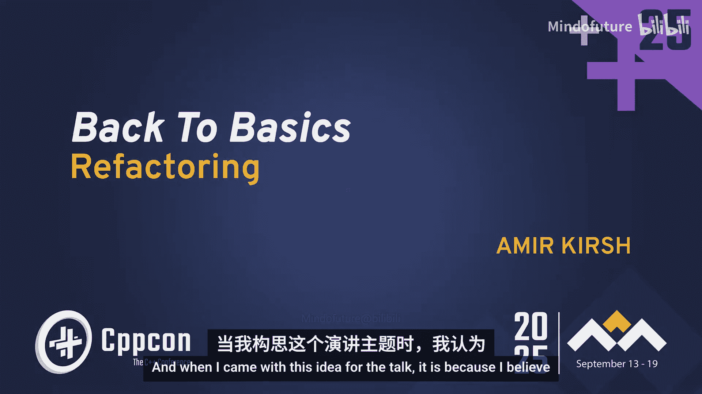
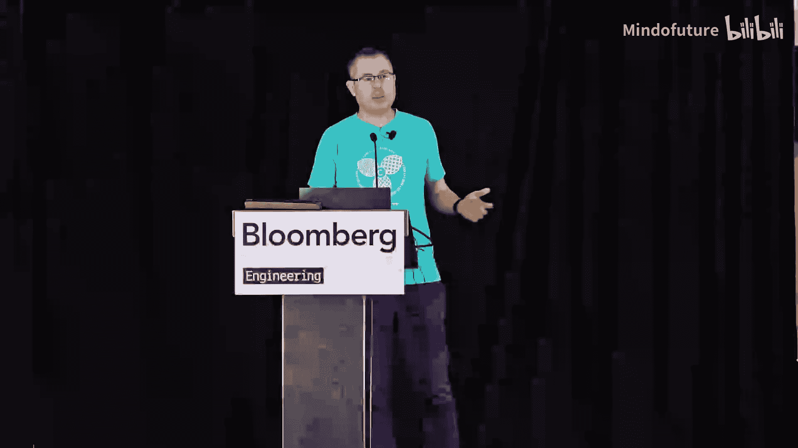
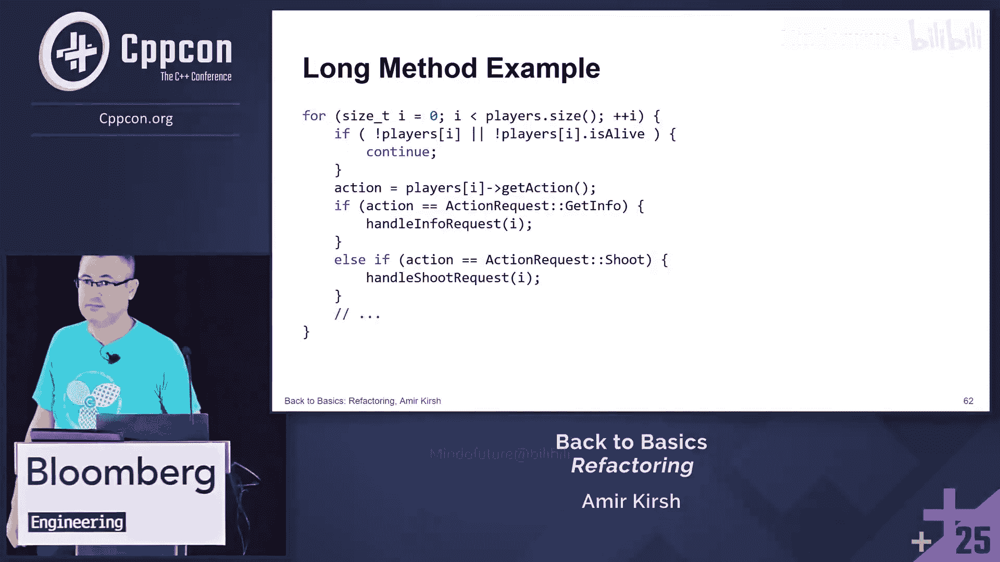
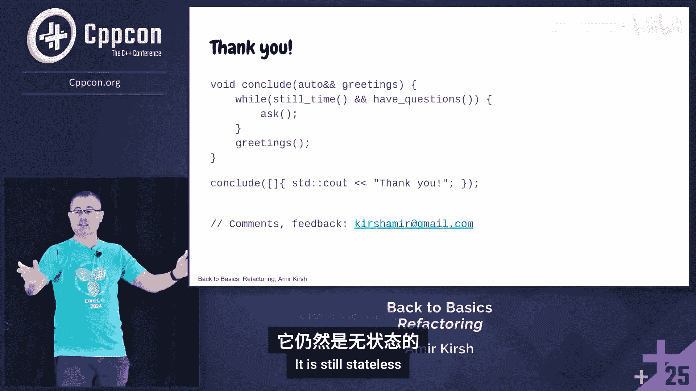

# 064：如何重构C++代码







在本教程中，我们将学习重构C++代码的基础知识。重构是在不改变代码外部行为的前提下，改善其内部结构的过程。这对于提高代码的可维护性、可读性和可扩展性至关重要。我们将通过具体的代码示例，探讨常见的代码“坏味道”以及相应的重构技巧。

## 为什么重构在今天尤为重要

过去，重构通常由资深开发者主导，他们在代码审查中发现并改进问题。然而，如今大部分代码并非完全由开发者手动编写，而是借助AI工具生成。因此，初级开发者更需要掌握重构技能，以便阅读、理解和维护这些并非由他们亲手编写的代码，从而提升代码库的整体健康度。

重构的核心目标是减少技术债务，使未来的代码变更成本更低。

## 重构的定义与前提

重构是一种有纪律的技术，用于重组现有代码体，改变其内部结构而不改变其外部行为。

如何确保我们没有改变外部行为？答案是**测试**。没有测试的重构就像鱼没有自行车——两者本不相关，且无法有效进行。充分的测试是进行稳定重构的基石。

## 何时以及为何进行重构

重构不应仅仅是为了“清理”代码。其主要目的是改善代码库的健康状况，以支持新功能和未来的代码变更。

*   **在实现新功能前**：如果现有代码结构不适合新功能，先进行重构适配，确保所有测试通过，然后再添加新功能。将重构和新功能开发混在一起会难以测试并引入新错误。
*   **提高可读性和可维护性**：面对难以理解的代码库时，如果能在保持行为不变的前提下将其改写得更清晰，就应大胆去做。测试会给你信心。
*   **性能改进**：虽然性能改进可能改变外部行为（如执行时间），但功能测试通常仍然适用。
*   **预防未来错误**：修改那些容易误用、可能导致错误的代码结构。

**总结**：重构通常是为了减少技术债务。技术债务是指那些在当前代码库演进背景下，我们不会那样写，但又没有时间修改的代码。它会增加未来任何变更的成本。因此，我们需要定期重构以降低未来变更的代价。

**重要原则**：
*   **在变更时重构**：不要重构那些稳定且你不需要触碰的代码。
*   **基于实际收益重构**：不要基于主观偏好（例如代码风格）进行重构，除非是为了统一项目规范。

## 代码审查与初步重构

让我们从一个简单的代码片段开始，这是一位学生提交的练习：

```cpp
for (int i = 0; i < players.size(); ++i) {
    if (!players[i] || !players[i].isAlive) {
        continue;
    }
    // ... 处理存活玩家
}
```

这段代码检查玩家是否“非活跃”或“已死亡”，如果是则跳过。

**存在的问题（代码坏味道）**：
1.  **重复**：`players[i]` 被多次访问。
2.  **可读性差**：条件中的否定逻辑 `!players[i]` 令人困惑。
3.  **数据成员暴露**：直接访问 `isAlive` 数据成员，破坏了封装性。最好通过函数（如 `isAlive()`）来访问，以便未来可以添加验证或日志记录。
4.  **意图不清晰**：`!players[i]` 的含义不明，可能表示玩家对象“无效”或“非活跃”。

**重构步骤**：
1.  引入临时变量或使用基于范围的 for 循环来消除重复。
2.  将否定逻辑和成员访问封装到具有清晰命名的函数中。
3.  合并常见的条件检查。

**重构后代码**：
```cpp
for (const auto& player : players) {
    if (player.isNotActiveOrDead()) {
        continue;
    }
    // ... 处理存活玩家
}
```
通过引入 `isNotActiveOrDead()` 成员函数，代码意图变得清晰，也封装了内部细节。这是一个“提取方法”重构的简单例子。

## 处理更复杂的循环

现在看一个更复杂的循环，它使用了索引，并且包含我们刚才重构过的逻辑：

```cpp
for (size_t i = 0; i < players.size(); ++i) {
    auto& player = players[i];
    if (player.isNotActiveOrDead()) {
        continue;
    }
    auto action = player.getAction();
    // 根据 action 执行不同操作...
}
```

**进一步重构**：
*   **避免裸循环**：可以改用基于范围的 for 循环，并结合 `std::views::enumerate`（C++23）或手动管理索引来消除越界错误风险。
*   **提取循环逻辑**：如果“遍历所有存活玩家”这个模式在代码库中多次出现，就应该将其提取成一个独立的函数。

**使用现代C++重构**：
```cpp
// C++20 风格：在循环内初始化索引
for (size_t i = 0; const auto& player : players) {
    if (!player.isNotActiveOrDead()) {
        auto action = player.getAction();
        // 使用 i 和 player...
    }
    ++i;
}

// 或者，使用函数封装
forEachLivePlayer([](size_t index, Player& player) {
    auto action = player.getAction();
    // 处理 action...
});
```
`forEachLivePlayer` 函数隐藏了遍历和过滤的复杂性，使主逻辑更清晰。这是“以函数对象取代函数”或“提取方法”的另一种形式。

## 消除条件判断

在循环内部，我们根据 `action` 这个枚举值执行不同操作，通常这会引出一个 `switch` 语句：

```cpp
// 在循环内部
switch (action) {
    case Action::Attack: // ... break;
    case Action::Defend: // ... break;
    // ... 更多 case
}
```

**问题**：每当新增一个动作类型，都需要修改这个 `switch` 语句，违反了开放-封闭原则。

**重构（以多态取代条件表达式）**：
1.  为“动作”定义一个抽象基类（或接口）。
2.  为每种具体的动作（如攻击、防御）创建派生类。
3.  让 `player.getAction()` 返回一个指向基类对象的智能指针（或利用工厂模式根据枚举创建对象）。
4.  直接调用动作对象的 `execute()` 方法，利用多态分发行为。

**重构后**：
```cpp
// 在循环内部
auto command = player.getActionCommand(); // 返回 unique_ptr<ActionCommand>
command->execute(player, gameState);
```
这样，新增动作类型只需添加新的派生类并在工厂中注册，无需修改现有的分发逻辑。

## 重构模式与代码坏味道

Martin Fowler 的《重构》一书提供了系统的重构方法。它包含一个“代码坏味道”目录和对应的“重构方法”目录。

**为什么需要目录？**
*   **提供共享语言**：像设计模式一样，便于团队沟通。
*   **系统化问题检测**：使发现问题的方法可重复。
*   **提供可操作的解决方案**：针对特定坏味道，有已知的解决模式。
*   **辅助教育和代码审查**：使用共同语言进行指点和讨论。

这是一个活的目录，随着编程实践的发展，会出现新的坏味道和缓解方法。

以下是部分常见的代码坏味道及其重构方法：

### 1. 过长函数
**问题**：函数包含太多逻辑，难以维护和测试。
**重构方法**：
*   **提取函数**：将一部分代码提取成新函数。
*   **以查询取代临时变量**：如果临时变量妨碍了提取函数，考虑直接调用查询函数。
*   **以函数对象取代函数**：如果函数非常复杂，将其变成一个类，将局部变量变为类的字段，然后将函数体分解为这个类的多个小方法。

### 2. 过长参数列
**问题**：参数过多难以理解和使用，容易出错。
**重构方法**：
*   **引入参数对象**：将相关参数封装成一个对象。
*   **保持完整对象**：如果调用者已有一个对象，其中包含函数所需的所有数据，则直接传递该对象。**但需谨慎**，这可能破坏封装，让函数知道过多调用者细节（参见“得墨忒耳定律”）。
*   **依赖注入**：传递一个接口对象，让函数通过它获取所需数据，而非传递数据本身。

### 3. 过大的类
**问题**：类承担了太多职责。
**重构方法**：
*   **提炼类**：将部分职责分离到新类中。
*   **提炼子类/超类**：如果职责可以划分，使用继承来分离。

### 4. 注释
**问题**：注释本身可能是坏味道，因为更好的代码本身应该能够表达意图。
**重构方法**：
*   **提取函数**：用函数名来解释一段代码块的行为。
*   **引入断言**：用代码来验证假设，而非用注释说明。

### 5. Switch语句/复杂条件表达式
**问题**：难以维护和扩展。
**重构方法**：
*   **以多态取代条件表达式**：如前所述，使用继承和多态。
*   **以状态/策略取代类型码**：将表示类型的代码（枚举/整数）替换为状态对象或策略对象。
*   **引入Null对象**：用代表“空”行为的对象来消除对 `nullptr` 的检查。

## 特定于C++的重构技巧

这些是《重构》书中未强调，但对C++开发者特别有用的技巧：

*   **将弱类型转换为强类型**：不要仅用 `int`、`double` 表示有单位的值（如米、秒）。定义具有语义的类型，防止误用。
*   **从手动内存管理转向库管理**：使用智能指针和容器，避免裸 `new`/`delete`。
*   **从指针/引用转向值语义**：在可能的情况下，直接使用对象值而非指针，可以简化所有权并减少空悬引用的风险。
*   **优先使用标准算法而非裸循环**：使用 `<algorithm>` 中的函数（如 `std::for_each`, `std::transform`）能使意图更声明式、更清晰。
*   **使用RAII管理资源**：利用构造函数获取资源，析构函数释放资源（如锁、文件句柄、内存），避免手动配对调用（如 `lock`/`unlock`）。

## 总结与最佳实践




在本教程中，我们一起学习了重构C++代码的核心概念和实用技巧。

**关键要点**：
1.  **重构是必要的技能**：尤其在AI辅助编程时代，开发者必须负责理解和提升代码质量。
2.  **安全重构靠测试**：没有充分的测试覆盖，重构就像在黑暗中摸索。
3.  **有明确目的才重构**：重构是为了提高可维护性、可读性、可扩展性或预防错误，而不是随意更改。
4.  **小步前进，持续验证**：进行小的、可测试的增量更改，并频繁运行测试以确保没有破坏任何功能。
5.  **善用工具和模式**：了解常见的代码坏味道和重构模式，可以系统化地改进代码。可以将AI作为辅助工具来识别坏味道，但最终的重构决策和执行应由开发者负责。
6.  **沟通与协作**：对于影响范围广的重构，需要与团队成员沟通，并考虑兼容性（例如，暂时保留旧接口并标记为废弃）。




记住，程序员的责任是“拥有”代码，理解其运作，并维护其质量。通过持续重构，我们可以防止代码库演变成一个难以维护的“大泥球”。