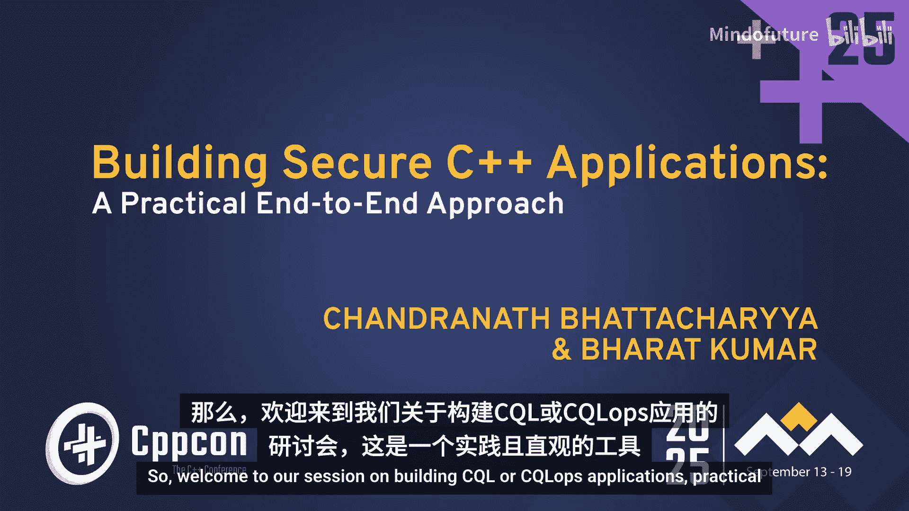
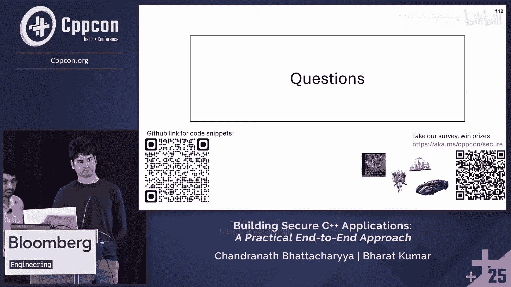

# 065：实用的端到端方法





在本教程中，我们将学习如何采用一种实用的端到端方法来构建安全的C++应用程序。我们将探讨如何在整个开发生命周期（设计、实现、代码审查、CI流水线和发布后）中，针对核心安全类别（边界、生命周期、初始化和类型安全）实施安全实践，并提升代码的整体正确性。

## 设计阶段

上一节我们介绍了本教程的概述，本节中我们来看看安全实践的第一个环节：设计阶段。安全始于设计阶段。为了理解我们的流程，让我们先看看架构。

我们采用了与Chromium相同的架构，即多进程模型。浏览器进程拥有最高权限，在Windows上以中等完整性级别运行。渲染进程则是不受信任的，因为它们权限最低，在Windows上以不受信任的完整性级别运行。我们使用Mojo进行进程间通信。默认情况下，我们假设渲染进程总是可能被攻破。如果渲染进程需要执行任何特权操作，我们会使用Mojo消息将其代理给浏览器进程。

我们还遵循Chromium的“二要素规则”。该规则指出，如果你的代码需要处理不可信的输入，并且代码是用不安全的语言（如C/C++）编写的，同时你的代码需要运行在无沙盒或高权限进程（如浏览器进程）中，那么这三个条件不应同时成立。这意味着，如果你想在浏览器进程中使用C++解析JSON，这是绝对不允许的。你可以在沙盒化的工具进程中做同样的事情，或者使用Rust等安全语言。

我们的安全审查流程如下：我们与安全团队一起，由安全负责人审查每个新功能的设计。

以下是我们在审查时关注的事项：
*   我们是否引入了任何新的不可信输入入口点？
*   如果是，我们是否需要新的进程来处理这些数据？
*   此功能是否需要任何新的进程间通信或Mojo通信？
*   此特定功能是否需要任何新的模糊测试覆盖？

## 边界安全

上一节我们探讨了设计阶段的安全考量，本节中我们来看看边界安全。本节将涵盖空间内存安全类别。

我们将重点关注两个方面：一是启用加固的Libc++，二是不安全缓冲区使用。

首先看看启用加固的Libc++。Libc++提供了四种加固模式：
*   **unchecked**：无加固。
*   **fast**：启用基本且低开销的安全检查，建议用于大多数生产构建。
*   **extensive**：在fast模式基础上，增加一些中等开销的额外检查。
*   **debug**：包含大量检查，但由于开销显著，不应在发布生产版本中使用。

那么，使用的编译器选项是什么？只需一个标志 `-D_LIBCPP_HARDENING_MODE`，它有四个值，分别对应一种模式。

有多种检查类别。fast模式技术上只覆盖其中两个类别：有效元素访问和有效输入范围。extensive模式覆盖更多，debug模式则覆盖所有类别。

在我们的项目中，我们使用extensive模式。

需要快速说明的是，Libc++加固处理的范围远不止边界安全，我们这里只讨论边界安全部分。

关于C++标准库加固的说明：C++26支持标准库加固。Herb Sutter在今年的CppCon上强调了这一点。目前，Libc++提供的加固比C++26提案中的更全面。

现在，当我们启用Libc++加固后，如果加固失败会发生什么？这是可以配置的。我们可以通过一个特定的宏来配置加固失败的行为。对于我们的代码，我们将其配置为内置陷阱。

什么是内置陷阱？它会导致程序异常停止执行。它会触发一个立即的CPU陷阱，在大多数平台上导致立即且无条件的崩溃，通常通过`UD2`（未定义指令）实现。这确保了程序立即停止，不给攻击者操纵程序状态的机会。在后面的幻灯片中，当我提到“陷阱”时，指的就是这种由内置陷阱引起的不可利用的崩溃。

接下来，让我们看看第一个类别“有效元素访问”的一些例子。标准规定：检查任何通过容器对象或迭代器访问容器元素的尝试是否有效，且未尝试越界或访问不存在的元素。

让我们看一些代码。`vector`是一个类，其下标运算符`operator[]`在无边界检查时被调用，或者`front`、`back`、`pop_back`在空向量上被调用，或者`erase`被`end`迭代器调用时，所有这些都会触发陷阱。

以下是一些代码示例：
```cpp
std::vector<int> v; // 空向量
v.front(); // 陷阱
v.back();  // 陷阱
v.pop_back(); // 陷阱
v[5]; // 越界访问，陷阱
v.erase(v.end()); // 陷阱
```
如果没有启用加固，这些调用可能稍后才会崩溃。

与`vector`类似，`string`也加固了这些函数。在空字符串上调用`front`、`back`、`pop_back`会触发陷阱。越界调用`operator[]`会触发陷阱。使用`end`迭代器调用`erase`也会触发陷阱。

有趣的是，如果这段代码在没有加固的情况下构建和运行，它实际上不会崩溃，并产生特定的输出，从而导致未定义行为，因此我们需要加固。

再考虑一个类型：`optional`。如果在`optional`为空时调用其箭头运算符`operator->`或解引用运算符`operator*`，则会触发陷阱。注意，`optional`不是容器，但它仍属于此类别。同样，如果没有加固，此代码不会崩溃并打印输出。

与`optional`类似，`expected`类型也涵盖在此范围内。类似地，当`expected`没有存储值时调用箭头运算符或解引用运算符会触发陷阱。当`expected`没有错误对象时调用`.error()`也会触发陷阱。

其他涵盖的容器包括`string_view`、`span`、`array`、`list`和`deque`。显然，这不是一个详尽的列表。

有趣的是，它的作用不止于此，甚至超越了容器，例如算法。当在空范围上调用`std::ranges::min`、`max`、`minmax`时，所有这些调用都会触发陷阱。

我们结束对“有效元素访问”的探索，看看下一个类别“有效输入范围”。

文档说明：检查作为库函数输入给出的范围，其哨兵是否可以从起始迭代器到达。

以`vector`为例。如果你用`first`大于`last`调用`erase`（例如，用`end`和`begin`而不是`begin`和`end`调用`erase`），这将触发陷阱。如果没有加固，此代码不会崩溃。

`string`也是如此。如果用`first`大于`last`调用`erase`，也会触发陷阱。同样，如果没有加固，编译此代码不会崩溃。

在继续之前，我们覆盖Libc++加固的最后一个类别“非空指针”。这与边界安全无关。文档说明：检查被解引用的指针不是空指针。它提到，在大多数系统上，空指针解引用不会危及内存安全。然而，这是一种未定义行为，可能由于编译器优化导致奇怪的错误，我们稍后会在幻灯片中看到这样一个问题。

我快速提一下涵盖的一些内容。`string_view`有多个接受`const char*`的函数，所有这些都涵盖在内。如果在运行时用空指针调用它们，都会触发陷阱。与`string_view`类似，`string`也有两个函数（还有其他函数），如果在运行时用空指针调用，也会触发陷阱。

这引出了Libc++加固部分的结尾，并带来一个问题：是否需要更多的边界安全，或者这已经提供了我们所需的一切？

让我们看一个例子。这是一个打印函数，它接受一个`int`数组和长度，并尝试打印一些内容。代码编译并运行。但你可以立即注意到编程错误：使用了`i <= length`而不是`i < length`，这是越界访问和未定义行为。这段代码在运行时可能因地址清理器而崩溃。然而，大多数生产构建并未进行清理，这可能导致漏洞利用。

这就是不安全缓冲区使用发挥作用的地方。它试图将此类代码构造转换为编译时错误。它实际上只是一个编译时标志。

让我们看看。这是我们之前有的代码，它编译正常，但在运行时出错。当我们用不安全缓冲区使用标志编译它时，编译失败，并打印出错误信息。需要注意的一点是，实际失败的条件是`i <= length`，但该确切位置并未被指出。它只是指出可能在运行时导致问题的编码模式。

让我们尝试更好地理解这一点。这里有一些代码，它实际上做了正确的事情，但也给出了相同的错误。正如所说，这段代码没问题，但被指出的模式是相同的。

不安全缓冲区文档包含更多信息。它指出缓冲区操作永远不应使用原始指针执行，警告实际上是为使用下标运算符的错误索引、指针算术或调用边界不安全的C标准函数（如`memcpy`、`memset`等）而发出的。

它还给出了合理的建议：所有缓冲区都应封装在安全的容器和视图类型中。安全容器包括`array`、`vector`、`string`，视图包括`span`和`string_view`。

让我们以第一个为例，看看使用下标运算符错误索引的例子。这是我们之前看到的代码。如何修复它？这很简单，我们可以将其改为使用范围`for`循环。这完全解决了问题。但我们的建议是尝试将其改为使用`std::array`。这也解决了问题，但`array`更好，因为它是加固的。`array`中的许多函数也是加固的，所以在这种情况下最好使用`array`。

这是错误索引的例子。让我们看一个指针算术的例子，可能有很多这样的例子，这里只展示一个。这段代码将无法编译，并给出错误，指出此处进行了不安全的指针算术。同样，修复方法因错误类型而异，形式多样。这里的修复非常简单，只需转换为`string_view`即可。

继续，假设我们有一段代码，尝试打印一个`int`数组和长度，如何修复？正如提到的，这段代码无法编译。我们可以通过转换为`span`来修复。每当我们有指针和大小时，尝试看看是否能将其转换为`std::span`。这样做的原因是，对`span`的越界索引尝试在加固模式下将导致不可利用的崩溃。

接下来，看看“缓冲区需要封装到安全容器和视图类型中”这一指导原则。如果你有这样的代码：第一个属性是`int`数组，第二个是`const char`数组。你应该怎么做？第一个应尝试转换为`std::array`。第二个，如果可能，尝试转换为`string_view`，因为`string_view`实际上不分配任何内存。

如果你的代码像这样：一个接受数组和长度的函数，尝试转换为`std::span`。如果你的代码像这样：接受`const char*`和长度，则尝试转换为`string_view`。同样，这样能与不安全缓冲区使用正常工作的原因是，容器的越界索引尝试将导致不可利用的崩溃。

这引出了一个问题：如果我们无法修复不安全缓冲区问题怎么办？怎么可能无法修复呢？

这里有一些代码。这是一个来自C库的回调。显然，我们无法控制C库。我们必须处理这个回调。如果你看这里，这肯定会导致问题。如何修复？我们之前见过吗？不，我们之前没见过。那么如何修复？基本上，在这种情况下，我们可以将调用不安全代码的部分包装在`#pragma clang unsafe_buffer_usage`块中。一旦这样做，代码编译正常。

这也可以用于`span`构造函数。让我们看看如何操作。这里有一段代码，你可以看到那里有一个`std::span`，这正是我们应该做的。但问题是什么？我们从不安全的回调中获取数据，然后尝试将其转换为`span`，这立即导致编译失败，因为它指出`span`构造的两个参数是不安全的，因为它可能引入缓冲区大小和边界信息之间的不匹配。这是一个完全适用于将其包装在`pragma`块中的情况。一旦我们这样做，代码就编译了。

然而，这也引入了一个新问题。让我们看看这个。这段代码编译并正常工作，因为我们更新了`my_span`使其工作。然后我可以写这段代码，这显然是不安全的，因为我正在访问越界（`arr+2`）。这段代码也能编译，并给出垃圾输出。因此，最好标记所有对不安全回调的调用，以确保在调用它们时采取额外的安全措施。我们可以使用特定的标签来实现。如果你在函数上使用此标签，它将被标记为不安全。一旦你将函数标记为不安全，尝试调用它将会失败。

现在有两个选项：要么以其他方式修复它，要么如果你认为你的代码是正确的，那么可以将其放在`pragma`块中。这个额外的警告增加了在编码和代码审查阶段发现问题的机会。

接下来，让我们看看下一个类别：C风格函数。不安全缓冲区使用也会标记以下C风格函数（非详尽列表）：`memcpy`、`memset`、`strcpy`等。检查器也很智能，它并不总是标记。如果它在编译时知道没有问题，比如这段代码，它就不会标记。这工作正常。在Chromium代码库中有更多示例。

现在，让我们看一个`memcpy`的例子以及如何修复它。这里我们尝试使用`memcpy`将一个字符串缓冲区复制到另一个。由于我们使用了不安全缓冲区使用，它立即给出错误，指出`memcpy`不安全。如何修复？你可以完全使用`span`和`ranges::copy`来修复。一旦你使用`span`和`ranges::copy`，问题就完全解决了。让我们看看代码输出。`memcpy`版本和`ranges::copy`版本的代码输出完全相同。

现在，我们稍微离题一下。因为每次我都想看看编译器能做什么，它能如何优化。我在说什么呢？看这个字符串“hello”。每当你看到“hello”这样的字符串，你通常会在代码中看到类似这样的内容，在`.ascii`部分。但在这里，没有那样的东西。相反，我们有一个看起来像长整数的神秘东西。那里到底发生了什么？如果你将十进制转换为十六进制，然后将输出转换为ASCII，你可以看到“hello”字符串实际上隐藏在那里。是的，这就是我们神奇的编译器为我们做的事情。

继续。让我们以`memcpy`为例。这是我们之前有的代码，它通过了检查。它正确吗？当然不正确，原因是没有检查`span`的大小。我们该怎么做？我们添加检查。我们将其移到一个新函数`memcpy_span`中，我们做的第一件事是添加一个断言，检查目标大小是否大于源大小。然后我们调用`ranges::copy`。然后主函数中的代码改为调用那个特定的`memcpy_span`函数。

断言可以是任何你想要的，但例如，它可以是为Clang和x86-64实现的，它会放置一个`ud2`指令。同样，编译器在这种情况下非常智能，你可以看到它静态地知道一切正常，所以它完全移除了`ud2`语句，两者输出完全相同。显然，在它无法看到的情况下，例如我们实际上使用这种方法复制一个`vector`，在这种情况下，这是产生的输出。别太担心代码，只需看到`UD2`实际上不太可能被执行，所以它被移到了函数的末尾，然后通常的代码实际上有一个主移动。

让我们再次看看这段错误的代码，看看我们在Edge和Chromium代码库中做了什么。在Edge和Chromium代码库中，我们有`base::span`，它是`std::span`的替代品，并且实际上是加固的。它有很多额外的函数，其中一些可以处理这个`memcpy`。我们做的是使用其中一个函数，我们创建一个`base::span`，执行`first_span`，然后执行`copy_from`。这就是我们实际上可以处理`memcpy`的函数。

现在，如果你想考虑`memcpy_span`。你在这里做的是我们只是在那里使用`copy_from`。注意，我移除了断言。没有第一个语句的断言，原因是`base::span::copy_from`将在运行时如果源和目标大小不匹配时触发陷阱。然后主代码变成这样，只需将`std::span`改为`base::span`，一切正常。

关于`memcpy`说得够多了，转到`memset`。这是我尝试使用`memset`试图将此数组的所有元素设置为1。让我们看看我是否成功了。我尝试打印一些东西，调用`print_array`，当然我没有成功。所以`memset`很难正确使用。有了不安全缓冲区使用，它实际上不担心你是否正确使用`memset`，它总是标记它是不安全的函数。你该怎么做？转换这个非常容易。基本上，我们可以只使用`ranges::fill`，一旦我们这样做，我们就得到了正确的输出，错误也消失了。

继续看一些统计数据。来自我们的代码库，Chromium是我们的上游代码库，他们在其代码库中将不安全缓冲区使用减少了90%以上。对于我们的代码，我们有更准确的数字。对于我们来说，实际上，对于非C库函数的不安全缓冲区使用，我们在三个月内将其降到了0。然后对于C库函数的使用，我们在两个月内修复了超过75%。

让我们总结一下本节，看看我们代码库的现状以及我们正在做什么。通过Libc++加固和不安全缓冲区实现，我们相信我们处于良好状态。它也是工具链的一部分，因此很难错过这类问题。此外，我们还有ASAN CI流水线来从测试中捕获更多问题。

关于ASAN的快速说明：ASAN是地址清理器，它是第一个可以检测越界访问、释放后使用、双重释放和无效释放的内存分配器。

这结束了我们关于边界安全的部分。让我们继续讨论生命周期安全。

## 生命周期安全

上一节我们探讨了边界安全，本节中我们来看看生命周期安全。这将涵盖许多指导原则和编码指南。

第一件事是，我想我们都知道这一点：谨慎使用原始指针。

让我们举个例子。假设有另一个类`AnotherClass`，然后我们有一个`SomeClass`，它持有该`AnotherClass`对象的原始指针。然后当你尝试这样做，调用该指针上的`do_something`时，如果没有仔细的生命周期管理，此调用可能会遇到释放后使用。你该怎么做？是的，如果你能转换为`unique_ptr`，所有权模型变得更加清晰，这可以完全修复。这里我们做的是，在构造函数中，我们将`unique_ptr`作为参数，并用类中的`unique_ptr`替换原始指针。这完全解决了问题。

然而，在某些情况下，由于各种原因可能无法做到这一点。因此，我们引入了Chromium的`raw_ptr`，也称为 MiraclePtr。它可以用来显著减少漏洞利用的机会。转换非常简单。无论你在哪里尝试使用`T*`，只需使用`raw_ptr<T>`，就是这样，调用代码不需要更改。这样做的效果是，现在释放后使用的漏洞利用机会在某些条件下显著降低。

那么，这些“某些条件”是什么？`raw_ptr`依赖于某些条件。首先，它依赖于Chromium中的分区分配。任何通过分区分配和释放的内存都会用特定模式进行毒化。因此，请注意，仅仅解引用悬垂指针的行为不会崩溃，但会增加后续使用可读内存时崩溃的机会，从而给我们调查和修复的机会。这也意味着，因为我们依赖于分区分配，它无法帮助处理栈或全局变量等。

我们在Chromium中的编码指南是：尽可能在类和字段中使用`raw_ptr`代替原始C++指针。

那么引用呢？类似地，有一个`raw_ref`可以用来处理引用。它也在分区中。看，非常简单，用`raw_ref<AnotherClass>`代替`AnotherClass&`。这样做的效果是，它使代码更不易被利用，但安全不等于正确。这并不能使其正确。在我们的代码库中，始终优先考虑明确的所有权模型和确定性方法。

话虽如此，让我们回到这段代码，假设你无法使用`unique_ptr`。我在说更一般的情况。考虑使用`weak_ptr`。我们只需更改我们的类，然后在构造函数中不采用原始指针，而是采用`shared_ptr`，并在那里存储一个`weak_ptr`。然后当我们想调用时，我们只需调用`lock`，每当该指针有效时我们就调用。这解决了问题。

现在，假设有一种情况，我们甚至无法使用`shared_ptr`，我们能做什么？一个选择是存储一个ID，稍后从另一个保证更长生命周期的对象中查询它。大多数程序都有这样的对象。让我们看一个例子。我创建一个类`AnotherClassManager`，它有一个函数`create`，将返回`AnotherClass`对象的指针，然后有另一个函数`get_with_id`，如果你传递一个ID给该函数，如果存在则返回该对象，否则返回空指针。有了这个，我们只需修改`AnotherClass`，它只接受一个ID并存储该ID。最后，主要的修改在`SomeClass`中，它存储一个ID而不是原始指针。那么它如何获取实际值呢？当它想要获取那个`AnotherClass`时，它从`AnotherClassManager`调用`get_with_id`，如果有一个非空指针，则通过它调用。是的，这种方法可能看起来有点做作，但它确实有效。我们实际上已经在代码库中使用了它。

现在，我们讨论了`shared_ptr`，我们也需要谨慎使用`shared_ptr`。例如，假设这段代码在这里，假设它被用作`shared_ptr`。在这段代码中，函数`fn`正在调用作为参数传递给它的`fn2`。我们总是可以变成这个输出。如你所见，`my_class`在`fn`函数体内被销毁。并且在那之后被调用，所以这是释放后使用。这类事情可以很容易地处理。我们可以通过使用`shared_ptr`来处理，如你所见，我们只是在那里增加强引用计数，一旦你这样做，这就变成了输出。因此，这是一个指导原则，我们可能需要在调用可能从被调用处删除该对象的函数之前，增加类的引用计数。

让我们看另一个非常常见的场景：成员函数的回调。让我们看一个例子。你有一个函数`read_file`，它接受一个名称作为第一个参数。大概我们会查找名称，然后有一个回调函数，稍后应该用数据回调。这里又是`MyClass`，它有一个新函数`start_reading_file`，调用`read_file`，并在第二个参数中传递Lambda。它在Lambda中捕获`this`参数，当Lambda被调用时，它将使用该参数调用回调。在这种构造中，总是可能遇到这种情况。从输出中可以看出，回调可能在对象被销毁后被调用。附录中有示例展示了整个场景。

我们如何修复它？我们可以再次通过使用`shared_ptr`或`weak_ptr`轻松修复。我们只需要在Lambda捕获列表中捕获`weak_ptr`，然后就可以修复它。因此，对于稍后要调用的类成员函数的回调注册要小心，并考虑使用`weak_ptr`或取消注册方法来处理释放后使用场景。

这引出了Chromium代码库规则。这变得有点难以看清。第一件事是我在谈论`shared_ptr`函数的替代品。我们有替代品。对于`shared_ptr`，我们有`scoped_refptr`和`scoped_refptr`本身。对于`function`，我们有`OnceCallback`和`RepeatingCallback`，顾名思义，`OnceCallback`只能调用一次，`RepeatingCallback`可以调用多次。

现在，让我们以看到的相同示例为例，看看如何为Chromium转换它以遵循Chromium编码指南。我们只使用`OnceCallback`代替`function`。然后调用代码需要更改，因为我们必须创建它。`BindOnce`是一种创建`OnceCallback`的方式。由于这实际上是绑定一个成员函数指针，我们需要在调用时也绑定一个对象，这就是第二个参数的原因。好处是这段代码无法编译。所以，我们默认就摆脱了那个问题。我们必须编译它，我们必须做额外的事情。如你所见，我们必须用`base::Unretained`标记它。开发人员需要显式使用`base::Unretained`才能编译。

现在，这个更改给我们带来了一些东西，它实际上带来了安全性。原因是`base::Unretained`导致`BindOnce`在内部将指针存储为原始指针。所以代码从释放后利用中变得更安全。但同样，安全不等于正确。在代码审查中，完全反对使用`base::Unretained`。所以我们应该做的是，我们不能实际获取`ptr`和`weak_ptr`，所以我们在Chromium中有替代方案。我们实际上有一个不同的`weak_ptr`基础设施来处理这种情况。

本质上，我们做的是引入一个新的成员变量，称为`WeakPtrFactory`。然后使用它来获取一个`weak_ptr`，该指针传递给第二个参数。现在，这个`weak_ptr`基础设施确保如果你的原始对象被销毁（在这种情况下是`MyClass`），该回调将永远不会被调用。这就是我们处理场景的方式。

还有另一种方法，也可以用`base::ScopedClosureRunner`解决。我不打算涵盖那个。但让我们看看另一个场景。让我尝试击败所有这些系统。`BindOnce`可以接受一个Lambda，然后我做的正是同样的事情，我将`this`作为Lambda的捕获变量捕获，然后调用`callback`，这可以击败所有这些。幸运的是，这段代码无法编译。

继续到我们可以使用的下一个策略，即使用像Clang的`lifetimebound`这样的属性。这是一个场景的例子。我们有一个`get_or_default`函数，它以字符串作为第一个参数，键作为第二个参数，如果字符串以键开头，则返回该子字符串。这里有一些调用它的代码，编译并运行正常。然后我创建一个新函数`get_test_string`并返回一个字符串，在这种情况下，它试图击败小字符串优化。可能无关紧要，但这就是你正在做的。然后我们调用这段代码。这是输出。显然，有些地方错了。哪里错了？`get_test_string`返回的字符串在第一个语句结束时就被销毁了，所以当我们在第二个语句中尝试访问它时，它引用了已销毁的内存。现在，如果你只是用`clang::lifetimebound`注解标记第一个参数类型，一旦你这样做，如果你尝试调用这段代码，它将得到这个错误。

让我们考虑另一个`clang::lifetimebound`派上用场的场景。这是一个非常常见的场景。我们有一个`MyClass`，它有一个字符串作为成员变量。现在，字符串是一个复制开销大的类型，所以我有这个`str`函数，它返回一个`const string&`。通常这工作正常，但这段代码呢？它似乎编译并运行正常。然而，GCC会抱怨。它编译正确，因为这段代码不正确。为什么不正确？`str`返回的字符串在这里被销毁了。所以如果我尝试在下一行访问它，它引用的是已销毁的内存，所以不正确。这里我们也可以使用那个`clang::lifetimebound`属性，一旦你这样做，这段代码将无法编译。

显然，也可以用其他方式解决，比如使用重载。例如，我们在这里做的是，我们实际上引入了一个重载。之前返回`const string&`的版本只对常量左值进行重载，另一个我们可以创建一个新函数，只对右值有效，这也有效。

另一个对我们有效的技巧是`-Wdangling`，它默认启用。这里有一段代码，显然是错误的。这无法编译。幸运的是，我们启用了`-Wdangling`。目前这只适用于某些风险类型，我们可以通过其他属性使其适用于其他类型，我们没有时间涵盖那些，它们是附录的一部分。

这结束了关于生命周期安全的特定部分，所以让我们看看现状，我们正在做什么。这是一个困难的话题，所以我们尝试做各种事情来处理它。首先，`raw_ptr`有助于安全。它实际上在代码审查阶段被强制执行。在CI流水线中也有检查，我们稍后会看到。然后我们有这个`OnceCallback`、`Unretained`和`WeakPtr`。它们在代码审查阶段被部分强制执行。`clang::lifetimebound`目前只在代码审查中标记。所以任何在代码审查中的东西都容易错过。编码策略，再次，代码和实现审查，`-Wdangling`默认启用。我们还有几个其他Clang检查被使用。然后ASAN、MSAN和流水线帮助我们通过测试找出更多此类问题。即使在发布后，我们稍后会讲到，我们实际上使用GWP-ASAN。

关于MSAN的快速说明：那是什么？那是内存清理器，它是一个未初始化内存检测器，可用于检测主要是未初始化内存的问题。我在这里涵盖它是因为它也涵盖释放后销毁。

## 初始化安全

上一节我们探讨了生命周期安全，本节中我们来看看初始化安全。本节主要考虑指导原则。

这也是我们使用的一个指导原则：在声明点初始化成员。我的意思是，成员变量在构造函数体中初始化，而不是在初始化列表中。相反，尝试这样做：每当你声明那个变量时，尝试看看是否可以在那里初始化它，一旦你这样做，就减少了在初始化时出错或遗漏的可能性。幸运的是，有一个Clang检查可以帮助我们发现这些问题。

我们使用的第二个正确初始化的指导原则是使用成员初始化列表。例如，这是一段代码。如你所见，这个尝试在构造函数体中从成员A获取成员B，然后在下一行初始化成员A。相反，如果你只是将代码转换为在初始化列表中初始化成员变量，那么这段代码立即会遇到编译错误。它说你重新排序了。所以开发人员查看并根据实际的初始化顺序正确重新排序，然后这段代码正常工作。

最后，我们还要求开发人员初始化变量。如果你有这样的东西，不要这样做，只需使用`int x = 0`。幸运的是，也有一个Clang检查可以帮助发现此类问题。使变量为`const`也可以帮助编译器检测此类问题。如果你有这样的东西，编译器会自动抱怨。Clang还有各种其他检查，用于检查各种场景下的未初始化变量，所以考虑使用那些，我们实际上在CI流水线中使用那些。

幸运的是，C++26带来了P2796，它移除了某些场景下未初始化变量的未定义行为。

这结束了我们这一部分，让我们看看我们在Edge中做什么。使用编码指南、代码审查、一些Clang检查，还有MSAN流水线通过测试找出更多问题。

## 类型安全

上一节我们探讨了初始化安全，本节中我们来看看如何减少类型混淆。我们的指导原则是避免类型双关。类型双关在C++中本质上是将一种类型对象的内存表示重新解释为另一种类型的做法。

这里有一个尝试将`int`类型双关为`float`的例子。这是一个联合，它有`int`和`float`成员。在这个函数中，我们尝试用一个整数初始化它，并尝试将其作为`float`返回，并将函数作为`const float`调用。这将因编译器错误而失败，说你不能这样做。这段代码在C中是正确的，但在C++中，它是未定义行为。

那么我们的建议是什么？指导原则是使用`std::bit_cast`，它在这种情况下工作正确。并且对于这类场景，使用`std::bit_cast`而不是联合技巧，也建议使用`std::bit_cast`而不是`reinterpret_cast`。

让我们看看`reinterpret_cast`。在这个特定例子中，在`get_float`中，我们有一个`const T*`，我们试图将其重新解释为`float*`。这在某些平台上可能失败并遇到段错误。为什么？因为像ARM这样的一些平台有非常严格的内存对齐要求。在Intel上，它可能遇到简单代码的问题。GCC有一个`-Wcast-align-strict`标志用于此类问题。

我们如何修复这个？一个选择是使用`memcpy`，问题就解决了，但使用`memcpy`我们可能会遇到不安全缓冲区问题，我们的指导原则是使用Chromium库中的某种包装器，我们有这些包装器可用。Clang也有这些检查，可以标记所有这些`reinterpret_cast`或`static_cast`问题。问题是，它会标记所有用户，包括有效的。我们还有用于此的清理器ASAN，它可能为此类未对齐访问问题创建运行时错误。

下一个指导原则是使用`variant`代替`union`。这是一段以不正确方式使用`union`的代码。我们有一个`Wrapper`类，它有一个联合，我们在这里创建一个`Wrapper`对象，它可能在运行时崩溃。为什么？这里的构造函数没有正确初始化任何成员变量。结果，析构函数也没有正确工作。如果你看`set`函数，它甚至根本不调用先前类型的析构函数。我们如何修复这个？我们使用带有`string`或`vector<int>`的`variant`。这段代码工作正确。

我们还有用于CI的控制流完整性，它可以帮助发现此类无效转换问题。这是一个例子。我们有一个基类`Base`，它有一个函数`foo`。然后我们有一个派生类`Derived`，它也重写了函数`foo`。在`main`中，我们尝试创建一个类型为`Base`的对象`b`。然后我们尝试将其转换为派生类`Derived` `d`。如果你启用了CFI，那么在运行时它会崩溃，说你试图从`Base`转换为`Derived`，并且这里的虚函数表是错误的。

我们这里的现状是什么？我们有编码指南来捕获此类问题。在代码审查期间，我们尝试捕获一些问题。此外，我们在CI流水线中启用了CFI。

## 线程安全

上一节我们探讨了类型安全，本节中我们来看看线程安全。那么我们如何避免死锁和竞争条件等线程安全问题呢？我们在代码库中使用序列。

序列本质上是Chromium在系统线程之上的抽象。我们有内部库来支持所有不同的序列。代码可以创建自己的序列并将任务发布到任何序列。你可以将任何任务发布到特定线程，如UI线程或IO线程。库负责所有序列的所有同步。

保证是发布到序列的任务将按照它们发布的相同顺序运行。即使同一序列上的每个任务可以在不同的物理线程上运行，库确保有同步，并且任务在同一序列中运行。

一个非常有用的工具是，你可以在一个序列上发布任务并获取结果，然后在另一个线程上使用该结果发布任务。

这是一个例子。我们有一个场景，我们想在后台序列上从磁盘读取一些项目。然后我们想在UI线程中执行一些任务，使用UI中的一些项目。用序列可以做到这一点。所以我们有这个`PostTaskAndReplyWithResult`。它要求在后台线程上发布此任务。并使用结果回调UI函数。它的工作方式是：我们有UI线程，它将在后台线程上发布任务。它执行任务。然后使用结果，它将在UI线程上回调UI中的`use_some_items`。这样，序列就得到了保证。

我们如何在Edge中确保这一点？我们有编码指南，并尝试在代码审查期间捕获其中一些问题。我们还在CI流水线中使用线程清理器，它本质上是一个数据竞争检测器。

## 定义安全

上一节我们探讨了线程安全，本节中我们来看看定义安全。这也将是一个小部分。

我们从ODR违规开始。ODR是单一定义规则，这出现在IFNDR（无需诊断的格式错误）中。

这里有一个简单的例子。在头文件中定义上下文变量可能导致ODR违规。有可能这样做。修复非常简单，只需使其内联。这确保不违反单一定义规则。

还要确保预处理器标志值一致，这是一个棘手的事情。让我们看一个例子。我们有这个`MyClass`，它有这个宏`SPECIAL_SOURCE`，当`SPECIAL_SOURCE`存在时，有一个`special_function`和一个作为成员变量的`special_number`。我们有这个`myclass.cc`，我在那里定义那个特定的宏。在实际情况下，它将来自某种构建定义文件，这里我只是将其展示为示例。在`main.cc`中，我没有那个宏。这是代码，我只是调用`MyClass`，创建`MyClass`对象，然后调用`str`。现在这段代码可能在运行时终止。这是基于我们在代码库中看到的真实示例，该示例被地址清理器捕获。

这里发生了什么，让我们看看。这是`MyClass`的代码。这是调用它的`main`。这是`MyClass`的构造函数。只有导致问题的部分。如你所知，`main.cc`只将`MyClass`视为一个字符串。`MyClass`也看到更多。但代码从`main`开始，然后考虑字符串是24字节。在`main.cc`中，`string_`变量放在那里，24字节在那里。然后`MyClass`，它在`MyClass`构造函数定义中。`str`实际上是这样放置的，如你所见，它已经尝试做一些越界的事情。现在这段代码运行，它调用`move`构造函数。这来自这里。所以这里发生了小字符串优化。所以你可以立即看到有一个越界写入。然后我们做这个哈希，它继续在那里。然后`main.cc`将此部分解释为字符串，因此崩溃。

一个更简单的ODR违规修复方法是，如果你有这样的东西，它是一个源或C文件，其中有一个类、一个全局变量和一个仅针对源的函数，在这种情况下，我们建议将其移动到未命名的命名空间中。因此，这成为指导原则：将仅源文件中的类、变量和函数添加到未命名的命名空间中以获得内部链接，从而移除ODR。

这结束了这一特定部分，让我们看看我们在Edge中做什么来提高定义安全。你使用编码指南、代码审查，当然还有ASAN和运行清理器流水线。



## 减少未定义行为

上一节我们探讨了定义安全，本节中我们来看看减少未定义行为。C++中有很多未定义行为。

让我们看看我们使用的一些策略。第一个指导原则是尝试对常量变量使用`constexpr`。这里有一些代码。这段代码遇到有符号整数溢出，因为我们试图将1加到`INT_MAX`，但这段代码编译并运行，并在运行时给出错误。值不正确。一旦我们将其移入`constexpr`，一旦我们这样做，编译器就会给出错误。即使是`const`，如果你只是使其为`const`，那也是一个错误。因此，这成为一个指导原则：考虑将可以在编译时计算的变量设为`constexpr`或`const`。这将有助于捕获未定义行为。

再举一个简单的例子：除以0、对0取模和移位操作（这是移位-1），所有这些都是未定义行为，这段代码编译正常。只需使它们为常量，一旦你这样做，没有编译，有一个编译错误。这些警告默认启用。


减少未定义行为的另一个策略是指导原则：考虑在适用时使用`constexpr`函数来检测未定义行为。我们之前看到类型双关被捕获时见过这个用法。有一篇由Shafik Yaghmour撰写的精彩文章，提到了许多这样的例子。

现在，未定义行为可能导致不需要的优化。比如这个非常有趣的场景，它来自20级博客。这是一些代码。我们有一个函数指针`fp`，它被设置为`nullptr`，然后有一个`imp`函数进行打印，有一个`set`函数将输入设置为`fp`，有一个`call`调用`fp`，`main`调用`call`。如果你看这段代码，`set`从未被调用，所以这段代码应该崩溃，对吗？但当用`-O2`构建时，它给出输出“hello”。这从未被调用，对吗？这是汇编代码。如你所见，`set`只是一个存根，主体被完全移除，`main`直接进行调用。它为什么这样做？因为它被允许这样做，因为调用空指针是未定义的，这允许它假设`set`必须在`call`之前被调用。你可以这样做。


当用这个特定检查`-fno-delete-null-pointer-checks`构建时，这会终止，因为代码是这样的