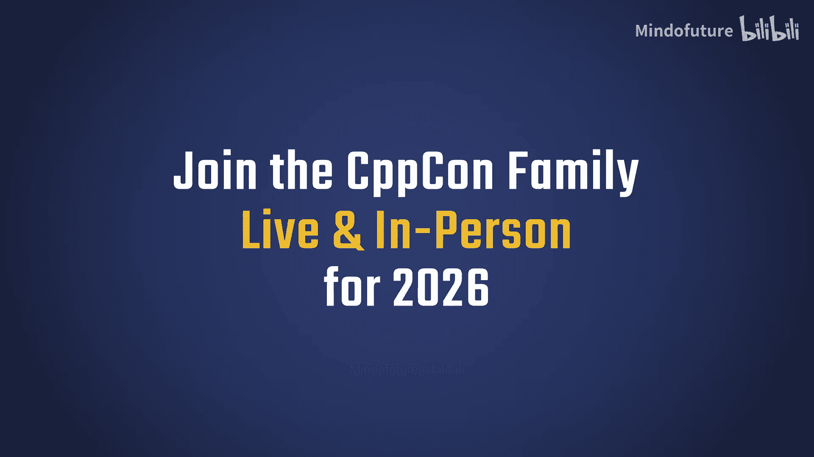
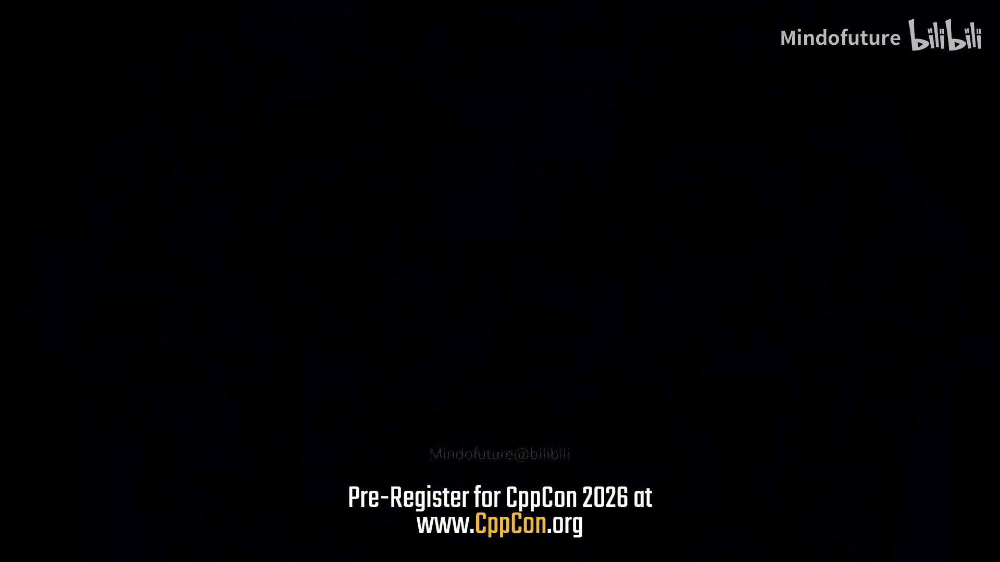
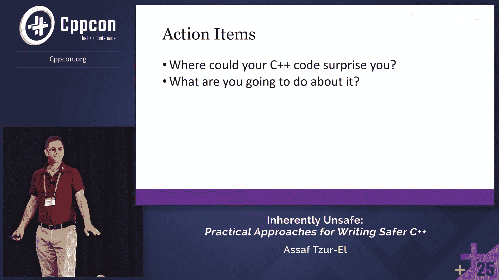

# 068：C++的危险与缓解之道






在本教程中，我们将探讨C++语言固有的安全风险，并学习如何通过采用编码规范和工具来编写更安全、更可靠的代码。我们将重点分析C++的不安全性和不可预测性，并介绍MISRA C++等核心指南如何帮助开发者规避常见陷阱。

## C++的不安全性

C++本质上是不安全的。C++之父Bjarne Stroustrup也承认这一点。C语言存在安全问题，例如可以给`const`变量赋值，这只会产生一个警告，而警告常常被开发者忽略。C++试图通过引入编译错误来改进，例如上述情况在C++中会产生编译错误。

然而，C++自身也引入了不安全机制，例如`const_cast`。以下代码不会产生编译错误，甚至没有警告：
```cpp
const_cast<int*>(some_const_pointer);
```
这似乎是为了绕过C++自身刚刚建立的安全机制。结论是，C++存在固有的安全问题。

## C++的危险类别

C++的危险主要分为两大类：安全性和不可预测性。

### 安全性问题

安全性问题包括多个方面，以下是主要类别：

*   **生命周期安全**：需要记住在构造函数中初始化对象，在析构函数中正确释放资源。需要确保析构函数是虚函数。悬空指针和访问已删除对象都属于此类问题。
*   **边界安全**：可以访问数组的索引`-1`，或者访问向量`size() + 2000`的位置。
*   **类型安全**：类型转换和类型检查相关问题。
*   **线程安全**：竞态条件、死锁等问题。
*   **运行时问题**：无论编写多少单元测试或进行多少代码审查，运行时环境总是充满意外。

这些问题可以混合出现，例如在一个线程中访问对象，同时在另一个线程中删除它。

### 不可预测性问题

不可预测性不仅限于未定义行为，它包含更广泛的概念：

*   **未定义行为**：标准规定“任何事情都可能发生”。经典例子是除以零，结果可以是零、无穷大，或者在星期五格式化你的硬盘。
*   **未指定行为**：标准规定了必须发生的行为，但未规定顺序。例如，函数`f(a(), b(), c())`中`a()`, `b()`, `c()`的调用顺序是不确定的，六种排列都有可能，甚至两次调用顺序可能不同。
*   **实现定义行为**：行为由编译器等实现定义，而非标准。例如，`long`类型的大小可能是8字节、4字节或16字节，这取决于编译器、操作系统和CPU。
*   **条件支持行为**：行为是否支持取决于编译器。例如，`#pragma`指令可能被一个编译器支持，而被另一个忽略。
*   **区域特定行为**：与文本和语言相关的行为。
*   **错误行为**：在C++23中引入，与未定义行为相关联。
*   **无效化指针/迭代器**：查阅标准后发现，这实际上也属于未定义行为。

C++是复杂、不可预测且不安全的。

## 迁移是否是解决方案？

一些安全机构建议迁移到其他语言。然而，这通常不切实际：

1.  现有代码库庞大（如Linux、Windows），迁移需要数十年。
2.  生态系统（工具、库）需要重建。
3.  开发者技能转型需要巨大投资。
4.  没有其他语言能完全替代C++的所有能力（实时性能、高效率、底层支持），同时保证安全和可预测性。

唯一的“替代品”可能是C语言或汇编语言，但这显然不是更好的选择。因此，我们需要的是缓解方案，而非彻底替换。

## 缓解策略：规则与工具

既然没有神奇的解决方案，我们就需要通过努力来缓解问题。我们建议采用“双管齐下”的策略：一套严格的编码规则，以及强制遵守这些规则的工具。

### 编码规则与指南

许多组织已经制定了优秀的C++编码标准：

*   **JSF C++编码标准**：为F-35战斗机开发。
*   **C++核心指南**
*   **MISRA C++**：汽车行业标准，现已与其他行业标准（如AUTOSAR）合并。
*   **High Integrity C++** 等。

本教程将重点介绍**MISRA C++**，因为它面向高度规范的行业（如汽车、航空航天），非常严格，且广受欢迎。

### MISRA C++ 指南简介

MISRA C++ 2023版包含179条指南，涵盖C++17。与长达约2000页的C++标准相比，这个数量是可控的。

让我们看一个具体的规则示例。

**规则 9.6.1：不应使用 `goto` 语句。**

这似乎是编程中的古老戒律。规则周围有许多精心设计的细节：

*   **类别**：规则分为“强制”、“要求”和“建议”。
    *   **强制**：必须遵守。
    *   **要求**：必须遵守，**或**正式记录任何偏差并说明理由，通常还需要上级批准。
    *   **建议**：最佳实践，但由开发者自行决定。
*   **可判定性**：规则可以是“可判定的”或“不可判定的”。可判定规则意味着静态分析工具可以自动检查代码是否合规。MISRA C++中约90%的规则是可判定的。

“要求”类别非常巧妙。例如，如果你必须使用一个返回原始指针的C库函数，你有两个选择：
1.  每次调用都记录偏差理由。
2.  编写一个包装函数，将原始指针封装到智能指针中，然后只需为这一个包装函数记录一次偏差。

另一个例子是**规则 9.4.2：`switch`语句的结构应适当**。其“阐释”部分说明了“适当”的含义，其中一条是：每个`switch`语句都应有一个`default`标签。这可以防止代码因遗漏`case`而意外执行后续逻辑。

这似乎与**规则 0.0.1：函数不应包含不可达语句**矛盾。如果`enum`的所有值都已处理，`default`标签就逻辑上不可达。但MISRA对“不可达”有明确定义（例如`return`语句后的代码），逻辑上不可达的`default`标签不被视为违反规则0.0.1。这显示了指南制定的周密性。

### 静态分析工具

拥有250页左右的指南手册若无强制手段则形同虚设。幸运的是，由于大多数规则是可判定的，我们可以依靠静态分析工具（如Clang-Tidy, Coverity, SonarQube）来自动检查约90%的合规性问题。这使得代码审查只需关注剩下的10%，大大减轻了负担。

这些工具通常内置或可配置支持MISRA规则集。

### 与其他指南的对比：C++核心指南

C++核心指南由Bjarne Stroustrup等人创建，采取了不同的路线：

*   **MISRA C++**：严格、保守、面向安全关键型应用、禁止不安全特性、强调合规与审计。
*   **C++核心指南**：更轻量、灵活、提供可混合匹配的“ profiles”、不强制禁止而是“不鼓励”不安全使用、由开发者承担更多责任、持续演进（目前涵盖C++23）。

两者都主要依靠工具来强制执行。

## 核心理念：从限制到赋能

开发者可能觉得编码指南限制了创造力和自由。但我们应该换一个角度思考：这些指南通过消除语言的“黑暗角落”，促进了代码的**可预测性**。这使得代码更易于推理、维护、处理和验证，最终目标是交付高质量、安全、可靠的可工作软件，而不仅仅是更快地编写更多代码。

## 总结



本节课中我们一起学习了：

1.  **C++是固有地不安全且不可预测的**，存在内存安全、未定义行为等多种“地雷”。
2.  **彻底迁移到其他语言不现实**，没有语言能完全替代C++在性能、效率和控制力方面的优势。
3.  **缓解问题的关键在于采用编码规范**，如MISRA C++或C++核心指南。
4.  **必须结合静态分析工具**来自动化执行大部分规则检查。
5.  **应把指南视为赋能工具**，它们通过提升代码的可预测性和可维护性，最终帮助我们交付更安全可靠的软件。


通过采纳这些实践，你可以更好地避免在C++编程中“搬起石头砸自己的脚”或踩中那些可能“炸飞整条腿”的地雷。