# 069：发现所有权感知性能分析的威力 🧠💾


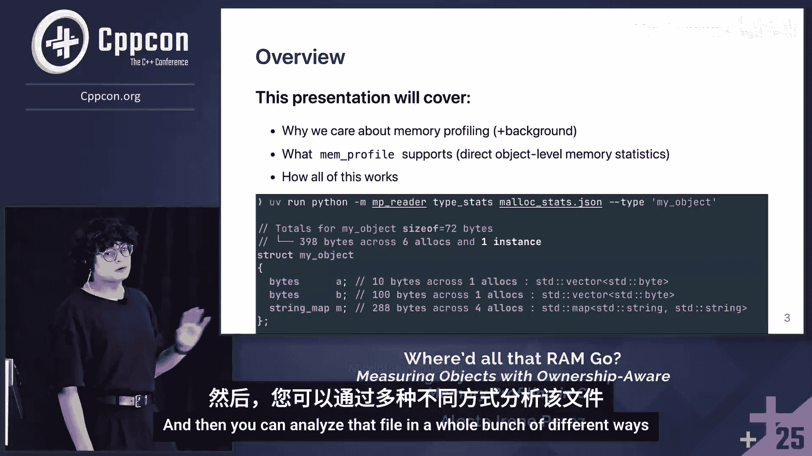

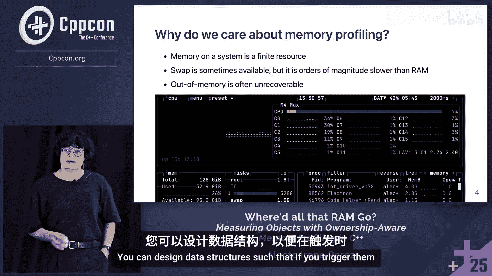

在本教程中，我们将学习一种基于对象所有权的C++内存分析方法。这种方法能帮助我们精确地定位程序中哪些对象真正占用了内存，以及它们是如何持有这些内存的，从而为内存优化提供清晰的数据支持。

## 为什么需要内存分析？🤔

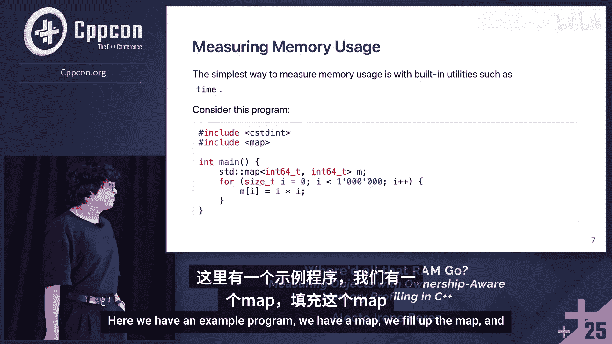

系统内存是一种有限的资源。虽然有时可以使用交换空间，但其速度比RAM慢几个数量级。内存耗尽通常是不可恢复的错误。虽然可以设计数据结构在触发时释放资源，但这非常困难且不总是可靠。有时你就是没有更多内存了。

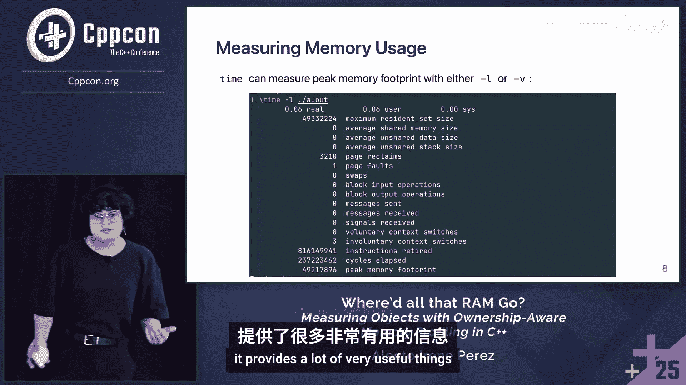

购买更多内存或使用更大内存的服务器是一种解决方案，但这通常很昂贵。对于分发给客户端的软件，你无法为每个客户端购买更多内存，因此必须能够优化程序本身。

要优化，首先需要测量。你需要知道优化前和优化后使用了多少内存，并且不能盲目进行。你需要能够识别程序中实际使用内存的部分。

## 现有内存测量工具简介 🛠️

目前有许多优秀的工具可用于测量内存使用情况。以下是三种常见工具的简要介绍。


### 1. `time` 工具

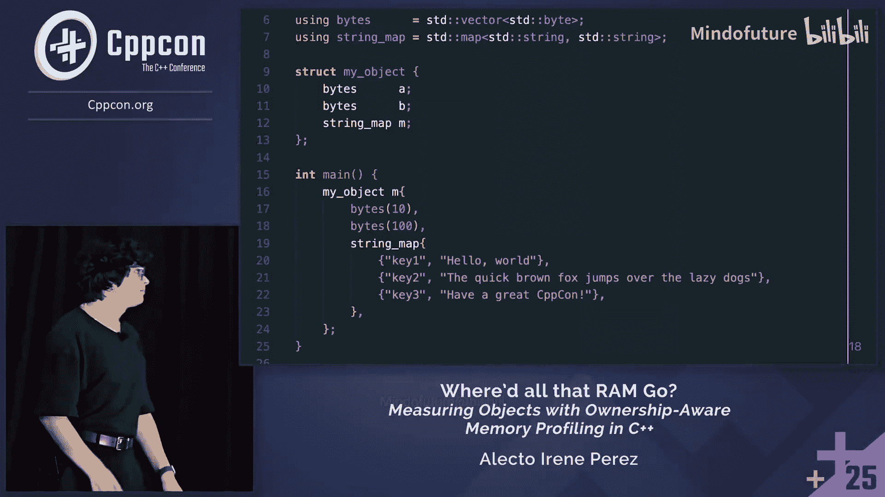

最简单的方法是使用像 `time` 这样的工具。以下是一个示例程序，我们使用 `time` 来测量其内存使用。

```cpp
#include <map>
int main() {
    std::map<int, int> m;
    for (int i = 0; i < 1000000; ++i) {
        m[i] = i;
    }
}
```

在Linux上，通常可以使用 `time -v` 命令来获取峰值内存占用等信息。

**优点**：快速、简单，能获得一个数字——峰值内存占用。
**缺点**：无法了解内存的具体使用者，且只得到一个峰值数字。

### 2. Valgrind

Valgrind 是一个非常强大和有用的工具。如果你想找出内存泄漏发生的位置，Valgrind 是首选工具。Valgrind Massif 可以测量程序随时间变化的内存使用情况，并打印出漂亮的ASCII图表。

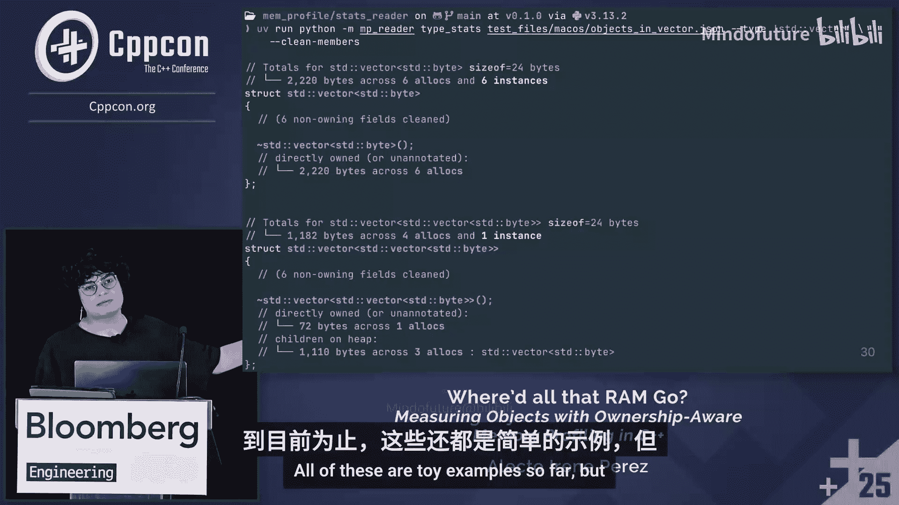

### 3. Heaptrack

Heaptrack 是一个更现代、更先进的工具。它在每次分配发生时记录堆栈跟踪，你可以用它来制作内存分配的火炬图。

下图来自其GitHub仓库，熟悉火焰图的人可能知道如何阅读它。简单解释一下：水平轴上的条长度表示消耗的内存量，条的高度基本上就是调用堆栈。你可以看到大量内存是在 `QDataArray::allocate` 中分配的。

然而，仅仅看到内存分配发生在哪里非常有用，但这并不能告诉你谁在持有这些内存，也不能解释为什么内存没有被释放或花了很长时间才被释放。

## 所有权感知内存分析的核心思想 🎯

我们编写的代码涉及数据结构、对象和容器，处理所有权语义。我们的分析器需要反映这一点。我们需要能够找出哪些对象在消耗内存，为什么内存没有被释放，以及哪些成员或子对象在使用这些内存。

对象可能非常复杂。仅仅能够说“这个类型使用了那么多内存”非常有用，但我们希望更进一步。

所有权感知内存分析器可以回答这些问题。它并非第一个此类分析器，但我们希望它非常有用、通用且强大。它可以分析用户定义的容器，处理模板特化、虚拟继承，在运行时解析实际分配的对象，处理C风格联合体以及通过placement new分配的子对象。

## 分析器工作原理：基于析构函数的归属判定 ⚙️

上一节我们介绍了所有权分析的必要性，本节中我们来看看分析器是如何实现这一目标的。核心在于一种基于析构函数的方法：我们将内存归属于实际释放该内存的对象。

任何在析构函数调用中释放的内存，都被定义为由正在被销毁的对象所拥有。如果在销毁时没有发生释放，我们就知道该对象最终并不拥有任何内存。

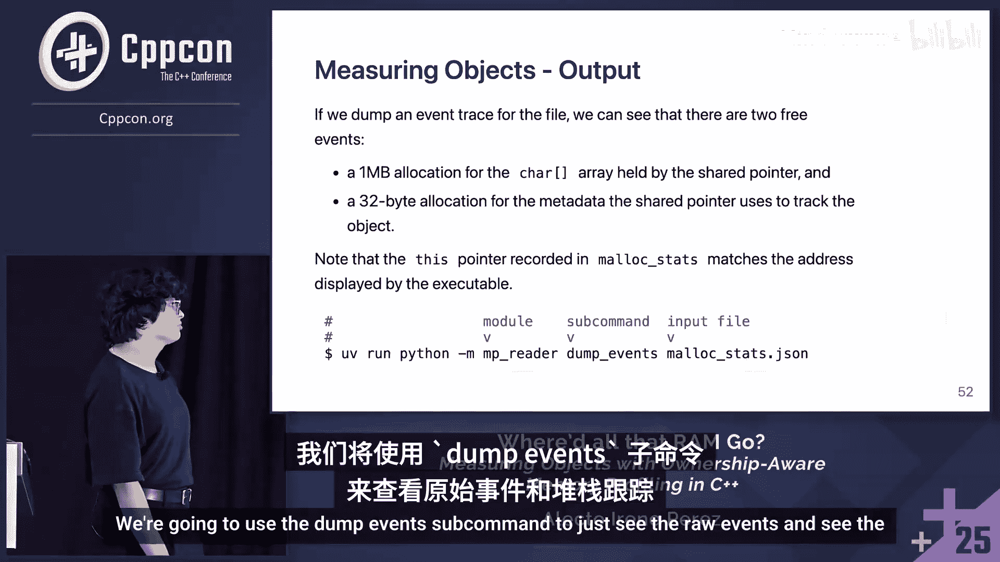

因为内存释放是唯一的（不能双重释放），所以即使内存被共享，这种方法也能正确分配所有者。内存总是归属于最后持有该内存的对象。这一点很重要，因为最后持有它的对象，也是内存未能更早被销毁的原因。

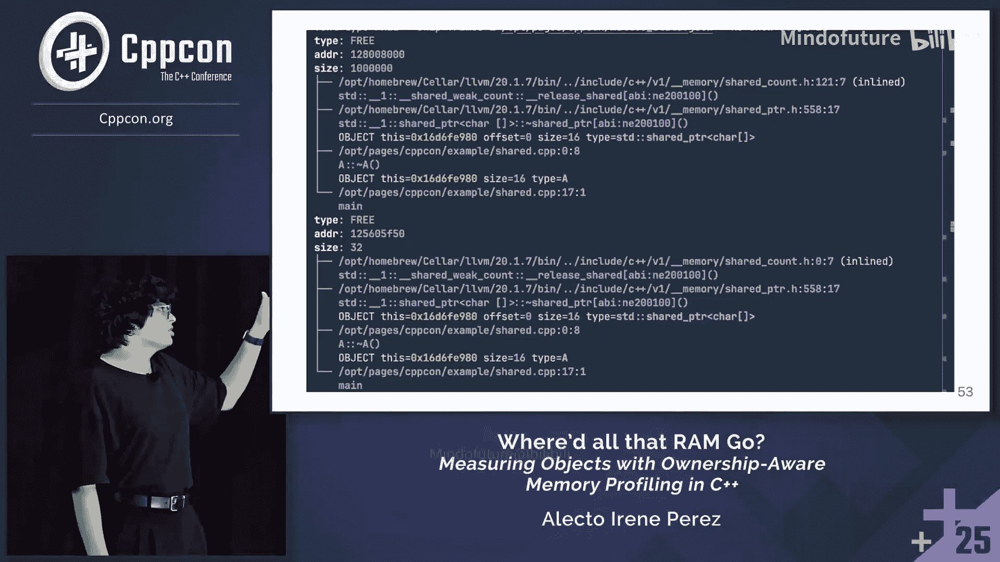

这种方法有几个优点：可以忽略所有非拥有类型，无需测量它们的大小；它是通用的，可以处理任何遵循RAII并释放其拥有内存的对象；它同时处理共享所有权和唯一所有权。

## 使用示例：从简单到复杂 📊

让我们通过几个例子来看看分析器的输出。

### 示例1：简单对象

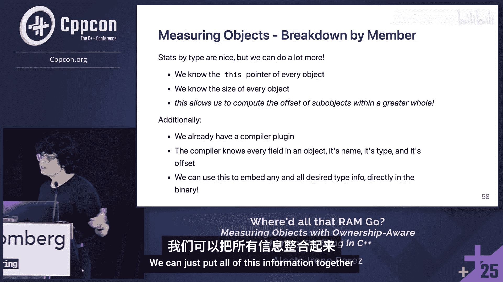

这是一个非常简单的对象，包含一些字节向量和一个映射。

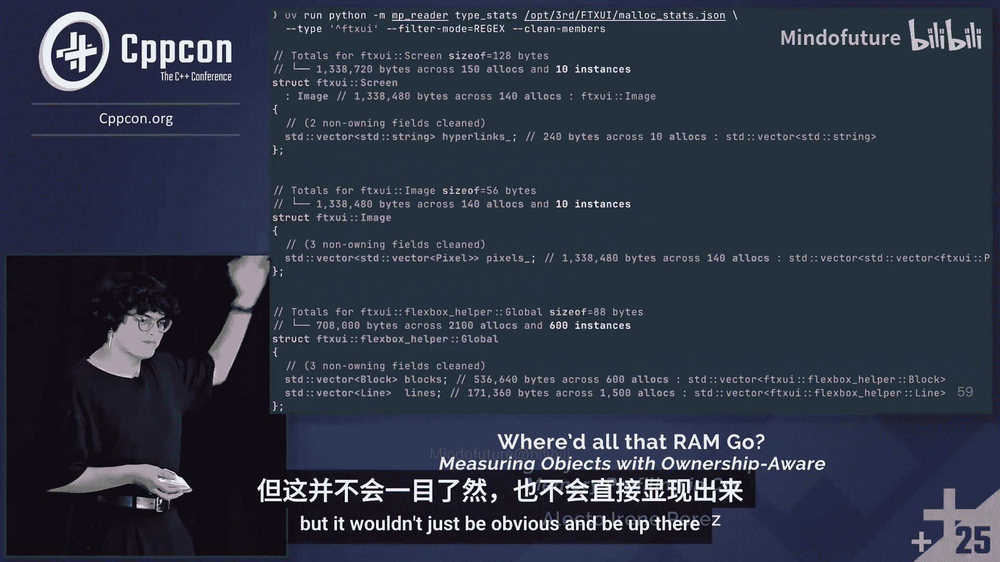

```cpp
struct MyObject {
    std::vector<uint8_t> a;
    std::vector<uint8_t> b;
    std::map<int, int> m;
};
int main() {
    MyObject obj;
    // ... 填充 obj ...
}
```


分析器输出显示有三个成员：`a`、`b` 和 `m`。我们可以看到每个成员使用了多少内存，发生了多少次分配，以及创建了多少个对象。我们还可以看到对象内部发现这些内存的偏移量。

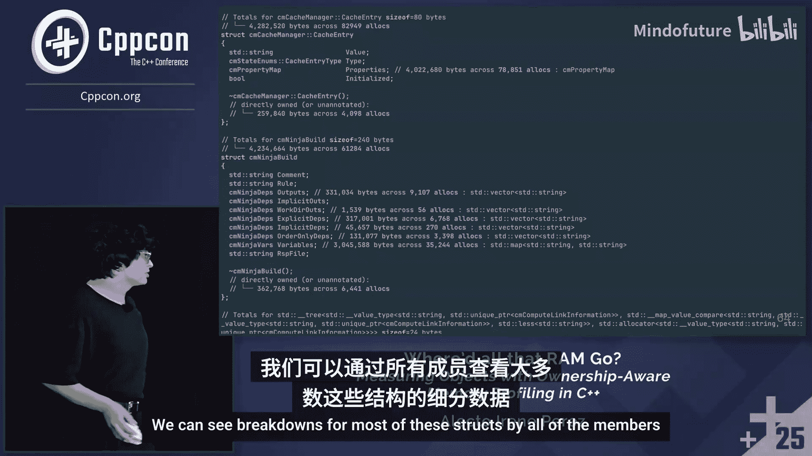

### 示例2：Lambda表达式

与结构体不同，Lambda表达式没有命名字段，但分析器仍然可以记录类型信息。我们可以看到第一个字段拥有10字节，第二个字段拥有400字节（100个浮点数），第三个字段在一次分配中拥有8000字节（1000个双精度数）。

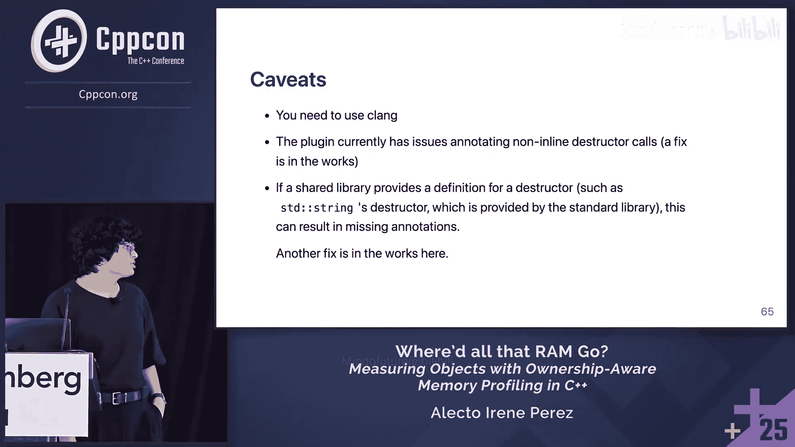

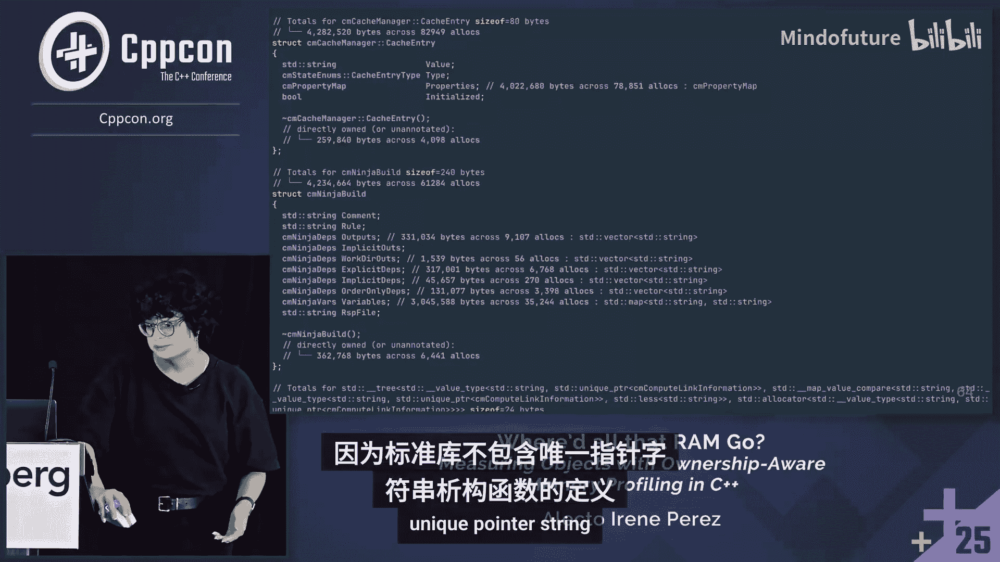

### 示例3：C风格数组

这个例子展示了一个类内部的C风格数组。分析器能够确定数组中每个元素的索引及其内存使用。

### 示例4：自定义容器（Toy实现）

这个例子展示了一个在对象内部内联分配缓冲区的向量（玩具实现）。分析器可以显示每个索引使用了多少内存。注意，索引3缺失了，因为那里没有分配内存。

### 示例5：标准库容器（非玩具示例）

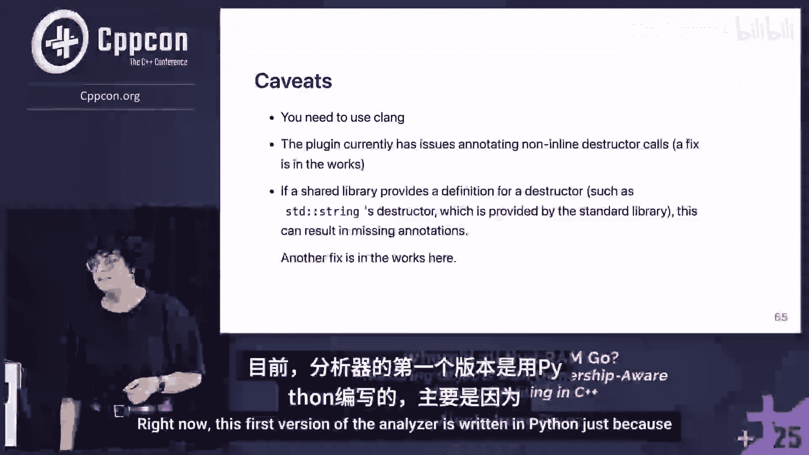

这是一个规范示例：一个包含某些值的标准向量。分析器显示程序运行期间创建了两个包含 `std::vector` 的类型。其中一个没有分配子对象，直接分配了内存；另一个则拥有分配子对象。

## 技术实现细节：编译时插桩与运行时跟踪 🔧

上一节我们看了分析器的输出效果，本节我们来深入了解其技术实现。分析器的使用非常简单，例如在CMake中，你可以找到分析器的包，然后链接 `mp_built_with_plugin` 目标。链接它会添加编译标志，以便在使用Clang编译时注入插件。

插件在编译时修改抽象语法树，为析构函数添加注解。在运行时，通过 `LD_PRELOAD` 覆盖 `malloc`、`free`、`new`、`delete` 等符号，从而跟踪所有分配和释放操作。每次调用这些函数时，分析器会获取堆栈跟踪。如果是释放操作，还会展开堆栈，寻找由 `save_state` 留下的内存标记，从而识别出正在被销毁的对象。

运行时，堆栈跟踪只获取原始地址以提高速度。程序执行结束时，分析器对这些地址进行去重，并一次性解析为文件名和行号等信息。

## 分析真实项目：以CMake为例 🏗️

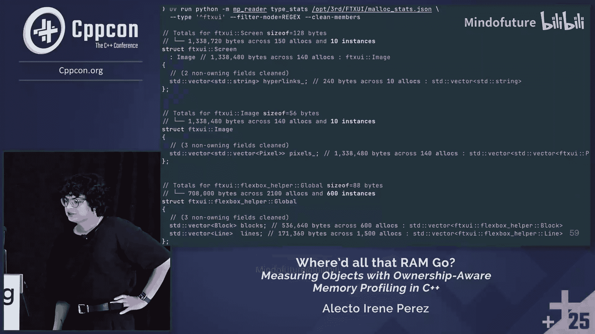


作为演示的最后一部分，我们将分析器应用在一个非平凡的代码库上：CMake。

CMake规模很大，包含935个翻译单元，超过一百万行代码，混合了C和C++，有多个依赖项。我们可以用插件构建整个项目。分析显示，核心的 `CMake` 状态对象总共使用了约340万字节，涉及数万次分配，包含许多拥有内存的字段。

对于一个完整的CMake自配置过程的分析，会生成一个包含150亿字节分配数据的统计对象。分析器可以处理如此大量的数据，并清晰地展示内存使用分布。

## 当前限制与未来方向 🚧

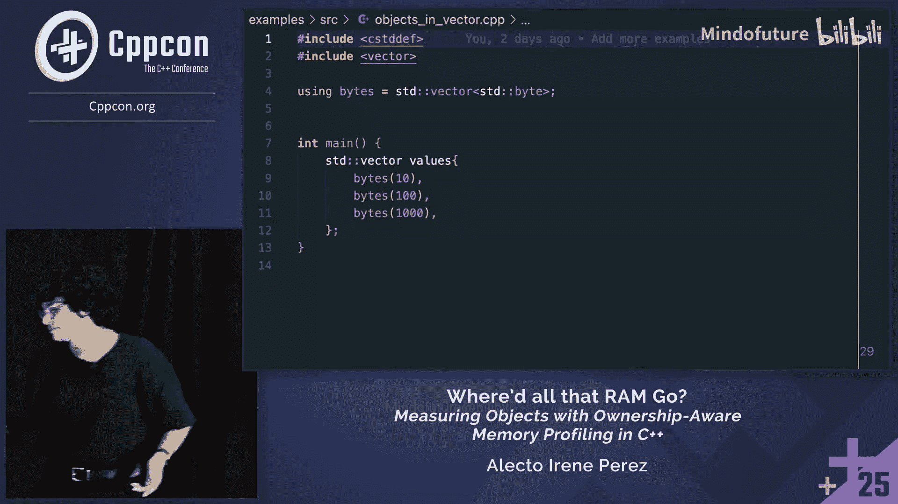

目前，你需要使用Clang编译器。如果有人为GCC编写了工作方式相同的插件，也可以使用，但目前我编写的插件只适用于Clang。

目前，该插件在注解非内联析构函数调用时存在问题。这与代码生成的时间有关。此外，如果库（如标准库）提供了析构函数的定义，链接器会直接使用那个定义，而不是被注解的版本，这可能导致注解丢失。

针对这些问题，修复工作正在进行中。我们正在修改抽象语法树，并更新内置对象的ABI标签，以确保不使用标准库提供的特定析构函数定义。

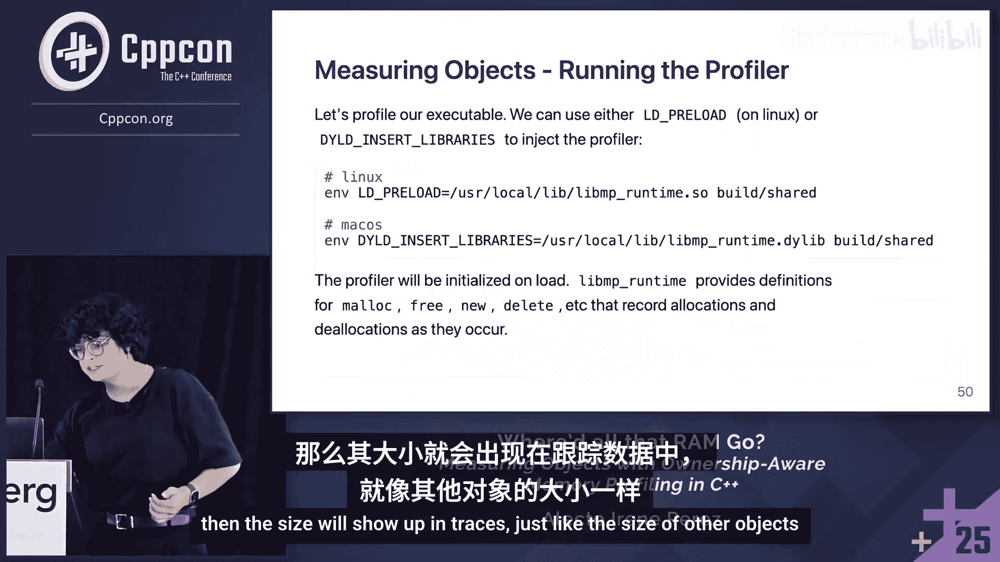

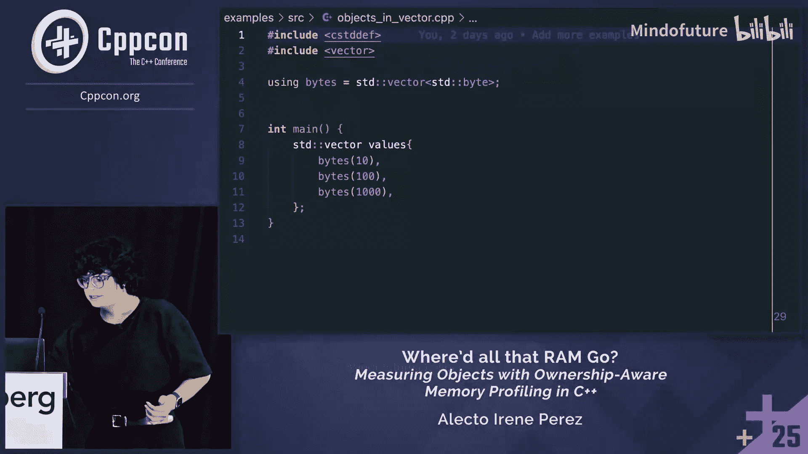

## 总结与问答环节回顾 📝

本节课中我们一起学习了一种基于对象所有权的C++内存分析方法。该工具提高了在类型和对象级别上对内存使用情况的可见性。按字段细分内存使用是前所未有的功能，非常有用。总的来说，它提供了识别低效性和优化代码内存使用所需的数据。

在问答环节，讨论涵盖了多种场景：
*   该工具主要解决的是内存使用低效（如数据结构臃肿）而非内存泄漏，但泄漏信息同样存在于数据中。
*   通过追踪所有分配和释放，分析器可以筛选出在峰值内存时刻已分配但尚未释放的内存，并将其归属到最终负责释放的对象。
*   对于使用自定义内存池或arena分配器的情况，目前需要注解相关分配函数才能获得相同可见性，这是未来的开发方向。
*   工具关注的是通过 `malloc`/`new` 等接口分配的内存，不涉及共享库加载等操作系统层面的内存占用。
*   对于动态增长的容器（如 `vector`），目前主要关注其最终大小，但完整的分配事件历史已被记录，可用于更深入的分析。


这种方法为理解和优化C++程序的内存行为提供了强大的新视角。