# 070：自动微分基础与实现


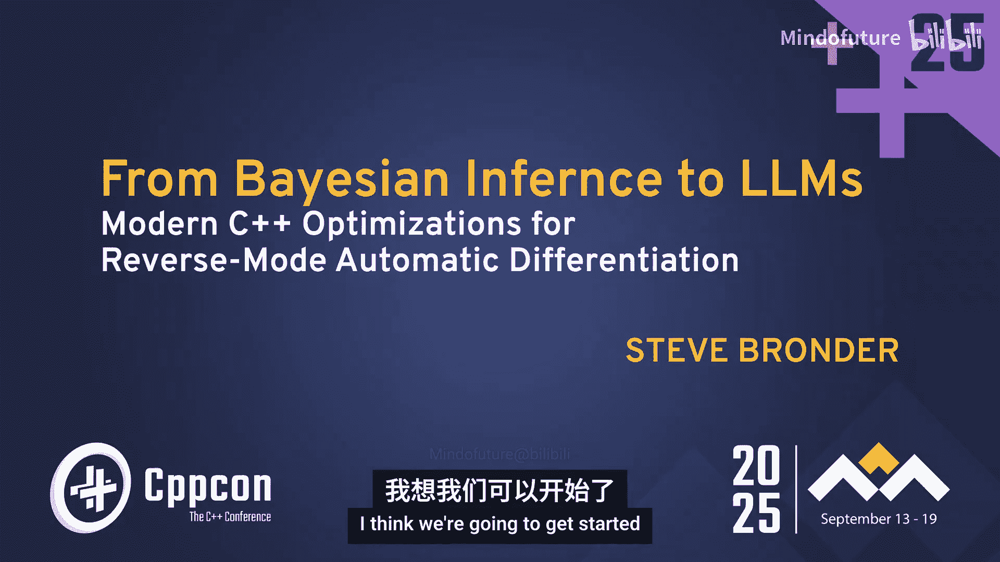

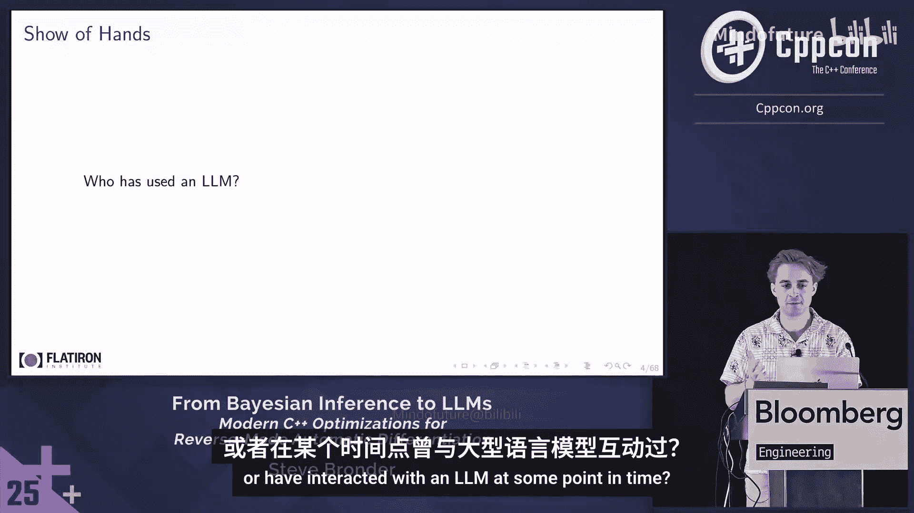

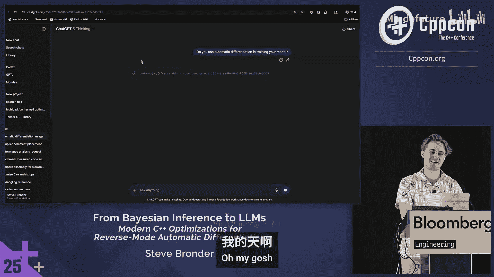

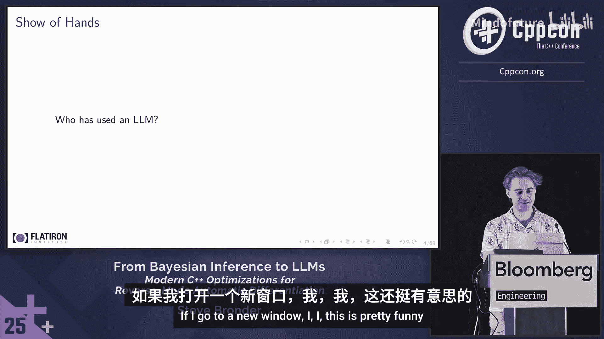

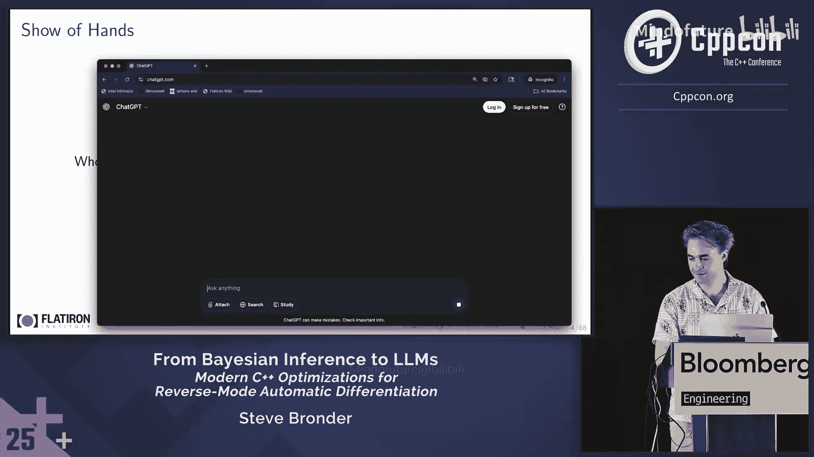

在本教程中，我们将学习自动微分（Autodiff）的核心概念、工作原理及其在C++中的高效实现。我们将重点探讨反向模式自动微分，并分析在高吞吐量、内存密集型编程场景下的性能优化策略。

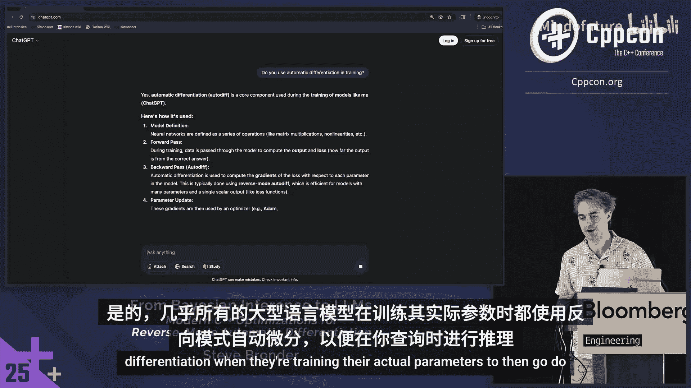

## 概述

自动微分用于计算程序中函数的梯度。它在机器学习、统计建模和科学计算中至关重要，例如用于训练大型语言模型或预测疫情传播趋势。梯度计算通常是优化算法中最耗时的部分，因此其实现效率至关重要。

## 什么是自动微分？🧠

自动微分通过将链式法则应用于程序的子表达式来计算梯度。其核心思想是将复杂函数分解为一系列基本运算（如加法、乘法、对数），然后组合这些基本运算的梯度。

例如，对于函数 `f(x, y) = log(x * y)`，我们可以将其分解为：
*   `g(x, y) = x * y`
*   `h(g) = log(g)`
*   因此 `f(x, y) = h(g(x, y))`

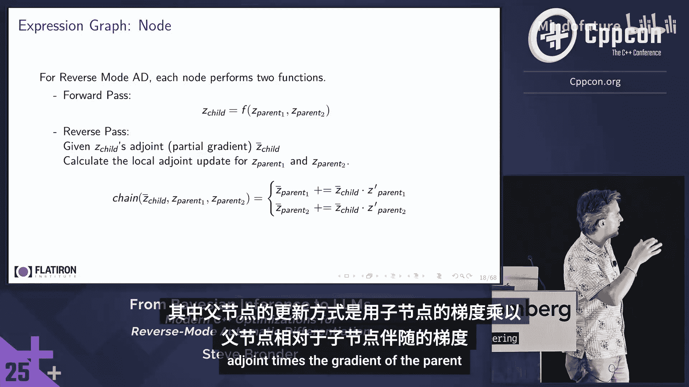

根据链式法则，`f` 对 `x` 的梯度为：
`∂f/∂x = (∂h/∂g) * (∂g/∂x) = (1/g) * y = 1/x`

自动微分能够精确地（在浮点精度内）计算出梯度，而无需像有限差分法那样进行近似。

## 计算图与遍历 🔄

在C++中实现自动微分时，我们通常构建一个**表达式图（Expression Graph）**。图中的节点代表变量或运算，边代表数据流。

考虑表达式 `z = log(x) * y + sin(x)`，其表达式图如下所示：
```
    x       y
    |\     /
    | \   /
    |  \ /
    |   *
    |   |
    |   |
    |   +
    |  / \
    | /   \
    log   sin
```
为了计算梯度，我们需要两次遍历这个图：
1.  **前向传播（Forward Pass）**：从输入节点开始，计算每个节点的值（例如，计算 `log(x)`，`sin(x)`，然后相乘、相加，最终得到 `z`）。
2.  **反向传播（Reverse Pass）**：从输出节点（`z`）开始，反向计算每个节点对其子节点的梯度（即**伴随（adjoint）**）。

反向传播是反向模式自动微分的核心。每个节点都需要一个 `chain` 函数，用于根据其子节点的梯度来更新其父节点的梯度。

## 实现自动微分的两种主要方法 ⚙️

在C++中，主要有两种实现自动微分的方法：**运算符重载（动态）** 和**源代码转换（静态）**。选择哪种方法需要在灵活性和性能之间进行权衡。

### 方法一：运算符重载（动态方法）

这种方法在运行时构建和记录表达式图，具有很高的灵活性。

以下是其关键组件：
*   **磁带（Tape）**：一个用于按顺序存储所有运算节点的容器（如 `std::vector`）。
*   **区域分配器（Arena Allocator）**：一种高效的内存分配策略，它在连续的内存块上分配所有节点。在单次梯度计算完成后，通过重置指针而非释放内存来“清理”磁带，以便在下一次计算中重用内存，这极大地提升了性能。
*   **变量类型（Var Type）**：一个封装类，包含值（value）和伴随（adjoint），并指向一个表示具体运算的节点对象。

一个简单的乘法运算节点可能如下所示：
```cpp
struct MultiplyNode : VarNode {
    Var* op1;
    Var* op2;
    MultiplyNode(Var* a, Var* b) : op1(a), op2(b) {}

    void chain() override {
        // 链式法则：∂z/∂op1 = adjoint * op2->value
        op1->adjoint += this->adjoint * op2->value;
        op2->adjoint += this->adjoint * op1->value;
    }
};

Var operator*(const Var& a, const Var& b) {
    // 1. 前向传播：计算值
    double val = a.value * b.value;
    // 2. 创建节点，记录运算
    auto* node = tape.alloc<MultiplyNode>(a.impl, b.impl);
    node->value = val;
    // 3. 返回代表结果的新变量
    return Var(node);
}
```
计算梯度时，我们首先将输出节点的伴随设为1，然后逆序遍历磁带，对每个节点调用其 `chain` 方法。

**优点**：非常灵活，支持运行时控制流（如 `while` 循环）。
**缺点**：存在指针追逐问题，缓存局部性差，通常比静态方法慢。

### 方法二：源代码转换（静态方法）

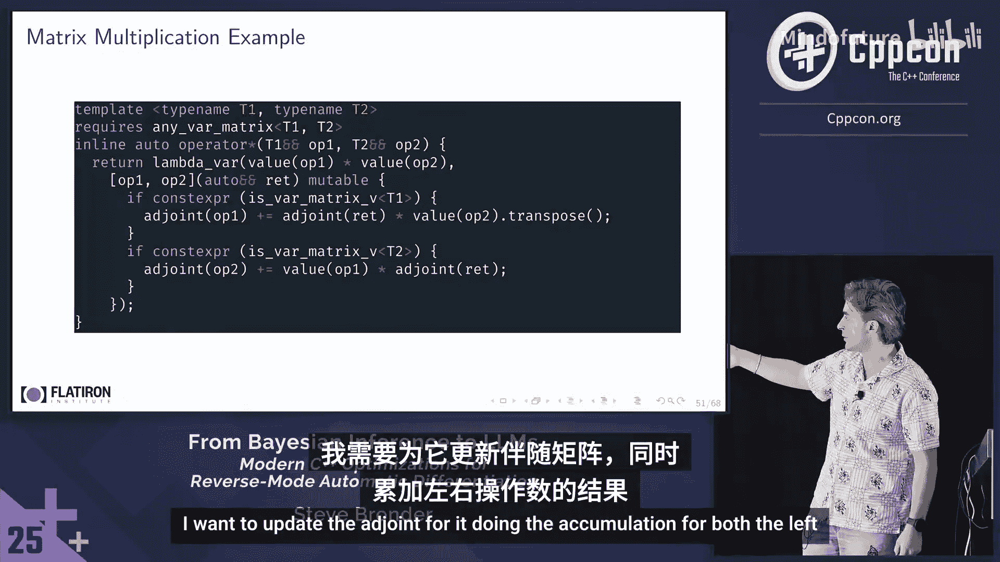

这种方法在编译时利用C++的类型系统和表达式模板来构建表达式图。表达式图的结构在编译期就已确定。

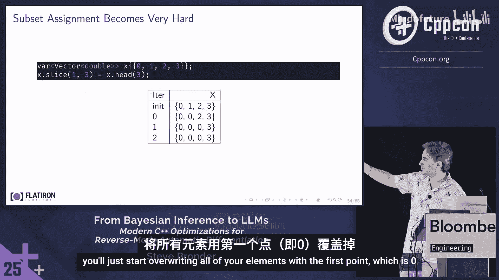

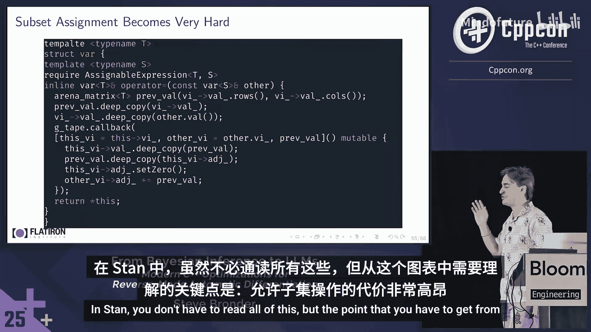

其核心是定义一个表达式模板类型：
```cpp
template <typename Op, typename... Children>
struct Expr {
    double value;
    std::tuple<Children...> children;

    // 编译时已知的反向传播逻辑
    static void reverse(Expr& self, double child_adjoint) {
        // 应用Op特定的反向传播规则
        Op::propagate_adjoints(self.children, child_adjoint);
        // 递归调用子表达式的reverse
        std::apply([&](auto&... child) { (child.reverse(...), ...); }, self.children);
    }
};
```
当我们写下 `auto z = log(x) * y + sin(x);` 时，`z` 的类型是一个复杂的、嵌套的表达式模板类型，它在编译期就编码了整个计算图。

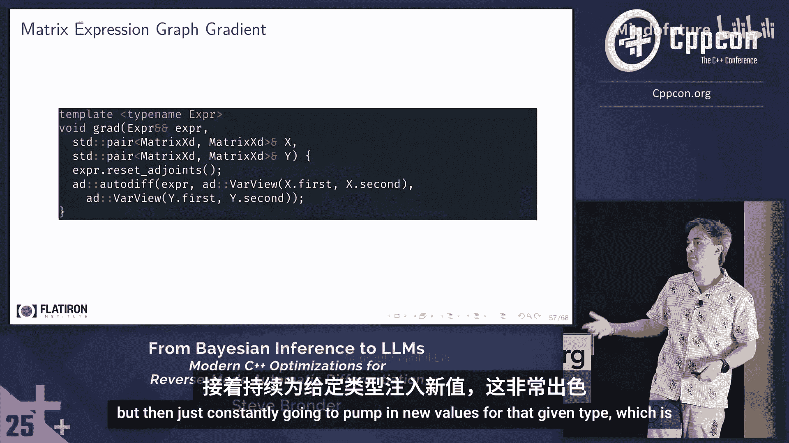

**优点**：性能极高，编译器可以进行大量优化（如内联），消除了运行时开销。
**缺点**：灵活性受限，无法处理运行时才确定的计算图结构（例如，循环次数在运行时决定的 `while` 循环）。

## 矩阵运算的自动微分 📊

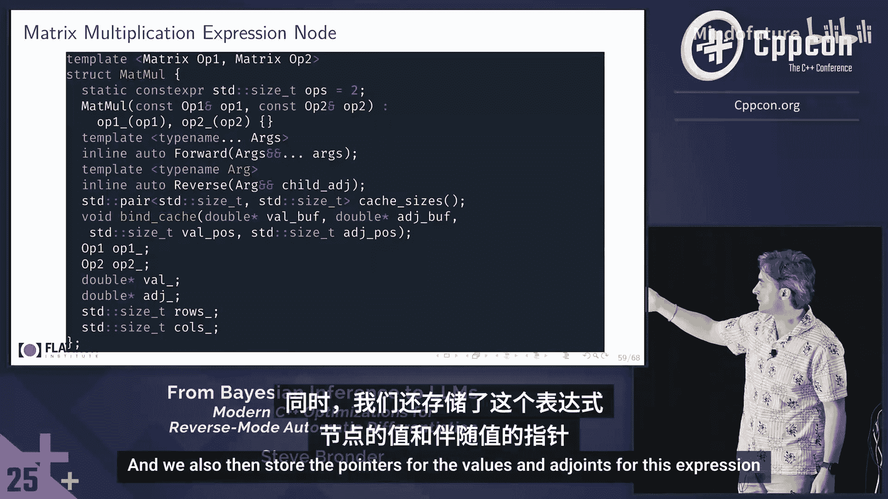

在科学计算中，我们经常需要对矩阵进行自动微分。这里有两种主要的存储策略：

1.  **结构体数组（Array of Structs, AoS）**：
    ```cpp
    std::vector<Var> matrix; // 每个元素是一个Var标量
    ```
    *   **优点**：实现简单，任何标量运算都可直接用于矩阵元素。
    *   **缺点**：严重禁用SIMD优化，计算梯度时需要为每个矩阵元素进行指针追逐，缓存效率低。

2.  **数组结构体（Struct of Arrays, SoA）**：
    ```cpp
    struct MatrixVar {
        Eigen::MatrixXd values;  // 值矩阵
        Eigen::MatrixXd adjoints; // 伴随矩阵
        void chain(double child_adjoint) { ... } // 整个矩阵的反向传播
    };
    ```
    *   **优点**：`values` 和 `adjoints` 是连续存储的矩阵，可以利用Eigen等库的SIMD指令进行高效向量化运算。整个矩阵运算（如矩阵乘法）作为一个节点记录在磁带中，减少了节点数量和内存跳跃。
    *   **缺点**：需要为每个矩阵运算（如乘法、Cholesky分解）手动实现其梯度（反向传播）逻辑。支持切片（slice）和赋值操作非常复杂，容易引入别名问题且可能导致意外的深度拷贝。

**源代码转换方法**对于矩阵运算尤其强大。我们可以定义一个表达式，它一次性描述整个矩阵计算流程（如 `C = A * B; sum = C.sum()`），然后在编译期生成高度优化的、可重用的前向和反向传播代码。通过预分配好值/伴随所需的内存，并绑定到表达式上，可以反复用新的输入数据执行该计算图，获得接近手工编码的性能。

## 性能考量与总结 🚀

*   **性能对比**：源代码转换（静态）方法通常比运算符重载（动态）方法快一个数量级。对于矩阵运算，采用SoA策略的动态方法优于AoS策略，但依然难以匹敌静态方法的性能。
*   **选择建议**：
    *   如果需要支持动态控制流（如运行时循环），**运算符重载**是更合适的选择。
    *   如果计算图在编译期可以确定，并且追求极致性能，**源代码转换**是最佳选择。
    *   对于矩阵运算，优先考虑使用支持**源代码转换**或**SoA动态策略**的库。
*   **关键优化点**：
    1.  **使用区域分配器**：对于动态方法，这是减少内存分配开销、提升缓存局部性的最关键优化。
    2.  **利用现代C++特性**：如Lambda表达式、可变参数模板，可以大幅减少动态方法中为各种运算编写模板代码的工程量。
    3.  **权衡灵活性**：允许矩阵切片等操作会给实现带来显著复杂度，并可能影响性能，需要根据实际需求谨慎设计。

## 总结

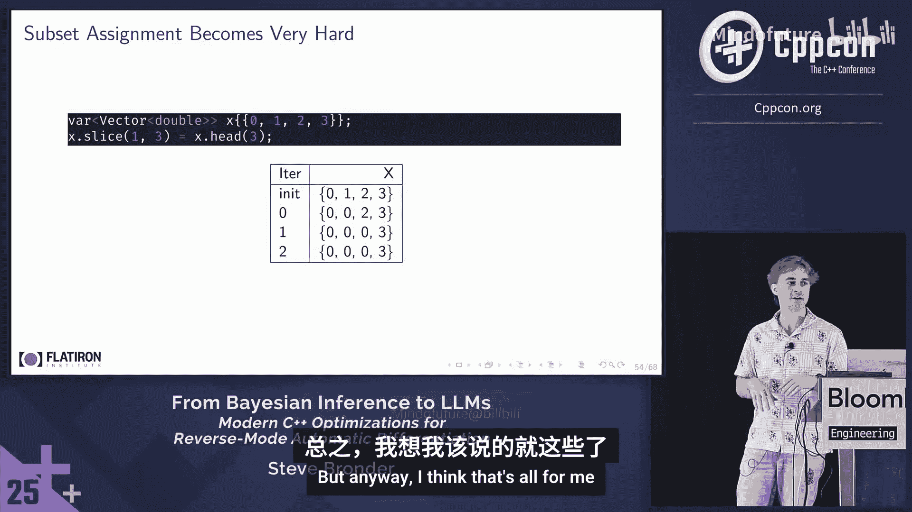


本节课我们一起学习了自动微分的基础原理。我们了解了如何通过表达式图和反向传播计算梯度，并深入探讨了在C++中实现自动微分的两种主要方法：灵活的运行时运算符重载和高效的编译期源代码转换。我们还分析了在矩阵运算场景下不同的数据布局策略（AoS vs SoA）对性能的影响。理解这些核心概念和权衡，将帮助你为特定的应用场景选择或实现最合适的自动微分工具，从而在机器学习和科学计算任务中实现高性能的梯度计算。