# 072：精通 C++ 友元关键字


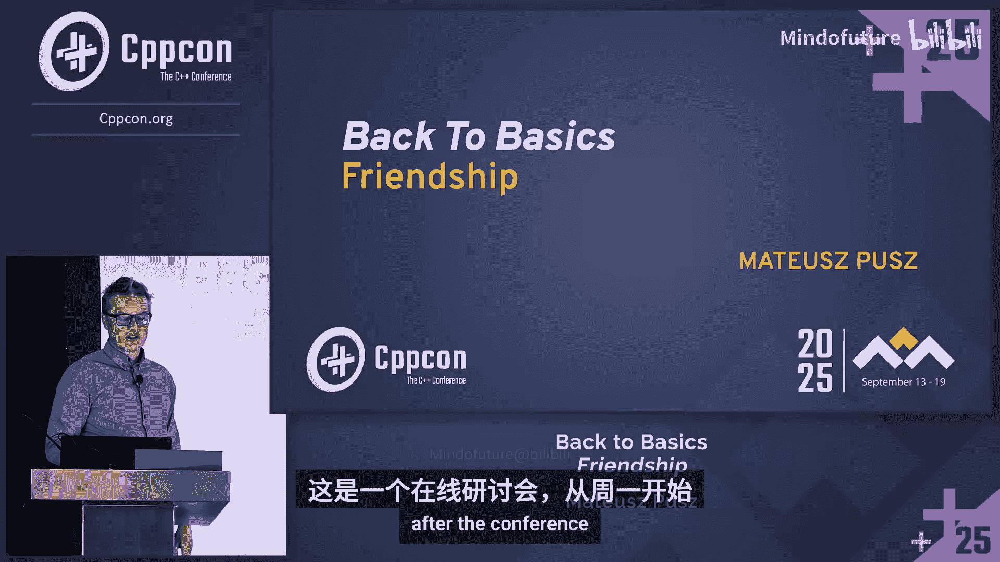

在本教程中，我们将学习 C++ 中 `friend` 关键字的基础知识。我们将探讨其用途、最佳实践，并澄清一些常见的误解。通过本教程，你将理解如何恰当地使用友元来增强代码的封装性和可维护性。

## 1：友元的基本概念与访问控制

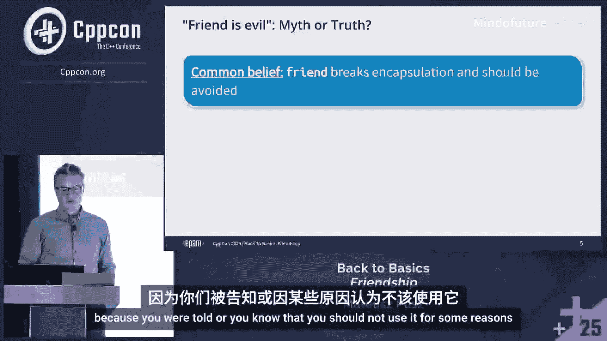

C++ 提供了丰富的访问说明符来控制类成员的可见性。

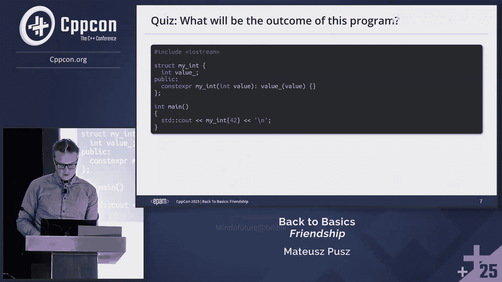


*   **`public` 成员**：对所有人可访问。
*   **`protected` 成员**：对当前类及其派生类可访问。
*   **`private` 成员**：仅对当前类自身可访问。

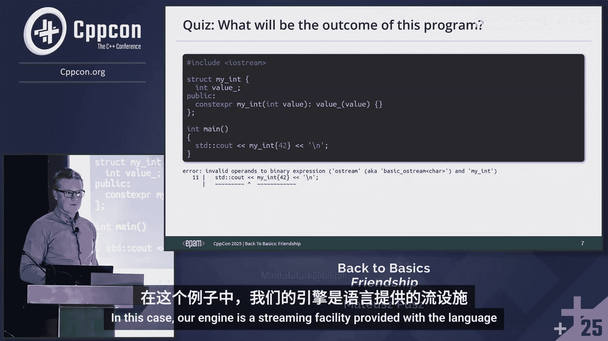

`class` 默认提供私有成员访问和私有继承，而 `struct` 默认提供公有成员访问和公有继承。

有时，非成员函数（如流输出运算符 `operator<<` 或加法运算符 `operator+`）需要访问类的私有成员以实现功能。如果将这些运算符实现为成员函数，则左侧操作数无法进行隐式类型转换，限制了其灵活性。

**示例：成员运算符的局限性**
```cpp
class MyInt {
    int value;
public:
    MyInt(int v) : value(v) {}
    // 成员 operator+，仅右侧参数可隐式转换
    MyInt operator+(const MyInt& rhs) const {
        return MyInt(value + rhs.value);
    }
};

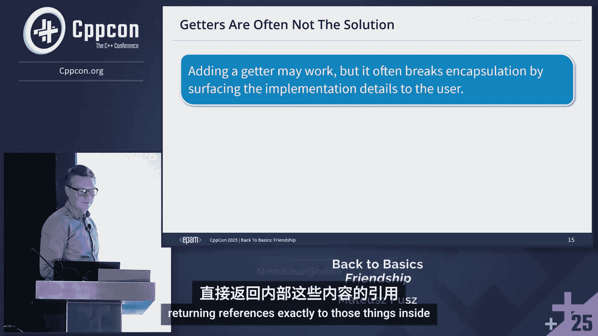

MyInt a(42);
auto result1 = a + 1; // 正确：1 被隐式转换为 MyInt
auto result2 = 1 + a; // 错误：左侧的 `1` 无法调用成员函数 `operator+`
```


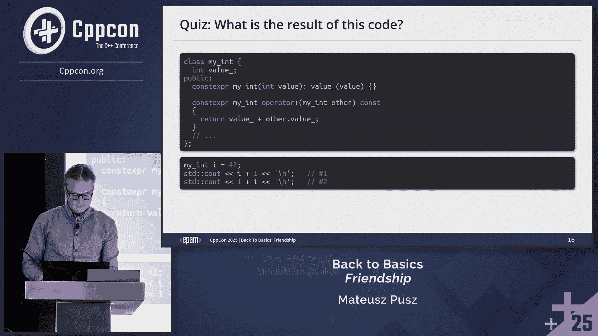

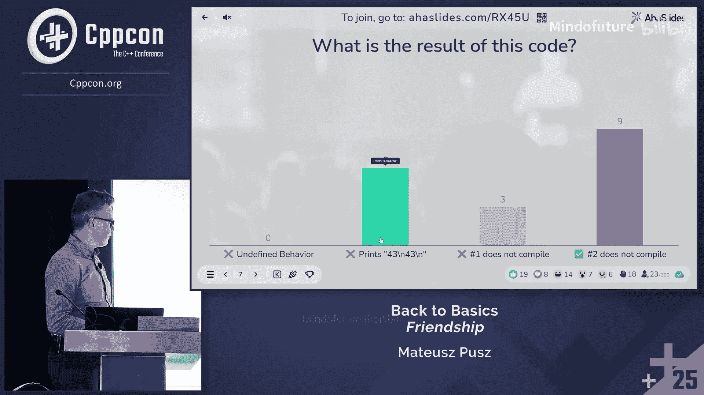

正确的做法是将这些二元运算符实现为非成员函数。但作为非成员函数，它们默认无法访问类的私有成员。这时就需要 `friend` 关键字。

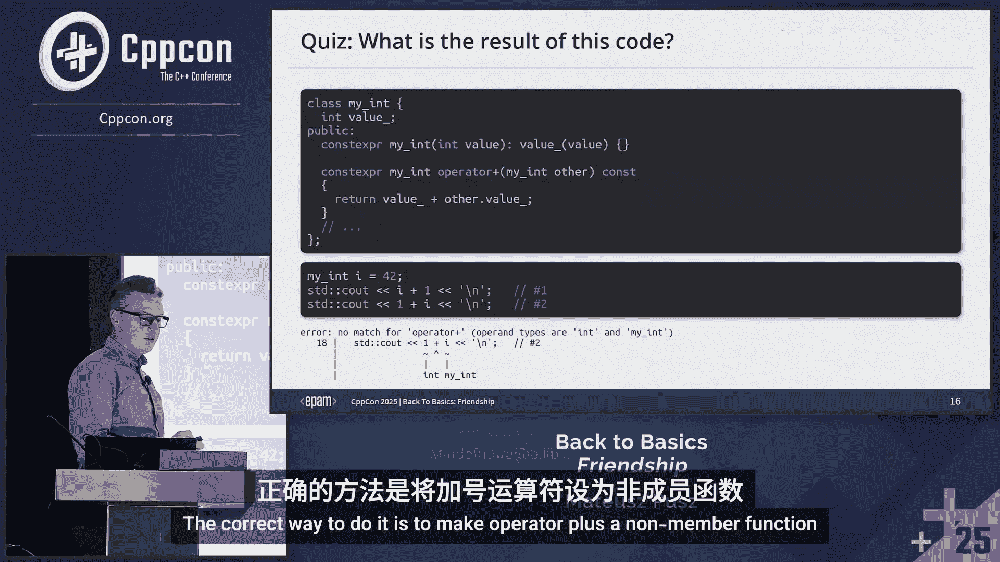

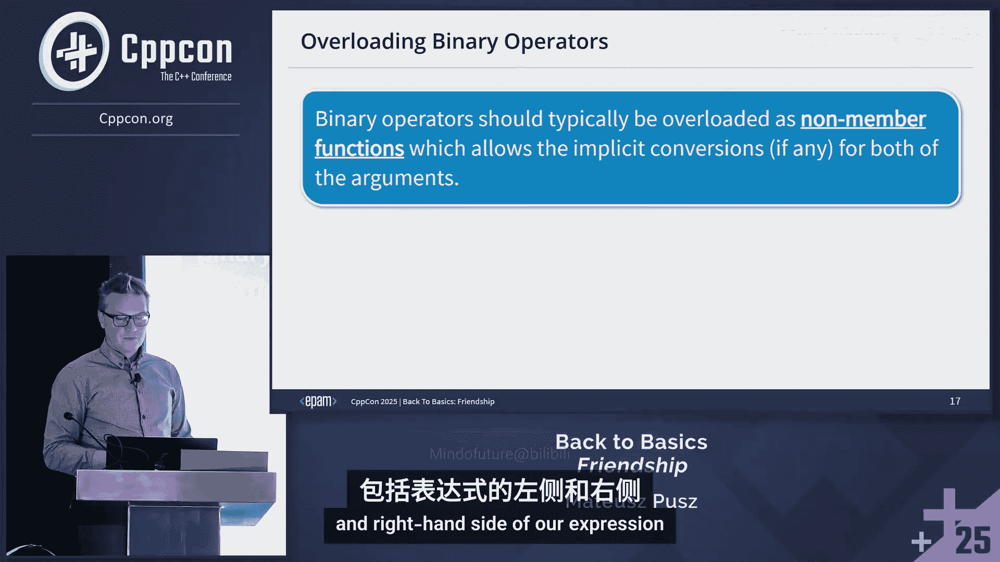

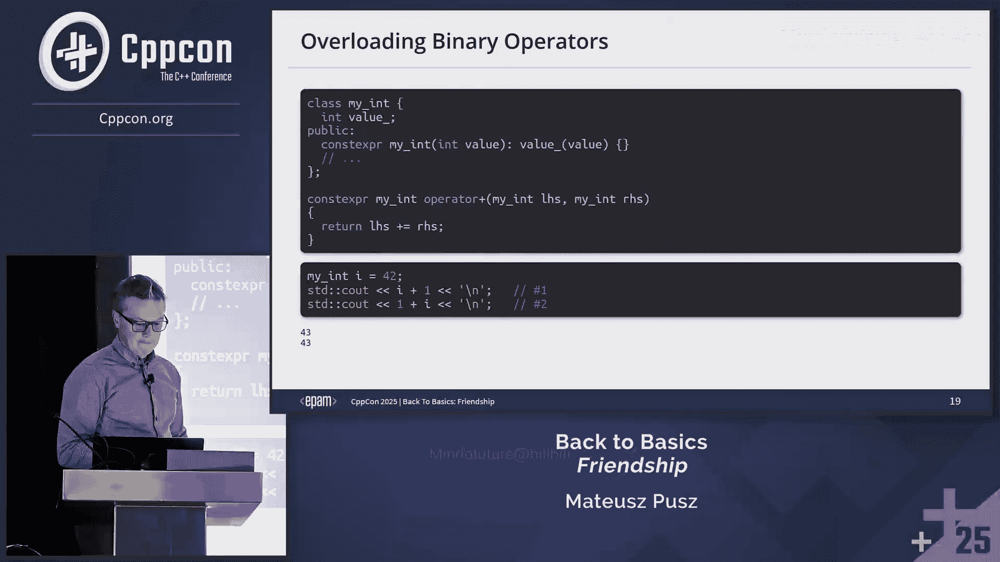

**`friend` 的作用**：`friend` 声明授予一个函数或类访问另一个类的私有（`private`）和保护（`protected`）成员的权限。

## 2：友元的声明与语法


友元声明可以放置在类定义中的任何区域（`public`、`protected` 或 `private`），其访问性不受该区域影响。友元声明本身不会破坏封装性。

**可以声明为友元的实体**：
*   非成员函数
*   其他类的成员函数
*   整个类
*   函数模板或类模板

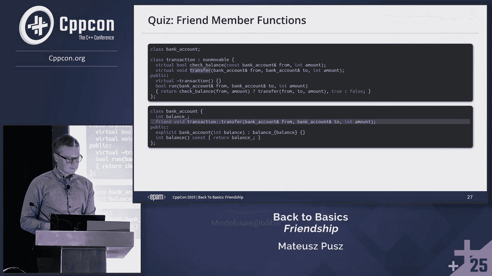


**示例：声明友元函数**
```cpp
class BankAccount {
    double balance;
public:
    // 声明友元函数，允许其访问私有成员 `balance`
    friend void transferFunds(BankAccount& from, BankAccount& to, double amount);
};

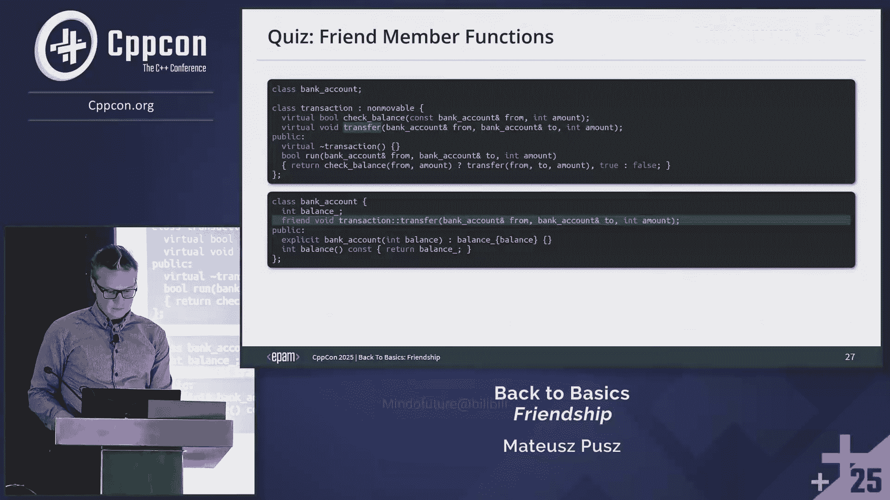

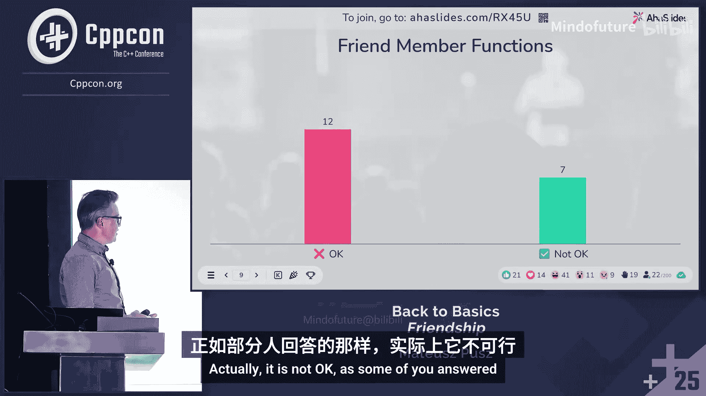

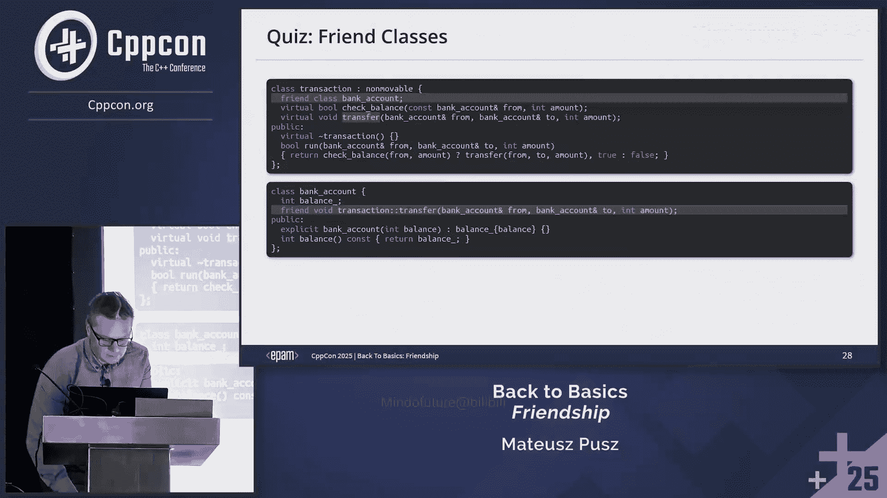


// 友元函数的定义
void transferFunds(BankAccount& from, BankAccount& to, double amount) {
    from.balance -= amount; // 可以访问私有成员
    to.balance += amount;
}
```

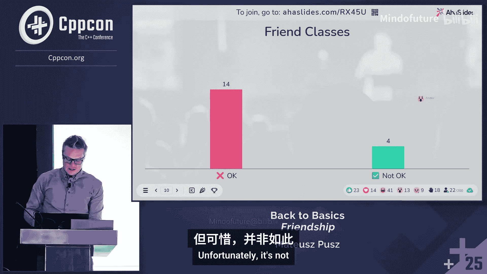

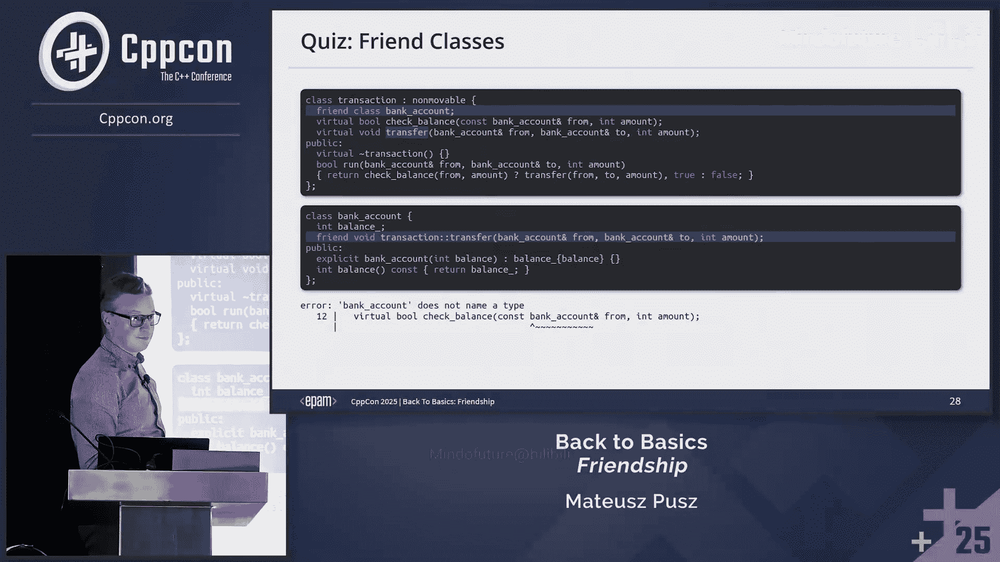

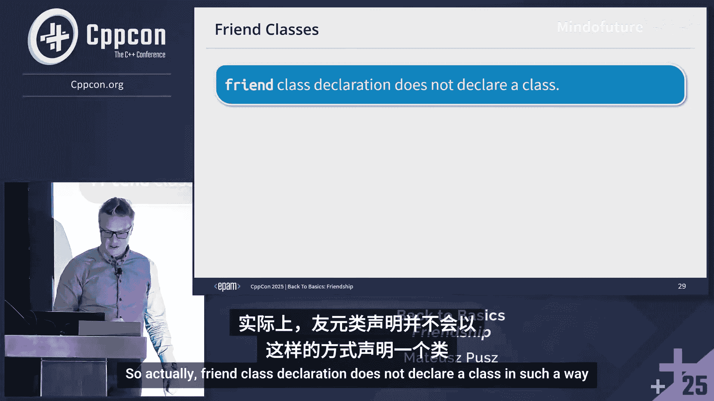

**友元的性质**：
*   **非传递性**：如果 `X` 是 `Y` 的友元，`Y` 是 `Z` 的友元，并不意味着 `Z` 是 `X` 的友元。
*   **非相互性**：如果 `X` 声明 `Y` 为友元，并不意味着 `Y` 自动声明 `X` 为友元。
*   **非继承性**：基类的友元关系不会被派生类继承。

## 3：封装性与友元的关系

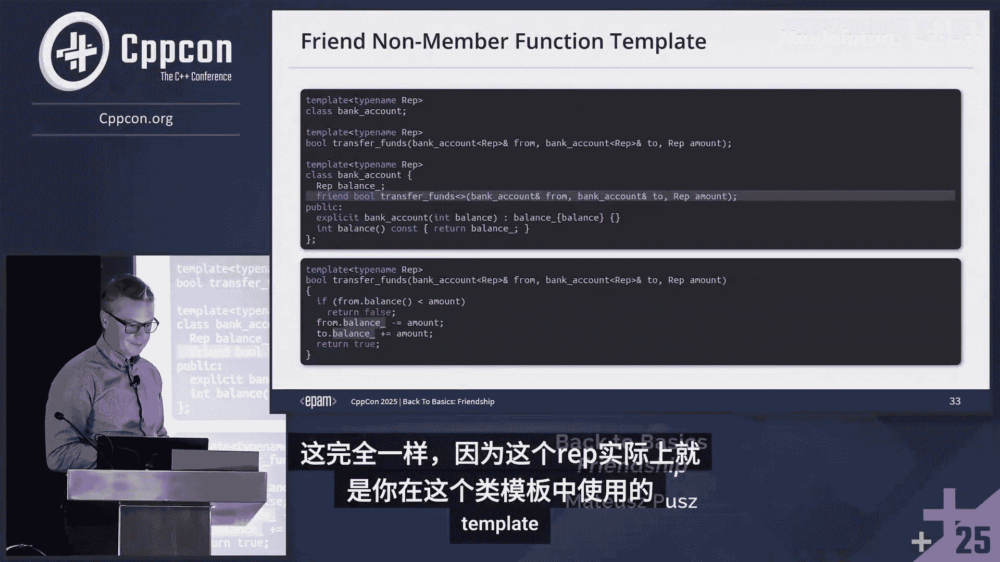

封装是将数据及与之相关的行为绑定在一个清晰接口后的艺术。它隐藏实现细节，维护类的不变量，并支持轻松重构。

一个常见的误解是添加成员函数会增强封装。实际上，**如果一个函数既能实现为成员函数，也能实现为非成员函数，那么将其实现为非成员函数通常能提高类的封装性**。因为非成员函数依赖于类的公有接口，当类的内部实现改变时，需要修改的函数更少。

**友元函数与封装**：友元函数在破坏封装性方面，与公有成员函数并无区别。两者都获得了访问类内部的权限。关键在于设计，而非关键字本身。

标准库中的 `std::string` 拥有大量成员函数，这使得其内部重构变得困难，这是一个反面例子。

## 4：应避免使用友元的场景

在了解了友元的基本用法后，我们来看看哪些情况下应该避免或谨慎使用友元。

**1. 不要为单元测试声明友元**
这是最常见的误用之一。为了测试私有成员而将测试类声明为友元，会带来严重问题：
*   增加了产品代码与测试代码的耦合。
*   私有成员的改动会迫使测试代码同步修改。
*   测试应该关注公有接口的行为，而非内部实现细节。

正确的做法是遵循单一职责原则，将大类分解为多个职责清晰的小类，并通过依赖注入、接口抽象等方式，使其能够通过公有接口进行独立测试。

**2. 当嵌套类已具备访问权限时**
如果某个类（如迭代器）被定义为另一个类的嵌套类，那么它天然具有访问外部类私有成员的权限，无需额外声明为友元。

**3. 当需要更细粒度的访问控制时**
声明一个类为友元，意味着授予它访问**所有**私有成员的权限。如果只想开放部分接口，可以考虑使用 `Passkey` 惯用法或 Attorney-Client 惯用法来提供更精细的访问控制。

## 5：隐藏友元：提升编译效率与错误信息

传统上，我们将友元函数在类内声明，在类外定义。这会导致在查找函数（特别是重载运算符时）时，编译器需要检查大量候选函数，产生冗长的编译错误信息并影响编译速度。

**隐藏友元** 是一种将友元函数的**声明和定义同时放在类内部**的写法。

**示例：隐藏友元**
```cpp
class MyInt {
    int value;
public:
    MyInt(int v) : value(v) {}
    // 隐藏友元：声明和定义一体，且仅在类内
    friend MyInt operator+(const MyInt& lhs, const MyInt& rhs) {
        return MyInt(lhs.value + rhs.value);
    }
};
```

**隐藏友元的优点**：
1.  **改善编译错误信息**：隐藏友元只能通过参数依赖查找（ADL）被发现。当调用不匹配时，编译器不会在错误信息中列出大量无关的全局重载，使得错误更清晰。
2.  **提升编译速度**：减少了名称查找和重载解析时需要处理的候选函数数量。
3.  **代码更简洁**：无需在类外再写一遍函数定义。

大多数自定义点（如 `operator<<`， `operator+`， `swap`， `abs`）都依赖 ADL 来查找函数，因此隐藏友元是它们的完美搭档。

**建议**：即使不需要访问私有成员，在重载运算符或实现具有通用名称的自定义点时，也应优先考虑使用隐藏友元，而非全局非成员函数，以获得更好的编译期体验。

## 6：总结与最佳实践

本节课我们一起学习了 C++ 中 `friend` 关键字的精髓。

**总结要点**：
*   `friend` 用于授予特定函数或类访问另一个类私有/保护成员的权限。
*   它会在两个独立的实体间引入强耦合，但如果这些实体本身逻辑紧密且因某些原因（如生命周期不同）无法合并，这种耦合是可接受的。
*   隐藏友元函数在破坏封装性方面并不比成员函数更甚，无需对其感到恐惧。
*   当外部函数（如流操作符、算术运算符）需要特殊访问权限，且不应或不能作为成员函数实现时，使用 `friend`。
*   积极使用**隐藏友元**来改善编译速度和错误信息的清晰度，即使不需要访问私有成员。
*   避免为单元测试声明友元。
*   当授予全部私有成员访问权限不合意时，避免使用友元，可以考虑 `Passkey` 等替代方案。


**核心思想**：`friend` 是一个强大的工具，如同艺术，需要技巧、理解和谨慎应用。请明智地使用它，并充分理解其细微之处。