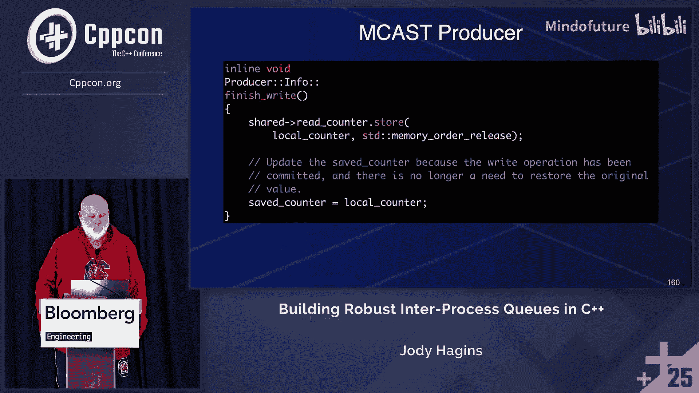

# 073：核心概念与实现


在本教程中，我们将学习如何构建一个健壮的、可用于进程间通信的C++消息队列。我们将探讨在跨进程环境中使用队列时遇到的独特挑战，例如地址空间隔离、同步、进程崩溃恢复以及C++标准对进程的有限定义。我们将重点关注如何设计一个分离生产者、消费者和队列本身职责的健壮系统。

---

## 进程间消息队列的挑战

上一节我们概述了课程目标，本节中我们来看看在跨进程环境中使用队列时面临的核心挑战。

C++标准几乎未定义进程相关的行为。因此，当我们尝试在进程间共享数据结构（如队列）时，会遇到许多语言未涵盖的问题。这些问题包括指针在不同进程地址空间中的不兼容性、同步原语的失效以及进程崩溃后的状态恢复。

### 指针与地址空间


在单个进程内的线程间，共享指针是直接的，因为它们指向相同的虚拟地址空间。然而，在进程间，每个进程拥有独立的地址空间。一个进程中的指针值对另一个进程毫无意义，即使它们通过共享内存映射到了相同的物理内存区域。


**核心问题**：队列数据结构内部通常包含指向其缓冲区的指针。当这个数据结构被放入共享内存时，不同进程看到的指针值是不同的，直接使用会导致未定义行为。

**解决方案**：我们需要一种机制，让生产者和消费者在访问队列时，能基于共享内存的基地址计算出正确的本地指针。这通常意味着队列元数据中存储的应该是相对于共享内存区域的**偏移量**，而非绝对指针。

### 分离关注点

在单进程多线程环境中，我们可能使用一个同时提供 `push` 和 `pop` 操作的队列API。但在跨进程场景下，这种设计是危险的。

我们需要强制实施**分离关注点**：
*   **队列对象**：负责自身的构造、元数据管理和缓冲区生命周期。它提供同步机制，确保只有一个实体能创建它。
*   **生产者对象**：只能向队列写入数据。在单生产者队列中，必须确保全局只有一个活跃的生产者实例。
*   **消费者对象**：只能从队列读取数据。在单消费者队列中，同样要确保唯一性；在多消费者队列中，可以有多个实例。

这种分离不能仅靠约定，必须通过代码逻辑来强制实施。例如，生产者构造函数应尝试获取一个“生产者锁”，如果锁已被占用（表明已有生产者存在），则构造失败。

### 进程崩溃与锁恢复

如果持有锁（例如标识自己是唯一生产者的锁）的进程崩溃，这个锁可能永远无法被释放，导致队列无法被后续进程使用。这是一个必须解决的“健壮性”问题。

**解决方案思路**：实现一种能检测持有者进程是否存活的锁。一种方法是使用一个扩展的“进程ID”，它不仅包含操作系统分配的PID（可能被复用），还包含进程的启动时间戳。锁持有者将此ID存入一个原子变量。当另一个进程尝试获取锁时，如果发现锁被占用，它可以检查该ID对应的进程是否仍然存活。如果进程已死亡，尝试者可以安全地“夺取”该锁。

---

## 实现健壮的进程间锁

上一节我们讨论了进程崩溃带来的锁恢复问题，本节中我们来看看一种可能的实现方案。

我们不能简单地使用 `std::mutex`，因为它在进程崩溃后的行为是未定义的，且其状态可能无法恢复。我们需要一个基于共享内存原子操作的自定义锁。

### 基于进程ID的健壮锁

以下是该锁的核心尝试获取（`try_lock`）逻辑的伪代码描述：

```cpp
bool RobustLock::try_lock() {
    ProcessId my_id = get_current_process_id(); // 获取包含PID和启动时间的ID
    ProcessId expected = PROCESS_ID_NONE; // 预期锁是空闲的

    // 尝试以原子方式将锁所有者设置为我自己
    if (atomic_compare_exchange_strong(&lock_owner, &expected, my_id)) {
        return true; // 成功获取锁
    }

    // 锁已被占用
    if (expected == my_id) {
        return true; // 我已经持有这个锁（可重入情况，根据需求处理）
    }

    // 检查当前锁持有者进程是否还活着
    if (!is_process_alive(expected)) {
        // 持有者已死，尝试夺取锁
        // 需要再次使用CAS，因为可能有其他进程也在尝试夺取
        ProcessId dead_id = expected;
        if (atomic_compare_exchange_strong(&lock_owner, &dead_id, my_id)) {
            return true; // 成功夺取锁
        }
        // 夺取失败，进入下一次重试或等待
    }
    return false; // 当前无法获取锁
}
```

**关键点**：
*   `get_current_process_id()` 需要生成一个在系统运行期间几乎唯一标识进程的值（如 PID + 启动时间戳）。
*   `is_process_alive(id)` 需要通过系统调用（如检查 `/proc/[pid]/` 状态）来验证。
*   所有操作都基于原子变量 `lock_owner`，它存储在共享内存中。

---

## C++对象生命周期与共享内存

上一节我们探讨了同步问题，本节中我们来看一个更微妙但至关重要的语言层面问题：C++对象在共享内存中的生命周期。

当我们通过 `mmap` 将共享内存映射到进程地址空间时，我们获得了一块原始的字节区域。C++编译器如何知道这块内存中存在着一个具有构造函数、析构函数和虚表的复杂对象呢？

### 隐式生命周期类型

在C++20之前，在未构造的对象存储上直接进行访问是未定义行为。C++20引入了**隐式生命周期类型**的概念，允许编译器在某些情况下为对象“隐式”创建生命周期。

一个类型是隐式生命周期类型，如果它是：
1.  标量类型（如 `int`, `指针`）。
2.  数组类型。
3.  具有 `const`/`volatile` 限定的上述类型。
4.  一个**聚合类**，或者
5.  至少有一个**平凡的（trivial）合格构造函数**和一个**平凡的、非删除的析构函数**的类。

**关键限制**：如果一个类显式声明了复制/移动操作（即使是 `= delete`），或者其默认构造函数非平凡，它就可能不是隐式生命周期类型。

### `std::atomic` 的问题

`std::atomic` 在C++20中有一个重大变化：其默认构造函数被要求进行值初始化（例如，将原子变量初始化为0）。这使得它的默认构造函数不再是**平凡的**。

根据上述规则，`std::atomic` 在C++20及之后**不是隐式生命周期类型**。这意味着，如果你将一个 `std::atomic` 变量放入共享内存，并在另一个进程中通过映射访问它，从C++标准的角度看，其生命周期并未开始，访问它是**未定义行为**。

**解决方案**：
1.  **使用 `std::atomic_ref` (C++20)**：在访问共享内存中的原子变量时，使用 `std::atomic_ref` 来包装它。`std::atomic_ref` 的构造函数是平凡的，它本身是隐式生命周期类型。但你必须确保同一内存位置不会同时被 `std::atomic_ref` 和普通 `std::atomic` 访问。
2.  **使用自定义的平凡原子包装器**：创建一个包含 `std::atomic_ref` 或直接使用编译器内置原子操作的自定义类，并确保其所有构造函数和析构函数都是平凡的。
3.  **使用 `std::start_lifetime_as` (C++23)**：这个新函数可以显式地开始一个对象在给定存储上的生命周期。但它的参数类型必须是隐式生命周期类型，所以对 `std::atomic` 本身不直接适用。

**结论**：在共享内存中使用的任何消息类型，也必须是隐式生命周期类型，以确保跨进程访问的合法性。

---

## “魔法缓冲区”技术

上一节我们讨论了语言层面的约束，本节中我们来看一个能极大简化环形缓冲区实现并可能提升性能的系统级技术：“魔法缓冲区”。

环形缓冲区的一个常见实现难点是处理回绕：当写指针到达缓冲区末尾时，需要检查剩余空间是否足够，如果不够，要么等待，要么将数据拆分成两段写入（一段在末尾，一段在开头）。

“魔法缓冲区”利用操作系统的虚拟内存机制，使得一个固定大小的缓冲区在逻辑上看起来是无限连续的。

### 实现原理

1.  **预留虚拟地址空间**：首先，预留一块两倍于所需缓冲区大小的虚拟地址空间（例如，需要1MB缓冲区，则预留2MB虚拟地址）。此时并未分配物理内存。
2.  **第一次映射**：将你的实际物理缓冲区（例如，一个1MB的共享内存文件）映射到这块预留空间的前半部分（0 到 1MB）。
3.  **第二次映射**：将**同一个**物理缓冲区再次映射到预留空间的后半部分（1MB 到 2MB）。

**效果**：现在，在这2MB的虚拟地址范围内，访问偏移量 `0` 到 `1MB-1` 是缓冲区的第一遍。访问偏移量 `1MB`（即 `0 + 1MB`）时，由于第二次映射，实际上会访问到物理缓冲区的第一个字节。访问偏移量 `1MB + 1` 会访问物理缓冲区的第二个字节，依此类推。

对于应用程序来说，它获得了从起始地址开始、连续不断的 `1MB` 虚拟地址空间。写指针可以一直线性增加，当它超过第一个1MB的边界进入第二个1MB区域时，通过虚拟内存映射，它会自动回绕到物理缓冲区的开头，而**无需任何条件判断或模运算**。

**代码概念**：
```cpp
// 伪代码描述映射过程
void* virtual_area = reserve_virtual_address(2 * buffer_size);
void* physical_buffer = get_shared_memory_buffer(buffer_size);

// 第一次映射
mmap(virtual_area, buffer_size, ..., physical_buffer);
// 第二次映射
mmap((char*)virtual_area + buffer_size, buffer_size, ..., physical_buffer);

// 现在，virtual_area 开始的一个大小为 buffer_size 的连续区域就是“魔法缓冲区”
char* magic_buffer = (char*)virtual_area;
// 可以像访问无限线性内存一样访问 magic_buffer[0] 到 magic_buffer[buffer_size-1]，
// 而 magic_buffer[buffer_size] 实际上就是 magic_buffer[0]
```

**优势**：
*   **简化代码**：生产者/消费者逻辑无需处理回绕，指针可以一直递增。
*   **潜在性能提升**：消除了分支预测和模运算开销。
*   **便于对齐访问**：可以轻松满足大型数据结构的对齐要求，因为总能找到一段连续的对齐内存。

**注意**：需要测量以确保在特定平台上性能确实有提升，并且要注意虚拟地址空间的消耗。

---

## 多播队列简介

到目前为止，我们主要关注单生产者单消费者队列。另一种有用的模式是**单生产者多消费者队列**，也称为多播队列。

### 多播队列的特点

*   **单生产者，多消费者**：一个生产者向队列写入消息，多个消费者独立地从队列读取消息。
*   **每个消息被所有消费者看到**：理想情况下，每个活跃的消费者都应该能收到生产者发送的每一条消息。这与任务队列（一个任务只被一个工作者取出）不同。
*   **生产者不阻塞**：生产者通常以尽可能快的速度写入，不会因为消费者慢而等待。
*   **消费者可能丢失消息**：如果某个消费者处理速度跟不上生产者，它可能会“被套圈”，即未来的新数据覆盖了它还未读取的旧数据。消费者需要有能力检测到这种情况（例如，通过序列号断层）并执行恢复策略（如请求重传、跳过消息或优雅降级）。

### 实现考虑

多播队列的实现比SPSC队列更复杂，因为需要为每个消费者维护独立的读位置。一种常见的实现是，队列元数据中包含一个生产者写的全局序列号，而每个消费者在本地（或在其独立的共享内存区域）保存自己最后处理成功的序列号。消费者通过比较本地序列号和全局序列号来判断是否有新数据，并处理可能的序列号间隙。

---

## 总结

在本节课中，我们一起学习了构建健壮的C++进程间消息队列所需的核心知识：

1.  **挑战识别**：理解了跨进程通信带来的独特问题，如地址空间隔离、需要分离生产者/消费者/队列的关注点，以及进程崩溃后的状态恢复。
2.  **健壮同步**：探讨了如何实现一个能抵御进程崩溃的锁机制，通过结合PID和进程启动时间来唯一标识锁持有者。
3.  **C++对象模型**：认识了C++20中隐式生命周期类型的重要性，并了解到 `std::atomic` 在共享内存中直接使用可能存在的问题及解决方案。
4.  **高级优化**：学习了“魔法缓冲区”技术，它利用虚拟内存映射来简化环形缓冲区的实现并可能提升性能。
5.  **队列变体**：简要了解了单生产者多消费者（多播）队列的概念和特点。




构建此类系统要求开发者同时深入理解操作系统机制（进程、内存映射、虚拟内存）和C++语言标准（对象生命周期、原子操作、内存模型）。通过精心设计分离关注点的API、实现健壮的同步原语并尊重语言的语义，我们可以创建出既高效又可靠的进程间通信组件。