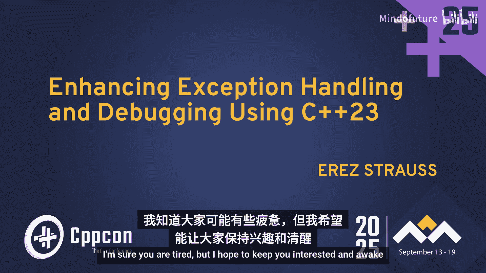
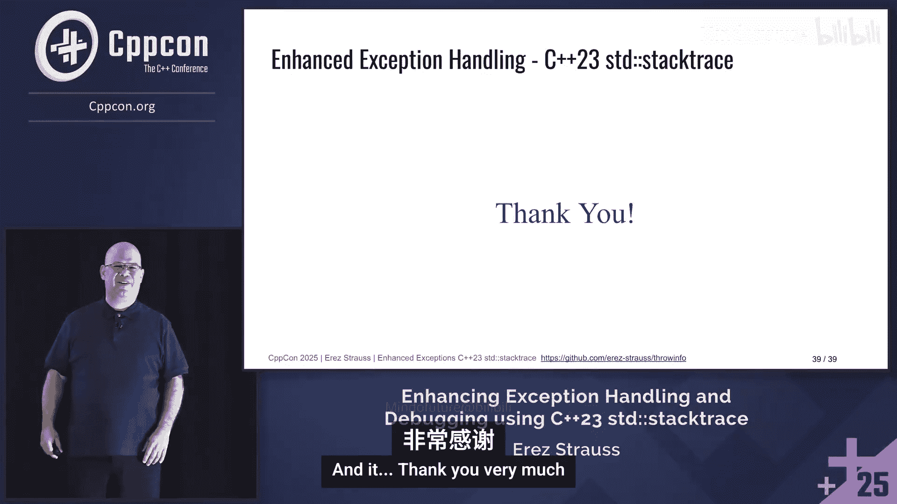

# 074：C++23 std::stacktrace 的隐藏力量




## 概述

在本教程中，我们将学习如何利用 C++23 的 `std::stacktrace` 以及其他技术，在不修改现有代码的情况下，增强 C++ 异常处理的调试能力。我们将探讨如何捕获异常抛出时的调用栈信息，并将其传递到异常捕获点，从而解决“异常从何而来”这一常见调试难题。

## 1：问题引入与目标

上一节我们概述了本课程的目标。本节中，我们来看看开发者在使用异常时遇到的一个典型困境。

当程序抛出异常并进入 `catch` 块时，我们常常不知道这个异常具体是从调用栈的哪个位置抛出的。堆栈已经展开，原始的调用上下文信息丢失了，这使得调试变得困难。

我们的目标是实现一个机制，能够自动捕获异常抛出时的堆栈跟踪信息，并将其提供给 `catch` 块或程序终止处理器，而无需修改现有的 `throw` 和 `catch` 语句。

## 2：C++异常机制回顾

在深入解决方案之前，我们需要回顾一下 C++ 异常处理的基本机制，理解其工作流程中的关键节点。

C++ 使用 `throw` 语句抛出异常。程序必须位于 `try` 块内才能捕获异常，否则程序将终止。

当 `throw` 语句执行时，运行时环境会执行一系列操作。首先，它在堆上动态分配异常对象。然后，它调用一个内部函数（在 Itanium C++ ABI 中称为 `__cxa_throw`）来处理异常传播。

这个内部函数主要做两件事：
1.  搜索与异常类型匹配的 `catch` 块。
2.  如果找到，则展开堆栈（调用各栈帧上对象的析构函数），并开始执行 `catch` 块。

开始执行 `catch` 块时，会调用另一个内部函数 `__cxa_begin_catch`。

## 3：关键C++工具：`std::source_location` 和 `std::stacktrace`

为了实现我们的目标，我们需要利用 C++ 标准库提供的两个重要工具。

首先是 C++20 引入的 `std::source_location`。它用于在编译时捕获代码的源位置信息（文件名、函数名、行号）。它是一个常量表达式，由编译器生成，运行时开销极小。

```cpp
#include <source_location>
#include <iostream>

void log(const std::source_location& loc = std::source_location::current()) {
    std::cout << loc.file_name() << ":" << loc.line() << " in function " << loc.function_name() << std::endl;
}
```

其次是 C++23 引入的 `std::stacktrace`。它表示程序在某一时刻的调用栈。每个栈帧条目类似于 `std::source_location`，但包含的是运行时调用链的信息。我们可以控制其最大大小以避免过深的递归调用消耗过多内存。

```cpp
#include <stacktrace>
#include <iostream>

void print_stacktrace() {
    auto st = std::stacktrace::current();
    for (const auto& entry : st) {
        std::cout << std::to_string(entry) << std::endl; // 输出格式化的栈帧信息
    }
}
```

## 4：核心思路：拦截异常处理内部函数

了解了异常处理流程和可用工具后，我们来看看解决方案的核心思路。

我们计划在异常处理流程的两个关键点注入代码：
1.  在 `__cxa_throw` 被调用时（即 `throw` 语句执行后），捕获当前的堆栈跟踪和其他上下文信息。
2.  在 `__cxa_begin_catch` 被调用时（即 `catch` 块执行前），获取并利用之前保存的上下文信息。

这样，我们就能在不修改业务代码的情况下，将异常抛出点的信息传递到异常处理点。

为了实现拦截，我们需要在动态链接的可执行文件中“钩住”（hook）这些函数。这可以通过 `LD_PRELOAD` 环境变量或确保我们的拦截库在链接时优先加载来实现。其原理是使用 `dlopen` 和 `dlsym` 找到这些函数的原始地址，然后用自己的函数包装它，在执行自定义逻辑（如捕获堆栈）后，再调用原始函数。

## 5：Linux/Itanium ABI 实现详解

本节我们具体看看在遵循 Itanium C++ ABI（GCC、Clang 使用）的 Linux 系统上如何实现。

我们需要处理一个细节：`__cxa_throw` 函数有两个常见签名。较旧的 GCC 版本使用 `void*` 参数，而较新的 Clang 和 GCC 使用更具体的类型指针。我们的拦截代码需要兼容两者。

以下是拦截 `__cxa_throw` 的简化示例：

```cpp
extern “C” {
    // 声明原始函数指针类型
    using cxa_throw_type_new = void(void*, std::type_info*, void(*)(void*));
    using cxa_throw_type_old = void(void*, void*, void(*)(void*));
    // 获取原始函数指针
    cxa_throw_type_new* orig_cxa_throw_new = (cxa_throw_type_new*)dlsym(RTLD_NEXT, “__cxa_throw”);
    cxa_throw_type_old* orig_cxa_throw_old = (cxa_throw_type_old*)dlsym(RTLD_NEXT, “__cxa_throw”);
}

// 我们的拦截函数（以新签名为例）
void __cxa_throw(void* thrown_exception, std::type_info* tinfo, void(*dest)(void*)) {
    // 1. 捕获堆栈跟踪和上下文信息
    auto context = capture_throw_context(std::stacktrace::current(), tinfo);
    // 2. 将信息存储在线程局部变量中，供后续 catch 块使用
    get_thread_local_throw_info() = std::move(context);
    // 3. 调用原始的 __cxa_throw，让异常处理正常进行
    orig_cxa_throw_new(thrown_exception, tinfo, dest);
    // 理论上 __cxa_throw 不会返回，此处用 __builtin_unreachable() 避免编译器警告
    __builtin_unreachable();
}
```

捕获的上下文信息（如堆栈跟踪、时间戳、线程ID）可以存储在一个线程局部变量中。这样，当控制流进入 `catch` 块时，我们可以通过拦截 `__cxa_begin_catch` 来读取并打印这个信息。

此外，我们可以提供运行时控制，例如通过一个线程局部布尔变量来决定是否启用堆栈捕获，以便在性能敏感的循环中临时关闭此功能。

## 6：Windows SEH 实现差异

对于 Windows 平台，异常处理机制不同，它使用结构化异常处理。

在 Windows 上，我们可以通过向异常处理链（`AddVectoredExceptionHandler`）添加一个处理器来达到类似目的。这个处理器会在异常发生时被调用，我们可以在其中捕获堆栈跟踪。

```cpp
#include <windows.h>
#include <eh.h>

LONG WINAPI MyVectoredExceptionHandler(PEXCEPTION_POINTERS ExceptionInfo) {
    if (ExceptionInfo->ExceptionRecord->ExceptionCode == 0xE06D7363) { // C++ 异常代码
        // 捕获堆栈跟踪
        auto stack_trace = capture_stacktrace();
        // 存储到线程局部变量
        get_thread_local_throw_info() = std::move(stack_trace);
    }
    // 返回 EXCEPTION_CONTINUE_SEARCH 让其他处理器继续工作
    return EXCEPTION_CONTINUE_SEARCH;
}

// 在程序初始化时注册处理器
__declspec(allocate(“.CRT$XLC”)) static auto handler = MyVectoredExceptionHandler;
```

需要注意的是，Windows 上拦截 `catch` 块开始的等效机制可能与 Linux 不同，需要进一步研究。

## 7：高级用法与未来展望

我们的基础机制可以实现一些高级调试功能。

例如，我们可以在 `__cxa_throw` 的拦截函数中调用一个用户注册的回调函数。这使得开发者可以实现条件调试逻辑，比如仅在特定条件下触发调试器断点。

我们也可以修改终止处理器（`std::set_terminate`），在程序因未捕获异常而终止前，打印出最后一个异常（或多个线程中的异常）的堆栈跟踪信息。但请注意，在信号处理程序（terminate 可能由此触发）中调用堆栈跟踪函数可能不是完全安全的，需谨慎处理。

展望未来，C++26 可能会引入 `std::stacktrace_from_current_exception`，允许从异常对象本身直接获取堆栈跟踪。这可能在性能上更优，因为它允许异常处理运行时在搜索 `catch` 块时共享已计算出的堆栈信息，避免重复遍历堆栈。

## 8：现有工具与总结

在 `std::stacktrace` 标准化之前，已有一些优秀的库提供了类似功能，例如 `backward-cpp` 和 `cpptrace`。它们使用不同的底层堆栈展开库，并且 `backward-cpp` 能够更好地处理优化后函数被内联的情况。



**总结**

本节课中，我们一起学习了如何增强 C++ 异常处理的调试能力。

我们从一个常见的调试痛点出发：在 `catch` 块中丢失了异常抛出的上下文。通过分析 C++ 异常处理 ABI，我们找到了两个关键的注入点：`__cxa_throw` 和 `__cxa_begin_catch`。


利用动态链接函数拦截技术、C++23 的 `std::stacktrace` 以及线程局部存储，我们构建了一个无需修改现有 `throw`/`catch` 代码的解决方案。该方案能够自动捕获并传递异常抛出点的完整调用栈信息，显著加速调试和错误诊断过程。


我们还简要探讨了 Windows 平台上基于 SEH 的不同实现方式，以及未来 C++ 标准可能带来的改进。最终，我们获得了一个强大且非侵入式的调试辅助工具。