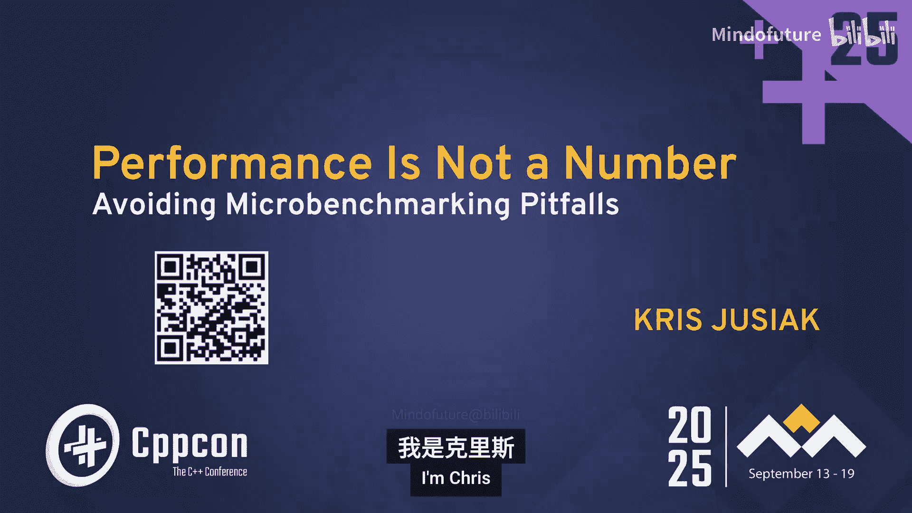
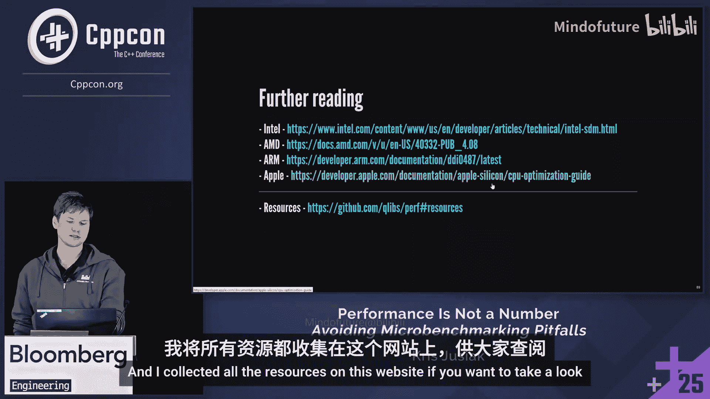

# 075：为何99%的C++微基准测试是谎言——以及如何编写那重要的1%

在本教程中，我们将深入探讨C++性能测量的复杂性。我们将学习如何避免常见的微基准测试陷阱，理解硬件效应如何影响测量结果，并掌握编写可靠、可重现的微基准测试的方法。通过本课程，你将能够区分无效的测量与有价值的洞察，从而真正优化你的代码性能。

## 概述：性能测量的重要性

与提供计算机科学广泛概述的会议相比，CPPCon能够深入探讨语言的复杂性。如果人们对是否参加CPPCon有疑虑，我认为绝对值得参加。参加的最佳理由是能够亲眼目睹并体验C++新进展的发生过程。

大家好，我是Chris。今天我们将讨论性能，尤其是测量，因为在我看来这是最重要的部分。我们将用一个替代方案来解释为什么测量如此重要。

如果没有可靠的测量，后续的优化将非常困难。这在微基准测试领域尤其重要，因为我们必须处理大量噪声。这一切都非常困难，并且在过去几十年里变得更加困难。

每个人都可能熟悉摩尔定律。起初，晶体管总数每两年翻一番。随着晶体管变小，频率变快，CPU延迟因此获得了很大提升。这种情况在2005年左右发生了变化。我们可能达到了频率的极限，除非我们通过散热等方式进一步推动。因此，CPU现在更专注于吞吐量。我们有了更多的核心、更大的缓存和更多的数据并行性等。晶体管数量在增长，但其目的可能有所不同。

所有这些都很重要，因为纳秒现在比以往任何时候都更重要。我们不能仅仅等待CPU和频率在两年内变得更快，因为那将更多地与吞吐量相关，而不是延迟本身。例如，2005年的CPU（如奔腾4，约3GHz）与2025年的AMD Zen 5相比，速度会慢得多。

性能分析非常困难，非常复杂，没有银弹，没有一个库或一个神奇的公式能解决一切。因此，我们分阶段处理。我们有一个可以分析网络TCP等的系统，在设计数据结构和微架构时，最有趣的是硬件效应，这是我们今天将重点关注的。

你可能经常听到“始终测量”的说法，因为如果你无法测量，就无法改进。这有点像“垃圾进，垃圾出”。因此，你必须真正专注于这一点。这就是为什么在我看来，拥有对测量的信任和理解非常重要。你必须能够重现它们。

如果你在系统层面，首先，你可以使用eBPF来追踪C-states、I/O等。这是Linux中可追踪内容及其方法的很好图示。在应用层面，根据你是否需要硬件特定分析，你可以使用VTune、AMD uProf和`perf`等工具。我们将更多地关注`perf`，因为它更通用，允许我们用它做很多事情。顺便说一下，你也可以用GDB做一些分析，通过反向工程和反向调用栈进行反向追踪。你可以制作火焰图等。

但如果你真的想测量某些东西，热点分析并不是一个好主意，我们稍后会解释。你不想测量启动和配置部分。`perf`很棒，但你希望在初始步骤之后引入它。想法是，我们可以在启动后开始，这将是`perf record`。但如果你考虑如何将`perf`与你的C++代码集成，这是一种方法，那将是`perf record`，你将在启动时支付开销。

在这一层面上做这些很重要，因为你不想为了性能测量而重新编译应用程序，那会引入我们稍后讨论的偏差，你实际上不想那样做。X-Ray是这方面的一个很棒的工具，因为它可以以非常低的开销引入启用和禁用分析。它的工作方式是通过在函数的入口和出口添加特定字节数的“桩”（nop），然后进行代码修补，将“桩”改为跳转指令，然后我们就可以进行分析。你可以连接Linux Perf，并拥有一个启用此分析功能的二进制文件，你可以在任何时间点进行配置。这很重要，因为你必须始终在类似生产的环境中验证你的测量。

在另一个平台上，你可以做类似的事情。如果你熟悉Linux上的静态键（static keys），那是类似的想法，它在底层使用`goto`。注意，我们有一个`constexpr bool`变量，当我们将其设置为`true`时，实际上不会产生分支，它会改变底层的代码。你可以启动和停止分析器，将跳转指令修补到你的代码中。这样，你可以对关心的热点进行更准确的分析。在多线程环境中如何做到这一点非常有趣。有很多方法，但有一种非常快的方法需要特定的顺序。如果你感兴趣，可以在会后找我讨论。同样，之后放入跳转指令也很重要，这样你就不会在第一时间错过。

总的来说，如果你想查看这些工具，可以运行这个Docker文件并查看所有工具。但我想指出的是，我们在这里做的热点图像并不意味着加速。你可以整体加速，可以优化某个函数，但你可能不会获得应用程序的整体加速。这取决于你如何处理以及用它做什么。这也是我想表达的观点。同样，没有瓶颈并不意味着你最快。这真的取决于你关心什么。

最后，我想指出`coz`，这是一个用于多线程应用程序的出色分析工具。它的工作原理是消除人为的减速和加速部分，然后测量整体性能及其影响。如果你还没试过，你应该试试。

以上内容我讲得有点快，因为那是非常基础的东西，很容易找到。现在，我们将进入更有趣的部分。

我们将进入微基准测试领域，终于来到我们的微基准测试部分。为什么你想做微基准测试？因为在生产机器上运行迭代速度很慢，版本也很慢。所有这些都使得这个过程很困难，比如角落情况、数据分布覆盖，在生产环境中很难做到。因此，我们想用微基准测试来优化它。

想法是，我们有一段代码，我们只是测量它。我们如何测量以及从中得到什么非常重要。例如，让我们看一个`fizzbuzz`函数，一个简单的函数，我选择它是有原因的，我们稍后会看到。如果你想了解它的性能，我们可以使用基准测试库来测量某些东西。但很难说如果你得到40纳秒，那是否好，或者它实际上意味着什么，以及如果它比其他版本快，条件是否相同。所有这些都取决于背后的复杂性。

性能测量非常困难，基准测试中的噪声比率也必须考虑在内。

## 微基准测试的陷阱

让我们谈谈微基准测试的陷阱。我特意命名了其中几个，还有很多。但这是我认为值得关注的几个。

我们有噪声，这相对容易处理。我们有偏差，这是最难的，将是硬件效应。我们有“信仰”，即我们有了数字就相信它们。我们有“混沌”，即我们如何优化它。还有“错觉”，即我们有了微基准测试，一切都快了几倍或几千倍，然后我们应用到生产中，结果变慢了。我不知道是否有人以前见过这种情况。但为了记录，每个人很快都会看到。

所以，只是一个免责声明，因为现在我们将进入更多细节和更硬核的内容。希望你们中至少有些人会喜欢。

我们将专注于x86，因为微基准测试在架构上确实依赖于架构。但其中一些事情，大多数其他事情是通用的。我们还将专注于Linux，因为在性能方面，这是最容易处理的。

你会看到很多我们稍后会使用的快捷方式。我只是试着给你名字。我们可以用RII跟进，我猜听起来你会适合这里。所以你可以看到像CPU供应商有很多用于性能监控单元的快捷方式，这使我们能够更好地理解我们实际在处理什么。

我想指出，CPU有点像系统语言。你可以使用C++来使它们变快，但你能多容易地调整和验证它真的很重要。例如，英特尔在提供工具方面做得很好，特别是在理解性能方面。我特别要提到英特尔处理器追踪（Intel Processor Trace），我们将在这里广泛使用它，因为它对微基准测试非常棒。这在Apple M4上也可用，但从那个角度来看更难获取。

我们利用这个库。这并不那么重要，但只是为了更容易说明，因为我一直在研究它。我们将使用Linux Perf内核API，即`perf_event_open`。我们将使用IT，即英特尔库来获取英特尔处理器追踪。解码将使用LDM MA，所以所有DMA将在C++中使用。对于绘图，我们将使用`plot`和XL，这允许我们在普通终端以及TTY上绘图。之后你会移动到硬件机器上。

## 噪声

噪声从我们进入`main`函数甚至更早，当我们有全局变量时就开始了。其主要原因在于环境。这是Linux的映射。你可以看到这里有很多移动的部分，不止一个。这不是一件简单的事情。如果你能给它一个数字，请便。但我认为这很困难，这是一件非常复杂的事情。这是偏差的主题。但你可以做一些事情。你关心的噪声将取决于你的设置和应用程序，但一些我们想要避免的常见事情包括，例如，CPU隔离任务，以便将其中一个CPU固定到特定核心，内核不会切换它，这在微基准测试中很重要。我们可以禁用许多功能。你可以使用`tuned`系统，如果你被要求弄清楚你真正想禁用什么，但我鼓励你这样做。当我们有优先级和亲和性时，你必须为减少噪声而设置它们，除非你在生产环境中运行时有噪声，那可能很难优化。但我从在场的Igma那里得到的最酷的想法之一是使用UEFI。这是一种你可以完全避免噪声的方法。所以如果你真的关心纳秒或周期，你可以获取并完全避开内核，进入UEFI ring 0，所有特权都是你的。你也可以禁用CPU功能，我鼓励你在有生之年做这个实验，以欣赏2025年的CPU比2005年的好多少，如果你禁用缓存或分支预测，并运行一些代码，你肯定会看到并更欣赏它。但如果你关心它，这是一个非常棒的工具，可以深入到非常低的层次。

另一件我认为在开始微基准测试时非常重要的事情（我们稍后会进入更困难的内容）是拥有标准项目。我们想知道，例如，我们在哪里运行，如何运行，并检查我们是否优化了，不要分析调试构建，你不会从中获得太多性能。我想在这里指出的一件事是，我建议记录CPUID，这样我们就可以有这个系列、型号和步进信息，这使你有能力快速在线记录它。除非你在特定的硬件上运行，否则你会得到所有信息，你可以打印出来。

顺便说一下，既然我们在这里使用模块，因为它是C++20及以上。我发现模块非常有趣的一点是，你可以在模块中拥有编译时测试，你可以暴露或不暴露它们，比如你的静态断言和编译时检查。然后，当你通过模块编译时，它将被编译一次，你所有的编译时测试都已经在那里了。所以我认为当你暴露一个库时，这样做非常重要，因为否则，你将处理人们不运行测试的情况。这将进行验证。在这个特定情况下，这非常重要，因为它与你的CPU、硬件和编译器特定相关。

但在我们开始处理噪声和微基准测试之前，另一件要做的事情是进行一些运行时检查。让我们做自检。在左边，你会看到如果机器没有很好地调整，意味着我们没有进行某种噪声减少，我们将得到噪声验证。如果我们不关心那个噪声，因为它不是我们实验的一部分，那将比应有的更多地影响基准测试。你知道，我们的结论将是有噪声的。在右边，你会看到如果你更好地优化它，你最终会有更好的结果。但我们也可以做的是，既然我们有LLVM和其他东西，我们可以验证测量值与文档记录的内容。这将是一个星型曲线的例子，验证基本指令延迟（在这种情况下）与LLVM用于优化的调度模型提供的MCA值具有相同的值。所以你可以想象，不仅`div`真的很慢，而且你知道为什么。嗯，不是为什么，而是它确实慢。所以避免它，但你会看到它匹配，意味着我们的框架是为性能调整的，如果你想，你可以在欧洲表格和Agner Fog指令表中跟踪这些数字。

另外，我想指出，如果你在周期级别进行微基准测试，有一些工具可以利用，比如LLVM有一个用于延迟测量的工具，它们验证LLVM中拥有的调度模型是否与平台的现实匹配，等等。

所以，好吧，这只是噪声，噪声相对容易处理。让我们谈谈一些更困难的事情，实际上是偏差。

## 偏差

这里会有很多事情，但目标是拥有可重现的结果，然后我们可以将其应用到生产代码中，并获得实际可靠的结果，意味着它们与我们的边缘情况相关。如果你还没有读过这些论文，我只是在这里链接它们。它们真的很棒，尤其是第一个“生产我们的数据”。它展示了Linux中的一个环境变量如何改变堆栈的对齐方式，并且他们测量到应用程序有30%到300%的减速。所以，但那是当时的错误，现在好一点了，但问题仍然存在，我们必须面对它，因为你不希望在你以完整模式与精简模式运行时测量结果不同，这没有意义。

为什么所有这些都如此复杂？你可能见过Linux。嗯，你见过它。你来过这里，Linux地图。这里也有CPU类型的图表，实际上在底层甚至更复杂。这就是我们运行指令的地方，我们甚至不在CPU上运行指令，我们运行微操作。但所有这些都指出了底层发生的复杂性。所有这些在过去要容易得多。现在要困难得多。我们不能再忽视它了。

关于测量的一些话。它们不是独立的，也不是正态分布的。很难达到正态分布来进行统计。所以我们必须进行很多次运行，我建议你这样做，以便你有样本和迭代，如果你必须更接近测量值，以便你可以对其做一些统计，因为如果你取平均值，而你没有正态分布，那对你来说不会很有价值。我们想回答，这个东西是更快还是更慢某个百分比，并给出一定的置信度。有不同的时钟可以使用，我们将使用时间戳计数器，因为它是允许我们测量较低部分的东西，周期，但经常使用的是来自静态内核的高分辨率时钟，这是最糟糕的想法。因为首先，它试图被弃用。其次，它是一个系统时钟或稳定时钟。稳定时钟没问题，但系统时钟不行。你可能会得到，它就像一个日历时钟。所以它可能允许改变日期，因此你可能会在那里得到负数。所以不要这样做。

让我们看看我们通常没有的正态分布。大多数微基准测试会有偏态分布或双峰分布或任何分布，但很难达到正态分布。总的来说，如果你绘图，我总是建议你这样做。如果你没有正态分布，采取一些其他统计量，然后你可以总体上推理，如果你不能，就不要取平均值。最小值在这里不会给出太多价值。

我刚才指出了噪声，现在我在谈论偏差，这是最重要的，因为硬件效应，我们将在第二部分看看，尽管那只是具体情况。但如果你看到像这里的条形图，而你没有看到这些误差条，我们选择了可变性，这很难。这意味着它可能是一次测量或者是平均值之类的，然后很难推理它是更快还是更慢。因为，你知道，第一个有时可能更慢，有时可能更快。所以如果你真的关心，你必须展示所有这些，而不是仅仅假设它会更好或更差。

## 延迟与吞吐量

让我们谈谈延迟与吞吐量。大多数基准测试只会做吞吐量，我们稍后会讨论为什么。但有两种不同的测量和两种不同的指标。延迟是单个操作完成所需的时间，而吞吐量是在给定时间量（通常是一秒）内完成的操作总数。所以，当你实际测量时，区分这两者非常重要。因为当你做延迟测量时，你可以通过开始、调用函数、停止来完成。但你通常不会从中得到很高的分辨率。所以在某些情况下有价值，不是所有情况。如果你做一个循环，你实际上必须在运行之间引入数据依赖性以获得顺序性。因为，你知道，否则，有时我们还需要内存栅栏，如果你有写入以获得这种顺序性，我们必须在之后减去开销。但延迟测量非常简单。另一方面，吞吐量就像，如果你有一个循环，这里这个问号发生了什么，是CPU不等我们的事实。因为我们在循环上有一个闭合括号。我会等待。不，CPU会超过你。这有点像性能的关键。性能不是在当前时间获得的，它是在未来获得的。如果CPU在遥远的未来，你就快。否则，你可能不会。所以吞吐量，你知道，你有不同的策略来测量吞吐量，比如这里有顺序策略，当你只有一个循环时，但你也可以进入不同的方法。我还建议你阅读用于nano bench的低开销工具论文。可能不是你听说过的nano bench，而是欧洲稳定版使用的nano bench，他们展示了他们如何通过展开两倍然后只展开一次并以非常有趣的速率减去来测量延迟。如果你对此感兴趣的话。

那么，延迟本身作为一个指标也与吞吐量测量不同，对吧？所以延迟将是每次操作的时间，这是时间。吞吐量将是每秒操作数。你可以通过每秒千兆字节获得吞吐量。你可以获得逆吞吐量，这也是吞吐量的测量，但魔力在于逆吞吐量，在这种情况下与延迟相同，但来自不同的测量。这有区别。

我只是喜欢这张图片。所以我把它放上来展示延迟和吞吐量之间的区别。如果你更关注延迟，你知道，你通常会转向FPGA或ASIC之类的东西。对于吞吐量，通常会转向GPU。而介于两者之间的CPU，是我们今天将重点关注的，但我只是重新点亮了这张图片。

## 硬件效应

现在，我们将专注于微基准测试和一般代码的硬件效应，这会影响每个人。如果你不考虑这一点，它会影响你，你会错过。例如，未使用的函数可能会因为代码布局而极大地改变你的性能。它甚至没有被使用。它只是一个函数在那里。你把它编译进去，那会改变你的性能特征。它会改变代码布局。你可能在缓存分支上，其中一些。堆栈，它将如何对齐，会改变你的性能。内存访问，显然，分支预测，最重要的。数据布局，所有这些都会改变微基准测试的性能特征。所以如果你有一个微基准测试，而你只是采用了默认的无论什么，很难将其应用到你的生产代码中。这就像一个不同的实验室，不同的事情，效果并不好。

这也不意味着你应该删除那段代码，因为死代码可能让你更快，确实如此。

让我们谈谈像分支预测和缓存，这是最重要的，我们将稍微关注一下。

现代分支预测可以学习像1000、10000个分支之类的东西，我想这是在苹果上。对于直接记录，像静态分支预测器，如果你没有历史记录，向后的分支将被采用，向前的将不被采用。所以这是为了循环。但，你知道，以防有人想知道它是如何工作的。所以这个东西非常复杂。我真的建议你观看一些硬件讲座，了解它在底层是如何工作的。我之后有一些资源。

但这里重要的是，我们有我们的循环，我们会测量相同的参数。嗯，分支预测比我们聪明得多。我们将有10000个元素的历史记录，无论什么。PIP，是指令指针，以及全局的等等很多东西。所以我们必须改变这一点。我们必须有一种输入分布。

让我们看看，那将只是具体情况。所以如果我们弯曲，例如，这个`fizzbuzz`。我们暂停。编译它。我们有一个`auto`参数，它将被对齐，或者你可能熟悉像`optimized`这样的词，这是错误的词。但无论如何，那将是一种不同的行为，你应该传递三个或常量，完全不同。如果你试图处理分支预测，分支预测器。但通过给定像序列范围或不可预测的，这就像均匀分布或具有概率意义的选择。而且，记住如果你有堆，像`malloc`，所有这些都非常聪明，你必须污染堆，当你推入那些东西时，以避免不现实的场景。

如果你运行它，我们会得到很多数字。呃，这很难看。所以让我们移到图表。这就是为什么，你知道，你想绘图，因为绘图更容易推理。

所以你可以在这里说误差很小，意味着我们能够在没有噪声的情况下在一定程度上重现它。

条形图将向我们展示。你知道，越低越好。但这里有点重要的是，范围，即右边的第三个绿色条，是如果你有循环迭代，你只是将迭代的`i`放入你的基准测试中，这经常做。所以我们做循环，我们将迭代传递给循环。你知道，我们改变参数。我们改变数据。很好。如果我们的代码中有分支，那将被预测。很可能，我在这里放了一百万。

所以你可以看到配置文件中的差异。也有点有趣的是，均匀分布，这在现实世界中很难出现，但要慢得多，但更慢的是如果你有不可预测的最坏情况，通常，因为我们必须开发更多。所以，有些事情要。就像，如果有的话，我只是为微基准测试做这个，因为那会改变结果。非常多。

## 数据分布与可视化

当我们进行微基准测试时，我们想要关注的另一件事是显示像直方图这样的东西，这样我们可以看到数据分布，因为它会是偏斜的，那会给我们更好的理解，使用什么统计量。有不同的，像箱线图。我们可以显示我们的异常值。以及集中趋势和可变性的趋势。

但我想展示最重要的且不经常使用的经验累积分布函数。因为它显示了一切。没有移动，没有像那样的桶。所有点都对结果有贡献。所以你可以轻松比较所有测量值。你不得不做的所有样本，看看它如何影响性能，所以真的鼓励使用这些，它们显示累积数据比例。

顺便说一下，如果你。因为所有这些都是在终端上。所以那不是UI或任何东西。那是终端和终端模拟器。如果你感兴趣，XL，它被所有终端支持。像Windows、Mac只是一种你打印的格式。当控制台终端将显示一个像素和tellaada。所以这很酷。但通常当你，你知道，移动到你的生产机器和类似的东西时，你想使用像TTI这样的东西，你也可以这样做。那是相同的图表。只是看起来不同。而且，如果你熟悉Jupyter笔记本，那也是进行分析的好选择。

## 代码布局

让我们看看第二个。这是代码布局。

我指出代码布局将影响一切的性能。所以你编译，你改变任何东西，我之前说过，如果你改变分析并最终编译，那会改变你的分析结果。我的性能，对吧。所以要注意这一点。

所以，我们可以从应用层面做的事情，我们可以启用地址空间布局随机化。但那是每次运行固定的。这是一个安全功能。但我们可以利用堆将被随机化的事实。代码本身也将被随机化。并且有像Clang和Mold支持布局随机化，我们可以打乱函数顺序。看看那如何影响它。那将是随机的。所以你必须重新编译，重新编译，并多次进行。有最好，不是维护的动物，但一个很棒的工具稳定器，它使用LLVM在底层在运行时随机化这些东西，每秒钟一次。

所以那也很酷。然而，你知道，你必须尝试很多长时间运行的事情来获得正态分布的结果，以及它如何影响分支和其他事情，也很困难。

所以我们可以从基准测试的角度来做。我们有这个函数1。我们可以做，你，不同的基准测试。我们在上面放一些具体的东西。我们可以做不同的值分布。所以，例如，你可以对齐循环，因为如果你不对齐。基本块。嗯，编译器会为你选择对齐方式，这可能不是你想要的。它会在不同的上下文中选择，比如你的应用上下文。你知道，函数边界。这也取决于你的循环有多大，是否会影响堆栈大小、堆栈对齐、函数对齐。函数对齐是16字节。但设计，例如，其他编译器不是。而且你也必须在新的进程中运行，以稍微领先于自己。

所以你必须这样做。然后我们将进入缓存。那甚至更难做。

我不鼓励你像查看你的硬件是什么。所以`lscpu`就像在Linux上，你可以看到，你知道，L3在大多数情况下是共享的。所以以及你有多少个NUMA节点等等。但那允许你。然后，例如，如果你有L3在不同核心之间共享，你可以，你知道，从不同的核心破坏它。你知道，你使用虚假共享来基准测试。你应该读一下，顺便说一下，这里描述的论文，如果你还没有。

但我一直在实验并且对我来说效果很好的，我们稍后会讨论如何做。所以我一直在做类似这样的事情。运行。已经分布了，你知道，正如我们指出的，分支预测等等。收集执行的指令、地址、基于指令指针的指令。然后我们做我们的循环，我们实际上设置分支预测。并根据我们的分析结果刷新缓存。所以我们有结果。我们知道有一个查找表，那是地址。当我们有想要测量的分布时，我们想测量它是否是10%满，50%，70%，以及相同的分支预测，因为很难获取所有分支。从外部。所以你必须从底层开始。这很困难，而且真的很hacky。但它有效。如果你有L3，你可以从不同的核心来做。所以了解你的硬件。当你必须时。你不能在这里做循环。你有时可能会变得烦人，因为如果你做循环。你知道，缓存和分支预测学习得非常快，你可能会失去你可能的所有设置。你必须使用像快速的东西来想象周期。

所有这些，我不想吓唬你，还有很多，你可以更高或更低，你可以进入像执行端口，那也会影响，例如，将选择哪个ALU，比如如果你有围绕它的代码并且它已经被使用，在微基准测试中，那将是不同的结果。所以这里有很多事情必须考虑，以便实际上以一定的概率将结果映射到代码。这正在发生。这并不容易。没有银弹。需要很多工作。但当你做对时，会有很多满足感。

## 信仰与验证

“信仰”是我们现在要看的东西，意思是，你知道，你有了计时，我们做了偏差，我们做了噪声。现在我们有了计时。我们自我感觉良好，因为这个更快，那个更慢。我们去发布它。嗯，现在就像不理解为什么，它并不是真的那么有价值，因为你无论如何都会错过一些偏差。所以我们必须经历这些。很多这些工具，因为Matt在这里，所以你可以在那个Godbolt Compiler Explorer上查看。但我想指出，你知道，有时当你做基准测试时，你只分析这一个基准测试，对吧。那会影响结果吗？那会有偏差吗？有人会问。是的，它会。它可能会改变你的结果。所以那将涉及，例如，环境变量和堆栈对齐和大小。所以要注意这一点。所以我们可以做的是，我们必须做一些分析。为此，我们有能力进行分析。我们可以计数。在简单的C++中，我们想计数周期。所以这里将是。如果我们想要周期、指令和时间戳计数器，我们将使用CPU提供的指令来完成。所以R PMU和RTC是我们想要使用的东西。为了无周期地拥有更好的测量。

为了进入周期世界。我们也可以进行采样。我们必须有一些硬件支持。那将给我们每个指令指针的结果。然后我们可以更多地推理它，通过我稍后将展示的分析。

但你必须真正意识到，有时你必须进行很多测量，尤其是当你进行分析时，因为存在多路复用，因为只有8个硬件计数器可以在CPU中使用。追踪，我最喜欢的微基准测试。我们只是，你知道，我们只是记录被执行的指令。然后推理。

所以这也是你可以获得周期的东西。周期的准确性将取决于你的硬件，但你想尽可能接近它。

然后我们有了分析器，我们做开始停止在这里，像不是这个防止所有。是一样的。像，在我看来，命名的正确方式，不要优化，这很令人困惑，因为很多人在西班牙认为它是防止优化。现在，它是防止消除编译。所以我们记录。我们得到一些很酷的数字。很好。嗯，现在，我们必须更进一步。那是我们去MCA的地方，例如，当我们必须反汇编那些东西时。

那是我们可以利用LLVM提供的东西。所以在这里，我在一开始指出了调度模型，你可以在LLVM项目中找到它，并查看他们验证的所有这些数字，它们对你的设置是否正确。

这里我们必须引入，因为我们在简单的C++中，我们没有函数的大小。我们必须做一些魔术。我们可以做标签。我把它放出来。作为和转到。我们将再次利用它，因为它防止重新排序，我们可以获取代码的标签。它不发出指令。它有时禁止一些优化，但不发出指令。所以代码在底层是相同的。对于MCA，我们不必运行它。你可以只取指针。并获取区域。那可能很小，但这不是重点。重点是我们可以根据此进行大量分析。所以这里我们将专注于注释，即指令指针。所以我们可以做什么。呃，你知道，有时。有些人可能认为，更少的汇编指令更好。那并不意味着什么，汇编指令有不同的延迟。它们执行不同数量的微操作。它们有不同的吞吐量，所有这些我们都可以从你的机器的MCA中获得，如果你有一个好的调度模型，你可以验证。而且，也许不那么重要，但我喜欢指出，像ci bear risk。像，这不是关于指令数量，因为它们都有大量的指令。更多的是关于编码部分，而co arm将拥有你静态的一个，x86有。可变长度。两者都不意味着它更快或更慢。只是不同。

我们可以看到资源压力，所以，例如。编译器上有很多执行端口，你可以在这个图中看到。还有很多Ls。你想看看哪些部分被分配和使用在你的代码中，以理解为什么。

你可以做更多的事情。例如，你有像`cant`这样的代码，你可以做这个吞吐量模拟，你有这个代码的汇编，你循环多次。你会看到时间。我们真的想避免相等。你可以阅读MCA时间线。那就像每个周期，你的CPU是如何执行的。我想指出的一件事是这个汇编，你可以很容易地从Compiler Explorer中获得。和追踪，你目前不能，因为你必须用特定的值围绕你的代码运行。

所以这里将是开始结束区域。我们将有fi指令和一些时间线。在右边，我们有追踪，根据这个函数的输入参数，将有不同的结果和不同的指令被执行。这里非常酷的是，我们可以，你知道，抓取已执行的代码，通过管道传输到时间线，并查看在CPU上如何，你知道，基于MCA cadjoi模型搜索完整性。那给你很多更好的理解，为什么以及如何在低层次上发生事情。

然后我们将其应用到我们的基准测试中。对于这种情况下的延迟。如果我们做区域，我们会看到。像，我们运行了`fizzbuzz`，参数为15、5和不可预测，这意味着我们随机化输入。如果你获取汇编，那将是相同的。但如果你获取追踪，即已执行的指令，这里讲述的是不同的故事。所以15，因为如果你看`fizzbuzz`，那是第一部分，我们可以不关心其余部分，因为我们返回。所以这是不同的，对吧？也很酷的是，我们可以比较时间线。你应该看看那个。很长时间，你会从那样的图表中看到很多，我鼓励。你可以做很多其他事情。比如你可以看到加载来自哪里以及分支预测。所以。像15没有错过任何东西，像感觉15，和一样。这是基于频率的。而且，5没有错过任何东西，对吧。而不可预测的会错过。因为我们处理分支预测。你可以做流程图，流程图也可以看，但火焰图。你可以使用LBR来获取它们。然后你知道，关于火焰图的一件重要事情是它们没有时间，只是出现次数。所以要注意这一点。

## 混沌与优化

现在我们必须经历混沌。这是重要的部分，当你，你知道，我们做了计时，我们有了计时，当我们做了分析时，所以我们更有信心知道为什么。但你知道，我们如何，我们如何优化所有这些事情。像，你知道，随机游走会使我们陷入局部最小值和想法，以及2年的经验知道该做什么。现代CPU通常受限于，你知道，如果你提供所有指令，那会很好，但可能不可能。所以我们可以做的是，我们可以减少总体指令数。增加每周期指令数或每周期微操作数。而且。此外，我们可以应用自上而下的微架构分析，我们不必思考它，那可能意味着我们不必提出假设。但如果，我会改变那个，以及那如何，你知道，这是随机的。这不会经常引导你到正确的位置。我的，但你永远不会知道。而且这就像如果你试图优化每周期指令数，比如每周期微操作数，尤其是你知道何时停止，因为你永远不会超过调度模型中的调度端口，对于其他常规是6，如果你有每周期微操作数最大为6。不会比那更快。

让我们看看自上而下的微架构分析。所以我们必须有一个目标。所以这是来自英特尔，英特尔说。基于你是什么类型的应用程序，那是你瞄准的大致数字。你可以，显然，说。自己设计。但想法是，我们在这个图中覆盖整个CPU，并围绕它进行分析。所以首先，有像第一级，我们是否正在退休指令，或者我们有未命中，或者我们是前端或后端受限。我们这样做。然后我们做第二轮。所以，例如，我们有后端受限。我们看到它要么是核心受限，要么是内存受限，我们有，你知道，计数。然后我们更深入。假设我们是内存受限。并且是L2受限。所以我们知道要优化什么，以及什么会对优化产生影响。但所有这些都没有意义，如果你想给你结果，如果你有偏差或噪声。

所以你必须拥有所有这些，以便最终实际重现结果。

所以这就是我们可以做到的方式。不那么重要。但我们在这里可以看到，只是指出，如果你有这个序列或可预测性很好的东西，嗯，我们不会是。我的分支预测受限，这很糟糕，因为我们是，但那不会显示出来。所以你可以使用这种分析方法，它是结构化的，给你的工作带来理智。但你必须首先消除偏差和噪声。然后如果你有了那个，就很容易。像所有这些都是有文档记录的。如果你有退休，你可以做什么，应用什么，然后你可以学习一个不会种子。如果你有错误推测，我可以，你知道，观看feed讲座，并像无分支，或者如果你前端受限，你可以，你知道，去TNP，无论什么。你明白了。

## 验证与测试

所以，最后。我们完成了所有这些。所以我们有了分析，我们喜欢。我们减少了噪声。我们得到了计时。我们理解了为什么我们从混沌的角度正确地做了它。所以我们有了理解。然后。我们还必须应用措施，以确保它将进入生产。所以，例如。我们必须非常像，如果你运行得快，就没有意义。所以例如，如果你在这种情况下开始。你想指定验证所有那些。在你排序之后被排序，对吧，那在基准测试之外很难做到，因为你不再有这个目标了。所以我们可以在像一些基准测试QA、PA中做到。但问题是你不会影响基准测试。所以你会得到那个。

我最喜欢所有这些的是测试。如果你有所有这些工具，我们实际上可以应用，你知道，测试，这将给我们关于我们可能关心的事情的答案，所以我们可以反汇编。我们可以追踪，我们可以分析，我们将利用我们在这里展示的工具。不那么重要如何。你可以在会后问我。所以，例如。你可以测试一个`fizzbuzz`函数的反汇编，它有19条指令。以及这些指令是什么，如果你真的关心某些东西是相同的。你可以这样做。这不是理想的方式，压力测试事情，但有时，尤其是如果你有带vs的东西或类似的东西，你可能想验证事情的顺序，它实际上以你想要的方式发生。你可以追踪并打开它。这与这个汇编不同。所以如果你依赖获取`fizz`，参数为15，我们将得到7条指令。所以我们可以验证这一点，并验证一切是否合理。最终，只是测试它。我最喜欢的是，如果我们有一个函数。和另一个函数。我们验证了C++给了我们优化的方式，所以我们可以比较反汇编。或者我们可以为特定参数编译追踪。在这种情况下，这里有UB，那将被优化为基本上返回`true`。但当你能够，你，你可以，你可以想象你能做什么。那有很多潜力去理解和确保，在未来，它将是你假设的那样。如果不是，嗯，它会失败，知道这一点也很重要。

我最喜欢的是分析。所以正如我指出的，我们有这个时间线，所以我们可以，你知道，运行，那将来自那里。这里有很多方面。所以我们运行了`fizzbuzz`，参数为Red 15。我们记录了这个模拟运行的指令。将有7条指令。然后我们可以验证每个周期，在低层次上，事情是如何被调度的。我发现这非常有用和酷。然后，所有这些中最重要的部分是，所以我们做了所有这些工作。我们试图减少噪声偏差，我们的测量，从统计上来说。我们用它运行分析，这不会再次改变偏差。我们的基准测试点更慢，但应用程序更快。我们做什么。在这种情况下我们做什么，发布它。它更快，对吧。嗯，不，我们有，意味着我们做错了什么。我们，相关性非常重要。这就是为什么，你知道，这辆F1赛车对应于风洞，你知道，如果你没有风洞和赛道之间的相关性。嗯，你，你的优化之后没有意义。如果你在微基准测试上没有相关性，对那个特定原因来说没有那么多价值。如果你关心将它们应用到未来的优化。所以你做什么，你回去。验证为什么，可能是噪声。可能是偏差。有很多你可能看不到的偏差。当你试图关联它时，如果它关联。然后你应用它。

## 总结

因为时间不多了。总是测量，但你知道，仅仅测量，你知道，循环并除以迭代次数，可能不会让你被解雇。但没什么，但也许不会。

我们想避免微基准测试的陷阱。所以有噪声。所以我们想调整它。有偏差。必须有建模，如何或如何接近它。CPU如此复杂，操作系统也是如此，这很困难。这不是一个容易的任务。

在那之后我们必须有信仰，我们测量的东西有意义以及为什么。因为如果你测量某些东西，而它不。你不理解为什么。像，它没有价值。

理想情况下，我们避免这种混沌。我会优化那个。我会优化那个。让我们只是学习硬件，以结构化的方式接近它。并进行。然后验证，像其中最重要的部分。你完成了所有这些。我们最终验证。然后它关联，它改进了，你知道，生产中的性能。我们有了框架，我们可以处理，快速实验。快进它。所有这些都很棒。

## 进一步阅读

正如我指出的，有些人更关心另一个秒，当其他人，HFT通常是Kmar。在这里，我只是想列出进一步阅读，因为我只是触及了表面。还有很多。我只是指出了我认为最重要的最常见的几件事，但还有更多。所以我真的鼓励你阅读手册，一整天。但如果你写阅读C++标准。没有太大不同。那更好读。

我收集了这个网站上的所有资源。如果你想看看。

就这样，谢谢，如果。

## 课程总结

在本节课中，我们一起学习了C++性能测量的核心挑战与最佳实践。我们探讨了微基准测试中常见的噪声、偏差、硬件效应等陷阱，并学习了如何通过控制环境、理解延迟与吞吐量的区别、分析代码布局与缓存行为来编写可靠的基准测试。我们还介绍了使用`perf`、处理器追踪、MCA分析等工具进行深入性能剖析的方法。最重要的是，我们认识到测量本身必须可重现、可理解，并且最终要与生产环境的性能提升相关联。记住，没有单一的银弹，性能优化是一个需要严谨方法、持续验证和深入理解的系统工程。