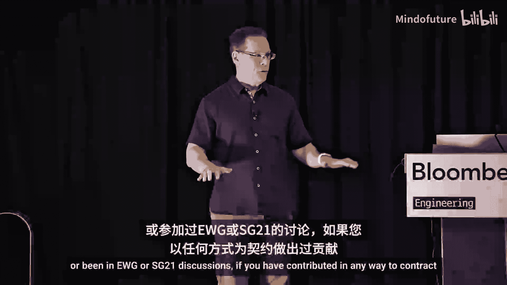
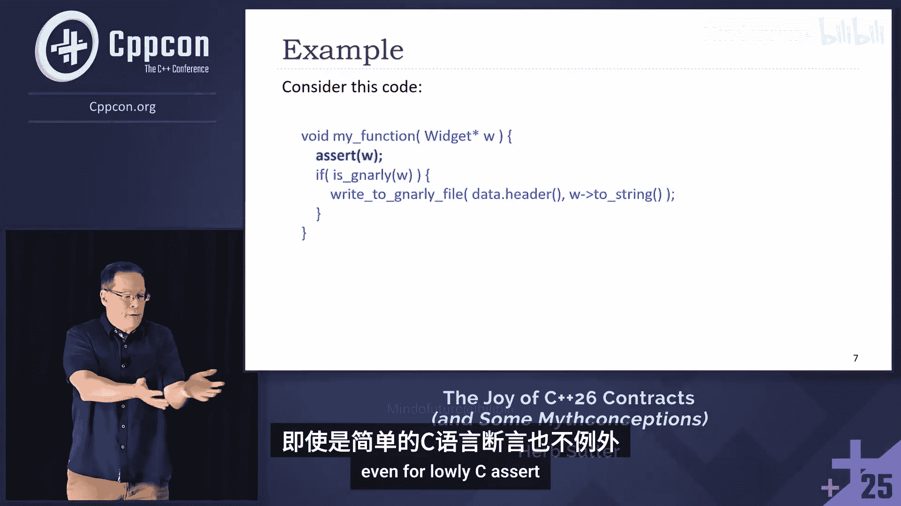
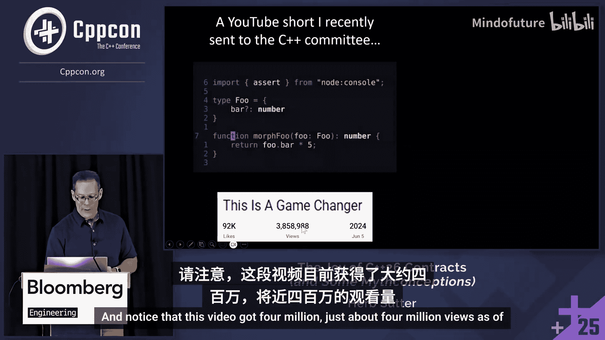
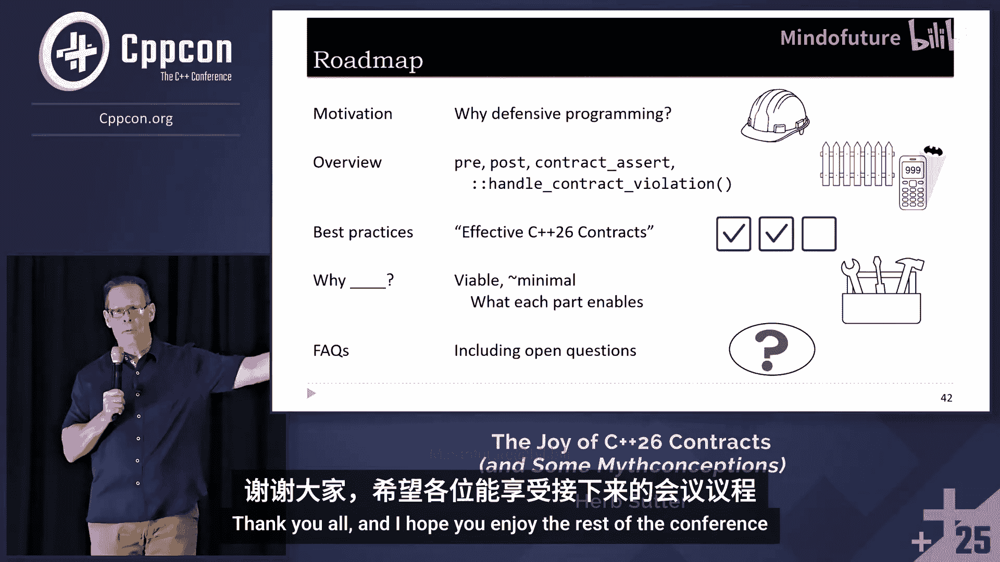

# 076：C++26 契约的乐趣——神话、误解与防御性编程

在本节课中，我们将学习 C++26 中引入的契约功能。我们将探讨其动机、核心设计、最佳实践以及一些常见问题与开放性问题。契约旨在帮助开发者更清晰地表达代码意图，并在开发早期捕获程序错误，是防御性编程的重要工具。

## 概述

许多有趣的讨论发生在走廊里。当你离开一个会议后，你们刚刚共同经历了一次集体体验，因此会引发一场走廊对话，讨论会议材料。

欢迎来到这个我直到一周前才决定要做的演讲。实际上，我从未做过关于契约的演讲。我只是在几张幻灯片中提到过它。我算是后来者。这个房间里有很多人比我更了解契约。我会尽力而为，如有错误，责任在我。同时，我也想感谢所有为契约功能做出贡献的人。这项工作从 C++20 之前就开始了。如果你曾撰写过论文、写过一行实现代码、参与过邮件列表讨论，或参加过 EWG 或 SG21 的讨论，如果你以任何方式为契约功能做出过贡献，请现在起立。让我们为他们鼓掌。这只是众多辛勤工作者的一个子集。

当前的状态是，契约功能已进入 C++26 草案。委员会专家在二月份就此达成了共识。但仍存在一些问题。在 C++26 最终定稿之前，我们还有两次技术完善会议。我们将在十一月的下一次会议上再次讨论契约，包括是修复它还是推迟它。目前草案中的内容就是我将要描述的。但所有关切将继续得到充分听取。我只是想准确地反映当前状态。本次演讲总结了我的最佳理解，但我可能出错，而且经常出错。出错是好事，只要你乐于接受错误。因此，你也应将这里的所有答案视为临时的，取决于未来可能发生的变化。但让我描述一下我从与有关切的人以及为此功能辛勤工作的人交谈中所了解的情况。

我将首先让自己成为一个靶子。因为很多人对契约感兴趣，但有两个群体对此有非常强烈的意见。许多专家坚信 C++26 契约功能非常出色且已准备就绪，而另一些人则认为它们尚未准备好，不应现在发布。你们中有多少人认为我可以用两句话同时冒犯这两个群体？来吧，多一点信心。C++26 契约存在开放性问题，且尚未获得广泛的部署经验。这已经冒犯了一些人。我们很可能无法获得比 C++26 契约更出色的设计，除非寄希望于神奇的链接器改进。我现在又冒犯了另一些人。让我们开始吧。

我们将讨论动机。为什么几乎每个人都同意某种形式的契约是个好主意？然后我们将讨论当前的设计、我们正在开始学习和探索的最佳实践、一些设计原理以及一些常见问题。但让我们从安全性开始。是的，契约是关于安全性的，但它们不是关于类型和内存安全性的。幻灯片底部，类型和内存安全性是关于语言可以提供的保证，例如每个空指针解引用都会被捕获。如果我们有这样的规则，那就是语言保证某类内存安全错误不会发生。你不需要编写特殊代码。这只是你获得的保证，这包括静态分析工具的保证，如果你的代码未通过静态分析，则无法签入。因此，构建时规则提供保证。这是幻灯片的底部。

契约在幻灯片的顶部。它们是关于功能安全性的。它们不直接关乎“我是否发生了缓冲区溢出”。它们关乎“我的系统是否满足其要求”、“我的汽车是否在应该加速时加速，尤其是在应该停止时停止”、“我的医疗设备（如起搏器）是否正常工作”、“它是否保持节律”、“它是否及时响应实时消息”等我们想用断言来检查的事情。在那里，我们基本上有一个可以调节的旋钮，因为我们编写的断言越多，代码的覆盖率就越高，但这并不是一个保证。这是一个需要付出更多努力才能获得更多成果的机制，无论是你编写的断言还是库中的断言。因此，功能安全性与内存安全性不同。

重叠之处可能在于，如果未来我们继续保留 C++26 契约，并且我们将来制定语言保证（就像我们为强化标准库所做的那样），这些保证是用契约检查来表达的。因此，如果空指针解引用是一个契约检查，即 `contract_assert(not null)`，那么这里就有重叠。但你获得内存安全性并不是因为它是契约，这是一个实现细节。这是因为语言功能恰好使用了契约功能。这是一种使用关系。所以，只是为了区分这两者。在本演讲的其余部分，我不会讨论安全性，这只是为了划清界限。

## 动机：为什么需要防御性编程？

假设你在进行代码审查。你看到这个函数。有什么可以改进的？你会提出什么评论？大声说出来。使用引用。好的，假设你打算使用指针。关于函数体我们还能说什么？检查空指针。谢谢 Oleg。是的，你会注意到这里有一个对指针的无条件解引用。因此，你可以立即洞察这段代码作者的想法。你知道，两种情况之一是真的：要么作者知道这一点，并且他们认为所有可能流向此函数的代码路径在结构上永远不可能是空指针，所以他们不检查；要么他们忘记了。我们都经历过这两种情况，对吧？阅读这段代码时，你怎么知道？你不知道。但如果你多写一行代码，现在你就知道了。你表达了你的意图。如果你看过我的任何一次演讲，你会厌倦我说我们希望人们直接表达他们的意图。现在，不仅将来阅读代码的人（可能是一年后的我们自己）能理解所做的假设，而且工具也能为我们检查它，即使是简单的 `cassert`。

我们很久以前就有这个建议了。当 Andre 和我合著《C++ 编码标准》一书时，我们进行了大量合作。我们各自编写了不同的条款，然后一起编辑。Andre 写了这一条。Andre，你在房间里吗？如果在，请挥挥手。哦，是的，他在那里。好的，Andre。谢谢你写了这个，因为在你告诉我之前，我就知道 `cassert` 了，我从 80 年代就知道了，对吧？我们学到的一件事是，我并没有意识到系统地使用它有多么重要，因为没有人教过我，我也从未在一个有这种文化的团队工作过。我们都会有盲点。

我强调了几点：断言必须始终为真，否则就是编程错误。所以它是关于程序错误的。永远不要在表达式中写入有副作用的代码。我们稍后会讨论这一点。但让我读一下底部的引用。我想让你看看这本书多么有用，因为我相当确定这段文字是 Andre 写的，因为它带有一种教授式的口吻。这不是坏事，只是风格不同。因为当你开始信奉某种理念并开始告诉别人“嘿，你应该多写断言”，无论是 C 断言、自制版本还是契约或其他东西时，你会遇到的一种阻力是，你会遇到有人说：“听着，我编程 X 年了，我在这里或那里用过断言。如果你告诉我应该在我非常熟悉的这个我最喜欢的函数里写断言，那是在浪费我的时间，因为我知道你让我写的这个断言永远不会失败。就像，那是一个愚蠢的断言，因为它不可能失败。” 好吧，你会听到这种说法。Andre 的回应是（我不会模仿罗马尼亚口音）：“根据信息论，事件的信息量与其发生的可能性成反比。因此，某个断言触发的可能性越小，当它触发时带给你的信息就越多。”

你看到这个柔道技巧了吗？这个技巧在于，那个刚刚告诉你为什么这个断言是愚蠢的、因为它永远不会触发的人，恰恰给出了一个无可辩驳的理由，说明这正是他们绝对应该写的断言。因为如果它真的触发了，那将是他们写过的最有价值的断言。此外，那个聪明人甚至可能是对的，那个断言在今天可能永远不会触发。但如果代码成功了，它会被维护。我们知道当我们编写代码（包括在维护期间）时会发生什么：我们总会引入错误。这是永远正确的。所以，我从未……直到这一次，我实际上给 C++ 委员会发了一个 YouTube 视频。我确实给委员会发了一个 YouTube 短视频，因为我认为了解社区如何看待断言的价值很重要，特别是在这个视频中。有一天，我碰巧在浏览 YouTube 短视频，就像人们常做的那样。这个例子出现了，而且这甚至不是 C++，程序员正在编写 TypeScript，他们使用的是 Node.js 断言。请注意，这个视频到目前为止获得了近 400 万次观看。

我想让你自己看看这个视频。让我们来听听我们的“客户”怎么说。“在我的程序中，我……让我从头开始。在编程 20 年后，我刚刚改变了我的编程方式。这叫做负空间编程。让我们看看这个名为 `Morfo` 的函数。它期望 `food.bar` 在程序的这一点上是一个数字。我知道 `food.bar` 实际上是一个数字，尽管它的定义说 `bar` 可能不是数字。因此，我将断言这种行为存在。我实际上是在对我的程序中的不变量进行编程，以保证行为。当我的程序崩溃时，我就知道要么我对世界的看法是错误的，要么我有一个需要修复的错误。我无法告诉你这让我的生活以及我构建的程序质量提高了多少。在编程 20 年后，我刚刚改变了我的编程方式。” 这是一个满意的客户。这就是我们希望契约功能能够做到的。然而，我们可能会在这里犯一个错误。很容易会说：“哦，我不知道那是谁。也许是个自学成才的运动员程序员，现在成了 YouTube 网红。哦，我甚至不想看他写的代码。20 年了，拜托，我是计算机科学毕业生，你知道的。20 年了，他应该更懂。” 我刚刚告诉过你，我花了 20 年时间，因为没有人教过我。我就是他。直到职业生涯中期，我才知道要系统地使用断言。所以，让我们看看这位满意的客户，但也欢迎所有正在学习的人。这是一件好事。

## C++26 契约设计概览

我们讨论了动机，为什么需要防御性编程。现在让我们看看 C++26 当前的设计。我询问了某个 AI，也许我会使用手持设备。给出一个示例，展示 C++ 函数应该以三种不同方式使用契约。我这样做的原因是我决定自己编写一个示例，但后来我想，也许我可以加速这个过程。所以我让 ChatGPT 来做这件事。这是 ChatGPT 给出的结果。有人发现错误了吗？它无法编译。这是我们取笑我们最喜欢的 AI 的日子。一次机会。两次机会，如果你看到了就喊出来。没有 `some` 的声明。不过，ChatGPT 尝试了。在右上角，你会看到我还做了第二个提示。那个提示是：“给我看看 ChatGPT 的 logo，加上有趣的小红魔鬼角。” 它做得相当不错。

所以我说，嗯，这是个好的开始，但让我修复这个函数。我们稍微降低一下难度。修复这个函数。这是在 C++26 契约中类似函数的样子。我们可以看到，我们可以将一些断言从函数体移到接口中。因此，前置条件现在可以提前声明。这样做的好处之一是它对调用者可见。它在声明中，不仅对人类调用者，对静态分析工具来说也更容易处理。本周晚些时候有一个关于这个的演讲。后置条件，如果后置条件错误，那就是这个函数的错误。现在也在其声明中说明。然后我们在函数体中有一个 `contract_assert`，它本质上是在检查一个前置条件（在这种情况下，因为它正在检查输入），但它是在处理输入时进行检查的，所以我们没有第二次检查的开销。这只是让你了解一下可以用契约完成的事情：前置条件、后置条件和契约断言。为什么不是拼写为 `assert`？历史原因。

契约有四种处理方式，称为语义：忽略、观察、强制和快速强制。这张幻灯片展示了它们的作用，你会注意到它们恰好处理了右边两列的每种组合。我们最初只有前三种，然后苹果指出我们需要第四种，所以我们添加了快速强制。一个好处是，对于前两种列的组合（我们不调用隔离处理程序且不终止），我们甚至不计算谓词。因此，如果我们处于忽略模式，成本为零。其中两种可能很熟悉，因为忽略和强制是我们习惯的，比如 `cassert`。最后，我们还有一种处理契约违规的方式。这是一个全局函数，你可以编写并替换它，就像你处理 `new_handler` 一样。这让你可以做到，如果发生契约违规，并且你处于会调用违规处理程序的模式（观察或强制），那么你可以获取相关信息，通常包括源代码位置、前置条件的实现质量指导（给出函数调用方的源代码行，这很有用，因为如果调用方未能满足前置条件，错误就在他们那里）、注释（可能是谓词的漂亮打印版本）以及其他类似信息。像所有全局替换函数一样，它在链接时提供，所以你为整个程序编写一次，不能在运行时更改它，否则会有安全问题。顺便说一下，你会注意到我为此使用的图标旨在具有普适性。它既是英国的也是美国的，因为英美分裂可以追溯到……不，不，那是另一个分裂。我们有过不同的紧急号码呼叫方式。999 是最古老的，1937 年在伦敦。我展示的是一个按键式电话，但这有点时代错位。因为如果你在火灾中看不见（黑暗或有烟雾），使用转盘电话，你可以很容易地感觉到哪个数字在指挡旁边，你可以在烟雾弥漫的房间里通过触摸找到它。是的，9 更长。为什么不直接用 111？因为在看不见的情况下更容易找到 9。明白了吗？所以这很重要。美国版本是蝙蝠信号。这就是我们今天在美国各地使用的方式。顺便说一下，我说，不要成为 Thomas Duffy，因为在 999 设立仅仅几天后，Thomas Duffy 就被报告并因入室盗窃被捕。所以它立即开始发挥作用。一旦你开始提供报告违规的方式，好的报告就会进来。

## 最佳实践初探

我们讨论了前置条件、后置条件、契约断言、处理契约违规以及四种语义。现在，我们很希望 Scott Myers 来写一本《Effective C++ 契约》。所以有好消息也有坏消息。坏消息是，嗯，他退休了。我试过，我真的试过邀请他来这次会议，但他就是不肯接受辩论。他仍然非常享受退休生活。好消息是，我们当然会学到更多。但到目前为止，我只知道少数几条。所以目前这实际上是一本非常短的书。以下是我目前所知道的。在我讲到第 0 条之前（因为我们从 0 开始），请明确区分程序错误和运行时错误。我以向量下标操作为例。我下标一个向量索引来访问索引元素。这是一个错误还是用户错误？嗯，这取决于谁对索引的值负责。如果索引是你在程序中代码计算出来的，并且它越界了，我很抱歉，你有一个错误。去修复你的错误，就像用户无能为力一样。你给了他们一个损坏的程序。所以去修复这个错误。契约断言、前置条件或后置条件是这项工作的合适工具。向调用者报告错误，例如从函数返回错误代码，或者抛出异常（通常如此，尽管我们稍后会讨论异常），对于正常的错误报告来说并不合适，因为根据定义，程序处于你编写程序时从未预料到的状态。它处于一个你未预期处理的状态。如果那个索引错了，很可能其他东西也已经错了。话虽如此，有时我们也可以做一些恢复。然而，在右侧，如果索引是从用户输入读取的（他们在控制台输入索引，或者你从数据文件或网络流中读取），并且它越界了，用户需要去修复他们的数据，修复他们的输入。这是一个运行时错误，我们想用 `if` 语句和错误处理逻辑来检查它。

所以底线是：断言不用于运行时输入验证。现在我们可以稍微概括一下。所以第 0 条（这些都是草案，我保留改进这些或认定我错了的权利，但这是我这一条的第一个草案）：永远不要将契约或断言用于程序逻辑。一个例子是使用契约进行运行时输入验证，这不是它的用途。另一个是依赖副作用等正常程序行为来使用契约。这不是它的用途。我喜欢 Lisa Lipencott 的这句话。谢谢你，Timour，几个小时前提醒我这一点。这是她去年在 Cppcon 上的一次演讲中说的。所以我很感激这个提醒。Lisa 说：“关于断言，首先要了解的是，如果你写的东西不是冗余的，那么断言就是冗余的。不要使用断言。” 这是信息论的一个基本事实。我们在这里谈论的是程序错误，而不是运行时错误。没有冗余就没有错误检测，这就是 CRC 的用途，也是弹性数据库中分片和复制的用途。你想要错误检测，就意味着你想要冗余。这是固有的情况。所以第 1 条实际上是第 0 条的一个推论（或者推论，取决于你的说法）。不要在契约检查中产生副作用。这对于任何地方的任何契约都是正确的。可能是 `cassert`，可能是 C++26 契约，也可能是其他语言的其他机制。在 `cassert` 中，为什么不？因为谓词可能被计算，也可能不被计算，可能执行，也可能不执行。在 C++26 契约中，答案是因为它可能执行 0 次或多次，取决于情况。好消息是，即使你认为这有争议，我认为你会看这个幻灯片上的例子。很好，这实际上是一个编译时错误。之所以是编译时错误，是因为关于契约激烈辩论的一件事是，当你引用一个变量时，它被隐式地视为 `const`。具体来说，这是为了让你更难写出副作用。相信我，你仍然可以写出副作用。我们知道你们 C++ 程序员，我们知道如何做事，对吧？即使没有 `const_cast`。但许多问题可以被捕获，包括这个，这将是一个编译时错误，这比运行时错误要好得多。

第 2 条：避免拆分复合条件。对我来说，这实际上归结为一个更简单的事情，虽然并不总是适用，但在我见过的许多例子中都是如此。如果你想要短路求值，你必须键入双与符号 `&&`。这在语言中到处都是。我们有很多情况，人们说：“哦，我没有得到短路求值。” 但他们没有写 `&&`。我的意思是，事情就是这样。你需要内置的 `&&` 或 `||` 来获得短路求值。所以，如果你有第一个契约条件 `p != nullptr && *p`，你保证永远不会解引用 `p`，因为短路求值。如果 `p` 是空指针，你永远不会到达谓词的第二部分。是的。如果你像坏例子中那样拆分它们，并且你正在运行观察语义（这意味着我们检查谓词，如果为假则调用违规处理程序，但然后我们继续，我们不终止，我们只是观察），那么如果 `p` 是空指针，你可能会在第二个谓词检查中得到未定义行为。但是，即使在观察模式下，第一个检查仍然会被检查。你的违规处理程序会被调用。所以当你的程序崩溃时，你会得到确凿的证据，说明你违反了有效契约第 2 条。它甚至可能说类似的话。如果没有，你会记得这次演讲中的这个例子。希望如此。它会告诉你你做错了什么。

第 3 条是：使用抛出异常的违规处理程序是否有意义？这合理吗？所以，第一个合理的情况不是契约的正常使用。你不是在检查程序的事情，而是你正在测试契约本身。你处于一个测试框架中，契约也是代码，所以你可能想测试它们。我通常不这样做，但许多注重良好卫生的团队会这样做。他们说：“我想确保我的断言在应该触发时触发，如果我犯了错误。” 所以他们测试它们。如果你通过故意违反断言来测试它们，然后终止你的程序，再启动一个新程序，去测试第二个断言，并进行负面测试，可能会有开销，而且只是重启，你基本上每次执行只能检查一个断言。如果你抛出异常，并假设你进行了清理，这样你就不会处于损坏状态（眨眼），那么你可以继续用每个异常测试更多这些，而无需多次加载可执行文件。所以这就是想法。这是为了优化测试契约本身。

但现在让我们回到契约的常规用途。确实存在一些情况，终止是不可接受的。我通常发现，虽然这不总是真的，但当我与处于这种情况下的人交谈时，无论是自主航天器还是自主陆地车辆的开发者，还是操作系统开发者，他们要么想要异常，要么想要终止。如果他们想要终止，他们希望是针对一个可以重启的子系统。如果你在一个完整的 C++ 程序中终止，整个程序就消失了。如果你抛出异常，那么你可以使用正常的栈展开进行一些清理。你处于损坏状态。让我们明确一点：那个子组件失败了。这不是轮胎气压不足或轮胎爆了，你现在试图回去，取下轮胎，换上一个新的，重启子组件。所以这就是在观众中看到一些人点头的原因，你们中的一些人这样做，但只是针对程序的一部分。这是一个完全可以接受的（请原谅《辛普森一家》的引用）抛出异常的违规处理程序的方式。但要小心，顺便说一下，正如我在底部提到的，这有先例。Josh Byne 是谁？你在某个地方，对吧？哦，不，他不在这里。Josh Byne 在这方面做了很多工作。他最近给我发了一句引用，我想原话是：“你随便一甩老鼠，就能碰到一打在契约违规时抛出异常的语言。我的意思是，它们都这样做。” 还有 Brna，谢谢你也在同一时间告诉我。Ada、Eiffel、Java，就像每个人都这样做。但正如我们经常记得的，C++ 不一定像其他语言。所有语言都是不同的，仅仅因为语言 A 做了某事，并不意味着语言 B 也要做。在这种情况下，它们非常接近。但对于 C++ 来说，有一个小问题。如果你抛出异常，以便不终止，有人发现缺陷或潜在的缺陷吗，Steve？你不能抛出另一个异常。是的，最好不要有另一个异常已经激活。你最好不要正在栈展开中。你最好不要在一个没有 `try-catch` 保护的 `noexcept` 函数中，因为它从未想过会发生异常。但有人在下面插入了一个契约。所以，一种你可以缓解这种情况的方法，特别是对于栈展开的情况。我在幻灯片上说，这完全是实验性的。我还没有尝试过。我在幻灯片上亲手写的，我甚至不知道代码是否编译，因为我没有尝试。我知道三斜杠不编译。如果你要安装一个抛出异常的违规处理程序，这似乎是个好主意，但请将此视为我们仍在学习的临时建议，至少测试一下 `std::uncaught_exceptions()`，确保你当前不在栈展开中。因为如果整个重点是你不想终止，那么你可能也不想在那里抛出异常，因为你可能处于栈展开的某个阶段。

第 4 条：理解构建模式如何组合。我现在要说的一些内容反映了我职业生涯的大部分时间都在 Windows 领域度过。这可能反映出要么我对 Windows 领域的理解不如我想象的那么好，要么我做的概括在 Linux 领域和其他更友好的环境中并不成立。所以请对此持保留态度。至少在有些环境中，众所周知，你不应该链接调试版和发布版构建。它们实际上可能链接到完全不同的运行时库，具有不同的名称、不同的静态库、不同的 DLL。`NDEBUG` 不是那样，但它通常与那些构建模式和标志一起设置。在微软编译器中，`NDEBUG` 通常与 `_DEBUG` 一起设置，后者绝对会影响 ABI，因为它进行迭代器调试并添加额外信息。所以我们已经告诉人们：“嘿，以相同的模式构建所有东西，不要将调试版构建的代码与发布版构建的代码链接。” 至少在某种程度上，看，有无数开关。其中许多是兼容的，对吧？但这里有两个我们通常知道的大类。那将不会给你带来 ODR 违规。但有时我们可以容忍良性的 ODR 违规。如果我们处于相同的构建模式，比如我们在发布模式下构建，并且我们的一些文件打开了 `NDEBUG`，而另一些没有，这通常仍然有效，因为尽管技术上存在 ODR 违规，但同一个函数可能被编译为带调试和不带调试。如果它一直到达链接器，并且链接器看到两个副本，它可能会抛硬币或等效地翻转一个比特，决定采用哪一个。所以你今天必须知道这些事情。我希望我没有说任何新东西。这就是我们生活的世界。因为我们处于一个多翻译单元的、ODR 违规并未被严格强制执行的、链接器会在可能的情况下帮助你的世界。这就是我们的世界。

契约提供了一个改进，同时仍留在这个世界中。一个设计问题是：我们是否应该要求更好的链接器？目前的答案是否定的。说“是”的陷阱在于，现在我们正在标准化一个依赖于尚不存在的工具的功能。依赖不存在的工具的危险在于，你不仅仅是在进行语言更改，而是说“工具必须在你能使用之前更新”。我可以举出我们这样做过的其他功能。但关键点是，这将至少延迟采用十年，等待这些工具可靠地可用。因为如果它们只在一个平台上可用是不够的，因为我们很多人编写可移植代码。在一个平台上可用，很好，这是一个很好的开始。当你在所有我需要的五个平台上都有它时，再告诉我。然后我才能考虑采用它。这就是为什么我们不依赖新链接器的原因。

当前的 GCC 和 Clang 契约实现（尚未合并到上游，但其中一个可能在未来几周内开始合并到上游，祈祷吧）确实允许链接以任何配置构建的翻译单元。标准并不要求这必须可能，标准允许平台施加限制。但当前正在进行的两个实现确实允许你混合匹配这些模式。我将向你展示这可能导致什么可以被视为陷阱。所以我稍后会讨论这个。嗯，实际上，现在就是稍后，这里有一个例子。这是一篇全新的论文，在最近几周才可用，我想是这个月。想象你有一个头文件，其中包含一个带有契约断言的 `inline` 函数。当我描述这个时，想想它与常规 `assert` 有多么相似或不同。`f` 做了一个契约断言，其参数是正数，大于零。现在我有两个使用它的翻译单元，让我指向它们。我们在左边有第一个翻译单元，它用快速强制构建，有一个名为 `g` 的函数，它调用 `f` 违反了契约。这应该失败，因为 0 不大于 0。所以这是一个失败。它应该立即终止，而不调用违规处理程序，因为它是用快速强制构建的。到目前为止一切顺利。我有第二个翻译单元，它也调用 `f`，并且符合契约，预计会通过。如果整个程序有两个 `f` 的副本，那么链接器只会选择一个。所以我们这里有一个问题。如果左边的调用被内联了，那么它将受快速强制管辖。如果它没有被内联，那么你就任由链接器摆布。我的理解是（我可能错了），你可以保证每个翻译单元的本地语义。你可以保证在左边你会得到那个快速强制，但你必须强制内联。这说起来容易做起来难，你必须强制内联，记住内联函数包括你写过的每个模板，因为它们都在头文件中。因为 C++。但如果你能安排确保契约断言在 CPP 文件的函数体中，它实际上到达了函数体并被编译，那么你就没问题了，那么你就知道快速强制会发生。好处是，你不仅得到了你想要的左边，而且 `main` 的作者也得到了他们想要的，他们得到了保证的忽略，零运行时成本。这实际上将链接而没有 ODR 违规，这比 `assert` 是一个巨大的改进。我应该说，在当前接近被提议合并或上游到 Clang 和 GCC 的实现中，它将链接。你的平台提供商可能会决定施加额外的限制，但编译器支持混合这些，甚至没有良性的 ODR 违规，这很不错。

那么，你怎么知道你的编译器是否支持这种混合？阅读文档。期望是你可能可以？但我们还没有合并到上游，所以我们不知道。但如果你想要保证事情在你的翻译单元中发生，你仍然必须了解模板中的内联。第 5 条：理解这个真正第一版契约的局限性。我们还不能在其中放入自定义错误消息。记得我们添加了 `static_assert`，然后在后来的标准中我们添加了可以逗号加引号错误消息的 `static_assert`，很有用，对吧？我们后来添加了它，我们以后也会在这里添加，同样的想法，但你在第一次迭代中得不到这个，这意味着你自动的本能反应，在断言中写 `&& "string explanation"` 仍然有效，就像 `assert` 一样，你仍然会得到一个原因，但我们希望做得更好。我们还不支持在虚函数或函数指针上使用契约，我们现在也没有契约组或标签。这些都是正在积极研究的事情。我们今天有每个翻译单元的语义，但受到第 4 条的限制，并且只有一个全局违规处理程序。

所以这些是一些最佳实践。这些是我目前所知道的全部，但我们正在学习，但到目前为止这是一个相当短的列表。

## 设计原理与常见问题

现在，为什么设计的某些部分是这样的？委员会在未能将契约纳入 C++20 后，一直在努力制定一个最小可行产品，这一点已经被广泛讨论。该小组非常努力地决定：好吧，什么是最小且可行的？什么是我们可以在此基础上构建、不关闭任何大门、但本身就有用的东西？所以这张幻灯片是为了回顾主要功能，我将向你解释为什么我认为它们相当最小（虽然不是完全最小），因为这些是必要的。让我们从前置条件和后置条件开始。顺便说一下，前置条件是重要的，后置条件也不错，但我可以在 C++26 中没有后置条件也能接受。前置条件是重要的。为什么将断言从函数体中移出，并将其提升到声明中，让每个人（包括工具）都能看到，这是一个重大进步？是的，工具现在可以进入函数体。但如果你只是在声明中说明你的前置条件，而不是强迫它们去挖掘，强迫它们必须有一个函数体，然后做低级工作来弄清楚你的意图，你打算的前置条件是什么，这对工具来说要容易得多。哦，契约断言也比宏好。不用多说了。

语义，嗯，当然，我们至少需要第一种和第三种：忽略和强制。我的意思是，即使是 `cassert` 也给了我们这些，对吧？但观察和快速强制。在这里，我是从我自己的角度来说的，作为在最近几个月才开始深入研究的人。不仅仅是因为我听到了关切，想自己了解，第一次深入探讨，自己看看，而且因为我现在想在生产中使用这些。我有要求要看看，这能成为我在公司可以使用的东西吗？有一个非常重要的事情是 `cassert` 从未给过我的：我可以在生产中打开检查，因为我在生产中不终止。让我告诉你，至少对于我所有的代码来说，有些代码可能不是全部代码，所以 `cassert` 在生产中是不可能的，那是一个非首发。但观察模式让我可以在生产中启用检查。这对于测试新的谓词也很有用。我添加了新的契约，但还不完全确定，所以我想先看看它们是否会触发。观察模式对此很好，因为它会检查它们并调用违规处理程序，所以我可以看到在生产中触发了什么。然后快速强制允许在生产中强制执行，对大小和性能的影响绝对最小。你在哪里需要这个？特别是在安全强化应用程序中。所以再次强调，我不是说契约是我们的安全功能，但是当例如强化标准库提供保证，并将其作为契约断言的实现细节实现时，它绝对希望快速失败。在那些安全应用程序中，实际上，快速强制，如果我没记错的话，是苹果出于这个原因提出的。

违规处理程序。最后，我们甚至有一个。哦，我们太需要这个了。为什么？因为我们每个人都有我们的日志框架、错误报告框架，我们有仪表板，当坏事发生时，我们把它发送给我们的 CTO，然后他们给我们发邮件，我们承诺会做得更好。你知道，所有这些事情，我们都有框架。它只是一个钩子。给我一个钩子，我就可以调用我已有的所有现有丰富基础设施，我可以把它插入我的监控仪表板，我可以发送那个……我该说这个吗？发送那个寻呼机警报给凌晨三点的人，比如“现在去修复你的错误”，或者也许早餐后。所以对我来说，我从两个方向看到了契约的价值。再次强调，这只是从我如何看待它来说的，没有人告诉我这些。这只是我直觉到的以及我为我的用途看到的价值。

左移是巨大的，我们越早发现错误，修复成本就越低，对吧？总是这样，每早一步，修复成本就降低一个数量级。如果我能

在测试时发现错误，那么在测试时修复错误通常比在生产中、在我的 CTO 最喜欢的客户面前修复要容易得多。所以左移是显而易见的，显然是好的。但我也想在生产中运行它们，至少在观察模式下。为了发现那些通过了测试的东西，因为也许我没有测试每个代码路径，也许我没有测试每种数据可能性。我仍然想知道，作为一个安全网，这不是我想发现它们的地方。我不想在生产中发现它们。但总比根本没有发现要好。

最小可行产品不会关闭未来演进的大门，比如自定义消息、虚函数、函数指针、标签和组。让我举一个这些事情的例子。谢谢 Nina 向我指出这一点，Nina 是 GCC 契约实现的实现者之一，也是我们的委员会秘书，顺便说一下，你会在今晚的委员会炉边聊天小组中看到其中一些人。一个未来扩展的例子，我们可以在 C++26 之后添加，是“无异常强制”或“无异常观察”的想法。所以想法是，如果我们实际上接受抛出异常的违规处理程序，那么不想抛出异常但想终止的程序可以明确说明。用一个语义。这就是“无异常强制”和“无异常观察”的含义，这些在 GCC 中已经实现，但它们是扩展，不是 C++26 的一部分。我想在这里引用 Va Vota linein 的话，他是 UWG 演进小组的名誉成员，也是一个 GCC 黑客（这是轻描淡写），聪明人。我想给你读一下他关于这种处理潜在抛出违规处理程序的方式（通过让不想抛出的代码用“无异常强制”或“无异常观察”选择退出）的确切说法。“突破性的认识、顿悟和天才之举。Villa 完成了。他通常不会给予如此热烈的赞扬。好吧，这不符合文化习惯，就像他……他非常印象深刻。突破性的认识、顿悟和天才之举在于，与其试图通过让违规处理程序是 `noexcept` 或不是来迎合两个不同的群体，我们用同一个违规处理程序来满足两个群体。如果它抛出，不希望异常逃逸的组件作者得到了他们想要的。希望异常逃逸的组件作者得到了他们想要的。不同的决定可以在同一个二进制文件中混合，一个违规处理程序满足两个受众的需求。作者 A 用“无异常强制”编译，作者 B 用常规强制编译。同一个违规处理程序对两者都有效。没有链接器魔法。记得我说的关于新颖的魔法链接器的话吗？没有链接器魔法，没有技巧，只是违规处理程序调用的不同编译。在包装函数中完成，意思是在编译器内部的实现中，我们已经有的包装函数。这是前一张幻灯片的一个例子，说明这个设计是经过深思熟虑的，试图保持未来扩展的大门敞开。

## 常见问题与开放性问题

所以，我们讨论了设计原理。现在，让我们讨论一些常见问题，包括……到目前为止，在演讲中，如果我没有在一开始说那句话，此时，喜欢契约的人会想：“嘿，Herb 大部分站在我们这边”，而另一方可能更不高兴。我会等到我们谈到开放性问题部分时再讨论。

那么，让我们谈谈常见问题和开放性问题。C++26 契约有很多实现定义的行为吗？是的。大约有两页纸的描述。然而，有些事情我们通常确实让实现定义。关于其中一些有讨论，但基本上其中一些是编译器开关，我们从不告诉标准编译器应该支持什么开关，应该支持什么构建模式。这些是超出标准范围的事情。这完全没问题，因为这就是我们生活的世界。我们知道不同编译器的开关不同，我们知道要使用的开关组，它们通常提供适合其平台的方便默认值。所以你想给开关和构建模式之类的事情留有余地。

C++26 契约现在难以实现吗？我提到这个是因为在过去几年里，有时我听到有人说：“哦，提案中的某一行超级难或不可能实现。” 如果是这样，它们已经被移除了，因为我被告知，包括看过代码的非作者专家说，我们在 GCC 和 Clang 中有两个完整的实现，还有很多扩展。所以它是标准的超集，尚未合并到上游。当它们合并到上游时，希望从未来几周开始，我们将有更多的眼睛来验证，但到目前为止，不，不难实现。一个曾经出现这个问题的地方是，如果你有两个连续的谓词，过去有一个错误，其中一个可以别名另一个。我想我有个 `f` 在那上面。我们修复了它，我们放了一个可观察的检查点，这很像一个不透明的函数调用。我们已经为不透明函数调用这样做了。我们不知道它是否有副作用，所以我们基本上在那里使用了非常相似的想法。它可能要求编译器在一个新地方进行检查，这可能需要一些更新，但这不像是一个翻天覆地的新功能。

C++26 契约对静态分析没有帮助，这是真的吗？我对静态分析了解不少，但我不是静态分析专家，所以我会让你参考周四由 GitHub CodeQL 及其经验的人做的演讲，关于能够与契约一起工作的经验和期望。现在，我可以做一个区分。那么，C++26 契约对静态分析没有帮助，这是真的吗？认为“不”的论点是，嗯，它们有帮助。它们将谓词移到函数声明中，你可以看到它。这确实让静态分析器更容易工作。它们将表达式放在分析器已经做的工作更少就能看到的地方。这严格来说减少了它们已经做的分析工作。然而，静态分析器除了表达式之外还做其他事情。有些人希望契约也能让你表达非表达式类型的东西。这些不这样做。那么，C++26 契约能点亮静态分析器吗？是或否？对于表达式，是；对于非表达式，否。但这可能是未来的扩展。这是一个重要的区别，但请参见那个演讲，听听真正懂行的人怎么说。

是否有可移植的默认行为？如果我写一行代码，放在一本书里说“嘿，`contract_assert`”，我能合理地期望阅读这本书的人，无论他们在什么平台和编译器上，都能尝试并得到合理的结果，得到我可以告诉他们的结果吗？很可能，是的。C++ 标准说，建议是编译器默认使用强制语义。并且默认的违规处理程序打印源代码信息和失败的谓词之类的东西。事实上，GCC 就是这样做的。这是当前 GCC 消息的剪贴，我缩短了文件名以节省几行，因为它是一个很长的文件名，但其余部分完全是剪贴。这相当合理。那么，是否有可报告的默认行为？在实践中，是的，即使标准没有刻意要求，它当然强烈推荐，并且两个当前的实现都遵循这一点。

这个我已经在前一张幻灯片上讨论过了：契约是否有一个缺陷，如果我在受契约保护的代码中写入未定义行为，它可以通过时间旅行优化静默地消除另一个契约检查？我不打算解释这个例子，因为任何涉及时间旅行优化的东西都是深奥和奇怪的。特别是因为答案是不再是了。那是一个问题，我们已经修复了它。所以谢谢你。这就是我提到的可观察检查点语义。所以幸运的是，我们至少不需要教那个，这是一个改进。

如果你试图在虚函数或函数指针上写前置条件或后置条件，会发生什么？无法编译，尚不支持。我看到这被描述为一个陷阱。我不太确定为什么。在 C++11 中，我们有 lambda 的箭头自动返回类型（推导 lambda 的返回类型），但不适用于常规函数，如果你试图在常规函数上写它，无法编译。所以有一个功能适用于某些函数，但不适用于其他函数。然后在 C++14 中，这个功能很受欢迎，所以被添加到了其他函数上。我们也打算支持虚函数的前置和后置条件。在那里仍然有一些关于常量化的困扰。我说了。这个想法是，在谓词中，事物被隐式