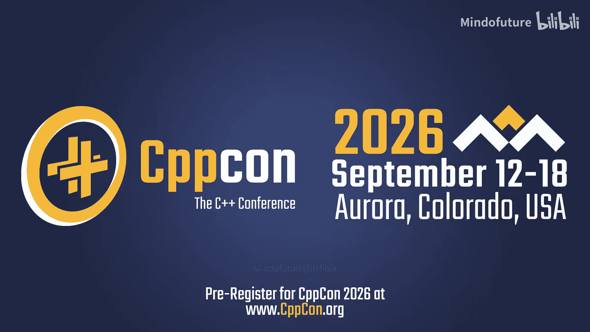
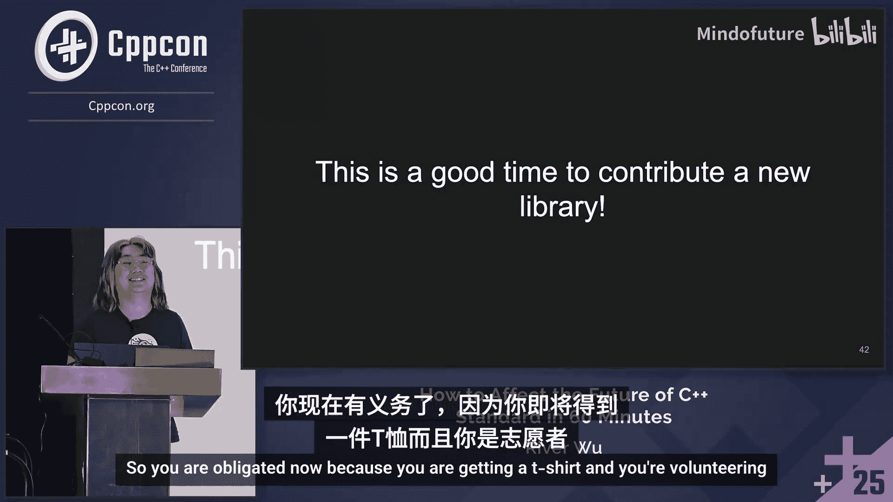
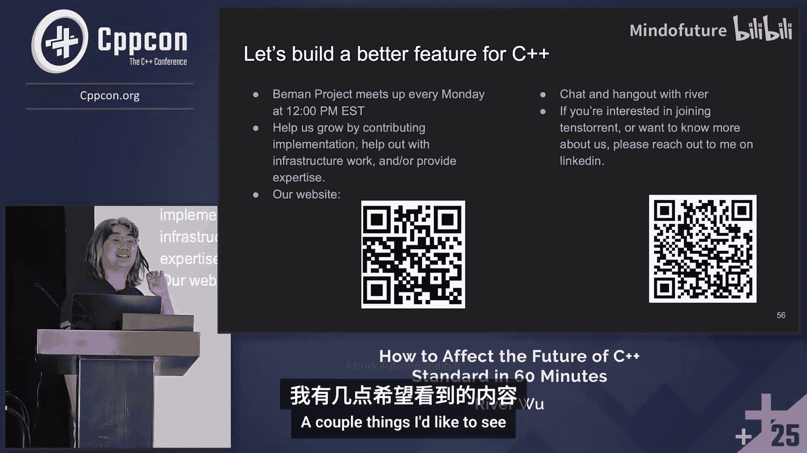
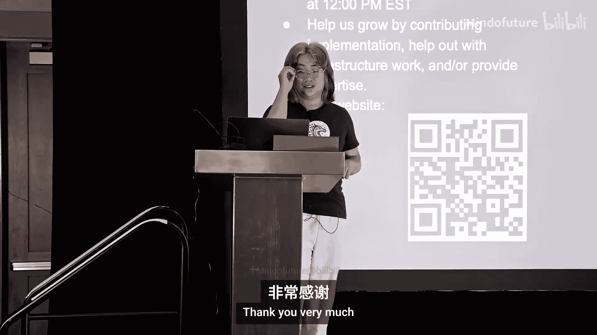

# 077：对C++标准库不满意？加入Beman项目





## 概述

在本节课中，我们将学习一个名为Beman的项目。该项目旨在让C++标准库的提案和演进过程对普通开发者更加透明和易于参与。我们将了解Beman项目的目标、已取得的成果，以及你如何能够参与其中，共同塑造C++的未来。

---

## 从城市规划到语言演进

演讲者首先将语言演进比作城市规划。城市规划影响每个人，需要长远的眼光和务实的投资，因为糟糕的选择很难逆转。同样，C++语言的演进也影响着所有使用者，其核心语言特性和标准库的引入都至关重要。

上一节我们介绍了语言演进与城市规划的相似性，本节中我们来看看当前C++标准库提案的评估方式存在哪些挑战。

## 当前标准库提案评估的挑战

目前，评估新的C++标准库提案并不像评估一个普通的开源库那样简单直接。

以下是当前流程中存在的一些问题：

*   **提案形式复杂**：提案以长达20-30页的“论文”形式呈现，而非简洁的README和示例代码。
*   **标准化过程不透明**：讨论通常限于ISO委员会成员，普通开发者难以了解设计决策背后的原因或提出疑问。
*   **缺乏统一的实现与反馈平台**：没有一个像GitHub那样集中、易于访问的地方来获取提案的实现、进行测试和提供反馈。

因此，我们需要一种更易访问、更统一的方式来将标准库提案作为真正的“库”进行评估。

---

## Beman项目简介

Beman项目正是为了解决上述问题而诞生的。它本质上是一个“可访问性”项目，旨在为对C++未来感兴趣的人和库实现者搭建桥梁。

Beman项目的核心使命是：**支持高效设计并产出最高质量的C++标准库**。具体而言，它致力于：

*   **作为提案实现的集合**：一个GitHub组织，托管各种标准库提案的生产就绪实现。
*   **作为透明的反馈与讨论平台**：通过GitHub Issues和Discourse论坛，让每个人都能参与设计讨论，理解语言特性。
*   **作为欢迎的社区**：聚集对语言演进充满热情的人，相互学习，形成良好的反馈循环。

对于广大C++委员会和社区，Beman让**库提案像真正的库一样**可访问、可测试。对于库实现者，它提供了一个现成的、最佳实践的基础设施（如CMake、CI/CD），让他们可以专注于实现本身。

---

## Beman项目中的库示例

经过近一年的发展，Beman项目已经托管了多个库的实现。让我们来看几个例子。

### `std::optional<T&>`

这是Beman中最成熟的项目之一。当前的`std::optional`不允许引用类型（`T&`），这是一个故意留下的设计空缺。Beman的`std::optional`实现填补了这一空白。

**核心概念**：
```cpp
// Beman 实现的 optional 支持引用类型
std::optional<Cat&> find_cat();
// 替代了过去返回 std::optional<Cat*> 可能带来的歧义
```

这个实现已经进入C++26草案，并且通过暴露给更广泛的社区，帮助发现了原始实现中一个影响广泛的重大缺陷。

### `std::any_view`

这个库旨在解决传递视图（views）时类型擦除的问题。当你有一个复杂的管道视图（如`filter` + `transform`）时，其类型复杂且无法用于跨接口边界。

**核心概念**：
```cpp
// any_view 提供了一种类型擦除的视图容器
std::any_view<int> get_view();
// 可以持有任何满足特定概念（如输入范围）的视图，便于传递
```

参与这个库的实现和讨论，是深入了解C++类型擦除和概念模型的绝佳机会。

---




## Beman项目的成熟度模型

Beman项目为库的实现定义了一个成熟度模型，直观地反映了其与标准化进程的关系：

1.  **灰龙**：库处于开发初期，API可能不稳定，尚未准备好用于生产。
2.  **彩龙**：库已被评估为“生产就绪”，拥有高质量的测试和实现，鼓励大家试用。
3.  **红龙**：库的底层提案已被ISO标准采纳，其API稳定如标准库。此时，Beman的实现可作为在旧标准中“回溯移植”新特性的来源。
4.  **龙肉干**：库的底层提案被拒绝，项目归档。

这个模型清晰地展示了从提案实验到标准落地的完整路径。

---

## 如何参与Beman项目

Beman项目投入了大量精力构建便捷的基础设施，以降低贡献门槛。

### 对于库用户/反馈者

你可以轻松地尝试任何Beman库：

*   访问 [Beman GitHub](https://github.com/be-mann) 找到感兴趣的库。
*   使用 **CodeSpace** 在浏览器中一键打开开发环境，立即运行示例。
*   使用 **Compiler Explorer** 在线查看编译结果。
*   在库的GitHub仓库中提交Issue，分享你的使用体验、遇到的问题或新的用例想法。任何反馈都极具价值。

### 对于库作者/贡献者

如果你想为现有库贡献代码或启动一个新的Beman库，流程也非常简单：

1.  **使用项目模板**：Beman提供了 `be-mann/exemplar` 模板仓库，使用 `cookiecutter` 工具可以快速生成新库所需的所有基础设施。
2.  **完善的基础设施**：生成的仓库已预置：
    *   **CMake配置**：遵循最佳实践，支持 `cmake --preset` 一键构建和测试。
    *   **全面的CI/CD**：通过GitHub Actions自动在Windows、Linux、macOS上使用GCC、Clang、MSVC等多个编译器版本进行测试。
    *   **代码质量工具**：集成 `pre-commit`，自动格式化代码（C++、Markdown等）。结合 `reviewdog`，在PR中直接提供修复建议。
    *   **开发容器支持**：通过CodeSpace提供一致的云端开发环境。

### 提出你的想法



即使你没有具体的实现，也可以在Beman的Discourse论坛上提出你希望看到的库特性。社区可以帮你了解是否有相关提案，甚至指导你如何撰写提案。

---

## 总结

本节课中我们一起学习了Beman项目。我们了解到，Beman通过将C++标准库提案作为生产就绪的开源库来实现，极大地提高了语言演进过程的透明度和参与度。它提供了一个从实验、反馈到最终标准化的完整平台。




无论你是想提前体验C++的未来特性，还是想为C++标准库的完善贡献一份力量，亦或是想学习大型C++库的基础设施建设，Beman项目都为你打开了大门。加入这个社区，让我们一起构建更好的C++。