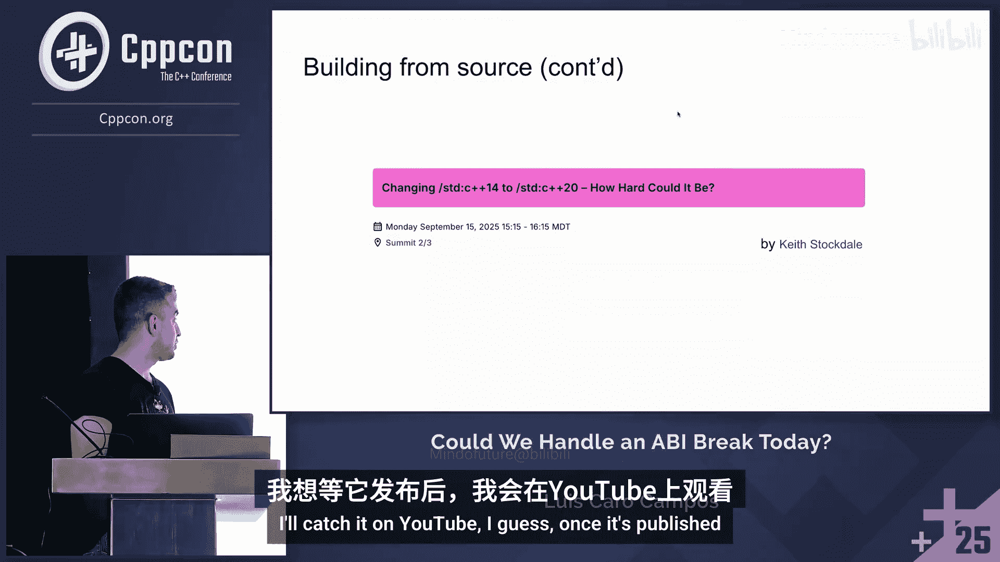

# 078：C++开发者今天能应对ABI破坏吗？

在本教程中，我们将探讨C++应用二进制接口（ABI）的兼容性问题。我们将回顾历史上ABI破坏的案例，分析开发者当前仍面临的链接挑战，并了解现代工具如何帮助管理这些兼容性问题。无论你是初学者还是有经验的开发者，本教程都将帮助你理解ABI问题的本质及其应对策略。

## 什么是ABI？

上一节我们介绍了本教程的主题，本节中我们来看看ABI的基本概念。

应用二进制接口（ABI）定义了已编译的翻译单元如何与不同翻译单元中的实体进行通信。这些实体可能来自使用相同编译器版本编译的不同源文件，也可能是使用不同编译器或编译器版本构建的库中的代码。

ABI本身超出了C++标准的范围。标准主要涵盖语言和标准库，而ABI是平台和供应商特定的。不同的操作系统、CPU架构和编译器供应商都有不同的ABI。

然而，标准库中的某些更改可能会迫使编译器供应商在未来版本中破坏ABI，以符合标准。尽管如此，ABI破坏的具体实现方式以及开发者将如何体验它，仍然是平台和供应商特定的。

## 开发者如何体验ABI破坏？

上一节我们定义了ABI，本节中我们来看看开发者实际会遇到哪些问题。

开发者体验ABI破坏的方式有多种，从最理想到最不理想的情况如下：

以下是几种常见情况：
1.  **明显的链接器错误**：这是最常见的信号。当尝试链接使用不同ABI构建的对象时，链接器会明确指出存在不兼容性。
2.  **隐晦的链接器错误**：这是更常见的情况。ABI不兼容会导致难以诊断的链接错误。
3.  **运行时错误**：在某些情况下，程序可能会遇到段错误（Segmentation Fault），这更难追溯到ABI不兼容性。
4.  **静默的错误行为**：最糟糕的情况是程序能够运行并正常退出，但其行为不符合预期，例如计算结果错误。

## 历史上的ABI破坏案例

了解了ABI破坏的表现形式后，我们回顾一下C++发展史上几个重要的ABI破坏事件。

### Visual Studio 2015之前的版本

在Visual Studio 2015之前，几乎每个VS新版本都会完全破坏ABI兼容性。例如，使用VS 2005构建的对象无法与使用VS 2010构建的程序链接并交互。虽然存在变通方法（例如避免对象跨越“CRT边界”），但这给工作流带来了很大干扰。

当时，开发者必须记住不同VS版本对应的内部版本号（如`VS2012`对应`v110`，但错误信息可能显示`1700`），并且需要为不同VS版本维护多套二进制文件（如`vc11`、`vc12`、`vc14`文件夹）。工具如CMake在查找包时也可能因版本混淆而导致链接错误。

### GCC 5与libstdc++ C++11 ABI

GCC 5决定让`std::string`和`std::list`的实现符合C++11标准。与VS的“全面破坏”方式不同，GCC采用了新方法：新版本的libstdc++同时包含了新旧两种实现，并通过嵌套命名空间进行区分，因此符号修饰（name mangling）也不同。

这不需要源代码更改，并且库本身向后兼容新旧ABI。主要问题出现在混合使用新旧ABI构建的对象时，会导致链接错误。错误信息中通常包含`cxx11`或类似标记，提示开发者需要用同一种ABI重新构建所有对象。

需要注意的是，即使GCC版本相同，不同Linux发行版默认使用的ABI也可能不同（例如Ubuntu较早切换到新ABI，而Red Hat为了兼容性在多个版本中仍使用旧ABI）。因此，不能假定不同GCC版本构建的二进制文件一定链接兼容。

### 其他GCC与libstdc++的变更

其他例子包括：
*   **`std::filesystem`**：在GCC 7（实验性，需链接`-lstdc++fs`）到GCC 8（正式，仍需链接`-lstdc++fs`）再到GCC 9（实现并入主库，无需额外链接）的演进中，如果使用GCC 8构建的共享库（其中静态链接了`libstdc++fs`）与GCC 9的程序链接，可能会在运行时发生冲突导致段错误。GCC文档指出，C++17特性的ABI直到GCC 9才稳定。
*   **libstdc++的完全破坏**：上一次libstdc++完全破坏ABI是在2004年，新旧版本完全不兼容。
*   **macOS的过渡**：大约在2013年，macOS从libstdc++过渡到libc++，总体上比较成功。

## 当前开发者仍面临的ABI挑战

回顾历史后，我们发现ABI兼容性问题并未消失。本节将探讨当前开发者日常开发中仍会遇到的链接问题。

### 由条件编译导致的ABI不兼容

库作者为了支持不同C++标准或编译器特性，常在头文件中使用条件编译宏。这可能导致同一个头文件在不同翻译单元中被解析成不兼容的ABI。

例如，一个库使用C++14构建，但其头文件根据`__cplusplus`宏决定使用哪种实现。如果消费者代码使用C++20编译并包含该头文件，即使源代码无需改动，也可能在链接时出错。

一种解决方法是避免在头文件中使用此类条件编译，而是在构建库时就将决策硬编码。例如，Abseil库提供了一个`absl/base/options.h`文件，允许用户硬编码决策以确保二进制兼容性。然而，如果上游库（如gRPC）单方面决定只使用新标准中的类型（如直接使用`std::variant`而不再考虑Abseil的实现），就会破坏这种封装，导致编译或链接错误。这类问题在Boost等库中也很常见。

### 编译器保证之外的现实情况

尽管编译器厂商努力保持ABI兼容，但仍存在一些例外：
*   **`inline`静态成员变量（C++17前）**：在C++17之前，类内初始化的静态成员变量需要在类外有一个定义。如果使用C++11构建的库中包含了这样的变量，而主程序用C++17构建并链接，可能会因符号问题导致链接失败。这在某些编译器中被视为未解决的bug。
*   **Windows运行时的多重版本**：Windows开发者需要处理多个不兼容的运行时（如调试版/发布版、静态链接/动态链接）。如果混用，可能会得到清晰的链接器错误。但更隐蔽的是，如果动态加载（LoadLibrary）了使用不同运行时的DLL，程序可能不会崩溃，但行为异常。
*   **Visual Studio的“向后兼容”陷阱**：自VS2015起，微软保持了ABI向后兼容，但要求链接器版本不低于所有待链接对象中最新的那个。如果不符合（例如CI环境中工具链版本过旧），会产生非常隐晦的链接错误。此外，偶尔也会有非预期的、文档中提及的微小ABI破坏在补丁版本中引入。
*   **Linux的兼容性“孤岛”**：即使在同是GCC 13的情况下，在不同Linux发行版（如Ubuntu 22.04, RHEL 8, Alpine）上构建的共享库也可能因底层libstdc++版本、链接方式（glibc vs musl）等因素而互不兼容。开发者往往只关注文件名（如`libfoo.so`），而忽略了这些底层差异。

## 现代工具如何帮助管理ABI

面对这些持续存在的挑战，现代构建和包管理工具提供了解决方案。本节我们将看看这些工具如何帮助开发者应对ABI复杂性。

理想情况下，工具应该能：
1.  在构建开始前就预警ABI不兼容。
2.  自动忽略与目标平台不兼容的预编译二进制包。
3.  在缺少兼容二进制包时，能够自动从源码构建出一套兼容的版本。
4.  支持构建特殊的二进制变体（如LTO优化、带消毒器）。

以下是一些工具的实际应对方式：
*   **Homebrew (macOS)**：在macOS切换libc++时，Homebrew会拒绝安装使用不兼容库构建的软件，这比遇到链接错误要好。
*   **Linux发行版包管理器**：它们擅长创建“兼容性孤岛”，通过`发行版代号-架构`（如`noble-amd64`）来精确描述二进制包的兼容环境。
*   **vcpkg**：支持定义“三元组”（triplets），可以轻松复制并修改以建模新的ABI（例如`x64-windows-abi-new`）。有趣的是，尽管过去十年ABI相对稳定，vcpkg默认仍倾向于从源码构建以确保最大兼容性。
*   **Conan**：使用“配置文件”来描述目标平台，包括编译器、编译器版本、C++标准等。任何设置差异都会导致不同的二进制包。Conan 2.0引入了对C++标准版本的显式管理，并可以配置兼容性模式（例如，允许使用Clang 16构建的包在Clang 17下使用）。对于像Abseil这样明确跨C++标准不兼容的库，可以在Conan配方中声明，这样Conan只会为请求的特定C++标准版本提供二进制包，并在消费者尝试混合不兼容版本时直接报错，从而将问题从晦涩的链接器错误提前到清晰的依赖解析阶段。

## 总结与展望

本节课中我们一起学习了C++ ABI兼容性的核心问题、历史案例、当前挑战以及现代工具的应对策略。

我们认识到，尽管十年前发生了重大的ABI破坏，但由条件编译、编译器实现细节、平台差异等导致的链接兼容性问题从未消失，开发者至今仍受其困扰。同时，任何足够长的时间跨度内，总会有与C++无关的因素（如CPU架构变更）迫使你重新构建。

幸运的是，现代工具链（如Conan, vcpkg, CMake）和容器化技术（如Docker）的成熟，使得管理多版本、多平台依赖和从源码构建变得更加容易。许多开发者因此并未直接感受到ABI不兼容的冲击。软件供应商也能更好地为目标平台提供多套二进制文件。

最终，解决大多数ABI问题的方案仍然是**从源码重新构建**相关库，并确保使用一致的编译器、标志和标准版本。虽然并非所有人都有条件这么做（例如使用闭源库），但行业趋势和工具支持正朝着降低这一门槛的方向发展。作为开发者，理解ABI问题的本质，并善用现代工具来管理依赖和构建过程，是应对当前及未来ABI挑战的关键。