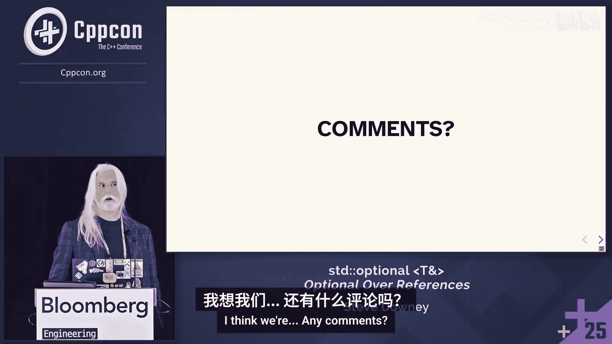

# 080：从 Boost 到 C++26


在本节课中，我们将要学习 `std::optional` 的发展历程，特别是它如何从 Boost 库演变到 C++26 标准，并最终支持引用类型。我们将探讨其设计挑战、核心语义以及未来的发展方向。

大家好，我是 Steve Downey，来自 Bloomberg。我是最终将 `std::optional` 支持引用类型的提案的主要作者。今天我将讨论我们取得了什么成果，为什么花了这么长时间，我们期望从中获得什么，以及还有哪些工作待完成。

## 标准化时间线 📅

`std::optional` 最早在 2005 年被提出，但当时只支持值类型。直到 2017 年，`std::optional<T>` 才被纳入 C++17 标准。对于左值引用的支持，则在 2025 年 6 月的索非亚会议上投票通过。

最初的提案希望 `optional` 具有引用语义，这与我们最终实现的结果基本一致。这个过程之所以漫长，是因为所有参与者都出于善意，但对实现方式有合理的不同见解。

Boost.Optional 库很早就提供了引用语义。一个为 C++20 准备的提案曾进展顺利但最终未被采纳。幸运的是，JeanHeyd Meneide 在受挫后进行了大量研究，梳理了历史上的各种尝试和争论，这直接促成了我的提案：我们应该直接实现它。当然，实际的细节远比我想象的要多。

## 核心问题：引用的语义 🤔

引用在 C++ 语言中大致扮演三种完全不同的角色，这导致了复杂性。

1.  **调用约定语义**：通过引用传递参数，适用于像运算符这样的场景，可以避免拷贝。
2.  **局部别名**：为表达式提供一个本地别名，不占用额外空间，编译器会跟踪这个别名。
3.  **作为结构体成员**：在结构体中存放引用会非常复杂，会导致所有特殊成员函数（如默认构造函数、拷贝赋值运算符）失效，因为引用本身不可重新绑定。

因此，关于 `optional` 持有引用时应该如何表现，存在强烈的理论分歧。一种观点认为，它应该像一个包含引用成员的结构体，一旦绑定就无法改变。但事实证明，这种语义并不受欢迎，且会带来许多额外问题。

这个争论的核心是 **“穿透”与“重新绑定”**。赋值时，是应该直接操作 `optional` 当前引用的对象（穿透），还是让 `optional` 转而引用另一个对象（重新绑定）？对于真正的引用类型，你无法做到后者。

JeanHeyd 通过其库实现和研究得出了一个关键观察：**如果赋值行为依赖于 `optional` 的当前状态（已 engaged 或未 engaged），那么代码将变得难以推理**。你必须动态追踪程序路径才能知道会发生什么，这很容易引入错误。我们希望仅通过局部查看代码就能推理程序行为。

因此，我们最终的设计是：**`optional<T&>` 内部只是一个指针**。我们对这个指针施加了许多约束，但其本质就是一个指针。这也带来了一些其他问题，但这是权衡后的结果。

## `std::optional<T>` 快速回顾 🔄

上一节我们讨论了引用的复杂性，本节我们来看看 `std::optional<T>` 的基本概念，以便与新的 `optional<T&>` 进行对比。

`std::optional<T>` 是一个**值语义**的**拥有类型**。它内部可能包含一个 `T` 类型的对象，也可能不包含任何值（即“未 engaged”状态）。你可以拷贝它，可以对其做任何底层类型 `T` 允许的操作。它只是额外提供了一个比特的信息来表示“可能没有值”。

这对于没有“带外值”来表示无效状态的场景非常有用。从代数类型角度看，可以将其视为 `T + 1`（即 `T` 的所有可能值加上一个“空”值）。它类似于 `std::variant<T, std::monostate>`，尽管实现方式不同。

关于 `optional` 的长期讨论，实际上也是为我们真正想在 `variant`、`expected` 等代数类型上实现的功能进行铺垫。现在我们在 `optional` 上达成了共识，就可以开始处理其他类型了。

`optional` 的一个核心用例是：从配置文件读取一个可能不存在的值。使用 `optional` 可以在代码中更好地建模这种情况，减少忘记处理“未 engaged”状态的可能。

在 C++26 中，我们可以使用一种简洁的语法来遍历 `optional`（它现在是一个范围）：
```cpp
for (auto& value : maybe_value) {
    // 如果能进入循环体，则 value 一定存在
}
```
这对于简化需要检查 `optional` 状态的代码很有帮助。

另一个重要用例是作为**默认参数**：
```cpp
void func(std::optional<int> param = std::nullopt) {
    // ...
}
func(); // 使用默认值（未 engaged）
func(42); // 传递一个 int，会自动转换为 optional<int>
```
这增加了许多构造函数和转换，使得实现正确且无惊喜变得具有挑战性。

## `std::optional<T&>` 概述 🎯

理解了 `optional<T>` 后，本节我们来看看新的 `optional<T&>` 是什么，以及我们通常希望它做什么。

`std::optional<T&>` 是一个**非拥有类型**。它内部并不包含一个 `T` 类型的值，而是引用着别处的某个对象。它具有**指针式的引用和值语义**：指针本身是值（可拷贝、可比较），但解引用后具有引用语义。这就是我们对 `optional<T&>` 的期望。

它有一个额外的值来表示空状态。我们实质上强制规定了一个核心优化：**空状态就是内部的空指针**，没有为额外的比特位分配空间。

以下是核心用例：

1.  **查找并可能修改**：例如，在 `map` 中查找一个键。
    ```cpp
    // 传统方式，需要处理 iterator 和 pair
    auto it = my_map.find(key);
    if (it != my_map.end()) {
        it->second.modify();
    }
    // 期望的方式（C++29 计划中）
    std::optional<Value&> maybe_val = my_map.find(key);
    if (maybe_val) {
        maybe_val->modify(); // 可以直接修改
    }
    ```
    使用 `optional` 能提示你应该检查是否存在，并且因为是引用，你可以直接修改其值。

2.  **作为可选参数**：替代指针，传递更清晰的意图。
    ```cpp
    void process(Logger& logger, std::optional<Data&> maybe_data) {
        if (maybe_data) {
            logger.log(*maybe_data);
        }
    }
    ```
    传递 `optional` 意味着接收方不会尝试删除它或对其做其他预期之外的操作，并且如果调用者不提供，可以跳过相关逻辑。

## 设计决策与挑战 ⚖️

在就基本语义达成一致后，我们仍然需要做出许多具体的设计选择。本节将探讨其中一些关键决策。

**构造与赋值**：从底层类型 `T` 或可转换为 `T` 的类型进行构造和赋值，不可避免地会带来意外和复杂的实现。对于 `optional<T&>`，我们希望尽可能默认安全。我们利用标准库中的新技术来检测转换是否会产生悬垂引用，并在可能时禁止这种构造。

**赋值语义（穿透 vs 重新绑定）**：我们最终选择了**重新绑定**作为默认的安全语义，因为它能产生最少的意外结果。无论 `optional` 之前的状态如何，赋值操作总是会让它引用新的对象。这使得代码行为可预测。

**与 `optional<T>` 的泛型性**：`optional<T&>` 的特化与 `optional<T>` 完全不同。这在泛型系统中通常不被允许，因为希望泛型类型行为一致。但 C++ 中的引用本身就很特殊，不同于值语义。我们实际上是在要求“引用语义”，而 C++ 的引用语义与值语义本就不同。

**`make_optional` 的行为**：`make_optional` 总是返回 `optional<T>`，即使表达式是引用类型。我们不希望改变这一点造成意外。现在你可以直接写 `optional<T&>`，不再那么需要 `make_optional`。

**值类别的影响**：我们模仿指针。`optional` 本身的值类别（左值、右值）不影响你解引用它得到的内容（总是 `T&`）。否则，你可能会意外地从 `optional<T&>` 中移出内容。

**常量性**：我们使用**浅层 const**。`const optional<T&>` 并不意味着它引用的对象是 const 的。如果你需要一个引用常量对象的 `optional`，应该使用 `optional<const T&>`。

**条件性 explicit**：我们根据底层类型的构造是否 explicit 来决定 `optional` 的构造函数是否 explicit。这减少了现有代码的破坏和语法噪音，但增加了库设计的复杂性。

**`.value_or()` 的返回值**：为了安全性和时间限制，`optional<T&>` 的 `.value_or()` 目前总是返回一个 `T` 类型的值（而非引用）。未来有提案希望将其泛化，返回 `T` 和 `U` 的公共引用类型。

**原位构造**：支持，但会检查是否会产生悬垂引用，并避免从临时对象转换。

**赋值运算符**：我们最终意识到只需要一个赋值运算符（因为只是拷贝指针），这对标准化和编译器优化都有好处。

## 实现与悬垂引用 🛡️

上一节我们讨论了各种设计选择，本节我们来看看如何具体实现这些原则，特别是如何避免悬垂引用这一常见错误。

在具体实现设计时，我们遵循以下原则：

*   **避免引用临时对象**：我们检查所有转换的悬垂属性。如果转换会产生一个临时对象，而我们取了它的地址，这个临时对象在表达式结束时就会消失，我们将禁止这种构造。这排除了一些安全的用例，但阻止了更多危险的用例。
*   **删除悬垂重载**：我们直接删除会导致悬垂的重载，而不是使用 `requires` 子句。这样错误会更快地暴露出来，不会落入构造函数重载集中的其他意外选择。
*   **赋值即指针拷贝**：`optional<T&>` 的赋值等价于指针拷贝，所有赋值都通过单一函数完成。这对编译器优化非常透明。

一个重要的相关项目是 **Project Beman**。它旨在为标准库组件提供精确的参考实现。在标准化过程中，拥有一个完全符合提案的实现至关重要，这可以帮助我们在早期发现设计问题，例如测试特定修改（如增加 `const`）的影响，而不是等到标准会议周期之后。

## “窃取引用”的Bug与移动语义 🐛

在实现过程中，我们发现并修复了一个重要的边缘案例 Bug，这揭示了关于移动语义的一个普遍原则。

考虑以下代码：
```cpp
Cat fin;
Cat& fin_ref = fin;
std::optional<Cat> maybe_cat = std::move(maybe_cat_ref); // Bug！
```
在 Boost.Optional 中，上述移动赋值会“窃取”猫（移动 `fin` 本身）并赋值给 `maybe_cat`。这非常令人意外。

问题的核心在于：`optional` 被指定为对 `operator*` 的结果进行移动。一旦我们有了 `optional<T&>`，从 `operator*` 获得的值类别就不可预测了。特别是，对于一个即将消亡的 `optional`（纯右值），你可以从中移动，但对于 `optional<T&>`，仅仅 `optional` 本身即将消亡，并不代表它引用的对象也可以被移动。

**我们得出的一个普遍原则是：不要试图推理什么可以被移动。** 你应该只对你明确有权移动的对象使用 `std::move`。更安全的做法是写 `std::move(*rhs)`，而不是 `*std::move(rhs)`，因为你不知道解引用一个被标记为“可移动”的右值是否是你想要的行为。

最好的移动是那些你不需要写的移动，比如返回值优化。

## 未来工作与总结 🚀

我们已经介绍了 `optional<T&>` 的设计与实现，本节将展望未来的计划，并对本节课内容进行总结。

**关联容器的查找**：`optional<T&>` 最常见的用例是在关联容器（如 `map`）中查找元素。我们计划为 C++29 在 `map`、`unordered_map` 和 `flat_map` 中添加返回 `optional<value_type&>` 的查找成员函数。这只是一个时间优先级问题，实现上并无困难。

**其他待完成事项**：
*   完善 `optional` 与其他代数类型（如 `variant`、`expected`）的协作。
*   解决 `vector<bool>` 这类特化带来的历史问题（虽然不直接相关，但属于类似的“非泛型”特化问题）。
*   推进 `variant` 支持引用类型的工作。现在我们在 `optional` 上达成了语义共识，这为 `variant` 铺平了道路。

**与 `std::reference_wrapper` 的关系**：`reference_wrapper` 内部也是一个指针，但其 API 设计初衷不同（用于 tuple 等），且没有我们为 `optional<T&>` 实现的悬垂检查等安全特性。虽然理论上可用作替代，但使用起来不够方便，且与 `optional<T>` 的互操作性可能存在问题。

---

本节课中，我们一起学习了 `std::optional` 支持引用类型的漫长演进之路。我们从其历史背景和核心设计挑战（穿透 vs 重新绑定）开始，明确了 **`optional<T&>` 内部使用指针并采用重新绑定语义** 以实现可预测性和安全性。我们探讨了其与 `optional<T>` 的区别、各种设计决策（如常量性、`.value_or` 行为），以及如何避免悬垂引用。最后，我们了解了未来的工作方向，包括为关联容器提供更好的查找接口。`std::optional<T&>` 的引入，是 C++ 在表达“可选引用”这一常见模式上迈出的重要一步。




