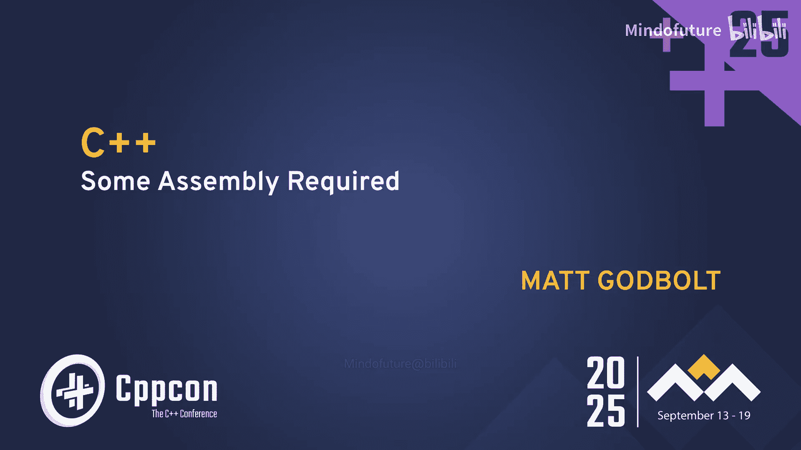

# 082：C++ 需要一些汇编 🧩




在本节课中，我们将跟随 Matt Godbolt 的演讲，探讨汇编语言在 C++ 开发中的重要性。我们将了解汇编语言的基础知识，学习如何通过工具（如 Compiler Explorer）来阅读和理解编译器生成的汇编代码，并认识到 C++ 生态系统的构建不仅仅是代码本身，还包括社区、工具链和标准化过程。

---

## 汇编语言：从机器码到人类可读的文本

上一节我们介绍了本课程的主题，本节中我们来看看什么是汇编语言。

汇编语言是机器码的人类可读表示。机器码是 CPU 直接执行的二进制指令序列（例如 `0F AF FF`），而汇编语言则使用助记符（如 `imul`）和标签来代表这些指令和内存地址。两者之间存在一一映射关系，通过汇编器可以将汇编代码转换为机器码，反汇编器则执行相反的过程。

**核心概念**：
*   **机器码**：CPU 直接执行的二进制指令。
*   **汇编代码**：机器码的人类可读形式。

---

## 不同架构的汇编初览

了解了基本定义后，我们来看看不同 CPU 架构下的汇编代码有何不同。

我们以一个简单的平方函数为例：
```cpp
int square(int x) {
    return x * x;
}
```

以下是该函数在三种主流架构（使用 Linux System V ABI）下的汇编输出：

*   **x86-64 (Intel)**:
    ```assembly
    square(int):
            imul    edi, edi   ; 计算 edi * edi，结果存回 edi
            mov     eax, edi   ; 将结果移动到 eax（返回值寄存器）
            ret                ; 返回
    ```
    x86 指令通常是双操作数且目的操作数也是源操作数之一（类似 `x *= x`）。参数通过寄存器传递（`edi`），返回值必须放在 `eax` 寄存器中。

*   **AArch64 (ARM)**:
    ```assembly
    square(int):
            mul     w0, w0, w0  ; 计算 w0 * w0，结果存回 w0
            ret                 ; 返回
    ```
    ARM 指令更规整（固定4字节长度），参数和返回值寄存器通常是同一个（`w0`/`x0`）。

*   **RISC-V**:
    ```assembly
    square(int):
            mul     a0, a0, a0  ; 计算 a0 * a0，结果存回 a0
            ret                 ; 返回
    ```
    RISC-V 的指令集设计也非常规整，参数和返回值使用 `a0` 寄存器。

**核心概念**：
*   **寄存器**：CPU 内部的高速存储单元，数量有限，用于存储计算中的临时数据、参数和返回值。
*   **调用约定 (ABI)**：规定了函数调用时参数如何传递（哪些寄存器）、返回值放在哪里、哪些寄存器需要由调用者保存等规则。不同操作系统和架构的 ABI 可能不同。

---

## 如何阅读汇编：以 Compiler Explorer 为例

上一节我们看了简单的例子，本节中我们来看看如何借助工具分析更复杂的代码。

Compiler Explorer 是一个将 C++ 代码实时编译并显示对应汇编输出的在线工具。它能高亮显示源代码与汇编代码的对应关系，是学习汇编和编译器优化的绝佳平台。

以下是一个检查字符串是否为16位十六进制标识符的函数：
```cpp
bool is_valid_id(std::string_view sv) {
    if (sv.size() != 16) return false;
    constexpr std::string_view valid_chars = "0123456789ABCDEF";
    for (char c : sv) {
        if (valid_chars.find(c) == std::string_view::npos) {
            return false;
        }
    }
    return true;
}
```

在 Compiler Explorer 中观察此代码：
1.  **优化级别的影响**：使用 `-O0`（无优化）时，代码非常直接，可能包含对 `std::string_view::find`（即 `memchr`）的调用和显式循环。使用 `-O2` 或 `-O3` 时，编译器可能展开循环、内联函数调用，甚至使用位掩码等技巧进行向量化优化，代码会变得更高效但也更复杂。
2.  **识别模式**：
    *   **循环**：寻找一个标签（如 `.L4`）以及跳转到该标签的指令（如 `jne .L4`），这通常构成循环体。
    *   **条件分支**：`cmp`（比较）指令后跟 `je`（相等则跳转）或 `jne`（不相等则跳转）等条件跳转指令。
    *   **函数调用**：`call` 指令。
3.  **AI 辅助解释**：Compiler Explorer 集成了 AI 功能，可以尝试解释汇编代码在做什么。**但务必谨慎对待其输出，需要人工核实**，就像演讲者分享的“盲目相信导航导致汽车卡在小路上”的故事一样，技术工具可能出错。

---

## C++ 的“组装”：超越代码的生态系统

上一节我们关注于代码层面的汇编，本节我们将视野放宽，看看“组装”C++ 程序所需的更大生态系统。

“Assembly”一词也有“组装”的含义。构建一个 C++ 项目远不止写代码和编译，它涉及一系列组件和过程的协作。

**以下是构建 C++ 项目所需的关键组件**：
*   **核心库**：
    *   **标准模板库 (STL)**：由 Alexander Stepanov 创立，奠定了 C++ 泛型编程的基础。
    *   **Boost**：高质量的第三方库集合，许多 C++ 标准库功能源于此。
    *   **Bloomberg BDE**、**Facebook Folly** 等：大型公司内部开发的高质量库。
*   **工具链**：
    *   **编译器**：GCC, Clang, MSVC 等。
    *   **构建系统**：CMake, Bazel, Meson, Make 等，用于管理复杂的编译和链接过程。
    *   **包管理器**：Conan, vcpkg, CPM 等，用于获取和管理第三方依赖。
    *   **编辑器/IDE**：Visual Studio, CLion, VS Code, Vim/Emacs 等，提供编码环境。
*   **基础设施工具**：调试器 (GDB, LLDB)、静态分析器、代码格式化工具 (clang-format)、文档生成器 (Doxygen) 等。
*   **人：最重要的因素**：无论是开源项目还是公司内部项目，让代码易于获取、构建和理解，能鼓励更多人参与贡献和修复。友好的社区和文档至关重要。

---

## C++ 的“立法机构”：标准化过程

上一节我们讨论了技术组件，本节我们来看看指导 C++ 发展的“立法”过程——标准化。

C++ 的标准由 ISO/IEC JTC1/SC22/WG21（通常简称为 WG21 或 C++ 标准委员会）制定。这是一个严谨但相对缓慢的过程。

**一个特性进入 C++ 标准的大致流程如下**：
1.  提交提案（论文）到相关邮件列表。
2.  在相应的研究组 (Study Group, SG) 或演进工作组 (Evolution Working Group, EWG/LWG) 中讨论和修改。
3.  进入核心工作组 (Core Working Group, CWG) 或库工作组 (Library Working Group, LWG) 进行标准文案的精确制定。
4.  最终在全体会议 (Plenary) 上投票表决。

这个过程保证了语言的稳定性和向后兼容性，但同时也意味着新特性的采纳需要时间和广泛的共识。我们应该感谢委员会成员及其赞助公司付出的巨大努力。

---


## C++ 的“集会”：社区的力量

上一节我们了解了官方的标准化组织，本节我们来看看充满活力的 C++ 社区。

“Assembly”也指“集会”。C++ 社区通过线下和线上的各种聚会紧密连接。

**以下是参与 C++ 社区的方式**：
*   **线下会议**：像 CppCon 这样的大型国际会议，以及众多区域性会议，提供了学习前沿知识和进行“走廊交流”的机会。
*   **本地线下聚会 (Meetup)**：全球有上百个 C++ 用户组，定期举办技术分享或社交活动，是结识本地同行、深入交流的好地方。
*   **线上社区**：Discord、Slack 频道、Reddit (r/cpp)、C++ Forum 等平台提供了随时交流的空间。Compiler Explorer 也有自己的 Discord 社区。
*   **协作网站**：如 cppreference.com（权威的 C++ 参考网站）和 Compiler Explorer 本身，都是社区驱动、共同维护的宝贵资源。

积极参与社区，无论是组织聚会、在会上演讲、开源项目，还是参与标准委员会，都能让你为 C++ 生态做出贡献，并从中获益。

---

## 总结与行动号召 🥁

本节课中，我们一起学习了“汇编”对于 C++ 的多重含义：
1.  **汇编语言**：理解编译器生成的汇编代码，是进行底层调试、性能分析和深入理解 C++ 行为的关键技能。工具如 Compiler Explorer 极大地降低了学习门槛。
2.  **组装过程**：构建现代 C++ 项目是一个复杂的系统工程，涉及编译器、库、构建工具、包管理器以及最重要的——开发者之间的协作。
3.  **标准制定**：C++ 语言通过一个严谨的国际化标准流程演进，这保证了其稳定性和广泛适用性。
4.  **社区集会**：强大而活跃的社区是 C++ 生命力的源泉。通过参与会议、线下聚会和线上讨论，我们可以互相学习，共同推动 C++ 向前发展。


C++ 的成功需要所有这些层面的“组装”。正如演讲者所言，这是“召集 C++ 编码者集合”的时刻。无论你是通过贡献代码、完善文档、组织活动还是参与标准化，每个人都可以为这个社区添砖加瓦，让 C++ 变得更好。