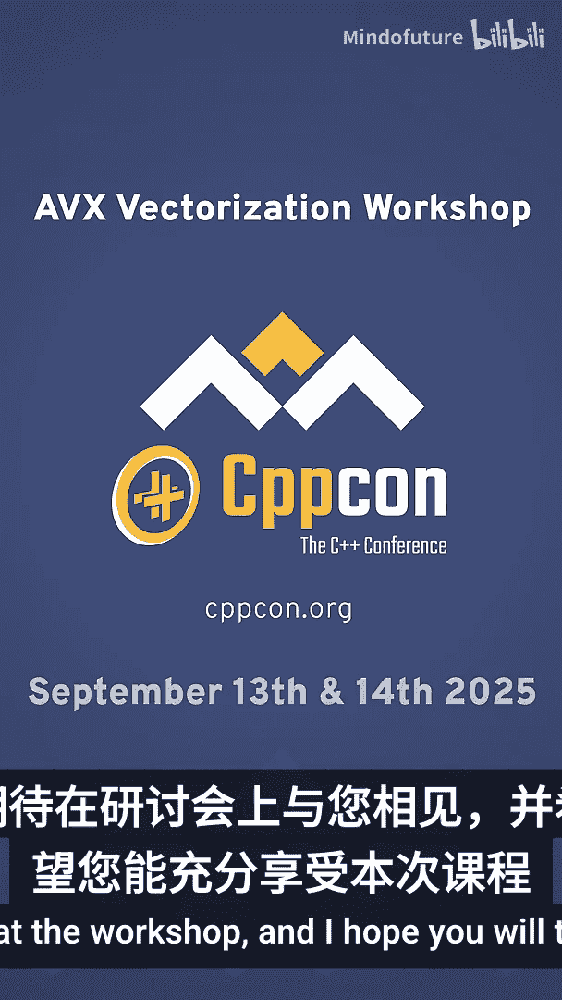
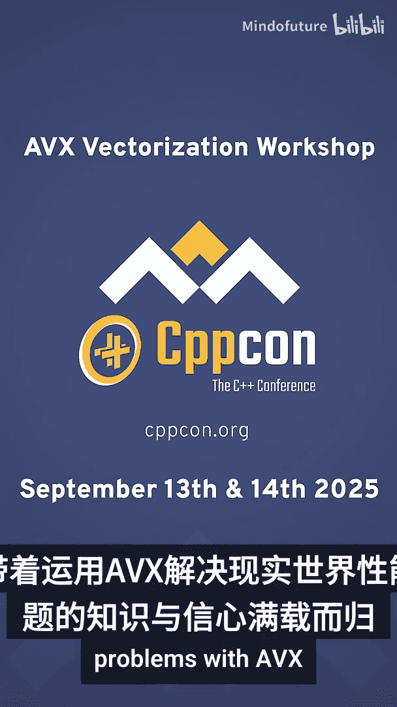

# 084：掌握AVX向量化，实现8倍性能提升

在本教程中，我们将学习如何利用现代CPU的AVX指令集进行向量化编程，以显著提升C++代码的性能。我们将从基础概念开始，逐步深入到高级优化技巧。

## 概述

现代CPU功能强大，但大多数软件仅使用了其一小部分能力。向量化是提升性能最有效的手段之一，但常被开发者忽视，原因在于其复杂性或对编译器自动优化的依赖。实际上，编译器很少能生成最优的SIMD代码。通过理解AVX内部函数，你可以在最关键代码中实现2倍、4倍甚至8倍的性能提升。这对于金融、游戏、数据中心和嵌入式系统等对性能要求极高的领域至关重要。

## 课程结构

本课程采用讲座与动手编码相结合的形式。每个主题都从清晰解释内部函数和技术开始，然后你可以在实验练习中立即应用。这种方式确保概念不流于抽象，你可以亲自编写和运行代码。

课程内容循序渐进，从AVX内部函数开始，然后介绍各种向量化模式和技术。

## 核心概念与技术

以下是本课程将涵盖的核心内容：

1.  **AVX内部函数基础**
    我们将从最基础的AVX内部函数学起，理解如何用它们操作向量数据。例如，加载数据到向量寄存器可以使用 `_mm256_load_ps` 函数。
    ```cpp
    __m256 vec = _mm256_load_ps(float_ptr);
    ```

2.  **向量化模式与技术**
    学习如何将常见的标量操作（如循环）转换为高效的向量化操作。核心思想是使用SIMD指令同时处理多个数据元素。

3.  **向量化障碍与解决方案**
    探讨阻碍编译器自动向量化的常见因素（如数据依赖、条件分支），并学习如何重构代码以消除这些障碍。

4.  **高级性能调优**
    为了达到显著的性能提升，我们需要深入高级主题：
    *   **内存子系统调优**：优化数据布局和访问模式以提升缓存效率。
    *   **打破依赖链**：重组计算以减少指令间的顺序依赖，提高指令级并行度。
    *   **避免CPU端口拥塞**：理解CPU执行单元，平衡指令混合以避免特定端口成为瓶颈。

## 目标受众与先决条件

本课程面向具备中级C或C++知识的开发者，旨在帮助你编写更快的软件。你不需要有SIMD编程经验，一切将从零开始。无论你身处金融、游戏、数据中心应用还是嵌入式系统领域，我们所涵盖的技术都能直接应用于现实世界中性能关键的软件。

## 讲师介绍

我是Ivica Bogosavljević，将主导本次AVX向量化研讨会。在过去的15年里，我专注于嵌入式系统和高性能C++编程，致力于从现代CPU中榨取每一分性能。

## 总结





在本节课中，我们一起学习了AVX向量化编程的概览、核心技术和课程结构。通过掌握这些知识，你将获得解决实际性能问题的能力和信心。希望你能充分享受学习过程，并在实践中运用这些强大的工具。期待在课程中见到你！