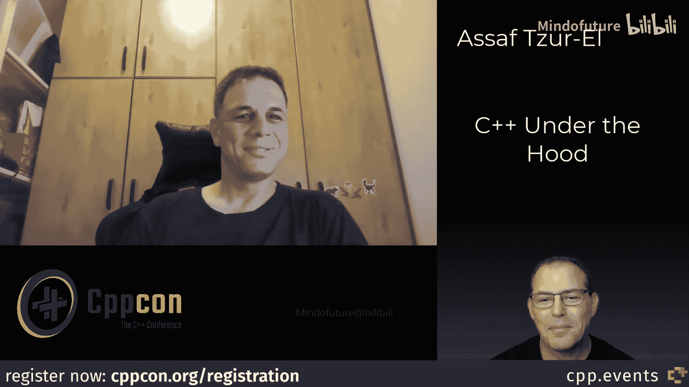
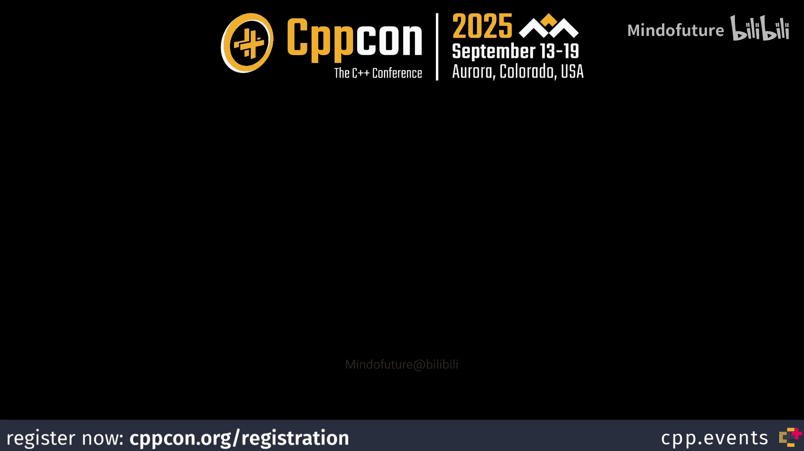

# 085：课程概述

在本节课中，我们将跟随CppCon讲师Assaf Tzur-El，一起揭开C++内存管理的“隐藏秘密”。我们将探讨从源代码到机器码的整个执行过程，理解内存布局、编译链接等底层机制，并学习如何利用这些知识编写更安全、更高效的C++代码。

## C++底层机制：P85：课程介绍与讲师背景

欢迎回来。我是Kevin Carpenter，今天与Assaf Tzur-El一起交流。我们将讨论他今年教授的C++底层机制预会议课程，他还会进行一次演讲。我很兴奋，因为这是我第一次采访Assaf，非常感谢你今天抽出时间。最近怎么样？

很好，期待这次采访。Assaf拥有丰富的经验，粗略地说有30年。他的职业生涯始于15年的开发工作，从C++开始，也涉足C#、Java等类似C的语言。15年后，他意识到自己已经为超过10家公司工作过，并开始感到厌倦。这个认识花了他15年时间。

他开始自我探索，尝试各种事情，最终发现自己转了一圈又回到了原点，但现在他成为了一名自由职业者，额头上写着“顾问”二字。这意味着他不再换工作，而是换项目，这很好。在探索期间，一位朋友问他是否愿意教授编程课程，他答应了。他热爱教学，学生们也没有太多抱怨，从此他便一直从事教学工作。他的首批课程是C++，随后也包括C#、Java、设计模式和架构等内容。教学至今已有15年，总从业经验接近31年。

除了编程，Assaf还有一个爱好：自2008年起，他自愿担任FIRST机器人竞赛（FRC）的裁判。他通常会随身携带一些相关物品。

## C++底层机制：P86：课程价值与核心内容

上一节我们介绍了讲师的背景，本节中我们来看看这门课程的核心价值与内容。理解C++的底层机制如何帮助开发者？

首先，有些知识是必须了解的。例如，栈并不存在，堆也是想象出来的，因为C++标准并未提及栈或堆。这听起来有些深奥。更有趣的是，你不能依赖在编译、运行或调试代码时学到的某些知识。另一方面，如果你了解一些底层知识，你可能会成为更好的调试者。

Assaf发布了一个关于未初始化变量的短视频预告。未初始化变量本应包含“垃圾值”，即分配这块内存之前就存在的数据。但如果你使用当今市场上的一些调试器观察，会发现这些所谓的随机位其实并不随机。这是有原因的。了解这个原因，你就能判断它是否随机。此外，虽然栈在标准中不存在，但在大多数系统中，栈是反向增长的。如果你有 `int i` 和 `int j`，`i` 的地址会在 `j` 之后。这在调试时是一个有用的知识，可以避免对此感到惊讶。

这门课程将大量使用Visual Studio进行教学，因为正如其名，它是可视化的。它可以展示许多内容，而不仅仅是讲述栈的原理，还能实际展示内存中的比特位。即使对不熟悉它的人来说也易于操作，因此鼓励学生在课堂上至少使用它。课程甚至会深入汇编语言。我们需要了解汇编，因为C++很美好，但实际运行的是操作码，我们需要意识到这一点。

这门课程可以看作是从源代码到机器在“金属”上如何运行的旅程，并使用工具来观察这一过程。我们将查看代码及其生成的汇编指令，观察内存布局和内存段（如栈和堆），并研究构建过程，包括预处理器、编译器和链接器。例如，我们将学习如何从编译器的视角看代码，因为开发者看到的是文件，而编译器只看到一个编译单元。因此，课程将涵盖运行时内容、编译时内容，甚至编辑时内容，这将是非常充实的一天。

## C++安全编程：P87：安全实践与MISRA框架

上一节我们探讨了底层机制，本节我们将转向安全编程实践。C++本质上是一种“有风险”的语言吗？Assaf的演讲涉及MISRA框架，这通常让人联想到嵌入式领域。那么，MISRA框架是否适用于所有C++项目，还是主要停留在嵌入式空间？

这是一个很好的问题。Assaf有一整个讲座是关于我们程序员的。我们的报酬不是写更多代码，而是生产高质量、可工作的软件。如果你想写更多代码，尽管去敲键盘。但如果你的目标是编写高质量的软件，就意味着有时你必须放慢速度，以避免重复劳动、回头调试，或者避免客户因为代码崩溃等问题而对你大喊大叫。

因此，我们需要一些“防护栏”，因为语言本身显然没有提供足够的防护，而它提供的一些防护（例如不允许向常量赋值）又通过 `const_cast` 等方式被削弱了。所以我们需要外部的规则。像SOLID原则、设计模式、整洁代码等概念都很好，但我们需要更严格的规则。例如，就像在幼儿园时老师告诉我们永远不要使用 `goto` 语句一样。不用 `goto` 并不是什么沉重的负担，但它能让你的代码结构更清晰，减少错误和内存分配/释放等问题。

这只是一个遵循特定规则能使你成为更好程序员、写出更好代码的小例子。理解紧密耦合的问题也是如此。早期职业生涯中，可能会自然地写出紧密耦合的代码而不自知。学习测试驱动开发（TDD）后，仅仅因为需要分离代码并编写测试用例，就能帮助你看到紧密耦合的样子、它导致的问题以及后果。因此，拥有额外的“防护栏”来帮助我们更好地工作和思考是很有益的。

## 现代C++的安全性：P88：现代特性与遗留代码挑战

上一节我们讨论了安全框架，本节我们聚焦于现代C++语言本身的安全性。如果我们使用C++17及以后的标准进行编码，例如不使用原始指针，大量使用标准库，那么C++是否还像以前那样本质上不安全？

从C++11开始，实际上使C++安全了许多，或者说为编写安全代码提供了可能。因为你可以使用智能指针等特性，再也不需要使用 `new` 了。但这只是问题的一部分，还有许多其他问题。你仍然可能在 `switch-case` 中忘记 `default` 分支，这更像是C语言的习惯。因为C++，正如Scott Meyers曾经指出的，他过去常听说C++是一门“未来在前方”的语言，大部分C++代码尚未写出。但他说他已经很久没听到这种说法了，而且是在他退休之前说的。

C++背负着很多历史包袱，有大量的遗留代码。这些代码使用 `new`，可能使用 `goto`，等等。因此，我们需要能够处理旧代码，需要与使用旧代码思维的人共事。Assaf认识一些人仍在用C++98工作。所以，我们都需要更多的“防护栏”来帮助我们写出更好的代码。这并不可耻，不像一个成年人为了更安全而去骑儿童三轮车。我们是成年人，这没关系。但如果能为我们的C++代码加上一些防护栏，他认为这是一件好事。

## 课程总结与预告

本节课中，我们一起学习了C++内存管理的核心秘密。我们从了解底层机制（如内存布局、汇编）的重要性开始，探讨了如何利用这些知识进行更好的调试。接着，我们讨论了通过MISRA等框架和编码规范为C++代码添加“防护栏”的必要性，即使在使用现代C++特性时，处理遗留代码和避免常见陷阱依然至关重要。

Assaf Tzur-El的“C++底层机制”课程将于9月14日（周日）开课，而他的演讲“编写安全C++的实用方法”则在次日（周一）。对于希望深入理解C++运行机制和提升代码安全性的开发者来说，这是绝佳的学习机会。我们期待在CppCon上相遇，继续深入探讨内存管理等话题。