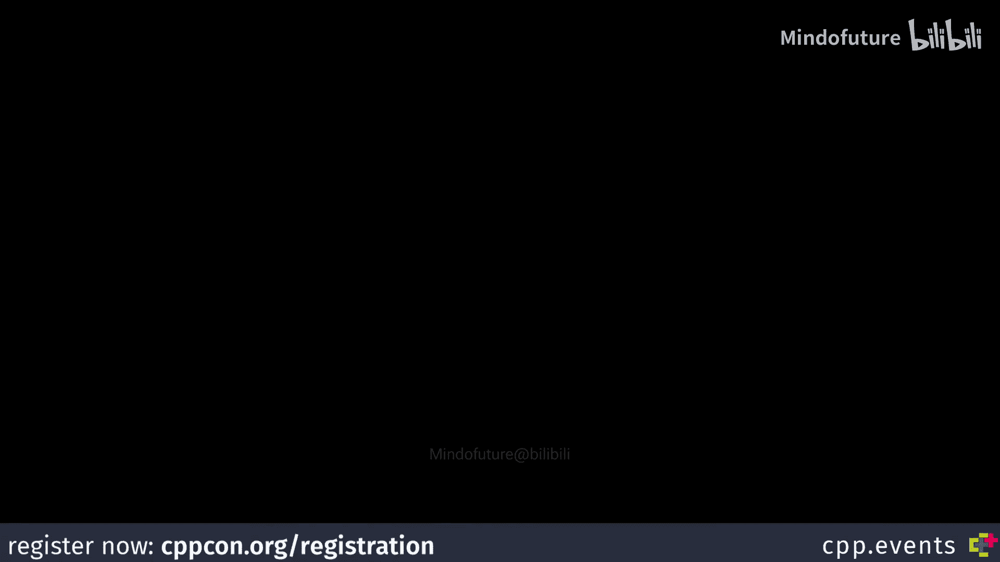
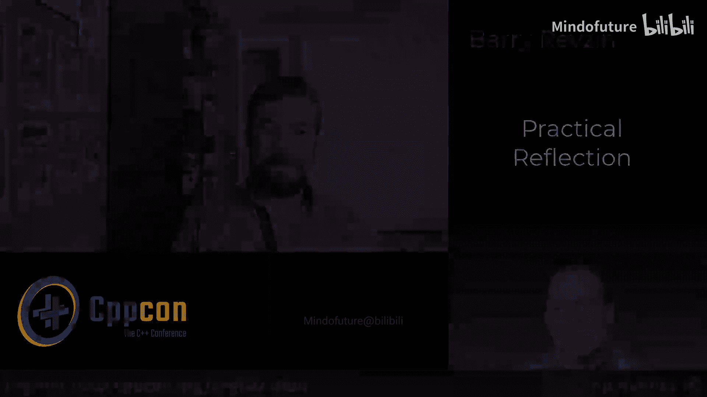
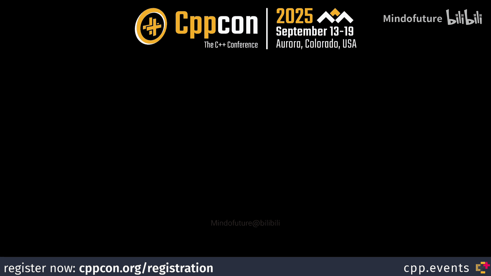

# 086：从Barry Revzin的演讲看反射的潜力

在本节课中，我们将通过整理Barry Revzin在CppCon 2025演讲中的核心观点，来了解C++反射（Reflection）这一即将到来的强大功能。我们将探讨反射如何改变我们编写代码的方式，并重点分析一个具体示例：如何利用反射轻松实现结构数组（Struct of Arrays）的数据布局转换。

## 概述：为何反射令人兴奋

C++26标准预计将引入反射功能，这被许多专家视为语言历史上最具变革性的转折点。反射允许程序在编译时检查和操作自身的结构，这将开启元编程和库设计的新纪元。

上一节我们介绍了反射的宏观意义，本节中我们来看看专家Barry Revzin分享的具体见解。

## 从Stack Overflow到标准委员会

Barry Revzin是Jump Trading的高级C++开发者，以其在Stack Overflow上的活跃解答而闻名。他参与C++标准委员会工作始于2016年，这被他视为逻辑上的下一步。通过不断解答问题，他深入理解了语言标准，并最终参与到修改和完善语言的工作中。

参与标准委员会工作是一项需要大量时间和精力的技能，就像其他技能一样，需要通过不断实践来提升。Barry早期的提案和现在的提案在结构和论证上已经有了显著进步。

## 反射的核心应用示例：结构数组（SoA）

在演讲中，Barry没有着重探讨结构数组的性能优势，而是将其作为一个展示反射能力的完美案例。结构数组是一种数据布局方式，与数组结构（AoS）相对，能更好地利用缓存，提升性能。

传统上，将代码从数组结构重构为结构数组是一项繁琐的工作，开发者需要手动重写大量代码才能验证其收益。然而，反射使得这一过程变得极其简单。

以下是反射带来的改变的核心对比：

*   **传统方式（繁琐）**：手动重写数据结构，涉及多个向量和大量代码修改。
*   **反射方式（简洁）**：可能只需一行代码更改，即可尝试新的数据布局。

Barry以Zig语言为例，说明只需将 `ArrayList<T>` 改为 `MultiArrayList<T>` 即可实现结构数组。C++反射的目标正是让这种便捷性成为现实。

通过实现这个具体示例，可以触及反射的多个方面，帮助开发者理解这套全新的“工具箱”能做什么。

## 反射的深远影响：超越序列化

很多人最初将反射与自动序列化/反序列化（如JSON）联系起来，这确实是其一个重要应用。但反射的潜力远不止于此，它可能只揭示了不到10%的可能性。

反射最令人兴奋之处在于，它允许我们以库的形式实现许多过去只能通过编译器扩展来完成的功能。这为语言特性的标准化开辟了一条新道路。

以下是反射将带来的几个关键变化：

1.  **库实现的编译器功能**：例如，扩展可作为非类型模板参数的类类型范围。目前标准只支持所有成员均为公开的类型，而利用反射，可以在库层面实现对`std::string`、`std::vector`等任意类型的支持。
2.  **降低新特性标准化门槛**：新的语言特性很难在标准化前获得广泛的使用经验。而基于反射的库则更容易被开发者采纳和使用，丰富的使用经验反过来可以有力地推动该特性成为正式的语言标准。
3.  **激发社区创新**：就像`std::meta::substitute`这样最初动机不明的函数，后来被发现是反射库中最有用的工具之一。随着编译器实现反射，成千上万的开发者将探索其可能性，必将涌现出意想不到的创新应用。

## 总结

本节课中我们一起学习了C++反射的核心前景。我们了解到，反射不仅仅是关于自动序列化的便利工具，它更是一套强大的元编程基础设施，能够：
*   极大简化特定编程模式（如数据布局转换）的实现。
*   允许以库的形式实现过去需要编译器支持的功能。
*   改变语言新特性的孵化和标准化流程。

C++26的反射功能标志着我们刚刚开始探索一个充满可能性的新领域，未来的发展令人无比期待。