# 003：利用原子操作获得乐趣与收益


## 概述

在本教程中，我们将学习C++内存模型中的不同内存排序选项，并通过一个具体的无锁环形缓冲区数据结构的性能对比，来理解不同内存排序对程序性能的实质性影响。我们将从核心概念开始，逐步深入到实现细节和性能分析。

## 核心概念与术语定义

在深入探讨具体实现之前，我们需要明确一些核心概念。无锁编程通常指避免使用互斥锁和系统调用来进行同步。更正式地说，无锁算法保证至少有一个线程总能取得进展。

以下是一个简单的计数器示例，展示了有锁和无锁实现的区别：

```cpp
// 有锁实现（可能阻塞）
std::mutex mtx;
int counter = 0;
void increment(int value) {
    std::lock_guard<std::mutex> lock(mtx);
    counter += value;
}

// 无锁实现（使用原子操作）
std::atomic<int> counter(0);
void increment(int value) {
    int expected = counter.load();
    while (!counter.compare_exchange_strong(expected, expected + value)) {
        // 如果交换失败，expected已被更新为当前值，循环继续尝试
    }
}
// 实际中更简单的写法
void increment_simple(int value) {
    counter += value; // 原子操作
}
```

无锁实现的优势在于，即使一个线程的`compare_exchange_strong`操作失败，也意味着另一个线程成功修改了计数器并取得了进展，从而提供了更强的进度保证。

## C++内存模型简介

从C++11开始，标准正式定义了内存模型，提供了多种内存排序选项。这包括：
*   **顺序一致性 (`memory_order_seq_cst`)**
*   **获取-释放 (`memory_order_acquire`, `memory_order_release`, `memory_order_acq_rel`)**
*   **宽松排序 (`memory_order_relaxed`)**

（注：`memory_order_consume`已被弃用，等同于`memory_order_acquire`）。

现代多核处理器中，每个核心都有自己的缓存，这带来了数据一致性和操作可见性的挑战。C++内存模型提供了细粒度的控制，允许程序员声明所需的内存排序约束，编译器和硬件则负责利用平台特定的原语来实现这些约束。

内存屏障（或内存栅栏）是实现这些约束的低级原语，用于限制编译器和CPU在编译时和运行时对指令的重排序。

## 深入理解内存排序

上一节我们介绍了内存模型的基本概念，本节中我们来看看三种主要的内存排序语义及其区别。

### 顺序一致性 (`memory_order_seq_cst`)

顺序一致性提供了最强的保证。在整个程序中，所有标记为顺序一致性的操作存在一个全局的总序，所有线程都同意这个顺序。这是原子操作的默认行为，也是最容易推理的，但同时也是开销最大的。

```cpp
std::atomic<int> x{0}, y{0}, z{0};
// 多个线程并发执行 ++x, ++y, ++z
// 所有线程对 x, y, z 的自增顺序达成一致
```

### 获取-释放排序 (`memory_order_acquire`/`memory_order_release`)

获取-释放排序在特定的原子变量上建立线程间的同步点。如果线程A以`release`语义向变量X写入，线程B以`acquire`语义从X中读取到A写入的值，那么线程B保证能看到线程A在写入X之前所有（在A看来）已完成的写入操作。

```cpp
std::atomic<bool> sync{false};
bool data_ready = false; // 非原子

// 线程A (生产者)
data_ready = true;              // 1. 准备数据
sync.store(true, std::memory_order_release); // 2. 发布信号


// 线程B (消费者)
if (sync.load(std::memory_order_acquire)) { // 3. 获取信号
    assert(data_ready == true); // 4. 断言成立：能看到第1步的写入
}
```


这种方式比顺序一致性更弱，但允许在未同步的线程间进行更多的优化。

### 宽松排序 (`memory_order_relaxed`)

宽松排序只提供最基本的原子性保证（读写不可分割）和单个变量的修改顺序一致性。它不建立任何线程间的同步关系，也不禁止任何重排序，因此是性能最高的模型，但也最难正确使用。

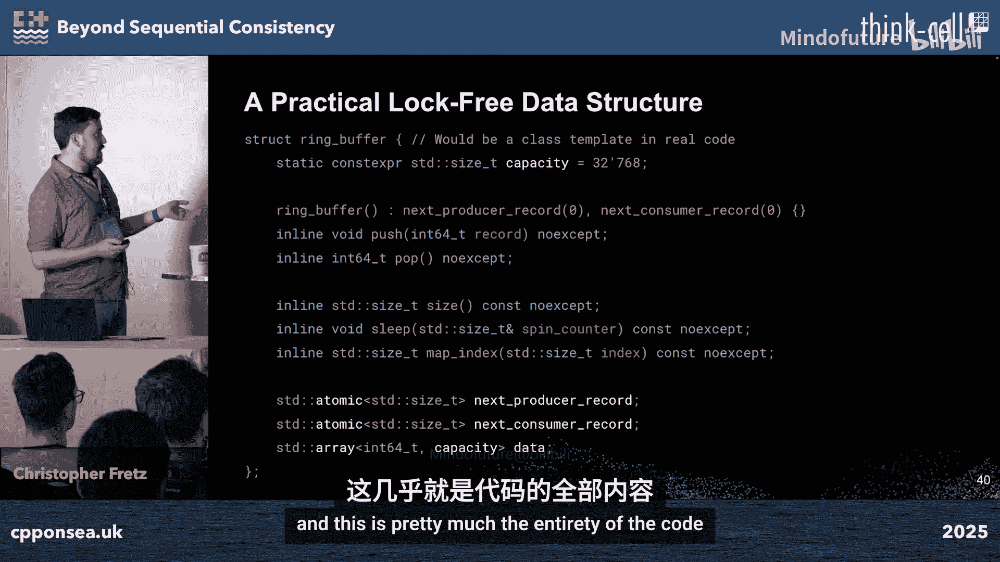

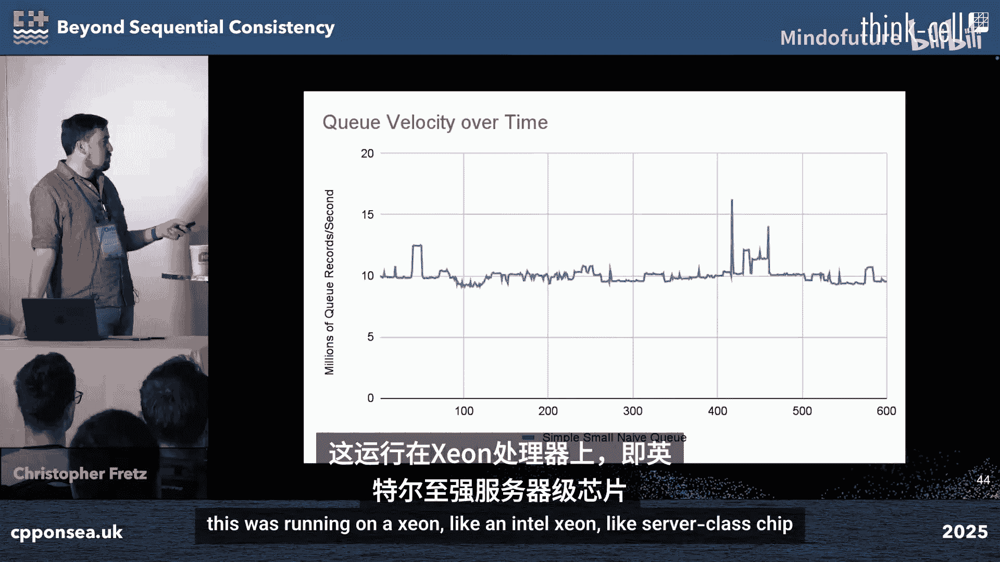

```cpp
std::atomic<int> x{0}, y{0};
// 线程A
x.store(1, std::memory_order_relaxed); // A1
int r1 = y.load(std::memory_order_relaxed); // A2

// 线程B
y.store(1, std::memory_order_relaxed); // B1
int r2 = x.load(std::memory_order_relaxed); // B2
// 结果 r1 == r2 == 0 是可能的，因为A1/A2和B1/B2可能被重排序
```

## 案例研究：无锁环形缓冲区

了解了基本概念后，我们来看一个可以应用这些内存排序的具体数据结构：无锁环形缓冲区（队列）。这是一个经典的单生产者-单消费者（可扩展至多消费者）数据结构。

### 基本设计与朴素实现

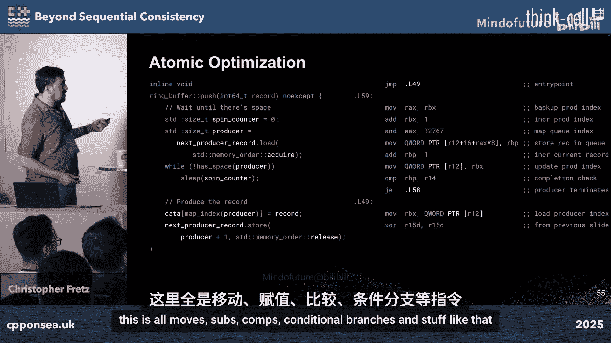


其核心思想是使用两个原子计数器：生产者索引和消费者索引，它们逻辑上指向一个“无限数组”，通过取模运算映射到有限的循环缓冲区中。索引只增不减。

以下是使用默认顺序一致性的朴素实现核心：

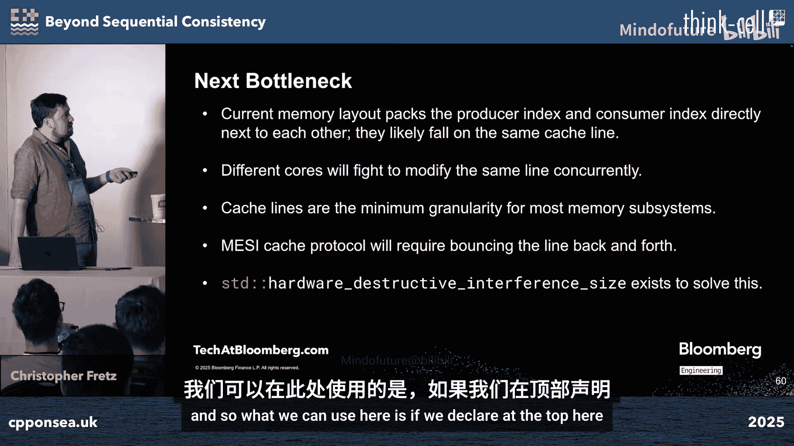

```cpp
class NaiveQueue {
    std::atomic<size_t> producer_idx{0};
    std::atomic<size_t> consumer_idx{0};
    std::array<int, CAPACITY> buffer;
public:
    bool push(int val) {
        while (size() == CAPACITY) backoff();
        buffer[map_idx(producer_idx)] = val;
        ++producer_idx; // 顺序一致性，隐含完整内存栅栏
        return true;
    }
    bool pop(int& val) {
        while (size() == 0) backoff();
        val = buffer[map_idx(consumer_idx)];
        ++consumer_idx; // 顺序一致性，隐含完整内存栅栏
        return true;
    }
private:
    size_t size() const { return producer_idx - consumer_idx; }
};
```

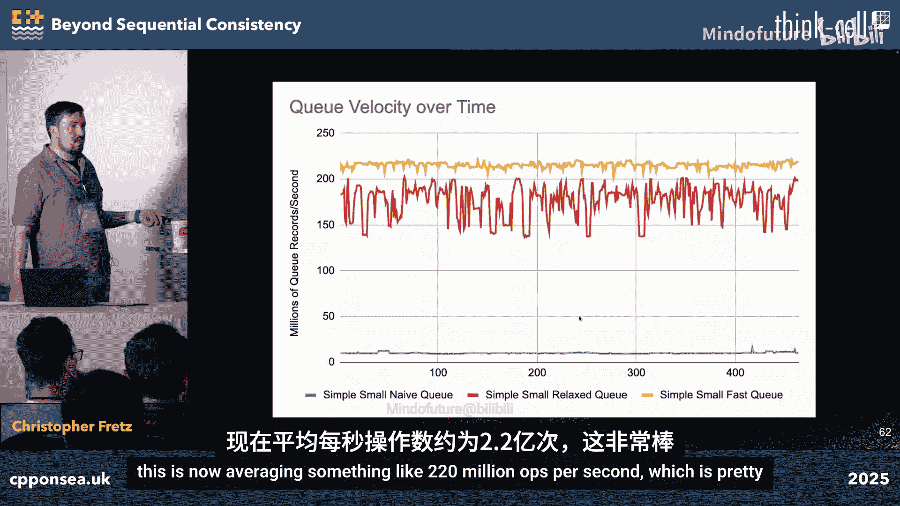


对这个队列进行基准测试（传递整数），性能大约为 **1000万次操作/秒**。分析汇编代码发现，瓶颈在于`lock add`指令（实现原子递增的读-修改-写操作），它发出了一个完整的内存栅栏。

### 优化一：使用获取-释放语义

由于生产者和消费者各自是单线程的，我们不需要全局的顺序一致性。我们只需要确保：1）数据存入缓冲区**先于**生产者索引更新（对消费者可见）；2）消费者读取索引**先于**从缓冲区读取数据。这正好匹配获取-释放语义。


优化后的实现：

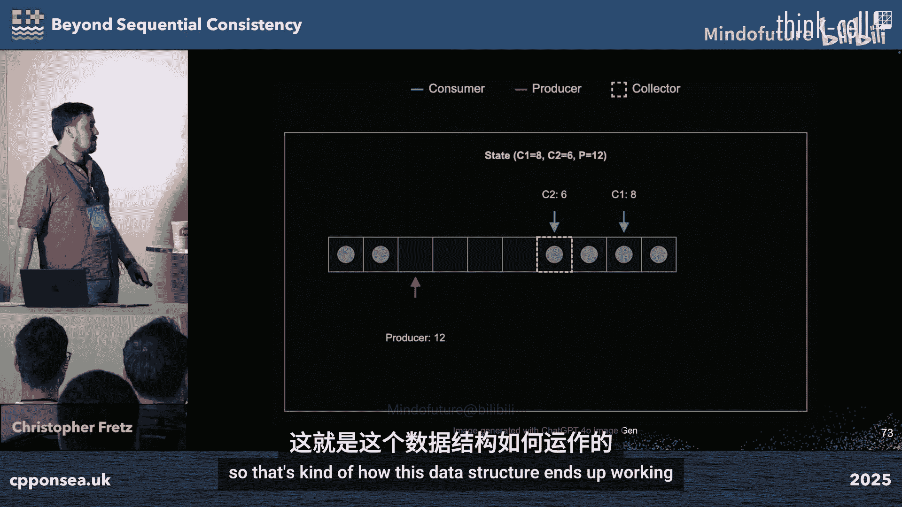

```cpp
class RelaedQueue {
    std::atomic<size_t> producer_idx{0};
    std::atomic<size_t> consumer_idx{0};
    std::array<int, CAPACITY> buffer;
public:
    bool push(int val) {
        while (size() == CAPACITY) backoff();
        buffer[map_idx(producer_idx)] = val;
        // 使用 release 语义：之前的写入（存数据）对此后以 acquire 读取本索引的线程可见
        producer_idx.store(producer_idx.load(std::memory_order_relaxed) + 1,
                           std::memory_order_release);
        return true;
    }
    bool pop(int& val) {
        while (size() == 0) backoff();
        val = buffer[map_idx(consumer_idx)];
        // 使用 release 语义：更新消费位置
        consumer_idx.store(consumer_idx.load(std::memory_order_relaxed) + 1,
                           std::memory_order_release);
        return true;
    }
private:
    // 读取对方索引时使用 acquire 语义
    size_t size() const {
        return producer_idx.load(std::memory_order_acquire) -
               consumer_idx.load(std::memory_order_acquire);
    }
};
```

在x86-64上，此优化后的实现**没有生成任何原子指令或显式内存栅栏**，因为x86架构本身就提供了较强的内存顺序保证。性能跃升至约 **1.7亿次操作/秒**，提升了**17倍**。

### 优化二：解决伪共享

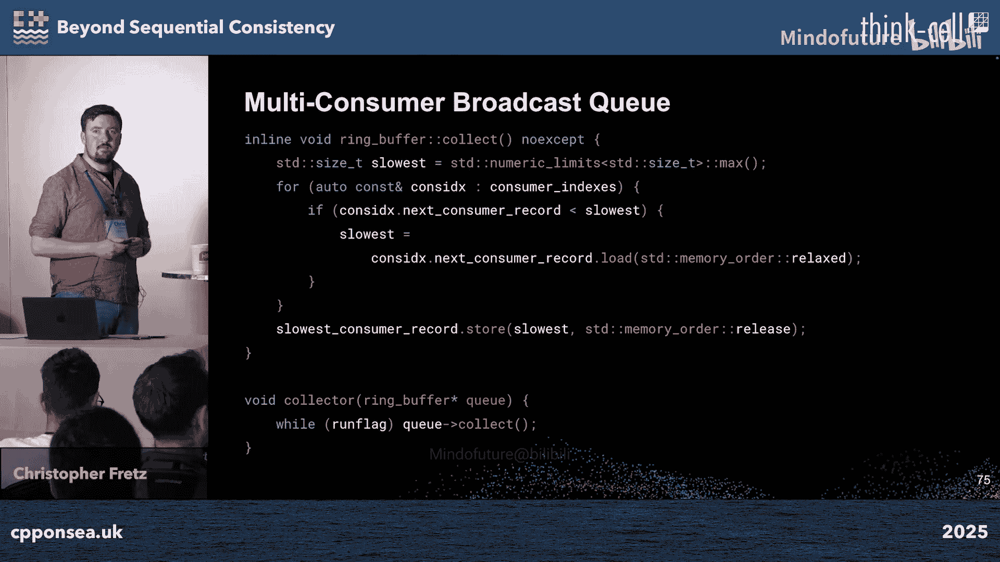

上面的两个索引很可能位于同一个缓存行（通常64字节）。当生产者和消费者在不同核心上修改它们时，会导致缓存行在核心间频繁“乒乓”，即伪共享。

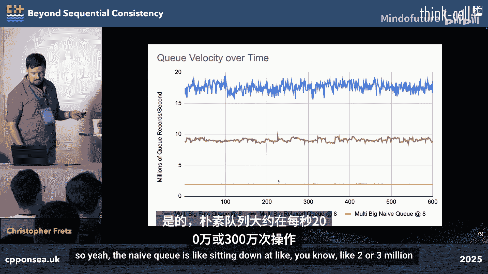

解决方案是让它们对齐到不同的缓存行：

```cpp
alignas(64) std::atomic<size_t> producer_idx{0};
alignas(64) std::atomic<size_t> consumer_idx{0};
```

仅此一项改动，性能进一步提升了约20%，达到约 **2.2亿次操作/秒**。

### 性能趋势与扩展性

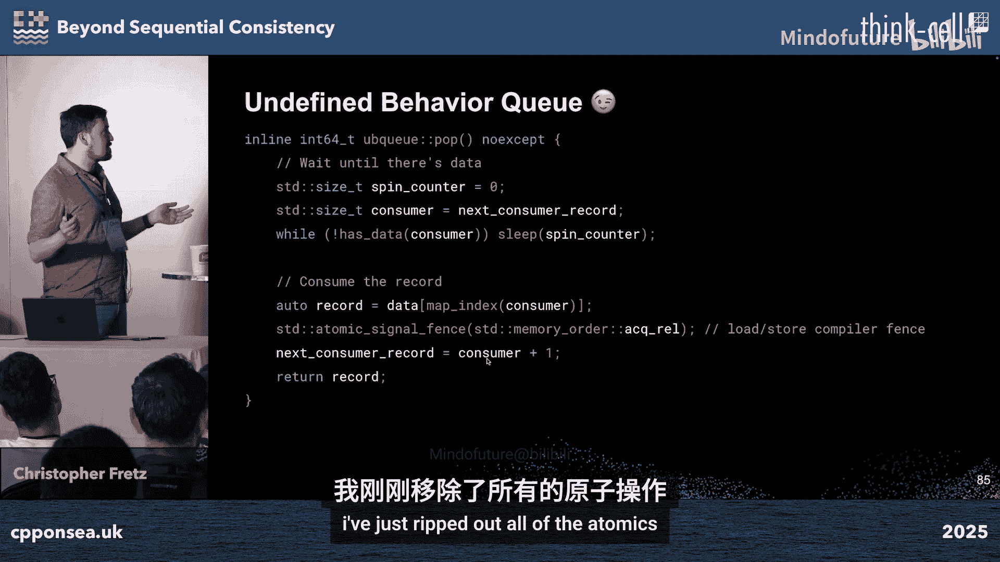

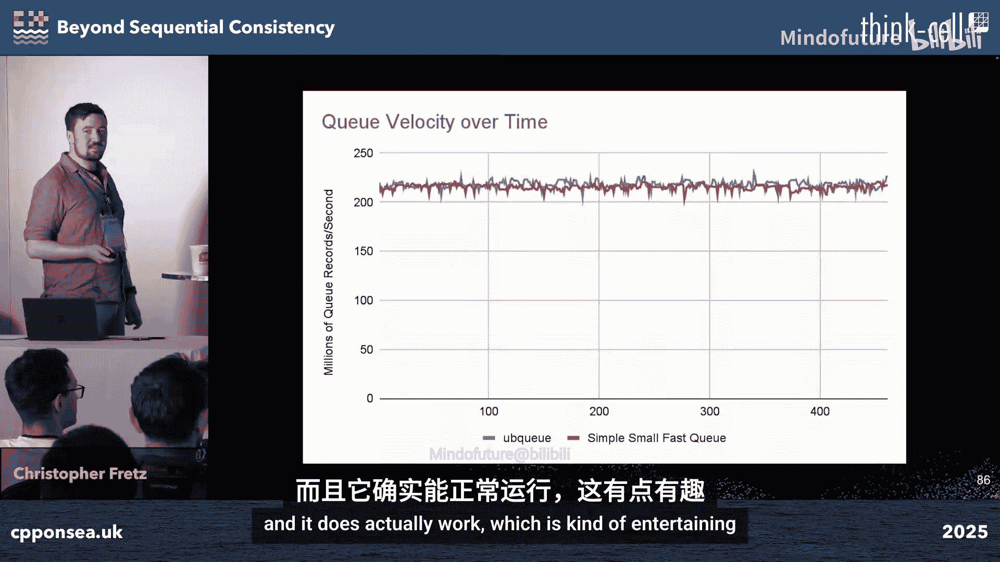

我们测试了传递不同大小数据记录时的性能：
*   **64字节**： 优化队列速度是朴素队列的 **7倍**
*   **128字节**： **5倍**
*   **256字节**： **2倍**
*   **1024字节**： 优化队列仍快 **25-30%**，此时内存复制成为主要开销。

将队列扩展为**单生产者-多消费者广播队列**（每个消费者有自己的索引，一个“收集者”线程跟踪最慢的消费者索引供生产者参考）后，在32个线程的场景下，优化版本（获取-释放+缓存行对齐）相比朴素版本仍有**5倍的性能提升**。同时，伪共享在多线程环境下成为更主导的性能因素。

### 跨平台考量


一个有趣的现象是，在x86-64上，获取-释放语义的优化实现没有产生任何栅栏指令。如果我们激进地尝试完全不用`std::atomic`，而使用`volatile`加编译器屏障，在x86上也能工作且性能相同。


```cpp
// 未定义行为！切勿在生产中使用！
volatile size_t producer_idx{0};
volatile size_t consumer_idx{0};
// ... 在 push/pop 关键位置使用 std::atomic_signal_fence 作为编译器屏障
```


然而，在ARM64架构上，这种“投机取巧”的代码会立即失败。因为ARM属于弱内存序架构，需要显式的`LDAR`（加载-获取）和`STLR`（存储-释放）指令来保证必要的顺序。这正是`std::atomic`配合`memory_order_acquire/release`所保证的——它在所有平台上都能生成正确的代码。

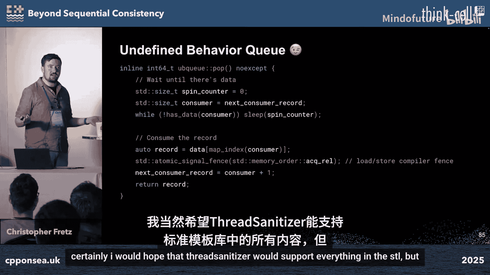

在ARM平台（Apple M3）上的测试表明，即使对于64字节的记录，从顺序一致性优化到获取-释放排序，仍能带来**超过100%** 的性能提升。


### 进阶优化：缓存索引

一个更极致的优化是为生产者和消费者引入对方索引的**缓存副本**。这些缓存副本仅在需要等待（队列空或满）时才从真正的原子索引更新。

```cpp
class CacheOptimizedQueue {
    alignas(64) std::atomic<size_t> producer_idx{0};
    alignas(64) size_t producer_cached_consumer_idx{0}; // 消费者索引的本地缓存
    alignas(64) std::atomic<size_t> consumer_idx{0};
    alignas(64) size_t consumer_cached_producer_idx{0}; // 生产者索引的本地缓存
    // ... 其他成员
};
```

这样，在大部分情况下，生产者和消费者都只访问自己核心上的本地缓存变量，彻底消除了核心间缓存一致性的通信开销。在极端优化的微基准测试中（处理小数据），这带来了近**3倍**的额外性能提升，使每秒操作数达到惊人的**6亿次**。当然，在真实的、有其他工作负载的应用中，这种程度的提升可能难以完全复现。

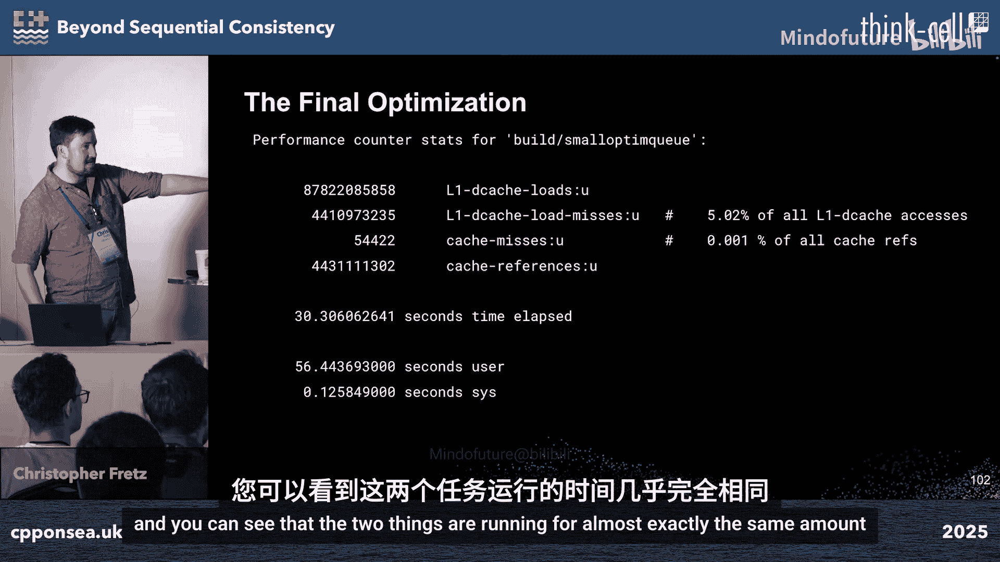

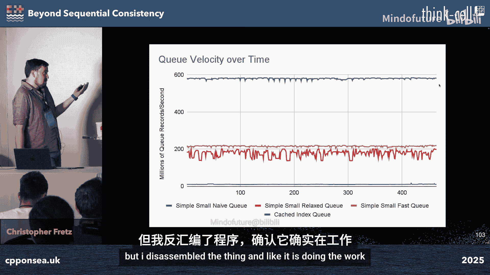

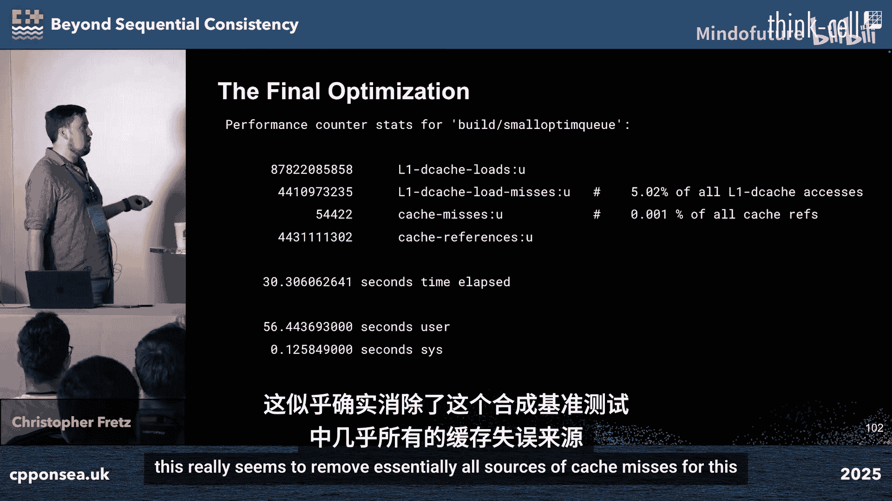

## 总结与核心要点

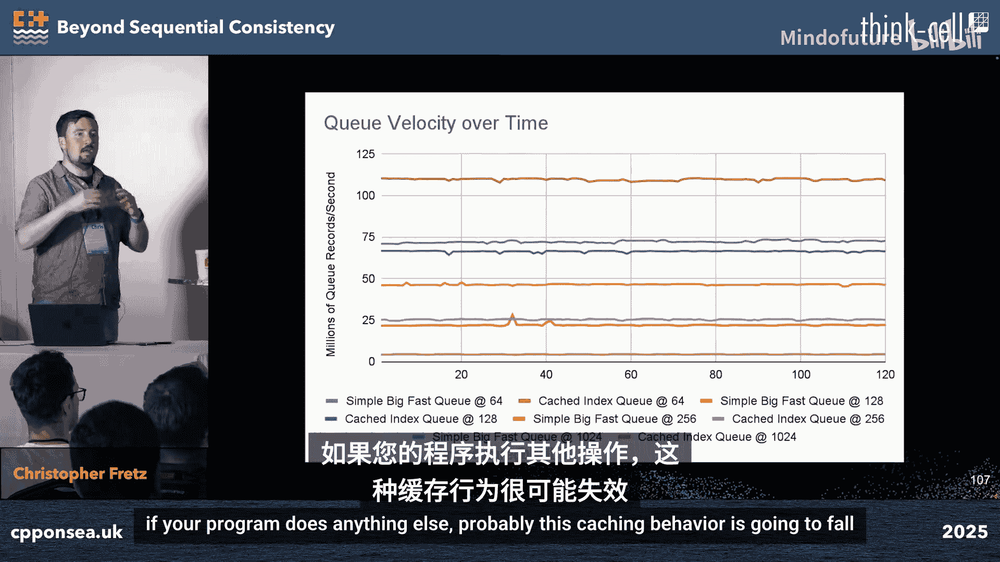


本节课中我们一起学习了C++内存模型和原子操作的高级用法。我们来总结一下关键点：

1.  **正确选择内存排序至关重要**： 使用最符合算法需求的、最弱但足够的内存排序，可以带来巨大的性能收益（在本例中高达17倍）。
2.  **警惕伪共享**： 将频繁被不同线程修改的、无关的数据隔离到不同的缓存行中，是多线程性能优化的关键步骤。
3.  **平台差异显著**： x86是强内存序架构，而ARM、PowerPC等是弱内存序架构。`std::atomic`和标准内存模型保证了代码在所有平台上的正确性，避免了自己尝试使用`volatile`等非标准手段带来的未定义行为和平台依赖。
4.  **基准测试是金科玉律**： 性能特性常常出人意料，且高度依赖于具体的使用场景、数据大小和硬件。必须进行测量。
5.  **无锁编程复杂度高**： 它提高了正确性证明、维护和测试的难度。应在确实需要其提供的进度保证或低延迟特性时才考虑使用。
6.  **标准库是你的朋友**： C++标准内存模型设计精良，通常比自己尝试钻平台空子更安全、更可移植。


通过这个从理论到实践，从简单到复杂的案例，我们希望你能更深刻地理解如何利用C++的内存排序工具，在保证正确性的前提下，最大限度地挖掘硬件性能。