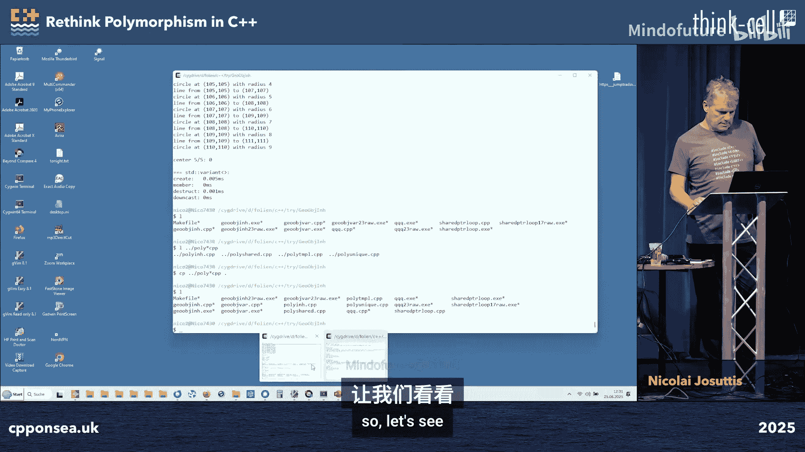
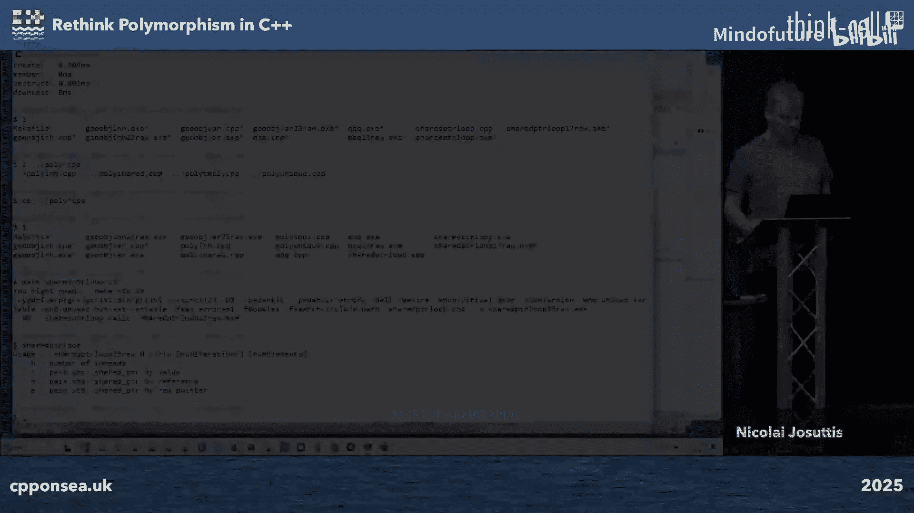
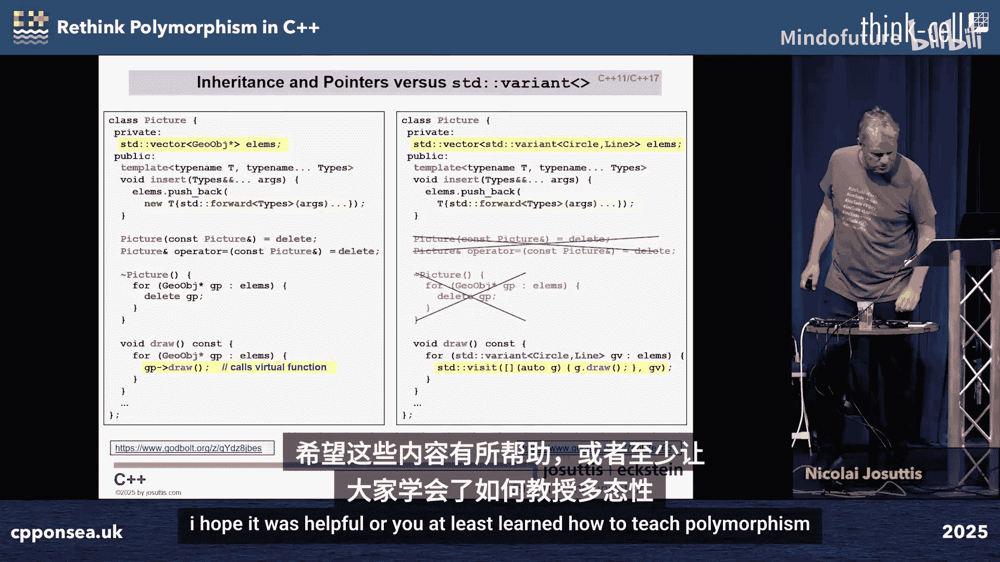

# 005：重新思考 C++ 中的多态性 🧬


在本节课中，我们将要学习 C++ 中多态性的不同实现方式。多态性是指一个接口可以有多种实现，在编程中，它允许我们在运行时或编译时决定调用哪个函数。我们将探讨传统的基于继承的运行时多态、使用智能指针的管理方式，以及使用 `std::variant` 的现代值语义多态，并分析它们各自的优缺点。

## 什么是多态性？ 🤔

多态性意味着“一个事物可以具有多种形态”。例如，“关闭”这个词可以表示关门、关闭文件或结束会议，其具体含义取决于上下文。在编程中，多态性允许我们根据上下文调用不同的函数。

在 C++ 中，最经典的多态性实现是通过虚函数和继承。

## 传统的运行时多态：虚函数与继承 🏛️

上一节我们介绍了多态性的概念，本节中我们来看看 C++ 中最经典的多态实现方式。

我们通过一个抽象基类来定义接口，然后派生出具体的类来实现这些接口。

```cpp
class GeometricObject {
public:
    virtual void draw() const = 0; // 纯虚函数，定义接口
    virtual ~GeometricObject() = default; // 虚析构函数
};

class Circle : public GeometricObject {
public:
    void draw() const override {
        // 绘制圆的实现
    }
};

class Line : public GeometricObject {
public:
    void draw() const override {
        // 绘制线的实现
    }
};
```

这种方法的优势在于，我们可以创建异构集合（即包含不同类型对象的容器），并通过基类指针或引用来统一操作它们。

```cpp
std::vector<GeometricObject*> picture;
picture.push_back(new Circle());
picture.push_back(new Line());

for (auto obj : picture) {
    obj->draw(); // 运行时决定调用 Circle::draw 还是 Line::draw
}
```

然而，这种方法存在一个根本问题：对象生命周期管理。在上面的例子中，`picture` 存储的是原始指针，我们需要手动管理这些在堆上分配的对象的生命周期，这容易导致内存泄漏或悬垂指针。

## 管理对象生命周期：RAII 与智能指针 🛡️

上一节我们看到了使用原始指针管理多态对象带来的问题，本节中我们来看看如何利用 RAII（资源获取即初始化）原则和智能指针来安全地管理资源。

RAII 是 C++ 的核心思想之一，它利用对象的构造函数获取资源，并利用析构函数自动释放资源。智能指针（如 `std::shared_ptr` 和 `std::unique_ptr`）是 RAII 的典型应用。

以下是使用 `std::shared_ptr` 的示例：





```cpp
using GeoPointer = std::shared_ptr<GeometricObject>;
std::vector<GeoPointer> picture;

picture.push_back(std::make_shared<Circle>());
picture.push_back(std::make_shared<Line>());

// 无需手动 delete，当 picture 离开作用域或 clear 时，对象会自动销毁
```

`std::shared_ptr` 通过引用计数自动管理内存，但它也带来了性能开销，特别是在多线程环境下复制 `shared_ptr` 时，需要对引用计数进行原子操作，这可能成为性能瓶颈。

`std::unique_ptr` 则提供了独占所有权的语义，它禁止拷贝，只能移动，因此没有引用计数的开销，但这也限制了它的使用场景（例如不能直接用于需要拷贝的容器初始化列表）。

## 另一种思路：编译时多态与值语义 🧩

上一节我们讨论了使用智能指针管理运行时多态对象，本节中我们来看看一种不同的范式：使用 `std::variant` 实现的、基于值语义的编译时多态。

`std::variant` 是一个类型安全的联合体，它可以持有其声明类型列表中的任何一种类型的值。这允许我们在不使用继承和虚函数的情况下，实现多态行为。

首先，我们定义具体的类，它们不需要继承自同一个基类：

```cpp
class Circle {
public:
    void draw() const { /* ... */ }
};

class Line {
public:
    void draw() const { /* ... */ }
};
```

然后，我们使用 `std::variant` 来定义一个可以容纳这些类型的容器：

```cpp
using GeoVariant = std::variant<Circle, Line>;
std::vector<GeoVariant> picture;

picture.push_back(Circle{});
picture.push_back(Line{});
```

要调用 `draw` 函数，我们需要使用 `std::visit` 和一个访问者（visitor）。访问者通常是一个泛型 lambda，它为 `variant` 可能持有的每一种类型提供处理逻辑：

```cpp
// 使用泛型lambda作为访问者
auto drawVisitor = [](const auto& shape) {
    shape.draw(); // 编译器会为 Circle 和 Line 分别生成代码
};

for (const auto& geoObj : picture) {
    std::visit(drawVisitor, geoObj); // 根据实际类型调用对应的 draw
}
```

这种方法的好处包括：
*   **值语义**：对象存储在容器内部，无需堆分配和指针，避免了内存泄漏和悬垂指针。
*   **内存局部性**：对象在内存中连续存储，有利于缓存。
*   **无虚函数开销**：函数调用在编译时确定，可能被内联优化。
*   **类型安全**：`variant` 明确知道其可能持有的类型集合。

其缺点包括：
*   **封闭的类型集合**：`variant` 的类型列表必须在编译时确定，无法像继承那样在运行时动态扩展新的派生类型。
*   **对象大小**：`variant` 的大小是其所能容纳的最大类型的大小，对于小型类型可能造成空间浪费。
*   **必须重新编译**：添加新类型需要修改 `variant` 的类型列表并重新编译所有使用它的代码。

## 性能考量与教学思考 ⚖️

上一节我们介绍了使用 `variant` 的值语义多态，本节中我们来简单比较一下性能，并思考对于初学者而言的最佳教学路径。

简单的性能测试表明，对于创建、移动、向下转换和销毁等操作，使用 `std::variant` 的方案通常比基于继承和智能指针的方案更快，尤其是在析构和向下转换时，优势可能非常明显。这是因为 `variant` 避免了动态内存分配、虚函数表查找和引用计数的原子操作。

然而，性能并非唯一的考量因素。两种方案在 API 设计、扩展性和易错性上各有千秋。

那么，在教学中应该先教哪一种呢？
*   **先教继承和虚函数**：这是经典的 OOP 范式，被众多语言广泛采用，有助于建立面向对象的基础概念。但其资源管理复杂，容易出错。
*   **先教 `variant` 和值语义**：更符合现代 C++ 强调安全、简单和性能的趋势。它绕开了令初学者头疼的指针和内存管理问题，但概念上可能更新颖。

没有绝对的答案。一种可能的路径是：先介绍基于 `variant` 的简单、安全的多态，让初学者快速上手并建立信心；然后再深入讲解继承、虚函数和智能指针，解释其原理、适用场景以及需要警惕的陷阱。

## 总结 📚

本节课中我们一起学习了 C++ 中多态性的多种实现方式。

1.  **传统的运行时多态**：通过虚函数和继承实现，灵活但需要手动管理对象生命周期，容易出错。
2.  **使用智能指针管理的多态**：利用 `std::shared_ptr` 或 `std::unique_ptr` 自动管理内存，提高了安全性，但 `shared_ptr` 可能带来性能开销，`unique_ptr` 则限制了拷贝语义。
3.  **基于 `std::variant` 的值语义多态**：一种现代替代方案，使用封闭的类型集合和 `std::visit`，提供值语义、内存安全性和潜在的性能优势，但类型集合必须在编译时确定。




每种方法都有其适用的场景。理解这些不同的工具及其权衡，有助于我们根据具体需求（如性能、安全性、扩展性）选择最合适的多态实现策略。对于现代 C++ 开发，将 `std::variant` 纳入你的工具箱，无疑是明智之举。