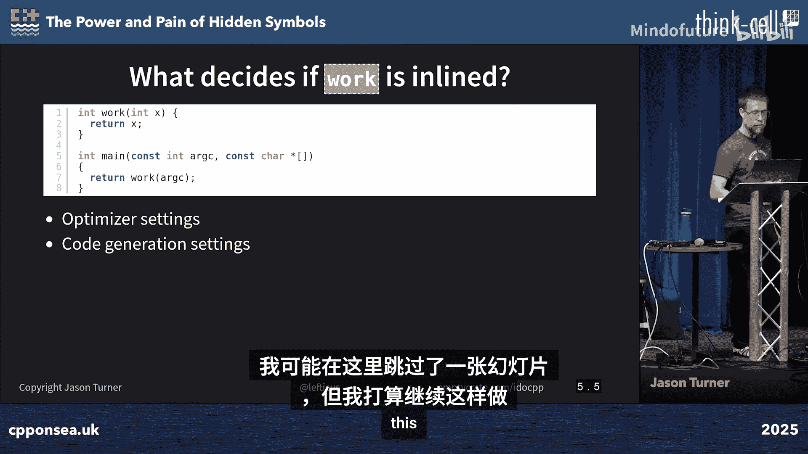
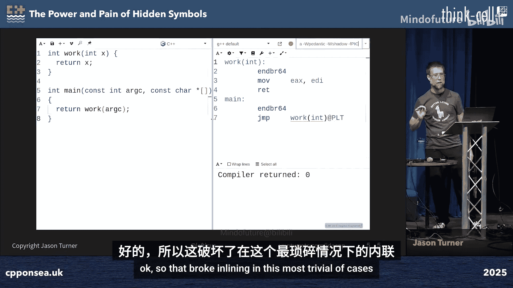
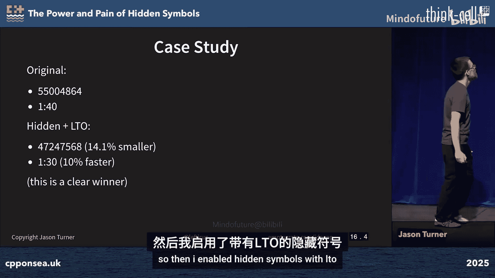
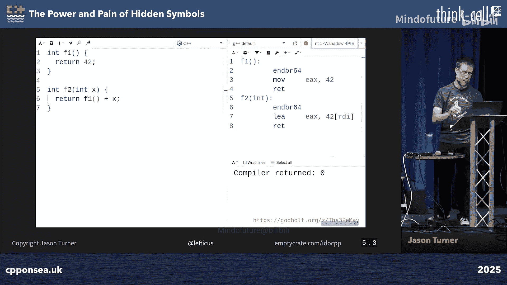

# 007：隐藏符号的力量与痛苦


在本教程中，我们将探讨C++编程中一个常被忽视但至关重要的主题：符号的可见性管理。我们将学习如何通过隐藏符号来优化二进制文件大小、提升运行时性能，并构建更健壮的API接口。同时，我们也会了解这一实践可能带来的挑战。

## 概述：符号可见性的重要性

在构建共享库时，默认情况下，编译器会将所有函数和变量符号导出到最终的二进制文件中。这可能导致不必要的符号暴露，增加二进制文件大小，并阻碍编译器进行跨翻译单元的优化（如内联）。本节将介绍如何通过控制符号可见性来解决这些问题。

## 符号可见性基础

### 内联函数与静态函数

上一节我们介绍了符号可见性的基本概念。本节中，我们来看看内联（`inline`）和静态（`static`）关键字对符号处理的影响。

**内联函数** 意味着编译器可能会将函数体直接插入到每个调用点，而不是生成一个独立的函数调用。这可以减少函数调用的开销，并可能使二进制文件更小。

```cpp
inline int add(int a, int b) {
    return a + b;
}
```

**静态函数**（或在匿名命名空间中的函数）意味着该符号的链接性是内部的。每个翻译单元（`.cpp`文件）都会获得该函数的一个私有副本，这些副本在链接时不会合并。





```cpp
static void helper() { /* ... */ }
// 或
namespace {
    void helper() { /* ... */ }
}
```

以下是关键区别：
*   **内联定义**：在多个翻译单元中定义时，链接器会合并为一个定义。
*   **静态/匿名命名空间定义**：每个翻译单元保留自己的独立副本，可能导致代码膨胀。

### 控制符号导出（Windows示例）

在Windows平台上开发共享库（DLL）时，开发者通常使用 `__declspec(dllexport/import)` 来显式控制哪些符号是公开的API。

```cpp
// 常见的跨平台宏示例
#ifdef _WIN32
    #ifdef MYLIB_BUILDING
        #define MYLIB_API __declspec(dllexport)
    #else
        #define MYLIB_API __declspec(dllimport)
    #endif
#else
    #define MYLIB_API // 对于GCC/Clang，通常先留空
#endif

class MYLIB_API MyClass {
    // ...
};
```

这种模式强制开发者思考接口边界，但传统上在Unix/Linux平台（使用GCC/Clang）中并未广泛应用。

## 隐藏符号的力量：最佳实践

### 默认隐藏，显式导出

上一节我们看到了Windows的实践。本节中我们来看看如何将其理念应用到GCC/Clang编译链中，以获得最佳效益。

核心策略是：**编译共享库时，默认隐藏所有符号，只显式导出那些构成公共API的符号。**

这可以通过编译器和源码属性实现：

1.  **编译器标志**：使用 `-fvisibility=hidden`。
2.  **源码属性**：使用 `__attribute__((visibility("default")))` 标记需要导出的符号。

更新之前的跨平台宏以支持此功能：

```cpp
#ifdef _WIN32
    // ... Windows部分保持不变
#else
    #define MYLIB_API __attribute__((visibility("default")))
#endif
```

并在编译共享库时添加 `-fvisibility=hidden` 标志。

### 带来的优势

以下是采用“默认隐藏”策略的主要好处：
*   **更小的二进制文件**：未导出的内部辅助函数和变量不会出现在动态符号表中，减少了文件大小。
*   **更多的内联优化**：编译器知道隐藏符号不会被外部覆盖，因此更积极地进行内联优化。
*   **更清晰的API**：公共接口被明确界定，降低了用户误用内部实现细节的风险。
*   **更快的加载时间**：动态链接器需要处理的符号更少。

## 隐藏符号的痛苦：挑战与陷阱

### 未被导出的依赖项

隐藏符号的主要挑战在于确保所有**必要的**符号都被导出。这不仅仅是直接公开的函数，还包括其**传递依赖**。

例如，如果公共API抛出或返回一个自定义类型，那么这个类型本身也必须被导出，否则在运行时链接时会发生错误。

```cpp
// 自定义异常类型 - 必须导出！
class MYLIB_API MyException : public std::exception { /* ... */ };

MYLIB_API void publicFunc() {
    // ...
    throw MyException("error"); // 如果MyException未导出，链接/运行时会出错
}
```



### 与测试的交互

如果单元测试代码需要链接到内部函数（例如为了白盒测试），而这些函数已被隐藏，测试将无法链接。解决方案包括：
*   将测试需要的内部函数也放入公共API（不理想）。
*   为测试构建专门版本，放宽符号隐藏策略。
*   将测试作为库本身的一部分进行编译（静态链接）。

### 与链接时优化（LTO）的协同

链接时优化（Link Time Optimization, LTO）允许编译器在链接阶段查看整个程序，进行跨翻译单元的优化，如内联和死代码消除。



当与隐藏符号结合使用时，效果更佳。编译器可以确信隐藏符号不会被外部修改，从而进行更激进的跨模块优化。


**启用LTO可能暴露潜在的ODR（单一定义规则）违规**，例如在不同翻译单元中同一符号有不同定义。这虽然是个“痛苦”，但有助于发现隐藏的bug。

## 实战案例与性能收益

在一个大型能源模拟项目（EnergyPlus）中应用此策略：
1.  仅修改宏，在GCC/Clang端添加 `__attribute__((visibility("default")))` 并启用 `-fvisibility=hidden`。
2.  **结果**：二进制文件大小减少6.2%，运行时性能提升3%。
3.  结合LTO后，性能提升达到10%。

这个案例表明，对于已经做好跨平台接口管理的项目，启用符号隐藏可以带来显著的免费性能提升。

## 总结与核心要点

本节课中我们一起学习了C++中管理符号可见性的强大技术和相关注意事项。

以下是关键行动要点：
*   **主要应用于共享库**：此技术对动态库收益最大。
*   **从 `-fvisibility=hidden` 开始**：使所有符号默认隐藏。
*   **显式导出公共API**：使用 `__attribute__((visibility("default")))` 或类似机制。
*   **启用链接时优化（LTO）**：与隐藏符号结合，获得最大性能收益。
*   **小心传递依赖**：确保异常、返回值类型等依赖项也被正确导出。
*   **利用工具**：使用CMake等构建工具可以简化跨平台符号导出管理。


通过有意识地管理符号可见性，开发者可以构建出更高效、更健壮且更易于维护的C++库。