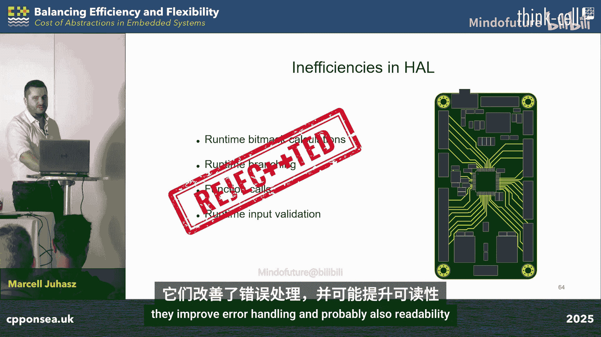

# 009：嵌入式系统中抽象的成本

在本课程中，我们将探讨在资源受限的嵌入式系统中使用C++高级特性（如封装、继承和多态）所带来的成本。我们将从最底层的硬件抽象层（HAL）入手，分析这些抽象对二进制大小和运行时性能的实际影响，并学习如何利用C++的现代特性（如模板、概念和编译时计算）来编写高效且可维护的嵌入式代码。

## 自我介绍

我的名字是Marcel Juhasz，拥有维也纳技术大学嵌入式系统硕士学位，使用C++超过七年，近年来主要专注于嵌入式系统领域。我的主要兴趣在于将C++应用于资源受限的环境。

我的联系方式如上图所示。如果您对这个演讲感兴趣，相关的完整项目已发布在我的GitHub上，欢迎查看。

我在T工程公司担任嵌入式软件开发工程师。我们是一家全球性的创新服务提供商，致力于将客户的想法转化为产品与商业模式。如果您有兴趣合作或需要项目帮助，欢迎通过上图信息联系我们。

## 研究动机

既然这是一个C++会议，我们都喜欢C++，那么您会同意我的观点：C++提供了许多强大且多功能的特性。有些特性是我们嵌入式开发者不可或缺的，有些特性是我们不被允许使用的，还有一大批特性在社区中经常引发争论，每个人都有自己的看法。

有些人认为C语言已经达到了效率的极限，而C++因其抽象性带来了固有的运行时开销。另一些人则持完全相反的观点。因此，有时很难决定哪些特性可以使用，哪些应该避免。

然而，有一点是明确的：当谈论嵌入式系统时，最关键的因素之一就是开销——内存使用和运行时性能方面的开销。因为对于某些嵌入式系统应用而言，可用内存和执行时间都是有限的资源。

为了澄清这些误解，我着手研究这个问题。通过这项研究和准备本次演讲，我获得了一些有价值的见解。我希望本次演讲也能为您提供一些有价值的知识。

## 嵌入式系统视角

首先，必须指出，本主题将从嵌入式系统的角度进行讨论。我希望尽可能接近底层地使用C++，并尽可能靠近硬件地观察抽象的效果。

因此，我将主要关注硬件抽象层（HAL），因为这是直接位于微控制器之上的层。我们将主要关注封装、继承和多态。同时，我们也将识别当前硬件抽象层实现中的低效之处，并学习如何利用C++的一些更高级特性来处理这些低效问题。

## 研究方法论

接下来，我想谈谈研究方法，包括我在研究过程中使用的设置、工作流程和测量指标。

我首先从源代码开始，这大概不会让您感到意外。我使用提供的硬件抽象层，用C语言实现了一些功能，然后开始向代码库中引入C++，逐步添加抽象。

在分析抽象效果时，我认为能够孤立地分析它们非常重要。因此，最佳做法是尽可能保持原始代码库不变，只更改绝对必要的代码部分。

我获取源代码，为STM32微控制器进行交叉编译，并针对大小进行优化（因为大小通常是受限资源）。在此步骤中，我还可以测量编译时间。

编译完成后，评估二进制文件大小就相当直接了。一方面，我查看了反汇编的二进制文件，以了解微控制器上实际执行了什么。通过这种方式，我可以从分析角度获得关于运行时性能的宝贵见解。

为了获得实证结果，我将固件烧录到目标设备上，在目标上执行固件，并测量执行时间。我将主要关注二进制文件大小和运行时性能，因为这两者通常是某些嵌入式系统应用中受限的资源。有些微控制器的闪存容量低至16KB甚至更低。至于运行时性能，某些项目可能存在实时性要求，但即使没有这些要求，通常也需要尽可能短的反应时间。

## 基准固件

一个非常重要的概念是“基准固件”，因为它将作为二进制文件大小和反汇编二进制文件的比较基准。我简单地将基准固件定义为一个绝对最小的嵌入式项目，仅包含一个带有空无限循环的`main`函数。

然而，嵌入式工程师可能最清楚，`main`函数并不是应用程序的真正入口点。首先执行的是启动脚本，这通常用汇编语言编写，负责定义向量表、设置堆栈指针、在闪存和RAM之间复制数据、初始化全局和静态变量、调用静态构造函数，最终调用`main`函数。

对于任何嵌入式系统项目，第三个非常重要的部分是链接脚本，它基本上指定了应用程序的内存布局。

正如您所见，即使在调用`main`函数之前，也发生了很多事情。对于一个`main`函数基本什么都不做的空项目，C和C++的二进制文件大小都已经在2KB左右。

## 硬件抽象层示例

在开始构建抽象层之前，我们需要确定可以有用且有意义地集成这些抽象的合适位置。

因此，我想快速浏览一个硬件抽象层的示例实现，向您展示它们今天是如何实现的。

硬件抽象层提供了数据结构。我们作为嵌入式开发者，可以根据必要的配置实例化并填充这些数据结构。然后，我们可以使用这些数据结构，调用硬件抽象层函数，并将这些数据结构作为参数传递给这些函数。

这些函数接收我们填充的数据结构，进行一些初始输入验证，然后分支并执行必要的计算。硬件抽象层为我们做的最重要的事情之一，就是隐藏了实际寄存器操作的复杂性。正如您所见，硬件抽象层充满了此类寄存器操作。对于这些操作，硬件抽象层会计算必要的位掩码，这些位掩码的计算也基于我们刚刚传递的已填充数据结构。

## 构建抽象层

现在我们对处理的对象有了概念，可以跳入本次演讲的主题，开始构建抽象层。

问题是微控制器是否包含源代码或作为二进制可执行文件的程序？答案是它位于内存中。它不像FPGA，它是一个微控制器。当我们编译项目时，我将固件加载到闪存中，微控制器就开始从内存中读取并执行指令。

正如您所见，硬件抽象层充满了此类寄存器操作。如果我们观察这样的寄存器操作，至少可以识别出两个可以有意义地集成抽象的地方。寄存器操作有通用部分，也有寄存器特定的部分。

寄存器操作的通用部分处理寄存器中每一位的操纵。它独立于寄存器的类型。因此，无论这个寄存器是处理某些GPIO的电压，还是处理模数转换器的配置，从寄存器操作通用部分的角度来看，它读取值、修改它，然后更新寄存器的值。

这就是寄存器特定部分发挥作用的地方。它负责计算位掩码。此时，重要的是该寄存器的第5位是将GPIO的电压从低设置为高，还是启动另一个数字转换周期。此时，这个寄存器特定的实现必须知道寄存器中每一位的含义，并且必须提供有意义的成员函数来与寄存器交互。

## 封装

让我们看看我想介绍的第一个抽象：封装，即类。我们已经看到，寄存器操作的通用部分和特定部分可以有效地封装到类中。用UML图表示，它看起来像这样（这只是一个示例）。有一个`CRegister`类，它负责通用寄存器操作。然后还有这些寄存器特定的类，它们引入了独特的寄存器特定行为。

我想浏览一个简化的实现，以便我们都明白我的意思。`CRegister`类，如前所述，负责通用寄存器操作。微控制器中映射到内存的每个寄存器都有一个内存地址，以便可以通过代码中的简单内存访问操作进行访问。这也意味着每个寄存器在内存中必须有一个地址，现在它被存储为一个成员变量。

如前所述，这个类负责以通用方式处理寄存器，这意味着设置整个寄存器、根据位掩码设置寄存器的部分（我们稍后会讲到）、清除寄存器以及其他类似操作。

至于其他寄存器类，这些是负责独特寄存器特定行为的类。它们仍然是寄存器。归根结底，它们必须设置实际寄存器中的实际值。您可能已经想到，这将是继承的教科书案例。但我想提醒您，我希望孤立地分析抽象的效果，我们从封装开始，所以稍后会讨论继承。

这些类负责计算用于寄存器操作的位掩码，并且它们还为与底层寄存器交互提供了一些有用且清晰的接口。例如，在这里调用带有相应值的`set_mode`函数可能比仅仅移动一些位更清晰、更易读。

将这些更改应用到代码库，我们已经得到了更可读、更清晰的实现。代码中不再到处都是位掩码计算，也不再暴露寄存器操作。

在回答这个抽象的成本之前，我只想提一下以这种方式封装寄存器操作的一个很好的副作用。您已经看到硬件抽象层充满了这些寄存器操作，这些操作访问固定的内存位置，这些固定位置就是寄存器在内存中的地址。您可能都知道，桌面应用程序不太喜欢您访问不属于您的内存。因此，一般来说，这些固件应用程序不能在主机机器上执行。

但是，当寄存器操作以这种方式封装时，这也意味着所有的内存访问操作都集中在这个单一的类中。这允许我们简单地替换，或者换句话说，模拟这个通用`CRegister`类的实现。我在准备本次演讲或相关源代码时也使用了这个功能。因为有一次模数转换器产生了一些可疑的值，我想找出问题所在。您可能知道，在目标设备上进行测试可能相当复杂和耗时。通过这种方式，我可以简单地用不再访问内存的实现替换`CRegister`类的实现。它只是记录我访问了哪些地址、向哪些地址写入了哪些值。我可以在我的主机机器上为我的主机机器编译这段代码，直接执行它，查看输出，并且可以很快发现我遗漏了哪些配置步骤。这只是一个有用的副作用。

回到最初的问题：这个抽象的成本是什么？答案是零。它编译出的二进制文件与原始C代码相同。我认为，为了我们刚刚获得的所有好处（如可读性、可维护性甚至可测试性），这是一个相当不错的代价。

## 静态成员函数

这一切都很好，但对我个人而言，让寄存器类拥有静态成员函数更有意义，这样我就可以在不首先实例化对象的情况下调用这些函数。从技术角度来看，这是可能的，因为寄存器无论如何都没有内部状态。这是个人偏好，但对我来说，这段代码更易读。

从实现来看，这相当直接。我只是将`CReg`对象作为特定寄存器类的静态成员，并且也将成员函数设为静态。

当我编译这段代码时，我注意到二进制文件大小略有增加。这种增加乍一看可能不多，但如果您回想演讲开头，我们讨论过基准固件的二进制大小已经在2KB左右，所以二进制大小增加的差异是相当显著的。

当然，我想知道为什么会发生这种增加，所以我查看了反汇编的二进制文件。我发现二进制文件中出现了一个带有这些前缀的例程。如果您仔细想想，这很有道理，因为我们刚刚所做的，是将`CReg`类作为特定寄存器类的静态成员。这也意味着这些对象现在具有静态存储期。静态存储期意味着它们的生命周期必须在`main`函数之前开始，在`main`函数之后结束。因此，这也意味着必须存在一段负责初始化这些对象的代码。

如果我们查看二进制文件，查看应用程序，我们可以看到在调用`main`函数之前执行的部分。这就是启动脚本或启动代码执行的地方，也是C运行时初始化发生的地方，同样是作为C++运行时初始化的一部分，全局和静态对象被构造的地方。这正是这个函数负责的。

我还必须补充，这不会影响应用程序的运行时性能，因为这段代码只在`main`函数被调用之前执行一次。它只增加了启动时间，并略微增加了二进制文件大小。

问题是：我们能否在保持静态函数调用的同时摆脱这种二进制大小的增加？答案是肯定的。我们拥有的一个选择是将`CRegister`类设为模板类，并将寄存器的地址作为模板参数传递。

从技术角度来看，这有意义吗？如果您想一想，因为地址不是运行时变量，它们在编译时已知，并且在运行时不会改变。所以这绝对是一个值得考虑的选择。

现在，当我再次编译代码时，二进制大小恢复到原始大小，并且二进制文件包含与原始C代码相同的内容。

现在，您可能想问的问题（至少我问了这个问题）是：为什么这实际上有帮助？因为`CRegister`对象仍然是静态对象，为什么它们现在不必像以前那样在`main`函数之前初始化？

答案在于模板。如果您还记得，每个寄存器在内存中都有一个地址。在原始实现中，我添加了一个`const`成员变量来存储地址。但我们必须记住，在C++中，`const`并不意味着编译时常量。即使会导致未定义行为，您仍然可以在运行时更改`const`变量的值。

但是将其作为模板参数传递，现在意味着这是一个编译时参数。现在这些类，或者说`CRegister`类，在编译时完全定义，编译器可以为我们做更多的优化。

## 继承

我们已经看了封装。现在，让我们看看继承带来了什么。如前所述，这是继承的教科书案例。有`CRegister`类，它是基类，处理通用寄存器操作。所有其他寄存器特定的类都是`CRegister`，它们需要访问通用寄存器操作，但也通过其独特的寄存器特定实现扩展了这些寄存器的行为。

这里的实现同样直接，是简单的继承。我只是让`CRegister`类成为每个特定寄存器类的基类。除此之外，其他保持不变。

现在我们为这个抽象付出的代价是什么？再次，是零。代码仍然编译出与原始C代码相同的二进制文件。我实际上很高兴看到这些结果，因为当我们在大学或学校学习C++时，也许作为初学者，我们经常被警告与动态多态相关的运行时开销。由于动态多态需要继承，相关的开销指南可能会与纯继承混淆。但正如这里所演示的，当您单独使用继承时，它不会引入任何运行时惩罚。

## 多态

多态是一个更大、更复杂的主题，当从运行时开销的角度讨论时尤其如此。封装和继承可以在尽可能低的级别（即寄存器操作级别）成功分析，但为了有意义地将多态集成到代码库中，我们需要稍微提高一点抽象级别。

让我们想象一个非常常见的场景：我们有一个以印刷电路板（PCB）形式存在的嵌入式系统应用程序。在这个PCB的某个地方有一个微控制器，并且有多个外设连接到这个微控制器。现在，在这个场景中，我们作为嵌入式开发者的工作是实现微控制器和外设之间的接口，形式是一些硬件模块，如GPIO、模数转换器或某种通信总线。

我们在这里的一个选择是在我们的实现中直接使用硬件抽象层。这当然可行。如果您想在相同制造商的不同设备之间移植此代码，这可能很容易，因为硬件抽象层的接口在不同设备之间保持一致正是出于这个原因。但是，当您想在不同制造商的不同设备之间移植此代码时，问题仍然会出现，因为那时您必须为新的硬件调整此前端外设接口的实现。如果外设很复杂，这可能相当耗时。

我们可以实现相同目标的另一种方式是使用某种间接层。正如您在这里看到的，这个基本图中显示的外部外设接口不再与硬件抽象层交互。在某种意义上，我们使其独立于硬件。我们在代码库中引入了间接层。这也意味着将该项目移植到新硬件更容易，并且可能也更容易在GitHub上找到现有的实现。当您看到这样的图表时，可能首先想到的是动态多态。

在动态多态中，我们有虚拟接口，外部外设接口通过这些虚拟接口与底层硬件抽象层交互。因此，这些接口是诸如GPIO和ADC之类的硬件模块。如果您想将该项目移植到新硬件，您所需要做的就是为这些接口实现具体类以支持这些硬件模块。

我认为这是多态开始有意义的地方，也是我分析其效果的地方。让我们看一个简化的示例实现。如前所述，我们有诸如`IPin`接口。这是一个硬件模块的接口，这是一个抽象类，它提供了必要的虚函数，以便您可以与底层硬件交互。

`CLed`类，在这种情况下，是外部外设接口。LED可能是您可以连接到微控制器的最简单的设备，但对于演示目的来说足够了。正如您所见，这个`CLed`类在实现中没有直接使用硬件抽象层，它所做的就是通过`IPin`接口与底层硬件交互。

`CPin`类。这是在其实现中直接使用硬件抽象层的类，所以这段代码直接与硬件交互，这也是如果您想移植到另一个设备时必须重新实现的代码段。当然，移植这段代码的工作量可能比移植所有其他实现要少得多。

在这一点上，了解您的语言、编译器标志和编译器也变得很重要，因为正如您在此图中所见，运行时类型信息是否包含在二进制中，对二进制大小的影响是相当大的。阅读编译器的文档可能总是最好的，但对于GCC来说，它指出如果未使用`typeid`和`dynamic_cast`，则可以排除运行时类型信息。

如果我们查看没有运行时类型信息的实现，从二进制大小可以看出，它编译出的二进制文件几乎与原始C代码相同。二进制大小略有增加，这意味着二进制文件中存在一些差异。

当然，我想看看这个差异是什么，所以我继续查看了反汇编的二进制文件。我能找到的只是`set`和`reset`函数（这些是虚函数的实现）在二进制中没有被内联。这对我来说很奇怪，也令人惊讶，因为当我们谈论动态多态时，我们经常谈论代码中的间接性，即虚表和虚函数调用。但这些在二进制文件中都找不到。那么，这个承诺的开销去哪儿了？

答案是虚函数调用的去虚拟化。简而言之，去虚拟化是编译器在编译时可以静态决定应该调用哪些函数的过程，以便它可以生成对该函数的直接调用，而不是通过接口调用虚函数。在我的场景中，这正是发生的情况，如这段代码片段所示，`CPin`和`CLed`对象都是静态分配的，因此编译器可以在编译时决定应该调用哪些函数。

为了给您完整的画面，我还必须补充，去虚拟化对于不同的编译器工作程度不同。一些编译器可以对您的代码进行更深入的分析，并解析更深层次的间接性，而其他编译器则不能。因此，出于这个原因，我也想看看动态多态的教科书案例，并想了解虚函数调用的实际开销是什么。

我修改了源代码，创建了一个去虚拟化无法应用的场景。我编译了它，并查看了反汇编的二进制文件，我找到了虚函数的实现。如果您回想一下，这些是`CPin`类的`set`和`reset`函数。这些函数只是驻留在二进制文件的某个内存位置。当我进一步查看时，我也找到了虚表。虚表并不神奇，它只是一个内存块，位于二进制文件中的某个地方，包含某个类的虚函数实现的内存地址。不要被欺骗，我没有说谎。这些确实是那些函数的地址。只有最低有效位被设置为1，这只是针对STM32微控制器上的Thumb指令集，用于跳转指令。

让我们看看反汇编的二进制文件，看看这种函数调用的开销是什么。首先发生的是虚表的地址被加载到某个寄存器中。现在，这是在代码中，如果您回想一下，这是我们作为接口将`CPin`指针传递给`CLed`类的地方。当我们想调用引号中的`set`函数时，它获取虚表，并从虚表中加载正确函数的正确地址。当我们有了这个函数的地址，执行就简单地跳转到这个地址，有效地调用了该函数。`set`函数不接受输入参数，所以在这个例子中没有参数传递。这就是通过接口简单调用虚函数的开销。

这种开销乍一看似乎不大，但它阻止了许多编译时优化沿着链条进行。

问题是：我们是否有其他选项来实现类似的间接性，可能没有任何运行时惩罚？答案是肯定的。现代C++提供了一种新的解决方案来处理这种间接性，并且这种解决方案保证在编译时解析。我们可以使用概念来代替传统的虚拟接口。这些不再是抽象类，而是可以应用于模板参数的类型约束或一组要求。

如果我们想移植这段代码，我们需要添加实现，即满足这些要求的类。我们可以将这些视为这些接口的具体实现。这种层次结构通常被称为静态多态。让我们看一个实现。它与之前的类层次结构相同。我们有这个`IPin`接口。它不再是接口，不再是抽象类，没有虚函数。它是一个概念，是一组可以应用于模板参数的类型约束要求。

我还必须补充，这里的要求不像抽象类的要求那样强，因为在这里，这个`IPin`概念要求每个想要满足此概念要求的类型都必须定义一个`set`函数。这个`set`函数必须返回`void`，并且必须可以在不传递任何输入参数的情况下调用。这是关键区别，它没有说明`set`函数不能接受输入参数，它说明必须可以在不传递参数的情况下调用。因此，如果我们有一个`set`函数接受一个整数输入参数，默认值为0，那么它将满足此要求，因为该函数可以在不传递输入参数的情况下调用。类似地，如果我们要求一个函数接受一个32位有符号整数，而我们有一个接受8位有符号整数的函数，那也将满足约束，因为类型之间存在隐式转换。

`CPin`类。您可以将其视为`IPin`接口的具体实现。但它实际上只是一个满足`IPin`概念所声明的所有要求的类，因此它拥有`IPin`概念所要求的`set`和`reset`函数。抱歉，我漏掉了这个额外的`static_assert`。它是可选的，但我们也可以在这里明确声明我们想要实现什么。

`CLed`类。这是外部外设接口的实现。现在这是一个模板类。它将适用于满足`IPin`概念所声明要求的任何类型。如果您用一个不满足所有要求的类型实例化这个类，那么您将得到一个清晰易懂的编译时错误消息，而不是我们在处理模板时习惯的那些晦涩难懂的错误消息。

也许在这里不那么明显，但在这段代码中，不再有运行时间接性，所有这些关系都由编译器在编译时解析。

那么我们为这个抽象付出的代价是什么？再次，是零。它编译出的代码与原始C源代码相同。我个人非常喜欢这种方法，因为我认为它对如何为微控制器编写可移植代码具有巨大的影响。因为这允许我们实现硬件独立的外部外设接口或驱动程序，并保证零运行时开销。

## 固件架构

我们已经看了封装、继承和多态。现在，在演讲的下一部分，我想谈谈固件架构，为什么它很重要，以及为什么架构决策也会影响运行时性能。

必须指出，到目前为止，我们讨论了抽象在硬件抽象层中的效果。但事实是，嵌入式开发者并不真正修改硬件抽象层，我们通常按原样使用它。C++是在硬件抽象层之上引入的这种包装器，在此基础上可以构建进一步的软件架构。这是一个巨大的话题。我不想深入二进制分析和源代码的细节，而是想从不同的角度来探讨，我想谈谈为什么架构决策很重要。

我们已经看到，抽象（封装、继承和多态）引入了很少甚至没有开销。所以在这里也不会有什么不同。

为了更好地理解我在说什么，让我们想象这个例子：我们有一个微控制器，一个七段数码管连接到这个微控制器。如果我们想改变七段数码管上显示的数字，我们必须做的是改变微控制器引脚的电平。

如果我们想高效地做到这一点，那么最优化的方法是使用单个位掩码来清除寄存器中所有必要的位，然后使用另一个单个位掩码将位设置为所需的值。这被认为是一次寄存器操作。这就是硬件抽象层处理这些操作的方式。

但是，如果您首先从抽象的角度思考，那么将单个GPIO的行为封装到`CPin`类中是有意义的，因为这将为与单个GPIO交互提供一个清晰易懂的接口。

然而，如果我们采用这种架构决策，那么我们一次只能修改一个引脚的值。这意味着我们取第一个引脚，改变它，清除其在寄存器中的相应位，然后将其设置为所需的值。然后我们继续，取下一个引脚，再次清除其相应位，并将其设置为所需的值，我们一遍又一遍地这样做，直到最后一个引脚被设置。

正如您所见，我们刚刚实现了与之前单次寄存器操作相同的目标，但我们没有使用一次寄存器操作，而是使用了8次寄存器操作。如果我们从硬件抽象层之上的包装器的角度思考，那么情况更糟，因为我们刚刚对硬件抽象层进行了八次函数调用，这将引入巨大的运行时开销。更不用说在设置GPIO的第一个引脚和设置GPIO的最后一个引脚之间，七段数码管上显示了无效的值。

因此，在这个场景中，使用或在端口级别或引脚集合级别上进行操作可能是更好的架构决策，因为这将再次允许我们使用单个位掩码同时设置所有位。所以我们使用一个位掩码清除所有位，使用另一个位掩码将它们设置为必要的值，这效率高得多。我想通过这个简化示例说明的是，由架构或不良架构决策引起的潜在开销可能比C++抽象引起的开销要显著得多。所以我们可能担心错了事情。

## 优化硬件抽象层

在演讲的剩余部分，我想看看传统的硬件抽象层是如何实现的。我想识别这些实现中的低效之处，并向您展示我们可以用来处理这些低效之处的方法。

在演讲开始时，我已经向您展示了这段源代码。这是当前硬件抽象层实现的样子。正如您所见，它充满了运行时低效。首先，有无法避免的函数调用。如前所述，我们实例化并填充这些数据结构，然后调用硬件抽象层并将这些数据结构作为参数传递。然后这些函数进行一些运行时输入验证。当然这是必要的，但这也是运行时开销。然后它们分支并执行必要的计算，所以二进制文件中有比较和跳转指令。它们还进行运行时位掩码计算，这些是我已经展示过的，用于寄存器操作的位移位。

我想在这里提出的问题是：我们能对这些低效做些什么吗？那么C语言真的达到了效率的极限吗？或者我们也许可以用C++做得更好？“零成本抽象”这个词在C++中被大量提及，但我想在这里分析的问题是：我们能比零成本抽象做得更好吗？我们能实现负成本吗？我们能实现高度优化的固件吗？

为此，您必须记住，本次演讲是关于嵌入式系统的。什么是嵌入式系统？它通常是一个印刷电路板（PCB）。在这个PCB的某个地方有一个微控制器，然后有多个外设连接到这个微控制器。有若干铜走线在微控制器和外设之间运行。

如果我们这样看待一个项目，那么您可能也有一种感觉，即它本质上具有某种编译时特性。铜走线不会在运行时神奇地重新布线。如果它们会，那么您就不应该担心固件的运行时开销。

因此，当您为这样的项目编写固件时，您可能已经知道哪些引脚将用作GPIO，哪些引脚将是ADC，哪些引脚将是通信总线的一部分。您可能已经知道模数转换器的分辨率，您可能知道I²C总线的频率，您可能已经知道总线上设备的地址。

因此，关于这样的项目，有很多事情您可以在编译时知道，也应该知道。如果您考虑到嵌入式系统项目这种固有的编译时特性，那么所有这些我们在当前硬件抽象层实现中刚刚识别的低效都是不必要的。如果我们从应用程序的角度思考，那么花费在硬件抽象层中的每一个CPU周期都只是浪费时间和能源。

幸运的是，C++提供了一些非常酷且强大的特性，允许我们处理这些低效问题，同时保持硬件抽象层的多功能性和灵活性，但同时它们也改进了错误处理，可能还提高了可读性。

## 示例项目

为了证明C++的强大功能，我在一个实验板上实现了这个示例项目。我有一些模拟输入，这些只是简单的电位器，以便我可以手动设置它们，但您可以想象它们同样可以测量某种物理值，如温度或湿度。至于输出，我在一个输出上连接了一些LED，有一个LED阵列，您可以将其视为某种电平指示器。在另一个输出上，有一个单独的LED，由脉宽调制信号控制，您可以将其视为泵控制信号或风扇信号。我想说明的是，尽管这只是实验板上的一个示例应用程序，但您同样可以想象这可能是某个地方的真实设备。

固件所做的是初始化外设，然后进入无限循环。它读取模拟输入，设置输出，并测量每次迭代的时间。一方面，我使用C语言和提供的硬件抽象层实现了此功能，并按照其预期用途使用了这些硬件模块。然后，我开始向代码库中添加C++，开始一个接一个地替换这些不同的硬件模块。

我没有替换所有模块，但即便如此，结果也很有说服力。“替换”在这里不是一个好词，因为我没有删除原始实现，它们仍然存在。我只是用我自己的实现扩展了硬件抽象层，这也有帮助。例如，如果嵌入式项目的某些方面在编译时未知，那么我可以回退到原始实现并使用提供的硬件抽象层。

我还必须补充，我将向您展示的一些特性可能不适用于高度动态的嵌入式系统应用程序，但它们也并非嵌入式系统独有。我认为在这里更明显是因为嵌入式应用程序这种固有的编译时特性，但我相信其中一些特性也可以用于软件开发的其他领域。因此，如果在您的项目中，有些东西可以在编译时评估，那么我认为它应该被评估。

## 使用的C++特性

让我们看看其中一些特性。当然，我使用的第一个特性是C++类型系统本身。它非常强大，不应被低估。我想向您展示的一个例子是枚举，因为正如您在原始硬件抽象层实现中所见，经常使用枚举值。与C枚举不同，C++枚举类不再是普通整数，枚举值和底层整型之间没有隐式转换。因此，这也意味着您必须付出额外的努力才能在这种类型系统中引入某种错误，所以它更不容易出错。

现在我们武器库中两个非常重要且非常强大的工具是模板和概念，因为模板允许我们进行编译时参数传递。因此，如果您知道某个GPIO的功能，或者知道嵌入式系统项目的某些方面在编译时，那么将这些参数在编译时传递是有意义的，以便编译器可以看到它们。这就是概念真正派上用场的地方，因为正如我们所讨论的，概念是一组可以应用于模板参数的要求或类型约束。这对于非类型模板参数也是如此，因此我们可以使用概念将运行时参数验证推到编译时。当然，如果某些值超出范围或可接受范围，那么您将得到一个清晰易懂的编译时错误消息。

我使用的下一个特性是另一个较新的特性，即立即函数。这些函数保证在编译时执行。我广泛使用这些函数将运行时位掩码计算推到编译时。然后这些函数与模板、可能的模板参数包和`constexpr`表达式结合使用，它们还允许您同时计算一组引脚（而不仅仅是单个GPIO）的位掩码。

当我们从嵌入式系统应用程序的角度思考时，再次强调，如果我们已经知道时钟或ADC的配置，那么就没有理由在运行时计算位掩码，您可以简单地在编译时计算它们，然后在二进制文件中，代码可以使用预先计算的值。

问题是：C编译器不优化这些移位操作吗？答案是，是的，它会优化，只要您以清晰的方式操作。例如，如果您在`main`函数中操作，那么C编译器当然会看到它并优化该操作。但是，如果您用不同的输入参数多次调用同一个函数，那么C编译器只会简单地将该函数作为函数放入代码中并调用它，然后所有这些计算都发生在运行时。

我想提到的最后一件事是C++17的编译时分支，即编译时`if`语句。因此，如果配置在编译时已知，那么就没有理由在运行时进行分支操作。使用`constexpr if`语句，您不仅可以节省比较和跳转指令，而且不活动的代码段也不会包含在二进制文件中，因此这也可能节省一些内存空间。

通过积极使用这些C++特性（再次快速回顾一下），我们使用模板进行编译时参数传递，使用概念进行编译时参数验证。我们使用立即函数将原本运行时的位掩码计算推到编译时。我们使用`constexpr if`语句在编译时进行尽可能多的分支操作。应用了所有这些优化后，这也是我想回到您问题的地方，编译器将能够将这些冗长复杂的硬件抽象层函数简化为仅使用预先计算位掩码的一堆寄存器操作。因此，它也更有可能内联这些函数，并且您可能还节省了函数调用的开销。

## 性能对比

如前所述，我使用原始硬件抽象层用C语言实现了这个项目，并且也使用我自己的、针对嵌入式项目固有编译时特性优化的C++硬件抽象层实现了它。正如您所见，差异相当显著。我节省了大约2KB的二进制大小，这大约是20%。如果您回想演讲开头，我曾说过有些设备的闪存容量低至16KB甚至更低。因此，如果应用程序变得更复杂，这种差异最终也可能决定它是否能装入闪存。

差异不仅体现在二进制大小上，而且在运行时性能上也相当显著。在这里您可以看到，它也节省了大约20%，因为原始C实现可以进行4次迭代，而新的可以进行5次，所以运行时性能也提高了20%。

## 代码膨胀

现在，为了完整性，我想非常快速地讨论最后一件事：代码膨胀。因为如果您谈论C++抽象的开销，那么代码膨胀是经常出现的一件事。在前面的例子中，我广泛使用了模板，因为前提是项目的某些方面在编译时已知。现在，如果情况并非如此。例如，如果振荡器的配置在编译时未知，或者可能在运行时变化，那么调用模板化函数就不是一个好主意。这就是您回退到原始实现的地方，因为如果您调用模板化函数，那么编译器将为每个特化生成一个独特的函数调用。在这种情况下，三个特化对应三个函数。这当然会增加二进制大小和编译时间。

## 结论

通过准备这次演讲和完成这个项目，我得出了几个结论。其中之一是零成本抽象是有效的。它们甚至在如此接近硬件的地方（即在寄存器操作级别）也有效。我们已看到它们引入了很少甚至没有运行时开销，同时提高了代码库的可读性和可维护性。对我个人而言，它们也使开发更有趣。

我们还看到固件架构很重要，架构决策甚至在如此接近硬件的地方也很重要。我们经常将软件架构视为组织代码以提高可读性和可维护性的方式，但正如这里所示，它也可能对运行时性能产生巨大影响。

我们还看到，在某些场景下，如果项目的某些方面在编译时已知，那么我们甚至可以超越C++的零成本抽象概念，通过将一些传统的运行时操作推到编译时，实现高度优化的固件应用程序。

最后，我只想补充，我认为C++对于嵌入式系统应用程序非常有用。我个人希望未来能在硬件抽象层以及嵌入式社区中看到更多对C++的支持，并且我鼓励每个人在嵌入式系统中更多地使用C++。

感谢您的关注。希望您喜欢这次演讲。如果您有任何问题，请随时现在提问，或者您也可以稍后找我。

---

在本节课中，我们一起学习了在嵌入式系统中应用C++抽象（封装、继承、多态）的实际成本。我们从最底层的硬件抽象层入手，分析了这些特性对二进制大小和运行时性能的影响，发现它们通常带来零或极低的开销，同时显著提升了代码的可读性、可维护性和可测试性。我们还探讨了如何利用C++的现代特性（如模板、概念、编译时计算和`constexpr if`）来识别并消除传统硬件抽象层中的运行时低效，从而生成高度优化的固件。关键要点是：零成本抽象在嵌入式系统中是切实可行的，良好的架构决策对性能至关重要，并且通过利用编译时已知信息，C++能够帮助开发者编写出比传统C代码更高效的嵌入式软件。