# 010：契约、安全与驯猫的艺术

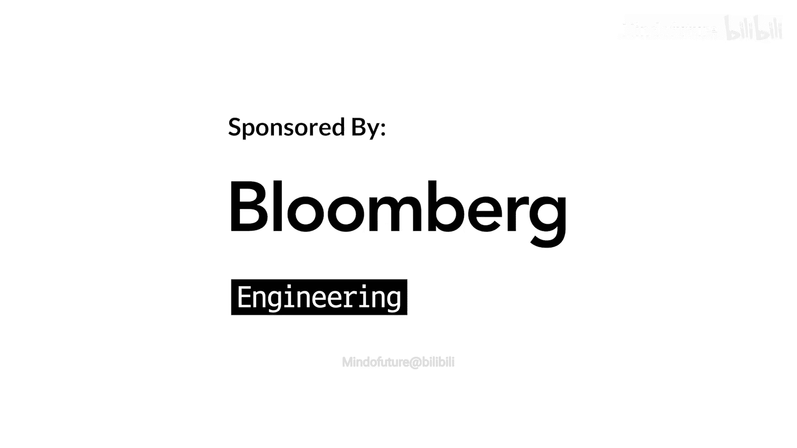

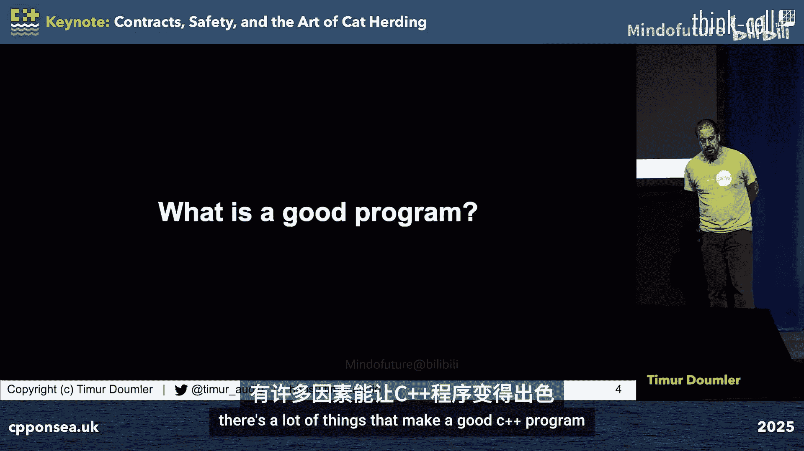

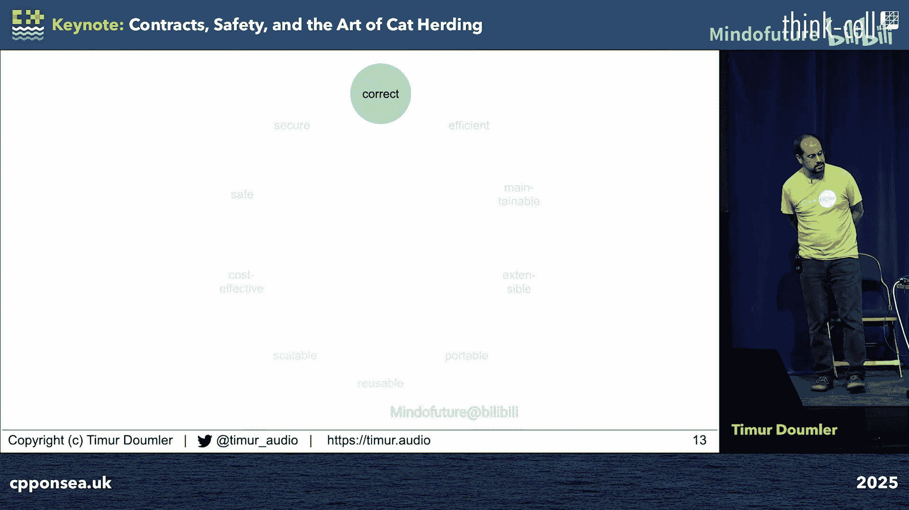

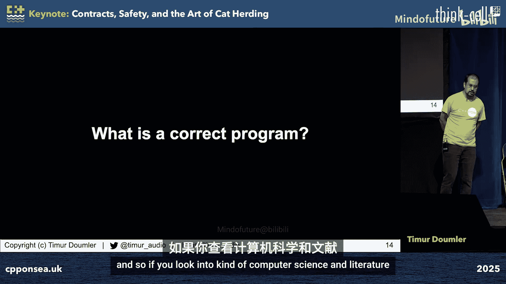

## 概述

在本节课中，我们将探讨如何编写更好的 C++ 程序。我们将从定义“好程序”开始，深入理解程序正确性的概念，并介绍 C++26 中的契约断言功能。接着，我们将辨析“安全”一词在 C++ 社区中的多重含义，并讨论如何系统地减少 C++ 语言中的未定义行为。最后，我们将分享在标准化过程中协调不同意见、达成共识的实用方法。

---

## 什么是好的 C++ 程序？

一个优秀的 C++ 程序具备多种属性。效率，尤其是性能，是 C++ 的独特卖点，也是许多讨论的焦点。此外，良好的代码还应具备可维护性、可读性、可扩展性、可移植性、可重用性和可扩展性。成本效益同样重要，如果超出预算，程序再好也无法交付。近年来，安全性和安全性在 C++ 社区中受到了特别关注。

然而，这里缺少了一个至关重要的属性。这个属性就是**正确性**。如果程序不能完成其预定任务，那么其他所有属性都无关紧要。

---

## 什么是正确的程序？

在计算机科学文献中，程序正确性有多种定义。功能正确性是指对于任何输入，程序的输出都符合规范要求。这又分为完全正确性和部分正确性。完全正确性要求算法总能返回一个正确的输出，但这涉及到停机问题，通常是不可判定的。部分正确性则只要求如果算法返回，其结果就是正确的。

然而，现实世界是复杂的。规范是什么？输入和输出具体指什么？是否包括副作用？程序可能还有实时性、资源使用限制等其他要求。因此，我们需要一个更实用的定义。

我们可以说，程序、函数或类有一组对其行为的期望，这些期望构成了它的**契约**。契约包括基本行为、前置条件、后置条件、类不变量、循环变体和不变量等。一个正确的程序或函数就是满足其契约的程序或函数。反之，违反契约总是一个**缺陷**，需要通过修复代码来纠正。

---

## 契约断言：在代码中表达期望

契约有许多部分，有些是隐式的（如编码惯例），有些是显式的（如代码注释或独立文档）。在 C++ 中，我们可以直接在代码中使用**契约断言**来表达这些期望。

在 C++26 之前，我们可以使用 `assert` 宏或自定义宏。从 C++26 开始，我们有了正式的语言特性来表达契约断言，包括三种类型：前置条件断言、后置条件断言和契约断言。它们是在代码中指定契约期望子集的一种方式。

以下是几个例子：
*   对于一个类似 `vector` 的类，可以在 `operator[]` 中添加前置条件断言，检查索引是否在边界内。
*   对于 `clear` 函数，可以添加后置条件断言，保证操作后容器为空。
*   对于 `empty` 函数，可以添加后置条件断言，说明其返回值当且仅当 `size() == 0` 时为真。

契约断言在运行时是否检查、检查失败时如何处理，是可以配置的。C++26 定义了四种评估语义：`ignore`（忽略）、`observe`（观察）、`enforce`（强制）和 `terminate_enforce`（强制终止）。具体使用哪种语义通常由编译器标志控制。当检查失败时，会调用一个可链接时替换的**契约违反处理程序**。

需要注意的是，契约断言只能表达**平白语言契约**的一个子集。有些契约（如 `push_back` 后大小加一）目前语法尚不支持，有些（如强异常保证）则难以用当前机制表达。

---

## 契约断言是什么，不是什么？

让我们来总结一下契约断言的核心特性。

契约断言是：
*   一种用于表达函数正确性**人类期望**的语法。
*   对**部分**契约期望的**可选**的**运行时**检查。
*   可移植、可扩展、可自由配置的，优于传统的断言宏。
*   不仅用于运行时检查，也能被静态分析工具和 IDE 利用。
*   在正确程序中是**冗余的**，这正是它们可以被关闭的原因。

契约断言**不是**：
*   一个**证明**正确性的工具。
*   一个表达非契约性内容（如错误处理逻辑）的工具。**缺陷**和**错误**有本质区别，缺陷需要修复代码，错误则需要被程序处理。
*   一个提供**语言层面保证**的工具（例如，保证 `operator[]` 永远不会导致未定义行为）。它需要被显式添加，并且可以被关闭。

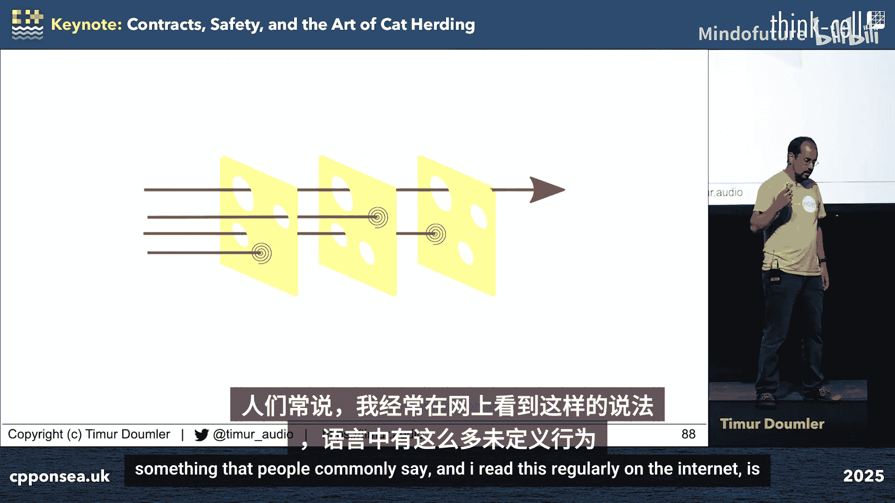

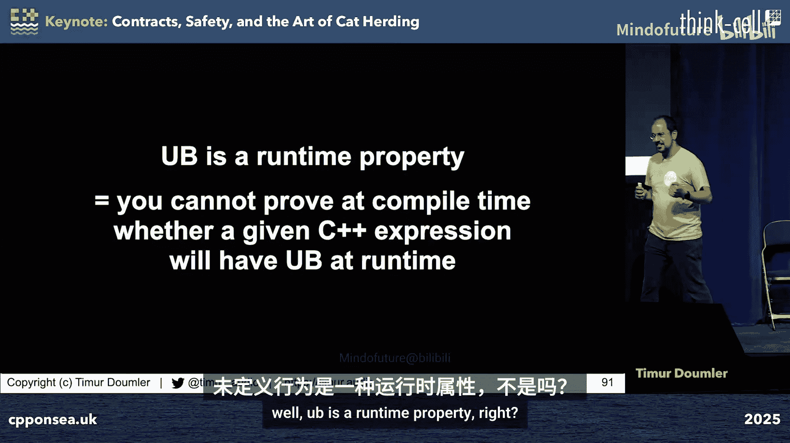

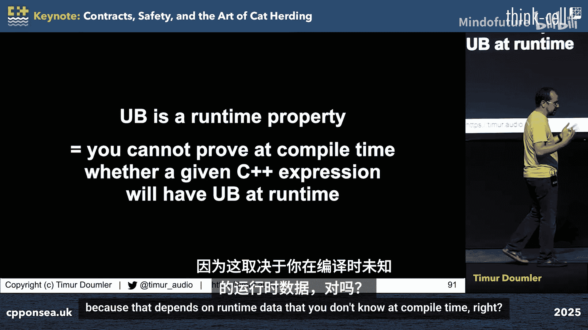

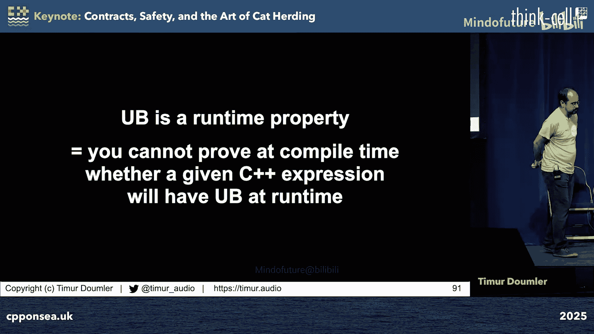

契约断言的目标是**提高**程序的正确性，帮助**发现**程序不正确的情况。虽然你永远无法证明程序完全正确，但每添加一个契约断言，你就能渐进地发现更多缺陷，使程序更加正确。

---

## 辨析“安全”的多重含义

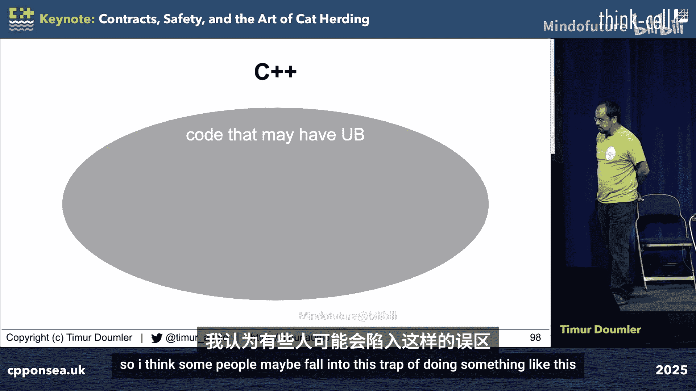

“安全”是 C++ 社区近年来的热点话题，但不同的人在说“安全”时，可能指代完全不同的概念，这导致了大量低效的沟通。

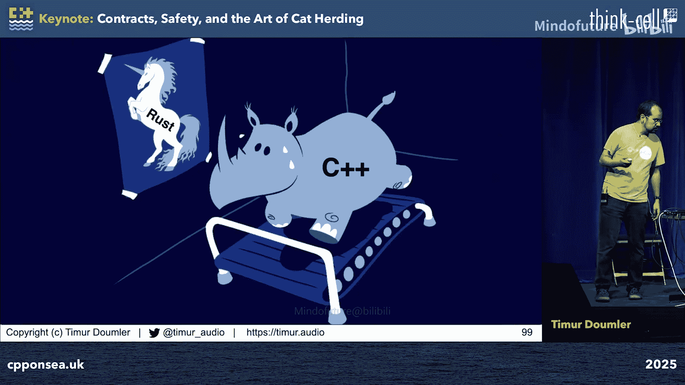

1.  **无未定义行为**：指操作不会导致 C++ 中那种编译器可以为所欲为的未定义行为。许多关于内存安全、类型安全的讨论都发生在这个语境下。
2.  **功能安全**：指当出现问题时，不会对人员、设备或环境造成伤害。这是安全关键领域和大多数行业外的通用含义。
3.  **系统安全**：这是一个由策略统计衡量、通常由政府机构裁定的系统涌现属性。C++ 委员会中的安全研究组曾采用类似定义。
4.  **兰波特安全**：源于 Leslie Lamport 的形式化框架，指在有效输入下，**某些坏事不会发生**的属性（例如，自动驾驶汽车不会驶离道路）。编程语言的“安全”则是指其可表达的任何程序都保证满足的一组安全属性。

为了避免误解，建议在讨论时使用更具体的术语，如“功能安全”、“无 UB”等，而不是泛泛地使用“安全”。

这些概念相互关联但不重合。例如：
*   **无 UB 不是功能安全的必要条件**：人们用 C++ 编写安全关键代码已有数十年，通过流程、测试和工具来保证安全。
*   **无 UB 也不是功能安全的充分条件**：许多安全相关的缺陷与 UB 或编程语言无关，而是业务逻辑错误（如单位混淆、浮点误差累积）。
*   **安全性**则关注恶意攻击。无 UB 可能是安全性的**必要**条件（因为 UB 常被利用），但绝非**充分**条件。攻击者会寻找任何可利用的漏洞。

程序正确性是更根本的属性。一个正确的程序，自然在所有定义下都是安全和安全的。契约断言等工具旨在提高正确性，而减少 UB 等工作则是在程序不正确时，限制可能发生的损害。它们是互补的“瑞士奶酪”模型中的不同层次。

---

## 如何驯服未定义行为这只“猫”？

既然契约断言已纳入语言，下一个焦点就是减少语言中的未定义行为。一个常见的问题是：为什么不把所有 UB 都定义为有明确行为呢？

根本原因在于，UB 是一个**运行时**属性。编译器通常无法在编译时证明某个表达式在运行时是否会导致 UB，因为这取决于未知的运行时数据。如果将所有可能 UB 的情况都定义为有明确行为，将会破坏大量现有代码。

以内存安全为例，已知的解决方案包括：
*   **运行时方案**：如垃圾回收、引用计数、消毒剂。它们有效但可能有性能开销，且不提供语言级保证。
*   **编译时方案**：主要是强制执行“排他性法则”（如 Rust 的所有权系统）。但这要求重写所有现有 C++ 代码，使其变成另一种语言。

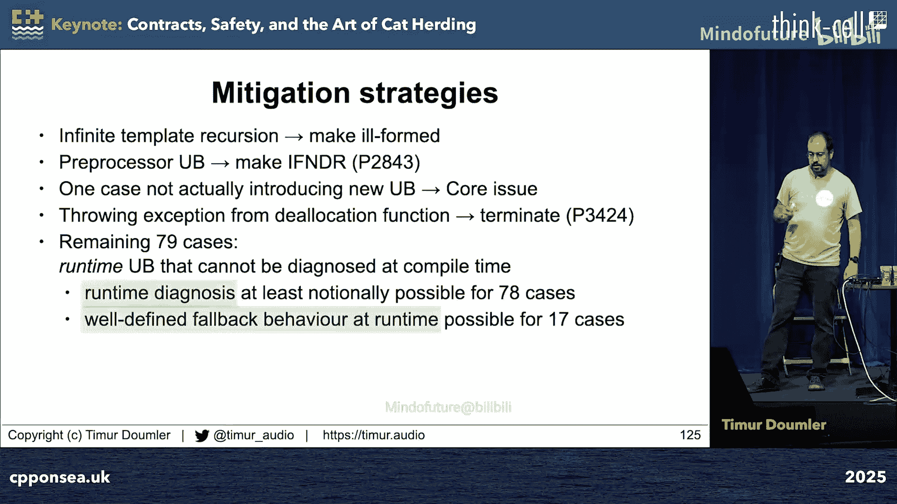

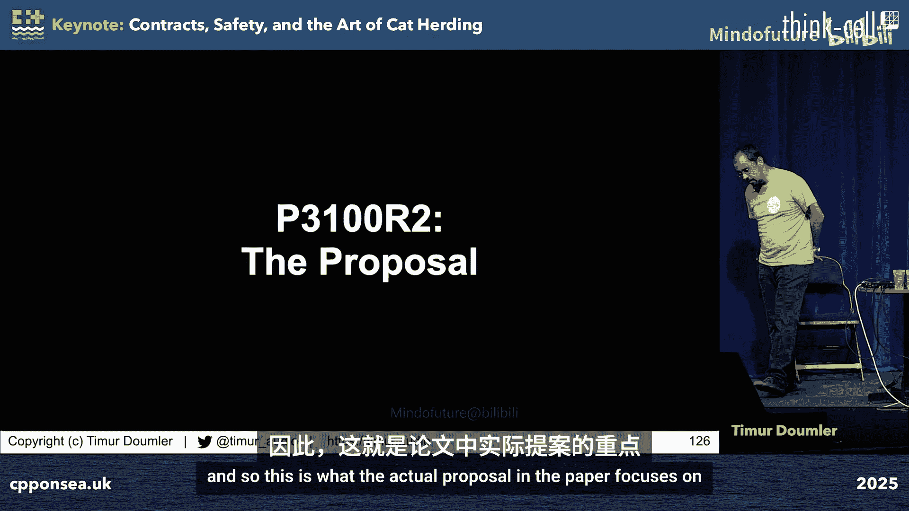

C++ 的现状是充满 UB 的“海洋”。我们无法一口吃掉整根香肠，但可以采取“香肠切片”策略，一次消除一点 UB，渐进地改善状况。

C++ 委员会已经开始这样做（如 C++20 的隐式生存期类型，C++23 修复的基于范围的 for 循环问题）。但我们需要更系统、更全面的方法。

---

## P3100：系统性处理未定义行为的提案

提案 P3100 旨在为 C++ 引入一个标准化的框架，用于运行时检测和缓解核心语言中的未定义行为。我们完成了以下工作：
1.  枚举了 C++ 核心语言中所有 90 个显式的 UB 案例，并为它们分配了唯一标识符。
2.  将这些案例分为 12 个类别（如类型与生存期、算术、线程、序列点等）。
3.  根据一系列标准对每个案例进行分类：是否与安全相关、是否可本地检查、检查成本、是否可定义明确的后备行为等。

分析发现：
*   大多数 UB 属于“类型与生存期”类别。
*   只有约 20% 的 UB 可以**在编译时本地诊断**。
*   对于约 14% 的 UB，可以定义**明确的、非 UB 的后备行为**（如将有符号整数溢出定义为补码环绕）。
*   对于其余大多数，唯一合理的缓解措施是运行时检查并在失败时终止。

提案包含三部分：
1.  **系统性引入运行时检查**：在所有可以插入运行时检查检测 UB 的地方，标准文本将进行转换，视为存在一个**隐式契约断言**。这些断言的行为与显式契约断言完全一样（可忽略、可观察、可强制等），允许编译器/消毒剂选择性地实现它们。
2.  **系统性用明确行为替换 UB**：对于可以定义后备行为的情况，将 UB 替换为该行为。
3.  **提供选择退出的机制**：引入第五种评估语义 `assume`（不检查谓词，但假设其为真；若为假，则行为未定义）。这对于隐式断言是保持现状（编译器可基于无 UB 进行优化），同时允许用户为性能原因选择退出检查。

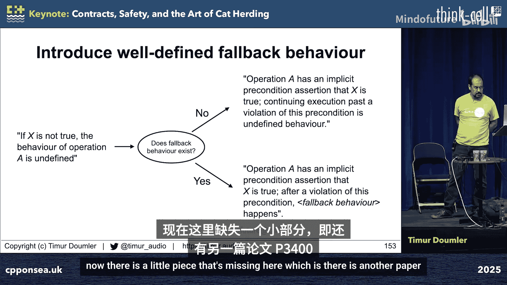

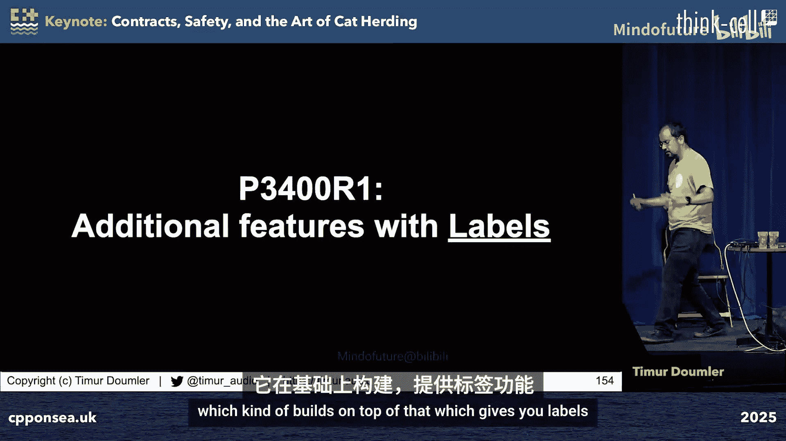

该提案提供了一个标准框架来描述现有的编译器标志和消毒剂行为，实现了可移植的命名和分类，并能与契约标签、配置文件等未来特性无缝集成。

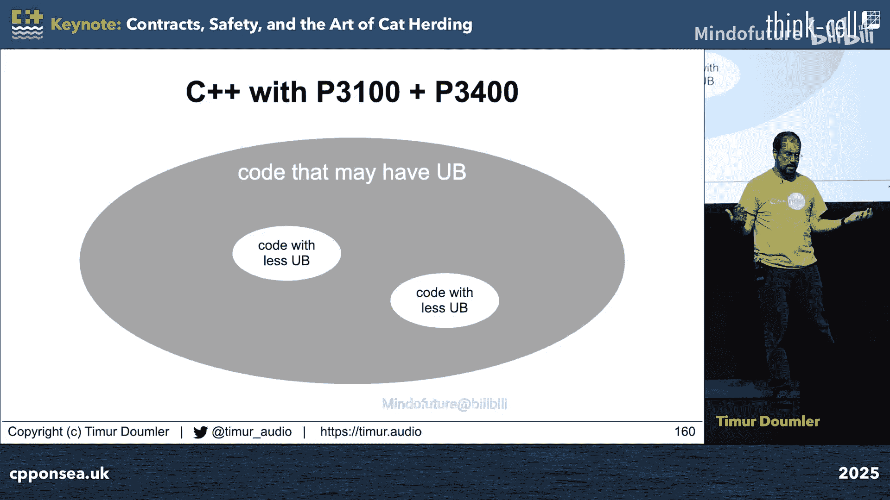

---

## 更大的蓝图：应对 UB 的策略菜单

处理 UB 需要根据代码是否可修改来采取不同策略：

**对于可修改的新代码**：
*   **语言子集化**：禁用某些可能导致 UB 的特性，要求显式选择加入“不安全”操作。
*   **注解**：添加注解（如 `[[bounded]]`）帮助编译器进行边界检查。
*   **用新特性替换**：提供有明确行为的新操作（如饱和运算）来替代不安全的旧操作。

**对于不可修改的遗留代码**：
*   **重定义行为**：直接将少数 UB 案例重定义为有明确行为（已基本完成）。
*   **错误行为**：定义为错误但明确的行为（如 C++26 的未初始化读取）。
*   **运行时检查**：P3100 提案提供的框架。

**配置文件**的角色应是上述策略的**命名配置预设**。一个配置文件名称应扩展为一组关于启用哪些检查、应用哪些语言子集的语句。

这是 C++ 委员会未来几年处理 UB 的路线图。

---

## 驯猫的艺术：在委员会中达成共识

技术问题固然重要，但**人的因素**往往是更大的挑战。在标准化过程中，如何沟通、决策和组织工作是关键。以契约标准化耗时 21 年为例，许多时间都花在了解决分歧上。

在 C++ 标准委员会（WG21）这样的环境中工作，需要耐心和技巧。以下是一些经验法则：

**一般规则**：
*   始终保持尊重和专业。
*   切勿假定他人有恶意。
*   保持过程透明并公平适用。
*   准备好反复解释，因为人们可能不阅读论文。
*   当有人反对时，请他们明确阐述替代方案并付诸文字。
*   当两人有分歧时，鼓励他们私下解决并达成一致。

**技术讨论规则**：
*   **聚焦于事实、数据和可客观验证的内容**，避免带有价值判断的表述。将“A 比 B 好”重构为“X 优先考虑 A，Y 优先考虑 B，哪个优先级更重要？为什么？”
*   **学会区分事实与观点**，并勇于挑战模糊的陈述。
*   **识别逻辑谬误**，例如：
    *   契约的目的是 X，契约没做 X，所以契约不好。（前提错误）
    *   契约存在 Y 问题，所以在解决 Y 之前不应标准化契约。（Y 可能无关）
*   **不要试图直接说服对方他们错了**。相反，**帮助他们自己看到正确的解决方案**。可视化是极佳的工具。

---

## 决策算法：一个可视化工具

一个有效的决策方法是构建一个**需求-解决方案矩阵**。该方法基于 John Lakos 的设计原则，但进行了简化。

步骤如下：
1.  **陈述问题**：明确要决定的具体设计问题。
2.  **列出需求**：所有利益相关者列出其客观、可验证的需求。**不要**对需求进行重要性排序，避免价值判断。只包含有数据支持或可测量的需求。
3.  **列出所有提议的解决方案**。
4.  **构建演化图**：展示哪些解决方案可以从更保守的方案演化而来。
5.  **构建矩阵**：行是需求，列是解决方案。在每个单元格中，用 **是（绿）**、**否（红）** 或 **可能/部分（黄）** 标记该方案是否满足该需求。
6.  **分析与决策**：
    *   如果某个方案明显满足所有或大多数需求，它就是最佳选择。
    *   如果需要在冲突的需求间权衡，矩阵将冲突清晰地可视化出来，使讨论聚焦于这一个关键权衡。
    *   如果无法就权衡达成一致，则回退到演化图中更保守的方案。

这个可视化方法曾成功帮助一群固执己见的工程师就 `noexcept` 与契约断言的交互问题达成共识。它有助于将复杂的争论分解为可管理的、基于事实的讨论。

---

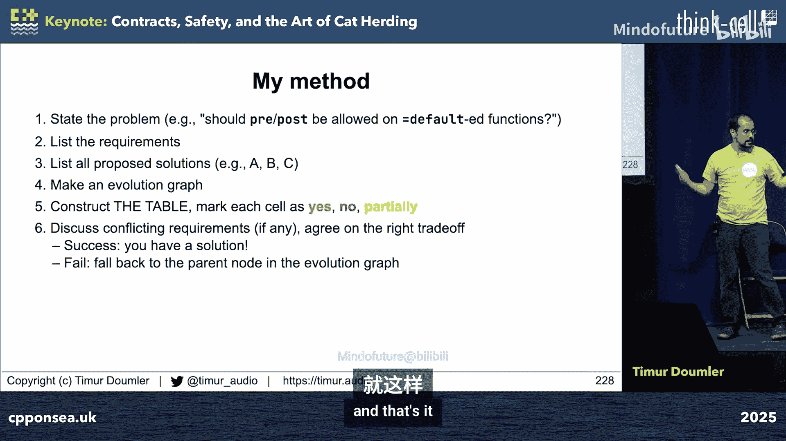

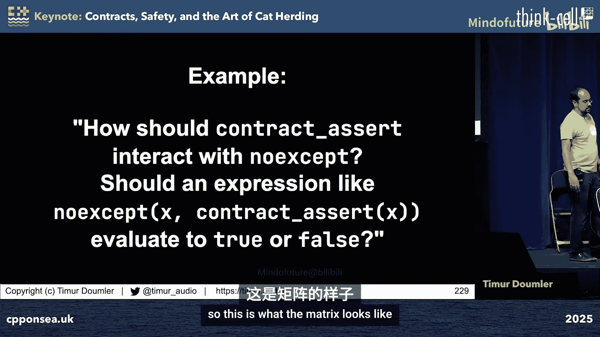

## 总结

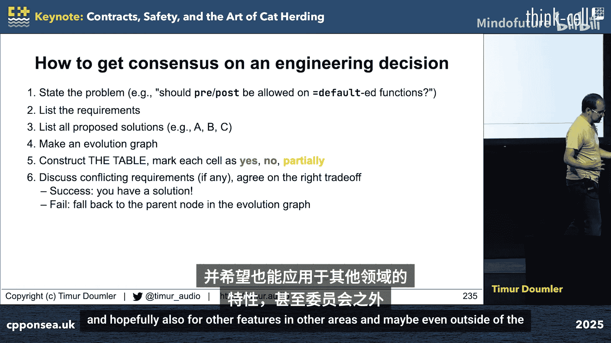

本节课我们一起学习了如何构建更好的 C++ 程序。我们从程序正确性和契约的核心概念出发，深入了解了 C++26 的契约断言功能及其定位。我们辨析了“安全”一词的多种含义，并认识到减少未定义行为与使用契约断言是提高程序正确性的互补手段。我们探讨了通过提案 P3100 等努力系统性处理 UB 的策略，并展望了未来的工作方向。最后，我们分享了在复杂的技术社区中协调分歧、达成共识的“驯猫艺术”和实用的决策可视化工具。希望这些内容能帮助你编写更正确、更健壮的 C++ 代码，并在技术讨论中更有效地沟通与协作。