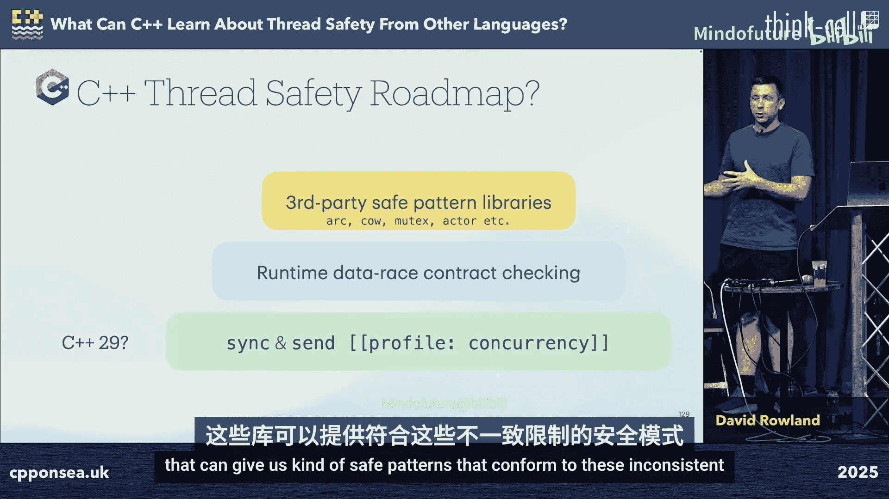

# 011：核心概念与实现


在本节课中，我们将探讨如何从其他现代编程语言（如Rust、Swift、Circle）的线程安全模型中汲取灵感，并尝试在C++中应用类似的概念。我们将重点关注如何通过编译时检查和运行时策略来避免数据竞争，提升C++代码的线程安全性。

---

## 演讲者介绍

我是Dave Roland，音频集团的首席技术官。我们公司主要分为两部分：硬件方面，我们生产专业数字音频接口和多通道转换器；软件方面，我们开发一系列虚拟乐器和名为Waveform的多轨录音工作站。其后台是一个开源项目，负责处理数据模型、实时元素和设备交互。工作之余，我喜欢从事建筑工作，我发现解决工程问题与编程有相似之处，但更偏重体力劳动，能让我暂时离开电脑。

## 线程安全定义与重要性

上一节我们介绍了演讲背景，本节中我们来看看线程安全的准确定义及其重要性。

一个程序是线程安全的，如果它没有数据竞争。数据竞争是指两个线程访问同一内存位置，且至少有一个是写操作。因此，线程安全的编程语言应使开发者无法表达出会导致数据竞争的代码。

为什么线程安全值得关注？根据谷歌去年的安全报告，线程安全问题虽然目前只占所有安全漏洞的5.6%，但这个比例可能会增长。原因如下：
*   随着边界检查等“低垂果实”类安全措施被引入C++，线程安全问题的相对占比会上升。
*   机器核心数不断增加，语言本身（如`std::execution`）也让多线程编程更普遍。
*   线程安全与生命周期安全紧密相连，改进一方可能惠及另一方。
*   线程相关的Bug通常难以发现和调试，因为问题往往在数据竞争发生很久后才显现。

## 其他语言的线程安全策略

几乎所有现代语言都通过某种方式避免共享状态来防止数据竞争。我们可以将它们分为几个类别：

以下是几种主要的线程安全模型：
*   **纯函数式（如Haskell）**：通过纯函数和值语义完全避免共享可变状态。
*   **消息传递（如Erlang, Elixir）**：通过进程/actor模型传递消息，而非直接共享内存。
*   **独占性法则（如Rust, Swift, Circle）**：允许线程，但通过编译时检查确保对可变数据的独占访问。

本教程将聚焦于最后一类，特别是Rust/Circle和Swift所采用的策略。

## Sync与Send：编译时安全协议

上一节我们了解了不同语言的高层策略，本节中我们来深入看看实现这些策略的核心编译时概念：`Sync`和`Send`。

`Sync`和`Send`是两种在编译时检查的协议或特征（Traits）。
*   一个`Sync`对象可以安全地在多个线程间**共享**。
*   一个`Send`对象可以安全地在线程间**转移**所有权。
*   通常，`Sync`对象也隐含着是`Send`的。

在不同语言中，这些概念的具体实现如下：
*   **Swift**：通过`Sendable`协议实现。只有符合`Sendable`的类型才能跨越actor隔离边界传递。
*   **Rust**：通过标记特征（marker traits）`Sync`和`Send`实现。具有纯值语义的类型会自动实现这些特征。可变借用（`&mut T`）不能在线程间共享。
*   **Circle**：遵循与Rust相似的模型，但使用C++语法。它使用`const`来施加不可变性约束。

## 在C++中模拟Send/Sync

看到其他语言的思路后，一个自然的想法是：能否在C++中用类型特征（type traits）模拟`Send`/`Sync`？我尝试构建了一个“安全并发库”来进行探索。

核心思想是创建现有C++构造的安全包装器。我们从`std::jthread`开始，并约束传递给它的参数和可调用对象必须符合`Send`概念。

`Send`概念的初步定义旨在防止数据共享：
```cpp
template<typename T>
concept Send = is_send_type_v<T>;
```
`is_send_type_v`的实现逻辑如下：
1.  不允许左值引用或指针（可能指向共享数据）。
2.  不允许类似lambda的可调用对象（可能捕获`this`指针或引用）。
3.  允许可移动构造的类型（通过右值转移所有权）。
4.  允许非成员函数指针。

`Sync`概念则标识那些本身无数据竞争的类型。最初，我们只认为`std::atomic<T>`是`Sync`的。另一个有用的类型是`synchronized_value<T>`（一个包装了互斥锁的类型），它来自一个尚未标准化的提案。

为了使`Sync`类型有用，我们需要一种在线程间传递它们的方式。由于禁止了引用，我们可以使用`std::shared_ptr`。因此，我们规定：`std::shared_ptr<T>`是`Send`的，当且仅当`T`是`Sync`的。

通过这种方式，我们重写了Circle中的示例，强制使用`shared_ptr<synchronized_value<string>>`来安全地在线程间传递和访问字符串。

## C++初步方案的局限性

上一节我们实现了一个初步的安全线程模型，本节中我们来看看这个方案存在哪些问题和局限性。

尽管上述方案提供了一些安全性，但它存在明显缺陷：
1.  **嵌套指针问题**：类型特征无法递归检查所有成员。一个包含原始指针的`Node`对象可能通过`Send`检查，但其指针可能指向别处导致数据竞争。
2.  **this指针问题**：常见的`[this]() { memberFunc(); }`模式会捕获`this`指针，这无法通过我们的`Send`检查。
3.  **指针泄漏问题**：即使通过`synchronized_value`访问，我们仍能获取内部对象的地址并存储到全局变量，从而绕过保护。
4.  **非强制性**：依赖于自定义的`safe_thread`类，无法强制他人使用。
5.  **编译错误不友好**：复杂的模板和概念检查会导致难以理解的错误信息。
6.  **性能开销**：处处使用原子引用计数和互斥锁带来额外开销。

总之，我们得到了一个不防弹、对初学者不友好、非默认且性能有代价的方案。与Circle的例子相比，虽有相似思路，但C++缺乏表达生命期和独占引用的核心机制（借用检查），难以达到同等级别的安全与性能。

## 利用反射改进Send检查

C++26引入的反射功能为我们解决前述问题提供了新工具。我们可以递归地检查类型的所有成员是否符合`Send`。

利用反射，我们可以将`is_send`重写得更清晰：
```cpp
constexpr bool is_send(const meta::info refl) {
    // 检查是否为非成员函数指针、算术类型等...
    if (meta::is_class(refl)) {
        // 递归检查所有数据成员
        for (auto member : meta::data_members_of(refl)) {
            if (!is_send(member)) return false;
        }
        return true;
    }
    return false;
}
```
这样，之前有问题的`Node`类型、捕获了`this`或非法引用的lambda都会被正确拒绝。我们修复了嵌套指针和`this`指针的问题。

## 通过代码生成封装安全性

要解决指针泄漏和生命周期问题，我们需要将指针封装在值类型中，并避免暴露原始地址。C++26/29的反射和代码生成功能（如元类）使之成为可能。

我们可以定义元类来自动生成线程安全的包装类型。例如：
*   `synchronized`元类：生成一个包装类，内部使用`synchronized_value`，并对外提供相同的API，所有调用都通过安全的`apply`进行。
*   `mutexed`元类：更轻量，仅为类添加一个互斥锁成员，并转发调用。
*   `arc`（自动引用计数）元类：模仿Swift的类，内部使用`shared_ptr`，提供类似值类型的语法但具有引用语义。符合`Send`的条件是内部类型`T`符合`Sync`。
*   `copy_on_write`元类：为昂贵复制的类型提供写时复制语义，在非`const`成员函数中检查引用计数并在需要时创建副本。

这些元类可以组合使用，例如`person [[arc, mutexed]]`，从而极大地简化代码，让开发者只需关注业务逻辑，而由编译器保证线程安全。

## 处理特殊用例：inout参数与循环引用

在实现类Swift的引用语义时，我们需要处理两个特殊问题：安全的类指针语义和循环引用。

**inout参数**：Swift使用`inout`参数提供安全的“类指针”语义，用于修改函数参数。在C++中，我们可以通过生成一个特殊的`inout`包装器来模拟。它接受一个指针，但在内部创建自己的安全副本用于操作，最后在析构时将结果复制回原指针。我们甚至可以重载`operator&`来返回这个`inout`包装器，从而实现类似Swift的语法。

**循环引用**：自动引用计数（ARC）可能导致循环引用和内存泄漏。Swift使用弱引用（`weak`）来打破循环。在C++中，我们可以利用`std::weak_ptr`来实现相同的模式。通过元类生成一个`weak_ref`包装器，它提供`get()`方法返回一个`std::optional<T>`，使用者必须检查值是否存在后才能使用。

## Actor模型：更高层的并发抽象

除了底层的`Send`/`Sync`，我们还可以借鉴Swift的Actor模型，在更高层次组织并发。Actor将其状态隔离，所有对其成员的访问都序列化到一个内部队列（线程）上。

在C++中，我们可以利用反射和`std::execution`来实现一个`actor`元类。这个元类会将生成的每个成员函数调用包装成一个发送者（sender），并调度到一个单线程的调度器上执行，从而保证串行访问。结合C++协程，我们可以使用`co_await`来异步调用actor的方法，语法上接近Swift。

未来的优化方向包括：根据注解将不同actor分发到不同优先级队列、实现“主Actor”（运行于主线程）、以及在调用者已处于actor内部线程时避免不必要的调度开销。

## 运行时检查与契约

完全的编译时安全可能难以在现有C++中实现，因此运行时检查是必要的补充。现有的主要工具是ThreadSanitizer（TSan），但它有局限性：仅Clang/GCC支持、需要单独运行、与ASan等工具互斥、且性能开销巨大（5-15倍减速）。

我们可以考虑一种更轻量级的、基于类型契约的运行时检查。思路是：在类型的每个`const`成员函数入口检查是否有并发的写入者，在每个非`const`成员函数入口检查是否有并发的读取者或写入者。这实际上是检查标准库容器已有的线程安全契约（例如，`const`成员函数可并发调用）。

我们可以通过元类自动注入这种检查逻辑。为了保持ABI兼容性，检查状态可以通过Herb Sutter提出的“外置存储”方案（一个无锁的、由地址映射到的对象）来存储，而不是作为类的直接成员。更进一步，这可以转化为C++契约（Contracts）中的`[[assert: ...]]`，在违反契约时调用用户定义的处理器。

这种检查虽然有限（仅作用于函数入口/出口，不跟踪内存），但能有效捕获高层设计上的线程安全契约违反，成本远低于TSan，甚至可用于生产环境进行监控。

## 总结与展望

本节课中我们一起学习了从Rust、Swift等语言借鉴线程安全思想的旅程。

我们深入探讨了`Sync`/`Send`这对核心概念，它们通过建立隔离边界和编译时检查来防止数据竞争。我们看到了如何在C++中利用类型特征和C++26的反射来模拟这些概念，并通过元类生成安全包装类型来封装指针、管理生命周期，从而模仿其他语言的安全模式。

我们还探讨了更高层的Actor模型实现，以及通过轻量级运行时契约检查来补充编译时安全的不足。

当前C++标准的发展方向（如配置文件）也提及了静态检测跨线程别名等想法。我认为，C++需要一种语言机制来识别线程隔离边界（即`Send`概念），这将引入严格的别名和生命周期要求。反射能帮助我们以其他语言的风格编写更安全的代码，但如果想要纯粹C++的性能和“零开销抽象”，我们可能需要类似借用检查器的根本性机制。



展望未来，C++29或许能引入类似`Send`/`Sync`的原语，并通过并发配置文件启用。标准库实现可以加入轻量级数据竞争检查来验证契约。一旦语言提供了检查这些属性的设施，我们很可能会看到一系列符合这些新约束的安全并发库涌现出来，推动C++向更安全、更易于编写正确并发代码的方向发展。