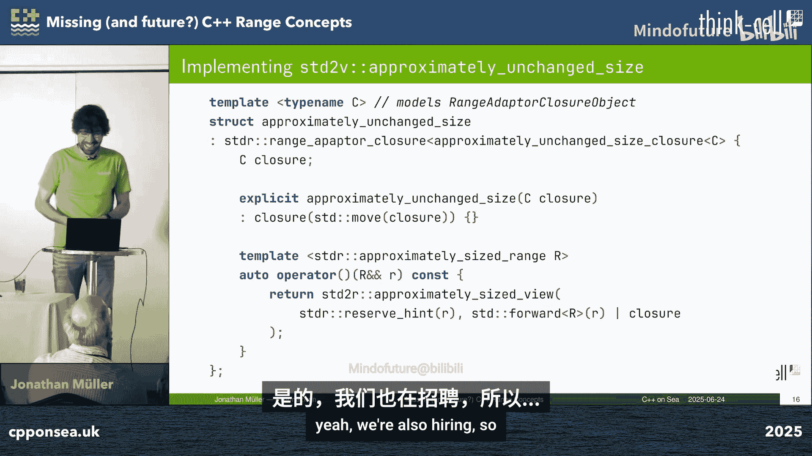
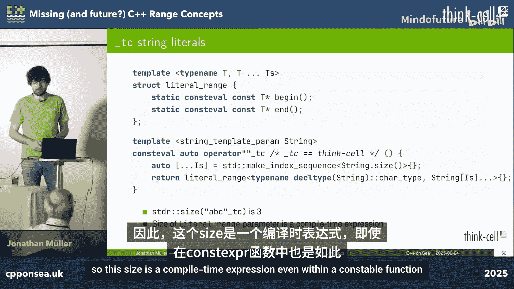
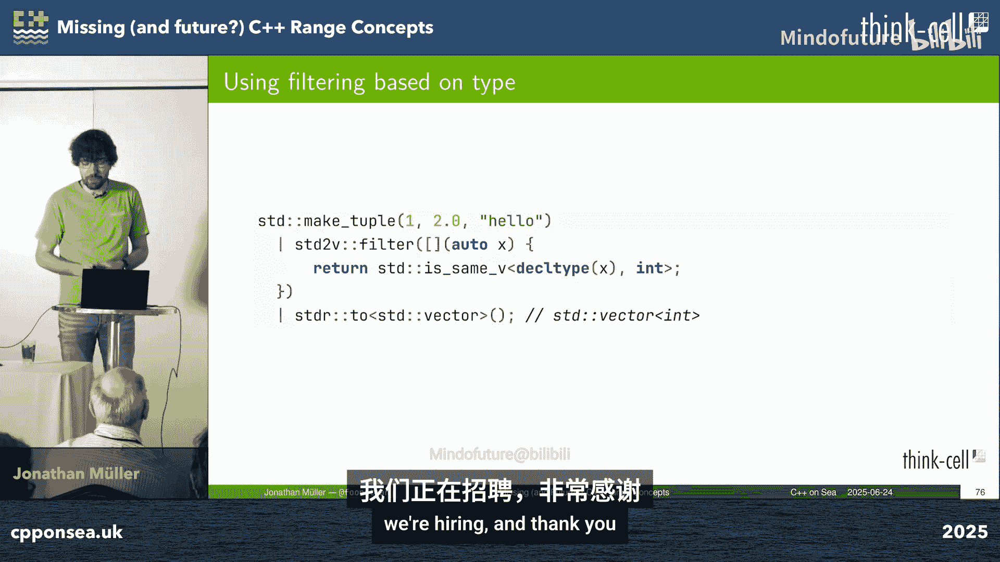

# 014：缺失（以及未来）的 C++ 范围概念


## 概述

在本节课中，我们将探讨 C++ 标准库中当前缺失的一些范围（range）概念，这些概念在 Think-cell 库中已经实现，并可能对未来 C++ 标准有所启发。我们将重点关注两个核心问题：**性能优化**和**元编程**，并讨论一些悬而未决的标准规范问题。课程内容将尽可能简单直白，以便初学者理解。

---

## 第一部分：性能优化问题

上一节我们介绍了课程概述，本节中我们来看看第一个核心问题：如何通过新的范围概念来优化性能。

### 示例问题：文件处理与规范化

我们以一个具体问题开始：读取文件并将所有制表符（`\t`）规范化为四个空格。使用范围管道（range pipeline）可以简洁地实现：

```cpp
auto result = std::ranges::to<std::string>(
    read_file(path)
    | std::views::transform([](char c) -> std::string {
        return c == '\t' ? "    " : std::string(1, c);
      })
    | std::views::join
);
```

`read_file` 函数返回一个输入范围（input range）。`transform` 视图将每个字符转换为一个 `std::string`（单个字符或四个空格），`join` 视图将这些字符串扁平化为一个字符范围，最后 `std::ranges::to` 将其转换为 `std::string`。

### 大小（Sized）范围的优化与局限

`std::ranges::to` 在构造容器时，如果输入范围是 **sized range**（已知大小），则可以预先分配（`reserve`）内存，然后直接拷贝，这非常高效。如果是 **forward range**，则可以使用 `distance` 计算大小，虽然需要遍历一次，但仍比多次重新分配（`push_back`）高效。然而，对于纯 **input range**，它只能遍历一次，无法预先分配内存，只能使用低效的 `push_back`。



在我们的管道中，`read_file` 可能是一个 sized input range（例如，可以通过文件系统查询文件大小）。但经过 `transform` 和 `join` 后，我们失去了大小信息，因为 `join` 需要将内部多个字符串的大小相加，而转换函数可能将单个字符扩展为多个字符，我们无法预先知道总大小。

### 近似大小（Approximately Sized）范围概念

在许多情况下（例如，格式良好的文件不含制表符），转换后的范围大小与原始范围大小**近似相同**。如果能够传播这种近似大小信息，我们仍然可以进行有效的预分配。

C++26 引入了 **approximately sized range** 概念和 `reorin`（原为 `approximate_size`）函数。其核心思想是：如果一个范围是 sized range，那么它也是 approximately sized range，`reorin` 返回其精确大小；否则，可以通过 ADL 查找自定义的 `reorin` 实现来获取近似大小。

许多视图（如 `transform`、`reverse`、`take`、`drop`）可以传播近似大小。但 `join` 视图通常不能，因为内部各子范围的大小关系不明确。

为了实现传播，我们可以创建一个包装器 `approx_size_unchanged`，它包装一个范围并声明其大小在转换后保持不变。以下是其使用方式：

```cpp
auto pipeline = read_file(path)
              | std::views::transform(/* ... */);
auto approx_sized_pipeline = approx_size_unchanged(pipeline | std::views::join);
auto result = std::ranges::to<std::string>(approx_sized_pipeline);
```

其实现涉及范围适配器闭包对象，虽然代码有些复杂，但核心思想是让 `join` 在特定条件下传播外部范围的近似大小提示。

### 拉取模型（Pull Model）的状态机开销

当前 C++ 范围基于**拉取模型**（pull model）和迭代器（iterator）。消费者通过迭代器完全控制遍历过程（例如，前进、跳过、重复读取）。这种灵活性对于算法如 `find` 是必要的，但对于简单的遍历（如 `for_each`、`copy`）则过于复杂。

使用迭代器实现的范围管道（如 `transform` -> `join`）在底层会形成一个**状态机**，而不是直观的嵌套循环。例如，`join` 的迭代器需要管理外层迭代器和内层迭代器两种状态。编译器优化器需要内联并识别出这个状态机实际上等价于嵌套循环，但这并非总是有效，可能带来开销。

### 推送模型（Push Model）与 `for_each_while` 定制点

对于不需要消费者控制的遍历，**推送模型**（push model）更高效。生产者主动将值“推”给消费者回调函数。

我们可以引入一个名为 `for_each_while` 的定制点（customization point）。它接受一个范围和一个“接收器”（sink）函数，遍历范围并对每个元素调用接收器。如果接收器返回 `false`，则停止遍历。

其默认实现使用基于迭代器的循环。但关键是可以为特定视图**定制**实现，从而直接表达底层循环逻辑，避免状态机。

以下是几个视图的定制实现思路：

*   **`transform_view`**： 在其底层范围上调用 `for_each_while`，并将每个元素通过转换函数后再传递给接收器。
*   **`join_view`**： 直接实现为两层嵌套循环：外层遍历外部范围，内层遍历每个内部范围元素，并传递给接收器。这完全避免了迭代器状态机。
*   **`read_file` 迭代器**： 实现为读取缓冲区，然后对缓冲区中的每个字符调用接收器。

当算法（如 `std::ranges::copy`、`std::ranges::for_each`）使用 `for_each_while` 而不是基于迭代器的循环时，经过编译器内联，最终生成的代码与手写的命令式嵌套循环完全相同，效率极高。

### 生成器（Generators）的局限

你可能会想，C++23 的协程生成器（`std::generator`）是否解决了这个问题？实际上，生成器仍然是拉取模型，编译器会为我们生成状态机。它提供了更自然的语法（`co_yield`），但可能仍有性能开销和额外的分配。`for_each_while` 是一种库解决方案，可以在当前语言标准下提供推送模型的性能。

### 处理连续内存块（Chunking）的优化

许多范围虽然不是**连续范围**（contiguous range），但由连续的“块”组成。例如：
*   `std::deque`： 由多个连续数组块链接而成。
*   连接两个 `std::vector`： 两个独立的连续内存块。
*   `read_file`： 读取到连续的缓冲区。
*   `join` 一个 `std::span` 的范围： 每个 `span` 都是连续的。

如果我们能识别并利用这些连续块，就可以用更高效的方式处理数据，例如使用 `memcpy` 复制整个块，而不是逐个元素复制。

幸运的是，`for_each_while` 定制点天然支持块处理。在 `join_view` 的定制实现中，我们对外部范围的每个元素（一个内部范围）调用 `for_each_while`。如果这个内部范围是连续的（如 `std::span`），那么这次调用就是在处理一个连续块。

我们可以扩展 `for_each_while`：在调用范围的定制实现**之前**，先检查接收器是否有一个 `chunk` 成员函数。如果有，则尝试将整个连续范围作为一块传递给 `chunk` 函数；否则，回退到逐个元素调用接收器。

例如，为 `std::string` 实现一个接收器，其 `chunk` 函数可以接受一个连续范围并调用 `append`，这比逐个字符 `push_back` 高效得多。

通过结合 `for_each_while` 和块处理，我们可以写出既优雅又高性能的范围代码，直接处理连续内存块，避免迭代器开销。


### 优化后的文件处理方案

回到最初的例子，`transform` 将每个字符转换为一个小字符串，导致 `join` 后只有许多很小的连续块，优化收益有限。

我们可以重构算法：使用 `split` 在制表符处分割，然后用 `join_with` 插入分隔符。如果文件没有制表符，结果就是一个大连续块。`join_with` 可以传播连续性。但 `split` 需要前向范围（forward range），而 `read_file` 是输入范围。

更好的设计是提供 `read_file_buffers`，它返回一个 `std::span` 的范围（每个 span 代表一个文件缓冲区）。然后，我们在这个“缓冲区范围”上进行 `transform`（处理每个缓冲区）、`split`、`join_with`，最后再将所有缓冲区 `join` 起来。这样，内部操作都在大连续块上进行，非常高效。



`read_file` 可以基于 `read_file_buffers` 实现，只需一个特殊的 `for_each_while` 接收器，将每个缓冲区作为单个元素转发。

---

## 第二部分：元编程问题

上一节我们探讨了通过推送模型和块处理来优化性能，本节中我们来看看如何利用范围概念进行编译期元编程。

### 编译期字符串与类型编码问题

假设我们想用 DSL 描述数据库模式，并在编译期生成 SQL 语句。例如：
```cpp
auto stmt = create_table<Person>();
```
`create_table` 需要生成 `"CREATE TABLE Person (...)"` 这样的字符串。

这里有两个挑战：
1.  **编译期上下文**： 在 `consteval` 函数中，函数参数的值在函数体内**不是**常量表达式（即使函数是 `consteval` 的）。我们无法基于参数值进行实例化。解决方案是将必要信息编码到参数的**类型**中，因为类型在函数体内是常量表达式。
2.  **字符串字面量**： `sizeof("ABC")` 是 4（包含空终止符），而不是字符串长度 3。我们需要一种能正确表示编译期字符串长度的类型。

### 字面量范围（Literal Range）

我们将这两个问题结合，定义 **literal range**。它是一个模板，将一系列值编码到类型中。迭代时，这些值被填充到一个静态存储区。这样，我们就能得到一个类型，其 `size()` 在编译期是常量表达式，即使在一个 `consteval` 函数内部也能使用。

### 编译期大小（Constexpr Size）范围概念

从 C++26 开始，规则有所放宽：只要不访问任何运行时的值（即，仅依赖类型的属性），就可以在常量表达式中使用局部对象甚至函数参数。

这意味着，对于一个 literal range，或者一个其 `size()` 不访问元素值（仅依赖类型）的视图，我们可以在常量表达式中调用其 `size()`，即使我们只有一个该类型的运行时引用。

我们可以定义一个概念 **constexpr-sized range**，它满足 `sized_range`，并且其 `size()` 在给定一个该类型的（可能无效的）引用时，是常量表达式。

利用这个特性，我们可以实现编译期连接的 `to_array`：
```cpp
template <constexpr-sized_range R>
constexpr auto to_array(R&& r) -> std::array</*...*/, constexpr_size<R>> {
    // 使用 constexpr_size<R> 作为数组大小，并在编译期拷贝元素
}
```
这样，连接字符串字面量的代码就能在编译期高效运行。

### 异构生成器（Heterogeneous Generators）与元编程

标准范围是同质的（homogeneous）：所有元素类型相同。但有时我们需要处理**异构**的元素序列，例如一个包含不同类型值的 `std::tuple`。


`std::tuple` 不是范围，因为它没有迭代器。但是，我们可以为它实现 `for_each_while`！我们可以用一个泛型 lambda 遍历 tuple，lambda 会对每种不同类型的元素进行实例化。我们称这种只有 `for_each_while` 而没有迭代器的类型为 **生成器**（generator）。如果生成器输出多种类型，则称为**异构生成器**。

异构生成器非常强大，可以用于编译期元编程：
*   **遍历索引序列**： `std::make_index_sequence` 可以作为生成器，在编译期提供每个索引值。
*   **遍历类型列表**： 我们可以有“类型范围”，并使用范围算法进行类型层面的操作（如过滤、转换）。
*   **编译期查找表生成**： 例如，遍历 0 到 255 的索引，为每个索引编译期生成一个解码函数指针，然后存入数组。

### 实现编译期 `concat_non_empty_with`

回到数据库的例子，我们需要 `concat_non_empty_with`：连接一系列范围，忽略空的范围，并在中间插入分隔符。最初的实现使用 `make_range` 将参数包转为范围，然后 `filter` 掉空范围，最后 `join`。但这会丢失编译期大小信息。

问题出在 `make_range`。如果它返回 `std::span` 或类似物，会丢失输入范围的个体类型信息。我们需要一个能保持各范围类型的结构——`std::tuple`。但 tuple 不是同质范围。

解决方案是使用**异构生成器**。我们将参数包存储为 tuple，并为其实现 `for_each_while`。`filter` 视图也可以为异构生成器实现编译期大小的版本：它检查每个元素的类型（编译期信息），并统计满足谓词（仅基于类型）的元素数量，这个计数是编译期常量。

类似地，`join` 视图对于由异构生成器组成的外部范围，其大小可以在编译期通过将各内部范围的大小相加得到（这不再是循环，而是折叠表达式）。

最终，我们发现 `concat`（连接一个 tuple 中的多个范围）本质上就是 `join` 一个 tuple！因此，`concat_non_empty_with` 可以通过过滤掉空范围后，再 `join` 这个 tuple 来实现。所有操作都发生在类型层面，最终生成的编译期代码与手写的复杂元编程代码**完全相同**，但前者使用了声明式的范围接口，更加清晰。

---

## 第三部分：未解决的标准规范问题

上一节我们看到了范围在元编程中的潜力，本节最后，我们简要讨论一个 C++ 标准中关于范围定义的悬而未决问题。

### 无限范围（Infinite Ranges）与未定义行为

考虑以下代码，它查找大于某个阈值的最小斐波那契数：
```cpp
auto fib = std::views::iota(0)
         | std::views::transform(fibonacci)
         | std::views::take_while([threshold](auto i) { return i <= threshold; });
```
根据当前 C++ 标准，一个范围由迭代器 `i` 和哨兵 `s` 定义，如果存在有限的 `++i` 操作序列能使 `i == s`，则称 `s` 可从 `i` 到达（reachable）。标准还规定，对无效范围调用库函数是未定义行为。

对于 `std::views::iota(0u)`（无符号整数），其哨兵 `std::unreachable_sentinel_t` 是**不可到达的**。因此，根据定义，这个范围是**无效的**。那么，在其上调用 `begin()`、`take_while` 或任何算法，按照字面解读，都是**未定义行为**。这显然不是设计意图。

### 定义“无限”

我们需要更精确地定义“无限范围”：
*   **真无限范围**： 无论进行多少次 `++i`，都不会导致未定义行为，且 `i == s` 永远为 `false`。例如 `std::views::repeat(42)` 和 `std::views::iota(0u)`（无符号环绕在语言中是定义良好的）。
*   **无界范围**： `i == s` 为 `false`，但最终 `++i` 会导致未定义行为（例如有符号整数溢出）。我们不知道其有效前缀的边界。例如 `std::views::iota(0)`（有符号 int）。
*   **潜在无效范围**： 如 `subrange{arr+10, arr}` 或跨越不同容器的迭代器对。这些应该被禁止。

当前标准缺乏这些区分，导致像 `std::views::iota` 这样有用的设施处于尴尬的灰色地带。需要修正标准措辞，明确允许“无限范围”和“无界范围”作为有效范围，并定义在其上操作的语义（例如 `distance` 的返回值）。

### 为何需要修正

修正这个问题有实际好处：
1.  **并行算法**： C++26 的并行算法要求输入是 sized range。如果其中一个范围是真无限的，算法可以选取另一个（有限）范围的大小作为界限。
2.  **优化**： 对于真无限范围，`take` 视图可以省略边界检查。
3.  **规范清晰**： 消除未定义行为，使标准库更健壮。

这项工作正在进行中，是未来 C++ 标准演进的一部分。

---

## 总结与展望

本节课我们一起学习了 C++ 范围生态系统中一些缺失但很有价值的概念：

1.  **性能优化**：
    *   **`for_each_while` 定制点**： 推送模型的关键，能消除迭代器状态机开销，直接生成高效循环。
    *   **块处理（Chunking）**： 基于 `for_each_while`，允许算法高效处理连续内存块。
    *   **近似大小范围**： 允许传播大小提示，改善容器构造性能。

2.  **元编程**：
    *   **编译期大小范围**： 利用 C++26 新规则，使范围属性在编译期可用。
    *   **异构生成器**： 扩展范围概念以处理不同类型序列， enabling powerful compile-time meta-programming with a range-like interface.

3.  **标准规范**：
    *   **无限范围**： 当前标准定义存在缺陷，导致常用设施处于未定义行为状态，需要修正。

**哪些可能进入标准？**
*   `conditional_range`（一个返回两种视图之一的视图）非常有用，应该加入。
*   `for_each_while` 定制点对性能至关重要，迫切需要。
*   编译期大小范围的概念是 C++26 规则的直接应用，应该标准化。
*   无限范围的定义问题必须解决。
*   异构生成器是一个更大的范式转变，可能更适合作为库扩展或在反射特性辅助下实现。



C++ 范围的演进仍在继续，社区欢迎对这些想法提出提案和讨论。通过引入这些概念，我们可以使 C++ 范围更强大、更高效，同时保持其声明式和组合式的优雅。