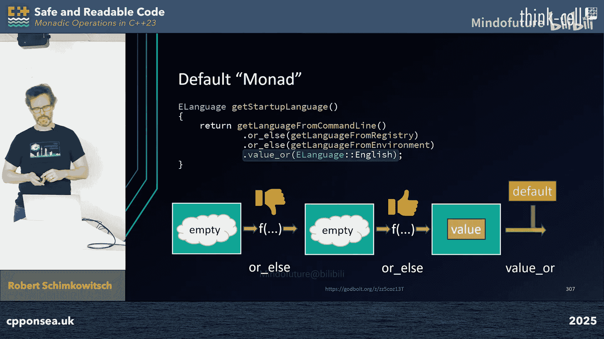

# 015：使用 C++23 中的单子操作编写安全、可读的代码


在本节课中，我们将要学习如何使用 C++23 标准库中的单子操作来编写更安全、更易读的代码。我们将从分析传统代码的问题开始，逐步介绍函子和单子的核心概念，并通过具体的代码示例展示如何应用它们来简化错误处理、数据转换和异步操作。

## 概述：为什么需要新的编程范式

想象一下，你遇到了一段传统的 C++ 代码。这段代码将核心逻辑与错误处理混杂在一起，使得一眼难以看出函数的主要功能。此外，它的返回类型只是一个表示成功与否的布尔值，而真正的返回值则隐藏在参数链的末尾。这种风格不仅难以阅读，也容易出错。

上一节我们介绍了传统代码的痛点，本节中我们来看看有哪些替代方案。使用异常是一种选择，但它要求你在调用栈的某处抛出，在另一处捕获，如果忘记捕获就会导致程序崩溃。而且，关于是否应该将异常用于主要错误处理，业界一直存在讨论。

另一种方法是使用类的成员变量作为错误标志，但这只是将检查代码移动了位置，并未真正解决问题，反而创建了一个共享的可变状态，这对局部推理和线程安全都是有害的。

## 函子：分离“做什么”与“在哪做”

让我们退一步，先看看返回类型的问题。我们可以将成功标志与实际输出合并到一个 `std::optional` 中。如果 `optional` 为空，则意味着失败；如果它持有值，我们就可以使用它。这样，我们就能扔掉所有的 `if` 语句，让 `std::optional` 为我们处理错误。

这种方式清晰地展示了操作序列，并且 `optional` 为我们处理了错误，我们不会忘记它。这就是**单子操作**在起作用。

在深入单子之前，我们需要先理解**函子**，因为每个单子都是一个函子。

### 函子是什么？

函子可以被看作一个“魔法盒子”或容器。你放入一袋建筑材料，送入一个带有图纸的工人，然后就能取出一袋房子。在代码中，函子是一个类，它持有我们想要在下一步转换的值作为成员，并通常有一个名为 `transform` 的成员函数。这个函数接受一个能转换单个参数的函数，然后函子将这个函数应用到整个容器（例如 `vector`）上。

以下是函子必须遵循的两条规则：

1.  **组合规则**：如果我们能将两个独立的函数组合成一个，并将其应用到函子上，那么结果必须与我们在管道中分阶段应用这两个函数得到的结果完全相同。
2.  **恒等规则**：应用恒等函数（即接收一个参数并原样返回的函数）必须得到与初始输入完全相同的结果。这保证了函子不能使用任何内部或外部状态来影响结果，只能使用你传递的函数。

### 标准库中的函子：Ranges 视图

我们不需要自己实现函子。C++ 标准库的 Ranges 提供了 `std::views::transform`，它就是一个函子。我们可以使用管道操作符 `|` 来构建清晰的数据处理管道。

```cpp
auto result = input_range
            | std::views::transform(function1)
            | std::views::transform(function2);
```

这种方式表达了清晰的意图。但需要注意的是，视图（views）通常是**惰性求值**的，并且**不拥有底层数据**，你必须注意数据的生命周期。视图返回的类型是编译器相关的，通常需要使用 `auto`，这可能会影响代码的模块化。

作为替代，C++23 提供了 `std::ranges::to` 来将视图立即转换为容器，但这会失去惰性求值的特性并可能分配内存。

### 使用函子时的安全陷阱

使用 Ranges 视图时，一个常见的陷阱是悬垂引用。考虑以下场景：

```cpp
struct Entry { int id; std::string text; };
Entry get_nearest_entry(int id); // 返回值
std::string& get_text(Entry& e); // 返回引用

std::vector<int> ids = {1, 2, 3};
auto view = ids
          | std::views::transform(get_nearest_entry) // 返回临时 Entry 对象
          | std::views::transform(get_text); // 试图获取临时对象成员的引用 -> 悬垂引用！
```

`get_nearest_entry` 返回一个临时的 `Entry` 对象，而 `get_text` 返回其成员 `text` 的引用，这就产生了悬垂引用。使用地址清理器（如 ASan）可以帮助发现这类问题。

## 如何传递函数给函子和单子

开始使用这种编程风格时，有时很难找到传递函数的正确方式。以下是一些便捷的方法：

*   **自由函数/静态成员函数**：只要没有重载，可以直接传递函数名。
*   **内联 Lambda 表达式**：在需要的地方编写简短的代码，非常适合简单、不重复使用的逻辑。Lambda 对于解决重载问题或绑定额外参数非常有用。
*   **函数对象**：带有 `operator()` 的类，提供比 Lambda 更多的灵活性。
*   **`std::function`**：用于从外部注入行为，允许用户自定义算法。它接受任何可调用对象。
*   **模板参数**：使用模板参数和 `std::invocable` 概念可以更好地控制签名并获得更好的运行时性能，但会增加代码复杂性。

**总结**：Lambda 表达式非常灵活，是传递可调用对象的“瑞士军刀”。`std::function` 则适合用于注入行为，为你提供了一个良好的入门工具集。

## 单子：函子的增强版

现在我们已经了解了函子，可以讨论单子了。单子拥有函子的所有属性，外加一些额外能力。简单来说（从实用角度），**单子是一个能够解开一层嵌套的函子**。

例如，我们有一个树形结构，节点有一个 `get_children` 函数，它返回一个 `std::vector<Node>`。如果我们对一组节点调用 `get_children`，会得到一个 `vector<vector<Node>>`。为了继续处理，我们需要将这个嵌套的向量“展平”成一个 `vector<Node>`。这个“展平”或“连接”的操作就是单子提供的核心能力。

单子通常将 `transform`（映射）和 `join`（连接）操作结合在一个函数里，比如 `and_then`。

### 示例：使用单子处理编译器诊断信息

假设我们有一个项目，包含多个文件，每个文件编译后可能产生多个诊断信息。传统的循环嵌套写法意图模糊。使用单子风格，我们可以这样写：

```cpp
// projects 是一个 vector<Project>
auto all_diagnostics = projects
                     | std::views::transform(get_files_in_project) // vector<vector<File>>
                     | std::views::join                            // vector<File> (单子操作：展平)
                     | std::views::transform(compile_file)         // vector<vector<Diagnostic>>
                     | std::views::join                            // vector<Diagnostic> (单子操作：展平)
                     | std::views::transform(print_diagnostic);
```

这段代码清晰地表达了数据流：获取所有项目的所有文件，编译它们，收集所有诊断信息，然后打印。其逻辑顺序与传统循环完全相同，但意图更清晰。

## 纯函数：安全性的基石

为了安全地使用函子和单子（特别是 Ranges），**纯函数**是关键。纯函数有两个特性：
1.  **确定性**：对于相同的输入，总是返回相同的输出。
2.  **无副作用**：不修改函数栈外的内存，不触发外部 I/O 等操作。

纯函数有很多优点：易于推理、易于单元测试、可以安全地用于并发环境。虽然现实中完全纯的函数很少，但我们应该尽可能让函数“足够纯”，这能显著提高代码的安全性。

回顾之前导致悬垂引用的 Lambda 例子，问题在于它通过引用捕获了外部状态。通过改为按值捕获，我们消除了这个副作用，使函数更接近纯函数，从而解决了问题。

## 错误处理：`std::optional` 和 `std::expected`

在生产代码中，错误处理不可避免。如果你不想或不能使用异常，`std::optional` 和 `std::expected` (C++23) 是很好的选择。

### 使用 `std::optional`

将可能失败的函数返回值改为 `std::optional<T>`。成功时返回包含值的 `optional`，失败时返回 `std::nullopt`。然后可以使用 `and_then` 来构建链式调用：

```cpp
std::optional<int> get_numeric_value(const Cell& c);

auto result = get_element(db, key)
            .and_then(get_table)          // 如果上一步成功，调用此函数
            .and_then([&loc](const Table& t) { return get_cell(t, loc); }) // 需要额外参数
            .and_then(get_numeric_value)  // 继续链式调用
            .transform(is_negative);      // 此函数不失败，用 transform
// result 是 std::optional<bool>
```

`and_then` 会在前一个 `optional` 有值时调用你给的函数，否则短路整个链条。`transform` 则用于那些不会失败的操作。

### 使用 `std::expected` 获得错误上下文

`std::optional` 只能告诉我们失败了，但不知道原因。`std::expected<T, E>` 可以携带错误信息 `E`。

```cpp
std::expected<Table, MyError> get_table(const Element& e);

auto result = get_element(db, key)
            .and_then(get_table)
            .and_then([&loc](const Table& t) { return get_cell(t, loc); })
            .and_then(get_numeric_value)
            .transform(is_negative)
            .or_else([](MyError err) { // 只在错误时调用
                log_error(err);
                return std::unexpected(err); // 可选择传递或转换错误
            });
```

### 选择第一个成功的操作：`or_else`

有时我们需要尝试一系列操作，直到第一个成功。这可以用 `optional` 的 `or_else` 来实现：

```cpp
std::optional<Language> get_app_language() {
    return get_language_from_command_line()
          .or_else(get_language_from_registry)
          .or_else(get_language_from_env_var)
          .or_else([]{ return std::optional(Language::English); }); // 默认值
}
```

严格来说，`or_else` 并不是单子操作（因为它不涉及类型转换或展平），但它非常实用。

## 处理常见的编译器错误

使用单子操作时，你可能会遇到不熟悉的编译器错误。以下是一个快速排查清单：
1.  **定位错误阶段**：如果错误信息难以理解，尝试拆分管道，直到定位到具体出错的阶段。
2.  **检查重载函数**：如果使用了重载的函数名，用 Lambda 包装它来帮助编译器选择正确的重载。
3.  **检查类型匹配**：对于 Lambda，尝试用具体的类型替换 `auto` 参数，明确写出返回类型。
4.  **检查 `join` 次数**：确保你展平了正确层数的嵌套。
5.  **慎用 `const`**：在泛型函数中，避免使用 `const` 引用，考虑使用转发引用或按值传递（如果拷贝成本低）。
6.  **区分 `and_then` 和 `transform`**：确保在应该返回 `optional/expected` 的地方使用 `and_then`，在返回普通值的地方使用 `transform`。

## 组合单子：更强大的抽象

单子本身很有用，但组合它们能实现更强大的功能。例如：
*   **延续单子**：用于异步编程，可以将计算轻松转移到其他线程，并在完成后触发延续操作。虽然 C++26 可能有相关支持，但现在可以使用第三方库（如 `concurrencpp`）。
*   **Writer 单子**：用于无锁的跟踪和日志记录。它将跟踪信息作为计算的一部分收集起来，而不需要全局锁。
*   **组合它们**：你可以将 Writer 单子与延续单子组合，实现带有无锁、按管道跟踪的并发计算。

## 性能考量

性能总是需要考虑的。基准测试表明：
*   **Ranges 视图 vs 手写循环**：在热路径上，高度优化的手写循环通常最快。Ranges 视图可能慢 2-13 倍，但仍比经典的、每次创建中间向量的循环快。使用 `std::ranges::to` 预先转换为容器会带来额外开销。
*   **错误处理机制**：在成功路径上，各种方法（布尔标志、`optional`、`expected`、异常）性能接近。在失败路径上，布尔标志最快，`optional/expected` 稍慢，异常（特别是在 Windows 上）可能非常慢。

**关键点**：如果你追求极致性能，手写特定优化代码是最好的。然而，单子操作能以合理的性能代价提供更清晰、更模块化的代码。你需要了解应用程序的热路径，并据此做出权衡。

## 总结与要点

本节课中我们一起学习了如何使用 C++23 的单子操作来编写更安全、更易读的代码。

1.  **函子和单子是有用的概念**：函子帮助我们将通用的、重复性的代码（如“应用到容器”）提升出来，分离“做什么”和“在哪做”。单子在此基础上增加了处理嵌套数据结构（展平）的能力，使得构建复杂的数据处理管道成为可能。
2.  **纯函数有益于代码健康**：它们使代码更安全、更易于测试。这个原则不仅适用于函子和单子，也适用于所有代码。
3.  **C++23 的单子操作立即可用**：你不需要深入理解背后的理论就能从这些工具中受益。在编写新代码时，可以考虑它们是否适合你的场景。
    *   **Ranges 视图**：适用于输入输出是范围/容器的管道。
    *   **`std::optional`**：适用于管道中部分或全部函数可能失败的场景。
    *   **`std::expected`**：在需要提供详细错误信息时使用。
    *   **`optional` + `or_else`**：适用于需要从一系列函数中获取第一个可用结果的场景。




这些工具将帮助你编写出更安全、更易读的代码。