# 016：C++库未来的10个基本特性 🚀

在本教程中，我们将学习马特乌什·普什在C++-On-Sea-2025大会上分享的关于如何改进C++库开发体验的18个关键特性。我们将探讨如何改进接口设计、提升编译时调试能力、获得更好的编译错误信息、增强安全性、优化模板工具以及更好地分发和消费库。内容面向初学者，力求简单直白。

---

## 改进接口设计 🛠️

上一节我们概述了课程内容，本节中我们来看看如何改进库的接口设计。

### 类型安全与概念

C++是一种类型安全的语言，但使用裸模板参数（如 `typename` 或 `auto`）会破坏这种安全性。它们就像是C++中的 `void*`，使得接口难以理解，错误信息不友好，并且容易在库的实现深处导致编译崩溃。

**示例：不明确的接口**
```cpp
template<typename R1, typename R2>
auto operator/(const quantity<R1>& lhs, const quantity<R2>& rhs);
```
这个接口没有说明 `R1` 和 `R2` 应该是什么，返回值是 `auto`，用户无法从声明中了解其行为。

使用C++20的概念可以显著改善这一点：
```cpp
template<Quantity Q1, Quantity Q2>
  requires std::same_as<typename Q1::dimension, typename Q2::dimension>
auto operator/(const Q1& lhs, const Q2& rhs) -> quantity<...>;
```
概念在接口边界过滤了无效类型，提供了更好的编译时错误信息。

### 对称接口与值类别

模板参数存在“依赖”与“非依赖”的区别，这会影响参数初始化时的转换规则，可能导致接口不对称。

**问题示例：不对称转换**
```cpp
template<typename R, typename Rep>
quantity(const Rep& value); // 非依赖参数，允许隐式转换
template<typename R, typename Rep>
quantity(const quantity<R, Rep>& other); // 依赖参数，转换规则更严格
```
如果传递一个可转换为 `quantity` 但不是 `quantity` 类型的对象，第一个构造函数可以工作，第二个则可能失败。

**解决方案：使用概念统一参数类别**
```cpp
template<Quantity Q1, Quantity Q2>
  requires std::same_as<typename Q1::dimension, typename Q2::dimension>
auto operator+(Q1&& lhs, Q2&& rhs);
```
通过使两个参数都依赖于概念，我们确保了对称的转换规则。

### 契约（Contracts）

概念处理了编译时要求，但运行时要求（如前置条件）通常通过宏或注释来指定，这不直观且不是声明的一部分。

C++26将引入契约，允许我们在函数声明中直接指定运行时条件：
```cpp
auto compute_speed(Quantity auto distance, Quantity auto time)
  [[pre: distance > 0 && time > 0]] -> Quantity auto;
```
契约将在调试构建中被检查，并可能为编译器优化提供依据，极大地改善了接口的自我描述性。

### 类类型作为非类型模板参数（NTTP）

C++20允许类类型作为非类型模板参数（NTTP），这是过去十年模板元编程最重要的改进之一。

**示例：使用NTTP定义单位**
```cpp
using speed = quantity<dimension<length, 1>, dimension<time, -1>, unit<meter_per_second>>;
// 可以简化为：
quantity<isq::speed[km / h]> q;
```
每个参数（如维度、单位）现在都可以是NTTP，使得代码更直观、类型更丰富。

然而，NTTP要求类型是“结构类型”，即所有成员都是公开且不可变的，这牺牲了封装性。

**问题：封装性牺牲**
```cpp
struct point {
    double value; // 必须为public，否则不能作为NTTP
};
```
用户可能直接访问这些本应是实现细节的公共成员。

**未来解决方案：P2489提案**
该提案允许具有私有成员的类作为NTTP，通过提供 `to_meta_repr` 和 `from_meta_repr` 函数（可能利用反射）来实现序列化。这将解决封装性问题。

---

## 通用模板参数与概念 🔄

上一节我们介绍了接口改进，本节中我们来看看如何使模板参数和概念更加通用和灵活。

### 转发引用与概念

使用转发引用（`auto&&`）与概念结合时，需要注意推导出的类型会包含引用和cv限定符，这可能与概念期望的“纯净”类型不匹配。

**问题示例：类型不匹配**
```cpp
template<Quantity Q>
void foo(Q&& q) { // q可能是 `quantity&` 或 `const quantity&`
    // 概念 `Quantity<decltype(q)>` 可能失败
}
```
通常需要编写 `std::remove_cvref_t<decltype(q)>` 来匹配概念。

### 概念模板参数

在C++20中，概念本身不能作为模板参数，这限制了代码的通用性。C++26将允许概念和变量模板作为模板参数。

**C++20的局限**
```cpp
template<template<typename> typename Pred, typename... Ts>
constexpr bool all_of = (Pred<Ts>::value && ...); // 只能接受类型模板
```
为了接受值谓词或概念谓词，需要编写多个重载或包装器。

**C++26的改进**
```cpp
template<template auto Pred, auto... Args>
constexpr bool all_of = (check<Pred, Args> && ...);
```
现在，`Pred` 可以是一个类型模板、变量模板或概念，`Args` 可以是类型或值。这使得编写真正通用的算法成为可能。

**示例：统一 `all_of` 算法**
```cpp
template<template auto Pred, auto... Args>
constexpr bool all_of = (check_predicate<Pred, Args> && ...);

// 可以用于各种谓词
static_assert(all_of<std::floating_point, float, double>);
static_assert(all_of<std::is_negative, -1, -2.5>);
static_assert(all_of<Quantity, 1 * m, 2 * s>);
```

### 可推导的this（Deducing this）

C++23引入了“可推导的this”特性，它允许在成员函数中推导对象类型，简化了CRTP模式和一些泛型代码的编写。

**传统CRTP模式**
```cpp
template<typename Derived>
struct base {
    void interface() {
        static_cast<Derived*>(this)->implementation();
    }
};
```

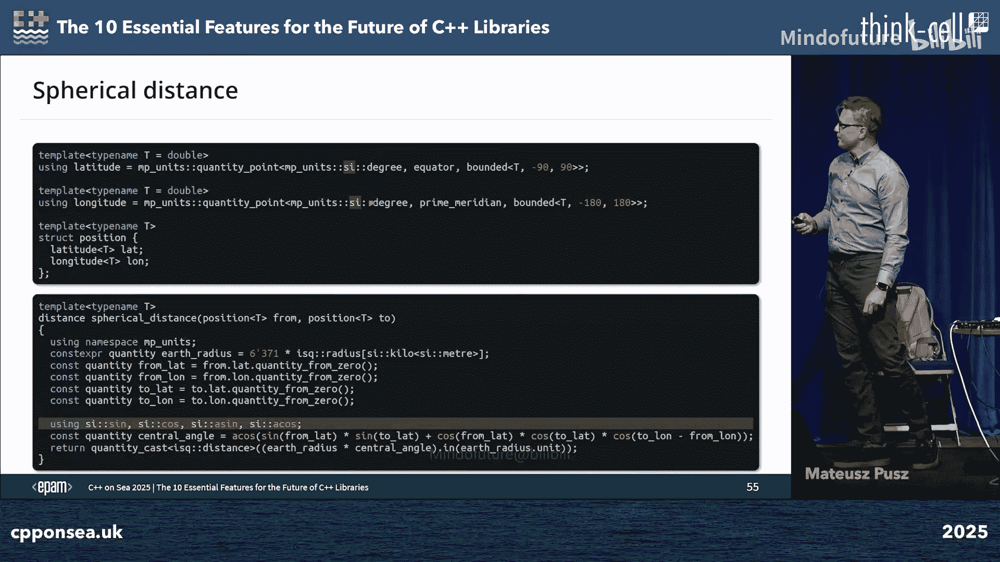

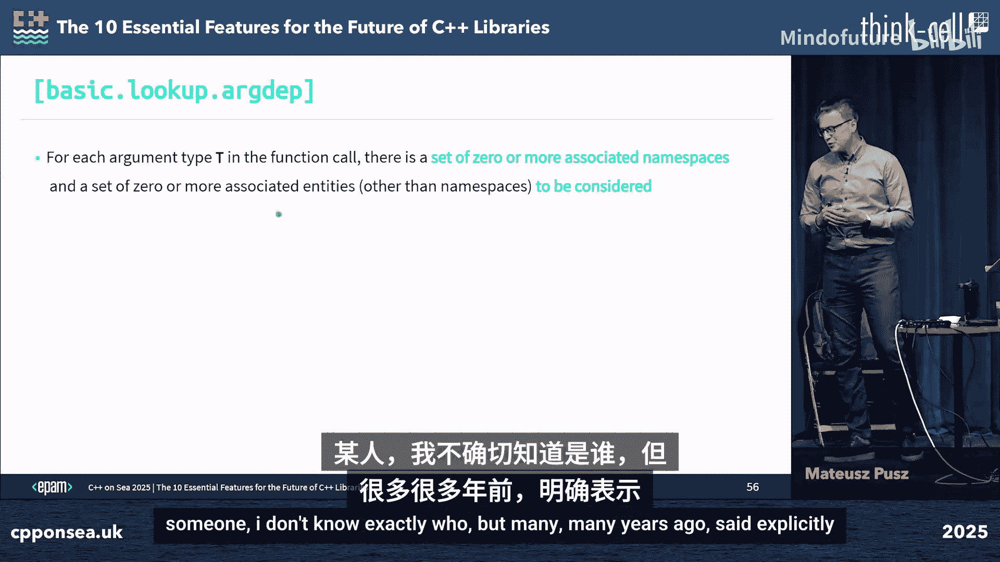

**使用可推导的this**
```cpp
struct my_type {
    void interface(this auto&& self) {
        self.implementation();
    }
};
```
这使代码更简洁，并减少了样板代码。

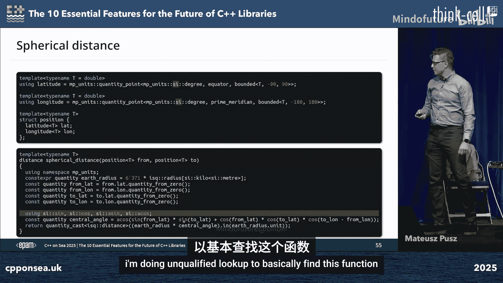

---

## 编译时调试与错误信息 🐛

上一节我们讨论了模板的通用性，本节中我们来看看如何提升编译时调试体验和错误信息质量。

### 编译时打印

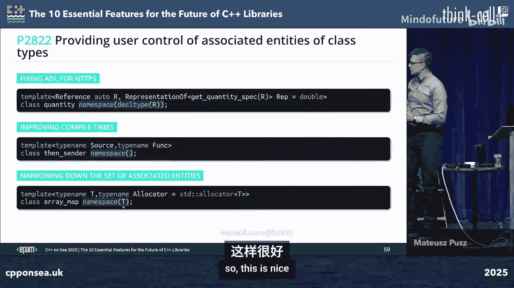

运行时调试可以使用打印和调试器，但编译时逻辑（尤其是consteval函数和模板元编程）没有调试器。最简单的调试方法是“打印”类型或值。

**当前方法：静态断言或类型依赖**
```cpp
static_assert(false, “Check point”); // 硬错误，不灵活
using DebugType = T; // 在错误信息中查看T
```
这些方法不灵活，且可能中断编译。

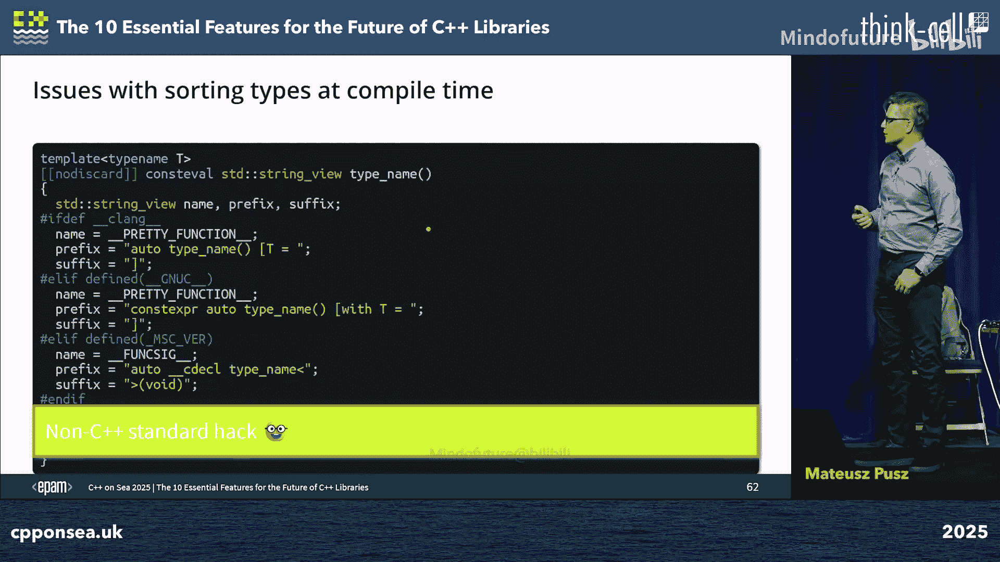

**未来希望：编译时诊断信息**
提案P2741等旨在允许库作者在编译时生成警告、错误或笔记信息，并可通过编译器标志控制。
```cpp
if consteval {
    std::compile_warn(“Unexpected path taken”, some_value);
}
```
这将极大帮助库开发者诊断复杂的模板实例化问题。

### 改进编译错误信息

泛型库的编译错误信息通常冗长晦涩。通过精心设计概念和约束，可以显著改善。

**使用概念提供清晰错误**
```cpp
template<Quantity Q>
auto to_kilometers(const Q& q) -> quantity<kilometer, typename Q::rep>
  requires (Q::unit == meter && std::is_convertible_v<typename Q::rep, double>);
```
当调用不匹配时，编译器可以明确指出哪个约束未满足，例如“`Q::unit` (seconds) is not a unit of length”。

**静态断言的局限**
静态断言（`static_assert`）会导致硬错误，阻止SFINAE和概念测试，不适用于约束检查。它们更适合验证类不变量。

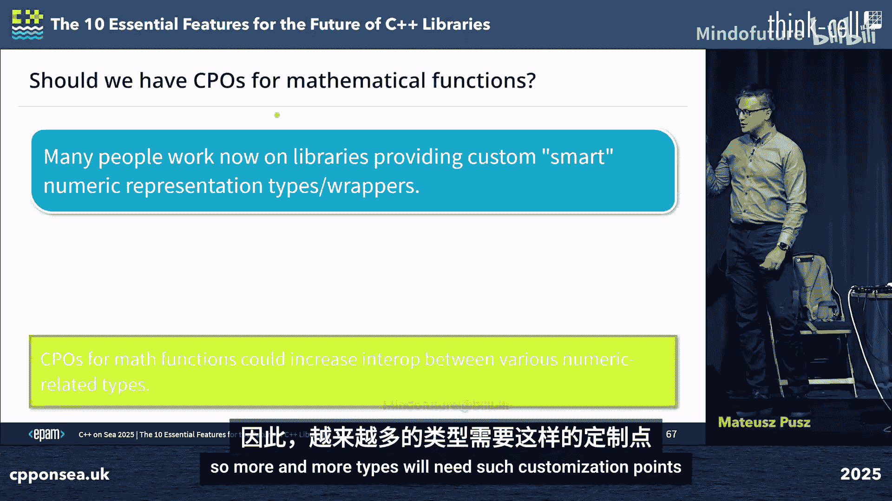

**概念与异常结合（未来）**
提案P2564允许在常量求值中抛出异常，结合“可修复的概念表达式”提案，可以实现优雅的错误信息传递。
```cpp
template<Quantity Q1, Quantity Q2>
auto add(Q1 a, Q2 b) -> decltype(a + b)
  requires (check_preserving_conversion(a, b) || throw std::logic_error(“...”));
```
当约束失败时，可以抛出一个带有描述性信息的异常，该异常信息会出现在编译错误中，指导用户解决问题。

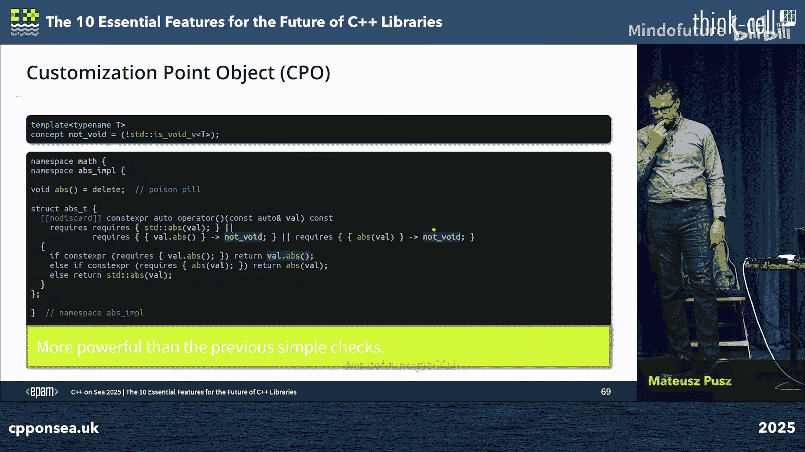

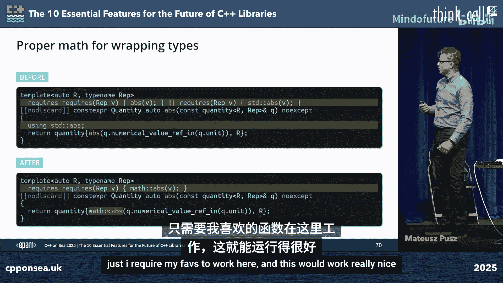

**示例：理想的错误信息**
```
error: no matching function for call to ‘add(meter, second)’
candidate template ignored: constraints not satisfied
note: because ‘unit_of_time’ is not convertible to ‘unit_of_length’
note: with message: cannot add quantities of different dimensions: length and time
```

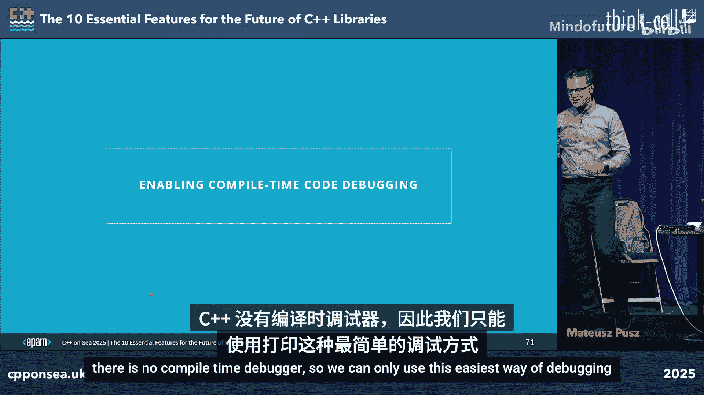

---

## 安全性增强 🛡️

上一节我们探讨了编译时调试，本节中我们简要讨论如何通过语言特性增强库的安全性。

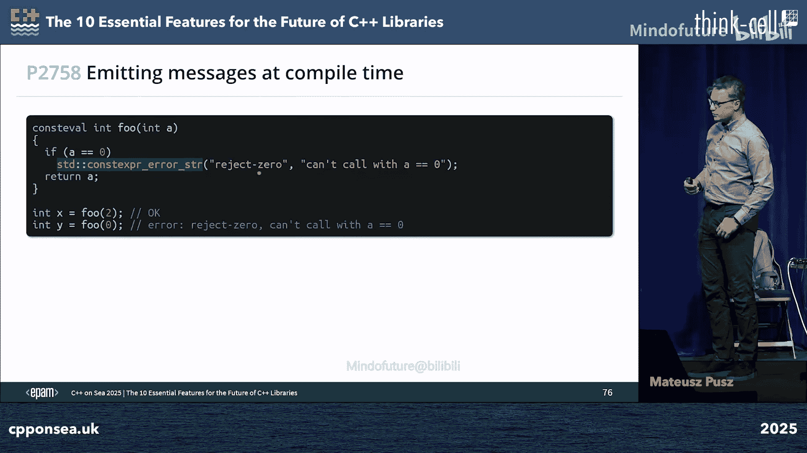

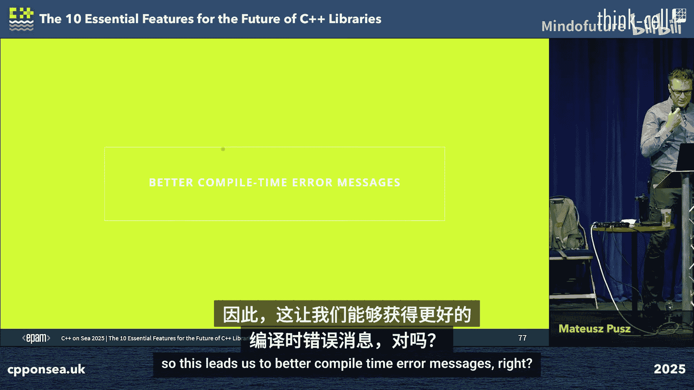

### 防止窄化转换

从浮点数到整数的转换是窄化转换，可能丢失信息。目前，标准库没有提供标准方法来检查转换是否值保留。

**当前状况**
```cpp
int i = 3.14; // 编译通过，但有警告
```
库作者需要自己实现检查，例如使用 `std::is_convertible_v` 和 `std::is_floating_point_v` 的组合，但这不完善。

**提案P2509：值保留转换**
该提案引入特性 `is_value_preserving_convertible`，它会检查在特定平台上转换是否真的保留值（例如，`int` 到 `double` 通常是值保留的）。
```cpp
if constexpr (std::is_value_preserving_convertible_v<From, To>) {
    // 安全转换
}
```
这将帮助库作者编写更安全的算术运算和转换操作。

### 文本输入解析

C++有强大的格式化输出库（如 `<format>`），但文本输入解析仍然薄弱。

**提案：文本扫描库**
类似于 `std::format` 的逆向操作，一个标准化的扫描库（可能基于现有的开源库如 `scanlib`）将提供类型安全、可配置的输入解析。
```cpp
int i; double d;
std::istringstream iss(“42 3.14”);
iss >> i >> d; // 传统方法，易错
// 未来可能：
std::scan_from(iss, “{} {}”, i, d); // 更安全、更灵活
```
这将补齐I/O库的短板。

### Unicode与国际化的支持

在2025年，C++仍然缺乏对Unicode和国际化的一流支持。这是一个需要社区投入的重大领域，包括字符串编码、区域设置和文本处理工具。

---

## 模板工具与库分发 📦

上一节我们讨论了安全性，本节最后我们看看如何改进模板工具和库的分发方式。

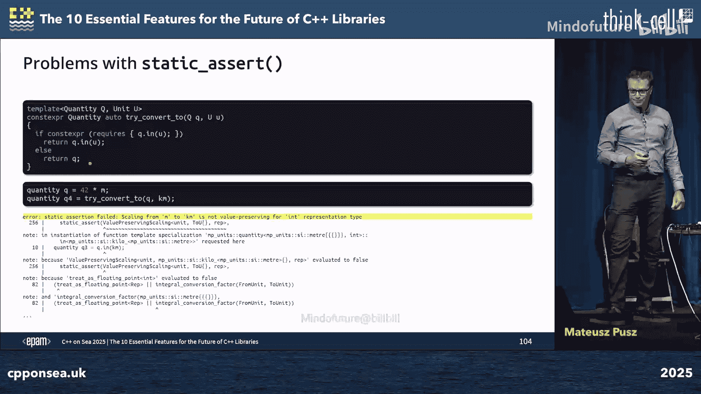

### 变量模板的改进

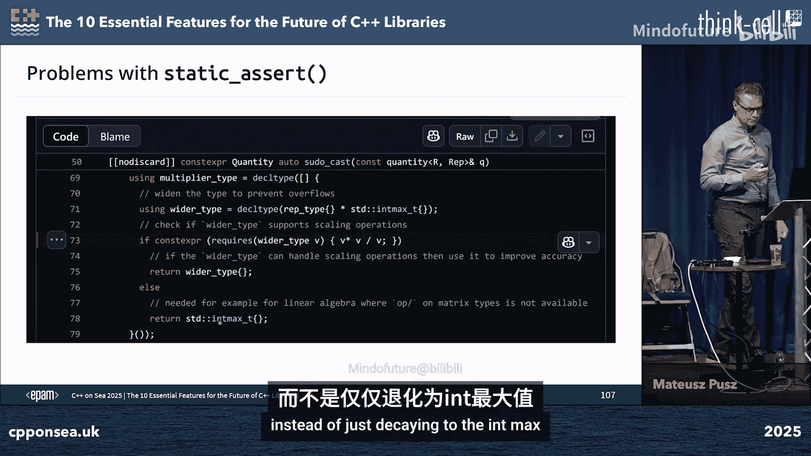

变量模板比类模板更简洁、编译更快。然而，变量模板必须有一个主模板定义，即使没有合理的默认值。

**问题：缺少默认值**
```cpp
template<typename T>
inline constexpr bool is_floating_point_v = std::is_floating_point<T>::value; // 有默认值

template<auto N>
inline constexpr bool is_positive = N > 0; // 对于非数值类型N，没有好默认值
```
提案P????（已废弃）曾建议允许 `= delete` 作为变量模板的主模板定义，以表示“无默认值，仅特化有效”。这需要有人重新推动。

### 关联命名空间与ADL

参数依赖查找（ADL）是编译时开销和歧义的来源之一。对于深度嵌套的模板类型（如发送器），ADL可能查找过多命名空间。

**提案P2672：指定关联命名空间**
该提案允许在类模板中显式指定哪些命名空间应参与ADL。
```cpp
template<typename T, typename Alloc>
class my_map
    [[associates(std)]]
    [[associates(typename T::associated_namespace)]] {
    // ...
};
```
这可以精确控制ADL范围，提升编译速度并避免歧义。

### 类型排序与规范化

在编译时操作类型列表（如类型集合）时，经常需要对类型进行排序或规范化，以确保相同集合的不同表示（如 `A, B` 与 `B, A`）产生相同的规范化类型。这有助于减少模板实例化，提高编译效率。

**C++26新特性：`std::type_identity_ordered`**
该特性提供了可移植的类型排序谓词。
```cpp
using normalized = type_set_sort_t<type_list<B, A, A>, std::type_identity_ordered>;
// normalized 应为 type_list<A, B>
```
这对于实现 `std::variant` 的规范化、策略排序等非常有用。

### 库分发：通用包描述格式

分发C++库通常需要编写复杂的CMake/Conan配置文件。不同构建系统间的配置重复且容易出错。

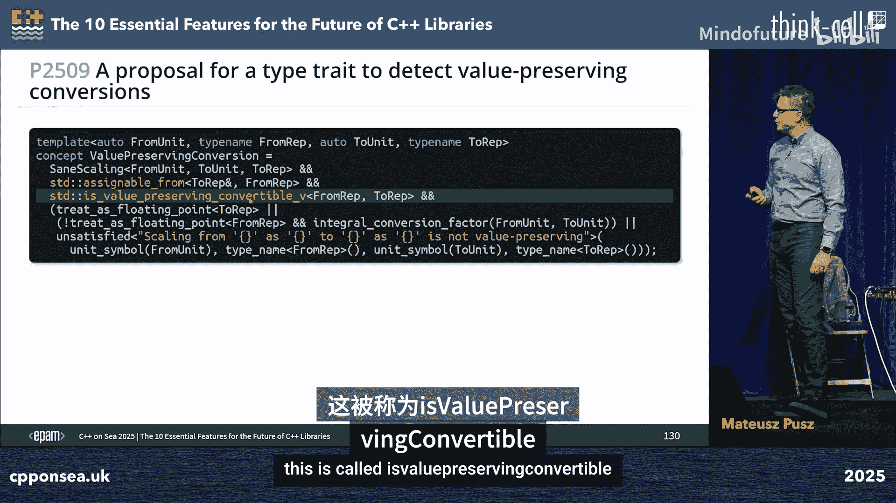

**提案P????：通用包描述格式（CP）**
该提案引入一种与构建系统无关的包描述文件（如 `package.cp.json`），由构建工具（如CMake）自动生成。它包含了库的所有元数据（目标、依赖、编译标志等）。
```cpp
// CMakeLists.txt
add_library(mylib ...)
install(TARGETS mylib
        PACKAGE_DESCRIPTION_FILE mylib.cp.json)
```
然后，包管理器或构建系统可以直接消费这个 `.cp.json` 文件，无需解析复杂的构建脚本。这简化了库的消费和分发。

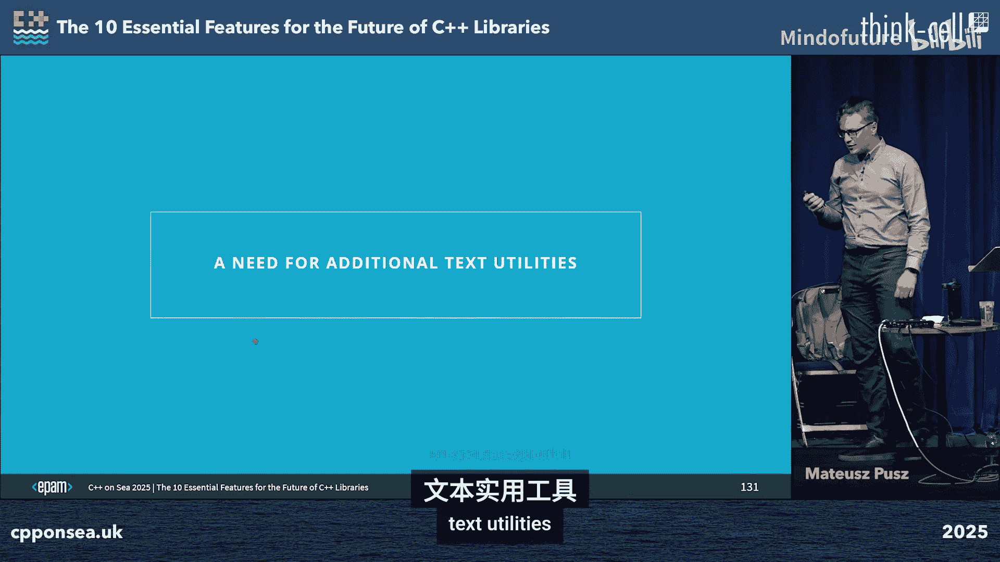

---

## 总结 🎯

在本教程中，我们一起学习了马特乌什·普什提出的改进C++库开发体验的多个关键方向：

1.  **接口设计**：使用概念、契约和NTTP来创建更安全、更清晰、更对称的接口。
2.  **通用编程**：利用概念模板参数、可推导的this和未来的通用模板参数来编写更灵活、更少重复的代码。
3.  **编译时体验**：通过编译时诊断、改进的错误信息（结合概念与异常）来提升调试和排错效率。
4.  **安全性**：通过值保留转换检查、文本输入解析库来增强代码的健壮性。
5.  **工具与分发**：改进变量模板、控制ADL、使用类型排序来优化编译；采用通用包描述格式来简化库的分发和集成。

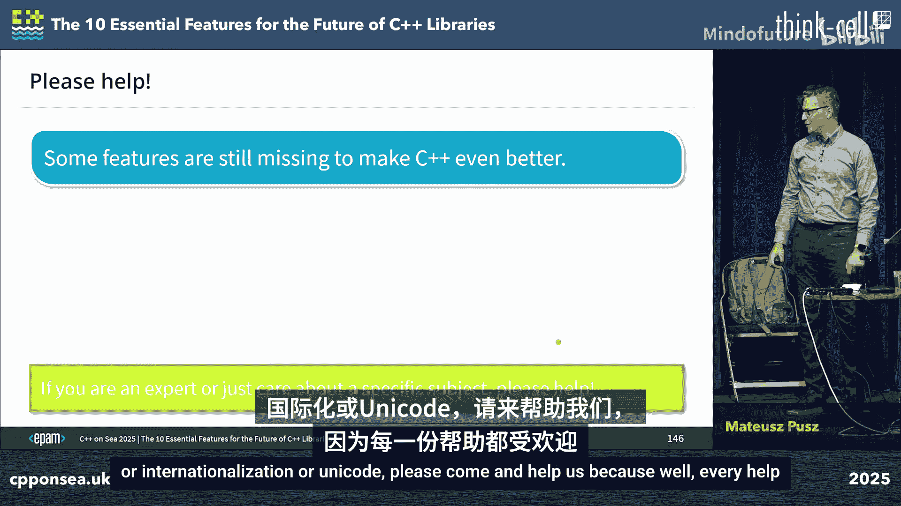


C++是构建高性能、零开销抽象泛型库的绝佳语言。随着概念、契约、反射等特性的成熟，以及社区对上述缺失特性的完善，我们将能够为用户提供无比强大且友好的库开发体验。如果你对某个特定领域（如数学库、Unicode、包管理）感兴趣，欢迎参与标准化工作，共同推动C++生态进步。