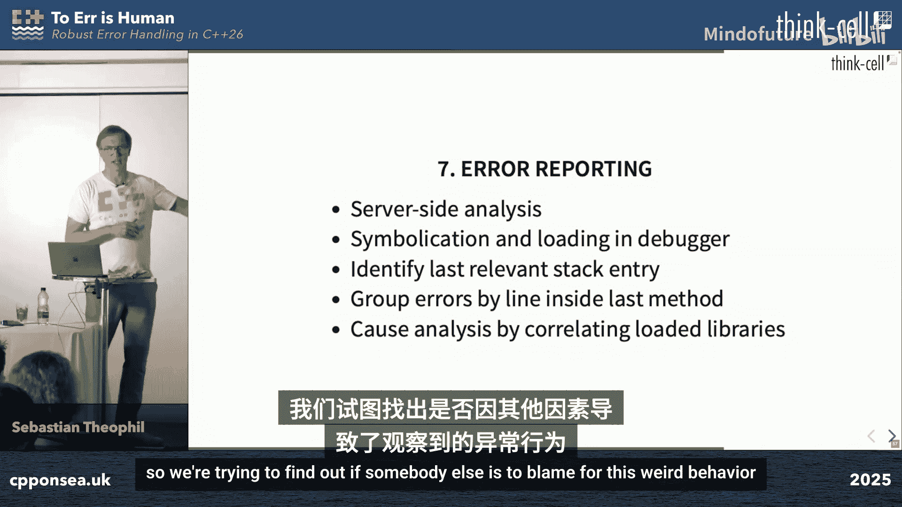

# 017：健壮的C++26错误处理 🛡️

在本教程中，我们将学习C++中用于捕获和处理错误的工具。我们将从最古老的C风格错误码开始，逐步探讨异常、`std::expected`、契约（Contracts）和库强化（Library Hardening）等现代机制。最后，我们将聚焦于最佳实践，讨论应该处理哪些错误以及如何高效地处理它们。

## 错误处理概述 🎯

错误处理是一个广泛的领域。在本课程中，我们讨论的不是那种关乎生命安全的“硬核模式”可靠性工程。我们处理的是程序错误、不可预见的系统配置和用户行为。我们假设内存正常工作，计算机不会爆炸，即运行在“简单模式”。我们的目标是快速交付稳定、对用户有价值的产品，而良好的错误处理是实现这一目标的关键。

## C风格错误码 📜

最古老的错误处理方式是C风格错误码。以`open`函数为例：
```c
int fd = open(“path/to/file”, O_RDONLY);
if (fd == -1) {
    // 检查 errno 以了解具体错误
    perror(“open failed”);
}
```
该函数返回一个整数文件描述符，或在失败时返回-1，并通过全局变量`errno`指示错误类型。错误类型繁多，从“文件不存在”到“地址越界”等程序错误都有。

Windows API采用类似模式，例如`CreateFile`函数，并通过`GetLastError()`获取更多错误信息。

标准库函数如`strtol`（字符串转长整型）则更为复杂。它通过返回值、输出参数和`errno`共同表示成功、转换失败或溢出等不同情况。开发者必须仔细检查所有情况，这很不方便。

由于操作系统为了最大兼容性将永远使用这些C风格函数，因此这种错误处理方式永远不会消失。我们需要工具来优雅地处理它们。

## C++异常机制 ⚡

C++引入了更好的机制：异常。尽管如今异常名声不佳，常被批评为“ glorified goto”、难以推理、性能低下，并且要求编写异常安全代码，但它们在某些情况下仍是合适的工具。

考虑以下场景：执行HTTP请求、解析返回的JSON并将结果写入文件。
```cpp
try {
    auto response = fetchHttpData(url);
    auto data = parseJson(response);
    writeToFile(“output.txt”, data);
} catch (const NetworkError& e) {
    // 处理网络错误
} catch (const JsonParseError& e) {
    // 处理解析错误
} catch (const FileError& e) {
    // 处理文件错误
}
```
代码中每一行都可能失败。异常的解栈（unwinding）特性使得库开发者（如JSON解析库）的生活更轻松，也间接使调用方更轻松。与返回码相比，异常的优势在于：
*   **类型丰富**：异常类型可以编码错误信息。
*   **信息丰富**：作为类，异常可以包含更多关于错误内容和位置的元数据。
*   **代码清晰**：快乐路径（happy path）的代码完全清晰，没有任何错误处理控制流，易于推理。

在类似上述的局部上下文中，异常是合适的工具，前提是只在能够理性处理的地方捕获它们。然而，它们的缺点依然存在：错误路径慢、序列化（一次只能抛出一个异常）、以及必须编写异常安全代码。

有一场由Pete Maloon主讲的优秀演讲《Exceptionally》讨论了异常的错误使用方式，并清理了那些不应使用异常的场景，只留下真正适合使用异常的情况。

## `std::expected`：返回值与异常的结合 🔄

那么，有没有办法结合返回值的简单性和异常的语义丰富性呢？这正是`std::expected`的目标。它本质上是一个返回码，但和异常一样丰富。其理念是将异常作为错误码，从而结合两者优点。这样还可以同时保存多个错误，跨线程传递、收集、分组和转换它们，比实际的异常更灵活。

`std::expected`是C++23的特性。以下是使用示例：
```cpp
std::expected<int, ParseError> parseInteger(std::string_view str);

std::expected<double, std::string> calculateInverse(std::string_view str) {
    auto result = parseInteger(str);
    if (!result) {
        return std::unexpected(“Parse failed”);
    }
    int value = *result;
    if (value == 0) {
        return std::unexpected(“Division by zero”);
    }
    return 1.0 / value;
}
```
`std::expected`接口简单，可用于标准命令式编程。然而，它更优雅的接口是其**单子式（monadic）函数式接口**：
```cpp
std::expected<double, std::string> result = parseInteger(str)
    .transform([](int i) { return 1.0 / i; }) // 成功时转换值
    .transform_error([](ParseError e) { return “Parse error”; }); // 错误时转换错误
```
`.transform`仅在成功时调用，`.transform_error`仅在错误时调用。这种方式更优雅，因为它不包含显式的流程控制语句，每个转换都是可以独立推理的函数，形成了优雅的数据流。这使得开发者更不容易在深层的`if-else`语句中犯错。

`std::expected`应该是C++中错误报告的新默认方式。如果你只关心操作是否失败，而不关心原因，可以使用`std::optional`。否则，`std::expected`是合适的工具。

## 契约（Contracts） 📝

契约机制刚刚被投票纳入C++26。它本质上是一种更灵活、标准化的断言机制，主要用于检查代码自身的不变量、前置条件和后置条件。其最重要的特性是**构建时可自定义行为**，这比旧的`assert`宏（在调试版本中总是终止，在发布版本中不启用）有了巨大改进。

契约的语法如下：
```cpp
int foo(int x)
    [[pre: x > 0]]          // 前置条件：检查参数
    [[post r: r > 0]]       // 后置条件：检查返回值r
{
    [[assert: x != 42]];    // 断言（契约断言）
    return x * 2;
}
```
*   前置条件在函数参数初始化后、函数体运行前求值。
*   后置条件在返回值初始化后、局部变量析构后求值。
*   契约断言用于替代C风格断言。
*   它们支持常量表达式上下文。

契约语义可在构建时配置：
*   **ignore**：忽略所有契约违反（类似旧assert在发布版本的行为）。
*   **observe**：调用契约违反处理程序，但程序继续运行（适用于游戏和桌面应用）。
*   **enforce**：调用处理程序后终止程序（适用于需要严格控制的场景，如Bloomberg的交易处理）。
*   **terminate**：立即终止（适用于医疗设备、飞行控制系统等安全关键场景）。

契约违反处理程序是可定制的：
```cpp
void handle_contract_violation(const std::contract_violation& violation) {
    // 记录、上报或执行其他自定义逻辑
}
```
这为钩入外部库的契约提供了一种通用方式。契约不允许有破坏程序正确性的副作用，并且各个契约之间应该是独立的。如果选择`ignore`语义，它们应该对程序行为零开销。契约的最大优点可能是为所有库提供了一个标准的、可定制的断言机制。

## 库强化（Library Hardening） 🛠️

库强化也是C++26的新特性。强化库实现会强制执行标准中当前定义但通常不在运行时检查的前置和后置条件。微软长期以来提供的“调试迭代器”就是类似的强大工具，现在将转向库强化标准。

根据最新提案，库强化基于契约。例如，如果你访问`std::vector`中不存在的元素，将触发契约违反，从而调用你的契约违反处理程序。这将捕获大量错误。

在实践中，例如对于LLVM的libc++，有不同的强化级别可以启用或禁用，因为某些级别会影响性能。你可以在调试版本中启用有性能影响的强化功能，而在发布版本中禁用。库强化是STL实现的一个属性，可以开关。

## 最佳实践：处理什么与如何处理 🎯

我们拥有如此多的错误报告选项，但时间有限。我们不是为了处理错误而获得报酬，目标也不是完美的错误处理，而是快速交付稳定产品。糟糕的错误处理会导致更多错误。因此，我们寻找的是如何快速在线发现错误。

错误处理必须**简单**，否则我们不会去做；必须**可测试**，否则不会有效；必须**聚焦于关键之处**，否则会浪费时间。

以下是我们的做法：

**首先，检查所有内容。**
每个API调用都会被检查。我们为操作系统函数可能返回的每种错误码变体都准备了宏，让检查变得非常容易。我们还有对HRESULT、GError、Mac内核错误等的包装器。我们还会在发布版本中进行积极的断言，断言所有我们能想到的不变量、前置和后置条件。默认情况下，我们使用`noexcept`，对于我们认为不应抛出异常的地方都进行标记。未处理的异常会导致程序终止，因此我们不如立即终止，并设置终止处理程序以在发现意外异常时获得通知。

**默认假设一切正常。**
目标是保持代码路径集非常小，保持程序状态集小，从而使推理程序变得容易。当然，这有一个大例外：我们假设一切正常，除非我们知道它不会。

例如，在POSIX系统上打开文件时，我们知道某些错误（如文件不存在、权限不足、磁盘空间不足）总是会在某些机器上发生，因此我们处理这些情况。对于任何其他错误，我们假设不会发生，甚至不处理。

**当假设被证明错误时。**
检查最终会失败，你会发现假设错误的地方。首要任务是**收集尽可能多的信息**。在客户端，我们会发送带有内存转储的错误报告到后端。在服务器端，我们会挂起线程并通知管理员进行实时调试。第二个优先级是**以某种方式继续运行**。在关键错误之后，语义上行为是未定义的，我们会禁用进一步的错误报告，但不会终止程序，因为断言可能是错误的。我们不希望开发者因为害怕断言导致客户投诉而不敢编写断言。

**聚焦于真正重要的问题。**
我们有一个后端接收所有错误报告。我们可以按构建版本、操作系统、错误信息等进行过滤。我们查看最常发生故障的代码位置，并优先处理它们。我们甚至建立了与客户的双向通信：当错误发生时，客户端调用后端，后端分析问题后可以回调客户端，例如发送包含修复版本下载链接的消息，软件可以静默下载、安装甚至重新加载，在最佳情况下用户完全不会察觉。

**错误分类与处理。**
我们将错误分为不同类别，具有不同的严重性和行为：
1.  **关键错误**：如空指针访问、API调用返回意外错误或断言失败。这些是程序错误，我们预期它们不会发生。发生后程序处于无效状态，我们发送错误报告、禁用后续报告，仅在不可能是误报时才显示用户消息。
2.  **未测试行为错误**：例如，从无效UTF-8范围获取代码点失败。错误处理代码很少（例如返回替换字符），但我们想知道何时发生、来自哪个用户，以便了解上下文。我们发送错误报告但不禁用后续报告，但可能会限制报告频率。
3.  **糟糕用户体验错误**：已知、可重现、已正确处理并经过测试的第三方错误，但会降低用户体验。我们记录到日志文件但不报告到后端，也不显示错误消息，以便在用户投诉时查看日志。
4.  **环境配置错误**：如用户将空格配置为小数点分隔符。我们仅在调试版本中记录，但支持工程师可以通过运行时标志在远程会话中为用户启用相关错误消息，以帮助诊断问题。

**错误报告与收集。**
我们的错误报告类似于Google的Crashpad，但不仅针对崩溃，也针对服务失败。我们进行**进程外错误处理**：当错误发生时，启动另一个进程来执行处理，因为遇到错误的进程可能处于未定义状态（无法进行HTTP请求、内存不足等）。错误处理进程会挂起遇到错误的进程，然后创建一个**迷你转储**（仅包含栈内存的小型转储文件）。在客户同意的情况下，我们将转储上传到后端。

在后端，所有迷你转储都会被调试器自动打开、符号化、加载。我们识别最后一个相关的栈条目（可能不是栈顶），并尝试计算错误发生在函数内的哪一行（这比文件内的绝对行号更稳定）。我们按此对错误进行分组。最后，我们甚至进行统计分析，查看是否加载了其他可能与所发现错误相关的库，试图找出是否应归咎于其他方。

## 总结 📚

本节课我们一起学习了C++错误处理的演进与最佳实践。

我们回顾了从基础的C风格错误码，到C++异常机制，再到现代、更富表达力的`std::expected`单子式错误处理。接着，我们探讨了即将到来的C++26特性：契约（Contracts）和库强化（Library Hardening），它们为前置/后置条件检查和标准库安全提供了标准化、可定制的强大工具。

最后，我们深入研究了在实践中应该处理哪些错误以及如何高效处理。核心在于：使错误处理简单易行以确保其被执行；通过分类（关键错误、未测试行为、用户体验问题、环境配置）来聚焦于真正重要的问题；并建立强大的收集、分析和响应机制（如进程外转储、自动化符号化、错误分组和双向用户通信），从而快速定位、修复问题，并最终高效地交付稳定、用户满意的产品。




记住，良好的错误处理不是目标本身，而是实现快速交付稳定软件这一目标的关键手段。