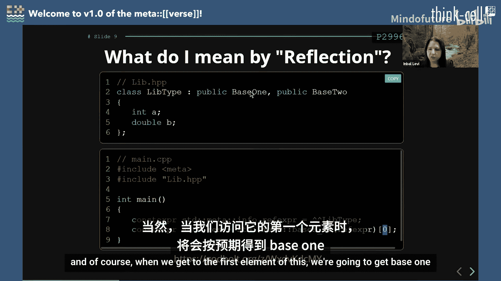
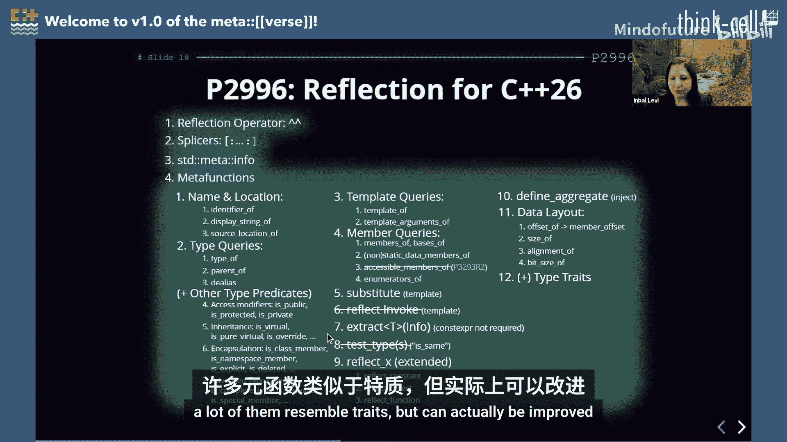
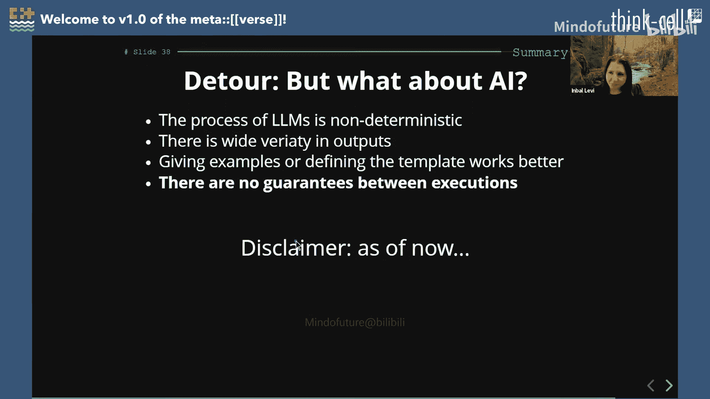
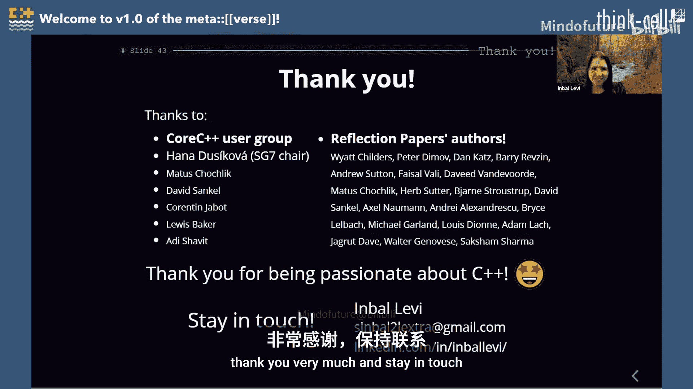

# 018：欢迎来到元编程宇宙 v1.0


在本教程中，我们将学习 C++ 26 中引入的静态反射功能。我们将从反射的基本概念和历史讲起，逐步深入到其语法、核心组件、使用示例，并探讨它对代码库和开发流程带来的影响。

## 反射简介与历史 📜

上一节我们介绍了本教程的概述，本节中我们来看看反射功能在 C++ 中的发展历程。

反射是指程序能够检视自身结构的能力。在 C++ 中，我们讨论的是静态反射，即编译器在编译时暴露程序的结构信息。

C++ 社区对反射的探索由来已久：
*   **2006年**：Matus Chochlik 首次在标准语境下提及反射，并创建了 Mirror 反射库，该库基于模板元编程。
*   **2012年**：Mike Spertus 撰写论文，枚举了编译时反射的用例，如序列化、委托、访问器等。
*   **2014-2016年**：尝试标准化基于模板元编程的反射库，但因其对编译器负担过重而转向专用语法。
*   **2018年**：讨论了基于值（value-based）与基于类型（type-based）的反射模型，最终倾向于更轻量的基于值的模型，即单一的 `std::meta::info` 类型。
*   **2019年至今**：随着 `constexpr` 能力的扩展，为反射提供了更好的基础。经过多年讨论和提案迭代，最终形成了 **P2996** 提案。
*   **2025年**：P2996 提案在 ISO C++ 委员会全体会议上以高票通过，被纳入 C++26 草案，这意味着我们很可能在 C++26 中获得原生的反射支持。

## 核心概念与语法 ⚙️

上一节我们回顾了反射的历史，本节中我们来深入了解其核心概念和基本语法。

反射涉及两个“领域”：常规的 C++ 程序领域和反射领域。我们通过专用语法在这两个领域间“提升（lift）”和“拼接（splice）”信息。

### 提升操作符与拼接操作符

提升操作符 `^`（昵称“帽子操作符”）用于将程序实体（如类型、变量）提升到反射领域，得到一个 `std::meta::info` 对象。拼接操作符 `[: ... :]` 用于将反射领域的信息提取回 C++ 程序领域。

```cpp
// 将类型`int`提升到反射领域，结果是一个`std::meta::info`对象
constexpr std::meta::info refl_int = ^int;


// 使用拼接操作符将反射信息提取回C++领域，声明一个int变量
typename [: refl_int :] a = 42;
```
**注意**：反射表达式必须在常量求值上下文中使用，因此通常需要 `constexpr`。



### `std::meta::info` 对象

`std::meta::info` 是一个不透明的类型，代表被反射的实体。它可以表示类型、函数、变量、成员、表达式（符合常量求值要求的）、模板、命名空间等。

重要的是，`std::meta::info` 对象是**有状态的**，它更像是对编译器内部抽象语法树（AST）节点的一个引用，而非快照。

```cpp
class R; // 仅声明
constexpr std::meta::info refl1 = ^R;
bool b1 = std::meta::is_complete_type(refl1); // false，R未定义

class R { int member; }; // 给出定义
constexpr std::meta::info refl2 = ^R;
bool b2 = std::meta::is_complete_type(refl2); // true，R已定义

bool b3 = std::meta::is_complete_type(refl1); // true！refl1引用的状态已更新
```

### 元函数

标准库提供了一系列元函数来查询 `std::meta::info` 对象。以下是一些关键元函数：

*   **查询类**：如 `is_complete_type`, `is_function`, `identifier_of`（获取标识符名称），`members_of`（获取类成员）等。
*   **操作类**：如 `substitute`（在反射领域进行模板实例化），`extract`（尝试从反射对象提取出具体C++值/类型）。



```cpp
constexpr int a = 42;
constexpr std::meta::info refl_a = ^a;
std::string_view name = std::meta::identifier_of(refl_a); // 得到 "a"

// 使用 substitute 进行“反射领域的模板实例化”
constexpr std::meta::info refl_array_tmpl = ^std::array;
constexpr std::meta::info refl_int = ^int;
constexpr std::meta::info refl_three = std::meta::reflect_value(3);
constexpr std::meta::info refl_array_type = std::meta::substitute(refl_array_tmpl, {refl_int, refl_three});
// refl_array_type 代表了 std::array<int, 3>
using MyArray = [: refl_array_type :]; // 拼接回C++领域
```

## 反射的用例与影响 🛠️

上一节我们介绍了反射的核心语法，本节中我们来看看它的实际应用和可能带来的影响。

### 常见用例

反射可以极大地简化许多需要自省（introspection）的代码：

1.  **序列化/反序列化**：自动遍历类的数据成员，生成读写代码。
2.  **日志记录**：自动记录函数参数名和值。
3.  **对象关系映射（ORM）**：根据类结构自动生成数据库表映射。
4.  **测试框架**：自动发现和注册测试用例。
5.  **配置绑定**：将配置文件自动绑定到结构体成员。

### 需要关注的边界情况

反射也引入了一些新的考量：

*   **私有成员访问**：反射可以访问类的私有成员，这打破了传统的“接口-实现”边界。因此，**反射标准库类型是不被保证稳定性的**，其内部结构可能在不同版本间变化。
*   **声明与定义的一致性**：函数参数名在声明和定义中可能不同。P3096 论文探讨了此问题，目前的倾向是**强制要求一致性**，否则程序可能非良构（ill-formed）。这可能会影响现有代码库。
*   **编译期与链接期错误**：使用反射的库（如日志库）需要其用户代码在编译期可用，以便进行反射分析。错误（如不一致的参数名）将在**编译期**被发现，而非传统的链接期。

### 反射作为定制点

定制点（Customization Point）是库为用户提供扩展机制的方式（如 `std::swap`）。反射理论上可以作为强大的定制点机制，允许用户深度介入库的逻辑。然而，它可能过于“重型”，对于简单的定制需求来说过于复杂。更轻量级的定制点机制可能仍是标准库探索的方向。

### 与AI代码生成的对比

人工智能（AI）辅助编程（如 GitHub Copilot）可以生成序列化器等代码。然而，AI生成存在**非确定性**（多次生成结果可能不同）和**潜在逻辑错误**的问题。反射作为语言特性，提供了**确定性**和**类型安全**的代码生成方案，两者在未来可能互补而非替代。

### 与Rust的对比

Rust 通过过程宏和 `syn` 库提供了强大的元编程能力，允许在编译时操作 AST。C++ 的反射是语言内置的语法，相比之下可能更规范，对用户隐藏了编译器实现细节，提供了更干净的编程模型。

## 总结与展望 🚀



本节课中我们一起学习了 C++26 静态反射的核心内容。

我们首先回顾了反射从基于模板元编程到专用语法的发展历程。接着，深入探讨了其核心语法：使用提升操作符 `^` 将实体提升到反射领域得到 `std::meta::info` 对象，使用拼接操作符 `[:...:]` 将其提取回 C++ 领域；并了解了 `std::meta::info` 有状态的特性和丰富的元函数。

然后，我们探讨了反射的典型应用场景，如序列化、日志等，并指出了需要特别注意的方面：私有成员的可访问性、声明/定义的一致性要求，以及错误检查阶段从链接期前移到编译期。我们还简要对比了反射与 AI 代码生成、Rust 元编程的异同。



C++ 静态反射的引入是一个里程碑，它将催生一大批新的、强大的库，并改变我们构建和组合代码的方式。虽然它带来了一些新的约束和考量，但其带来的表达能力和开发效率的提升是巨大的。期待社区基于此特性创造出更多优秀的工具和库。