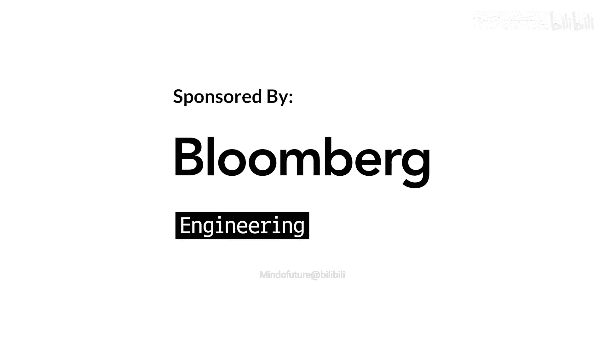
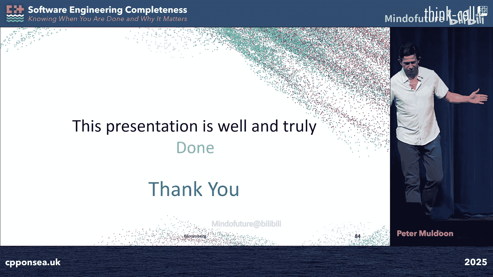

# 019：知道何时完成以及为何重要 🏗️



在本教程中，我们将学习软件工程中的“完成”概念。我们将探讨如何定义“完成”，为什么明确的定义至关重要，以及如何通过一个分层的“软件工程完整性金字塔”模型，从代码编写到业务战略，系统地构建高质量的软件交付能力。

---

## 概述 📋

“我们完成了吗？”这是软件开发中经常被问到的问题。然而，对于“完成”的定义，团队内部、团队之间、工程师与业务方之间常常存在巨大的理解偏差。这种偏差会导致项目延期、质量问题和组织摩擦。

本次课程将深入探讨“完成”的真正含义。我们将介绍一个名为“软件工程完整性金字塔”的模型。这个模型将软件交付的完整性分为多个层次，从最基础的代码开发，到代码健康度、系统可靠性，最终到业务与工程的对齐。理解并实践这些层次，能帮助我们建立共享的“完成”定义，提升交付的可预测性、软件质量以及团队与业务的协作效率。

---

## 1： 核心概念与问题引入

### 1.1： “完成”的定义困境

在软件工程中，“完成”是一个模糊的概念。字典定义是“将某物带到所需的状态或结束”。Scrum指南中的定义是“符合质量标准的增量状态的正式描述”。然而，在实际工作中，开发者对“完成”的理解往往与此不同。

**问题在于**：缺乏一个在团队内部和整个组织内共享的、明确的“完成”定义。这会导致：
*   **沟通摩擦**：当你说“完成”时，你指的是代码已合并，而业务方可能理解为功能已上线并为客户所用。
*   **期望错位**：新成员需要花费时间摸索团队的“部落知识”来理解工作标准。
*   **进度误判**：例如，一个计划开发10个新功能的项目，如果只完成了5个功能的编码，开发者可能报告“50%完成”。但从业务价值角度看，如果没有任何功能部署给用户，完成度实际上是**0%**。

因此，我们需要建立一个清晰的、分层的“完成”标准。

### 1.2： 软件工程的业务价值

我们首先需要明确软件工程的核心业务价值。它不仅仅是编写巧妙的代码或使用高级的模板技术。

**软件工程的业务价值在于**：**以增量步骤交付期望的业务成果**。

**为什么是增量步骤？**
*   **缩短时间范围**：减少不确定性，建立信心。
*   **降低风险**：每次变更的规模更小，影响可控。
*   **获得更好反馈**：可以中途根据用户反馈进行调整。
*   **更准确地规划时间**：通过许多小步骤，可以更精确地绘制时间线。

**价值何时实现？**
业务价值在软件**可用、可靠**时才真正实现。这意味着：
*   **可用**：客户能够访问并使用它，它能完成宣称的功能。
*   **可靠**：它必须持续工作，或在客户知晓的预定停机时间内工作。

此外，还有面向未来的价值：
*   **可配置性**：通过配置增加新功能。
*   **灵活性**：能够适应新需求而无需重写。
*   **可维护性**：能够快速定位和修复问题。
*   **可演进性**：能够随着市场变化而快速进化。

### 1.3： 我们交付到生产环境的变更类型

作为工程师，我们向生产环境交付多种类型的改进和变更。

**我们交付的改进类型包括**：
*   新功能
*   Bug 修复
*   功能标志变更
*   新配置
*   技术债务减少（重构、弃用无用代码）
*   硬件/生态系统升级（如编译器、操作系统迁移）

**我们无意中可能交付的问题类型包括**：
*   损坏的功能（Bug）
*   缺失的功能
*   性能问题
*   安全问题
*   系统不可靠性（使系统更脆弱）

---

## 2： 软件工程完整性金字塔 🗼

上一节我们明确了问题和价值，本节我们将引入核心模型——“软件工程完整性金字塔”。这个模型受马斯洛需求层次理论启发，认为软件工程的“完整性”也需要逐层构建，每一层都依赖于下一层的稳固。

### 2.1： 第一层：代码开发与部署（生存）

金字塔的底层是“生存”，即能够将代码变更从需求一直推进到生产环境。这是最基本的能力。

**开发完成了吗？**
开发完成意味着你承诺的变更已经过验证并应用。
*   **满足验收标准**：变更全部或部分满足了预先定义的验收条件。
*   **通过所有测试**：包括单元测试、集成测试，确保系统在变更后仍能像之前一样运行，并为新变更添加了测试。
*   **通过代码审查**：确保代码以合理、高效的方式实现，而不仅仅是功能正确。
*   **合并并打包**：代码已合并到主分支，并打包好准备发布。

**部署完成了吗？**
代码在仓库中毫无价值，必须部署才能产生价值。
*   **部署到所有环境**：变更必须部署到生产环境的所有阶段，而不仅仅是测试或金丝雀环境。
*   **考虑部署节奏和依赖**：了解部署到各个阶段所需的时间，并管理好与其他团队的依赖关系。
*   **考虑代码冻结期**：规划需避开节假日、大选等代码冻结期。

**功能标志启用完成了吗？**
功能标志允许我们在运行时启用或禁用新功能，是降低发布风险的重要工具。
```cpp
// 示例：功能标志的简单实现
if (feature_flag_is_enabled("new_trading_algorithm")) {
    execute_new_algorithm();
} else {
    execute_legacy_algorithm();
}
```
*   **启用范围**：功能标志是否已在所有需要的地方启用？
*   **启用计划**：是否有明确的启用时间表（具体日期）？
*   **清理计划**：是否有计划在未来移除已稳定功能的标志，以避免代码中存在死分支？

**达到此层意味着**：你的团队能够将代码变更交付到生产环境。你是一个**合格的编码者**。

### 2.2： 第二层：代码健康度（可持续性）

仅仅能交付功能是不够的。如果只专注于功能开发和Bug修复，代码库会随着时间推移变得复杂、脆弱，成为难以维护的“遗留系统”。我们必须平衡快速功能开发与代码库的可持续性。

**代码健康基础：软件退役**
软件退役是战略性地淘汰过时的软件及其相关基础设施的过程。
*   **结构上无法访问的代码**：由于新路径引入而永远无法执行到的代码块。
*   **相信不会被访问的代码**：基于用户行为分析，认为不会再被使用的功能（如过时的交易类型）。需要监控一段时间后才能安全移除。
*   **是否完成**：在新功能替换旧功能时，是否已计划移除旧功能？是否有待移除的功能标志？

**代码健康基础：软件重构**
重构是在不改变外部行为的前提下，改善代码内部结构的过程。
*   **为何需要**：代码会随着业务复杂化而“衰老”。战术性实现（为求快而写的临时方案）和缺乏标准的代码审查会导致代码质量下降。
*   **如果不重构**：代码最终将走向代价高昂的、高风险的重写。
*   **何时需要重构**：
    *   出现重复的模式。
    *   代码可读性或可维护性差。
    *   存在代码“坏味道”（如滥用原始指针、过度复杂的逻辑）。
    *   范式变更（业务方式发生根本变化）。
    *   技术折旧（语言、第三方库的进步使旧代码显得过时）。

**代码健康核心：技术债务**
技术债务是由于现在采用了简化或临时的解决方案，而导致未来需要额外返工的成本。
*   **技术债务的产生原因**：
    *   外部强加的截止日期。
    *   生产环境救火，仓促修复。
    *   过度“炫技”和过早优化。
    *   缺乏良好的工程文化和标准。
    *   有机增长和文档不全。
*   **技术债务的类型**：
    *   **有意技术债务**：为了速度（如抢占市场、应对法规）而牺牲质量，**并伴有明确的偿还计划**（例如，在待办事项中创建后续任务）。
    *   **无意技术债务**：没有战略收益，纯粹因为工作马虎、代码审查不严而引入，**且没有偿还计划**。
*   **如何管理技术债务**：
    1.  **建立清单**：记录债务项，评估其规模（小/中/大）、严重性（高/中/低）和影响。
    2.  **保持可见**：定期（如每季度）安排“技术债务冲刺”专门处理。
    3.  **用数据说服管理层**：展示技术债务如何导致系统回滚、宕机、修复周期长，用数据证明投资的必要性。
*   **债务预防措施**：
    *   充分的时间规划和任务分解。
    *   设计评审。
    *   代码审查指南。
    *   编码标准。
    *   代码审查培训。

**代码健康保障：测试**
测试是保证代码质量、让客户看到预期行为的基石。
*   **测试三大支柱**：
    1.  **单元测试**：测试单一代码单元，快速反馈。
    2.  **集成测试**：测试模块组合，验证协作。
    3.  **端到端测试**：在生产前环境用模拟数据验证整个流程。
*   **测试是否充分**：
    *   是否根据生产环境事故创建了相应的测试用例？
    *   测试覆盖率是否足够？是否涵盖了边界情况和异常路径？
    *   测试是否自动化？能否在CI/CD流水线中运行？

**达到此层意味着**：你不仅交付功能，还致力于保持代码库的可持续性和健康。你是一个**工程师**。

### 2.3： 第三层：系统可靠性与前瞻性规划（系统思维）

当我们开始关注代码健康后，视野需要进一步扩大，从“我们完成了吗？”转向“我们准备好了吗？”。这一层关注整个系统的聚合健康与未来准备。

**系统可靠性与弹性**
*   **可靠性**：系统在指定条件下无故障持续运行的能力。
*   **弹性**：系统在出现故障时能够优雅降级，而非彻底崩溃。
*   **为何重要**：关乎客户信任和业务连续性。系统不可靠会导致业务中断和声誉损失。

**如何实现：系统健康监控**
通过可观测性（运营指标）来洞察系统运行状态，预测问题。
*   **关键指标**：
    *   **延迟**：服务请求所需时间。
    *   **吞吐量**：系统处理能力。
    *   **饱和度**：资源使用率（CPU、内存、队列深度）。
    *   **错误率**：失败请求的比例。
*   **监控的价值**：
    *   **自动告警**：在用户发现问题前触发警报。
    *   **趋势分析**：通过长期监控进行容量规划，预见瓶颈。

**生产支持与改进规划**
*   **生产支持**：新引入的技术或功能是否有运维团队支持？知识是否在团队内部分享？是否有清晰的日志、可观测性和应急预案（Runbook）？
*   **改进规划**：识别系统中的高风险区域，规划中长期的、涉及多团队的功能性改进。这需要风险管理、时间预测和大量的协调沟通。

**架构设计**
*   **局部再工程**：改变系统中某个广泛使用的部分（如通信层）。
*   **需要全局视野**：通常由资深或首席工程师负责，确保变更具有一致的愿景，并瞄准能带来最大收益的部分，避免全盘重写的高风险。

**战略规划**
这一层关注超越技术细节的长期战略方向。
*   **关注点**：业务发展方向、技术趋势（如云迁移、AI）、大规模变革。
*   **特点**：涉及高层级人员、时间跨度大（多年）、决策难以更改、需要进行大量的权衡分析。

**达到此层意味着**：你关注整个系统的可靠性和未来演进。你是一个**合格的系统工程师**。

### 2.4： 第四层：业务与工程对齐（愿景）

金字塔的顶层是实现工程努力与业务需求的完美对齐。这是软件工程的“自我实现”阶段。

**为何需要对齐？**
如果工程团队输出的不是业务所需，或者业务不理解工程面临的约束，就会产生浪费和冲突。双方需要协作、妥协和有效沟通。

**实现对齐的工具：路线图会议**
路线图会议是讨论大型项目或公司级计划当前进展和未来方向的正式会议。
*   **会议参与者**：
    *   产品负责人
    *   业务分析师（用户代理）
    *   各主要开发领域的代表
    *   能做出决策的执行层利益相关者
    *   产品经理/交付专家（负责生成甘特图和时间线）
*   **会议议程**：
    1.  **回顾现状**：自上次会议以来的进展和当前障碍。
    2.  **设定战略方向**：明确目标路径，达成共识。
    3.  **确定优先级和资源分配**：决定做什么、谁来做、何时完成。
    4.  **制定行动计划**：产出带有明确成功标准和日期的行动项。
*   **未来规划**：在路线图中，需要为软件稳定性、安全漏洞、可扩展性、新法规、新业务机会等做好准备。

**达到此层意味着**：你成功地将业务需求与工程目标相结合，能够引领大规模、战略性的前进。你是一个**有远见者**。

---

## 3： 总结与实践指南 🎯

本节课我们一起学习了“软件工程完整性金字塔”模型，它从代码生存、代码健康、系统可靠到业务对齐，层层递进地定义了软件工程的“完成”状态。

### 如何应用这个模型？

**自我评估与提升**：
*   **你目前主要专注于哪一层？**（功能实现/Bug修复 -> 编码者；关注代码健康 -> 工程师；关注系统可靠性 -> 系统工程师；关注业务对齐 -> 有远见者）
*   **你渴望达到哪一层？** 可以尝试将上一层的实践引入当前工作，例如在代码审查中关注技术债务，或在团队讨论中引入系统健康监控的视角。

**重新定义“完成”**：
不要再使用模糊的“完成”。具体说明：
1.  **范围**：明确的里程碑、交付物、验收标准。
2.  **时间**：具体的交付日期和里程碑日期。将大任务分解为小任务来估算。
3.  **债务**：明确承认并计划偿还任何有意承担的技术债务。
4.  **沟通**：清晰地向利益相关者传达进展，保持透明度。

**最终的“完成”标准**：
一个变更“完成”，当它：
*   在生产环境所有地方**平稳运行**。
*   得到团队的良好**支持**（不依赖单个人）。
*   技术债务在**减少**而非增加。
*   代码结构良好、**可维护**。
*   最终用户和客户感到**满意**（可靠、准时、功能完善）。

当客户满意时，业务就会成功，而成功的业务会带来回报。通过实践这个金字塔模型，我们可以更有信心地说：“是的，我们完成了”，并且每个人都知道这意味着什么。




---
*教程内容整理自 Peter Muldoon 在 C++-On-Sea 2025 大会上的演讲《Software Engineering Completeness Pyramid》。*