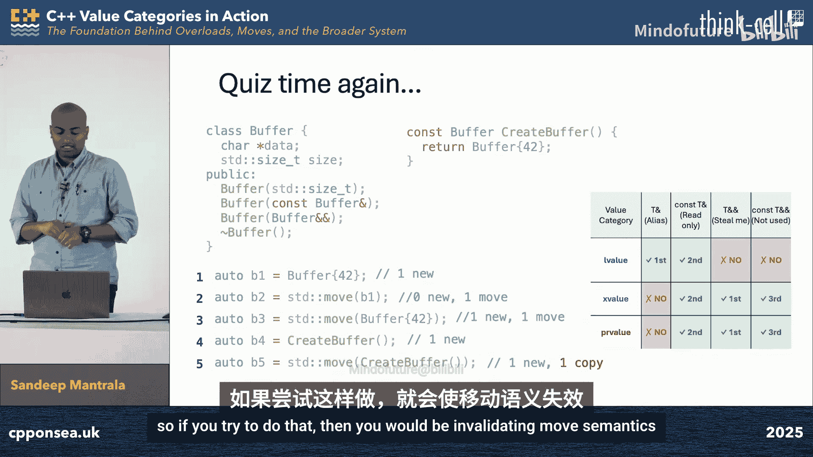
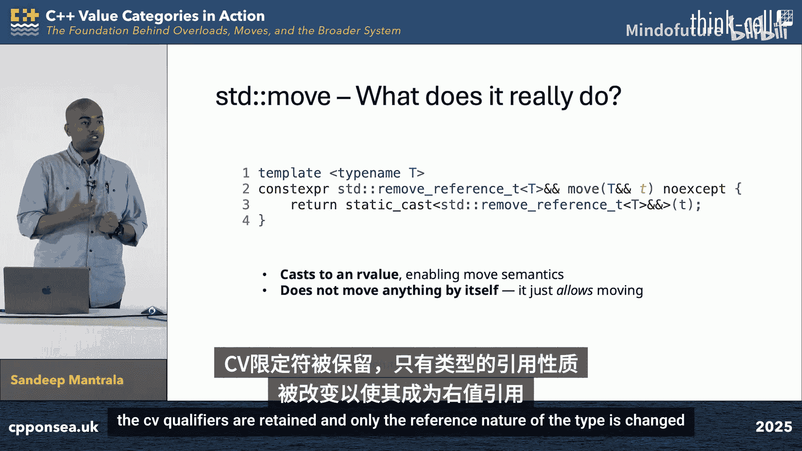

# 022：理解 C++ 值类别、左值、右值、x值、std::move、std::forward 与最佳实践

在本节课中，我们将要学习 C++ 中一个核心但常被误解的概念：值类别。我们将从基础定义出发，深入探讨左值、右值、x值等概念，并理解 `std::move` 和 `std::forward` 的工作原理及其最佳实践。掌握这些知识将帮助你编写出语义正确且性能优异的现代 C++ 代码。

## 1： 为什么需要学习值类别？

值类别是关于**表达式**的属性，而非对象或类型。理解值类别是深入理解移动语义、完美转发等现代 C++ 特性的基石。当编译器报错“左值引用无法绑定到右值”时，明确的值类别知识能帮助你快速定位问题。此外，它也是编写高效、正确代码的关键。

## 2： 表达式与值类别基础

上一节我们介绍了学习值类别的重要性，本节中我们来看看值类别的基础——表达式。

表达式是运算符和操作数的序列，用于指定一个计算。每个表达式都有两个独立的属性：**类型**和**值类别**。类型告诉我们值的种类（如 `int`、`const char*`），而值类别描述了表达式的值在内存中的“行为”特征，例如它是否具有持久身份，以及其资源是否可以被“移动”。

在 C++11 之前，值类别系统较为简单，只有左值和右值两种。这限制了我们对“即将失效但仍有身份的对象”的表达能力，阻碍了移动语义的实现。

## 3： C++11 引入的新值类别

上一节我们回顾了旧的值类别系统，本节中我们来看看 C++11 如何通过引入新类别来解决其局限性。

C++11 委员会通过分析表达式的两个核心属性来重新定义值类别：
1.  **是否具有身份**：表达式结果是否代表一个具有持久内存位置的对象？
2.  **是否可被移动**：能否安全地“窃取”该表达式所代表对象的资源？

基于这两个属性，我们得到了三个主要的**基础值类别**和两个**复合类别**：

*   **左值**：有身份，不可移动（例如：变量名 `x`）。
*   **纯右值**：无身份，可移动（例如：字面量 `42`，函数返回的非引用临时对象）。
*   **将亡值**：有身份，可移动（例如：`std::move(x)` 的结果）。

复合类别用于简化描述：
*   **泛左值**：包括左值和将亡值。泛指所有有身份的表达式。
*   **右值**：包括纯右值和将亡值。泛指所有可移动（即将销毁）的表达式。

以下是三种基础值类别的示例：

*   **左值示例**：变量 `x`、解引用 `*ptr`、前缀 `++a`、字符串字面量 `"hello"`。
*   **纯右值示例**：字面量 `true`、`nullptr`、算术运算 `a + b`、后缀 `a++`、`this` 指针、Lambda 表达式。
*   **将亡值示例**：`std::move(x)`、访问将亡值对象的成员（如 `std::move(obj).data_`）。

## 4： 右值引用与移动语义

上一节我们明确了新的值类别，本节中我们来看看如何利用新的工具——右值引用来实现移动语义。

为了解决旧系统中无法绑定并修改右值的问题，C++11 引入了**右值引用**，语法为 `T&&`。它**专门用于绑定到右值**（纯右值或将亡值），从而允许我们安全地“窃取”这些即将失效对象的资源。

**关键点**：一个变量（如 `int&& rr`）本身的**值类别是左值**（因为它有名字和持久存储），但其**类型是右值引用**。这解释了为何 `std::move(x)` 是必要的：它将一个左值 `x` 的**类型**转换为右值引用，从而生成一个**将亡值**表达式，使其能绑定到接受 `T&&` 的函数。

`std::move` 的本质是一个**静态类型转换**，它并不移动任何东西。其简化实现如下：
```cpp
template <typename T>
typename std::remove_reference<T>::type&& move(T&& t) {
    return static_cast<typename std::remove_reference<T>::type&&>(t);
}
```
它移除 `T` 可能带有的引用，然后强制转换为右值引用类型。

移动语义的核心思想是重用临时对象或标记为“将亡”的对象的内部资源。移动构造函数和移动赋值运算符利用右值引用实现资源所有权的转移，避免深拷贝。

以下是一个移动构造函数的示例：
```cpp
class Buffer {
    int* data_;
public:
    // 移动构造函数
    Buffer(Buffer&& other) noexcept : data_(other.data_) {
        other.data_ = nullptr; // “窃取”资源并使源对象处于有效但空的状态
    }
    // ... 其他成员
};
```

## 5： 转发引用与完美转发

上一节我们介绍了右值引用和移动语义，本节中我们来看看一个特殊的引用类型——转发引用，以及如何实现完美转发。

当 `T&&` 出现在**模板参数推导**的上下文中时（例如 `template void foo(T&& arg)`），它被称为**转发引用**或**万能引用**。它的特殊之处在于，根据传入实参的值类别，它可以通过**引用折叠**规则推导出不同的类型：

*   传入**左值**时，`T` 被推导为 `T&`，`T&&` 折叠为 `T&`（左值引用）。
*   传入**右值**时，`T` 被推导为 `T`，`T&&` 保持为 `T&&`（右值引用）。







因此，转发引用可以绑定到左值或右值。但是，在函数内部，具名的转发引用参数 `arg` 本身是一个**左值**。如果我们想将它传递给另一个函数，并保持其原始的值类别（左值保持左值，右值保持右值），就需要使用 `std::forward`。

`std::forward` 是一个**有条件**的转换，它仅在参数原始值是右值时才将其转换为右值引用。它通常与转发引用一起使用，以实现完美转发。

以下是一个使用转发引用和 `std::forward` 的通用函数模板示例，它可以替代接受 `const T&` 和 `T&&` 的两个重载：
```cpp
template <typename T>
void addResource(T&& res) { // T&& 是转发引用
    resources_.push_back(std::forward<T>(res)); // 完美转发 res 的值类别
}
```

## 6： 最佳实践与常见陷阱

上一节我们探讨了转发引用和完美转发，本节中我们总结一些围绕值类别和移动语义的最佳实践与常见陷阱。

以下是编写现代 C++ 代码时应遵循的一些关键准则：

*   **返回局部对象时，直接返回值，避免使用 `std::move`**。编译器会进行返回值优化，额外的 `std::move` 有时反而会阻碍优化。
*   **仅在模板参数推导的上下文中使用 `std::forward`**。对已知类型的左值使用 `std::forward` 是危险的，因为它会错误地将其转换为右值。
*   **为移动操作标记 `noexcept`**。标准库容器（如 `std::vector`）在重新分配内存时，会优先使用 `noexcept` 的移动构造函数，否则将回退到拷贝操作。使用 `std::move_if_noexcept` 可以查看这一机制。
*   **避免返回 `const` 值**。返回 `const` 对象会抑制移动语义，因为 `const` 临时对象只能绑定到 `const T&` 或 `const T&&`，无法调用非 `const` 的移动操作。
*   **理解何时发生拷贝/移动**。结合 C++17 的强制拷贝消除规则，清晰地知道代码中对象构造和赋值的成本。

## 总结


本节课中我们一起学习了 C++ 值类别的完整体系。我们从表达式的基础属性出发，理解了左值、纯右值和将亡值的定义与区别。我们探讨了右值引用如何作为绑定并操作可移动对象的工具，以及 `std::move` 如何生成将亡值来启用移动语义。接着，我们学习了在模板推导中特殊的转发引用，以及如何使用 `std::forward` 实现参数的完美转发。最后，我们回顾了在实际编码中应用这些概念时应遵循的最佳实践和需要避免的陷阱。掌握这些知识将使你能够更自信地编写高效、健壮的现代 C++ 程序。