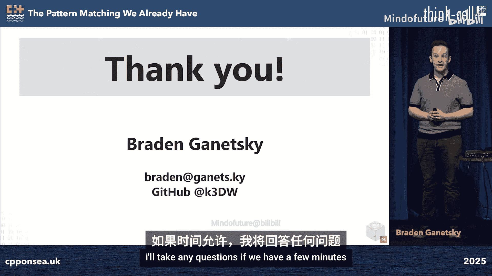

# 023：我们已经拥有的模式匹配 🧩

在本节课中，我们将要学习C++语言中已经存在的几种“模式匹配”机制。尽管标准委员会正在讨论更直观的模式匹配语法提案，但C++早已通过函数重载、模板特化、模板参数推导和类模板参数推导等方式，实现了强大的编译时模式匹配能力。我们将逐一探讨这些机制的基本原理和运作方式。

## 函数重载解析

上一节我们介绍了课程概述，本节中我们来看看C++中最基础的模式匹配形式：函数重载解析。这是自C++98标准以来就存在的特性，它允许我们定义多个同名但参数列表不同的函数。

函数重载是C++区别于C语言的一个标志性特性。在C语言中，要实现类似效果通常需要手动进行类型检查或使用不同的函数名，而在C++中，编译器可以自动为我们选择最匹配的函数版本。

以下是函数重载的一些关键规则示例：

*   **类型别名视为相同类型**：`void f(int);` 和 `void f(Int);`（其中 `using Int = int;`）是同一个函数的重复声明。
*   **枚举与基础类型不同**：`void f(int);` 和 `void f(enum E);` 是两个不同的重载，即使枚举的底层类型是 `int`。
*   **顶层const被忽略**：`void f(int);` 和 `void f(const int);` 是同一个函数的重复声明。但 `void f(int*);` 和 `void f(const int*);` 则是不同的重载，因为这里的const不是顶层const。
*   **数组到指针的转换**：`void f(char*);`、`void f(char[]);` 和 `void f(char[10]);` 是同一个函数的三种声明方式。

函数重载解析的机制遵循以下步骤：

1.  **收集候选函数**：根据调用上下文（如函数调用、运算符重载、构造函数等）找出所有可能匹配的函数。
2.  **确定可行函数**：从候选函数中移除参数数量不匹配、约束不满足或参数类型无法转换的函数。
3.  **选择最佳匹配**：对剩下的可行函数，根据参数到形参的隐式转换序列进行排序，选择转换“最好”的那个。

让我们通过一个例子来理解这个过程。假设有以下重载函数：

```cpp
void f(bool);                 // (1)
void f(double);              // (2)
void f(int, int = 0);        // (3)
void f(...);                 // (4)
void f(std::unique_ptr<int>); // (5)
// (6)-(8) 为带约束的模板，略
```

当我们调用 `f(nullptr)` 时：
*   步骤1：移除参数数量错误的(1)和(4)。
*   步骤2：移除约束不满足的(8)。
*   步骤3：`nullptr` 无法转换为 `double` 或 `int`，因此移除(2)和(3)。`nullptr` 可以转换为 `bool`、匹配省略号 `...` 以及 `std::unique_ptr<int>`。
*   最终可行集为：(1), (4), (5)。
*   排序转换：`bool` 转换是标准转换序列，`std::unique_ptr<int>` 转换是用户定义转换序列，`...` 是省略号转换序列。标准转换序列优于用户定义转换序列，后者又优于省略号转换序列。
*   因此，最终选择调用 `f(bool)`。

## 模板特化

上一节我们探讨了函数重载，本节中我们来看看另一种基于模板的模式匹配：模板特化。模板特化同样是C++98就存在的特性，它是C++11类型 Traits 库的基石。

我们可以将模板特化想象为一种针对类型的“模式匹配”。虽然我们不能直接写出 `match (T, U) { case (T, T): true; default: false; }` 这样的语法，但我们可以通过模板特化来实现类似逻辑。

以下是如何实现一个判断类型是否相同的 Traits：

```cpp
// 主模板：默认情况，类型不同
template <typename T, typename U>
struct is_same {
    static constexpr bool value = false;
};

// 部分特化：匹配当两个类型参数相同时的情况
template <typename T>
struct is_same<T, T> { // 匹配模式：is_same<T, T>
    static constexpr bool value = true;
};
// 使用
static_assert(is_same<int, int>::value == true);
static_assert(is_same<int, int*>::value == false);
```

另一个例子是移除const限定符的Traits：

```cpp
// 主模板：默认情况，直接使用类型T
template <typename T>
struct remove_const {
    using type = T;
};

// 部分特化：匹配带有顶层const的类型
template <typename T>
struct remove_const<const T> { // 匹配模式：const T
    using type = T;
};
```

模板特化主要分为三类：
*   **主模板**：通用的模板定义。
*   **部分特化**：为模板参数指定一部分模式，例如 `template <typename T> struct Widget<T, T>`。
*   **显式特化**：为模板参数指定全部具体类型，例如 `template <> struct Widget<int, char>`。

当编译器需要实例化一个模板时，它会按以下顺序进行“匹配”：
1.  首先尝试匹配**显式特化**。
2.  如果没有匹配的显式特化，则尝试匹配**部分特化**。
3.  如果也没有匹配的部分特化，则使用**主模板**。

如果多个部分特化同时匹配，编译器需要选择“最特化”的那个。这个过程是通过将类模板特化“重写”为虚构的函数模板，并利用函数重载解析和模板参数推导来完成的。

## 模板参数推导

上一节我们介绍了模板特化如何匹配类型模式，本节中我们来看看支撑这些匹配过程的核心机制：模板参数推导。它允许编译器在调用函数模板时，根据传入的实参自动推断模板参数的类型。

当我们编写 `std::vector<int> v; foo(v);` 而 `foo` 定义为 `template <typename T> void foo(std::vector<T>);` 时，编译器能推导出 `T` 是 `int`。这就是模板参数推导。

推导的基本机制是，将每个函数参数与对应的函数实参进行匹配。编译器会忽略顶层const/volatile限定符，并处理一系列“特殊形式”，例如指针、引用、数组、函数等。

让我们通过几个步骤示例来理解：

**示例1**：`template <typename T> void foo(T*);` 调用 `foo(&std::vector<int>{})`。
*   参数：`T*`
*   实参：`std::vector<int>*`
*   两者都匹配“指向T的指针”这个特殊形式。去掉指针后，得到 `T` 匹配 `std::vector<int>`。因此 `T` 被推导为 `std::vector<int>`。

**示例2**：`template <typename T> void foo(std::vector<T*>);` 调用 `foo(&std::vector<int>{})`。
*   参数：`std::vector<T*>`，实参：`std::vector<int>*`。
*   匹配指针形式，去掉指针：`std::vector<T>` 匹配 `std::vector<int>`。
*   两者都是类模板 `std::vector` 的实例化，匹配模板形式，去掉模板：`T` 匹配 `int`。因此 `T` 被推导为 `int`。

有时，我们希望某些参数不参与推导，这可以通过“非推导上下文”实现。最常见的非推导上下文包括：
*   **限定名称中的嵌套名称说明符**（`::`左边的部分），例如 `typename S<T>::type` 中的 `S<T>`。
*   **`decltype` 表达式**，例如 `decltype(S<T>{})`。
*   **当形参不是 `std::initializer_list`，而实参是花括号初始化列表时**。

例如，`std::max` 的经典实现可能遇到问题：`std::max(1, 2.0)` 会因为 `T` 被分别推导为 `int` 和 `double` 而失败。我们可以通过将第二个参数设为非推导上下文来解决：

```cpp
template <typename T>
struct type_identity { using type = T; };

template <typename T>
T max(T a, typename type_identity<T>::type b) {
    return a < b ? b : a;
}
// 现在 max(1, 2.0) 可以工作，T被推导为int，第二个参数也是int
```

最后，我们谈谈转发引用（`T&&`）的推导，它涉及引用折叠规则：
*   `T& &`、`T& &&`、`T&& &` 都会折叠成 `T&`。
*   只有 `T&& &&` 会折叠成 `T&&`。

这使得 `template <typename T> void foo(T&&)` 能够根据实参是左值还是右值，将 `T` 分别推导为引用类型或非引用类型，从而实现完美转发。

## 类模板参数推导

上一节我们深入了解了函数模板的参数推导，本节中我们来看看C++17引入的类模板参数推导。它允许我们在创建类模板实例时，像使用函数模板一样省略模板参数，让编译器根据构造函数参数进行推导。

例如，我们可以直接写 `std::pair p(1, 2.0);` 而无需写成 `std::pair<int, double> p(1, 2.0);`。编译器会推导出 `p` 的类型是 `std::pair<int, double>`。

CTAD的机制是，编译器为类的每个构造函数以及每个用户定义的“推导指引”生成一个虚构的“指导函数模板”。然后，它对这些指导函数进行重载解析和模板参数推导。获胜的指导函数的返回类型，就是被推导出的类类型。

假设我们有一个类模板：

```cpp
template <typename T, typename U>
struct MyStruct {
    std::vector<T> vec;
    std::pair<U, double> pr;
    MyStruct(std::vector<T>, std::pair<U, double>); // 构造函数1
    template <typename V>
    MyStruct(T, std::pair<U, V>); // 构造函数2（模板）
};
```

编译器会生成对应的指导函数（概念上）：
*   对应构造函数1：`template <typename T, typename U> MyStruct<T, U> __guide(std::vector<T>, std::pair<U, double>);`
*   对应构造函数2：`template <typename T, typename U, typename V> MyStruct<T, U> __guide(T, std::pair<U, V>);`

当我们写 `MyStruct m(v, p);` 时，编译器会用实参 `(v, p)` 对这些 `__guide` 进行重载解析。匹配成功的那个 `__guide` 的返回类型 `MyStruct<X, Y>` 就是 `m` 的推导类型。

有时自动生成的推导指引可能产生歧义或不是我们想要的结果。这时，我们可以编写显式的**推导指引**来引导编译器：

```cpp
template <typename T, typename U, typename V>
MyStruct(std::vector<T>, std::pair<U, V>) -> MyStruct<T, std::pair<U, V>>;
```

这个指引告诉编译器：当看到用 `(std::vector<T>, std::pair<U, V>)` 参数列表来推导 `MyStruct` 时，应该推导成 `MyStruct<T, std::pair<U, V>>` 这个类型。推导指引必须出现在类模板的同一作用域（通常是之后），并且最终必须有一个构造函数能与推导出的类型匹配。

## 总结 🎯

本节课中我们一起学习了C++语言中已经存在的四种“模式匹配”机制。

尽管针对更直观的模式匹配语法（如 `inspect` 或 `match` 关键字）的提案正在标准化进程中，但C++早已通过现有特性提供了强大的编译时模式匹配能力。**函数重载解析**允许根据参数类型和数量选择不同的函数。**模板特化**允许根据类型模式选择不同的类模板或函数模板实现。**模板参数推导**是编译器根据使用上下文自动推断模板类型参数的核心机制。**类模板参数推导**则将这种推导能力扩展到了类模板的实例化上。




这些机制的通用规则通常非常优雅，使得我们能够编写出灵活而强大的泛型代码。虽然它们的某些边缘情况可能非常复杂，但理解其基本工作原理，有助于我们进行类比推理，更好地理解和欣赏C++的设计哲学与演进历程。