# 024：构建健壮的进程间队列教程


## 概述
在本教程中，我们将学习如何在C++程序中构建健壮的进程间队列。我们将探讨进程间通信的核心概念、常见陷阱，并学习如何设计一个既高效又可靠的队列系统。我们将从分析一个现有的线程间队列开始，逐步深入到跨进程场景下的挑战与解决方案。

---

## 第1章：引言与核心挑战

在开始构建队列之前，我们需要理解进程间通信（IPC）与线程间通信的根本区别。线程共享相同的内存地址空间，因此队列可以是一个简单的内存结构，只需关注同步问题。然而，进程拥有独立的内存空间，这使得数据共享变得复杂。

**核心挑战**：如何在不同进程的独立地址空间之间安全、高效地传递数据？

上一节我们介绍了基本背景，本节中我们来看看进程间队列的具体定义和期望特性。

### 进程间队列的定义与目标
一个进程间队列本质上是一个**先进先出（FIFO）** 的消息缓冲区，它支持多种消息类型，并涉及一个或多个独立的进程。

在设计时，我们追求以下几个目标：
*   **低延迟**：消息传递必须快速。
*   **可恢复性**：当生产者或消费者进程崩溃时，系统应能从中断处恢复。
*   **可轮询**：消费者应能高效地检查是否有新消息，通常通过热循环实现。
*   **易用性**：遵循“迈尔斯API”原则——易于正确使用，难以错误使用。

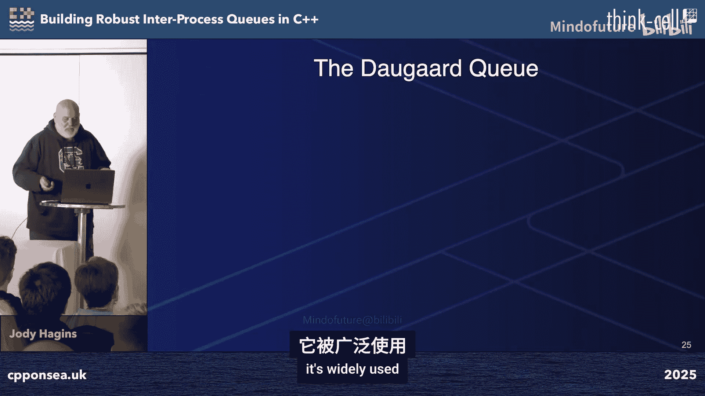

---

## 第2章：案例分析：Drigaard 队列

为了理解队列的构建原理，我们先分析一个广泛使用的线程间队列——由 Casper Drigaard 设计的 **Drigaard 队列**。它是一个为**单生产者、单消费者**模型设计的高性能队列。

### 队列结构分析
Drigaard 队列的核心是一个环形缓冲区（ring buffer）。它的设计巧妙之处在于将状态分为**共享状态**和**本地状态**，并利用**缓存行对齐**来避免伪共享，提升性能。

以下是其状态结构的简化表示：
```cpp
// 共享状态（生产者与消费者之间同步）
struct SharedState {
    std::atomic<size_t> writer_pos; // 对齐到独立的缓存行
    std::atomic<size_t> reader_pos; // 对齐到独立的缓存行
};

// 本地状态（各自线程独立）
struct LocalState {
    size_t cached_write_pos; // 本地缓存的写位置
    size_t cached_read_pos;  // 本地缓存的读位置
    char* buffer_ptr;        // 指向缓冲区内存的指针
    // ... 其他窗口计算变量
};
```
**关键点**：
1.  **共享状态**：仅包含两个原子变量，用于生产者与消费者之间的进度同步。
2.  **本地状态**：每个线程维护自己的缓存位置，大部分操作无需访问共享原子变量，极大提升了性能。
3.  **缓存行对齐**：`writer_pos` 和 `reader_pos` 被放置在不同的缓存行上，防止一个线程更新变量时导致另一个线程的缓存失效。

### 写入流程剖析
写入操作分为两步：`prepare_write` 和 `finish_write`。

1.  **`prepare_write`**：请求指定大小的缓冲区空间。如果空间不足，则通过自旋等待直到读者释放足够空间。此操作主要更新**本地状态**。
2.  **数据填充**：用户将数据复制到 `prepare_write` 返回的指针处。
3.  **`finish_write`**：提交写入。此操作将更新后的位置写入**共享状态**的原子变量，使新数据对消费者可见。

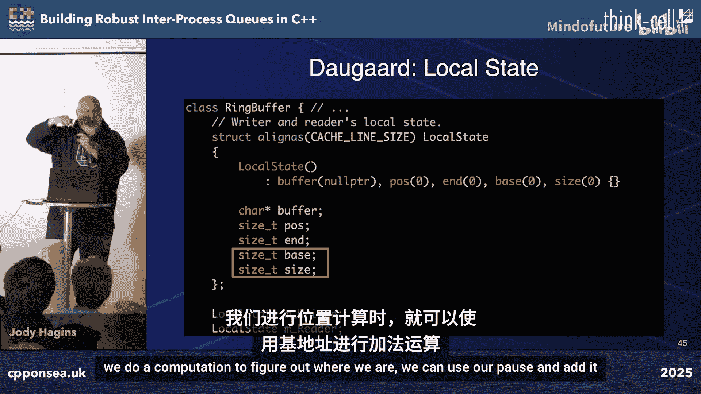

读取流程与此对称，包含 `prepare_read` 和 `finish_read`。

### 从线程间到进程间的障碍
虽然 Drigaard 队列在单进程多线程环境下表现优异，但直接将其放入共享内存用于进程间通信会遇到几个关键问题：

1.  **指针无效**：队列内部的 `buffer_ptr` 在生产者进程和消费者进程中的虚拟地址值不同，需要进程初始化时重新附着（reattach）。
2.  **非平凡类型**：队列的构造函数设置了初始值，这使得它不再是“平凡可默认构造”类型，违反了 C++ 对象在共享内存中隐式生命期的规则（C++20 起）。
3.  **`std::atomic` 问题**：从 C++20 开始，`std::atomic` 的默认构造函数不再是平凡的，因此 `std::atomic<size_t>` 本身也不能作为隐式生命期类型放入共享内存，这会导致未定义行为。
4.  **内存分配**：如果写入的数据类型（如 `std::string`）在构造时进行了堆内存分配，那么指向堆内存的指针在另一个进程中是无效的，会导致崩溃。

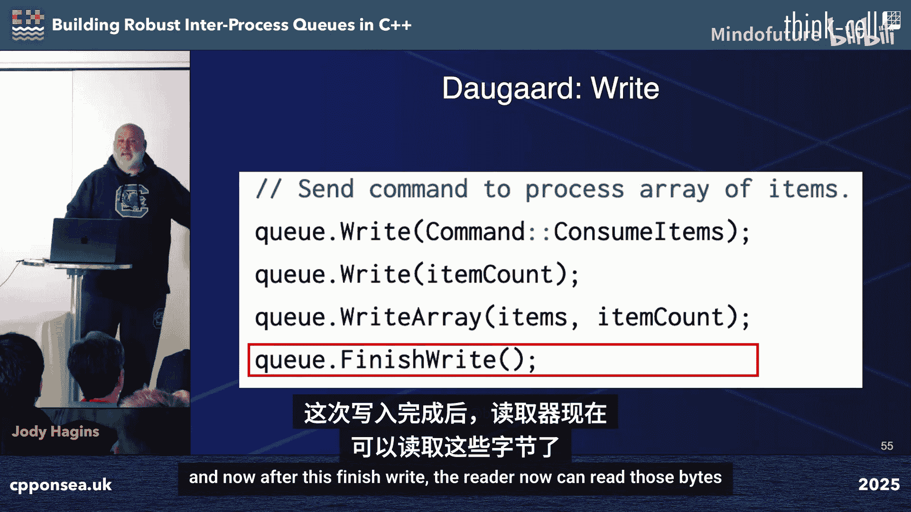

上一节我们深入分析了一个高性能线程队列及其局限，本节中我们来看看 C++ 标准中关于对象生命期和共享内存的关键规定。

---

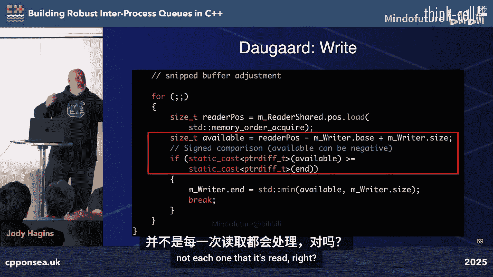

## 第3章：C++ 对象生命期与共享内存

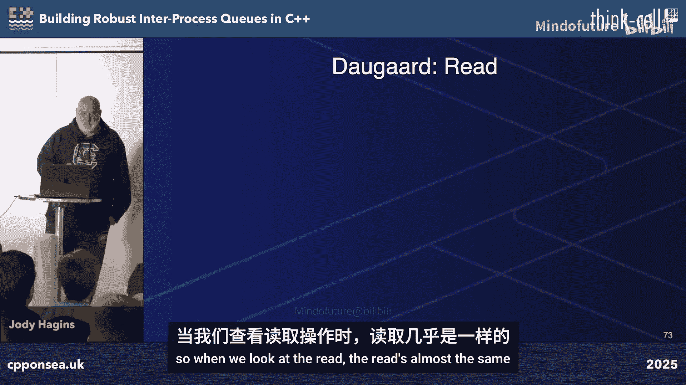

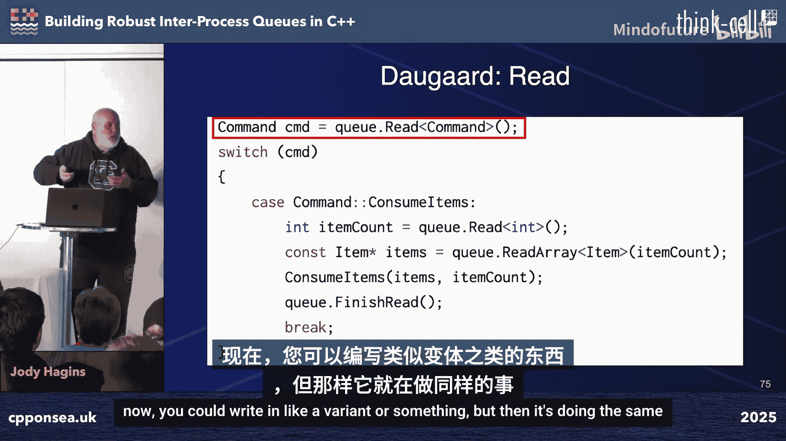

这是将 C++ 对象用于进程间通信时最容易被忽视且最关键的部分。

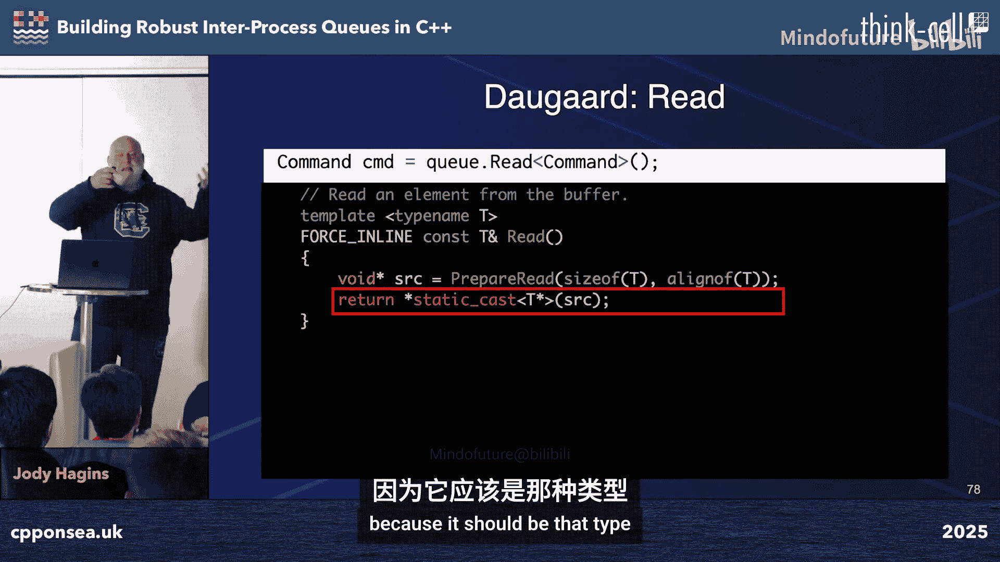

### 隐式生命期类型
在 C++20 之前，以下代码是未定义行为：
```cpp
// 在共享内存区域（例如通过 mmap 获得）
void* shared_mem = get_shared_memory();
int* p_int = static_cast<int*>(shared_mem);
*p_int = 42; // 未定义行为：int 对象的生命期尚未开始
```
虽然这段代码在许多平台上“似乎”能工作，但 C++ 抽象机认为 `int` 对象从未被构造，因此访问它是非法的。

C++20 引入了**隐式生命期类型**规则。像 `malloc`、`calloc` 等特定操作会为**隐式生命期类型**隐式创建对象，从而开始其生命期。

### 何为隐式生命期类型？
一个类型是隐式生命期类型，如果它是：
*   标量类型（如 `int`, `double`, `指针`）
*   隐式生命期类类型
*   上述类型的数组或 CV 限定版本

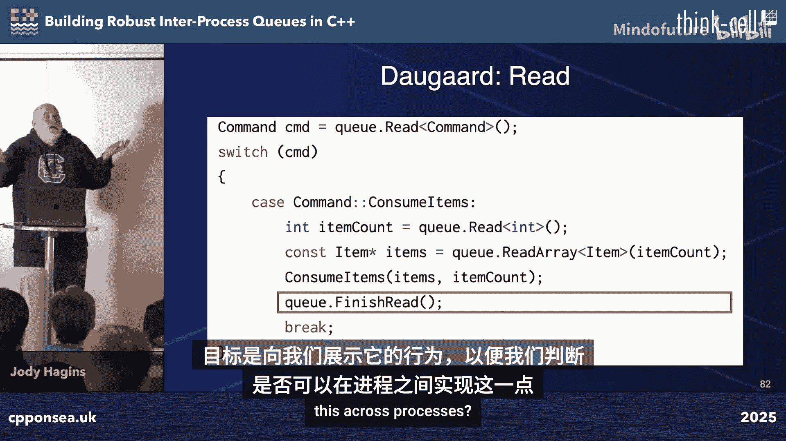

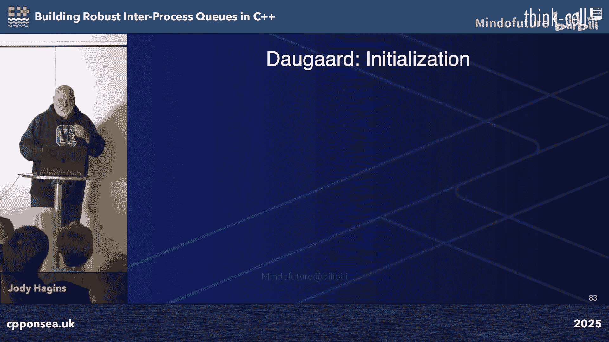

**隐式生命期类类型**需满足以下条件之一：
1.  它是一个聚合体。
2.  它至少有一个**平凡的合格构造函数**和一个**平凡的、非删除的析构函数**。

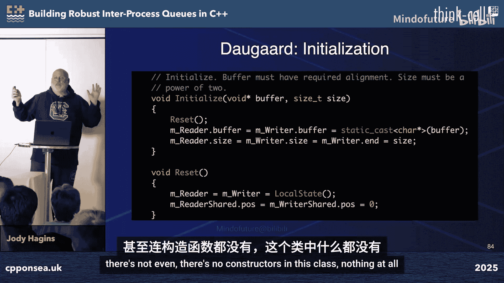

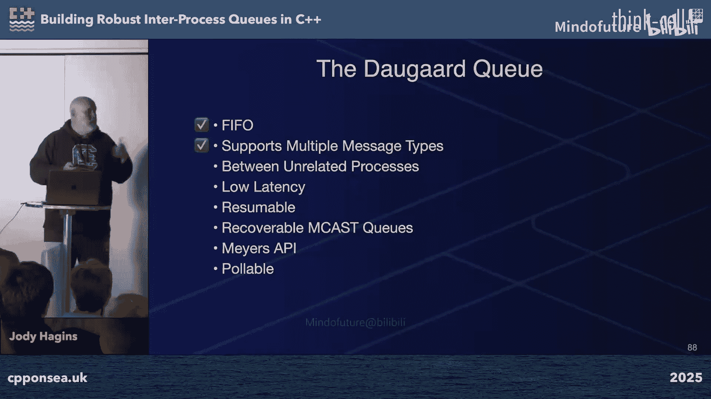

### 问题诊断
让我们用这个规则检查之前队列的组件：

1.  **`LocalState` 类**：它有一个用户定义的构造函数（即使只是设零），因此**不是**平凡构造函数。它**不是**隐式生命期类类型。
2.  **`std::atomic<size_t>`**：从 C++20 起，它的默认构造函数是用户定义的（执行默认初始化），因此**不是**平凡的。它**也不是**隐式生命期类型。

**结论**：直接将包含这些类型的结构体放入共享内存（通过 `mmap` 等），在 C++20 及以后的标准下是**未定义行为**。

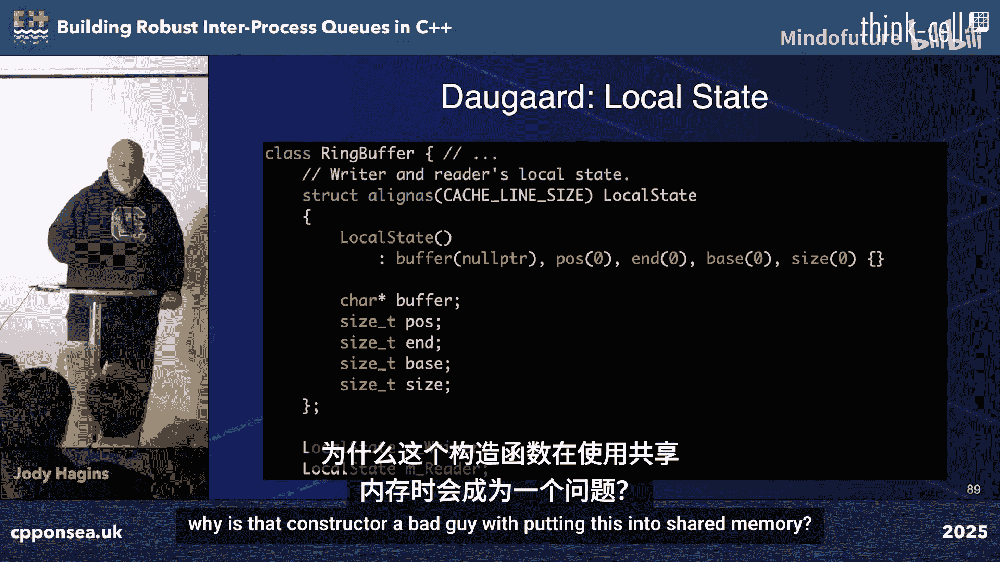

### 解决方案探讨
1.  **使用 `std::start_lifetime_as` (C++23)**：这个新函数可以显式地在存储中开始一个对象的生命期。**但是**，它要求对象类型是隐式生命期类型，所以对 `std::atomic` 无效。
2.  **使用 `std::atomic_ref`**：不在共享内存中存储 `std::atomic`，而是存储一个普通的 `size_t`，然后在每个进程中用 `std::atomic_ref<size_t>` 来包装并操作它。这要求所有访问都必须通过 `atomic_ref` 进行。
3.  **自定义包装器**：创建一个平凡的包装器来持有数据，并手动实现原子操作（或内部使用 `std::atomic_ref`）。虽然丑陋，但能保证合法性。
    ```cpp
    struct TrivialAtomicWrapper {
        alignas(sizeof(size_t)) char data[sizeof(size_t)];
        // 提供 load, store, exchange 等成员函数，内部使用 std::atomic_ref
    };
    ```

上一节我们厘清了对象生命期的复杂规则，本节中我们来看看如何通过关注点分离来设计一个健壮的进程间队列 API。

---

## 第4章：设计原则：关注点分离

构建健壮的进程间队列不能只关注数据结构和算法，必须将系统层面的关注点分离。

### 队列管理器
队列本身应作为一个独立的实体进行管理，其职责包括：
*   **生命周期管理**：创建、销毁队列。
*   **元数据管理**：存储队列容量、对齐方式、唯一标识符（UUID）、签名（防止连接错误队列）。
*   **生产者锁**：强制执行“单生产者”规则。任何进程想成为生产者，必须通过队列管理器获取一个**进程级锁**。

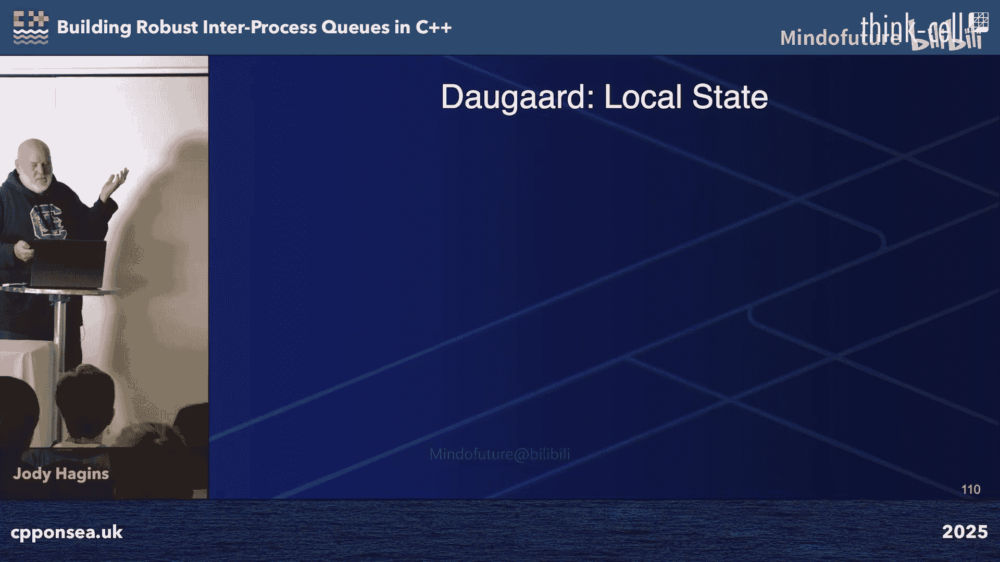

### 进程级锁的实现挑战与方案
如果一个生产者进程崩溃时持有锁，锁可能永远不会被释放，导致备份进程无法接管。我们需要一个**健壮锁**。

**解决方案思路**（类 Unix 系统）：
1.  在共享内存中存储一个**进程唯一标识符**作为锁。标识符可包含 PID 和进程启动时间戳。
2.  获取锁时，使用原子操作尝试将自己的标识符写入。
3.  如果写入失败（锁已被占），则检查持有锁的进程是否还存活（例如通过 `kill(pid, 0)`）。
4.  如果进程已死亡，则当前进程可以“夺取”锁，并更新标识符为自己。

**注意**：计算进程唯一标识符成本较高，应在进程内缓存。同时，需要考虑 `fork()` 调用后子进程 PID 变化的情况，通常使用 `pthread_atfork` 处理程序来重置缓存的 PID。

### 生产者与消费者类
将队列的访问逻辑封装到独立的 `Producer` 和 `Consumer` 类中。
*   `Producer`：负责向队列写入数据。它必须通过队列管理器获取生产者锁。
*   `Consumer`：负责从队列读取数据。对于多消费者队列，可能有普通消费者和特殊消费者之分。

这种分离使得 API 更安全，逻辑更清晰，并且更容易实现可恢复性等高级特性。

---

## 第5章：多播队列与可恢复性

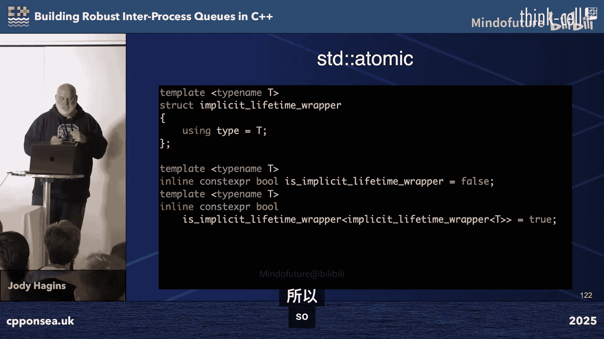

多播队列（MCast Queue）是进程间通信中一种非常重要的模式，它模拟了网络多播：**单生产者**发出的每条消息，**所有消费者**都能收到。

### 传统多播队列的缺陷
大多数生产环境中的多播队列为了实现最高速度，采用“生产者永不阻塞”的策略。如果消费者太慢，导致缓冲区被覆盖（被“套圈”），消费者通常会检测到这种情况然后**崩溃**。这不是真正的“可恢复”。

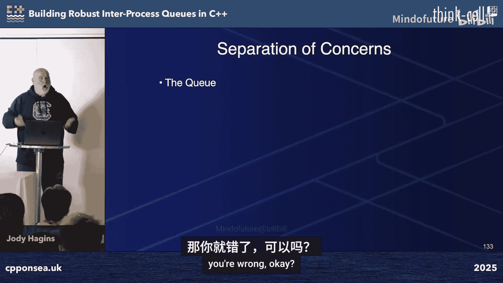

### 通过“特殊消费者”实现可恢复性
一种改进的设计是引入一个**特殊消费者**。

**工作流程**：
1.  **生产者**与**特殊消费者**之间是**阻塞同步**的。生产者写入时，如果特殊消费者没读完，生产者会等待。这保证了特殊消费者**永远不会丢失消息**。
2.  **普通消费者**以**非阻塞轮询**方式读取。它们追求低延迟，但如果处理太慢，可能会丢失消息。
3.  当普通消费者崩溃或重启后，发现自己丢失了消息，它可以向**特殊消费者**（或由特殊消费者持久化的存档）请求重传丢失的消息。

**优势**：
*   **生产者**在绝大多数情况下（面对普通消费者）不阻塞，保持低延迟。
*   **系统可恢复**：通过特殊消费者提供的存档/重传机制，普通消费者可以从错误中恢复。
*   **可监控**：通过收集生产者阻塞、消费者延迟等统计信息，可以提前预警性能问题。

这种设计可以通过模板或概念在队列创建时配置，灵活地选择是否需要可恢复性特性。

---

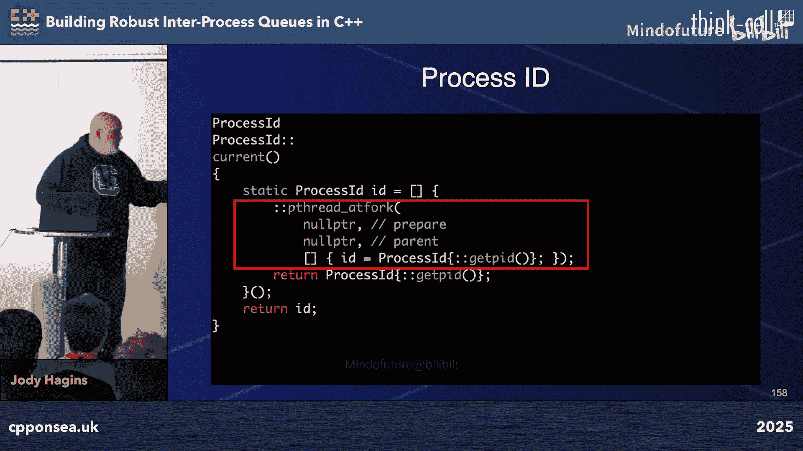

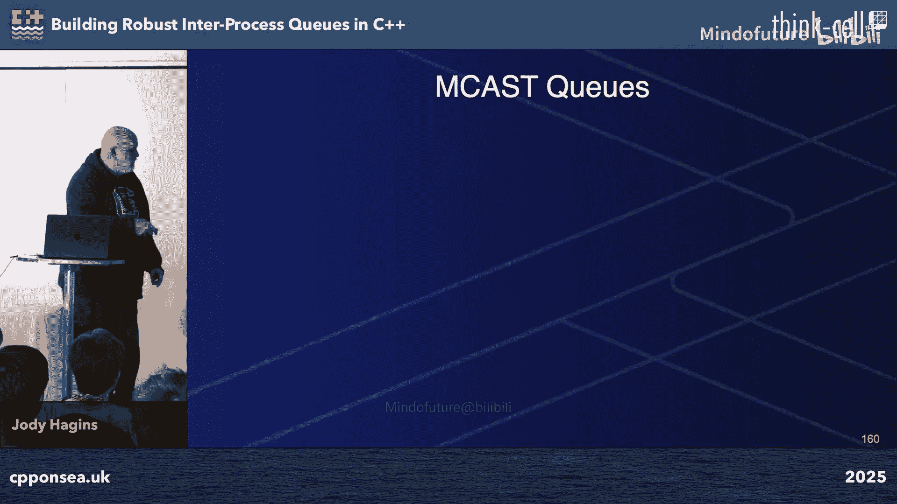

## 总结
在本教程中，我们一起学习了构建健壮 C++ 进程间队列的完整路径。

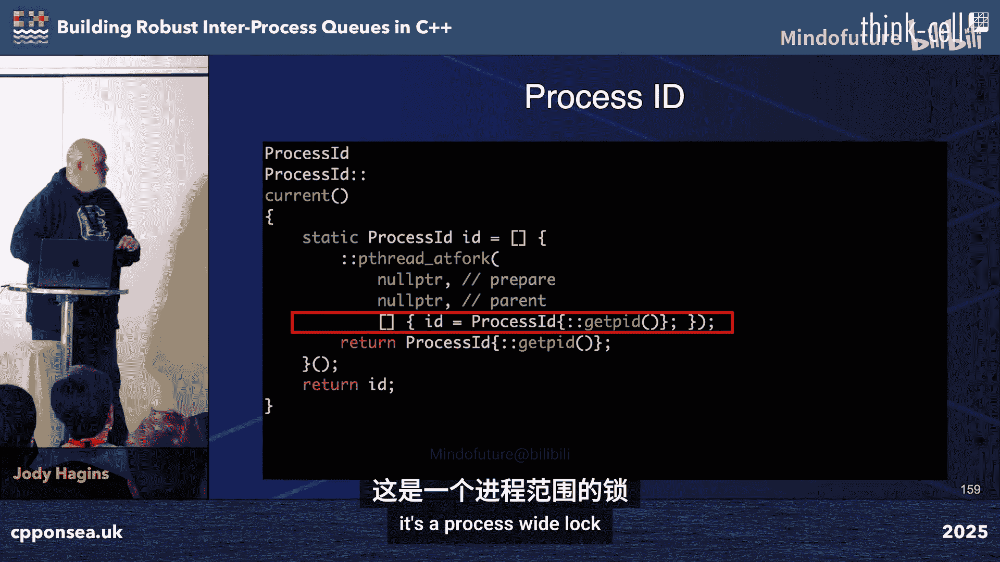

我们从分析一个高效的线程间队列开始，认识到将其直接用于进程间通信时，会遇到**指针有效性**、**对象生命期**（特别是 C++20 隐式生命期规则）和 **`std::atomic` 的非平凡性**等深层次问题。

接着，我们强调了**关注点分离**的设计原则，提出应由**队列管理器**负责生命周期、元数据和进程锁，由独立的 **`Producer`** 和 **`Consumer`** 类封装访问逻辑，从而构建更安全、更易用的 API。

最后，我们探讨了**多播队列**的场景，并通过引入**特殊消费者**的概念，设计了既能保持高性能又能实现**可恢复性**的方案。

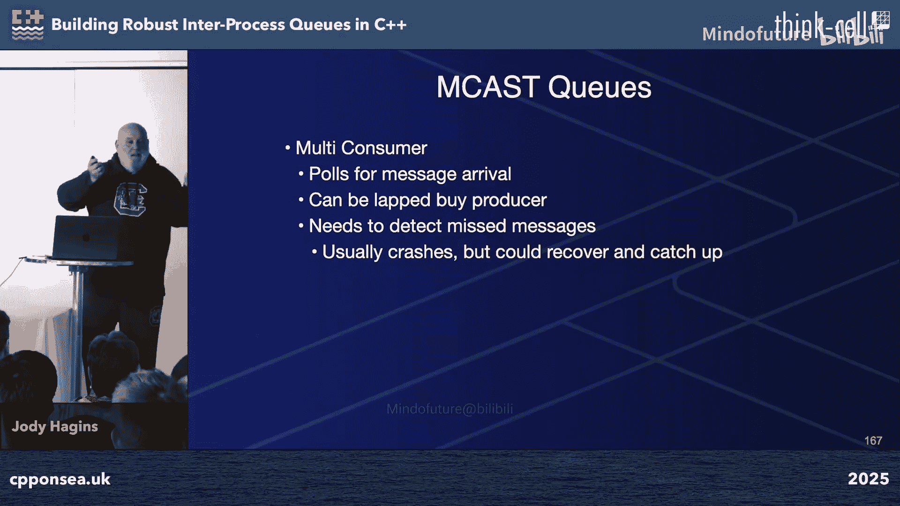

关键要点：
1.  进程间通信必须考虑独立的地址空间。
2.  C++20 后的对象生命期规则对共享内存使用有重大影响。
3.  良好的系统设计需要分离队列管理、同步和数据处理等关注点。
4.  通过巧妙的架构（如特殊消费者），可以兼顾低延迟和高可靠性。


希望本教程能帮助你在下一次需要构建进程间通信设施时，避免“追逐巴士”式的匆忙决策，而是从容地设计出健壮、高效的解决方案。