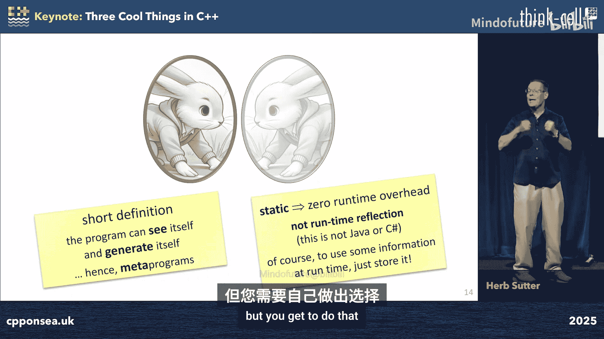
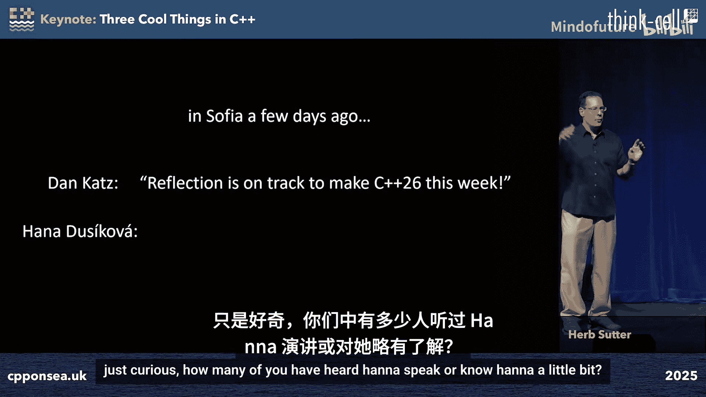
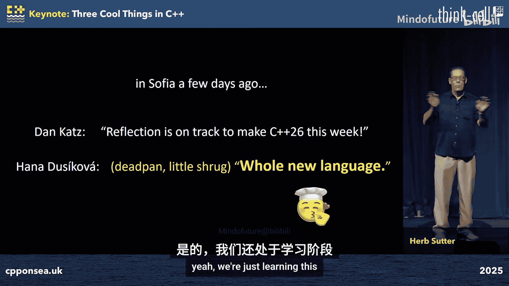
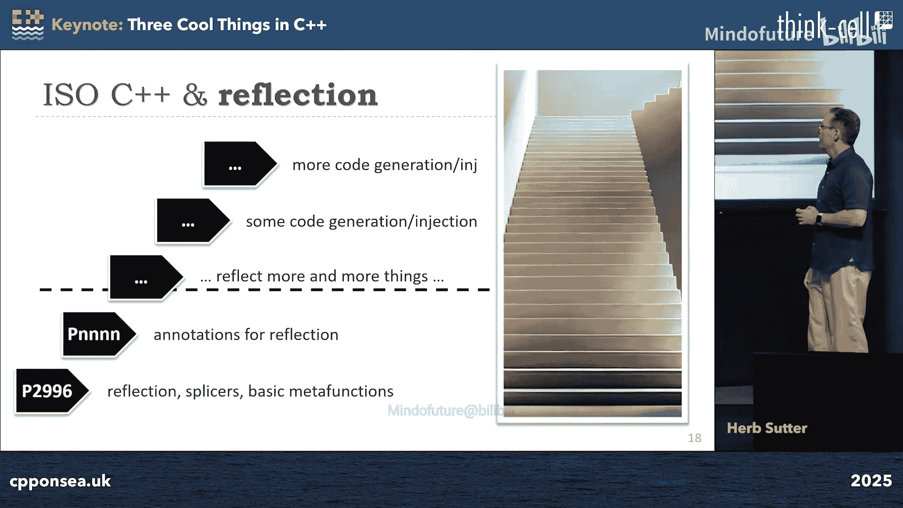
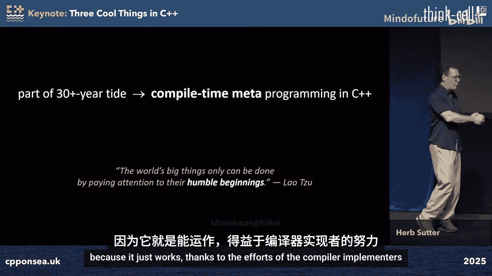
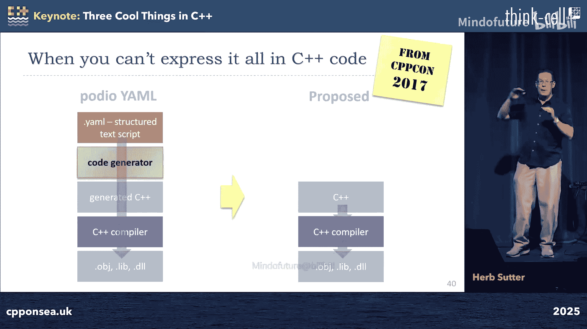
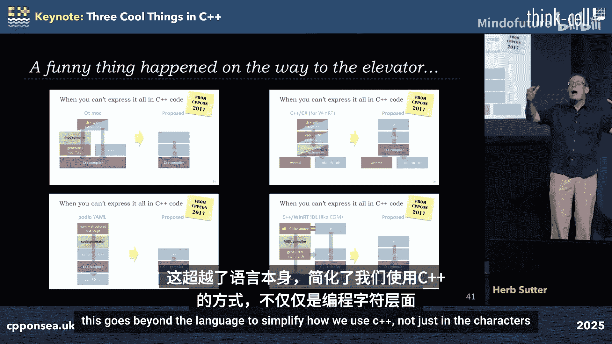
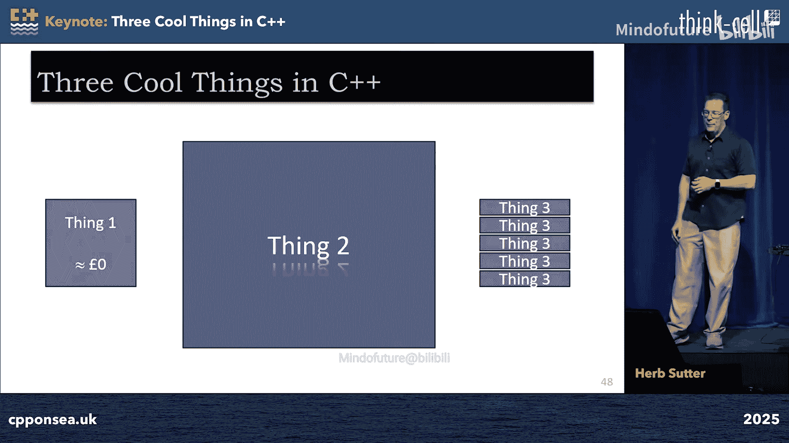

# 026：安全、反射与 std::execution

## 概述

在本教程中，我们将学习 C++26 标准中引入的三个重要新特性。这些特性旨在提升代码的安全性、表达能力和并发编程模型，同时注重开发者体验和代码的可迁移性。我们将依次探讨：**安全性增强**（包括自动初始化与边界检查）、**编译时反射**，以及 **std::execution 异步框架**。

---

## 章节 1：零成本采纳的安全性增强 🛡️

上一节我们概述了本教程的内容，本节中我们来看看第一个“很酷的东西”：一系列旨在提升代码安全性，且几乎无需修改现有代码即可受益的特性。

C++26 引入了几项重要的安全改进，其核心目标是让现有代码在重新编译为新标准后，能自动获得更高的安全性，而无需或仅需极少的代码改动。

### 1.1 自动初始化与“错误行为”

在 C++26 之前，未显式初始化的局部基本类型变量（如 `int`、数组）会拥有**未定义行为**。这意味着它们的值是任意的，可能导致程序崩溃、安全漏洞或难以调试的问题。

C++26 为此类情况引入了新的“错误行为”类别。它不再是未定义的，而是**明确定义为错误**。编译器被要求执行明确定义的操作，例如注入代码来检测并可能终止程序，或者用特定模式填充这些变量。

**核心概念**：
*   **未定义行为**：`int x; // C++26 前：值未定义，可能导致任何后果`
*   **错误行为**：`int x; // C++26：值被明确定义为“错误”，编译器会处理`

这意味着，仅将代码重新编译为 C++26，就能自动消除大量因未初始化变量导致的安全漏洞和错误。如果出于性能原因确实需要未初始化变量，可以使用 `[[indeterminate]]` 属性显式选择退出此安全机制。

```cpp
int safe_var; // C++26: 自动初始化（例如填充为特定模式）
[[indeterminate]] int fast_var; // 显式选择保留旧有的未定义行为
```

### 1.2 标准库的边界检查

C++26 采纳了“强化 C++ 标准库”提案，为标准库中大量常用的下标运算符和范围访问操作（如 `vector::operator[]`、`span::operator[]`、`string_view::front/back`）添加了可选的边界检查。

这是一个重要的安全增强，因为缓冲区溢出读写是每年最常见的安全漏洞类别之一。虽然标准未规定如何启用此功能（由编译器实现定义），但它为 C++ 最高频使用的内存操作区域铺设了一条安全的“主干道”。

实践表明（例如在 Apple 和 Google 的部署中），启用此类检查通常只带来约 3% 的性能开销，却能发现大量潜在错误和安全漏洞。

### 1.3 平凡重定位

“平凡重定位”是 C++26 引入的另一个能带来“免费”性能提升的特性。它允许在某些情况下（例如对象被移动后立即销毁），编译器可以执行比普通移动操作更高效的“位拷贝”式转移，而无需调用析构函数等额外操作。

**核心概念**：
*   **移动语义**：`T obj2 = std::move(obj1); // 调用移动构造函数/赋值运算符`
*   **平凡重定位**：对于可平凡重定位的类型，编译器可以优化为高效的位拷贝，跳过不必要的分支和检查。

重要的是，在 C++26 中，**所有可平凡复制的类型现在都是可平凡重定位的**。这意味着，当你的标准库实现更新后，重新编译现有代码（例如使用 `std::vector` 或 `std::unique_ptr` 的代码）就可能自动获得性能提升，无需修改源代码。

**本节总结**：C++26 通过自动初始化、标准库边界检查和平凡重定位等特性，在几乎零代码改动成本的前提下，为程序提供了显著的安全性和性能提升。这体现了语言演进中对**可采纳性**的高度重视。

---





## 章节 2：改变游戏规则的编译时反射 🔮



上一节我们介绍了无需改动即可获益的安全特性，本节我们将深入探讨 C++26 中可能最具革命性的新特性：**编译时反射**。这被认为是 C++ 近二十年来最大的变革之一。



### 2.1 反射是什么？

简单来说，反射允许程序在编译时**检视自身的结构**。你可以编写代码来遍历类的成员函数、检查类型的属性、获取函数的参数列表等。这就像是程序获得了查询自身抽象语法树的标准化 API。

更强大的是，结合**拼接**技术，反射还能用于**生成新的代码**。这使得编写能够读取和修改自身的“元程序”成为可能。



与 C# 或 Java 的运行时反射不同，C++ 的反射完全在**编译时**进行。这意味着它不会带来任何运行时开销，除非你显式地将编译时计算的结果存储下来供运行时使用。

### 2.2 C++26 反射的里程碑意义

在 C++26 标准草案中，反射的基础设施被正式采纳。这包括：
*   反射核心提案
*   注解反射
*   基类子对象拼接
*   静态字符串/对象数组（便于将编译时数据用于运行时）
*   扩展语句（编译时 `for` 循环）
*   函数参数反射
*   反射中的错误处理

这标志着 C++ 迈入了一个“全新的语言”阶段。正如专家所言，我们可能需要十年时间来充分发掘反射的全部潜力。

### 2.3 反射的应用示例：元类

一个经典的应用是“元类”概念。设想你可以这样定义一个接口：

```cpp
class(interface) Widget {
    void f(int);
    std::string g();
};
```

这里的 `interface` 不是一个关键字，而是一个**编译时常量函数**（元函数）。编译器会调用这个函数，它通过反射分析 `Widget` 的声明，然后自动生成正确的代码：为所有函数添加 `virtual` 和 `= 0`，生成虚析构函数，抑制拷贝操作等。

在 C++26 中，虽然我们还不能直接在同一个源文件中注入生成的代码（这预计是 C++29 的特性），但我们已经可以编写元函数，将生成的标准 C++ 代码输出到另一个文件，然后由构建系统编译。这已经能实现许多强大的代码生成场景。

以下是利用反射和注解实现更精细控制的简单示例：

```cpp
class Widget {
    void f(int);
    [[suppress]] void g(); // 使用自定义注解标记
};

// 元函数可以检查 `suppress` 注解，并决定不将 `g` 纳入生成的接口中。
```

### 2.4 反射的广阔前景

反射的潜力远不止于简化类定义。以下是一些可能的应用方向：

以下是反射可能带来变革的领域：
*   **序列化/反序列化**：自动生成 JSON、XML 等格式的序列化代码。
*   **测试 Mock**：自动生成用于单元测试的 Mock 类。
*   **替代 CRTP**：在许多场景下提供更清晰的替代方案。
*   **领域特定语言集成**：在 C++ 内直接表达和转换 DSL。
*   **类型擦除**：自动生成类型擦除包装器。
*   **多语言绑定**：自动生成 Python、JavaScript 等语言的绑定代码。
*   **二进制元数据生成**：例如为 Windows WinRT 生成所需的 `.winmd` 文件。

**本节总结**：C++26 引入的编译时反射是一个基础性的强大工具，它将极大地改变我们编写和组织 C++ 代码的方式。它不仅能减少样板代码、降低错误率，还能简化整个构建工具链，有望取代许多现有的专用代码生成器。

---

## 章节 3：统一的异步编程模型 ⚡

上一节我们探讨了改变语言范式的反射，本节我们来看看第三个“很酷的东西”：`std::execution`（又称发送者-接收者模型），这是 C++ 标准的异步编程框架。

### 3.1 异步模型的核心

同步函数调用会阻塞，直到函数执行完毕。异步编程的核心在于**解耦任务的启动与完成**。

在 C++26 中，使用 `std::execution` 可以这样表达：

```cpp
// 传统同步
int result = f(); // 调用并等待
use(result);

// C++26 异步
auto sender = std::execution::schedule(pool) // 在线程池调度
           | std::execution::then(f)        // 然后执行 f
           | std::execution::then(use);     // 然后使用结果

// 启动异步操作，并（可选）同步等待完成
std::this_thread::sync_wait(sender);
```



这里，`schedule` 和 `then` 通过管道符 `|` 连接，清晰地表达了异步任务流。任务在 `pool` 上启动后立即返回，调用者可以继续执行，直到需要结果时再通过 `sync_wait` 进行“汇合”。

### 3.2 框架的独特优势



`std::execution` 最引人注目的特点是，它**能同时很好地服务于两种不同的并发范式**：

1.  **并发**：管理多个独立、可能长时间运行的任务（如 UI 响应与后台计算）。这通常涉及协程、事件循环等。
2.  **并行**：将单个计算任务分解，同时在多个硬件单元上执行以加快速度（如并行排序、GPU 计算）。

令人惊讶的是，同一个 `std::execution` 框架已被证明既能高效地用于 CPU 上的协程（并发），也能通过特定后端在 GPU 上运行数据并行任务（并行），且性能可与专用框架竞争。这为编写跨 CPU/GPU 的异构计算代码提供了统一的抽象。

**本节总结**：`std::execution` 为 C++ 提供了一套现代、灵活且功能强大的异步编程模型。它统一了并发和并行编程的体验，是构建高性能、响应式应用程序的重要基础。

---

## 总结

本节课中我们一起学习了 C++26 标准中三个关键的新特性：

1.  **安全性增强**：通过自动初始化、标准库边界检查和平凡重定位，以极低的采纳成本提升了代码的安全性和性能。
2.  **编译时反射**：一个革命性的特性，允许程序在编译时检视和生成自身代码，将极大地改变 C++ 的编程范式、减少样板代码并简化工具链。
3.  **std::execution 异步框架**：提供了一套统一的模型来处理并发和并行任务，是现代异步 C++ 编程的基础。




C++26 汇集了这些重量级特性，其影响力可能堪比当年的 C++11，标志着 C++ 进入又一个“现代”时代。这些特性将影响我们未来编写的每一行代码，使 C++ 在保持高性能的同时，变得更安全、更富有表现力、更易于构建复杂的并发系统。