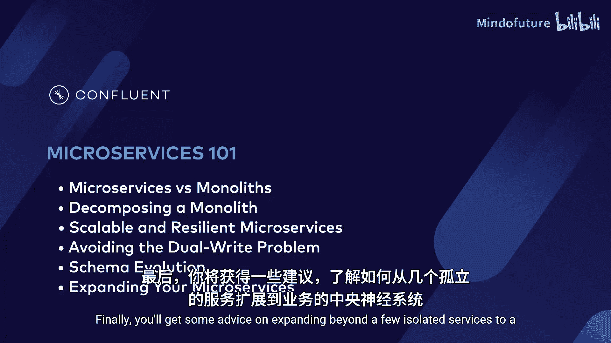
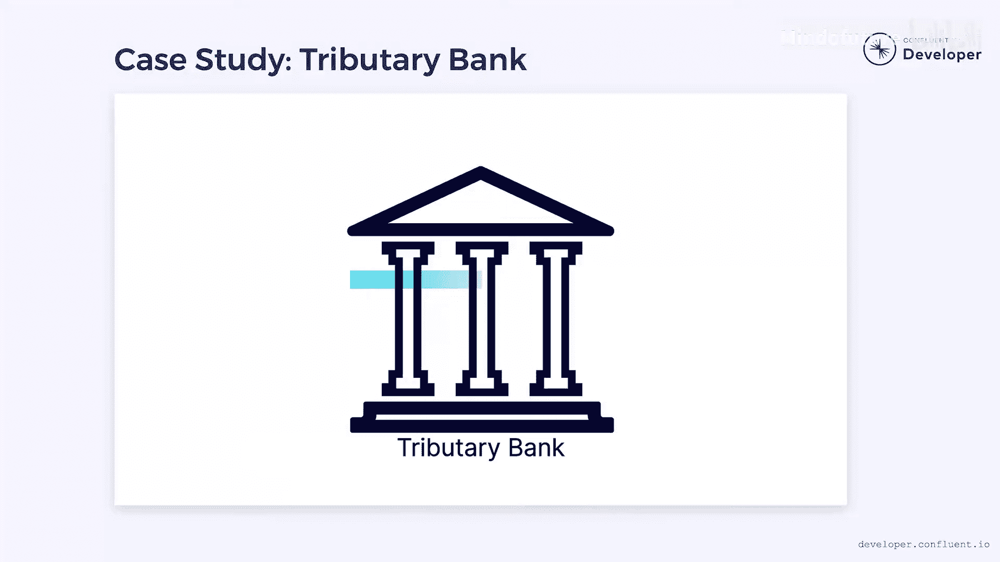

# 001：课程介绍 🎬

在本节课中，我们将要学习《事件驱动微服务设计》这门课程的整体介绍。我们将了解课程的目标、核心内容、案例背景以及学习本课程所需的准备。

---

在单体架构占主导地位的世界里，有一家银行将挑战常规，将其欺诈检测系统提取为一个微服务。

有人建议我需要为我的新微服务课程制作一个预告片，所以我正在制作一个预告片。但或许我可以用正常的语音，直接告诉大家课程的内容和期望。

我是来自Confluent的Wade。在我的职业生涯中，我花费了大量时间研究微服务架构，甚至在它们流行之前就开始了。我不会粉饰这一点，我相信微服务是构建大型复杂系统的正确方式。然而，我并不喜欢教条主义。确实存在一些合理的情况，微服务可能不是合适的工具。因此，我在这里不是要将微服务的理念强加给你，甚至不是试图向你推销它们。相反，如果你对微服务感兴趣，并且想更多地了解如何正确地构建它们，那么我认为这门课程会引起你的兴趣。

现在，让我们谈谈在继续学习课程其余部分时，你将学到什么。

以下是本课程的核心学习目标列表：

*   **理解微服务的特性**：学习微服务的特征，以及它们与单体应用的区别。
*   **探索应用拆分模式**：探索分解单体应用的不同方法，例如绞杀者无花果模式或抽象分支模式。
*   **认识微服务的优势**：了解微服务如何提升系统的隔离性、弹性和可扩展性。
*   **解决分布式系统难题**：发现任何分布式系统（不仅仅是微服务）都会出现的双重写入问题，并了解可用于避免它的解决方案。
*   **掌握事件模式演进**：学习如何在不导致停机的情况下演进事件模式。
*   **迈向企业级架构**：获得一些建议，了解如何将几个独立的服务扩展为企业的“中枢神经系统”。

在整个课程中，我们将专注于银行业的一个具体案例研究。我们将跟随Tributary银行，看他们如何踏上旅程，将其系统的部分功能提取为一组微服务。

本课程在架构层面探讨软件，因此不要求你编写任何代码。然而，如果你想自己尝试实现其中的一些想法，拥有一个生产级的Apache Kafka部署环境可能会很有用。如果你还没有注册Confluent Cloud，可以使用这个二维码创建一个账户。别忘了查看描述中的优惠码，它将为你提供免费额度以便开始。

如果这一切听起来很有趣，请务必在Confluent Develop上查看完整课程。它完全免费，所以你真的没有什么可失去的。别忘了点赞、分享和订阅，这样我们才能持续为你带来新内容。

感谢加入，我们下一个视频再见。

---

本节课中我们一起学习了《事件驱动微服务设计》课程的介绍。我们明确了课程的目标是教授如何正确构建微服务，了解了课程将涵盖从特性认知、拆分模式到解决分布式难题和模式演进等一系列核心主题，并知道了课程将基于一个银行案例展开。最后，我们了解了学习本课程无需编码，但拥有Kafka实践环境会更有帮助。