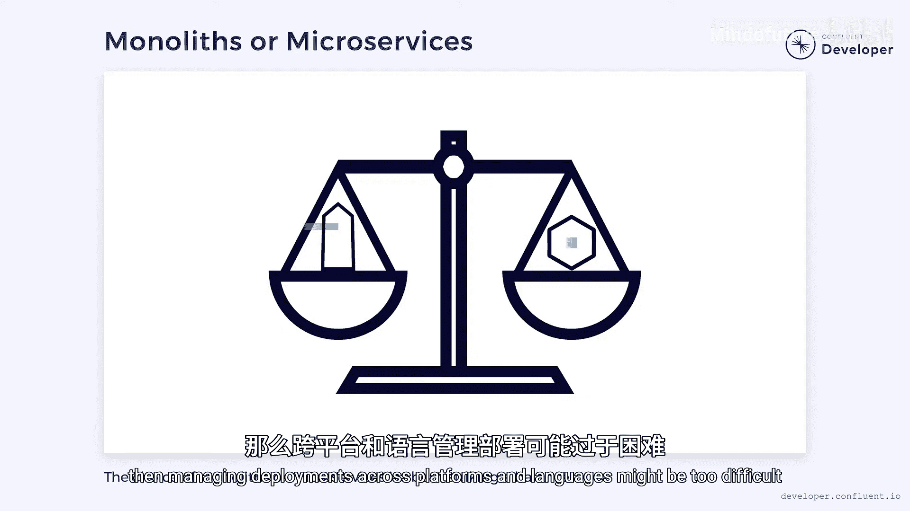

# 002：从单体架构到微服务 🏗️➡️🔗


在本节课中，我们将要学习单体架构与微服务架构的核心区别。我们将探讨它们各自的特点、共同点，以及如何根据实际场景选择合适的架构模式，从而构建清晰、可维护的软件系统。


## 定义与光谱

首先，我们需要明确单体架构和微服务的定义。它们并非非黑即白，而是存在于一个光谱的两端，中间存在大量灰色地带。

*   **单体架构** 可以被描述为一个**作为单一单元部署**，并**涵盖多个业务领域**的系统。
*   **微服务** 则是一系列**可部署单元的集合**，**每个单元专注于一个特定的领域**。

我们忽略了许多细节，但这为我们提供了一个讨论的起点。

## 最坏的情况

接下来，我们来看看两种架构在最糟糕的情况下会是什么样子。

对于单体架构，最坏的情况是可怕的“意大利面条式代码”，即多个领域交织在一起，没有清晰的分界线。业务逻辑常常以存储过程的形式存在于数据库中，并且对数据的所有权意识薄弱。这些系统难以维护，因为即使是很小的改动也可能产生深远的影响。

与此同时，微服务最坏的情况是每个细节都变成了一个独立的服务，全部通过分布式API连接。极端情况下，这会形成“分布式意大利面条”。这并不比单体架构更容易管理，事实上可能更困难。修改一个单一功能可能涉及修改多个服务，这非常棘手。并且，当某个服务不可用时，故障场景可能是灾难性的。

## 构建可维护软件的核心

这引出了构建清晰、可维护软件的真正秘诀。关键不在于我们使用单体架构还是微服务，而在于我们是否创建了足够的**隔离性**和**自主性**，为系统的演进留出空间。

以下是几种提高系统隔离性的方法。

### 通过API定义领域边界

最重要的方法是找到自然存在的领域边界，并用API来保护它们。

*   在单体架构中，应用程序可以被分离成具有清晰API（基于对象或函数）的库。在某些情况下，这些库甚至可以独立部署，形成所谓的“模块化单体”。
*   在微服务中，服务被分离成通过REST或异步事件等技术暴露API的应用程序。

一个关键区别是：在单体架构中，这种分离是**可选的**；而在微服务中，这是**必需的**。

### 数据所有权

另一种提高隔离性的方法是确保每个领域拥有自己的数据。只有特定的库或微服务被允许访问数据库中的数据，其他所有部分都必须通过API。禁止直接访问数据库允许领域在内部演进，而无需担心破坏外部依赖。但必须注意确保API保持兼容。这是微服务背后的驱动原则之一，尽管它也可以在单体架构中实现。

### 异步事件与发布-订阅

引入隔离性的一种流行方法是使用**异步事件**和**发布-订阅**机制。

**代码示例：发布-订阅模式**
```python
# 服务A发布事件到“订单创建”主题
event_bus.publish(topic="order_created", data=order_data)

# 服务B订阅“订单创建”主题以处理物流
event_bus.subscribe(topic="order_created", callback=fulfill_order)
```

系统内的组件不是通过函数调用或REST API进行同步通信，而是将消息发布到一个主题。系统中任何对该数据感兴趣的部分都可以订阅该主题。这通过消除任何直接依赖关系，在组件之间创造了自主性。这减轻了提供API的服务的负载，并赋予它们更大的演进灵活性。创建新客户端变得更容易，并为新颖的部署和自动扩展开辟了可能性。

### 微服务特有的隔离性

有些类型的隔离性只适用于微服务。在单体架构中，应用程序中不相关的部分会竞争相同的资源，如内存、线程和CPU。如果我们将系统拆分为微服务，就可以确保它们不竞争资源，无论是使用容器资源限制还是部署到不同的机器上。

这也允许其他不那么明显的自主形式。例如，在构建单体架构时，每个库通常使用相同的编程语言编写，并使用相同的技术栈部署。即使代码可能有相当程度的隔离，它仍然与语言和执行平台耦合。微服务通过允许每个服务用不同的语言编写并使用不同的技术栈部署，打破了这种耦合。这可以在选择最适合工作的工具时提供更大的灵活性。

## 权衡与选择



但不要以为使用微服务时一切都是完美的。将所有东西都作为独立单元部署听起来很棒，直到你必须管理所有这些部署。突然间，你需要一个编排平台来管理一切。多语言架构需要每种语言或技术栈的专家，这可能使招聘具有挑战性。

这就是单体架构和微服务之间平衡的所在。

*   如果我们的业务习惯于使用多种语言，或者需要访问跨不同技术的工具，那么微服务架构是有意义的。
*   另一方面，如果团队规模小，没有足够资源进行大量基础设施支持，那么跨平台和跨语言管理部署可能过于困难。

在这种情况下，单体架构可能更合理。重点不是要说明单体架构或微服务谁更优越。相反，就像软件中的许多事情一样，这真的取决于你的具体用例。理解这些差异有助于我们更好地决定何时使用它们。


本节课中，我们一起学习了单体架构与微服务架构的核心概念与权衡。我们了解到，构建优秀软件的关键在于实现充分的隔离与自主，而非拘泥于某种特定架构。根据团队规模、技术栈偏好和业务需求来做出明智的选择，才是成功之道。