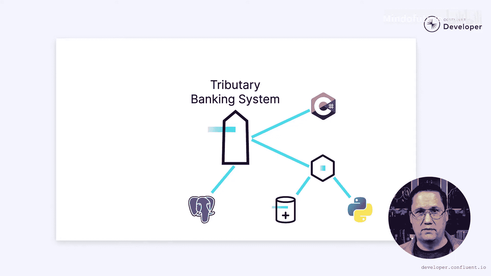

# 003：银行业与欺诈检测中的事件驱动微服务

在本节课中，我们将探讨微服务是否是解决特定问题的正确工具。我们将通过一个虚构的银行案例，分析其在现代化架构过程中面临的挑战，并评估事件驱动微服务架构是否是一个合适的解决方案。

## 概述：Tributary银行的挑战

微服务是分解单体应用的正确工具吗？这是在考虑是否将单体应用分解为一组微服务时需要回答的最棘手的问题之一。

每个企业都有独特的需求。有时这些需求与微服务架构相符，有时则不然。

我将向您介绍Tributary银行，并探讨其在尝试现代化架构时面临的挑战。

他们应该构建一个新的微服务系统吗？请继续关注以找出答案。

## 虚构案例与现实挑战

Tributary银行并非真实存在。遗憾的是，保密协议和潜在的法律诉讼威胁使我无法谈论真实的公司。

然而，我将概述的挑战是真实存在的。我们虚构的银行是一家中等规模的机构，提供零售和公司银行服务。

他们处理数十亿美元的交易。

## 原有系统与问题根源

他们的原始软件采用单体架构和共享关系数据库构建。

他们通过早期提供自动欺诈检测服务来使自己与众不同。

每笔交易都会与一系列已知的欺诈模式进行比较，根据结果决定接受或拒绝交易。

然而，犯罪分子变得越来越狡猾，原始的欺诈模式已不足以检测现代欺诈行为。

Tributary银行难以适应其遗留系统，现在发现自己落后于竞争对手，因为竞争对手引入了机器学习算法来打击欺诈。

他们需要进行现代化改造。问题是，负责欺诈检测系统的团队确信，转向事件驱动微服务架构将是解决所有问题的灵丹妙药。

但他们是对的吗？让我们看看他们的理由，并判断事件驱动微服务是否真的合适。

剧透警告：世上没有灵丹妙药。任何方案都有权衡。

## 挑战一：系统僵化与数据耦合

Tributary面临的问题之一是他们的欺诈检测系统变得僵化。

最初，欺诈检测团队构建了一个清晰的API，允许开发人员检查欺诈交易并查看先前被拒交易的详细信息。

然而，其中一些细节，例如拒绝原因，在共享数据库中很容易获取。一些开发人员绕过API，直接访问数据库。

现在，欺诈检测团队难以重新设计他们的数据库，因为系统的其他部分直接耦合到了现有的数据结构。

他们需要找到一种方法来打破这种耦合。他们希望微服务能成为这里的答案。

以下是微服务的一个好处：

*   **数据隔离**：微服务被设计为仅通过明确定义的API共享数据。禁止直接访问数据库。这可以通过数据库权限来控制，将访问权限限制在特定的微服务。

如果原始系统以这种方式构建，他们可能就避免了后门访问数据库的问题。然而，说微服务是唯一的解决方案并不公平。

即使在单体应用中，谨慎使用数据库权限本可以防止这个问题。关键区别在于，对于微服务，**数据隔离原则是架构内置的**，而对于单体应用，它们是可选的。

无论他们采用何种方法，都需要理清现有的依赖关系。如果他们能做到这一点，微服务架构可以帮助在未来保持隔离。

## 挑战二：关键组件故障与级联风险

欺诈检测系统对Tributary的业务至关重要，因为它被许多不同的组件使用。

不幸的是，这有缺点。如果该组件发生故障，任何依赖它的组件也会发生故障。在某些情况下，例如内存不足错误，这些故障可能导致整个应用程序关闭。

这可能导致流量被重定向到其他实例，而这些实例又可能经历类似的故障。突然之间，我们就有了一个级联故障，导致整个系统崩溃，甚至包括那些不依赖欺诈检测的部分。

在处理数十亿美元交易的金融系统中，这类故障可能是灾难性的。这导致Tributary的团队害怕做出改变。

每次更改都有可能引入错误，没有人愿意为此负责。他们变得格外谨慎，在进行缓慢而费力的部署之前，通过一套复杂的手动和自动化测试来运行每一个更改。

这通常有效，因为它保持了应用程序的运行，但它使开发速度变得极其缓慢，进一步阻碍了他们的竞争能力。如果他们找不到加速开发的方法，可靠性的代价可能会让他们失去业务。

## 微服务与故障隔离

如果你认为微服务将消除系统中的故障，请举手。是的，它们不会。故障是生活中的事实，需要被接受。

然而，微服务擅长隔离故障。如果欺诈检测在一个独立的微服务中运行，故障可能不会造成灾难性后果。内存不足错误可能仍然会使服务的一个实例崩溃，重新平衡可能导致其级联到其他实例。但是，系统的其余部分可以继续运行。不需要欺诈检测的系统部分不受故障影响。

因此，尽管故障不可避免，但它们可以被隔离以降低风险。这有助于减轻对进行更改的恐惧。最终，Tributary银行可以学会将变革作为流程的关键部分来接受。

## 挑战三：性能瓶颈与同步处理

随着平台的发展，Tributary遇到的另一个挑战是系统变慢了。

早期，当欺诈检测较为简单时，他们可以依靠一小套执行快速的静态规则。然而，随着欺诈检测的发展，算法变得更加复杂。

过去需要毫秒执行的命令，现在可能需要几个数量级的时间，随着机器学习的出现，情况可能会变得更糟。

这就产生了一个问题，因为对每笔交易执行欺诈检测可能意味着将这些交易减慢到几秒钟。在当今世界，这完全不可接受，尤其是对于金融系统。而现实是，欺诈检测是随着时间的推移而发生的。仅通过查看单笔交易来检测欺诈几乎是不可能的。它需要对跨越数分钟、数小时甚至数天的模式进行分析。

因此，最初设计为在毫秒内完成的系统从第一天起就存在缺陷。问题是，当我们发送消息时，发送方通常会被卡住等待处理，直到收到回复才能继续。这可能会造成长时间的延迟。

如果系统能够适应事件驱动微服务，每当我们发送消息时，我们可以在消息被存储到Kafka后立即回复，并且消息可以被异步处理。

这将提高性能，使我们摆脱复杂欺诈检测算法的瓶颈。

作为一个额外的好处，它可以提高可靠性。异步过程最终需要完成。但如果它离线一段时间，不一定影响最终用户。只要进程恢复并从停止的地方继续，最终用户就不需要受到潜在故障的影响。

## 挑战四：安全风险与影响范围

Tributary在构建这个新系统时必须考虑的最重要因素之一是如何封装安全风险。他们有数千名员工，处理数十亿美元的交易。安全漏洞可能造成难以置信的损失。他们必须小心限制爆炸半径——如果系统的一部分被攻破。

在他们现有的单体应用中，开发人员访问的代码和数据库远超过严格必要的情况并不少见。如果一名开发人员被攻破，可能会产生广泛的爆炸半径。有办法缓解这种情况，他们在这方面做了很多工作，但这确实需要额外的注意。

即使在微服务架构中，他们也可能会搞砸这一点。然而，正如我们所讨论的，微服务确实有助于隔离和封装。每个微服务拥有自己的数据。

我们可以将数据的访问权限限制在仅处理该微服务的开发人员。微服务的代码可以轻松地存放在其自己的源代码控制仓库中，并且我们可以限制对该仓库的访问。这样，如果有人获得了开发人员的凭证，他们也只能攻破系统的一小部分。

虽然这并不能消除潜在的安全漏洞，但这是Tributary限制其影响范围的一种方式。

## 额外优势：技术灵活性与现代化

转向一系列微服务还有额外的好处。

他们的原始系统是用C#构建的，这在当时是一个流行的选择。然而，当他们开始进入数据科学和机器学习领域时，他们发现这些领域的许多开发人员更喜欢Python。

转向微服务架构将使他们更容易适应时代并跟上趋势。当你被锁定在特定语言时，这可能很难做到。

同样，他们最初的Postgres数据库在开始时是合适的，但现在他们对更专业的数据库感兴趣。将整个单体应用迁移到专业数据库将很困难，可能也不可取。然而，针对不同数据库构建新的微服务是一项更合理的尝试。

通过采用微服务方法，他们将拥有更大的灵活性来采用现代技术，这可以帮助他们跟上快速发展的竞争步伐。

## 结论：值得探索的候选方案

在这里采用微服务是正确的做法吗？发表评论，让我知道你的想法。

我认为不可能得出确切的结论。肯定会有我们没有想到的问题，这些问题可能会给微服务架构带来麻烦。而且Tributary面临的问题通常有许多解决方案，微服务只是其中之一。

我们可以说的是，事件驱动微服务架构似乎是解决一些关键问题的有效候选方案。这使其值得进一步研究，而这就是我们的下一步。

在本系列的其余部分中，我们将更详细地探讨Tributary银行从单体应用迁移到一系列微服务可以采取的过程。我们将看到他们在此过程中可能遇到的挑战类型，并探索他们可以实施的解决方案来克服任何困难。

本节课中，我们一起学习了评估微服务适用性的方法，并通过Tributary银行的案例分析了事件驱动微服务在解决系统僵化、故障隔离、性能瓶颈和安全风险等挑战方面的潜在价值。我们得出结论，虽然微服务并非万能，但它是解决特定架构问题的有力候选方案，值得深入探索。