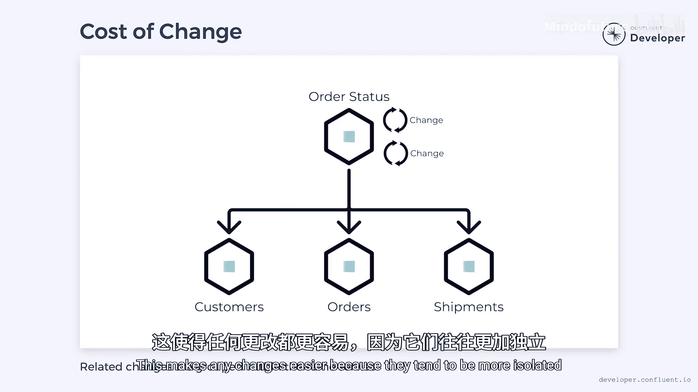

# 004：自治微服务 🏗️

在本节课中，我们将探讨微服务的**自治性**，理解其价值，并学习如何通过低耦合与高内聚的设计原则来构建健壮的微服务系统。

## 概述：从办公室协作到微服务自治

在开始技术讨论前，让我们先思考办公室（无论是远程还是现场）的工作场景。我们在工作中很可能会与他人互动，这些人可以被视为**外部依赖**。我们需要他们的贡献，但无法直接控制他们的行动。如果他们未能及时交付成果，无论是休假、生病还是进度慢于预期，都会导致我们的工作延迟。

在理想情况下，我们希望不依赖任何人就能独立完成工作。但同时，我们也不希望独自承担所有任务，与团队协作才能实现规模化。这与微服务有何关联呢？微服务就是一组协同工作以完成任务的应用程序团队。这些服务常常相互依赖，从而创造了外部依赖。这些依赖会引入延迟。虽然微服务不会生病或休假，但它可能发生故障或需要重新部署，也可能在繁忙时响应变慢。这些情况都会导致原本健康的系统出现超时和故障。

无论是办公室还是微服务系统，其核心问题都在于缺乏**自治性**。自治性是指系统成员能够独立行动，不受外部干扰的能力。每一个外部依赖都会降低微服务的自治性。

## 构建自治服务：从同步调用到事件驱动

想象一个包含客户、订单、物流等信息的电子商务网站。一个订单的状态可能需要整合来自多个微服务的信息。这意味着它可能需要从多个微服务中拉取数据。然而，这会在服务之间产生大量**耦合**。每一次调用都会带来微小的延迟。如果其中一个服务不可用会怎样？在这种情况下，整个任务就会失败。

那么，我们能否让系统变得更**松耦合**呢？

与其从各个微服务拉取数据，不如让每个服务将数据推送到一个消息平台（例如 **Kafka**）。负责订单状态的服务可以消费这些消息，并提前构建好订单的视图。这样，当请求订单状态时，所有数据都已就绪，无需再进行外部调用。

这种改变将耦合关系转变为：每个服务都依赖于消息平台和消息格式，但它们彼此之间不再直接绑定。同时，它也打破了**时间耦合**。当服务间进行同步通信时，所有事情必须在同一时间发生。然而，在新的架构下，通信是**异步**的，这为消息处理时间提供了更大的灵活性。服务可以离线，而不会立即对彼此产生影响。

在这个例子中，当订单服务离线时，我们仍然可以获取物流或客户数据，因为这两个系统仍然完全正常运行。这提升了每个微服务的自治性，使它们更具**弹性**。

## 平衡自治性与内聚性：单一职责原则

在构建自治服务时，很容易倾向于将更多功能塞进单个服务中。如果所有功能都在一个服务里，那就没有外部依赖了。然而，这会带来新的问题。

我们电商平台的订单状态需要订单、客户和物流信息。我们可能决定将所有功能整合进一个服务。只要系统在运行，所有必要的组件都在那里。但是，它们也共享着资源。想象一下，有一次新产品发布导致订单处理过载。不幸的是，整个系统共享着处理器、内存和线程。因此，不仅仅是订单处理过载，连与新产品完全无关的物流服务也可能突然停止响应。

本质上，系统一部分的问题会影响到整个系统，这可能导致**级联故障**。这正是我们希望避免的场景。

为了避免这种情况，我们需要构建**高内聚**的微服务。可以将内聚性理解为服务内各个任务之间的关联紧密程度。例如，在订单中添加和移除商品是高度内聚的操作，因为它们都在操作同一个实体（订单）。但是，添加订单和添加客户则不是内聚的，因为涉及的实体完全不同。

思考内聚性的一个角度是罗伯特·C·马丁在2003年定义的**单一职责原则**。该原则指出：一个类应该只有一个引起变化的原因。这个定义可以扩展到微服务：一个微服务应该只有一个引起变化的原因。

以添加和移除商品为例，我们可以说变化的原因是订单正在被更新。因此，这符合单一职责原则的规则。另一方面，添加订单和添加客户更新的是不同的实体，因此这产生了两个变化的原因，违反了该原则。基于此，我们可以推断，订单和客户很可能不应该存在于同一个微服务中。

## 领域驱动设计与有界上下文

领域驱动设计是埃里克·埃文斯在2003年创建的一套架构模式。埃文斯引入了**有界上下文**的概念。大型系统可以根据语言使用和业务规则划分为更小的有界上下文。有界上下文是划分微服务的绝佳起点。

它们引入了边界清晰、连接点少的划分方式，使得微服务之间**松耦合**且**高内聚**。低耦合和高内聚的主要好处之一在于它们如何影响变更的成本。低耦合意味着一个系统的变更不应影响另一个系统。而高内聚意味着相关的变更被分组到同一个服务中。这使得任何变更都更容易进行，因为它们往往更加**隔离**。

## 总结与核心目标

本节课我们一起学习了构建自治微服务的一些关键目标。

*   **核心目标**：理想情况下，请求能够立即得到响应，无需依赖外部服务；变更能够被隔离在单一服务内。
*   **实现方式**：这并不意味着这些服务不合作或不通信，而是它们通过**异步**方式进行通信，以最小化彼此间的依赖。
*   **设计原则**：通过遵循**低耦合**和**高内聚**的原则，并借鉴**领域驱动设计**中的有界上下文，我们可以构建出更健壮、更易维护的微服务架构。

如果你想了解更多信息，可以访问 Confluent Developer 网站，那里有各种语言的课程，帮助你构建事件驱动微服务。如果你还没有访问过 Confluent Developer，现在可以通过视频描述中的链接前往。欢迎在下方留言，告诉我们你还想讨论什么话题。别忘了点赞、分享和订阅。感谢观看！