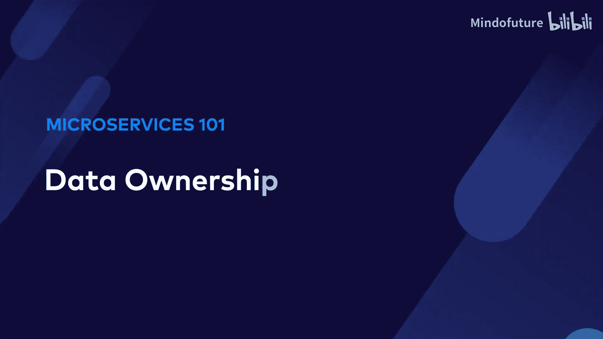
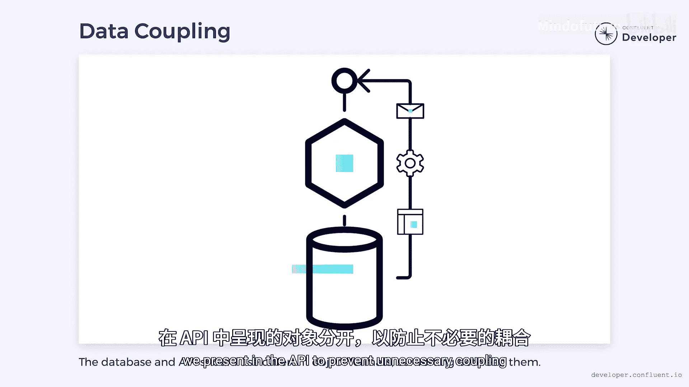

# 005：数据所有权 🗄️

在本节课中，我们将要学习微服务架构中的一个核心原则：数据所有权。我们将探讨为何每个微服务都应拥有并控制其自身的数据，以及如何通过API（如REST或事件流）来实现这一目标，从而避免系统间的紧密耦合和维护噩梦。

## 微服务数据访问的困境

想象一下，如果每个微服务都能随意读写其他服务的数据库，就像一个人能读取他人思想一样。这听起来很强大，但实际上会导致信息过载和混乱。在软件系统中，这意味着每个服务都需要了解其他服务的数据库模式、凭证等细节，从而产生深度耦合，使系统变得难以维护。

许多单体系统就面临这个问题。在糟糕的设计中，软件的任意部分都可能读写数据库的任何部分。每次数据库模式变更，其影响都可能以意想不到的方式波及整个系统。

当多个微服务共享一个数据库时，情况会更糟。变更的影响不再局限于单一代码库，而是可能波及使用不同语言编写、独立部署的多个服务。协调这些服务的变更部署可能导致部分服务停机，管理极其困难，系统演进举步维艰。

## 数据所有权原则

因此，微服务的一个基本原则是：**每个服务应拥有其自身的数据**。

我们可以从马丁·汤普森提出的“单一写入者原则”开始理解。该原则最初指出，数据应由单一的“执行上下文”（如线程）拥有，以避免多个线程写入同一数据库记录时产生的并发与一致性难题。

这一原则可以扩展到微服务领域。我们需要避免多个服务写入同一类数据，否则就必须解决跨所有服务的锁与一致性问题，这会带来一系列我们极力避免的麻烦。

## 读写控制与API契约

但为何只控制写入呢？虽然多个服务读取相同数据对锁和一致性影响较小，但对可维护性影响巨大。如果我们只控制微服务的写入权，那么当我们决定更改数据模式时，仍然需要更新所有的数据读取方。

我们的目标应该是：**每个微服务完全控制其自身数据的读取和写入**。

本·斯托克福德在其著作《设计事件驱动系统》中重新阐述了这一原则。他建议，该原则也应适用于通过Apache Kafka等系统传播的事件。这些事件就像是微服务的API，因此也应由该服务“拥有”。

本质上，如果外部服务需要访问数据，它应始终通过API进行。这可以是REST服务、发布到Kafka的事件，或其他形式。**外部服务绝不应直接访问数据库**，而必须遵守API契约，该契约隐藏了所有实现细节。

可以通过以下方式强制执行此原则：
*   使用数据库权限，将读写访问限制在微服务自身。
*   为每个服务创建独立的数据库。

## 数据所有权的优势

数据所有权带来了诸多优势：
*   **数据隔离**：所有数据都隔离在单个微服务中。这意味着服务可以在内部自由演进，而不会影响其API的客户端。
*   **存储技术自由**：服务在选择如何存储数据时有更多自由。它可以选择存储事件或其他非常规结构，甚至可以使用完全不同的数据库类型。例如，某些服务可以使用文档存储或其他类型的NoSQL数据库，而非关系型数据库。
*   **变更协调更易**：与大多数数据库不同，API可以进行版本控制。可以部署新版本的API，依赖方可以逐步迁移，无需一次性完成所有更改。

## 避免通过API产生耦合

然而，我们必须小心避免通过API产生不必要的耦合。为了减少代码量，我们可能倾向于直接将数据库对象通过API暴露。不幸的是，这会使API与数据库结构耦合，导致我们再次陷入“更改数据库就会影响客户端”的困境。

相反，我们应该明确地将数据库对象与API中呈现的对象分离开来，以防止不必要的耦合。这确保了内部数据表示的灵活性。

## 适应与取舍

对于长期使用单体关系型数据库的开发者来说，适应数据所有权的概念可能比较困难。我们会失去一些能力，例如跨多个领域对象组合数据的查询。

但我们获得了代码更易维护等好处。需要警惕的是，有时会试图构建使用单体数据库的微服务，这有时被称为“微巨石”。然而，这并非兼得两者之优，而是集两者之劣。我们失去了多语言数据存储、更好的可维护性和减少资源争用等特性，换来的却是一个分布式的烂摊子。更好的做法是明确选择一种架构并坚持到底。

## 总结

本节课中，我们一起学习了微服务数据所有权的核心概念。我们了解到，让每个微服务拥有并控制其数据，通过定义良好的API（如事件流）进行交互，是构建松散耦合、易于维护和演进系统的关键。这要求我们放弃直接数据库访问的便利，转而拥抱明确的契约和隔离，从而为系统的长期健康打下坚实基础。