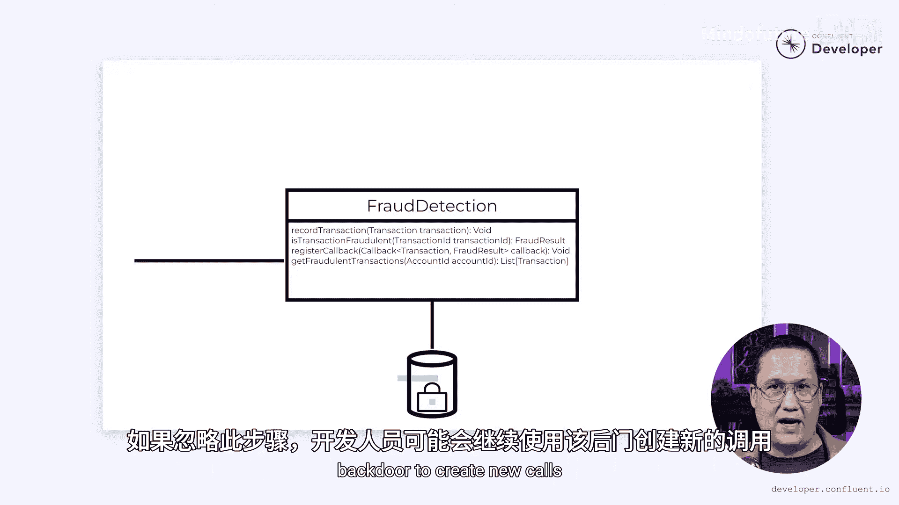

# 006：为欺诈检测定义异步微服务API

## 概述

在本节课中，我们将学习如何为一个计划从单体架构迁移到微服务架构的系统，重新设计其API。我们将以Tributary银行的欺诈检测系统为例，探讨如何将同步API改造为支持异步处理的API，并解决直接数据库访问的问题，为后续提取独立的微服务做好准备。

---

## 现有系统分析

上一节我们介绍了Tributary银行希望从单体架构迁移到微服务架构的背景。本节中，我们来看看他们首先要改造的欺诈检测系统。

Tributary银行希望从单体架构迁移到一组微服务。他们的首要目标是从单体中提取出一个欺诈检测微服务。然而，他们首先需要解决一些棘手的问题。

他们原有的API假设所有操作都会同步完成。然而，一旦他们转向事件驱动微服务，这个假设可能不再成立。如果微服务不可用怎么办？或者欺诈检测耗时超过几毫秒怎么办？

同时，一些开发者绕过了API，直接访问了数据库。一旦提取出微服务，直接数据库访问将不再可行。为了使迁移工作顺利进行，Tributary需要定义一个支持异步处理并限制数据库访问的API。

他们需要在开始将功能迁移到微服务之前，先在现有的单体中引入这个新API。让我们看看他们如何做到这一点。如果你不熟悉Tributary银行，可以查看我们早期分析其转向微服务架构原因的视频，你可以在视频描述中找到链接。

让我们从查看现有的欺诈检测系统开始。我们将剥离大部分功能，专注于分析交易和查看结果。真实的系统会更复杂，但即使这个简单的用例也能教会我们很多。

欺诈检测系统有一个名为 `isFraudulent` 的方法。它接收一个交易作为参数。当该方法被调用时，它会在数据库表中注册该交易。然后执行分析交易的逻辑，考虑任何历史数据。最终，如果怀疑交易是欺诈性的，则返回 `true`，否则返回 `false`。

该方法有三个职责。首先，它必须在数据库中注册每笔交易。其次，它对当前交易进行分析。第三，它返回结果。

将这些职责合并到一个方法中会产生后果。请注意，该方法返回结果。这意味着我们必须等待它完成，这使得这是一个同步操作。这是一个问题，因为欺诈检测正变得越来越复杂和耗时。

由于这必须在每笔交易上执行，这意味着所有这些交易现在都会经历更长的延迟。他们可以尝试加速这些算法，但还有其他问题需要考虑。一旦我们提取出微服务，该服务有可能不可用。在那种情况下，我们原始的交易必须失败，这并不理想。

如果我们能延迟处理交易直到服务再次可用，那会更好。

---

## 设计异步API

上一节我们分析了同步API的问题。本节中，我们来看看如何通过改变暴露的方法来解决这些问题。

我们可以通过修改暴露的方法来开始解决这些问题。

`recordTransaction` 方法接收一个交易作为参数。想象它包含金额等详细信息，以及账户ID和交易ID等标识符。该方法在数据库中注册交易，但注意它不返回结果。相反，实际的分析将异步处理。

当然，如果处理是异步完成的，我们如何获取结果？为此，我们添加 `isTransactionFraudulent` 方法。它只需要一个交易ID，因为其余数据已经记录在数据库中。和之前一样，如果认为交易是欺诈性的，则返回 `true`，否则返回 `false`。

如果我们尚未完成交易处理怎么办？在那种情况下，欺诈状态将是未知的。事实证明，在这种情况下布尔值是不够的，我们需要一个更复杂的欺诈结果对象。

一个包含诸如 `VALID`、`FRAUDULENT` 和 `PENDING` 等值的枚举将为我们提供指示每种可能状态的灵活性。这样，如果 `isTransactionFraudulent` 方法返回一个 `PENDING` 结果，那么我们就知道稍后再检查。

当然，这确实需要我们定期轮询系统以尝试获取结果，这可能不是最高效的选择。另一种方法是使用回调，这样当我们完成结果计算时，可以通知原始的调用者。

当我们转换为微服务时，底层实现会有点棘手，因为它需要一种通知原始单体的方法。一种方法是让单体订阅一个Kafka主题。当微服务完成处理消息时，它可以在该Kafka主题上发送回复来通知单体。

这个API允许欺诈检测系统作为一个异步进程实现。它也不对该进程的所在位置做任何假设。它可以存在于单体内部，但也可以很容易地存在于其他地方。这意味着当Tributary准备好时，他们可以开始将这个接口提取到一个单独的微服务中。

---

## 封装数据库访问

不幸的是，还有一个问题需要解决。当原始API被创建时，其背后的数据库没有得到保护。虽然原始API提供了大量功能，但开发者偶尔会绕过它并执行直接的数据库查询。

我们在这里看到的例子是一个请求，用于查找与特定账户关联的所有欺诈交易。其他开发者在不同地方需要相同的功能，只是简单地复制粘贴了这段代码。结果是这类查询遍布整个单体。

为了解决这个问题，他们需要将这个查询包装在一个函数中，例如 `getFraudulentTransactions`。一旦他们创建了这个函数，就可以开始更慢的过程，即查找其所有用法并将它们转换为此API调用。

代码搜索有望揭示其中的大部分。然而，如果团队使用对象关系映射器，或者查询以各种方式被修改过，那么代码搜索可能会遗漏一些实例。他们可能还会发现查询被修改得足够多，以至于需要新的方法参数、新的返回类型或方法上的其他变体。

最终，他们将达到一个相对自信的阶段，认为已经消除了对数据库的后门调用。在这一点上，重要的一步是限制欺诈检测表的权限，以便只有欺诈检测API可以访问它们。

如果忽略这一步，开发者可能会继续使用那个后门来创建新的调用。一个额外的好处是，这可以验证代码中是否还隐藏着任何其他调用。禁用访问权限，然后运行欺诈检测组件的自动化或手动测试，应该能揭示出任何绕过API访问这些表的剩余位置。

只需确保在将此代码投入生产之前运行并修复这些测试。

---

## 总结与注意事项

现在，让我们明确几件事。我举了一个从单体中提取API的相对简单的例子。现实情况不会这么简单。这些问题必然存在多种潜在的解决方案，其中许多可能比我在这里概述的更好。如果你看到改进的机会，我很乐意在评论中听到你的意见。

此外，在真实系统中，可能需要处理数十个方法调用，而不仅仅是少数几个。将调用从同步转换为异步将对用户界面产生影响。所有这一切都必须在实时系统中完成，且不能导致服务中断或问题。

但我想说明的一点是，要做到这一点，你必须有条不紊，采取小而计划周密的步骤，并慢慢地演进你的系统，使其具备以后可以提取到微服务中的特性。然后，当需要提取微服务时，再次寻找你可以采取的小步骤。试图一次性完成所有事情通常会导致更多问题、更多失败和更多时间。

在未来的视频中，我们将看看这个过程中的一些后续步骤，并了解如何安全高效地完成它们。如果你想继续跟随我学习，请确保点赞、分享和订阅，并请关注下一个视频。

