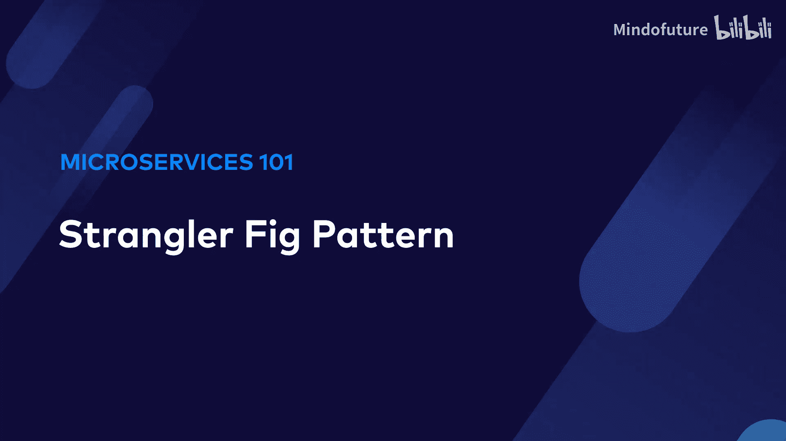
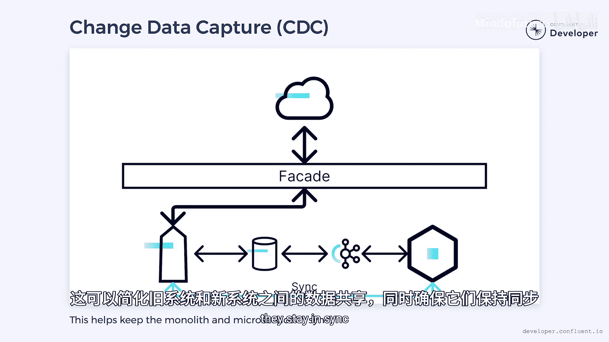

# 007：绞杀者模式 🪴




在本节课中，我们将要学习一种名为“绞杀者模式”的软件架构设计模式。这种模式借鉴了自然界中绞杀榕树的生长方式，用于指导我们如何安全、渐进地将一个庞大的单体应用重构为现代化的微服务架构。

## 模式灵感来源 🌳

在热带雨林深处，生长着一种名为绞杀榕的植物。它的种子落在宿主树木的高处枝干上，并开始生长。随着榕树长大，它的根向下延伸，枝干则向天空伸展。很快，它便开始与宿主树争夺维持生命所必需的光照和养分。

绞杀榕缠绕着宿主树，慢慢地使其“窒息”。宿主树有时会死亡，最终只留下榕树本身。这种榕树便是“绞杀者模式”的灵感来源，该模式最初由 Martin Fowler 提出。

## 为何需要绞杀者模式？🤔

上一节我们了解了模式的灵感来源，本节中我们来看看它在软件工程中的具体应用场景。许多微服务是为了替换现有的单体应用而构建的。实现这一目标有不同的方法。

一种选择是使用微服务架构完全重写整个单体应用。然而，这种做法风险很高，因为在能够交付业务价值之前需要花费很长时间。本质上，你必须替换整个单体应用后才能看到努力的价值。

任何软件项目的最大风险是时间，特别是交付业务价值的时间。随着时间增加，成本和失败的可能性也会增加。事实上，这种整体替换是“单体思维”的一种形式。我们的目标应该是找到缩短交付时间的方法，以降低风险。

我们需要转向微服务思维模式，这意味着思考更小、更迭代。

## 绞杀者模式如何工作？🔧

上一节我们讨论了整体替换的风险，本节中我们来看看绞杀者模式的具体工作流程。绞杀者模式的核心思想是：与其试图一次性替换整个单体应用，不如一次只专注于替换几个功能。

以下是实施该模式的关键步骤：

1.  **引入外观层**：在我们试图替换的系统前插入一个外观（Facade）层。
2.  **路由流量**：将所有通信转移到此前置的外观层。
3.  **逐步替换**：当我们准备好投入生产时，开始使用新架构一次重新实现几个功能。
4.  **切换流量**：将外观层的指向从旧系统切换到新系统，但仅针对已替换的少数功能。
5.  **迭代循环**：完成后，对另一组功能重复此过程。

随着每个功能被新系统替换，旧系统开始萎缩。流向旧系统的流量被移除，其部分功能可以被关闭或删除。慢慢地，单体应用逐渐缩小，直到只剩下其前身的一小部分。在理想情况下，你最终会完全缩小单体应用并能够将其关闭。

## 模式的优势与挑战 ⚖️

通过以较小的块替换功能，我们能够迭代地发布新的业务价值。这缩短了我们的交付时间并降低了风险。这就是我们称之为绞杀者模式的原因。就像榕树一样，存在对资源的竞争。在这种情况下，竞争的是应用流量。新架构通过使用外观层将自己包裹在旧系统周围。我们的目标是“饿死”旧系统，使其在被完全替换后最终消亡。

然而，在使用绞杀者模式时，我们需要注意一些事项。

以下是实施过程中可能遇到的挑战：

*   **适配器管理**：我们替换的每个系统都可能需要我们创建一个适配器来将请求路由到正确的地方。我们可能会陷入试图同时替换过多功能的境地，最终导致适配器过多而难以管理。
*   **回滚计划**：一旦我们从旧系统切换到新系统，可能会发现未预料到的问题。制定一个回滚计划对于确保我们能从任何潜在的故障中恢复至关重要。
*   **外观层构建**：绞杀者模式最大的挑战之一是它依赖于能够构建一个清晰的外观层。遗留系统通常作为复杂的依赖关系网存在，深深嵌入数据库。提取一个干净的外观层可能是一项漫长而艰巨的任务。

## 事件驱动架构的助力 🚀

事件驱动架构可以提供一些帮助。我们可以将变更数据捕获（CDC）系统连接到我们的数据库。来自数据库的变更事件可以被送入类似 **`Kafka`** 主题的地方，供新的微服务消费。

这可以简化新旧系统之间的数据共享，同时确保它们保持同步。例如，我们可以使用以下伪代码概念来描述数据流：

```sql
-- 在数据库层面捕获变更
CDC_Capture(Old_Database) -> Kafka_Topic



-- 新微服务消费变更事件
New_Microservice <- Consume(Kafka_Topic)
```

## 总结与适用性 📝

本节课中我们一起学习了绞杀者模式。绞杀者模式并非一种放之四海而皆准的方法。在尝试将大型系统迁移到新架构时，它可能非常有用。

然而，对于较小的系统，直接替换整个系统可能更有意义。需要问的关键问题是：哪种方法能在最短的时间内交付业务价值？很可能，哪个选项能减少时间，哪个就是正确的选择。


绞杀者模式为我们提供了一条风险可控、价值可期的渐进式重构之路，是微服务迁移过程中的重要策略之一。