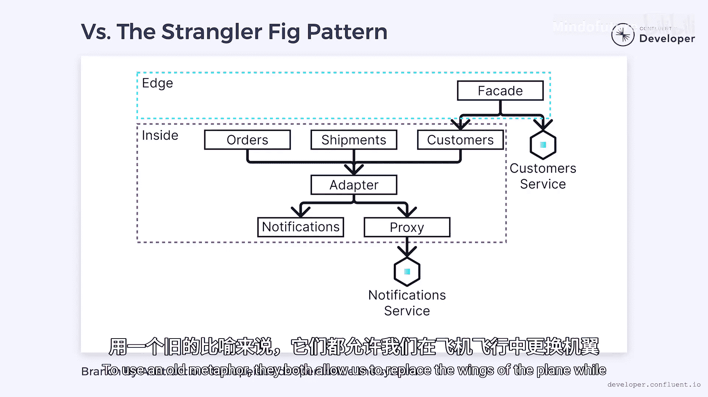

# 008：抽象分支模式 🛠️

在本节课中，我们将要学习一种在将单体应用分解为一系列微服务时非常有用的模式——**抽象分支模式**。我们将探讨其工作原理、应用方法以及它与相关模式的区别。

## 概述

抽象分支模式是一种用于逐步替换系统功能的低风险技术。它通过在代码中创建抽象层，而非在源代码控制中创建分支，来实现新旧实现的并行运行与平滑切换。

上一节我们介绍了微服务分解的背景，本节中我们来看看如何通过抽象分支模式安全地进行重构。

## 传统分支方法的问题

在传统架构中，当我们想要替换现有功能时，一种常见的方法是创建一个新的源代码控制分支。我们在新分支中重新实现功能，并进行测试。准备就绪后，将更改合并到主分支并部署到生产环境，从而用新实现替换旧实现。

然而，这种方法存在几个问题：
*   如果新实现需要很长时间构建，主分支的代码不会停止演进，它会与工作分支的代码产生分歧或漂移。
*   当我们准备合并时，可能会因为代码漂移而面临混乱的合并过程。
*   如果部署到生产环境，我们可能会发现未预料到的问题，例如意外的负载、未捕获的bug，或者在我们工作期间发生的代码漂移。
*   此时我们必须回滚更改并修复问题，然后重新部署。在修复期间，代码继续漂移，可能引入新的问题。

因此，我们如何知道何时完成？如何保证新代码产生与旧代码相同的结果？如何确保它不会造成生产问题？理想情况下，我们应有一套测试套件来验证其工作，但这些测试很少能像我们需要的那样全面。

## 抽象分支模式详解

如果不使用源代码控制分支，我们可以通过抽象层在代码中创建一条分支路径。想象一个分解为订单、发货和客户模块的电子商务系统，它们都存在于同一个单体应用中，并且这三个模块都依赖另一个组件来处理通知。我们如何将这些通知提取到自己的微服务中？

以下是实施抽象分支模式的步骤：

1.  **插入适配器**：首先，在我们想要替换的代码（本例中是通知功能）前面插入一个**适配器**。所有对旧代码的调用都通过这个适配器路由。
2.  **构建新实现**：然后，在旧实现旁边构建一个新的实现。如果是在分解单体应用，那么新实现可以是一个**代理**，负责调用我们的通知微服务。
3.  **并行运行与切换**：我们继续使用旧实现服务请求，直到准备就绪。一旦微服务完成，我们可以将适配器切换到指向代理。
4.  **清理旧代码**：切换完成后，我们就可以开始清理旧代码，并可能移除适配器。

这种技术就是我们所说的**抽象分支模式**。它允许我们增量式地进行更改，并持续地将它们合并到主源代码控制分支，而无需承担风险。它是被称为**基于主干的开发**的更大技术集合的一部分，这减少了在长期分支上工作时可能出现的混乱合并风险。

## 测试与验证优势

与源代码控制分支不同，抽象分支允许新旧两个版本的代码同时存在于生产环境中。这意味着我们可以调用新代码、旧代码或同时调用两者。

我们可以利用这一点进行A/B测试。例如，我们可以将大部分流量发送到旧系统，但将其中一部分路由到新系统。这使我们只让一部分用户接触新系统。

或者，我们可以同时调用两个系统并比较结果。然后记录任何差异并随时间监控它们。这让我们可以看到我们离完成还有多远。

在测试阶段，我们始终从旧系统返回结果。但一旦我们的准确率超过特定阈值，我们就切换实现，从新系统返回结果。这是一种对系统进行实时测试的低风险方式，因此当我们准备切换时，希望已经消除了所有问题。

## 与绞杀者模式的比较

抽象分支模式与**绞杀者模式**有很多相似之处，后者也用于分解单体应用。两者都涉及插入抽象层并在新旧实现之间切换。

需要注意的是，在复杂系统中创建抽象层可能具有挑战性。

两者的主要区别在于：
*   绞杀者模式设计用于单体应用的**边缘**，包裹在其外部。
*   抽象分支模式可以用于单体应用**内部更深层**的任何位置，只要你想将请求发送到外部微服务。

然而，两种方法都允许我们在系统处于生产状态时替换单体应用的功能。用一个古老的比喻来说，它们都允许我们在飞机飞行时更换它的机翼。

## 总结

本节课中我们一起学习了**抽象分支模式**。它是一种通过代码抽象层而非源代码分支，来安全、渐进地替换系统功能的技术。其核心优势在于支持新旧实现并行运行、便于实时测试与验证（如A/B测试和结果对比），并能持续集成，降低了长期分支带来的合并风险。它与绞杀者模式目标相似，但应用层次更深。该模式为在“飞行中更换飞机机翼”——即不停机重构单体应用——提供了强有力的方法论支持。