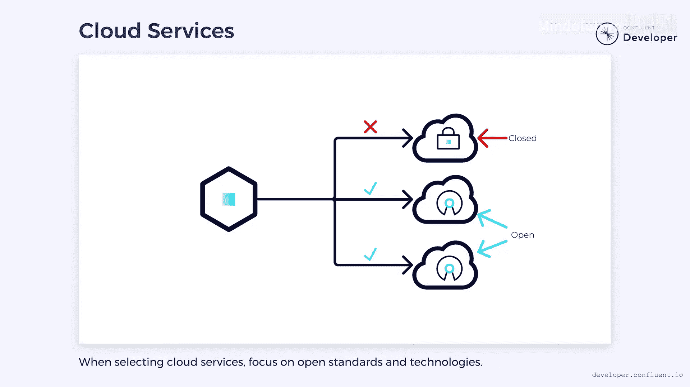

# 009：多语言架构 🏗️

在本节课中，我们将要学习多语言架构的概念，了解它如何为微服务开发带来灵活性与挑战，并探讨如何在实际项目中平衡技术选择。

---

## 概述

多语言架构允许开发团队根据具体任务选择最合适的编程语言和数据库技术，而不是被单一技术栈所限制。这种自由可以激发创造力并吸引顶尖人才，但也可能带来维护和招聘上的复杂性。

---

## 单体架构的限制

上一节我们介绍了微服务的基本概念，本节中我们来看看传统单体架构的局限性。

单体系统通常基于一个单一的可部署单元。虽然可以将其拆分为多个独立部署的库，但最终它们仍作为一个单一实例运行。这通常意味着整个单体应用使用单一的技术栈编写，例如完全使用 **Java** 和关系型数据库。

尽管 **JVM** 支持 **Kotlin** 或 **Scala** 等语言，带来了一定灵活性，但我们不太可能在一个 **Java** 单体应用中看到用 **Python** 编写的组件。这可能会限制创造力。正如那句老话所说：“当你只有一把锤子时，看什么都像钉子。” 如果团队只有 **Java** 和关系型数据库，那么解决问题的方式往往会局限于这些技术的常见模式。

---

## 微服务与多语言编程

微服务不受相同限制的约束。由于它们是独立部署的，我们不会被限定在单一的编程语言或平台上。

我们可能选择用 **Java** 和其他 **JVM** 语言构建系统的大部分。然而，**Python** 已迅速成为数据科学家的首选。因此，对于专门处理数据科学的系统部分，我们可能会选择 **Python**。

2006年，**Neil Ford** 使用“多语言编程”一词来指代使用多种编程语言构建系统的理念。这个词源于希腊语“poly”（意为“多”）和“glotta”（意为“舌头”，此处指“语言”）。其核心理念是赋予开发者自由，让他们为工作选择最佳工具，而不是总用一把锤子——有时我们可以改用螺丝刀。

---

## 多语言架构的扩展

然而，自2006年以来，事物已经发展，“多语言架构”一词所涵盖的范围已不止编程语言。

以下是多语言架构涵盖的两个主要方面：

1.  **多语言持久化**：允许服务选择最适合工作的数据库。有些工作负载事务性很强，适合使用在线事务处理数据库。另一些工作负载则更具分析性，适合使用在线分析处理数据库。如果我们限制自己只使用一种数据库，最终可能会选择一个擅长事务处理但不擅长分析（或反之）的数据库。通过多语言持久化，我们甚至可以考虑文档存储、事件存储或其他类型的数据库。每个微服务都可以使用最适合其工作的技术。
2.  **技术栈自由**：通过允许自由选择使用何种技术，它为招聘特定任务的最佳人才打开了大门。通常，最优秀的人才对使用最好的工具感兴趣。如果他们看到一个职位使用的是较差的工具集，他们可能会决定另寻他处。确保工具与工作相匹配可以使公司对候选人更具吸引力。

---

## 多语言架构的挑战

然而，这可能是一把双刃剑。公司内部工具的激增可能使得招聘跨越微服务边界的职位变得困难。找到一个精通所有技术的独特个体可能是不可能的。

此外，随着公司的发展，人员往往会离开，并带走他们的专业知识。这可能导致公司留下一堆微服务，而其中的专家早已离开。替换这些专家可能具有挑战性，并可能导致系统崩溃。

---

## 平衡策略：有限的多语言方法

为了帮助缓解这些挑战，公司通常会采用一种更有限的多语言方法。

与其允许自由选择任何技术，不如设定一个经过批准的、有限的技术子集。在这个列表内，团队可以自由选择他们想要使用的技术。然而，如果他们想使用批准选项之外的技术，则需要提出特殊申请。

采用这种有限的方法仍然允许一定的灵活性和创造性，但限制了过多技术同时使用所带来的影响。

---

## 技术选择建议

在选择技术时，选择那些支持多语言架构的技术是一个好主意。避免“围墙花园”，转而寻找与多种技术兼容的开放标准。

像 **REST**、**gRPC** 等工具提供了丰富的库，可以在多种语言之间进行通信。像 **Apache Kafka** 这样的事件驱动系统可以提供连接器，帮助在微服务和存储系统之间移动数据。

然而，依赖开放标准和技术并不意味着不能使用基于云的服务。事实上，在多语言架构中，云服务可以带来好处，因为它们通常能最大限度地减少维护负担。本质上，它们降低了采用新技术的成本，使得实施多语言架构变得更加容易。

但在选择云服务时，请关注那些基于开放标准和开源技术的服务，以避免被锁定。请记住，目标是为开发者提供灵活性，避免不必要的限制。

---

## 总结

本节课中我们一起学习了多语言架构。它通过允许为不同任务选择最合适的编程语言和数据库，为微服务开发带来了巨大的灵活性和潜力。这有助于解决特定问题并吸引人才。然而，不受限制的技术自由会带来维护复杂性和人才招聘的挑战。通过采用有限的多语言方法，并优先选择基于开放标准的技术，我们可以在享受灵活性的同时，有效管理其带来的风险。