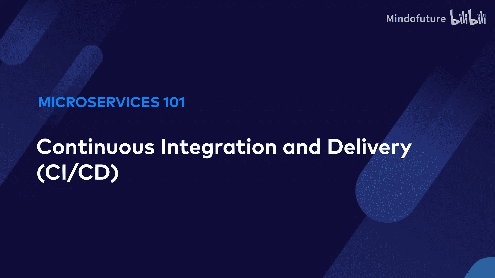
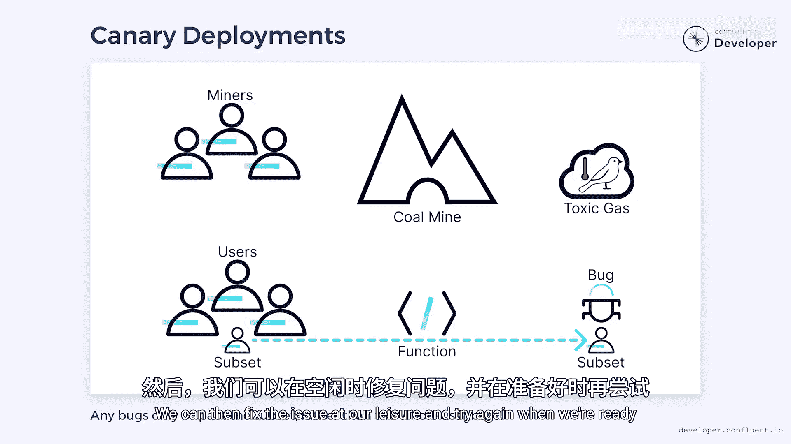

# 010：持续集成与持续交付 (CI/CD) 🚀

在本节课中，我们将要学习如何通过持续集成与持续交付来加速微服务的开发与发布流程。我们将探讨如何构建自动化测试、实现自动部署，并最终将发布变成一个常规、低风险的事件。

---

## 传统发布流程的挑战

软件开发通常包含漫长的发布周期和大量的手动测试。

但对于微服务而言，我们的目标之一是提高开发速度，这意味着需要缩短交付时间。

你是否经历过漫长的发布过程？它通常需要代码冻结，以避免在发布期间出现意外的变更。所有计划中的变更会被合并到主分支。然后，我们对合并后的代码执行一系列测试，其中常常包括手动测试。最终，我们将应用程序发布到生产环境。

然而，没有测试套件是完美的，因此我们可能会发现一些未预料到的问题。现在，我们必须回滚部署、修复问题，并再次经历整个流程。

---

## 迈向自动化：构建可靠的测试套件

上一节我们介绍了传统发布流程的痛点，本节中我们来看看如何通过自动化来解决问题。

第一步是认识到手动测试会使发布变得困难。它需要开发者、测试人员和管理发布流程的人员之间进行协调。为了避免这种情况，我们需要确保自动化测试套件能够保证我们期望的行为。

一个好的测试套件应包含所有能让我们对代码有信心的内容。测试金字塔的底层通常是**单元测试**，大部分测试会写在这里。随着你沿着金字塔向上，通过不同类型的测试，所需的数量会减少，但覆盖的代码广度和复杂性会增加。

端到端测试通常比典型的单元测试更难编写。

构建这个测试套件可能需要转变态度。每当我们执行一次手动测试时，都应该问自己它能否被自动化。目标应该是用自动化版本取代所有手动测试。

如果我们发现应用程序中的一个错误，我们应该问为什么没有测试能捕获它。然后，我们坐下来编写那个测试。本质上，修复任何错误的第一步就是编写能防止它的测试。

这最终会形成一个日益健壮的测试套件，最终可以取代手动测试的需求。

---

## 持续集成 (CI)

持续集成是一种将所有开发工作合并到主线分支并对其执行自动化测试的实践。其理念是，每当开发者提交代码时，我们都可以运行健壮的测试套件来验证没有破坏任何东西。

这通常使用持续集成工具来完成，例如 **GitHub Actions** 或 **Jenkins**。

然而，无论是手动还是自动化的测试套件都不是完美的。问题最终会悄悄进入生产环境。当它们出现时，我们需要准备好快速修复。

---

## 持续交付 (CD)

正如手动测试会拖慢我们一样，手动部署也是如此。与测试类似，我们需要采取不同的态度。

在部署过程中，每当我们执行一个手动步骤时，都需要问它能否被自动化，然后我们需要坐下来实现它。最终，我们将达到所有步骤都已自动化，并且可以一键执行的程度。

但一旦我们达到这一步，就会引出一个合乎逻辑的问题：如果部署到生产环境只需要一个按钮，为什么不消除这个按钮，而是在每次提交时都自动部署呢？

这就是我们所说的**持续交付**。它是在每次提交后自动部署软件的实践。使用它需要一个健壮的持续集成流水线，以确保问题在到达生产环境之前就被捕获。

当我第一次开始做持续部署时，感觉相当可怕。但在某个时刻，我不得不问自己这种恐慌来自哪里。如果我对我的测试有信心，那么就没有理由不每次提交都部署。如果我对我的测试没有信心，那么这似乎是一个值得解决的问题。

---

## 部署与发布的区别

但如果不是缺乏信心的情况呢？有时我们编写的代码是团队其他成员需要的。它可能尚未完成，但已经足够我们分享。

通常，我们会推送到主分支，以便队友可以拉取变更。然而，我们必须记住，一旦我们合并了变更，它们就会进入生产环境。

在这里，认识到**部署**和**发布**之间的区别很重要。

当代码在生产服务器上可用时，即使没有被使用，它就已经被**部署**了。当代码既可用又处于活跃使用状态时，它才被**发布**到生产环境。这是一个重要的区别。

我们需要接受我们提交的任何代码都会自动进入生产环境，但这并不意味着它必须被发布。我们可以使用诸如**功能开关**、**绞杀者无花果模式**和**抽象分支**等技术来确保新代码不被使用。

然后，我们可以使用**金丝雀部署**以可控的方式发布新代码。

让我解释一下。当煤矿工人下井时，他们面临潜在的致命威胁。在矿井深处，有毒气体会聚集在气穴中，矿工通常无法检测到。为了找到这些气穴，矿工会把金丝雀带入矿井。如果金丝雀出现生病迹象，那么矿工就知道存在威胁。这是一种残酷的安全检查方式，但很有效。

在软件中，我们使用金丝雀部署来达到类似的目的。当新功能被部署时，我们可以将这些功能发布给一部分用户。通过只授予少量用户访问权限，我们减少了任何错误的影响。就像在煤矿中一样，我们无法保护所有人，但我们确实减轻了一些风险。

使用金丝雀部署，当发现问题时，我们不必回滚整个部署，而只需将所有用户切换回旧代码。然后，我们可以从容地修复问题，并在准备好时再次尝试。

---

## 心态的转变

这种工作流程的一个奇怪副作用是，它开始改变我们对部署的态度。

在更传统的流水线中，部署会带来焦虑，因为团队试图让一切恰到好处。在 CI/CD 流水线中，部署变成了常规操作。我们不再为每次部署代码而恐慌，反而开始害怕不部署。我们学会接受，直到代码被发布，它都没有交付价值，并且可能隐藏着问题。换句话说，它在开发中停留的时间越长，我们的信心就越低。

发布代码变成了治愈我们恐惧的方法，而不是恐惧的根源。

---

## 总结

本节课中，我们一起学习了如何通过构建自动化测试套件、实施持续集成和持续交付，将微服务的发布流程从高风险、高焦虑的事件转变为常规、可控的日常操作。我们理解了部署与发布的区别，并探讨了金丝雀部署等策略来安全地发布新功能。最终，CI/CD 不仅提升了开发速度，也改变了团队对软件交付的根本态度。